# API 参考

<cite>
**本文引用的文件**
- [src/types.ts](file://src/types.ts)
- [src/canvas/nodes/nodeTypes.ts](file://src/canvas/nodes/nodeTypes.ts)
- [src/canvas/edges/edgeTypes.ts](file://src/canvas/edges/edgeTypes.ts)
- [src/store/canvasStore.ts](file://src/store/canvasStore.ts)
- [src/components/InspectorPanel.tsx](file://src/components/InspectorPanel.tsx)
- [src/io/fileLoader.ts](file://src/io/fileLoader.ts)
- [src/io/importExport.ts](file://src/io/importExport.ts)
- [src/media/mediaCoordinator.ts](file://src/media/mediaCoordinator.ts)
- [src/media/playlists.ts](file://src/media/playlists.ts)
- [src/media/blobRegistry.ts](file://src/media/blobRegistry.ts)
- [src/sync/cloudSync.ts](file://src/sync/cloudSync.ts)
- [src/sync/lanClient.ts](file://src/sync/lanClient.ts)
- [src/store/projectStore.ts](file://src/store/projectStore.ts)
- [src/store/uiStore.ts](file://src/store/uiStore.ts)
</cite>

## 目录
1. [简介](#简介)
2. [项目结构](#项目结构)
3. [核心组件](#核心组件)
4. [架构总览](#架构总览)
5. [详细组件分析](#详细组件分析)
6. [依赖关系分析](#依赖关系分析)
7. [性能考虑](#性能考虑)
8. [故障排查指南](#故障排查指南)
9. [结论](#结论)
10. [附录](#附录)

## 简介
本 API 参考文档面向集成方与二次开发者，系统化梳理画布、节点类型、边缘类型、状态管理、媒体处理、导入导出、云端/局域网同步等核心接口。文档提供 TypeScript 类型定义说明（含继承关系、可选属性、枚举值）、版本兼容策略、常见集成模式与最佳实践，以及错误处理与异常场景的应对方式。

## 项目结构
- 类型与模型：集中定义在 types.ts，统一描述媒体种类、节点数据、边样式等。
- 画布与渲染：基于 ReactFlow，节点类型注册在 nodeTypes.ts，边类型注册在 edgeTypes.ts。
- 状态管理：使用 Zustand 维护画布状态（canvasStore）、项目状态（projectStore）、UI 状态（uiStore）。
- 媒体处理：资源获取与缓存（blobRegistry）、播放互斥（mediaCoordinator）、歌单解析（playlists）。
- 导入导出：本地/云端项目序列化与反序列化（importExport.ts），文件导入与节点创建（fileLoader.ts）。
- 同步协作：云端存储（cloudSync.ts）与局域网协作（lanClient.ts）。

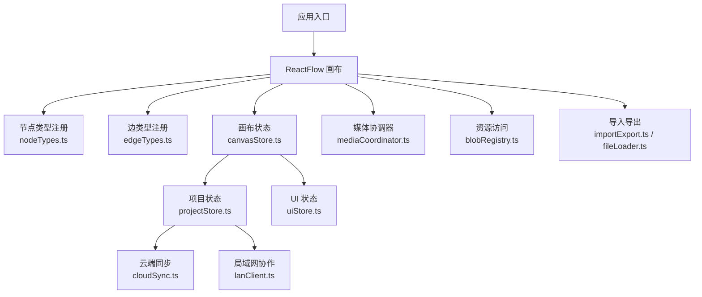

图表来源
- [src/canvas/nodes/nodeTypes.ts:1-27](file://src/canvas/nodes/nodeTypes.ts#L1-L27)
- [src/canvas/edges/edgeTypes.ts:1-7](file://src/canvas/edges/edgeTypes.ts#L1-L7)
- [src/store/canvasStore.ts:1-399](file://src/store/canvasStore.ts#L1-L399)
- [src/store/projectStore.ts:1-230](file://src/store/projectStore.ts#L1-L230)
- [src/store/uiStore.ts:1-121](file://src/store/uiStore.ts#L1-L121)
- [src/media/mediaCoordinator.ts:1-25](file://src/media/mediaCoordinator.ts#L1-L25)
- [src/media/blobRegistry.ts:1-389](file://src/media/blobRegistry.ts#L1-L389)
- [src/io/importExport.ts:1-203](file://src/io/importExport.ts#L1-L203)
- [src/io/fileLoader.ts:1-297](file://src/io/fileLoader.ts#L1-L297)
- [src/sync/cloudSync.ts:1-165](file://src/sync/cloudSync.ts#L1-L165)
- [src/sync/lanClient.ts:1-800](file://src/sync/lanClient.ts#L1-L800)

章节来源
- [src/types.ts:1-112](file://src/types.ts#L1-L112)
- [src/canvas/nodes/nodeTypes.ts:1-27](file://src/canvas/nodes/nodeTypes.ts#L1-L27)
- [src/canvas/edges/edgeTypes.ts:1-7](file://src/canvas/edges/edgeTypes.ts#L1-L7)
- [src/store/canvasStore.ts:1-399](file://src/store/canvasStore.ts#L1-L399)
- [src/store/projectStore.ts:1-230](file://src/store/projectStore.ts#L1-L230)
- [src/store/uiStore.ts:1-121](file://src/store/uiStore.ts#L1-L121)
- [src/media/mediaCoordinator.ts:1-25](file://src/media/mediaCoordinator.ts#L1-L25)
- [src/media/blobRegistry.ts:1-389](file://src/media/blobRegistry.ts#L1-L389)
- [src/io/importExport.ts:1-203](file://src/io/importExport.ts#L1-L203)
- [src/io/fileLoader.ts:1-297](file://src/io/fileLoader.ts#L1-L297)
- [src/sync/cloudSync.ts:1-165](file://src/sync/cloudSync.ts#L1-L165)
- [src/sync/lanClient.ts:1-800](file://src/sync/lanClient.ts#L1-L800)

## 核心组件
- 类型系统：MediaKind、SuqNodeData、SuqEdgeData、EdgeStyle 等，构成节点与边的数据契约。
- 画布 API：节点增删改、边连接、视图控制、对齐/层级、撤销重做、剪贴板。
- 节点/边类型：媒体节点集合与可配置边样式。
- 媒体处理：资源 URL/Blob 获取、封面生成、播放互斥、歌单线性化。
- 导入导出：项目打包/解包、版本校验、云/本地持久化。
- 同步协作：云端项目/素材元数据同步；局域网实时协作、分片传输、视口同步。

章节来源
- [src/types.ts:1-112](file://src/types.ts#L1-L112)
- [src/canvas/nodes/nodeTypes.ts:1-27](file://src/canvas/nodes/nodeTypes.ts#L1-L27)
- [src/canvas/edges/edgeTypes.ts:1-7](file://src/canvas/edges/edgeTypes.ts#L1-L7)
- [src/store/canvasStore.ts:1-399](file://src/store/canvasStore.ts#L1-L399)
- [src/media/playlists.ts:1-179](file://src/media/playlists.ts#L1-L179)
- [src/io/importExport.ts:1-203](file://src/io/importExport.ts#L1-L203)
- [src/sync/cloudSync.ts:1-165](file://src/sync/cloudSync.ts#L1-L165)
- [src/sync/lanClient.ts:1-800](file://src/sync/lanClient.ts#L1-L800)

## 架构总览
下图展示从用户操作到状态更新、媒体加载与同步的关键路径。

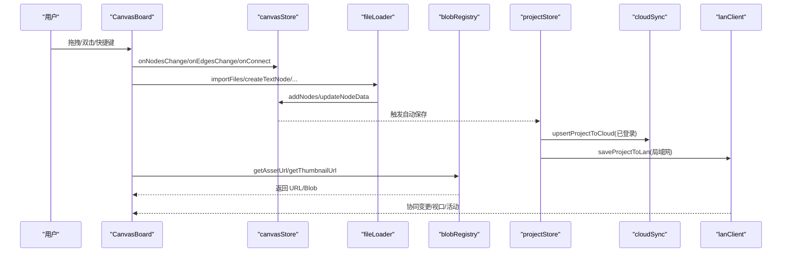

图表来源
- [src/canvas/CanvasBoard.tsx:1-459](file://src/canvas/CanvasBoard.tsx#L1-L459)
- [src/store/canvasStore.ts:1-399](file://src/store/canvasStore.ts#L1-L399)
- [src/io/fileLoader.ts:1-297](file://src/io/fileLoader.ts#L1-L297)
- [src/media/blobRegistry.ts:1-389](file://src/media/blobRegistry.ts#L1-L389)
- [src/store/projectStore.ts:1-230](file://src/store/projectStore.ts#L1-L230)
- [src/sync/cloudSync.ts:1-165](file://src/sync/cloudSync.ts#L1-L165)
- [src/sync/lanClient.ts:1-800](file://src/sync/lanClient.ts#L1-L800)

## 详细组件分析

### 类型系统与数据模型
- MediaKind：支持 image/video/audio/pdf/psd/markdown/text/file/heading/sticky/shape。
- SuqNodeData：节点通用数据字段，包含 kind、assetId、文本/样式/尺寸/创作信息等。
- SuqEdgeData：边数据，包含 style（线型/路径/箭头/颜色/粗细）与 order（音频分叉播放顺序）。
- EdgeStyle：默认样式常量 DEFAULT_EDGE_STYLE。
- 类型别名：SuqNode、SuqEdge、AnyNode、CanvasViewport。

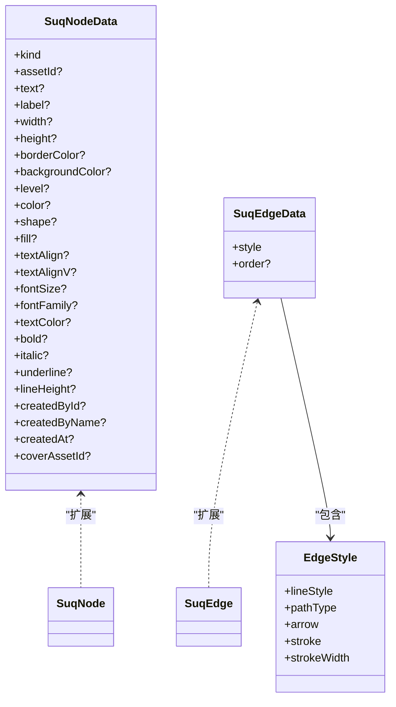

图表来源
- [src/types.ts:1-112](file://src/types.ts#L1-L112)

章节来源
- [src/types.ts:1-112](file://src/types.ts#L1-L112)

### 画布 API（节点/边/视图/历史）
- 节点操作：addNodes、updateNodeData、duplicateNode、removeAssets、alignSelected、changeNodeLayer、setNodeZIndex。
- 边操作：onConnect、updateEdgeData。
- 视图：viewport、setViewport、fitView/zoomIn/zoomOut（通过 ReactFlow 暴露）。
- 历史：undo、redo、clearHistory（带防抖快照与删除即时落盘）。
- 剪贴板：copySelected、pasteClipboard（复制选中节点及关联边）。

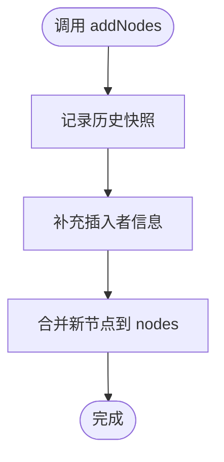

图表来源
- [src/store/canvasStore.ts:159-171](file://src/store/canvasStore.ts#L159-L171)

章节来源
- [src/store/canvasStore.ts:1-399](file://src/store/canvasStore.ts#L1-L399)
- [src/components/InspectorPanel.tsx:1-800](file://src/components/InspectorPanel.tsx#L1-L800)

### 节点类型 API
- 媒体节点类型映射：image/video/audio/fileCard/text/markdown/pdf/psd/heading/sticky/shape。
- 节点创建工厂：createTextNode、createHeadingNode、createStickyNode、createShapeNode、createNodeForAsset。
- 节点默认尺寸与占位信息。

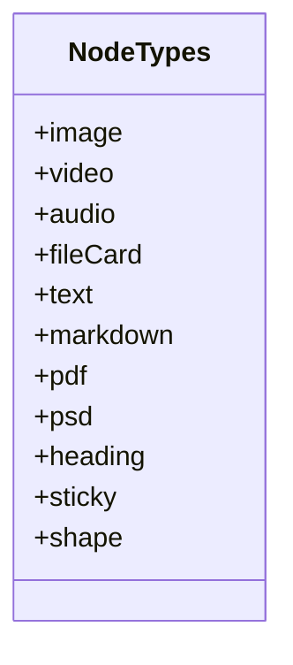

图表来源
- [src/canvas/nodes/nodeTypes.ts:1-27](file://src/canvas/nodes/nodeTypes.ts#L1-L27)
- [src/io/fileLoader.ts:151-297](file://src/io/fileLoader.ts#L151-L297)

章节来源
- [src/canvas/nodes/nodeTypes.ts:1-27](file://src/canvas/nodes/nodeTypes.ts#L1-L27)
- [src/io/fileLoader.ts:1-297](file://src/io/fileLoader.ts#L1-L297)

### 边类型 API
- 边类型：styled（可配置线型/路径/箭头/颜色/粗细）。
- 默认样式：DEFAULT_EDGE_STYLE。
- 编辑器交互：InspectorPanel 中批量修改选中边样式与播放顺序。

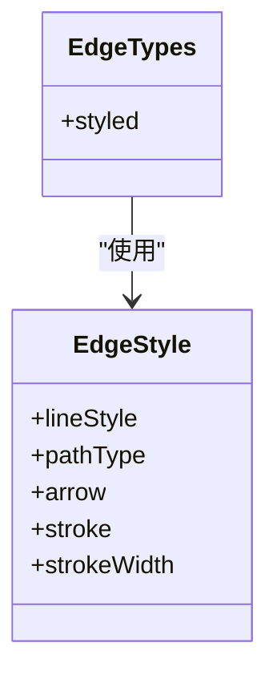

图表来源
- [src/canvas/edges/edgeTypes.ts:1-7](file://src/canvas/edges/edgeTypes.ts#L1-L7)
- [src/types.ts:46-64](file://src/types.ts#L46-L64)
- [src/components/InspectorPanel.tsx:352-473](file://src/components/InspectorPanel.tsx#L352-L473)

章节来源
- [src/canvas/edges/edgeTypes.ts:1-7](file://src/canvas/edges/edgeTypes.ts#L1-L7)
- [src/types.ts:46-64](file://src/types.ts#L46-L64)
- [src/components/InspectorPanel.tsx:352-473](file://src/components/InspectorPanel.tsx#L352-L473)

### 状态管理 API（Zustand Stores）
- canvasStore：画布图数据、视图、历史、剪贴板、对齐/层级、资产清理。
- projectStore：项目生命周期（init/load/new/rename/saveNow）、自动保存、云端/本地选择。
- uiStore：工具模式、弹窗/播放器状态、Toast、导入队列。

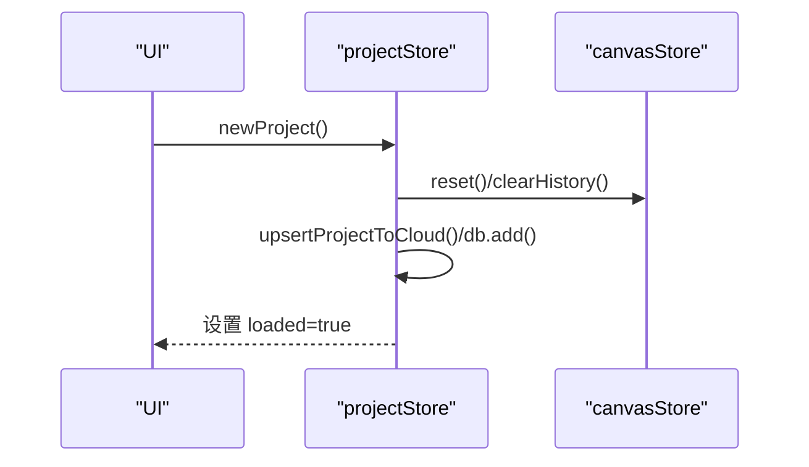

图表来源
- [src/store/projectStore.ts:149-182](file://src/store/projectStore.ts#L149-L182)
- [src/store/canvasStore.ts:395-399](file://src/store/canvasStore.ts#L395-L399)

章节来源
- [src/store/canvasStore.ts:1-399](file://src/store/canvasStore.ts#L1-L399)
- [src/store/projectStore.ts:1-230](file://src/store/projectStore.ts#L1-L230)
- [src/store/uiStore.ts:1-121](file://src/store/uiStore.ts#L1-L121)

### 媒体处理 API
- 资源访问：getAssetUrl、getAssetBlob、getThumbnailUrl、invalidate* 系列。
- 视频封面：并发限制、跨源抓取、黑帧检测与重试、HTTP Range 流式地址优先。
- 播放互斥：同一时刻最多一个音频和一个视频同时播放。
- 歌单解析：从命名文本节点出发，沿音频→音频边 DFS 线性化，支持 order 排序与去重告警。

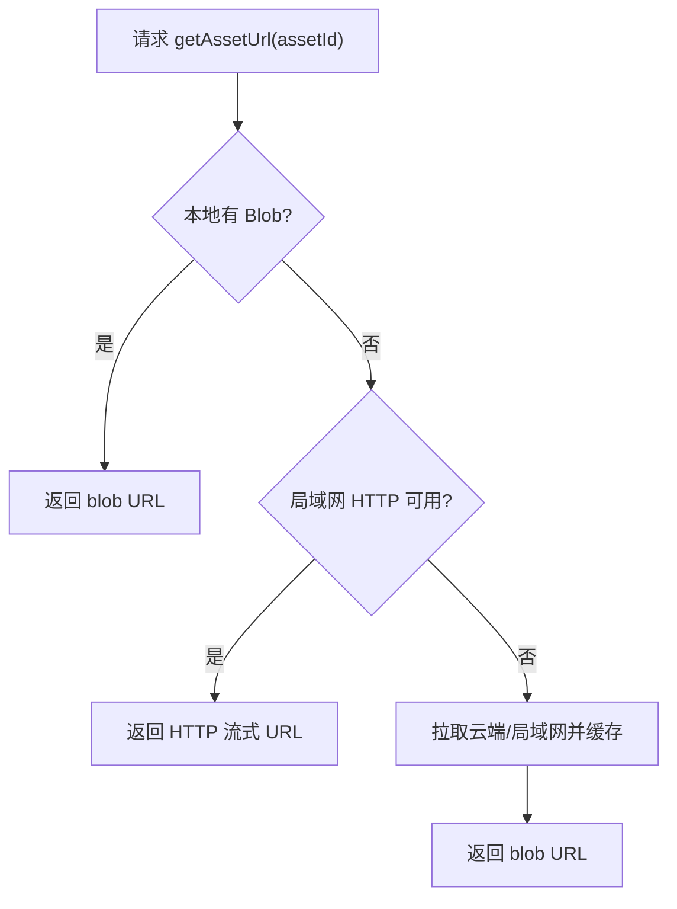

图表来源
- [src/media/blobRegistry.ts:84-126](file://src/media/blobRegistry.ts#L84-L126)
- [src/media/blobRegistry.ts:310-379](file://src/media/blobRegistry.ts#L310-L379)

章节来源
- [src/media/blobRegistry.ts:1-389](file://src/media/blobRegistry.ts#L1-L389)
- [src/media/mediaCoordinator.ts:1-25](file://src/media/mediaCoordinator.ts#L1-L25)
- [src/media/playlists.ts:1-179](file://src/media/playlists.ts#L1-L179)

### 导入导出 API
- 导出：exportProjectToBlob/exportCurrentProject，打包 project.json 与 assets，下载 .sqcanvas。
- 导入：importProjectFile，解压、校验 format/version、写入本地 DB、已登录时上传 OSS 并同步元数据。
- 文件导入：importFiles、putAsset、createNodeForAsset，支持大文件限制与预览生成。

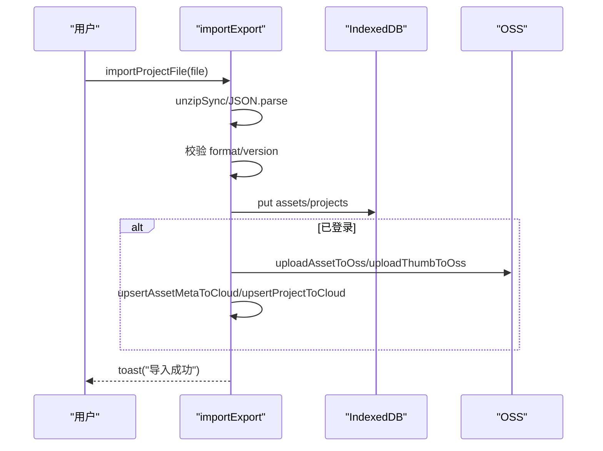

图表来源
- [src/io/importExport.ts:111-203](file://src/io/importExport.ts#L111-L203)
- [src/io/importExport.ts:35-109](file://src/io/importExport.ts#L35-L109)
- [src/io/fileLoader.ts:77-117](file://src/io/fileLoader.ts#L77-L117)

章节来源
- [src/io/importExport.ts:1-203](file://src/io/importExport.ts#L1-L203)
- [src/io/fileLoader.ts:1-297](file://src/io/fileLoader.ts#L1-L297)

### 云端与局域网同步 API
- 云端：isCloudAuthed、upsertAssetMetaToCloud、fetchCloudAssets、syncProjectList、loadProjectBest、upsertProjectToCloud、updateProjectNameInCloud、deleteProjectFromCloud。
- 局域网：lanConnect/Disconnect、joinLanProject、sendLanCursor/setLanEditing/clearLanEditing、broadcastLocalProjects、requestAssetFromLan、asset-http/asset-meta/asset-chunk/asset-thumb 消息处理。

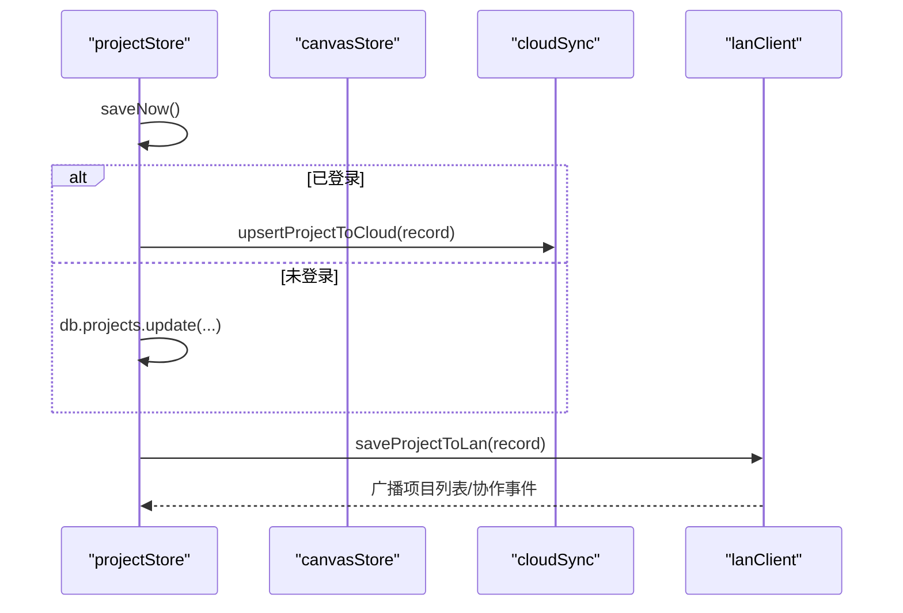

图表来源
- [src/store/projectStore.ts:196-228](file://src/store/projectStore.ts#L196-L228)
- [src/sync/cloudSync.ts:121-165](file://src/sync/cloudSync.ts#L121-L165)
- [src/sync/lanClient.ts:644-756](file://src/sync/lanClient.ts#L644-L756)

章节来源
- [src/sync/cloudSync.ts:1-165](file://src/sync/cloudSync.ts#L1-L165)
- [src/sync/lanClient.ts:1-800](file://src/sync/lanClient.ts#L1-L800)
- [src/store/projectStore.ts:1-230](file://src/store/projectStore.ts#L1-L230)

## 依赖关系分析
- 模块耦合：
  - CanvasBoard 依赖 canvasStore、projectStore、uiStore、fileLoader、nodeTypes/edgeTypes。
  - projectStore 依赖 cloudSync、lanClient、canvasStore。
  - blobRegistry 依赖 cloudSync、lanClient、db。
  - importExport 依赖 db、canvasStore、projectStore、cloudSync、ossClient。
- 外部依赖：@xyflow/react（画布）、Zustand（状态）、fflate（压缩）、Supabase/OSS（云端）。

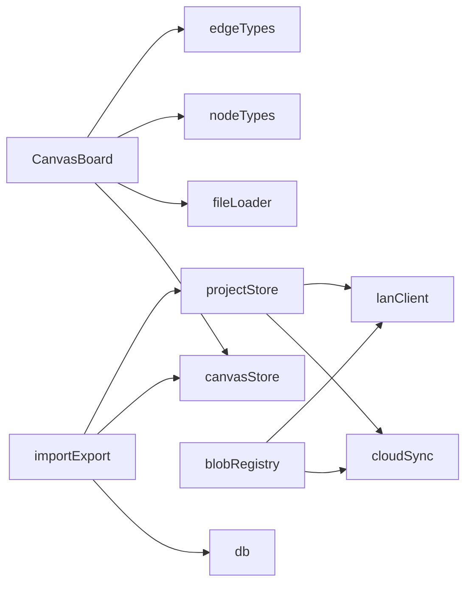

图表来源
- [src/canvas/CanvasBoard.tsx:1-459](file://src/canvas/CanvasBoard.tsx#L1-L459)
- [src/store/projectStore.ts:1-230](file://src/store/projectStore.ts#L1-L230)
- [src/media/blobRegistry.ts:1-389](file://src/media/blobRegistry.ts#L1-L389)
- [src/io/importExport.ts:1-203](file://src/io/importExport.ts#L1-L203)

章节来源
- [src/canvas/CanvasBoard.tsx:1-459](file://src/canvas/CanvasBoard.tsx#L1-L459)
- [src/store/projectStore.ts:1-230](file://src/store/projectStore.ts#L1-L230)
- [src/media/blobRegistry.ts:1-389](file://src/media/blobRegistry.ts#L1-L389)
- [src/io/importExport.ts:1-203](file://src/io/importExport.ts#L1-L203)

## 性能考虑
- 历史快照：防抖合并与删除即时落盘，避免频繁写历史导致卡顿。
- 媒体封面：并发上限 THUMB_MAX_CONCURRENT，避免多视频 seek 阻塞。
- 资源获取：优先本地 Blob，其次局域网 HTTP Range，最后回退全量下载。
- 导入限制：单文件最大 1.5GB，防止内存溢出。
- 局域网同步：批量删除与活动通知合并，减少网络抖动影响。

[本节为通用指导，不直接分析具体文件]

## 故障排查指南
- 导入失败：检查文件格式、大小限制、浏览器权限；查看 toast 提示与 console 日志。
- 云端同步失败：确认登录状态、OSS 配置、网络连通性；关注警告日志。
- 局域网协作异常：检查中继地址、HTTPS/WSS 要求、反向代理；断线自动重连机制会尝试恢复。
- 视频封面缺失：可能因跨域或编码问题；系统会尝试多次抓取与回退方案。

章节来源
- [src/io/importExport.ts:111-203](file://src/io/importExport.ts#L111-L203)
- [src/sync/cloudSync.ts:1-165](file://src/sync/cloudSync.ts#L1-L165)
- [src/sync/lanClient.ts:1-800](file://src/sync/lanClient.ts#L1-L800)
- [src/media/blobRegistry.ts:128-239](file://src/media/blobRegistry.ts#L128-L239)

## 结论
本 API 参考覆盖了画布、节点/边类型、状态管理、媒体处理、导入导出与同步协作的核心能力。通过统一的类型定义与清晰的模块边界，便于集成与扩展。建议遵循版本兼容策略与最佳实践，结合错误处理与性能优化，构建稳定高效的可视化编辑体验。

## 附录

### TypeScript 类型定义速查
- 媒体种类：image/video/audio/pdf/psd/markdown/text/file/heading/sticky/shape
- 节点数据：包含 kind、assetId、文本/样式/尺寸/创作信息等
- 边数据：style（线型/路径/箭头/颜色/粗细）、order（播放顺序）
- 视图：x/y/zoom

章节来源
- [src/types.ts:1-112](file://src/types.ts#L1-L112)

### 版本兼容性与废弃策略
- 项目格式：format="sqcanvas"，version=1；导入时若版本高于当前则拒绝。
- 向后兼容：仅当 json.version <= VERSION 才允许导入；未来新增字段需保持可选。
- 废弃字段：建议在类型中标记为可选，并在迁移逻辑中提供默认值。

章节来源
- [src/io/importExport.ts:13-15](file://src/io/importExport.ts#L13-L15)
- [src/io/importExport.ts:123-131](file://src/io/importExport.ts#L123-L131)

### 常见集成模式与最佳实践
- 初始化流程：先 init 项目，再订阅 canvasStore 变化以触发自动保存。
- 资源加载：优先使用 getAssetUrl，必要时用 getAssetBlob 进行离线处理。
- 协作模式：加入项目房间后，监听 activity/cursor/editing 事件提升协作体验。
- 错误处理：对导入/导出/同步操作添加 try/catch，并通过 toast 反馈用户。

章节来源
- [src/store/projectStore.ts:81-117](file://src/store/projectStore.ts#L81-L117)
- [src/media/blobRegistry.ts:84-126](file://src/media/blobRegistry.ts#L84-L126)
- [src/sync/lanClient.ts:718-756](file://src/sync/lanClient.ts#L718-L756)