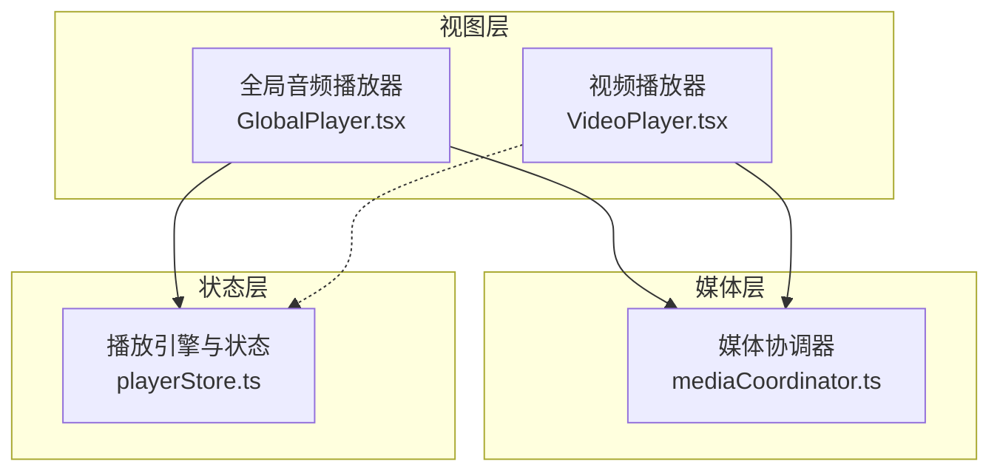
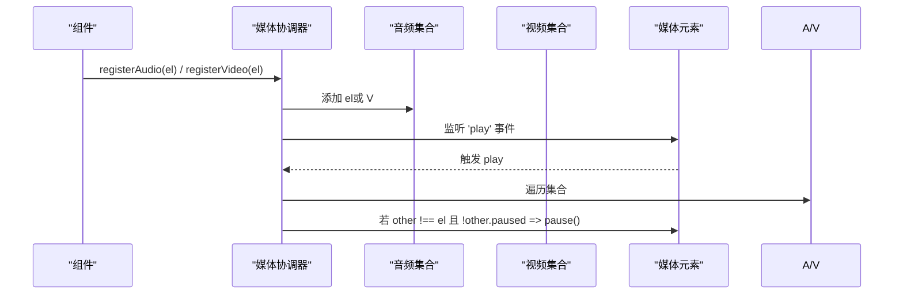
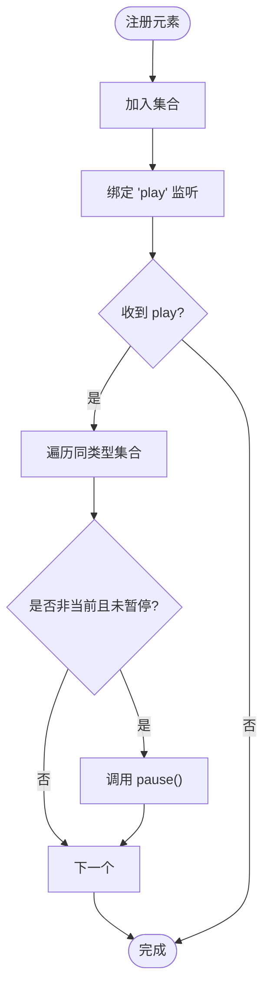
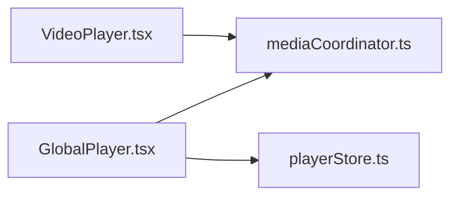

# 媒体协调器 API

<cite>
**本文引用的文件**
- [mediaCoordinator.ts](file://src/media/mediaCoordinator.ts)
- [GlobalPlayer.tsx](file://src/components/GlobalPlayer.tsx)
- [VideoPlayer.tsx](file://src/components/VideoPlayer.tsx)
- [playerStore.ts](file://src/store/playerStore.ts)
</cite>

## 目录
1. [简介](#简介)
2. [项目结构](#项目结构)
3. [核心组件](#核心组件)
4. [架构总览](#架构总览)
5. [详细组件分析](#详细组件分析)
6. [依赖关系分析](#依赖关系分析)
7. [性能考虑](#性能考虑)
8. [故障排查指南](#故障排查指南)
9. [结论](#结论)
10. [附录：使用示例与最佳实践](#附录使用示例与最佳实践)

## 简介
本 API 文档聚焦于“媒体协调器”的注册与互斥机制，重点说明 registerAudio 与 registerVideo 的使用方法、工作原理，以及音频与视频元素的注册、播放控制、自动暂停等能力。同时提供在组件中使用的参考路径与错误处理策略、性能优化建议，帮助开发者正确集成并稳定运行。

## 项目结构
与媒体协调相关的核心代码分布在以下位置：
- 媒体协调器：src/media/mediaCoordinator.ts
- 全局音频播放器（唯一音频元素）：src/components/GlobalPlayer.tsx
- 沉浸式视频播放器：src/components/VideoPlayer.tsx
- 播放状态与引擎：src/store/playerStore.ts

图表来源
- [mediaCoordinator.ts:1-24](file://src/media/mediaCoordinator.ts#L1-L24)
- [GlobalPlayer.tsx:86-97](file://src/components/GlobalPlayer.tsx#L86-L97)
- [VideoPlayer.tsx:325-330](file://src/components/VideoPlayer.tsx#L325-L330)
- [playerStore.ts:163-291](file://src/store/playerStore.ts#L163-L291)

章节来源
- [mediaCoordinator.ts:1-24](file://src/media/mediaCoordinator.ts#L1-L24)
- [GlobalPlayer.tsx:86-97](file://src/components/GlobalPlayer.tsx#L86-L97)
- [VideoPlayer.tsx:325-330](file://src/components/VideoPlayer.tsx#L325-L330)
- [playerStore.ts:163-291](file://src/store/playerStore.ts#L163-L291)

## 核心组件
- 媒体协调器（mediaCoordinator.ts）
  - 维护两个集合：audioElements、videoElements，分别保存已注册的音频与视频元素。
  - 通过 makeRegistrar 为每个类型创建注册函数：当元素触发 play 事件时，自动暂停同类型的其他正在播放的元素，实现“同类型互斥”。
  - 导出 registerAudio(el) 与 registerVideo(el)，返回一个注销函数，用于卸载监听与从集合移除。

- 全局音频播放器（GlobalPlayer.tsx）
  - 应用内唯一的 <audio> 元素，负责实际发声。
  - 在挂载时将自身 audioRef 绑定到播放引擎，并通过 registerAudio 加入互斥体系；卸载时调用返回的注销函数。

- 视频播放器（VideoPlayer.tsx）
  - 管理 <video> 元素的生命周期，并在挂载时将 videoRef 通过 registerVideo 注册到互斥体系；卸载时由返回的注销函数清理。

- 播放引擎（playerStore.ts）
  - 集中管理播放状态（当前曲目、播放进度、音量、模式、队列等）。
  - 提供 play/toggle/seek/next/prev 等方法，驱动单一音频元素进行播放控制。

章节来源
- [mediaCoordinator.ts:1-24](file://src/media/mediaCoordinator.ts#L1-L24)
- [GlobalPlayer.tsx:86-97](file://src/components/GlobalPlayer.tsx#L86-L97)
- [VideoPlayer.tsx:325-330](file://src/components/VideoPlayer.tsx#L325-L330)
- [playerStore.ts:163-291](file://src/store/playerStore.ts#L163-L291)

## 架构总览
媒体协调器采用“轻量级全局集合 + 事件驱动”的设计：
- 所有音频/视频元素通过 registerAudio/registerVideo 注册到对应集合。
- 任一元素触发 play 事件时，遍历同类型集合，将非当前且未暂停的元素暂停，确保同一时刻仅有一个同类型媒体在播放。
- 组件在挂载时注册，卸载时调用返回的注销函数，避免内存泄漏与重复监听。

图表来源
- [mediaCoordinator.ts:7-21](file://src/media/mediaCoordinator.ts#L7-L21)

章节来源
- [mediaCoordinator.ts:7-21](file://src/media/mediaCoordinator.ts#L7-L21)

## 详细组件分析

### 媒体协调器（registerAudio / registerVideo）
- 设计要点
  - 使用 Set 存储元素，天然去重。
  - 通过工厂函数 makeRegistrar 生成注册器，封装了“添加监听、暂停互斥、卸载清理”的完整生命周期。
  - 互斥范围限定在同类型：音频只互斥音频，视频只互斥视频。

- 复杂度
  - 注册：O(1)
  - 播放时互斥：O(n)，n 为同类型已注册元素数量。通常 n 很小，开销可忽略。

- 错误处理
  - 对不存在或未挂载的元素直接调用会抛出异常，应在组件挂载后注册，并在卸载时调用返回的注销函数。

图表来源
- [mediaCoordinator.ts:7-21](file://src/media/mediaCoordinator.ts#L7-L21)

章节来源
- [mediaCoordinator.ts:1-24](file://src/media/mediaCoordinator.ts#L1-L24)

### 全局音频播放器（GlobalPlayer）
- 职责
  - 维护唯一的全局 <audio> 元素，作为应用的“声音输出端”。
  - 将自身元素注册到媒体协调器，参与音频互斥。
  - 与 playerStore 联动，响应播放状态变化（音量、静音、进度等）。

- 关键点
  - 在 useEffect 中调用 bindPlayerAudio 将元素暴露给引擎，并调用 registerAudio 注册互斥。
  - 组件卸载时调用返回的注销函数，解绑监听并从集合移除。

章节来源
- [GlobalPlayer.tsx:86-97](file://src/components/GlobalPlayer.tsx#L86-L97)
- [playerStore.ts:58-65](file://src/store/playerStore.ts#L58-L65)

### 视频播放器（VideoPlayer）
- 职责
  - 管理 <video> 元素的生命周期与 UI 交互。
  - 在挂载时将 videoRef 通过 registerVideo 注册到媒体协调器，参与视频互斥。
  - 在卸载时由返回的注销函数清理。

- 关键点
  - useEffect 中根据 url 变化重新注册，确保每次切换 src 都能正确参与互斥。
  - 与 playerStore 无强耦合，但可通过 store 统一控制 UI 行为（如隐藏底部条）。

章节来源
- [VideoPlayer.tsx:325-330](file://src/components/VideoPlayer.tsx#L325-L330)

### 播放引擎（playerStore）
- 职责
  - 管理单一音频元素的播放状态与导航逻辑（顺序、随机、循环、单曲、流式）。
  - 提供统一的 play/toggle/seek/next/prev 接口，供各视图调用。
  - 在 onEnded 时自动续播下一首（依据模式与队列）。

- 关键点
  - 通过 bindPlayerAudio 接收全局音频元素引用。
  - 使用请求重试机制应对浏览器自动播放限制（canplay/loadeddata 回调）。

章节来源
- [playerStore.ts:72-88](file://src/store/playerStore.ts#L72-L88)
- [playerStore.ts:132-161](file://src/store/playerStore.ts#L132-L161)
- [playerStore.ts:174-209](file://src/store/playerStore.ts#L174-L209)

## 依赖关系分析
- GlobalPlayer 依赖 mediaCoordinator（注册音频互斥）与 playerStore（播放控制）。
- VideoPlayer 依赖 mediaCoordinator（注册视频互斥）。
- playerStore 不直接依赖 mediaCoordinator，但通过 GlobalPlayer 间接与之协作。

图表来源
- [GlobalPlayer.tsx:86-97](file://src/components/GlobalPlayer.tsx#L86-L97)
- [VideoPlayer.tsx:325-330](file://src/components/VideoPlayer.tsx#L325-L330)
- [playerStore.ts:58-65](file://src/store/playerStore.ts#L58-L65)

章节来源
- [GlobalPlayer.tsx:86-97](file://src/components/GlobalPlayer.tsx#L86-L97)
- [VideoPlayer.tsx:325-330](file://src/components/VideoPlayer.tsx#L325-L330)
- [playerStore.ts:58-65](file://src/store/playerStore.ts#L58-L65)

## 性能考虑
- 互斥遍历成本
  - 每次 play 事件触发时，会对同类型集合进行线性扫描并暂停其他元素。由于集合规模通常很小，影响可忽略。
- 资源释放
  - 务必调用 registerAudio/registerVideo 返回的注销函数，避免重复监听与内存泄漏。
- 预加载与懒加载
  - 音频元素使用 preload="metadata"，减少初始带宽占用。
  - 视频列表可批量探测时长与缩略图，避免一次性加载全部媒体数据。
- 并发控制
  - 快速连续切歌时，playerStore 使用序列号保证最后一次生效，避免竞态导致的多余加载。

[本节为通用指导，无需特定文件来源]

## 故障排查指南
- 常见问题
  - 多个音频同时播放：检查是否正确调用 registerAudio 并保留其返回的注销函数；确认未在多处重复注册。
  - 视频无法自动播放：浏览器策略可能阻止自动播放，需用户手势触发或在 canplay/loadeddata 时重试。
  - 卸载后仍触发互斥：确认组件卸载时调用了注销函数，避免残留监听。
- 定位方法
  - 在媒体协调器的 play 监听处增加日志，观察触发时机与暂停目标。
  - 检查组件生命周期中是否正确注册/注销。

章节来源
- [mediaCoordinator.ts:7-21](file://src/media/mediaCoordinator.ts#L7-L21)
- [GlobalPlayer.tsx:86-97](file://src/components/GlobalPlayer.tsx#L86-L97)
- [VideoPlayer.tsx:325-330](file://src/components/VideoPlayer.tsx#L325-L330)
- [playerStore.ts:72-88](file://src/store/playerStore.ts#L72-L88)

## 结论
媒体协调器以极简的方式实现了“同类型媒体互斥”，通过注册/注销机制与事件驱动，确保应用在任何时刻只有一个音频和一个视频在播放。配合全局音频播放器与播放引擎，形成稳定的媒体播放体系。遵循正确的注册/注销流程与错误处理策略，可获得良好的用户体验与性能表现。

[本节为总结性内容，无需特定文件来源]

## 附录：使用示例与最佳实践

- 在组件中使用 registerAudio
  - 步骤
    - 在组件挂载后，获取当前 <audio> 元素引用。
    - 调用 registerAudio(audioElement)，并将返回的注销函数保存在闭包或 effect 清理函数中。
    - 在组件卸载时调用注销函数，移除监听并从集合删除。
  - 参考路径
    - [GlobalPlayer.tsx:86-97](file://src/components/GlobalPlayer.tsx#L86-L97)

- 在组件中使用 registerVideo
  - 步骤
    - 在组件挂载后，获取当前 <video> 元素引用。
    - 调用 registerVideo(videoElement)，并将返回的注销函数保存在 effect 清理函数中。
    - 在组件卸载时调用注销函数，移除监听并从集合删除。
  - 参考路径
    - [VideoPlayer.tsx:325-330](file://src/components/VideoPlayer.tsx#L325-L330)

- 播放控制与自动暂停
  - 音频：通过 playerStore.play/toggle/seek/next/prev 控制全局音频元素；媒体协调器确保同类型互斥。
  - 视频：组件内部直接操作 <video> 元素；媒体协调器确保同类型互斥。
  - 参考路径
    - [playerStore.ts:174-209](file://src/store/playerStore.ts#L174-L209)
    - [mediaCoordinator.ts:7-21](file://src/media/mediaCoordinator.ts#L7-L21)

- 错误处理策略
  - 自动播放失败：捕获 Promise 拒绝，并在 canplay/loadeddata 时重试。
  - 资源不可用：在 URL 解析失败时重置状态，避免无效播放。
  - 参考路径
    - [playerStore.ts:72-88](file://src/store/playerStore.ts#L72-L88)
    - [playerStore.ts:206-208](file://src/store/playerStore.ts#L206-L208)

- 性能优化建议
  - 仅在必要时注册媒体元素，并确保及时注销。
  - 合理设置 preload 属性，避免不必要的网络与解码开销。
  - 批量加载缩略图与元数据，减少渲染抖动。
  - 参考路径
    - [VideoPlayer.tsx:91-164](file://src/components/VideoPlayer.tsx#L91-L164)

[本节为实践指导，具体实现请参考上述文件路径]