# 媒体处理 API

<cite>
**本文引用的文件**
- [mediaCoordinator.ts](file://src/media/mediaCoordinator.ts)
- [managedFile.ts](file://src/media/managedFile.ts)
- [fileKind.ts](file://src/media/fileKind.ts)
- [blobRegistry.ts](file://src/media/blobRegistry.ts)
- [audioAnalyzer.ts](file://src/media/audioAnalyzer.ts)
- [coverColor.ts](file://src/media/coverColor.ts)
- [psdPreview.ts](file://src/media/psdPreview.ts)
- [pdf.ts](file://src/media/pdf.ts)
- [useAssetUrl.ts](file://src/media/useAssetUrl.ts)
- [db.ts](file://src/db/db.ts)
- [types.ts](file://src/types.ts)
</cite>

## 目录
1. [简介](#简介)
2. [项目结构](#项目结构)
3. [核心组件](#核心组件)
4. [架构总览](#架构总览)
5. [详细组件分析](#详细组件分析)
6. [依赖关系分析](#依赖关系分析)
7. [性能考虑](#性能考虑)
8. [故障排查指南](#故障排查指南)
9. [结论](#结论)
10. [附录：API 参考](#附录api-参考)

## 简介
本 API 文档面向媒体处理子系统，重点说明以下能力：
- 资源加载与 URL 生成（本地 IndexedDB、局域网 HTTP 流式、云端 OSS）
- 媒体类型识别与分类（图片、视频、音频、PDF、PSD、Markdown、文本等）
- 缩略图生成（视频抓帧、PSD 预览、封面取色）
- 播放互斥控制（同一时刻最多一个音频和一个视频播放）
- 资源生命周期管理（缓存、失效、垃圾回收）
- 错误处理与异常恢复策略

该子系统以 blobRegistry 为核心，配合 fileKind、managedFile、psdPreview、pdf、audioAnalyzer、coverColor 等模块，为上层节点渲染与播放器提供稳定可靠的媒体资源访问能力。

## 项目结构
媒体相关代码主要位于 src/media 目录，数据持久化在 src/db，类型定义在 src/types。关键职责划分如下：
- blobRegistry：统一资源 URL/缩略图获取、并发控制、缓存与失效、跨源抓取封面、回退策略
- fileKind：根据 File/MIME/扩展名推断媒体类型
- managedFile：从画布节点与素材记录聚合可管理文件列表
- mediaCoordinator：全局媒体互斥（音频/视频播放互斥）
- audioAnalyzer：Web Audio 分析器接入，频谱/波形可视化
- coverColor：从封面提取主色调与对比度信息
- psdPreview：通过 Web Worker 解析 PSD 并生成预览图
- pdf：基于 pdfjs 打开/关闭 PDF 并渲染页面到 Canvas
- useAssetUrl：React Hook，封装资源与缩略图的异步加载与重试

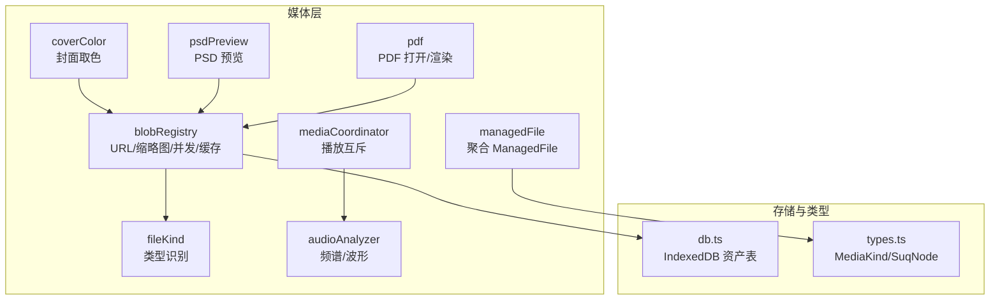

图表来源
- [blobRegistry.ts:1-389](file://src/media/blobRegistry.ts#L1-L389)
- [fileKind.ts:1-24](file://src/media/fileKind.ts#L1-L24)
- [managedFile.ts:1-39](file://src/media/managedFile.ts#L1-L39)
- [mediaCoordinator.ts:1-25](file://src/media/mediaCoordinator.ts#L1-L25)
- [audioAnalyzer.ts:1-59](file://src/media/audioAnalyzer.ts#L1-L59)
- [coverColor.ts:1-252](file://src/media/coverColor.ts#L1-L252)
- [psdPreview.ts:1-62](file://src/media/psdPreview.ts#L1-L62)
- [pdf.ts:1-50](file://src/media/pdf.ts#L1-L50)
- [db.ts:1-69](file://src/db/db.ts#L1-L69)
- [types.ts:1-112](file://src/types.ts#L1-L112)

章节来源
- [blobRegistry.ts:1-389](file://src/media/blobRegistry.ts#L1-L389)
- [fileKind.ts:1-24](file://src/media/fileKind.ts#L1-L24)
- [managedFile.ts:1-39](file://src/media/managedFile.ts#L1-L39)
- [mediaCoordinator.ts:1-25](file://src/media/mediaCoordinator.ts#L1-L25)
- [audioAnalyzer.ts:1-59](file://src/media/audioAnalyzer.ts#L1-L59)
- [coverColor.ts:1-252](file://src/media/coverColor.ts#L1-L252)
- [psdPreview.ts:1-62](file://src/media/psdPreview.ts#L1-L62)
- [pdf.ts:1-50](file://src/media/pdf.ts#L1-L50)
- [db.ts:1-69](file://src/db/db.ts#L1-L69)
- [types.ts:1-112](file://src/types.ts#L1-L112)

## 核心组件
- MediaCoordinator（播放互斥）
  - 暴露 registerAudio/registerVideo，自动在同一类型媒体元素间互斥播放
- ManagedFile（可管理文件抽象）
  - 属性：assetId、name、kind、mime、size、nodes
  - 工具：isMp3、collectFiles（从节点+素材记录聚合）
- BlobRegistry（资源与缩略图）
  - getAssetUrl/getAssetBlob：优先本地 IndexedDB，其次局域网 HTTP 流式，最后云端/peer 拉取
  - getThumbnailUrl：视频抓帧、PSD 预览、封面取色；并发限制与失败回退
  - invalidate*：释放 URL 与缓存
- 类型识别（fileKind）
  - detectKind：按 MIME/扩展名判断媒体类型
- 音频分析（audioAnalyzer）
  - wireAudioElement/getAnalyser/getAudioLevel：接入 AnalyserNode 实现频谱/波形
- 封面取色（coverColor）
  - extractCoverPalette/useCoverPalette：从封面提取主色、强调色、背景亮度等
- PSD 预览（psdPreview）
  - generatePsdPreview/ensurePsdPreview：Worker 解析 PSD，生成预览并落库
- PDF 处理（pdf）
  - openPdf/closePdf/renderPageToCanvas：打开/关闭 PDF，渲染指定页到 Canvas

章节来源
- [mediaCoordinator.ts:1-25](file://src/media/mediaCoordinator.ts#L1-L25)
- [managedFile.ts:1-39](file://src/media/managedFile.ts#L1-L39)
- [blobRegistry.ts:1-389](file://src/media/blobRegistry.ts#L1-L389)
- [fileKind.ts:1-24](file://src/media/fileKind.ts#L1-L24)
- [audioAnalyzer.ts:1-59](file://src/media/audioAnalyzer.ts#L1-L59)
- [coverColor.ts:1-252](file://src/media/coverColor.ts#L1-L252)
- [psdPreview.ts:1-62](file://src/media/psdPreview.ts#L1-L62)
- [pdf.ts:1-50](file://src/media/pdf.ts#L1-L50)

## 架构总览
媒体资源访问路径与缩略图生成流程如下：

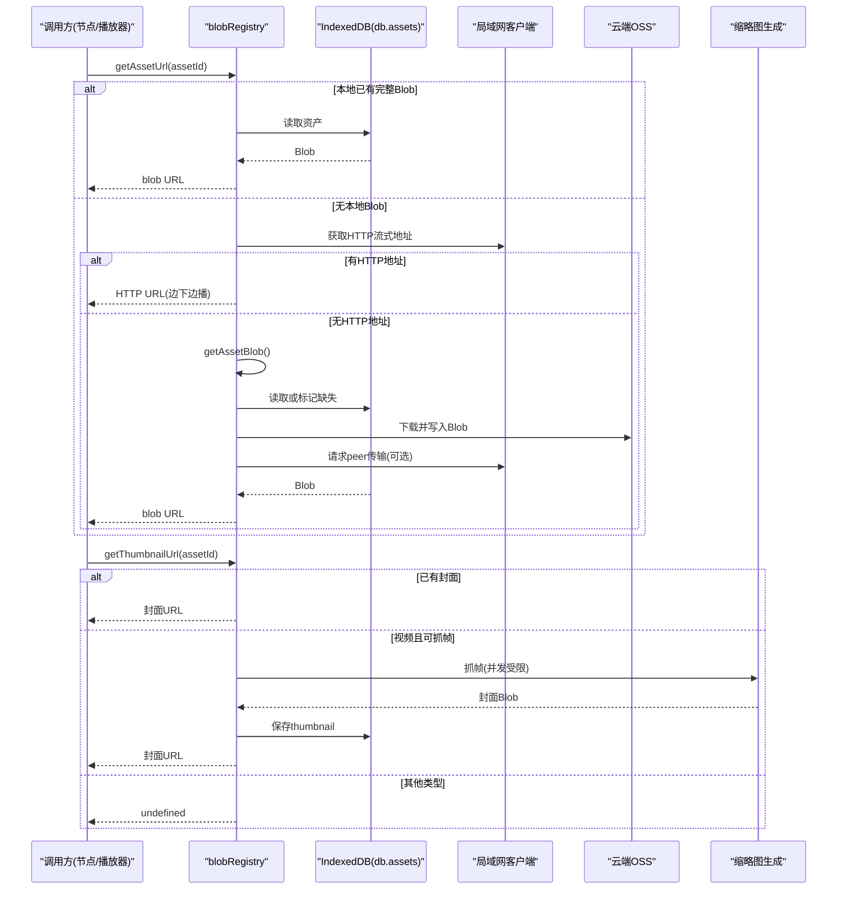

图表来源
- [blobRegistry.ts:84-126](file://src/media/blobRegistry.ts#L84-L126)
- [blobRegistry.ts:128-268](file://src/media/blobRegistry.ts#L128-L268)
- [blobRegistry.ts:310-379](file://src/media/blobRegistry.ts#L310-L379)
- [db.ts:25-33](file://src/db/db.ts#L25-L33)

## 详细组件分析

### MediaCoordinator（播放互斥）
- 目标：同一时刻最多一个音频和一个视频播放，避免冲突与资源争用
- 机制：维护 Set<HTMLAudioElement> 与 Set<HTMLVideoElement>，监听 play 事件，自动暂停同类型其他正在播放的元素
- 使用方式：在创建 <audio>/<video> 后调用 registerAudio/registerVideo，返回清理函数用于卸载

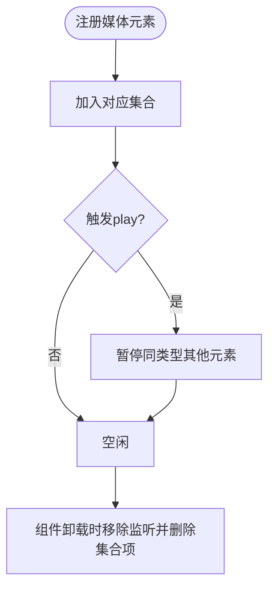

图表来源
- [mediaCoordinator.ts:7-24](file://src/media/mediaCoordinator.ts#L7-L24)

章节来源
- [mediaCoordinator.ts:1-25](file://src/media/mediaCoordinator.ts#L1-L25)

### ManagedFile 接口与工具
- 属性
  - assetId：唯一标识
  - name：显示名称
  - kind：媒体类型（来自 types.MediaKind）
  - mime：MIME 类型
  - size：字节大小
  - nodes：关联的画布节点数组
- 方法
  - isMp3(file)：判断是否为 MP3
  - collectFiles(nodes, records)：将多个节点按 assetId 分组，合并出每个资源的摘要

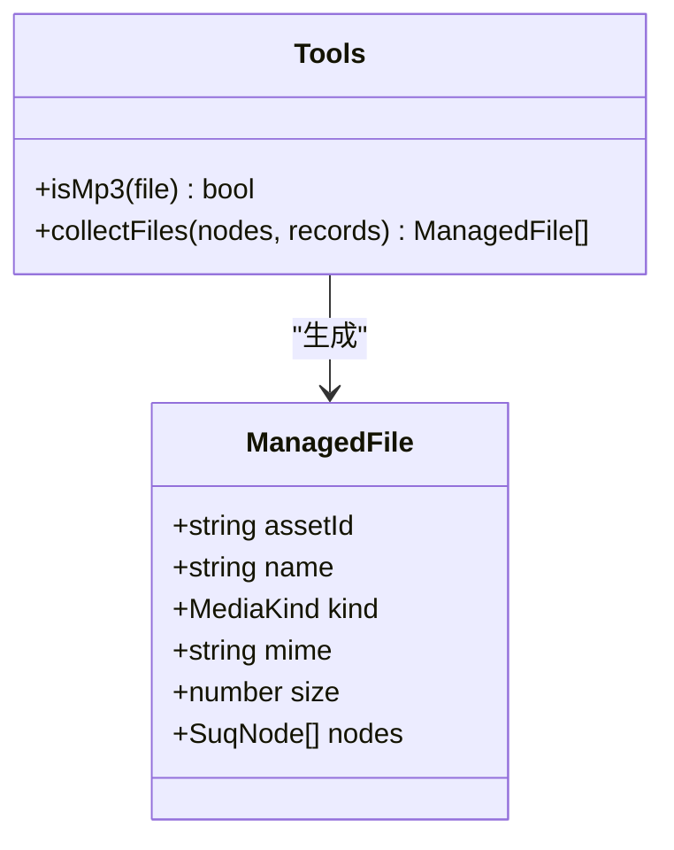

图表来源
- [managedFile.ts:4-38](file://src/media/managedFile.ts#L4-L38)
- [types.ts:3-15](file://src/types.ts#L3-L15)

章节来源
- [managedFile.ts:1-39](file://src/media/managedFile.ts#L1-L39)
- [types.ts:66-106](file://src/types.ts#L66-L106)

### 媒体类型识别（fileKind）
- detectKind(file)：依据扩展名与 MIME 前缀判断媒体类型，支持 image/video/audio/pdf/markdown/text/psd/file
- formatBytes(bytes)：格式化文件大小显示

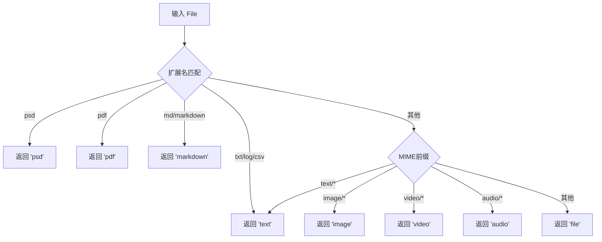

图表来源
- [fileKind.ts:3-16](file://src/media/fileKind.ts#L3-L16)

章节来源
- [fileKind.ts:1-24](file://src/media/fileKind.ts#L1-L24)

### 资源加载与缩略图（blobRegistry）
- 资源 URL 获取
  - 优先本地 IndexedDB Blob，若存在则直接返回 blob URL
  - 若存在局域网 HTTP 流式地址，直接返回该地址以实现边下边播
  - 否则尝试从云端下载并落库，再重试局域网 peer 传输，最终抛出“资源不存在”错误
- 缩略图获取
  - 优先使用已同步的封面
  - 对视频：限制并发抓帧（默认最大 2），通过临时 video 元素 seek 到合适时间点，canvas 绘制并 toBlob 生成 jpeg；若跨源导致失败，一次性拉取全量 Blob 再次尝试
  - 对 PSD：通过 Worker 解析并生成预览
  - 对图片：可直接使用资源 URL（由上层决定是否需要缩略图）
- 缓存与失效
  - urlCache/thumbCache 缓存 URL；invalidateAssetUrl/invalidateThumbnailUrl/invalidateAllAssetUrls/revokeAllUrls 负责释放与清理

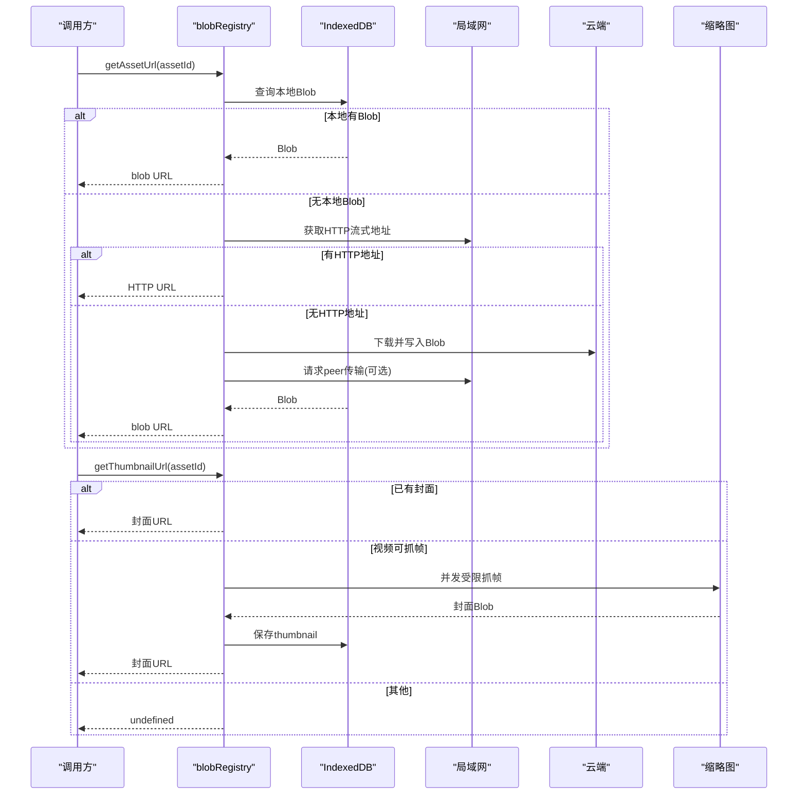

图表来源
- [blobRegistry.ts:84-126](file://src/media/blobRegistry.ts#L84-L126)
- [blobRegistry.ts:128-268](file://src/media/blobRegistry.ts#L128-L268)
- [blobRegistry.ts:310-379](file://src/media/blobRegistry.ts#L310-L379)

章节来源
- [blobRegistry.ts:1-389](file://src/media/blobRegistry.ts#L1-L389)

### 音频分析与可视化（audioAnalyzer）
- wireAudioElement(el)：将 <audio> 接入 AnalyserNode，仅连接一次；自动恢复 AudioContext
- getAnalyser()：获取共享 AnalyserNode
- getAudioLevel()：计算归一化音量级（0..1），用于波纹幅度

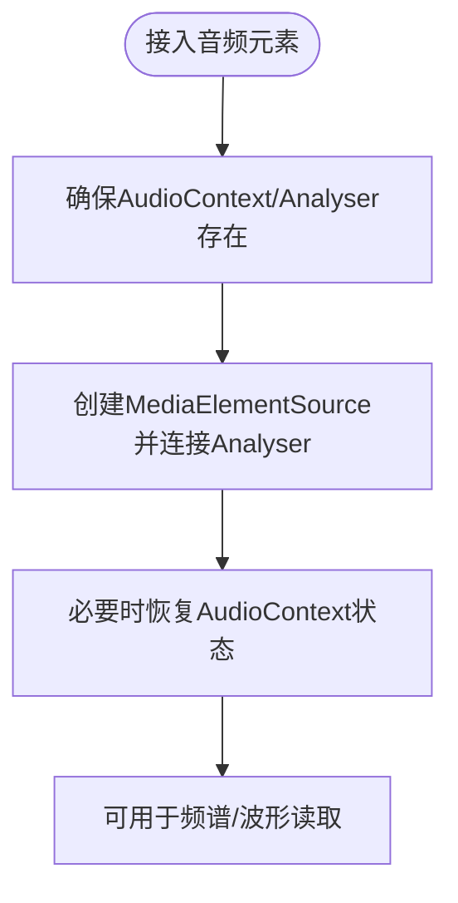

图表来源
- [audioAnalyzer.ts:8-39](file://src/media/audioAnalyzer.ts#L8-L39)
- [audioAnalyzer.ts:41-58](file://src/media/audioAnalyzer.ts#L41-L58)

章节来源
- [audioAnalyzer.ts:1-59](file://src/media/audioAnalyzer.ts#L1-L59)

### 封面取色（coverColor）
- extractCoverPalette(url)：采样封面像素，计算主色相、强调色、背景相对亮度、反色色相等
- useCoverPalette(url)：React Hook，异步取色并在组件卸载时取消更新

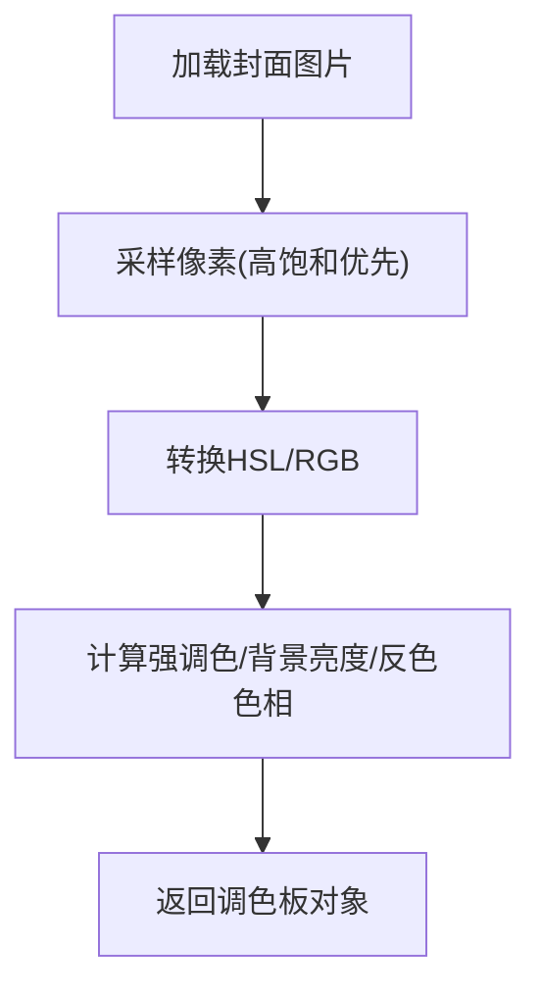

图表来源
- [coverColor.ts:154-229](file://src/media/coverColor.ts#L154-L229)
- [coverColor.ts:232-251](file://src/media/coverColor.ts#L232-L251)

章节来源
- [coverColor.ts:1-252](file://src/media/coverColor.ts#L1-L252)

### PSD 预览（psdPreview）
- generatePsdPreview(blob)：将 Blob 转为 ArrayBuffer 发送给 Worker 解析，返回预览 Blob
- ensurePsdPreview(assetId)：若本地无预览，则生成并保存到 thumbnail，同时使缩略图缓存失效

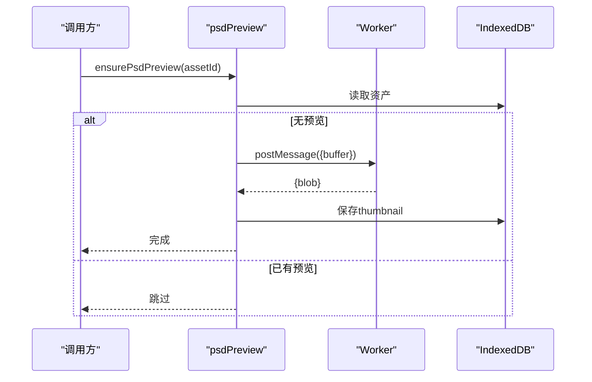

图表来源
- [psdPreview.ts:15-47](file://src/media/psdPreview.ts#L15-L47)
- [psdPreview.ts:49-60](file://src/media/psdPreview.ts#L49-L60)

章节来源
- [psdPreview.ts:1-62](file://src/media/psdPreview.ts#L1-L62)

### PDF 处理（pdf）
- openPdf(url)：打开 PDF 文档，返回 handle（包含 task/doc）
- closePdf(handle)：销毁任务释放资源
- renderPageToCanvas(page, canvas, scale)：将指定页渲染到 Canvas，考虑设备像素比

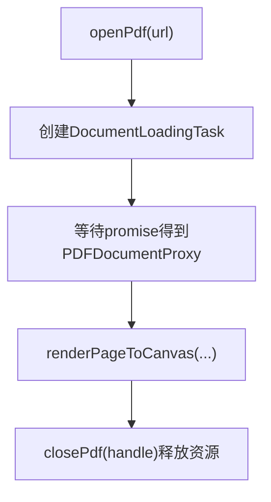

图表来源
- [pdf.ts:23-33](file://src/media/pdf.ts#L23-L33)
- [pdf.ts:35-49](file://src/media/pdf.ts#L35-L49)

章节来源
- [pdf.ts:1-50](file://src/media/pdf.ts#L1-L50)

### React Hook 封装（useAssetUrl / useThumbnailUrl）
- useAssetUrl(assetId, version)：获取资源 URL，带重试与失败提示
- useThumbnailUrl(assetId)：获取缩略图 URL，针对局域网场景做快速/慢速轮询与超时
- useAssetSourceUrl(assetId, source)：通用封装，支持选择 asset 或 thumbnail
- usePsdPreviewUrl(assetId)：优先缩略图，否则生成 PSD 预览

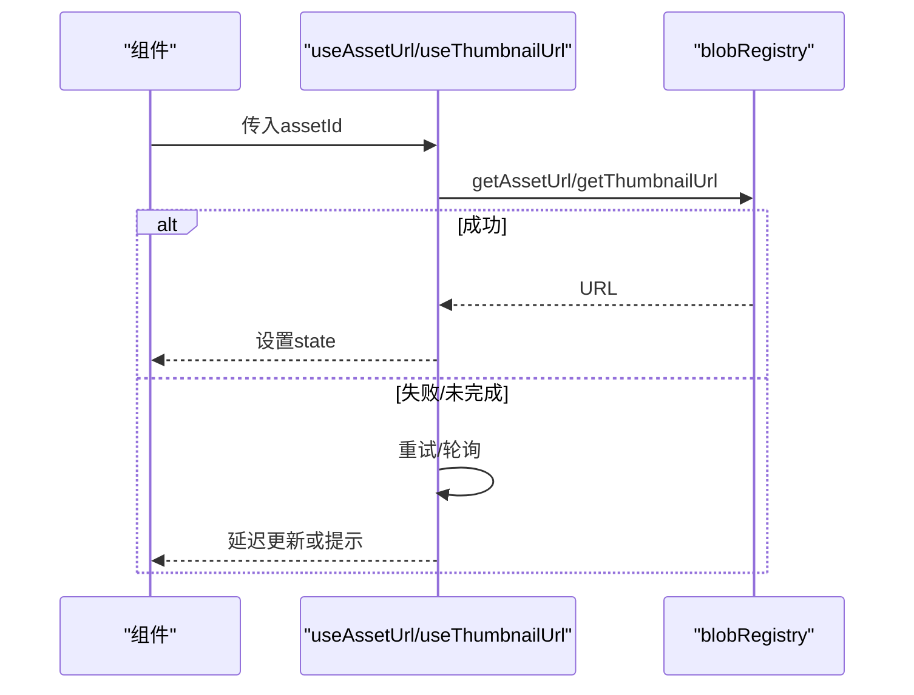

图表来源
- [useAssetUrl.ts:10-44](file://src/media/useAssetUrl.ts#L10-L44)
- [useAssetUrl.ts:52-99](file://src/media/useAssetUrl.ts#L52-L99)
- [useAssetUrl.ts:101-157](file://src/media/useAssetUrl.ts#L101-L157)

章节来源
- [useAssetUrl.ts:1-157](file://src/media/useAssetUrl.ts#L1-L157)

## 依赖关系分析
- blobRegistry 依赖 db（IndexedDB）、lanClient（局域网）、ossClient（云端）、psdPreview（PSD 预览）
- managedFile 依赖 types（MediaKind、SuqNode）与 db（AssetRecord）
- mediaCoordinator 独立，不依赖外部模块
- audioAnalyzer 依赖浏览器原生 Web Audio API
- coverColor 纯前端计算，无外部依赖
- pdf 依赖 pdfjs-dist
- useAssetUrl 依赖 blobRegistry、lanClient、uiStore（toast）

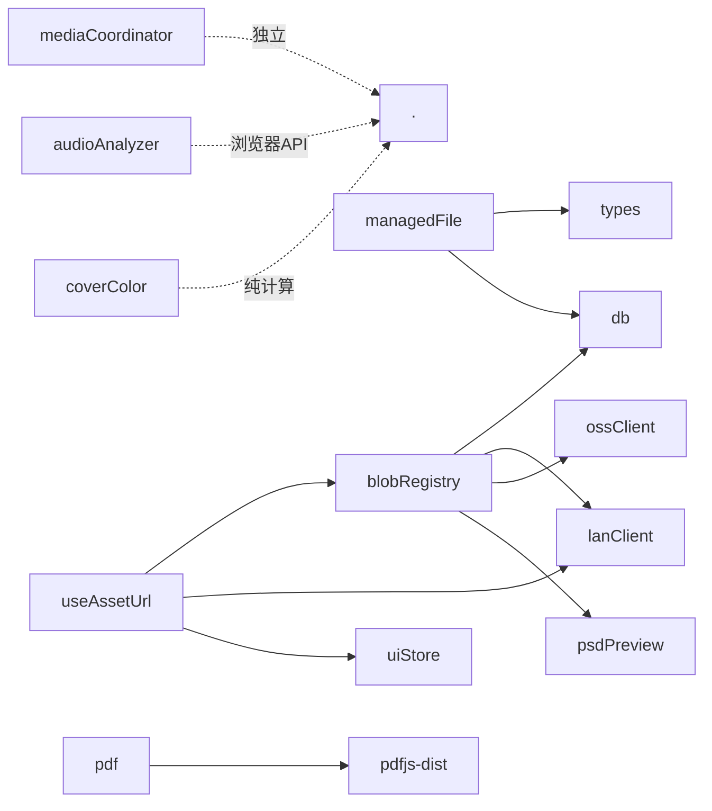

图表来源
- [blobRegistry.ts:1-20](file://src/media/blobRegistry.ts#L1-L20)
- [managedFile.ts:1-3](file://src/media/managedFile.ts#L1-L3)
- [pdf.ts:1-5](file://src/media/pdf.ts#L1-L5)
- [useAssetUrl.ts:1-6](file://src/media/useAssetUrl.ts#L1-L6)

章节来源
- [blobRegistry.ts:1-389](file://src/media/blobRegistry.ts#L1-L389)
- [managedFile.ts:1-39](file://src/media/managedFile.ts#L1-L39)
- [pdf.ts:1-50](file://src/media/pdf.ts#L1-L50)
- [useAssetUrl.ts:1-157](file://src/media/useAssetUrl.ts#L1-L157)

## 性能考虑
- 并发控制
  - 缩略图抓帧并发上限为 2，避免多路 seek 占满浏览器连接池，影响视频播放
- 内存优化
  - 优先使用局域网 HTTP 流式地址播放大视频，避免整份下载到 IndexedDB
  - 及时释放 URL：invalidateAssetUrl/invalidateThumbnailUrl/revokeAllUrls
  - 使用 WeakSet 跟踪已连接的音频元素，避免重复连接
- 网络优化
  - 局域网场景下封面依赖 peer/中继消息，采用快速/慢速轮询与超时策略
  - 跨源抓帧失败时一次性回退到同源 Blob 再次尝试，减少反复网络开销
- 渲染优化
  - PDF 渲染考虑 devicePixelRatio，保证清晰度
  - 封面取色仅在必要时执行，避免频繁重算

[本节为通用指导，不直接分析具体文件]

## 故障排查指南
- 资源不存在
  - 现象：getAssetBlob 抛出“资源不存在”
  - 原因：本地无 Blob，云端/局域网均不可用
  - 处理：检查云端配置与局域网连通性；确认 assetId 有效
- 视频封面始终为空
  - 现象：getThumbnailUrl 返回 undefined
  - 可能原因：跨源限制、编码异常、未解码黑帧
  - 处理：启用跨域 CORS；触发一次 forceBlob 回退；检查局域网是否在线
- PSD 预览失败
  - 现象：ensurePsdPreview 抛错
  - 可能原因：Worker 崩溃、格式不支持、文件过大
  - 处理：查看控制台警告；降级展示或提示用户
- 音频可视化无效
  - 现象：getAudioLevel 始终为 0
  - 可能原因：AudioContext 被挂起或未正确连接
  - 处理：确保先调用 wireAudioElement；必要时手动 resume
- 内存泄漏
  - 现象：页面长时间运行后内存增长
  - 可能原因：未释放 URL 或未清理监听
  - 处理：组件卸载时调用清理函数；定期调用 revokeAllUrls

章节来源
- [blobRegistry.ts:107-126](file://src/media/blobRegistry.ts#L107-L126)
- [blobRegistry.ts:310-379](file://src/media/blobRegistry.ts#L310-L379)
- [psdPreview.ts:49-60](file://src/media/psdPreview.ts#L49-L60)
- [audioAnalyzer.ts:26-39](file://src/media/audioAnalyzer.ts#L26-L39)
- [blobRegistry.ts:41-56](file://src/media/blobRegistry.ts#L41-L56)
- [blobRegistry.ts:381-389](file://src/media/blobRegistry.ts#L381-L389)

## 结论
本媒体处理系统围绕 blobRegistry 构建，实现了统一的资源访问、缩略图生成与并发控制，结合 fileKind/managedFile 提供类型识别与资源聚合能力。通过局域网流式播放与 IndexedDB 缓存，兼顾了离线可用性与大文件体验。配合 audioAnalyzer 与 coverColor，提升了音视频交互与视觉一致性。建议在生产环境中关注并发限制、跨源配置与 URL 释放策略，以获得更稳定的性能表现。

[本节为总结，不直接分析具体文件]

## 附录：API 参考

### MediaCoordinator
- registerAudio(element): () => void
  - 作用：注册音频元素并启用互斥播放
  - 返回：清理函数，用于移除监听并从集合中删除
- registerVideo(element): () => void
  - 作用：注册视频元素并启用互斥播放
  - 返回：清理函数

章节来源
- [mediaCoordinator.ts:7-24](file://src/media/mediaCoordinator.ts#L7-L24)

### ManagedFile
- 属性
  - assetId: string
  - name: string
  - kind: MediaKind
  - mime: string
  - size: number
  - nodes: SuqNode[]
- 方法
  - isMp3(file: ManagedFile): boolean
  - collectFiles(nodes: SuqNode[], records: Map<string, AssetRecord>): ManagedFile[]

章节来源
- [managedFile.ts:4-38](file://src/media/managedFile.ts#L4-L38)
- [types.ts:3-15](file://src/types.ts#L3-L15)
- [db.ts:5-14](file://src/db/db.ts#L5-L14)

### BlobRegistry
- getAssetUrl(assetId): Promise<string>
  - 行为：优先本地 Blob，其次局域网 HTTP 流式，最后云端/peer 拉取
- getAssetBlob(assetId): Promise<Blob>
  - 行为：获取原始 Blob，失败时抛出“资源不存在”
- getThumbnailUrl(assetId): Promise<string | undefined>
  - 行为：返回缩略图 URL；视频会抓帧生成；并发受限；跨源失败回退
- invalidateAssetUrl(assetId): void
- invalidateThumbnailUrl(assetId): void
- invalidateAllAssetUrls(assetId): void
- revokeAllUrls(): void

章节来源
- [blobRegistry.ts:41-56](file://src/media/blobRegistry.ts#L41-L56)
- [blobRegistry.ts:84-126](file://src/media/blobRegistry.ts#L84-L126)
- [blobRegistry.ts:310-379](file://src/media/blobRegistry.ts#L310-L379)
- [blobRegistry.ts:381-389](file://src/media/blobRegistry.ts#L381-L389)

### fileKind
- detectKind(file: File): MediaKind
- formatBytes(bytes: number): string

章节来源
- [fileKind.ts:3-23](file://src/media/fileKind.ts#L3-L23)

### audioAnalyzer
- wireAudioElement(el: HTMLAudioElement | null): void
- getAnalyser(): AnalyserNode | null
- getAudioLevel(): number

章节来源
- [audioAnalyzer.ts:26-58](file://src/media/audioAnalyzer.ts#L26-L58)

### coverColor
- extractCoverPalette(url: string): Promise<CoverPalette | null>
- useCoverPalette(url?: string): CoverPalette | null

章节来源
- [coverColor.ts:154-251](file://src/media/coverColor.ts#L154-L251)

### psdPreview
- generatePsdPreview(blob: Blob): Promise<Blob>
- ensurePsdPreview(assetId: string): Promise<void>

章节来源
- [psdPreview.ts:42-60](file://src/media/psdPreview.ts#L42-L60)

### pdf
- openPdf(url: string): Promise<PdfHandle>
- closePdf(handle: PdfHandle | null): void
- renderPageToCanvas(page: PDFPageProxy, canvas: HTMLCanvasElement, scale: number): Promise<void>

章节来源
- [pdf.ts:23-49](file://src/media/pdf.ts#L23-L49)

### useAssetUrl（React Hooks）
- useAssetUrl(assetId?: string, version?: number): string | undefined
- useThumbnailUrl(assetId?: string): string | undefined
- useAssetSourceUrl(assetId?: string, source?: 'asset' | 'thumbnail'): string | undefined
- usePsdPreviewUrl(assetId?: string): string | undefined

章节来源
- [useAssetUrl.ts:10-157](file://src/media/useAssetUrl.ts#L10-L157)