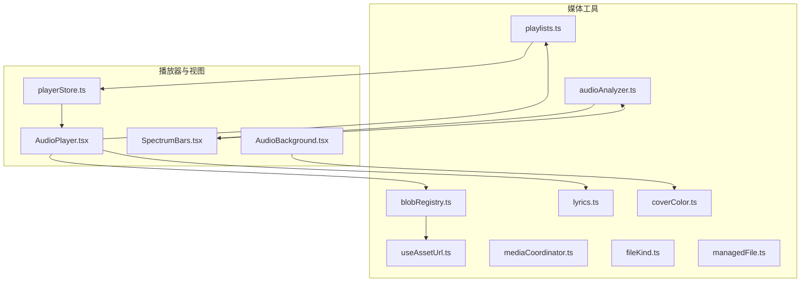
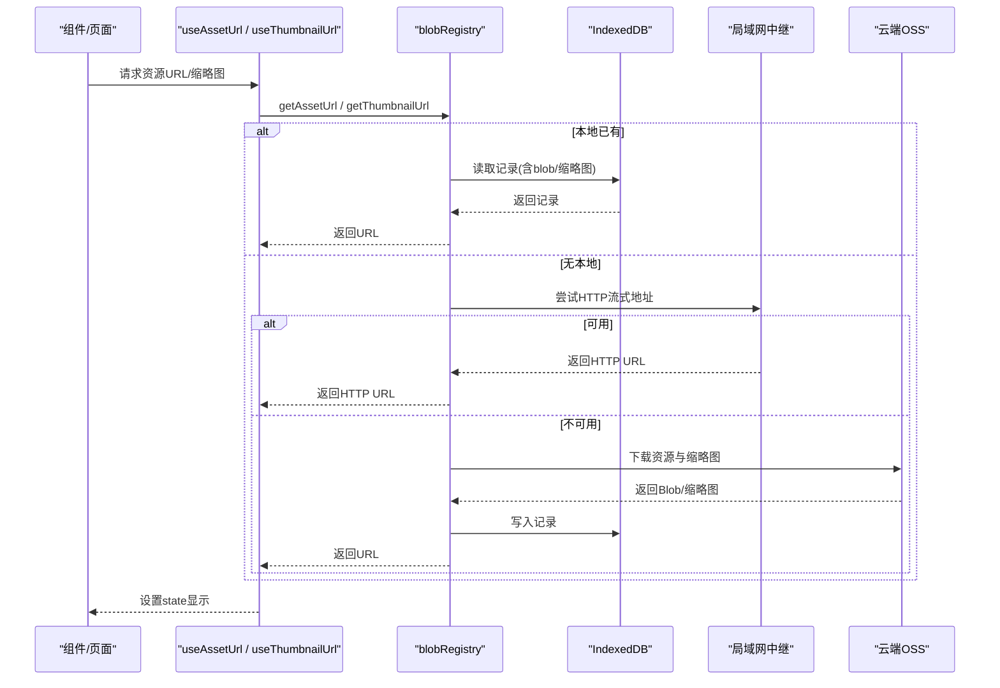
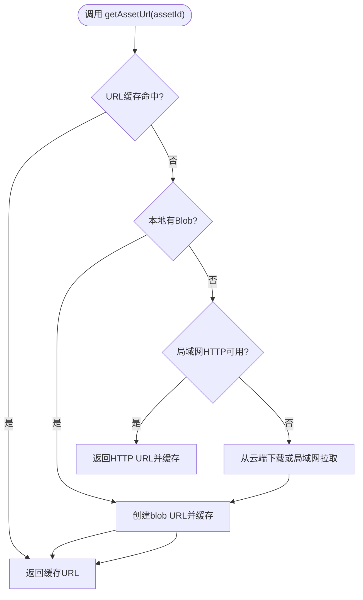
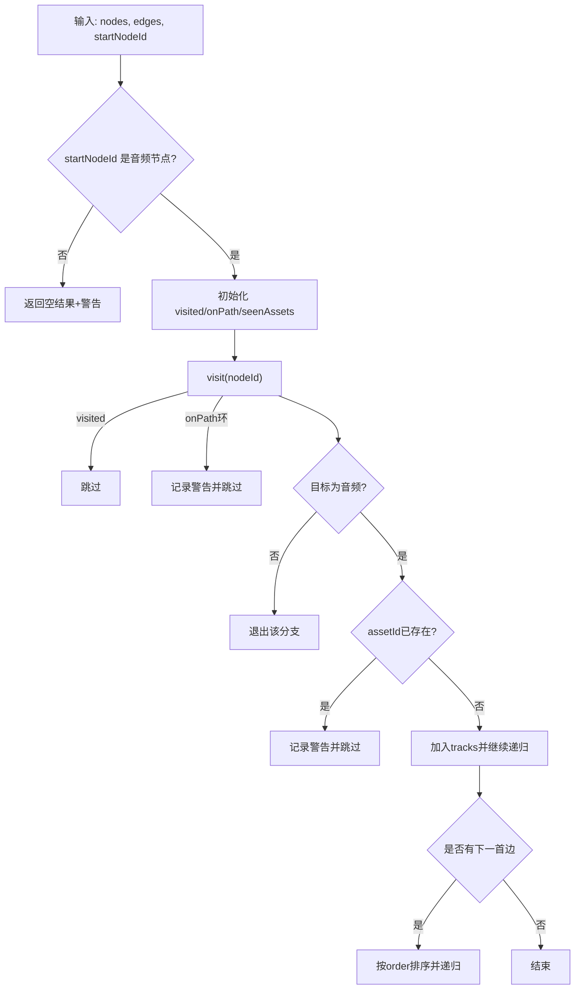
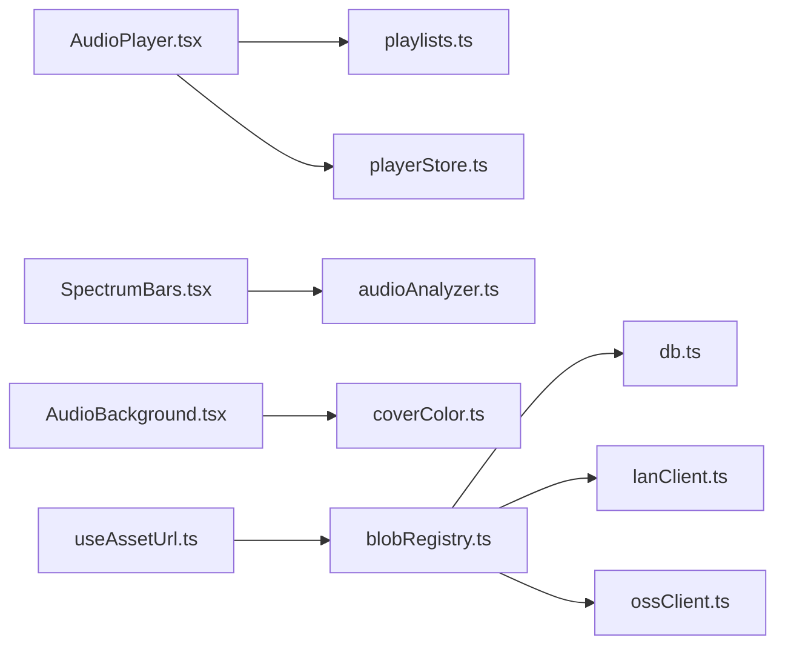

# 媒体工具 API

<cite>
**本文引用的文件**
- [blobRegistry.ts](file://src/media/blobRegistry.ts)
- [useAssetUrl.ts](file://src/media/useAssetUrl.ts)
- [audioAnalyzer.ts](file://src/media/audioAnalyzer.ts)
- [playlists.ts](file://src/media/playlists.ts)
- [SpectrumBars.tsx](file://src/components/SpectrumBars.tsx)
- [AudioPlayer.tsx](file://src/components/AudioPlayer.tsx)
- [playerStore.ts](file://src/store/playerStore.ts)
- [lyrics.ts](file://src/media/lyrics.ts)
- [mediaCoordinator.ts](file://src/media/mediaCoordinator.ts)
- [coverColor.ts](file://src/media/coverColor.ts)
- [fileKind.ts](file://src/media/fileKind.ts)
- [managedFile.ts](file://src/media/managedFile.ts)
- [types.ts](file://src/types.ts)
</cite>

## 目录
1. [简介](#简介)
2. [项目结构](#项目结构)
3. [核心组件](#核心组件)
4. [架构总览](#架构总览)
5. [详细组件分析](#详细组件分析)
6. [依赖关系分析](#依赖关系分析)
7. [性能考虑](#性能考虑)
8. [故障排查指南](#故障排查指南)
9. [结论](#结论)
10. [附录：API 速查与示例](#附录api-速查与示例)

## 简介
本 API 文档聚焦于媒体相关工具函数，覆盖以下能力：
- Blob 注册表：统一获取资源 URL、缩略图 URL、Blob 原始数据，支持本地缓存、局域网流式拉取、云端下载与封面生成。
- 资产 URL 生成工具：React Hook 封装，自动重试与轮询，适配局域网异步传输场景。
- 音频分析器：将正在播放的 <audio> 接入 AnalyserNode，提供频谱数据与音量级，用于可视化。
- 播放列表管理：基于画布连线解析“命名文本节点 → 音频链”的歌单顺序，支持 DFS 先序线性化、去重、环检测与警告。
- 实用工具：文件类型识别、大小格式化、歌词解析（LRC/ID3）、全局媒体互斥、封面主色提取等。

## 项目结构
媒体模块位于 src/media，UI 组件在 src/components，播放器状态在 src/store。关键路径如下：
- 资源与 URL：blobRegistry.ts、useAssetUrl.ts
- 音频分析与可视化：audioAnalyzer.ts、SpectrumBars.tsx、AudioBackground.tsx
- 播放列表：playlists.ts、playerStore.ts、AudioPlayer.tsx
- 辅助工具：lyrics.ts、mediaCoordinator.ts、coverColor.ts、fileKind.ts、managedFile.ts、types.ts

图表来源
- [blobRegistry.ts:1-389](file://src/media/blobRegistry.ts#L1-L389)
- [useAssetUrl.ts:1-157](file://src/media/useAssetUrl.ts#L1-L157)
- [audioAnalyzer.ts:1-59](file://src/media/audioAnalyzer.ts#L1-L59)
- [playlists.ts:1-179](file://src/media/playlists.ts#L1-L179)
- [SpectrumBars.tsx:1-120](file://src/components/SpectrumBars.tsx#L1-L120)
- [AudioPlayer.tsx:1-800](file://src/components/AudioPlayer.tsx#L1-L800)
- [playerStore.ts:1-298](file://src/store/playerStore.ts#L1-L298)
- [lyrics.ts:1-206](file://src/media/lyrics.ts#L1-L206)
- [mediaCoordinator.ts:1-25](file://src/media/mediaCoordinator.ts#L1-L25)
- [coverColor.ts:1-252](file://src/media/coverColor.ts#L1-L252)

章节来源
- [blobRegistry.ts:1-389](file://src/media/blobRegistry.ts#L1-L389)
- [useAssetUrl.ts:1-157](file://src/media/useAssetUrl.ts#L1-L157)
- [audioAnalyzer.ts:1-59](file://src/media/audioAnalyzer.ts#L1-L59)
- [playlists.ts:1-179](file://src/media/playlists.ts#L1-L179)
- [SpectrumBars.tsx:1-120](file://src/components/SpectrumBars.tsx#L1-L120)
- [AudioPlayer.tsx:1-800](file://src/components/AudioPlayer.tsx#L1-L800)
- [playerStore.ts:1-298](file://src/store/playerStore.ts#L1-L298)
- [lyrics.ts:1-206](file://src/media/lyrics.ts#L1-L206)
- [mediaCoordinator.ts:1-25](file://src/media/mediaCoordinator.ts#L1-L25)
- [coverColor.ts:1-252](file://src/media/coverColor.ts#L1-L252)

## 核心组件
- Blob 注册表：集中管理资源 URL、缩略图 URL、Blob 获取与缓存失效；支持本地 IndexedDB、局域网 HTTP 流式、云端 OSS 下载与视频抓帧生成封面。
- 资产 URL Hook：封装 getAssetUrl/getThumbnailUrl 的加载、重试与轮询逻辑，适配局域网异步就绪场景。
- 音频分析器：单例 AudioContext + AnalyserNode，将当前播放元素接入分析图，提供频率数据和归一化音量级。
- 播放列表：从画布节点与边解析歌单，DFS 先序线性化，处理分叉排序、环检测、重复歌曲告警。
- 歌词解析：支持 LRC 与 ID3（SYLT/USLT）歌词提取与缓存。
- 媒体互斥：同一时刻最多一个音频/视频播放，避免冲突。
- 封面取色：从专辑封面提取主色、强调色、背景亮度，驱动 UI 主题与对比度决策。

章节来源
- [blobRegistry.ts:1-389](file://src/media/blobRegistry.ts#L1-L389)
- [useAssetUrl.ts:1-157](file://src/media/useAssetUrl.ts#L1-L157)
- [audioAnalyzer.ts:1-59](file://src/media/audioAnalyzer.ts#L1-L59)
- [playlists.ts:1-179](file://src/media/playlists.ts#L1-L179)
- [lyrics.ts:1-206](file://src/media/lyrics.ts#L1-L206)
- [mediaCoordinator.ts:1-25](file://src/media/mediaCoordinator.ts#L1-L25)
- [coverColor.ts:1-252](file://src/media/coverColor.ts#L1-L252)

## 架构总览
媒体工具通过分层设计解耦数据源、URL 生成、可视化与播放控制：
- 数据层：IndexedDB、局域网中继、云端 OSS。
- 资源层：blobRegistry 统一获取 Blob/URL，并负责缩略图生成与缓存。
- 展示层：Hook 与组件消费 URL，渲染播放器、频谱条、背景。
- 控制层：playerStore 管理播放状态与队列，playlists 提供顺序。

图表来源
- [useAssetUrl.ts:10-44](file://src/media/useAssetUrl.ts#L10-L44)
- [useAssetUrl.ts:52-99](file://src/media/useAssetUrl.ts#L52-L99)
- [blobRegistry.ts:84-126](file://src/media/blobRegistry.ts#L84-L126)
- [blobRegistry.ts:310-379](file://src/media/blobRegistry.ts#L310-L379)

## 详细组件分析

### Blob 注册表（资源与缩略图）
职责
- 提供 getAssetUrl、getAssetBlob、getThumbnailUrl、invalidate* 等方法。
- 优先使用本地 IndexedDB，其次局域网 HTTP 流式地址，最后回退到云端下载。
- 视频缩略图通过临时 video + canvas 抓帧生成，并发受限，失败时一次性拉取全量兜底。

关键流程
- 获取资源 URL：本地 blob → 局域网 HTTP 流式 → 云端下载后创建 blob URL。
- 获取缩略图：局域网已同步封面 → 本地记录封面 → 视频抓帧生成 → 失败时强制拉取全量再抓帧。
- 并发控制：缩略图抓取限制最大并发数，避免阻塞浏览器连接池。

图表来源
- [blobRegistry.ts:84-126](file://src/media/blobRegistry.ts#L84-L126)
- [blobRegistry.ts:128-239](file://src/media/blobRegistry.ts#L128-L239)
- [blobRegistry.ts:310-379](file://src/media/blobRegistry.ts#L310-L379)

章节来源
- [blobRegistry.ts:1-389](file://src/media/blobRegistry.ts#L1-L389)

### 资产 URL 生成 Hook
功能
- useAssetUrl：加载资源 URL，带重试机制，适用于局域网传输未完成场景。
- useThumbnailUrl：轮询获取缩略图，局域网下延长等待时间，离线快速失败。
- useAssetSourceUrl：通用 URL 获取 Hook，支持 asset/thumbnail 两种来源。
- usePsdPreviewUrl：PSD 预览专用，必要时触发预览生成后再获取缩略图。

使用建议
- 在列表或卡片中展示资源时使用 useAssetUrl，确保网络波动下的稳定性。
- 缩略图建议使用 useThumbnailUrl，避免长时间空白。

章节来源
- [useAssetUrl.ts:1-157](file://src/media/useAssetUrl.ts#L1-L157)

### 音频分析器（频谱与音量）
功能
- wireAudioElement：将 HTMLAudioElement 接入 AnalyserNode，仅一次绑定。
- getAnalyser：获取共享的 AnalyserNode，供可视化组件读取频率数据。
- getAudioLevel：计算归一化音量级（0..1），用于波纹幅度等动画。

注意事项
- 某些环境可能不支持 Web Audio，需静默降级。
- 分析器 FFT 大小与平滑参数已优化，适合实时可视化。

章节来源
- [audioAnalyzer.ts:1-59](file://src/media/audioAnalyzer.ts#L1-L59)
- [SpectrumBars.tsx:1-120](file://src/components/SpectrumBars.tsx#L1-L120)

### 播放列表管理 API
规则
- 歌单名：命名文本节点（kind=text，非空，无入边，恰好一条出边指向音频）。
- 首节点：该文本指向的音频节点。
- 内容顺序：从首节点沿“音频→音频”边做 DFS 先序遍历，分叉处按边 order 升序，未设置 order 的排在后面，稳定排序。
- 去重与环检测：同一 assetId 只保留第一次出现；检测到循环连线则停止该方向遍历并告警。

接口
- audioNextEdges：筛选并排序下一首候选边。
- linearizeFrom：从指定起点线性化为歌单顺序。
- resolvePlaylists：扫描整张画布解析所有命名歌单。
- findPlaylistByAsset：查找包含某首歌的歌单。
- resolvePlaylistsCached：对相同引用进行结果缓存，避免重复解析。

图表来源
- [playlists.ts:56-112](file://src/media/playlists.ts#L56-L112)
- [playlists.ts:114-179](file://src/media/playlists.ts#L114-L179)

章节来源
- [playlists.ts:1-179](file://src/media/playlists.ts#L1-L179)

### 歌词解析与加载
功能
- parseLrc：解析 LRC 歌词，支持多时间戳行与元信息（如 offset）。
- extractId3Lyrics：从 MP3 ID3 标签中提取 SYLT（同步歌词）或 USLT（非同步歌词）。
- loadLyricsFor：优先从关联 .lrc 文件加载，否则从内嵌 ID3 提取，结果缓存。

章节来源
- [lyrics.ts:1-206](file://src/media/lyrics.ts#L1-L206)

### 全局媒体互斥
功能
- registerAudio/registerVideo：注册媒体元素，播放时自动暂停同类型的其他元素，避免冲突。

章节来源
- [mediaCoordinator.ts:1-25](file://src/media/mediaCoordinator.ts#L1-L25)

### 封面取色与对比度
功能
- extractCoverPalette：从封面图片提取主色相、强调色、RGB 分量与背景相对亮度，用于 UI 主题与文字对比度决策。
- relativeLuminance/contrastRatio：WCAG 标准亮度与对比度计算。
- useCoverPalette：React Hook 封装，异步取色并缓存。

章节来源
- [coverColor.ts:1-252](file://src/media/coverColor.ts#L1-L252)

### 文件类型识别与管理
功能
- detectKind：根据 MIME 与扩展名推断媒体类型。
- formatBytes：格式化文件大小。
- collectFiles/isMp3：聚合画布节点与素材记录，生成可管理文件列表，判断 MP3。

章节来源
- [fileKind.ts:1-24](file://src/media/fileKind.ts#L1-L24)
- [managedFile.ts:1-39](file://src/media/managedFile.ts#L1-L39)

## 依赖关系分析
- 播放器与播放列表：AudioPlayer 通过 playlists 解析顺序，playerStore 管理播放状态与队列。
- 资源与可视化：SpectrumBars 依赖 audioAnalyzer 获取频率数据；AudioBackground 依赖 coverColor 生成主题色。
- 资源获取：useAssetUrl 依赖 blobRegistry；blobRegistry 依赖 db、lanClient、ossClient、cloudSync。

图表来源
- [AudioPlayer.tsx:1-800](file://src/components/AudioPlayer.tsx#L1-L800)
- [playerStore.ts:1-298](file://src/store/playerStore.ts#L1-L298)
- [SpectrumBars.tsx:1-120](file://src/components/SpectrumBars.tsx#L1-L120)
- [audioAnalyzer.ts:1-59](file://src/media/audioAnalyzer.ts#L1-L59)
- [useAssetUrl.ts:1-157](file://src/media/useAssetUrl.ts#L1-L157)
- [blobRegistry.ts:1-389](file://src/media/blobRegistry.ts#L1-L389)

章节来源
- [AudioPlayer.tsx:1-800](file://src/components/AudioPlayer.tsx#L1-L800)
- [playerStore.ts:1-298](file://src/store/playerStore.ts#L1-L298)
- [SpectrumBars.tsx:1-120](file://src/components/SpectrumBars.tsx#L1-L120)
- [audioAnalyzer.ts:1-59](file://src/media/audioAnalyzer.ts#L1-L59)
- [useAssetUrl.ts:1-157](file://src/media/useAssetUrl.ts#L1-L157)
- [blobRegistry.ts:1-389](file://src/media/blobRegistry.ts#L1-L389)

## 性能考虑
- 缩略图抓取并发限制：避免多个隐藏 video 同时 seek 导致浏览器连接池阻塞，影响播放体验。
- 懒加载与缓存：URL 与缩略图均使用内存缓存，减少重复请求；IndexedDB 持久化资源，提升离线可用性。
- 流式播放：视频优先使用局域网 HTTP 流式地址，边下边播，降低内存与磁盘压力。
- 可视化优化：频谱条使用感知曲线与指数平滑，减少抖动；背景仅在封面变化或淡入时重绘，静态零开销。
- 歌词解析缓存：loadLyricsFor 对结果进行缓存，避免重复 IO。

[本节为通用性能建议，不直接分析具体文件]

## 故障排查指南
常见问题与定位
- 资源加载失败：useAssetUrl 会重试多次，若仍失败则提示错误；检查局域网连接与资源是否在线。
- 缩略图始终为空：确认视频是否可抓帧（跨域/代理可能导致 canvas 污染），必要时触发强制拉取全量兜底。
- 音频可视化无效：确认音频元素已通过 wireAudioElement 接入分析器，且环境支持 Web Audio。
- 播放列表顺序异常：检查边的 order 设置与连线是否正确，注意环检测与重复歌曲告警。
- 歌词无法显示：确认 .lrc 文件是否关联正确，或 MP3 是否包含 ID3 歌词标签。

章节来源
- [useAssetUrl.ts:10-44](file://src/media/useAssetUrl.ts#L10-L44)
- [blobRegistry.ts:128-239](file://src/media/blobRegistry.ts#L128-L239)
- [audioAnalyzer.ts:26-47](file://src/media/audioAnalyzer.ts#L26-L47)
- [playlists.ts:71-112](file://src/media/playlists.ts#L71-L112)
- [lyrics.ts:181-206](file://src/media/lyrics.ts#L181-L206)

## 结论
媒体工具模块提供了完整的资源获取、可视化与播放管理能力，结合局域网流式与云端下载，兼顾性能与用户体验。通过严格的并发控制、缓存策略与错误处理，确保在多设备协作与复杂网络环境下稳定运行。

[本节为总结性内容，不直接分析具体文件]

## 附录：API 速查与示例

### Blob 注册表
- getAssetUrl(assetId): Promise<string>
  - 用途：获取资源的可直接使用的 URL（本地 blob URL 或局域网 HTTP 流式地址）。
  - 示例：在 <video> 或 <audio> 的 src 中使用。
- getAssetBlob(assetId): Promise<Blob>
  - 用途：获取原始资源 Blob，用于下载或进一步处理。
  - 示例：构造 Blob URL 后触发下载。
- getThumbnailUrl(assetId): Promise<string | undefined>
  - 用途：获取缩略图 URL，视频会自动抓帧生成。
  - 示例：在卡片或列表中展示封面。
- invalidateAssetUrl / invalidateThumbnailUrl / invalidateAllAssetUrls
  - 用途：清理缓存 URL，释放对象 URL 内存。
  - 示例：资源更新或切换时调用。

章节来源
- [blobRegistry.ts:84-126](file://src/media/blobRegistry.ts#L84-L126)
- [blobRegistry.ts:310-379](file://src/media/blobRegistry.ts#L310-L379)

### 资产 URL Hook
- useAssetUrl(assetId?, version?): string | undefined
  - 用途：加载资源 URL，带重试与错误提示。
  - 示例：在组件中直接使用返回值作为 src。
- useThumbnailUrl(assetId?): string | undefined
  - 用途：轮询获取缩略图，适配局域网异步就绪。
  - 示例：在封面加载中持续等待直至就绪。
- useAssetSourceUrl(assetId?, source?)
  - 用途：通用 URL 获取 Hook，支持 asset/thumbnail。
  - 示例：根据场景选择不同来源。
- usePsdPreviewUrl(assetId?): string | undefined
  - 用途：PSD 预览专用，必要时触发预览生成。
  - 示例：在 PSD 节点中展示预览图。

章节来源
- [useAssetUrl.ts:10-44](file://src/media/useAssetUrl.ts#L10-L44)
- [useAssetUrl.ts:52-99](file://src/media/useAssetUrl.ts#L52-L99)
- [useAssetUrl.ts:101-127](file://src/media/useAssetUrl.ts#L101-L127)
- [useAssetUrl.ts:129-157](file://src/media/useAssetUrl.ts#L129-L157)

### 音频分析器
- wireAudioElement(el: HTMLAudioElement | null): void
  - 用途：将音频元素接入分析器，仅一次绑定。
  - 示例：在播放器挂载时调用。
- getAnalyser(): AnalyserNode | null
  - 用途：获取共享分析器节点，读取频率数据。
  - 示例：在频谱条组件中每帧读取。
- getAudioLevel(): number
  - 用途：归一化音量级，用于动画幅度。
  - 示例：波纹高度随音量变化。

章节来源
- [audioAnalyzer.ts:26-59](file://src/media/audioAnalyzer.ts#L26-L59)
- [SpectrumBars.tsx:28-31](file://src/components/SpectrumBars.tsx#L28-L31)
- [SpectrumBars.tsx:61-64](file://src/components/SpectrumBars.tsx#L61-L64)

### 播放列表管理
- audioNextEdges(edges, sourceNodeId, nodes): SuqEdge[]
  - 用途：筛选并排序下一首候选边。
  - 示例：自定义导航逻辑时复用。
- linearizeFrom(nodes, edges, startNodeId): LinearizeResult
  - 用途：从起点线性化为歌单顺序。
  - 示例：播放器引擎使用此顺序切歌。
- resolvePlaylists(nodes, edges): Playlist[]
  - 用途：解析所有命名歌单。
  - 示例：播放器侧边栏展示歌单列表。
- findPlaylistByAsset(playlists, assetId): Playlist | undefined
  - 用途：查找包含某首歌的歌单。
  - 示例：在标题下方显示所属歌单入口。
- resolvePlaylistsCached(nodes, edges): Playlist[]
  - 用途：带缓存的解析，避免重复计算。
  - 示例：高频调用场景（悬浮窗/播放器）使用。

章节来源
- [playlists.ts:56-112](file://src/media/playlists.ts#L56-L112)
- [playlists.ts:114-179](file://src/media/playlists.ts#L114-L179)

### 歌词解析
- parseLrc(content): LyricsData | undefined
  - 用途：解析 LRC 歌词。
  - 示例：用户导入 .lrc 文件后显示同步歌词。
- extractId3Lyrics(blob): Promise<LyricsData | undefined>
  - 用途：从 MP3 内嵌 ID3 提取歌词。
  - 示例：无需额外文件即可显示歌词。
- loadLyricsFor(assetId, getRecord, findLrcText, cacheKey): Promise<LyricsResult>
  - 用途：优先 .lrc，其次 ID3，结果缓存。
  - 示例：播放器打开时自动加载歌词。

章节来源
- [lyrics.ts:16-46](file://src/media/lyrics.ts#L16-L46)
- [lyrics.ts:129-167](file://src/media/lyrics.ts#L129-L167)
- [lyrics.ts:181-206](file://src/media/lyrics.ts#L181-L206)

### 媒体互斥
- registerAudio(el: HTMLAudioElement): () => void
  - 用途：注册音频元素，播放时自动暂停其他音频。
  - 示例：每个音频节点挂载时调用。
- registerVideo(el: HTMLVideoElement): () => void
  - 用途：注册视频元素，播放时自动暂停其他视频。
  - 示例：视频节点挂载时调用。

章节来源
- [mediaCoordinator.ts:7-25](file://src/media/mediaCoordinator.ts#L7-L25)

### 封面取色与对比度
- extractCoverPalette(url): Promise<CoverPalette | null>
  - 用途：从封面提取主色、强调色、背景亮度等。
  - 示例：驱动播放器背景与控件颜色。
- relativeLuminance(r, g, b): number
  - 用途：计算 WCAG 相对亮度。
  - 示例：决定歌词前景色深浅。
- contrastRatio(l1, l2): number
  - 用途：计算两个亮度的对比度比。
  - 示例：选择更优的文字颜色。
- useCoverPalette(url?): CoverPalette | null
  - 用途：React Hook 封装取色逻辑。
  - 示例：在播放器中订阅封面变化并更新主题。

章节来源
- [coverColor.ts:21-37](file://src/media/coverColor.ts#L21-L37)
- [coverColor.ts:154-229](file://src/media/coverColor.ts#L154-L229)
- [coverColor.ts:231-252](file://src/media/coverColor.ts#L231-L252)

### 文件类型与管理
- detectKind(file): MediaKind
  - 用途：推断文件类型。
  - 示例：上传时分类显示图标。
- formatBytes(bytes): string
  - 用途：格式化文件大小。
  - 示例：在文件列表中显示尺寸。
- collectFiles(nodes, records): ManagedFile[]
  - 用途：聚合节点与记录，生成可管理文件列表。
  - 示例：播放器列出所有 MP3。
- isMp3(file): boolean
  - 用途：判断是否为 MP3。
  - 示例：过滤仅 MP3 进入播放列表。

章节来源
- [fileKind.ts:3-24](file://src/media/fileKind.ts#L3-L24)
- [managedFile.ts:13-39](file://src/media/managedFile.ts#L13-L39)