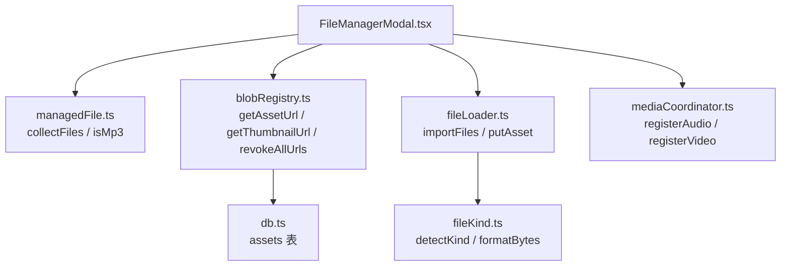
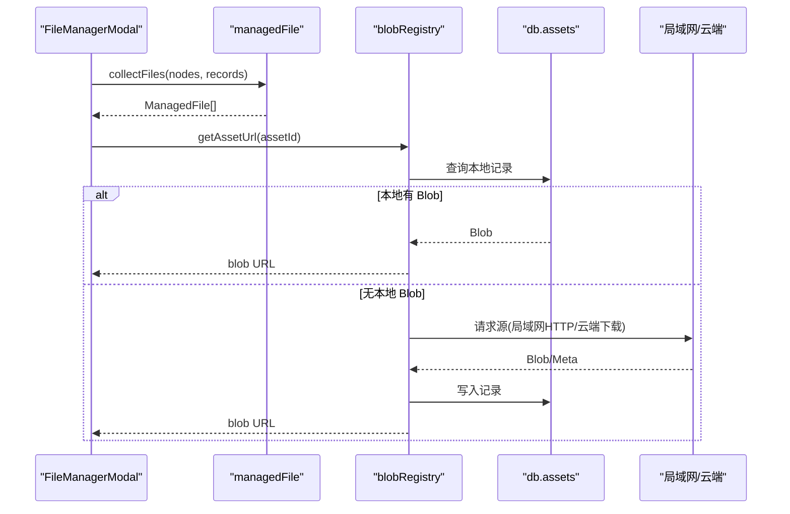
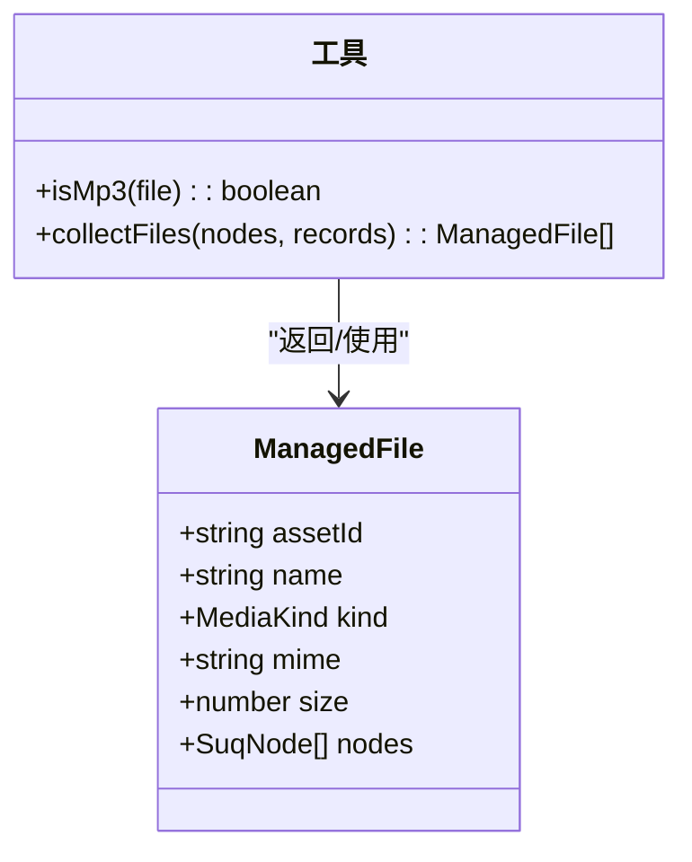
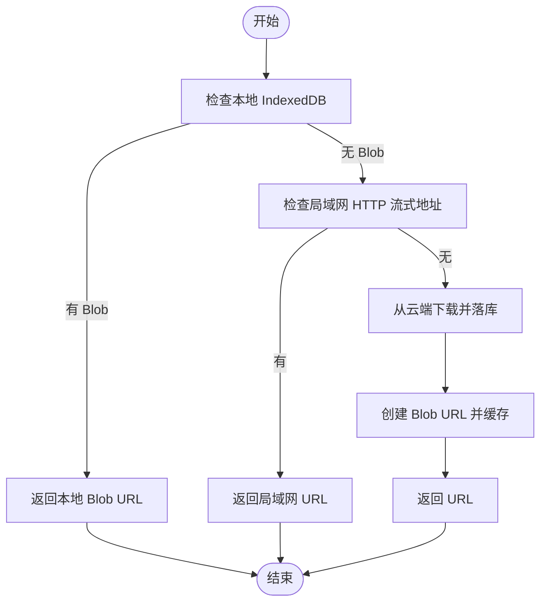
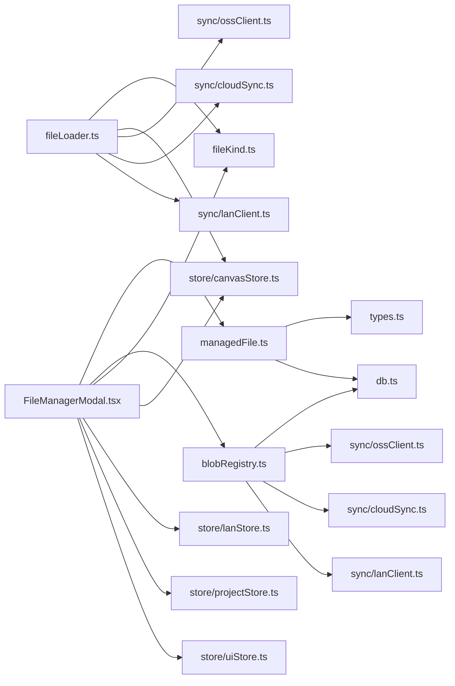

# 文件管理 API

<cite>
**本文引用的文件**
- [managedFile.ts](file://src/media/managedFile.ts)
- [blobRegistry.ts](file://src/media/blobRegistry.ts)
- [fileKind.ts](file://src/media/fileKind.ts)
- [mediaCoordinator.ts](file://src/media/mediaCoordinator.ts)
- [fileLoader.ts](file://src/io/fileLoader.ts)
- [db.ts](file://src/db/db.ts)
- [types.ts](file://src/types.ts)
- [FileManagerModal.tsx](file://src/components/FileManagerModal.tsx)
</cite>

## 目录
1. [简介](#简介)
2. [项目结构](#项目结构)
3. [核心组件](#核心组件)
4. [架构总览](#架构总览)
5. [详细组件分析](#详细组件分析)
6. [依赖关系分析](#依赖关系分析)
7. [性能与内存管理](#性能与内存管理)
8. [故障排查指南](#故障排查指南)
9. [结论](#结论)
10. [附录：API 参考](#附录api-参考)

## 简介
本文档围绕 ManagedFile 接口及其在系统中的生命周期管理，提供完整的 API 说明。内容涵盖文件的加载、缓存、释放、元数据属性、状态管理与事件监听机制，并给出最佳实践与异常处理建议。该能力支撑画布中图片、视频、音频、PDF、PSD、Markdown、文本等资源的统一管理与使用。

## 项目结构
ManagedFile 是“可管理的文件”抽象，由画布节点与素材记录聚合而成；实际资源通过 blobRegistry 进行获取、缓存与释放；文件类型识别与格式化由 fileKind 提供；媒体播放互斥由 mediaCoordinator 统一管理；导入与上传流程由 fileLoader 驱动；持久化存储由 db 层（IndexedDB）承担；UI 层通过 FileManagerModal 暴露操作入口。

图表来源
- [FileManagerModal.tsx:1-200](file://src/components/FileManagerModal.tsx#L1-L200)
- [managedFile.ts:1-39](file://src/media/managedFile.ts#L1-L39)
- [blobRegistry.ts:1-126](file://src/media/blobRegistry.ts#L1-L126)
- [fileLoader.ts:77-117](file://src/io/fileLoader.ts#L77-L117)
- [fileKind.ts:1-24](file://src/media/fileKind.ts#L1-L24)
- [db.ts:1-69](file://src/db/db.ts#L1-L69)
- [mediaCoordinator.ts:1-25](file://src/media/mediaCoordinator.ts#L1-L25)

章节来源
- [FileManagerModal.tsx:1-200](file://src/components/FileManagerModal.tsx#L1-L200)
- [managedFile.ts:1-39](file://src/media/managedFile.ts#L1-L39)
- [blobRegistry.ts:1-126](file://src/media/blobRegistry.ts#L1-L126)
- [fileLoader.ts:77-117](file://src/io/fileLoader.ts#L77-L117)
- [fileKind.ts:1-24](file://src/media/fileKind.ts#L1-L24)
- [db.ts:1-69](file://src/db/db.ts#L1-L69)
- [mediaCoordinator.ts:1-25](file://src/media/mediaCoordinator.ts#L1-L25)

## 核心组件
- ManagedFile：表示一个可管理的文件实体，包含资产 ID、名称、类型、MIME、大小以及关联的画布节点集合。
- Blob 注册表：负责资源 URL 与缩略图 URL 的缓存、失效与释放，支持本地 IndexedDB、局域网流式地址与云端下载。
- 文件类型识别：根据 File 对象推断 MediaKind，并提供字节数格式化。
- 媒体协调器：全局互斥播放，避免多音频/多视频同时播放导致冲突。
- 文件导入与上传：将用户文件入库、生成缩略图、同步到局域网与云端。
- 数据库：持久化 AssetRecord，支持垃圾回收与清理。

章节来源
- [managedFile.ts:1-39](file://src/media/managedFile.ts#L1-L39)
- [blobRegistry.ts:1-126](file://src/media/blobRegistry.ts#L1-L126)
- [fileKind.ts:1-24](file://src/media/fileKind.ts#L1-L24)
- [mediaCoordinator.ts:1-25](file://src/media/mediaCoordinator.ts#L1-L25)
- [fileLoader.ts:77-117](file://src/io/fileLoader.ts#L77-L117)
- [db.ts:1-69](file://src/db/db.ts#L1-L69)

## 架构总览
ManagedFile 作为视图侧的聚合模型，不直接持有二进制数据；真实数据由 blobRegistry 按需加载与缓存。UI 层通过 collectFiles 将当前画布中的节点与已加载的素材记录聚合为 ManagedFile 列表，再调用 getAssetUrl/getThumbnailUrl 获取资源或封面。删除时通过 invalidateAllAssetUrls 释放缓存，并通过 removeAssets 清理画布引用与 IndexedDB 中的冗余数据。

图表来源
- [FileManagerModal.tsx:160-194](file://src/components/FileManagerModal.tsx#L160-L194)
- [managedFile.ts:17-38](file://src/media/managedFile.ts#L17-L38)
- [blobRegistry.ts:84-126](file://src/media/blobRegistry.ts#L84-L126)
- [db.ts:5-14](file://src/db/db.ts#L5-L14)

## 详细组件分析

### ManagedFile 接口与工具
- 字段
  - assetId：唯一标识
  - name：显示名（优先来自素材记录，其次节点标签）
  - kind：媒体类型
  - mime：MIME 类型
  - size：文件大小
  - nodes：与该资产关联的所有画布节点
- 工具函数
  - isMp3：判断是否为 MP3 音频
  - collectFiles：从节点与素材记录聚合出 ManagedFile 列表

图表来源
- [managedFile.ts:4-38](file://src/media/managedFile.ts#L4-L38)
- [types.ts:3-14](file://src/types.ts#L3-L14)
- [types.ts:66-107](file://src/types.ts#L66-L107)

章节来源
- [managedFile.ts:1-39](file://src/media/managedFile.ts#L1-L39)
- [types.ts:3-14](file://src/types.ts#L3-L14)
- [types.ts:66-107](file://src/types.ts#L66-L107)

### 资源加载与缓存（Blob 注册表）
- 资源 URL 获取
  - 优先返回本地 IndexedDB 中的 Blob 对应的 object URL
  - 若存在局域网 HTTP 流式地址则直接返回（边下边播）
  - 否则尝试从云端下载并落库后再生成 URL
- 缩略图 URL 获取
  - 优先使用局域网同步来的缩略图
  - 若本地已有缩略图且为视频，会进行黑帧自检并可能重新抓帧
  - 对视频资源，必要时通过局域网抓取源或强制拉取全量以保障封面生成
- 缓存与释放
  - urlCache、thumbCache 分别缓存资源与缩略图的 URL
  - invalidateAssetUrl/invalidateThumbnailUrl/invalidateAllAssetUrls 用于单条或批量失效
  - revokeAllUrls 统一释放所有 URL 并清空缓存

图表来源
- [blobRegistry.ts:84-126](file://src/media/blobRegistry.ts#L84-L126)
- [blobRegistry.ts:310-379](file://src/media/blobRegistry.ts#L310-L379)
- [blobRegistry.ts:381-388](file://src/media/blobRegistry.ts#L381-L388)

章节来源
- [blobRegistry.ts:1-126](file://src/media/blobRegistry.ts#L1-L126)
- [blobRegistry.ts:310-388](file://src/media/blobRegistry.ts#L310-L388)

### 文件类型识别与格式化
- detectKind：根据 File.type 与扩展名推断 MediaKind（image/video/audio/pdf/psd/markdown/text/file）
- formatBytes：将字节数格式化为人类可读字符串

章节来源
- [fileKind.ts:1-24](file://src/media/fileKind.ts#L1-L24)

### 媒体播放互斥
- 同一时刻最多一个音频和一个视频播放
- 任意媒体元素触发 play 时自动暂停同类型的其他元素
- 提供 registerAudio/registerVideo 注册与注销媒体元素

章节来源
- [mediaCoordinator.ts:1-25](file://src/media/mediaCoordinator.ts#L1-L25)

### 文件导入与上传
- importFiles：批量导入文件，限制最大文件大小，逐个 putAsset 并创建画布节点
- putAsset：检测类型、生成缩略图（视频/PSD），写入 IndexedDB，可选推送到局域网与云端
- updateAssetText：更新文本类资源并复用同步链路

章节来源
- [fileLoader.ts:77-117](file://src/io/fileLoader.ts#L77-L117)
- [fileLoader.ts:186-205](file://src/io/fileLoader.ts#L186-L205)
- [fileLoader.ts:119-135](file://src/io/fileLoader.ts#L119-L135)

### 数据模型与持久化
- AssetRecord：资产记录，包含 id、name、mime、size、kind、blob、thumbnail、orphanedAt
- gcAssets：垃圾回收，标记未引用资产并在超时后删除

章节来源
- [db.ts:5-14](file://src/db/db.ts#L5-L14)
- [db.ts:46-69](file://src/db/db.ts#L46-L69)

### UI 交互与事件
- FileManagerModal：打开/关闭文件管理器、搜索过滤、按类型分组、打开不同查看器、下载、删除
- 键盘快捷键：Ctrl/Cmd+P 打开，Esc 关闭
- 删除流程：先移除画布引用，再删除 IndexedDB 中未被其他项目引用的资产，最后释放 URL 缓存

章节来源
- [FileManagerModal.tsx:1-200](file://src/components/FileManagerModal.tsx#L1-L200)
- [FileManagerModal.tsx:160-194](file://src/components/FileManagerModal.tsx#L160-L194)
- [FileManagerModal.tsx:214-238](file://src/components/FileManagerModal.tsx#L214-L238)

## 依赖关系分析
- managedFile.ts 依赖 types.ts 的 MediaKind 与 SuqNode，依赖 db.ts 的 AssetRecord
- blobRegistry.ts 依赖 db.ts、sync 模块（局域网/云端）、types.ts
- fileLoader.ts 依赖 fileKind.ts、store/canvasStore、sync/ossClient、sync/cloudSync、sync/lanClient、media/psdPreview
- FileManagerModal.tsx 依赖 managedFile、blobRegistry、fileKind、canvasStore、lanStore、projectStore、uiStore

图表来源
- [managedFile.ts:1-39](file://src/media/managedFile.ts#L1-L39)
- [blobRegistry.ts:1-126](file://src/media/blobRegistry.ts#L1-L126)
- [fileLoader.ts:1-18](file://src/io/fileLoader.ts#L1-L18)
- [FileManagerModal.tsx:1-200](file://src/components/FileManagerModal.tsx#L1-L200)

章节来源
- [managedFile.ts:1-39](file://src/media/managedFile.ts#L1-L39)
- [blobRegistry.ts:1-126](file://src/media/blobRegistry.ts#L1-L126)
- [fileLoader.ts:1-18](file://src/io/fileLoader.ts#L1-L18)
- [FileManagerModal.tsx:1-200](file://src/components/FileManagerModal.tsx#L1-L200)

## 性能与内存管理
- 并发控制
  - 视频封面抓帧并发上限为 2，避免阻塞浏览器连接池影响播放体验
- 缓存策略
  - 资源 URL 与缩略图 URL 均被缓存，减少重复 I/O
  - 局域网 HTTP 流式地址优先，避免整份下载大文件
- 内存释放
  - 删除或切换页面时应调用 invalidateAllAssetUrls 或 revokeAllUrls 释放 blob URL
  - 缩略图生成完成后及时释放临时 URL
- 垃圾回收
  - 定期运行 gcAssets 清理长期未引用的资产，防止 IndexedDB 膨胀

章节来源
- [blobRegistry.ts:20-39](file://src/media/blobRegistry.ts#L20-L39)
- [blobRegistry.ts:381-388](file://src/media/blobRegistry.ts#L381-L388)
- [db.ts:46-69](file://src/db/db.ts#L46-L69)

## 故障排查指南
- 无法生成视频缩略图
  - 现象：捕获失败或得到黑帧
  - 处理：系统会自动重试 seek 到下一采样点；若仍失败，会回退到强制拉取全量后再抓帧
  - 相关位置：[blobRegistry.ts:128-239](file://src/media/blobRegistry.ts#L128-L239)、[blobRegistry.ts:310-379](file://src/media/blobRegistry.ts#L310-L379)
- 跨源安全错误导致封面失败
  - 现象：canvas 被污染，getImageData/toBlob 抛 SecurityError
  - 处理：设置 crossOrigin=anonymous，并确保服务器允许跨域
  - 相关位置：[blobRegistry.ts:128-139](file://src/media/blobRegistry.ts#L128-L139)
- 资源不存在
  - 现象：getAssetBlob 抛出错误
  - 处理：检查云端/局域网是否可用，或确认资产是否已被删除
  - 相关位置：[blobRegistry.ts:107-126](file://src/media/blobRegistry.ts#L107-L126)
- 导入失败
  - 现象：toast 提示导入失败
  - 处理：检查文件大小限制、权限与网络状况
  - 相关位置：[fileLoader.ts:186-205](file://src/io/fileLoader.ts#L186-L205)
- 删除受保护的文件
  - 现象：正在被他人编辑的文件无法删除
  - 处理：等待协作方释放或提示用户
  - 相关位置：[FileManagerModal.tsx:214-238](file://src/components/FileManagerModal.tsx#L214-L238)

章节来源
- [blobRegistry.ts:128-239](file://src/media/blobRegistry.ts#L128-L239)
- [blobRegistry.ts:310-379](file://src/media/blobRegistry.ts#L310-L379)
- [blobRegistry.ts:107-126](file://src/media/blobRegistry.ts#L107-L126)
- [fileLoader.ts:186-205](file://src/io/fileLoader.ts#L186-L205)
- [FileManagerModal.tsx:214-238](file://src/components/FileManagerModal.tsx#L214-L238)

## 结论
ManagedFile 提供了统一的文件抽象，结合 blobRegistry 的缓存与释放机制，实现了高效、稳定的资源访问。通过 fileKind 的类型识别与 mediaCoordinator 的播放互斥，系统在多媒体场景下具备良好的用户体验。配合 UI 层的操作与 db 层的持久化与 GC，形成了完整的文件生命周期管理能力。

## 附录：API 参考

### ManagedFile 接口
- 字段
  - assetId: string
  - name: string
  - kind: MediaKind
  - mime: string
  - size: number
  - nodes: SuqNode[]
- 方法
  - isMp3(file: ManagedFile): boolean
  - collectFiles(nodes: SuqNode[], records: Map<string, AssetRecord>): ManagedFile[]

章节来源
- [managedFile.ts:4-38](file://src/media/managedFile.ts#L4-L38)
- [types.ts:3-14](file://src/types.ts#L3-L14)
- [types.ts:66-107](file://src/types.ts#L66-L107)
- [db.ts:5-14](file://src/db/db.ts#L5-L14)

### Blob 注册表 API
- getAssetUrl(assetId: string): Promise<string>
- getAssetBlob(assetId: string): Promise<Blob>
- getThumbnailUrl(assetId: string): Promise<string | undefined>
- invalidateAssetUrl(assetId: string): void
- invalidateThumbnailUrl(assetId: string): void
- invalidateAllAssetUrls(assetId: string): void
- revokeAllUrls(): void

章节来源
- [blobRegistry.ts:41-56](file://src/media/blobRegistry.ts#L41-L56)
- [blobRegistry.ts:84-126](file://src/media/blobRegistry.ts#L84-L126)
- [blobRegistry.ts:310-388](file://src/media/blobRegistry.ts#L310-L388)

### 文件类型识别 API
- detectKind(file: File): MediaKind
- formatBytes(bytes: number): string

章节来源
- [fileKind.ts:3-23](file://src/media/fileKind.ts#L3-L23)

### 媒体协调器 API
- registerAudio(element: HTMLAudioElement): () => void
- registerVideo(element: HTMLVideoElement): () => void

章节来源
- [mediaCoordinator.ts:7-24](file://src/media/mediaCoordinator.ts#L7-L24)

### 文件导入与上传 API
- importFiles(files: File[], position: XYPosition): Promise<void>
- putAsset(file: File): Promise<AssetMeta>
- updateAssetText(assetId: string, text: string): Promise<void>

章节来源
- [fileLoader.ts:77-117](file://src/io/fileLoader.ts#L77-L117)
- [fileLoader.ts:186-205](file://src/io/fileLoader.ts#L186-L205)
- [fileLoader.ts:119-135](file://src/io/fileLoader.ts#L119-L135)

### 数据模型
- AssetRecord: id, name, mime, size, kind, blob, thumbnail, orphanedAt
- ProjectRecord: id, name, createdAt, updatedAt, graph, viewport

章节来源
- [db.ts:5-23](file://src/db/db.ts#L5-L23)