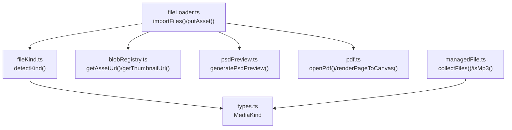
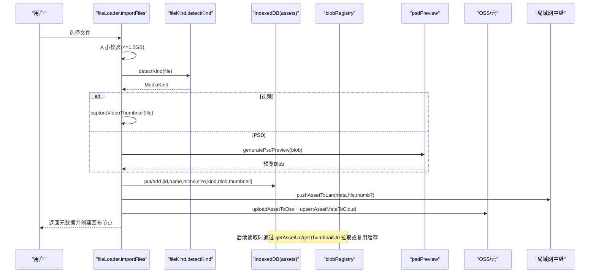
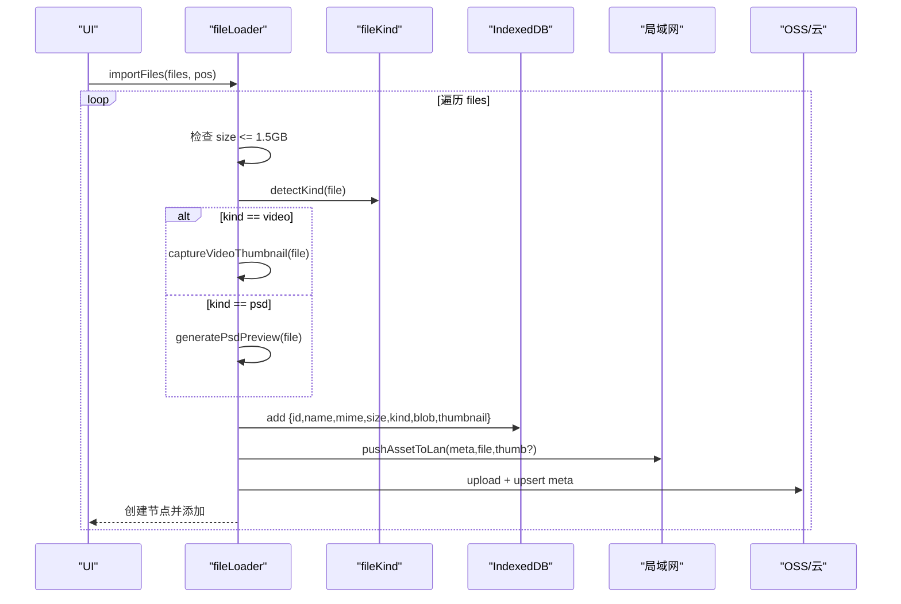
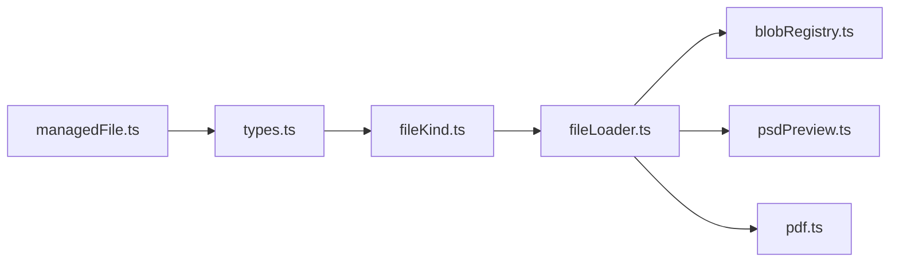

# 文件类型识别 API

<cite>
**本文引用的文件**
- [src/media/fileKind.ts](file://src/media/fileKind.ts)
- [src/types.ts](file://src/types.ts)
- [src/io/fileLoader.ts](file://src/io/fileLoader.ts)
- [src/media/blobRegistry.ts](file://src/media/blobRegistry.ts)
- [src/media/managedFile.ts](file://src/media/managedFile.ts)
- [src/media/psdPreview.ts](file://src/media/psdPreview.ts)
- [src/media/pdf.ts](file://src/media/pdf.ts)
- [src/media/fileKind.test.ts](file://src/media/fileKind.test.ts)
</cite>

## 目录
1. [简介](#简介)
2. [项目结构](#项目结构)
3. [核心组件](#核心组件)
4. [架构总览](#架构总览)
5. [详细组件分析](#详细组件分析)
6. [依赖关系分析](#依赖关系分析)
7. [性能与并发特性](#性能与并发特性)
8. [自定义扩展指南](#自定义扩展指南)
9. [故障排查](#故障排查)
10. [结论](#结论)

## 简介
本 API 文档聚焦于“文件类型识别系统”，覆盖媒体类型的识别规则、分类标准、支持的格式与扩展名映射、MIME 类型检测策略，以及自定义扩展方法与最佳实践。同时记录文件验证（大小限制、兼容性）与缩略图生成、PDF/PSD 预览等关键实现细节，帮助开发者在画布中正确导入、展示与管理各类资源。

## 项目结构
围绕文件类型识别的核心代码主要分布在以下模块：
- 识别与分类：src/media/fileKind.ts
- 类型定义：src/types.ts
- 导入与节点创建：src/io/fileLoader.ts
- 资源缓存与缩略图：src/media/blobRegistry.ts
- 管理聚合与 MP3 判定：src/media/managedFile.ts
- PSD 预览：src/media/psdPreview.ts
- PDF 渲染：src/media/pdf.ts



图表来源
- [src/media/fileKind.ts:3-16](file://src/media/fileKind.ts#L3-L16)
- [src/types.ts:3-14](file://src/types.ts#L3-L14)
- [src/io/fileLoader.ts:77-117](file://src/io/fileLoader.ts#L77-L117)
- [src/media/blobRegistry.ts:84-126](file://src/media/blobRegistry.ts#L84-L126)
- [src/media/psdPreview.ts:42-60](file://src/media/psdPreview.ts#L42-L60)
- [src/media/pdf.ts:23-49](file://src/media/pdf.ts#L23-L49)

章节来源
- [src/media/fileKind.ts:3-16](file://src/media/fileKind.ts#L3-L16)
- [src/types.ts:3-14](file://src/types.ts#L3-L14)
- [src/io/fileLoader.ts:77-117](file://src/io/fileLoader.ts#L77-L117)

## 核心组件
- 文件类型识别器 detectKind(file): 根据 File.type 与 File.name 扩展名将文件归类为 image/video/audio/pdf/markdown/text/psd/file 等 MediaKind。
- 资源获取与缩略图 blobRegistry: 提供 getAssetUrl/getThumbnailUrl，支持本地 IndexedDB、局域网 HTTP 流式地址、云端 OSS 回源，并负责视频封面抓帧与缓存。
- 导入流程 fileLoader: importFiles/putAsset 完成大小校验、缩略图生成、本地落库、局域网/云端同步，并创建画布节点。
- 类型与节点映射 types + fileLoader: 将 MediaKind 映射到画布节点类型与默认尺寸。
- 管理聚合 managedFile: collectFiles/isMp3 用于按 assetId 聚合节点与判断特定音频格式。
- 特殊格式处理 psdPreview/pdf: 分别提供 PSD 预览与 PDF 打开/渲染能力。

章节来源
- [src/media/fileKind.ts:3-16](file://src/media/fileKind.ts#L3-L16)
- [src/media/blobRegistry.ts:84-126](file://src/media/blobRegistry.ts#L84-L126)
- [src/io/fileLoader.ts:77-117](file://src/io/fileLoader.ts#L77-L117)
- [src/types.ts:3-14](file://src/types.ts#L3-L14)
- [src/media/managedFile.ts:13-38](file://src/media/managedFile.ts#L13-L38)
- [src/media/psdPreview.ts:42-60](file://src/media/psdPreview.ts#L42-L60)
- [src/media/pdf.ts:23-49](file://src/media/pdf.ts#L23-L49)

## 架构总览
文件从浏览器端导入到最终在画布中可视化的整体流程如下：



图表来源
- [src/io/fileLoader.ts:77-117](file://src/io/fileLoader.ts#L77-L117)
- [src/media/fileKind.ts:3-16](file://src/media/fileKind.ts#L3-L16)
- [src/media/blobRegistry.ts:84-126](file://src/media/blobRegistry.ts#L84-L126)
- [src/media/psdPreview.ts:42-60](file://src/media/psdPreview.ts#L42-L60)

## 详细组件分析

### 文件类型识别 detectKind
- 输入：浏览器 File 对象
- 输出：MediaKind（image/video/audio/pdf/markdown/text/psd/file）
- 规则优先级：
  - 扩展名为 psd 优先归为 psd
  - MIME 以 image/ 开头归为 image
  - MIME 以 video/ 开头归为 video
  - MIME 以 audio/ 开头归为 audio
  - 扩展名为 pdf 归为 pdf
  - 扩展名为 md/markdown 归为 markdown
  - MIME 以 text/ 开头或扩展名为 txt/log/csv 归为 text
  - 其他归为 file
- 复杂度：O(1)，仅字符串比较与后缀判断
- 边界情况：
  - 未设置 type 时依赖扩展名
  - 大小写不敏感（统一转小写）


图表来源
- [src/media/fileKind.ts:3-16](file://src/media/fileKind.ts#L3-L16)

章节来源
- [src/media/fileKind.ts:3-16](file://src/media/fileKind.ts#L3-L16)
- [src/media/fileKind.test.ts:8-16](file://src/media/fileKind.test.ts#L8-L16)

### 导入与节点创建 fileLoader
- importFiles(files, position): 批量导入，逐个调用 putAsset，超出 1.5GB 跳过并提示
- putAsset(file): 
  - 调用 detectKind 确定 kind
  - 视频：捕获首帧作为缩略图
  - PSD：生成预览图
  - 写入 IndexedDB assets 表
  - 若连接局域网则推送；若已登录云端则上传至 OSS 并更新元数据
  - 返回 AssetMeta
- createNodeForAsset(meta, position): 根据 kind 映射节点类型与默认尺寸



图表来源
- [src/io/fileLoader.ts:77-117](file://src/io/fileLoader.ts#L77-L117)
- [src/io/fileLoader.ts:186-205](file://src/io/fileLoader.ts#L186-L205)
- [src/media/psdPreview.ts:42-60](file://src/media/psdPreview.ts#L42-L60)

章节来源
- [src/io/fileLoader.ts:77-117](file://src/io/fileLoader.ts#L77-L117)
- [src/io/fileLoader.ts:186-205](file://src/io/fileLoader.ts#L186-L205)

### 资源访问与缩略图 blobRegistry
- getAssetUrl(assetId): 优先本地 Blob URL，其次局域网 HTTP 流式地址，最后回退到 IndexedDB 或云端下载后生成 Blob URL
- getThumbnailUrl(assetId): 
  - 优先使用局域网同步的封面
  - 若本地有封面且为视频，进行黑帧自检并可能重新抓帧
  - 对视频尝试基于 HTTP 流式地址抓帧；失败时一次性拉取全量 Blob 再抓帧
  - 抓取完成后推送到服务器以便其他客户端复用
- 并发控制：视频封面抓帧最大并发 THUMB_MAX_CONCURRENT=2，避免阻塞播放

```mermaid
sequenceDiagram
participant UI as "UI"
participant BR as "blobRegistry"
participant DB as "IndexedDB"
participant LAN as "局域网"
participant OSS as "OSS/云"
UI->>BR : getThumbnailUrl(assetId)
alt 已有局域网封面
BR-->>UI : 返回封面URL
else 无封面
BR->>DB : 查询记录
opt 记录不存在
BR->>OSS : fetchBlobFromCloud
BR->>DB : 写入记录
end
opt 视频且可抓帧
BR->>BR : ensureVideoThumbnail (并发受限)
BR->>LAN : pushThumbnailToServer
BR-->>UI : 返回封面URL
else 无法抓帧
BR-->>UI : undefined
end
end
```

图表来源
- [src/media/blobRegistry.ts:84-126](file://src/media/blobRegistry.ts#L84-L126)
- [src/media/blobRegistry.ts:310-379](file://src/media/blobRegistry.ts#L310-L379)

章节来源
- [src/media/blobRegistry.ts:84-126](file://src/media/blobRegistry.ts#L84-L126)
- [src/media/blobRegistry.ts:310-379](file://src/media/blobRegistry.ts#L310-L379)

### 管理聚合与 MP3 判定 managedFile
- collectFiles(nodes, records): 按 assetId 聚合节点，合并 name/kind/mime/size 等信息
- isMp3(managedFile): 当 kind 为 audio 且 mime 为 audio/mpeg 或文件名以 .mp3 结尾时视为 MP3

章节来源
- [src/media/managedFile.ts:13-38](file://src/media/managedFile.ts#L13-L38)

### 特殊格式处理
- PSD 预览 psdPreview: 通过 Web Worker 解析 PSD 并生成预览 Blob；ensurePsdPreview 会在缺失时自动生成并缓存
- PDF 渲染 pdf: 配置 cMap/standard fonts/wasm 路径，提供 openPdf/closePdf/renderPageToCanvas

章节来源
- [src/media/psdPreview.ts:42-60](file://src/media/psdPreview.ts#L42-L60)
- [src/media/pdf.ts:23-49](file://src/media/pdf.ts#L23-L49)

## 依赖关系分析
- fileKind 依赖 types 中的 MediaKind 枚举
- fileLoader 依赖 fileKind、psdPreview、blobRegistry（间接通过后续读取）、以及存储与同步模块
- blobRegistry 依赖数据库、局域网与云端客户端，负责资源定位与缩略图生成
- managedFile 依赖 types 与数据库记录，用于聚合与格式判断
- pdf/psdPreview 作为外部能力被 fileLoader 在导入阶段调用



图表来源
- [src/types.ts:3-14](file://src/types.ts#L3-L14)
- [src/media/fileKind.ts:3-16](file://src/media/fileKind.ts#L3-L16)
- [src/io/fileLoader.ts:77-117](file://src/io/fileLoader.ts#L77-L117)
- [src/media/blobRegistry.ts:84-126](file://src/media/blobRegistry.ts#L84-L126)
- [src/media/psdPreview.ts:42-60](file://src/media/psdPreview.ts#L42-L60)
- [src/media/pdf.ts:23-49](file://src/media/pdf.ts#L23-L49)
- [src/media/managedFile.ts:13-38](file://src/media/managedFile.ts#L13-L38)

## 性能与并发特性
- 视频封面抓帧并发上限为 2，避免多隐藏 video 同时 seek 导致浏览器连接池耗尽
- 大文件（>1.5GB）直接跳过导入，降低内存与存储压力
- 视频资源优先走局域网 HTTP 流式地址，边下边播，减少整份下载到本地造成的内存/磁盘压力
- 缩略图与资源 URL 采用内存缓存 Map，必要时释放 Blob URL 防止泄漏

章节来源
- [src/media/blobRegistry.ts:20-39](file://src/media/blobRegistry.ts#L20-L39)
- [src/io/fileLoader.ts:184-205](file://src/io/fileLoader.ts#L184-L205)
- [src/media/blobRegistry.ts:84-126](file://src/media/blobRegistry.ts#L84-L126)

## 自定义扩展指南
- 新增一种媒体类型（例如新增 kind='svg'）：
  1) 在 types.ts 的 MediaKind 中添加新枚举值
  2) 在 fileKind.ts 的 detectKind 中添加识别规则（MIME 前缀或扩展名匹配）
  3) 在 fileLoader.ts 的 KIND_TO_TYPE 与 PLACEHOLDER_SIZE 中添加对应节点类型与默认尺寸
  4) 如需缩略图或预览，可在 fileLoader.putAsset 中增加分支逻辑（参考视频/PSD 的处理）
  5) 在 managedFile.ts 中按需添加专用判断（如 isMp3）
  6) 补充单元测试（参考 fileKind.test.ts）
- 最佳实践：
  - 优先使用 MIME 前缀匹配，扩展名作为兜底
  - 保持 detectKind 的优先级稳定，特殊格式（如 psd）优先于通用 image 类别
  - 对大体积或高开销的预览/缩略图生成做异步与错误降级处理
  - 对网络/跨域场景（如视频封面抓帧）做好超时与重试机制

章节来源
- [src/types.ts:3-14](file://src/types.ts#L3-L14)
- [src/media/fileKind.ts:3-16](file://src/media/fileKind.ts#L3-L16)
- [src/io/fileLoader.ts:137-182](file://src/io/fileLoader.ts#L137-L182)
- [src/media/managedFile.ts:13-38](file://src/media/managedFile.ts#L13-L38)
- [src/media/fileKind.test.ts:8-16](file://src/media/fileKind.test.ts#L8-L16)

## 故障排查
- 无法生成视频缩略图：
  - 检查视频是否可加载、是否跨域（需 crossOrigin 与服务器 CORS 配置）
  - 关注抓帧并发限制与超时保护
  - 参考实现位置：[src/io/fileLoader.ts:20-59](file://src/io/fileLoader.ts#L20-L59)、[src/media/blobRegistry.ts:128-239](file://src/media/blobRegistry.ts#L128-L239)
- PSD 预览失败：
  - Worker 异常或解析失败会抛出错误，建议捕获并降级为仅原文件下载
  - 参考实现位置：[src/media/psdPreview.ts:15-32](file://src/media/psdPreview.ts#L15-L32)、[src/io/fileLoader.ts:83-88](file://src/io/fileLoader.ts#L83-L88)
- PDF 渲染问题：
  - 确保 cMap/standard fonts/wasm 资源路径可用，否则 CJK 字体或特定图片会抛错
  - 参考实现位置：[src/media/pdf.ts:7-16](file://src/media/pdf.ts#L7-L16)、[src/media/pdf.ts:35-49](file://src/media/pdf.ts#L35-L49)
- 资源不可用：
  - 本地无记录且云端/局域网均不可用时，getAssetBlob 会抛出错误
  - 参考实现位置：[src/media/blobRegistry.ts:107-126](file://src/media/blobRegistry.ts#L107-L126)

章节来源
- [src/io/fileLoader.ts:20-59](file://src/io/fileLoader.ts#L20-L59)
- [src/media/blobRegistry.ts:128-239](file://src/media/blobRegistry.ts#L128-L239)
- [src/media/psdPreview.ts:15-32](file://src/media/psdPreview.ts#L15-L32)
- [src/io/fileLoader.ts:83-88](file://src/io/fileLoader.ts#L83-L88)
- [src/media/pdf.ts:7-16](file://src/media/pdf.ts#L7-L16)
- [src/media/pdf.ts:35-49](file://src/media/pdf.ts#L35-L49)
- [src/media/blobRegistry.ts:107-126](file://src/media/blobRegistry.ts#L107-L126)

## 结论
该文件类型识别系统以轻量、可扩展的方式实现了浏览器端的媒体分类、导入与可视化。核心识别逻辑集中在 detectKind，配合 fileLoader 完成导入、校验、缩略图生成与同步；blobRegistry 提供稳定的资源访问与缩略图能力，兼顾局域网与云端场景。通过合理的并发控制与错误降级，系统在复杂网络与设备环境下仍具备良好稳定性。扩展新格式只需少量改动即可无缝接入现有管线。