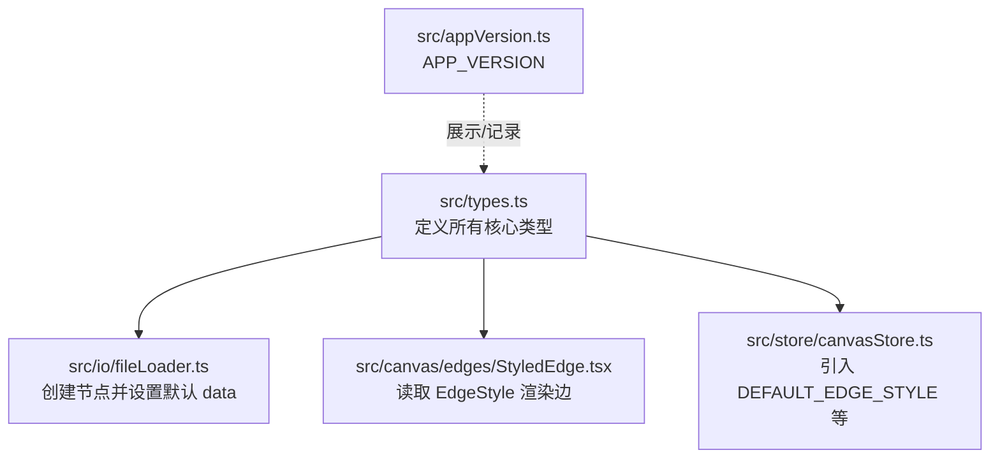
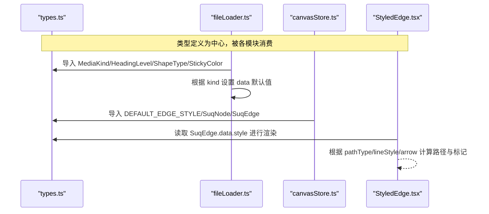
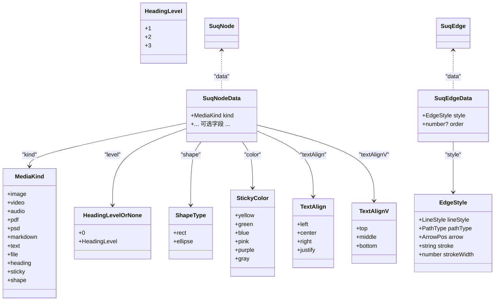
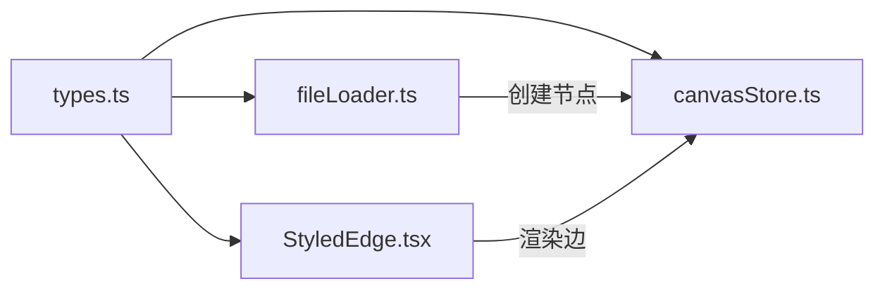

# 核心类型定义

<cite>
**本文引用的文件**
- [src/types.ts](file://src/types.ts)
- [src/io/fileLoader.ts](file://src/io/fileLoader.ts)
- [src/canvas/edges/StyledEdge.tsx](file://src/canvas/edges/StyledEdge.tsx)
- [src/store/canvasStore.ts](file://src/store/canvasStore.ts)
- [src/appVersion.ts](file://src/appVersion.ts)
</cite>

## 目录
1. [简介](#简介)
2. [项目结构](#项目结构)
3. [核心组件](#核心组件)
4. [架构总览](#架构总览)
5. [详细组件分析](#详细组件分析)
6. [依赖分析](#依赖分析)
7. [性能考虑](#性能考虑)
8. [故障排查指南](#故障排查指南)
9. [结论](#结论)
10. [附录](#附录)

## 简介
本文件面向开发者，系统化梳理 SuQCanvas 的核心类型定义与使用方式，覆盖枚举类型、节点与边数据接口、样式配置、类型继承关系、默认值与约束、以及版本兼容策略。目标是帮助读者快速理解并正确使用 MediaKind、HeadingLevel、TextAlign、ShapeType、StickyColor、SuqNodeData、SuqEdgeData、EdgeStyle 等类型，并在扩展节点或边时保持向后兼容。

## 项目结构
核心类型集中定义在单一类型文件中，其他模块通过导入使用。关键位置：
- 类型定义：src/types.ts
- 节点创建与默认值：src/io/fileLoader.ts
- 边的渲染与样式应用：src/canvas/edges/StyledEdge.tsx
- 画布状态与默认边样式引用：src/store/canvasStore.ts
- 应用版本常量：src/appVersion.ts

图表来源
- [src/types.ts:1-112](file://src/types.ts#L1-L112)
- [src/io/fileLoader.ts:1-200](file://src/io/fileLoader.ts#L1-L200)
- [src/canvas/edges/StyledEdge.tsx:1-83](file://src/canvas/edges/StyledEdge.tsx#L1-L83)
- [src/store/canvasStore.ts:1-65](file://src/store/canvasStore.ts#L1-L65)
- [src/appVersion.ts:1-3](file://src/appVersion.ts#L1-L3)

章节来源
- [src/types.ts:1-112](file://src/types.ts#L1-L112)
- [src/io/fileLoader.ts:1-200](file://src/io/fileLoader.ts#L1-L200)
- [src/canvas/edges/StyledEdge.tsx:1-83](file://src/canvas/edges/StyledEdge.tsx#L1-L83)
- [src/store/canvasStore.ts:1-65](file://src/store/canvasStore.ts#L1-L65)
- [src/appVersion.ts:1-3](file://src/appVersion.ts#L1-L3)

## 核心组件
本节聚焦于核心类型定义及其职责边界。

- 媒体与内容类型
  - MediaKind：节点承载的媒体/内容种类，如 image、video、audio、pdf、psd、markdown、text、file、heading、sticky、shape。
  - HeadingLevel：标题层级，限定为 1 | 2 | 3。
  - HeadingLevelOrNone：允许 0 表示“无标题效果”的默认态。
  - TextAlign / TextAlignV：水平与垂直文本对齐方式。
  - ShapeType：形状类型 rect | ellipse。
  - StickyColor：便签颜色集合，提供背景与边框色映射常量 STICKY_COLORS。

- 边样式类型
  - LineStyle：实线、虚线、点线。
  - PathType：贝塞尔曲线、直线、直角折线、圆角折线。
  - ArrowPos：箭头位置 none/start/end/both。
  - EdgeStyle：边的样式对象，包含 lineStyle、pathType、arrow、stroke、strokeWidth。
  - DEFAULT_EDGE_STYLE：默认边样式常量。

- 节点与边数据接口
  - SuqNodeData：节点数据模型，包含 kind（必填）及大量可选属性，用于控制外观、尺寸、文本、富文本样式、元数据等。
  - SuqEdgeData：边数据模型，包含 style（必填）和可选的 order（用于歌单分叉播放顺序）。
  - SuqNode / SuqEdge：基于 @xyflow/react 的 Node/Edge 的类型增强，强制 data 字段类型为上述接口。

- 资源元信息
  - AssetMeta：素材元信息，包含 id、name、mime、size、kind、hasThumbnail。

章节来源
- [src/types.ts:3-112](file://src/types.ts#L3-L112)

## 架构总览
下图展示了类型在系统中的角色与交互：类型定义被多处消费，节点创建器根据 MediaKind 生成默认 data；边渲染器根据 EdgeStyle 绘制路径、箭头与描边；画布状态管理引用默认边样式。

图表来源
- [src/types.ts:1-112](file://src/types.ts#L1-L112)
- [src/io/fileLoader.ts:137-182](file://src/io/fileLoader.ts#L137-L182)
- [src/store/canvasStore.ts:1-65](file://src/store/canvasStore.ts#L1-L65)
- [src/canvas/edges/StyledEdge.tsx:1-83](file://src/canvas/edges/StyledEdge.tsx#L1-L83)

## 详细组件分析

### 枚举与字面量类型
- MediaKind
  - 含义：节点承载的内容/媒体类型。
  - 取值：image、video、audio、pdf、psd、markdown、text、file、heading、sticky、shape。
  - 用途：决定节点类型映射、默认尺寸、行为分支。
- HeadingLevel / HeadingLevelOrNone
  - 含义：标题级别，0 表示无标题效果。
  - 取值：1、2、3；或 0。
  - 用途：影响标题节点的默认宽高与显示样式。
- TextAlign / TextAlignV
  - 含义：文本水平与垂直对齐。
  - 取值：left/center/right/justify；top/middle/bottom。
- ShapeType
  - 含义：图形形状。
  - 取值：rect、ellipse。
- StickyColor
  - 含义：便签主题色。
  - 取值：yellow/green/blue/pink/purple/gray。
  - 配套常量：STICKY_COLORS，提供背景与边框色映射。

章节来源
- [src/types.ts:3-35](file://src/types.ts#L3-L35)
- [src/io/fileLoader.ts:223-296](file://src/io/fileLoader.ts#L223-L296)

### SuqNodeData 接口详解
- 必填字段
  - kind: MediaKind，节点内容类型。
- 常用可选字段与语义
  - 资源关联：assetId、fileSize、mime、pageCount、coverAssetId（音乐专辑图）。
  - 尺寸：width、height。
  - 外观：borderColor、backgroundColor、fill、color（便签色）、shape（形状类型）。
  - 文本与排版：text、label、textAlign、textAlignV、fontSize、fontFamily、textColor、bold、italic、underline、lineHeight。
  - 编辑行为：autoEdit。
  - 标题：level（HeadingLevelOrNone）。
  - 元数据：createdById、createdByName、createdAt、assetUpdatedAt。
- 默认值与约束
  - 多数字段为可选，未设置时使用渲染层或创建器的默认值。
  - 示例默认值参考：
    - 文本节点：label、text、autoEdit、borderColor。
    - 标题节点：level、label、text、autoEdit、borderColor，且按 level 设定默认宽高。
    - 便签节点：color、label、text、autoEdit、borderColor（由 STICKY_COLORS 推导）。
    - 形状节点：shape、label、text、autoEdit、fill、borderColor、textAlign、textAlignV。
- 复杂度与兼容性
  - 由于 extends Record<string, unknown>，可安全扩展额外字段而不破坏现有逻辑。
  - 新增字段建议遵循可选原则，避免破坏旧数据。

章节来源
- [src/types.ts:66-98](file://src/types.ts#L66-L98)
- [src/io/fileLoader.ts:165-182](file://src/io/fileLoader.ts#L165-L182)
- [src/io/fileLoader.ts:223-296](file://src/io/fileLoader.ts#L223-L296)

### SuqEdgeData 接口详解
- 必填字段
  - style: EdgeStyle，边的样式配置。
- 可选字段
  - order: number，用于歌单分叉处出边的播放顺序，数值越小越先播放；未设置时按 edges 数组顺序。
- 约束与默认值
  - style 必须存在，否则无法正确渲染。
  - DEFAULT_EDGE_STYLE 提供默认样式，建议在创建边时复用。

章节来源
- [src/types.ts:100-104](file://src/types.ts#L100-L104)
- [src/types.ts:58-64](file://src/types.ts#L58-L64)

### EdgeStyle 接口详解
- 字段说明
  - lineStyle: 'solid' | 'dashed' | 'dotted'，线条样式。
  - pathType: 'bezier' | 'straight' | 'step' | 'smoothstep'，路径类型。
  - arrow: 'none' | 'start' | 'end' | 'both'，箭头位置。
  - stroke: string，描边颜色。
  - strokeWidth: number，描边宽度。
- 默认值
  - DEFAULT_EDGE_STYLE：lineStyle='solid'，pathType='bezier'，arrow='end'，stroke='#94a3b8'，strokeWidth=2。
- 渲染行为
  - 根据 pathType 选择不同路径算法（贝塞尔、直线、直角折线、圆角折线）。
  - 根据 lineStyle 计算 dasharray（虚线/点线）。
  - 根据 arrow 设置起止箭头标记。

章节来源
- [src/types.ts:46-64](file://src/types.ts#L46-L64)
- [src/canvas/edges/StyledEdge.tsx:24-83](file://src/canvas/edges/StyledEdge.tsx#L24-L83)

### 类型继承与组合关系

图表来源
- [src/types.ts:3-112](file://src/types.ts#L3-L112)

### 实际使用示例（以路径引用代替代码片段）
- 创建文本节点
  - 参考：[src/io/fileLoader.ts:208-221](file://src/io/fileLoader.ts#L208-L221)
  - 要点：设置 kind='text'，并提供 label、text、autoEdit、borderColor 等默认值。
- 创建标题节点
  - 参考：[src/io/fileLoader.ts:223-249](file://src/io/fileLoader.ts#L223-L249)
  - 要点：根据 HeadingLevel 设置默认宽高，填充 level、label、text、autoEdit、borderColor。
- 创建便签节点
  - 参考：[src/io/fileLoader.ts:251-271](file://src/io/fileLoader.ts#L251-L271)
  - 要点：使用 StickyColor 从 STICKY_COLORS 获取 border 色，设置 color、label、text、autoEdit。
- 创建形状节点
  - 参考：[src/io/fileLoader.ts:273-296](file://src/io/fileLoader.ts#L273-L296)
  - 要点：设置 shape、fill、borderColor、textAlign、textAlignV 等默认值。
- 边样式渲染
  - 参考：[src/canvas/edges/StyledEdge.tsx:24-83](file://src/canvas/edges/StyledEdge.tsx#L24-L83)
  - 要点：读取 data.style，根据 pathType/lineStyle/arrow 计算路径与箭头。
- 默认边样式引用
  - 参考：[src/store/canvasStore.ts:1-65](file://src/store/canvasStore.ts#L1-L65)
  - 要点：从 types 导入 DEFAULT_EDGE_STYLE，确保新建边具备一致样式。

章节来源
- [src/io/fileLoader.ts:208-296](file://src/io/fileLoader.ts#L208-L296)
- [src/canvas/edges/StyledEdge.tsx:24-83](file://src/canvas/edges/StyledEdge.tsx#L24-L83)
- [src/store/canvasStore.ts:1-65](file://src/store/canvasStore.ts#L1-L65)

## 依赖分析
- 外部依赖
  - @xyflow/react：提供 Node、Edge、Viewport 基础类型与路径计算函数，被 types.ts 与 StyledEdge.tsx 使用。
- 内部依赖
  - fileLoader.ts 依赖 types.ts 中的枚举与常量，用于构建节点默认 data。
  - StyledEdge.tsx 依赖 types.ts 中的 SuqEdge 与 EdgeStyle，用于渲染。
  - canvasStore.ts 依赖 types.ts 中的 SuqNode、SuqEdge、DEFAULT_EDGE_STYLE，用于状态管理与默认值。
- 耦合与内聚
  - 类型集中在 types.ts，内聚度高；业务模块仅消费类型，耦合度低，便于维护与演进。

图表来源
- [src/types.ts:1-112](file://src/types.ts#L1-L112)
- [src/io/fileLoader.ts:1-200](file://src/io/fileLoader.ts#L1-L200)
- [src/canvas/edges/StyledEdge.tsx:1-83](file://src/canvas/edges/StyledEdge.tsx#L1-L83)
- [src/store/canvasStore.ts:1-65](file://src/store/canvasStore.ts#L1-L65)

章节来源
- [src/types.ts:1-112](file://src/types.ts#L1-L112)
- [src/io/fileLoader.ts:1-200](file://src/io/fileLoader.ts#L1-L200)
- [src/canvas/edges/StyledEdge.tsx:1-83](file://src/canvas/edges/StyledEdge.tsx#L1-L83)
- [src/store/canvasStore.ts:1-65](file://src/store/canvasStore.ts#L1-L65)

## 性能考虑
- 边路径计算
  - 不同 pathType 调用不同的路径算法，复杂路径（如 smoothstep）可能带来更高计算成本。建议在大规模边场景下合理选择 pathType。
- 样式更新
  - 频繁修改 EdgeStyle 可能导致重绘。建议批量更新或使用不可变数据结构减少重渲染。
- 节点默认值
  - 使用默认值可减少初始化开销，但过多可选字段会增加运行时判断成本。建议按需设置必要字段。

## 故障排查指南
- 边未显示或样式异常
  - 检查 SuqEdgeData.style 是否完整，特别是 pathType、lineStyle、arrow、stroke、strokeWidth。
  - 参考：[src/types.ts:50-64](file://src/types.ts#L50-L64)、[src/canvas/edges/StyledEdge.tsx:24-83](file://src/canvas/edges/StyledEdge.tsx#L24-L83)
- 节点显示不符合预期
  - 确认 kind 与对应默认 data 字段是否设置正确，如 heading 的 level、sticky 的 color、shape 的 shape。
  - 参考：[src/io/fileLoader.ts:208-296](file://src/io/fileLoader.ts#L208-L296)
- 版本与兼容性
  - 若升级后出现类型不匹配，优先检查新增字段是否为可选，并确保旧数据能跳过新字段。
  - 参考：[src/appVersion.ts:1-3](file://src/appVersion.ts#L1-L3)

章节来源
- [src/types.ts:50-64](file://src/types.ts#L50-L64)
- [src/canvas/edges/StyledEdge.tsx:24-83](file://src/canvas/edges/StyledEdge.tsx#L24-L83)
- [src/io/fileLoader.ts:208-296](file://src/io/fileLoader.ts#L208-L296)
- [src/appVersion.ts:1-3](file://src/appVersion.ts#L1-L3)

## 结论
本仓库将核心类型集中于 types.ts，并通过严格字面量类型与接口约束，确保节点与边的数据一致性。SuqNodeData 与 SuqEdgeData 提供了丰富的可选字段与默认值策略，配合 fileLoader.ts 的创建器与 StyledEdge.tsx 的渲染逻辑，形成清晰的数据到视图链路。建议在新功能扩展中遵循“可选字段优先”的原则，以保持向后兼容。

## 附录

### 类型版本兼容性与向后兼容策略
- 设计原则
  - 新增字段一律设为可选，避免破坏已有数据与下游逻辑。
  - 对枚举类型新增取值需谨慎评估，必要时提供迁移工具或降级处理。
  - 默认值集中管理（如 DEFAULT_EDGE_STYLE），保证新旧版本行为一致。
- 实践建议
  - 在 fileLoader.ts 中为新节点类型提供默认 data，确保旧客户端也能正常显示。
  - 在 StyledEdge.tsx 中对未知 pathType/lineStyle 提供兜底逻辑，避免渲染崩溃。
  - 通过 appVersion.ts 统一暴露版本号，便于日志与兼容性检测。

章节来源
- [src/types.ts:58-64](file://src/types.ts#L58-L64)
- [src/io/fileLoader.ts:165-182](file://src/io/fileLoader.ts#L165-L182)
- [src/canvas/edges/StyledEdge.tsx:24-83](file://src/canvas/edges/StyledEdge.tsx#L24-L83)
- [src/appVersion.ts:1-3](file://src/appVersion.ts#L1-L3)