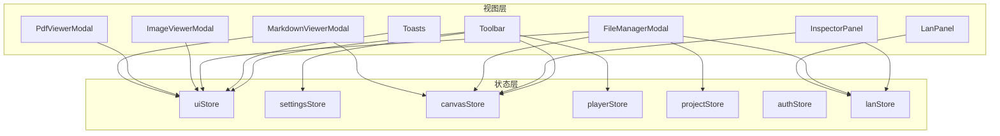
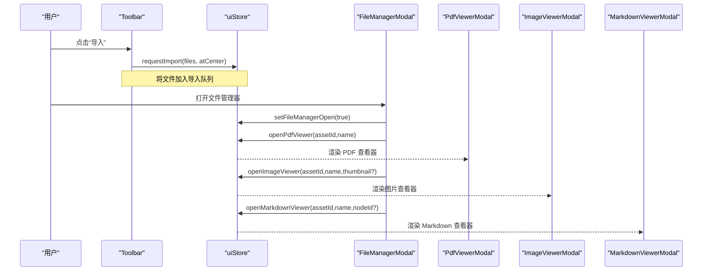
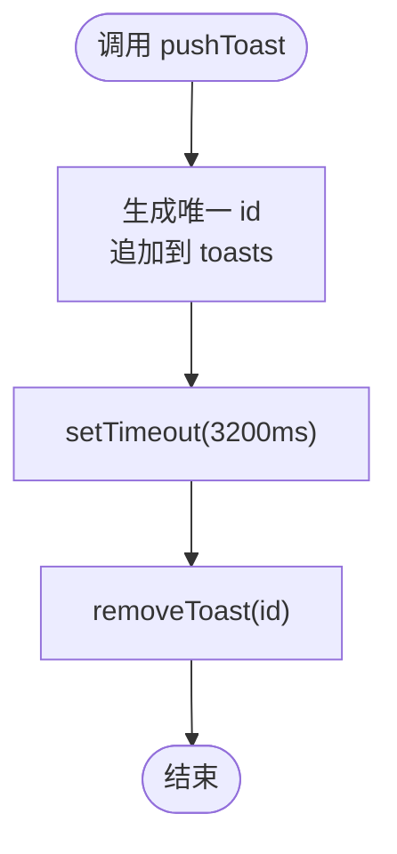
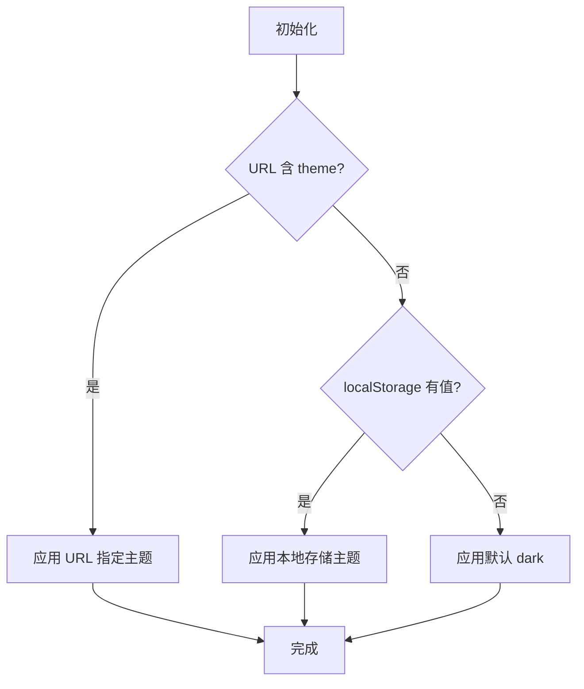
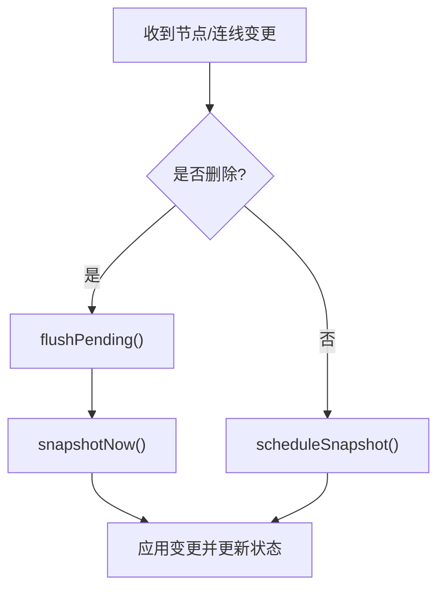
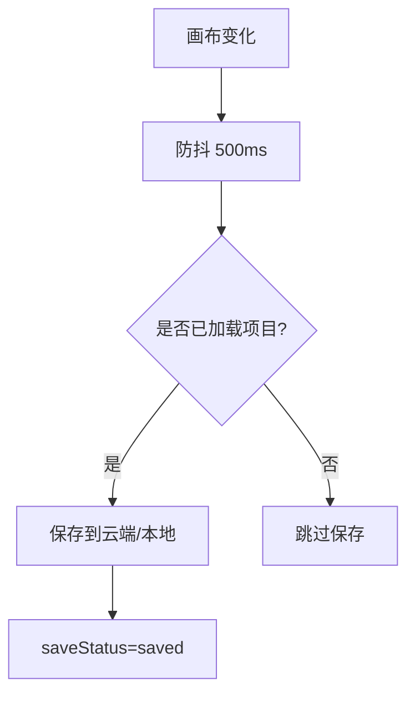
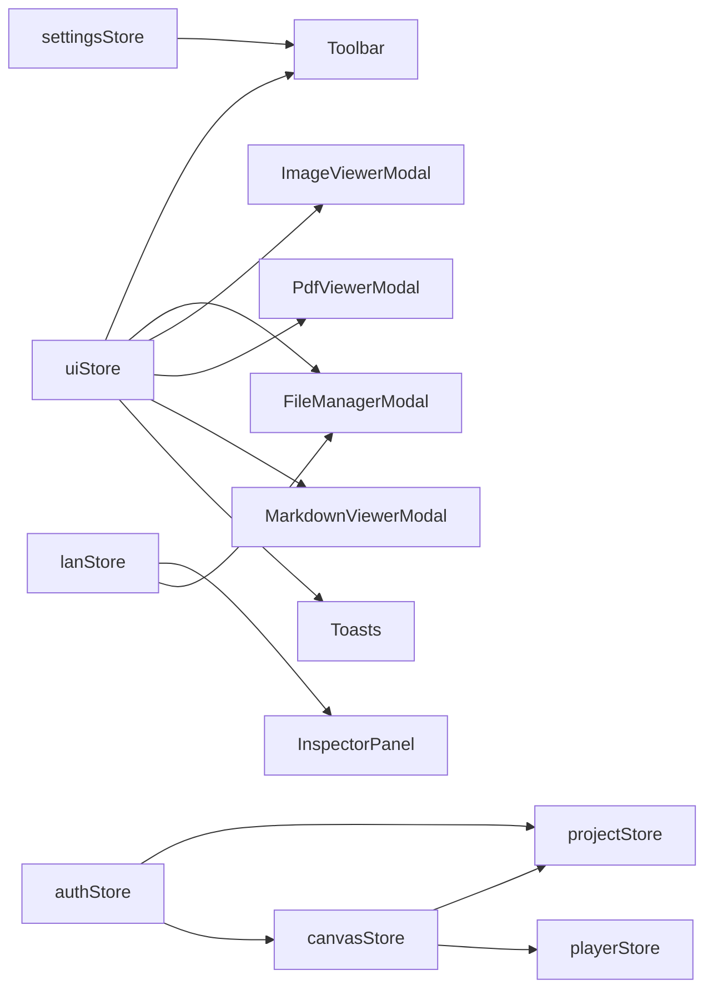

# UI 状态管理 API

<cite>
**本文引用的文件**
- [uiStore.ts](file://src/store/uiStore.ts)
- [settingsStore.ts](file://src/store/settingsStore.ts)
- [canvasStore.ts](file://src/store/canvasStore.ts)
- [playerStore.ts](file://src/store/playerStore.ts)
- [projectStore.ts](file://src/store/projectStore.ts)
- [authStore.ts](file://src/store/authStore.ts)
- [lanStore.ts](file://src/store/lanStore.ts)
- [Toolbar.tsx](file://src/components/Toolbar.tsx)
- [InspectorPanel.tsx](file://src/components/InspectorPanel.tsx)
- [Toasts.tsx](file://src/components/Toasts.tsx)
- [FileManagerModal.tsx](file://src/components/FileManagerModal.tsx)
- [ImageViewerModal.tsx](file://src/components/ImageViewerModal.tsx)
- [PdfViewerModal.tsx](file://src/components/PdfViewerModal.tsx)
- [MarkdownViewerModal.tsx](file://src/components/MarkdownViewerModal.tsx)
- [LanPanel.tsx](file://src/components/LanPanel.tsx)
</cite>

## 目录
1. [简介](#简介)
2. [项目结构](#项目结构)
3. [核心组件](#核心组件)
4. [架构总览](#架构总览)
5. [详细组件分析](#详细组件分析)
6. [依赖关系分析](#依赖关系分析)
7. [性能考虑](#性能考虑)
8. [故障排查指南](#故障排查指南)
9. [结论](#结论)
10. [附录](#附录)

## 简介
本 API 文档聚焦于应用中的 UI 状态管理，覆盖模态框显示隐藏、面板切换、工具栏状态、用户偏好与主题配置、响应式布局状态、设备适配逻辑、UI 组件的状态订阅与更新方法、动画与过渡控制，以及全局 UI 状态统一管理与组件间通信。所有说明均基于代码仓库中的 Store 与组件实现。

## 项目结构
- 状态层（Zustand Store）
  - uiStore：全局 UI 状态（通知、导入队列、各类查看器开关、播放器入口、工具模式等）
  - settingsStore：主题与用户偏好（深色/浅色）
  - canvasStore：画布节点/连线、视口、撤销重做历史、对齐与层级等
  - playerStore：全局音频播放引擎状态（当前曲目、播放模式、进度、音量等）
  - projectStore：项目生命周期与自动保存
  - authStore：认证与会话、游客模式
  - lanStore：局域网协作状态（用户、光标、编辑中、活动日志等）
- 视图层（React 组件）
  - Toolbar：工具栏、主题切换、缩放、插入菜单、工具模式、导出/导入
  - InspectorPanel：元素与连线属性编辑
  - Toasts：全局通知展示
  - FileManagerModal：文件管理器与媒体打开入口
  - ImageViewerModal / PdfViewerModal / MarkdownViewerModal：资源查看器
  - LanPanel：局域网协作面板



图表来源
- [uiStore.ts:18-45](file://src/store/uiStore.ts#L18-L45)
- [settingsStore.ts:7-11](file://src/store/settingsStore.ts#L7-L11)
- [canvasStore.ts:33-59](file://src/store/canvasStore.ts#L33-L59)
- [playerStore.ts:25-50](file://src/store/playerStore.ts#L25-L50)
- [projectStore.ts:21-34](file://src/store/projectStore.ts#L21-L34)
- [authStore.ts:8-16](file://src/store/authStore.ts#L8-L16)
- [lanStore.ts:53-89](file://src/store/lanStore.ts#L53-L89)
- [Toolbar.tsx:97-126](file://src/components/Toolbar.tsx#L97-L126)
- [InspectorPanel.tsx:288-304](file://src/components/InspectorPanel.tsx#L288-L304)
- [Toasts.tsx:3-23](file://src/components/Toasts.tsx#L3-L23)
- [FileManagerModal.tsx:63-88](file://src/components/FileManagerModal.tsx#L63-L88)
- [ImageViewerModal.tsx:14-24](file://src/components/ImageViewerModal.tsx#L14-L24)
- [PdfViewerModal.tsx:7-16](file://src/components/PdfViewerModal.tsx#L7-L16)
- [MarkdownViewerModal.tsx:11-19](file://src/components/MarkdownViewerModal.tsx#L11-L19)
- [LanPanel.tsx:17-27](file://src/components/LanPanel.tsx#L17-L27)

章节来源
- [uiStore.ts:18-45](file://src/store/uiStore.ts#L18-L45)
- [settingsStore.ts:7-11](file://src/store/settingsStore.ts#L7-L11)
- [canvasStore.ts:33-59](file://src/store/canvasStore.ts#L33-L59)
- [playerStore.ts:25-50](file://src/store/playerStore.ts#L25-L50)
- [projectStore.ts:21-34](file://src/store/projectStore.ts#L21-L34)
- [authStore.ts:8-16](file://src/store/authStore.ts#L8-L16)
- [lanStore.ts:53-89](file://src/store/lanStore.ts#L53-L89)
- [Toolbar.tsx:97-126](file://src/components/Toolbar.tsx#L97-L126)
- [InspectorPanel.tsx:288-304](file://src/components/InspectorPanel.tsx#L288-L304)
- [Toasts.tsx:3-23](file://src/components/Toasts.tsx#L3-L23)
- [FileManagerModal.tsx:63-88](file://src/components/FileManagerModal.tsx#L63-L88)
- [ImageViewerModal.tsx:14-24](file://src/components/ImageViewerModal.tsx#L14-L24)
- [PdfViewerModal.tsx:7-16](file://src/components/PdfViewerModal.tsx#L7-L16)
- [MarkdownViewerModal.tsx:11-19](file://src/components/MarkdownViewerModal.tsx#L11-L19)
- [LanPanel.tsx:17-27](file://src/components/LanPanel.tsx#L17-L27)

## 核心组件
- 全局 UI Store（uiStore）
  - 通知系统：pushToast/removeToast/toast
  - 导入队列：requestImport/consumeImport
  - 查看器开关：pdfViewer/imageViewer/markdownViewer/open/close
  - 专用播放器页入口：playerPage
  - 文件管理器：fileManagerOpen/setFileManagerOpen
  - 音乐播放器入口：playerTarget/openMusicPlayer
  - 首页入口：homeOpen/setHomeOpen
  - 工具模式：tool/setTool
- 设置 Store（settingsStore）
  - 主题：theme/toggleTheme/setTheme
  - 持久化：localStorage + URL 参数优先
  - 主题应用：applyTheme（为根元素添加/移除 light 类）
- 画布 Store（canvasStore）
  - 节点/连线/视口：nodes/edges/viewport
  - 变更处理：onNodesChange/onEdgesChange/onConnect
  - 操作：addNodes/addEdge/updateNodeData/updateEdgeData/duplicateNode/copySelected/pasteClipboard/changeNodeLayer/setNodeZIndex/removeAssets/alignSelected
  - 历史：undo/redo/clearHistory
  - 重置：reset
- 播放器 Store（playerStore）
  - 播放状态：track/playing/time/duration/volume/muted/barVisible/mode/queue
  - 控制：play/toggle/seekTo/seekBy/next/prev/setVolume/setMuted/setMode/setQueue/stop/setBarVisible
  - 外部绑定：bindPlayerAudio/getPlayerAudioElement/setOrderProvider/notifyEngineEnded
- 项目 Store（projectStore）
  - 项目信息：projectId/projectName/loaded/initialized/saveStatus/busy
  - 操作：init/loadProject/newProject/renameProject/saveNow/setBusy
  - 自动保存：监听画布变化并延迟保存
- 认证 Store（authStore）
  - 会话：user/guest/loading
  - 操作：init/signIn/signOut/enterGuest
  - 登录态切换时重置项目与画布状态
- 局域网 Store（lanStore）
  - 连接与用户：status/url/name/selfId/users/followId
  - 远程视口：remoteViewport
  - 项目与协作：activeProjectId/remoteProjects/cursors/editing/activities
  - 操作：setStatus/setUrl/setName/setSelfId/setUsers/removeUser/setFollowId/setRemoteViewport/clearRemoteViewport/setActiveProjectId/setSharedProjects/setCursor/removeCursor/setEditing/clearEditing/addActivity/clearCollaborationState/mergeRemoteProjects/removeRemoteProjectsByOwner/clearRemoteProjects

章节来源
- [uiStore.ts:18-45](file://src/store/uiStore.ts#L18-L45)
- [settingsStore.ts:7-11](file://src/store/settingsStore.ts#L7-L11)
- [canvasStore.ts:33-59](file://src/store/canvasStore.ts#L33-L59)
- [playerStore.ts:25-50](file://src/store/playerStore.ts#L25-L50)
- [projectStore.ts:21-34](file://src/store/projectStore.ts#L21-L34)
- [authStore.ts:8-16](file://src/store/authStore.ts#L8-L16)
- [lanStore.ts:53-89](file://src/store/lanStore.ts#L53-L89)

## 架构总览
UI 状态通过 Zustand Store 统一管理，组件以订阅方式读取状态并调用对应方法更新。跨组件通信通过共享 Store 完成；部分场景使用自定义事件或回调进行解耦。



图表来源
- [Toolbar.tsx:194-202](file://src/components/Toolbar.tsx#L194-L202)
- [uiStore.ts:22-36](file://src/store/uiStore.ts#L22-L36)
- [FileManagerModal.tsx:160-185](file://src/components/FileManagerModal.tsx#L160-L185)
- [PdfViewerModal.tsx:7-16](file://src/components/PdfViewerModal.tsx#L7-L16)
- [ImageViewerModal.tsx:14-24](file://src/components/ImageViewerModal.tsx#L14-L24)
- [MarkdownViewerModal.tsx:11-19](file://src/components/MarkdownViewerModal.tsx#L11-L19)

## 详细组件分析

### 全局 UI Store（uiStore）API
- 通知
  - pushToast(message, kind?): 添加通知，默认 info，3.2 秒后自动移除
  - removeToast(id): 按 id 移除通知
  - toast(message, kind?): 便捷函数直接推送通知
- 导入队列
  - requestImport(files, atCenter?): 入队文件，空数组不生效
  - consumeImport(): 消费队列并清空，返回 {files, atCenter}
- 查看器
  - pdfViewer/openPdfViewer/closePdfViewer
  - imageViewer/openImageViewer/closeImageViewer
  - markdownViewer/openMarkdownViewer/closeMarkdownViewer
- 播放器入口
  - playerPage/openPlayerPage/closePlayerPage
  - playerTarget/openMusicPlayer
- 面板与工具
  - fileManagerOpen/setFileManagerOpen
  - homeOpen/setHomeOpen
  - tool/setTool（select/connect/drag）



图表来源
- [uiStore.ts:47-58](file://src/store/uiStore.ts#L47-L58)

章节来源
- [uiStore.ts:18-45](file://src/store/uiStore.ts#L18-L45)
- [uiStore.ts:47-121](file://src/store/uiStore.ts#L47-L121)

### 设置与主题（settingsStore）
- 主题类型：'dark' | 'light'
- 初始化优先级：URL 参数 theme > localStorage > 默认 dark
- 方法
  - setTheme(theme): 写入 localStorage 并应用主题
  - toggleTheme(): 在 dark/light 之间切换
- 主题应用
  - applyTheme(theme): 为 document.documentElement 切换 'light' 类名



图表来源
- [settingsStore.ts:13-27](file://src/store/settingsStore.ts#L13-L27)

章节来源
- [settingsStore.ts:1-40](file://src/store/settingsStore.ts#L1-L40)

### 画布状态与交互（canvasStore）
- 数据模型
  - nodes/edges/viewport
  - past/future（撤销/重做栈）
  - clipboard（复制的节点集合）
- 变更处理
  - onNodesChange/onEdgesChange：根据变更类型决定是否立即或延迟记录历史快照
  - onConnect：创建边并记录历史
- 常用操作
  - addNodes/addEdge/updateNodeData/updateEdgeData
  - duplicateNode/copySelected/pasteClipboard
  - changeNodeLayer/setNodeZIndex/removeAssets/alignSelected
  - undo/redo/clearHistory/setViewport/reset



图表来源
- [canvasStore.ts:126-145](file://src/store/canvasStore.ts#L126-L145)
- [canvasStore.ts:66-107](file://src/store/canvasStore.ts#L66-L107)

章节来源
- [canvasStore.ts:33-59](file://src/store/canvasStore.ts#L33-L59)
- [canvasStore.ts:66-107](file://src/store/canvasStore.ts#L66-L107)
- [canvasStore.ts:126-145](file://src/store/canvasStore.ts#L126-L145)
- [canvasStore.ts:159-246](file://src/store/canvasStore.ts#L159-L246)
- [canvasStore.ts:247-399](file://src/store/canvasStore.ts#L247-L399)

### 播放器状态（playerStore）
- 状态字段
  - track/playing/time/duration/volume/muted/barVisible/mode/queue
- 控制方法
  - play({assetId, name?, nodeId?}, {autoplay?})
  - toggle/seekTo/seekBy/next/prev
  - setVolume/setMuted/setMode/setQueue/stop/setBarVisible
- 外部集成
  - bindPlayerAudio(el): 绑定全局 <audio> 元素
  - getPlayerAudioElement(): 获取当前音频元素
  - setOrderProvider(provider): 注册歌曲顺序提供者
  - notifyEngineEnded(): 由引擎触发续播

```mermaid
sequenceDiagram
participant C as "组件"
participant P as "playerStore"
participant A as "HTMLAudioElement"
C->>P : play({assetId,...}, {autoplay : true})
P->>A : src=url; load(); play()
A-->>P : canplay/loadeddata
P-->>C : playing=true, time/duration 更新
A-->>P : ended
P->>P : handleEnded() -> next/loop/single/random
```

图表来源
- [playerStore.ts:58-88](file://src/store/playerStore.ts#L58-L88)
- [playerStore.ts:132-161](file://src/store/playerStore.ts#L132-L161)
- [playerStore.ts:174-209](file://src/store/playerStore.ts#L174-L209)

章节来源
- [playerStore.ts:25-50](file://src/store/playerStore.ts#L25-L50)
- [playerStore.ts:58-88](file://src/store/playerStore.ts#L58-L88)
- [playerStore.ts:132-161](file://src/store/playerStore.ts#L132-L161)
- [playerStore.ts:174-209](file://src/store/playerStore.ts#L174-L209)
- [playerStore.ts:237-290](file://src/store/playerStore.ts#L237-L290)

### 项目与自动保存（projectStore）
- 项目状态：projectId/projectName/loaded/initialized/saveStatus/busy
- 生命周期：init/loadProject/newProject/renameProject/saveNow/setBusy
- 自动保存：监听画布变化，延迟 500ms 触发 saveNow
- 云端/本地策略：已登录用户仅存云端；游客/未登录仅存本地



图表来源
- [projectStore.ts:46-67](file://src/store/projectStore.ts#L46-L67)
- [projectStore.ts:196-228](file://src/store/projectStore.ts#L196-L228)

章节来源
- [projectStore.ts:21-34](file://src/store/projectStore.ts#L21-L34)
- [projectStore.ts:46-67](file://src/store/projectStore.ts#L46-L67)
- [projectStore.ts:196-228](file://src/store/projectStore.ts#L196-L228)

### 认证与会话（authStore）
- 状态：user/guest/loading
- 方法：init/signIn/signOut/enterGuest
- 行为：登录/退出时重置项目与画布状态，防止数据串写

章节来源
- [authStore.ts:8-16](file://src/store/authStore.ts#L8-L16)
- [authStore.ts:31-42](file://src/store/authStore.ts#L31-L42)
- [authStore.ts:49-102](file://src/store/authStore.ts#L49-L102)

### 局域网协作（lanStore）
- 状态：status/url/name/selfId/users/followId/remoteViewport/activeProjectId/remoteProjects/cursors/editing/activities
- 方法：连接/断开、跟随用户、合并远端项目、清除协作状态等
- 用途：显示协作者、编辑中、活动日志、跟随视口

章节来源
- [lanStore.ts:53-89](file://src/store/lanStore.ts#L53-L89)
- [lanStore.ts:91-159](file://src/store/lanStore.ts#L91-L159)

### 组件与 Store 的交互

#### 工具栏（Toolbar）
- 订阅：uiStore.tool、projectStore.saveStatus、settingsStore.theme、canvasStore.viewport.zoom、playerStore.track/barVisible
- 动作：setTool、toggleTheme、exportCurrentProject、dispatchView、setFileManagerOpen、openMusicPlayer 等

章节来源
- [Toolbar.tsx:97-126](file://src/components/Toolbar.tsx#L97-L126)
- [Toolbar.tsx:160-400](file://src/components/Toolbar.tsx#L160-L400)

#### 检查面板（InspectorPanel）
- 订阅：canvasStore.nodes/edges、lanStore.editing/selfId
- 动作：updateNodeData/updateEdgeData、changeNodeLayer/setNodeZIndex、duplicateNode、删除元素

章节来源
- [InspectorPanel.tsx:288-304](file://src/components/InspectorPanel.tsx#L288-L304)
- [InspectorPanel.tsx:311-322](file://src/components/InspectorPanel.tsx#L311-L322)
- [InspectorPanel.tsx:731-795](file://src/components/InspectorPanel.tsx#L731-L795)

#### 通知（Toasts）
- 订阅：uiStore.toasts
- 动作：removeToast

章节来源
- [Toasts.tsx:3-23](file://src/components/Toasts.tsx#L3-L23)

#### 文件管理器（FileManagerModal）
- 订阅：uiStore.fileManagerOpen/playerTarget、canvasStore.nodes/removeAssets、lanStore.editing/selfId、projectStore.projectId
- 动作：openImageViewer/openPdfViewer/openPlayerPage/openMarkdownViewer、removeAssets、下载/删除

章节来源
- [FileManagerModal.tsx:63-88](file://src/components/FileManagerModal.tsx#L63-L88)
- [FileManagerModal.tsx:160-194](file://src/components/FileManagerModal.tsx#L160-L194)
- [FileManagerModal.tsx:196-244](file://src/components/FileManagerModal.tsx#L196-L244)

#### 图片查看器（ImageViewerModal）
- 订阅：uiStore.imageViewer
- 动作：closeImageViewer、键盘缩放/适应窗口

章节来源
- [ImageViewerModal.tsx:14-24](file://src/components/ImageViewerModal.tsx#L14-L24)
- [ImageViewerModal.tsx:26-38](file://src/components/ImageViewerModal.tsx#L26-L38)
- [ImageViewerModal.tsx:62-70](file://src/components/ImageViewerModal.tsx#L62-L70)

#### PDF 查看器（PdfViewerModal）
- 订阅：uiStore.pdfViewer
- 动作：closePdfViewer、翻页、渲染页面

章节来源
- [PdfViewerModal.tsx:7-16](file://src/components/PdfViewerModal.tsx#L7-L16)
- [PdfViewerModal.tsx:24-39](file://src/components/PdfViewerModal.tsx#L24-L39)
- [PdfViewerModal.tsx:58-83](file://src/components/PdfViewerModal.tsx#L58-L83)
- [PdfViewerModal.tsx:85-94](file://src/components/PdfViewerModal.tsx#L85-L94)

#### Markdown 查看器（MarkdownViewerModal）
- 订阅：uiStore.markdownViewer
- 动作：closeMarkdownViewer、编辑/保存、释放协作锁定

章节来源
- [MarkdownViewerModal.tsx:11-19](file://src/components/MarkdownViewerModal.tsx#L11-L19)
- [MarkdownViewerModal.tsx:35-39](file://src/components/MarkdownViewerModal.tsx#L35-L39)
- [MarkdownViewerModal.tsx:43-58](file://src/components/MarkdownViewerModal.tsx#L43-L58)

#### 局域网面板（LanPanel）
- 订阅：lanStore.status/name/selfId/users/followId/activeProjectId/editing/activities
- 动作：连接/断开、跟随用户、重新连接

章节来源
- [LanPanel.tsx:17-27](file://src/components/LanPanel.tsx#L17-L27)
- [LanPanel.tsx:34-59](file://src/components/LanPanel.tsx#L34-L59)
- [LanPanel.tsx:123-185](file://src/components/LanPanel.tsx#L123-L185)

## 依赖关系分析
- uiStore 被多个组件订阅（Toolbar、Toasts、FileManagerModal、ImageViewerModal、PdfViewerModal、MarkdownViewerModal）
- settingsStore 提供主题能力，Toolbar 触发切换
- canvasStore 与 projectStore 联动：项目自动保存依赖画布变化
- playerStore 与 canvasStore 联动：解析流式播放顺序
- authStore 在登录/退出时重置 projectStore 与 canvasStore
- lanStore 与 InspectorPanel/FileManagerModal 联动：协作编辑锁定与活动展示



图表来源
- [uiStore.ts:18-45](file://src/store/uiStore.ts#L18-L45)
- [settingsStore.ts:7-11](file://src/store/settingsStore.ts#L7-L11)
- [canvasStore.ts:33-59](file://src/store/canvasStore.ts#L33-L59)
- [playerStore.ts:25-50](file://src/store/playerStore.ts#L25-L50)
- [projectStore.ts:21-34](file://src/store/projectStore.ts#L21-L34)
- [authStore.ts:8-16](file://src/store/authStore.ts#L8-L16)
- [lanStore.ts:53-89](file://src/store/lanStore.ts#L53-L89)

章节来源
- [uiStore.ts:18-45](file://src/store/uiStore.ts#L18-L45)
- [settingsStore.ts:7-11](file://src/store/settingsStore.ts#L7-L11)
- [canvasStore.ts:33-59](file://src/store/canvasStore.ts#L33-L59)
- [playerStore.ts:25-50](file://src/store/playerStore.ts#L25-L50)
- [projectStore.ts:21-34](file://src/store/projectStore.ts#L21-L34)
- [authStore.ts:8-16](file://src/store/authStore.ts#L8-L16)
- [lanStore.ts:53-89](file://src/store/lanStore.ts#L53-L89)

## 性能考虑
- 历史记录防抖：画布变更通过 scheduleSnapshot 与 flushPending 合并快照，减少频繁写入
- 通知自动清理：pushToast 使用 setTimeout 自动移除，避免内存泄漏
- 主题切换：仅切换根元素 class，避免全量重绘
- 播放器竞态：playSeq 令牌确保快速连续 play() 只应用最后一次
- 自动保存：500ms 防抖，避免频繁 I/O

[本节为通用性能建议，无需具体文件引用]

## 故障排查指南
- 通知不消失：检查 pushToast 的定时器是否被意外取消；确认 removeToast 是否被正确调用
- 主题无效：确认 applyTheme 是否正确切换根元素 class；检查 localStorage 是否可写
- 撤销/重做异常：检查 onNodesChange/onEdgesChange 是否触发 snapshotNow/scheduleSnapshot；确认 clearHistory 是否清理 pending 与 timer
- 播放器无法播放：确认 bindPlayerAudio 已绑定；检查 canplay/loadeddata 事件；核对 baseOrder 与 queue 设置
- 自动保存失败：检查 projectStore.saveNow 的云端/本地路径；关注错误提示与 toast
- 协作锁定冲突：InspectorPanel 与 FileManagerModal 会检测 editing 状态；若被锁定需等待或协调

章节来源
- [uiStore.ts:47-58](file://src/store/uiStore.ts#L47-L58)
- [settingsStore.ts:13-27](file://src/store/settingsStore.ts#L13-L27)
- [canvasStore.ts:66-107](file://src/store/canvasStore.ts#L66-L107)
- [playerStore.ts:58-88](file://src/store/playerStore.ts#L58-L88)
- [projectStore.ts:196-228](file://src/store/projectStore.ts#L196-L228)
- [InspectorPanel.tsx:298-304](file://src/components/InspectorPanel.tsx#L298-L304)
- [FileManagerModal.tsx:137-139](file://src/components/FileManagerModal.tsx#L137-L139)

## 结论
本项目的 UI 状态管理以 Zustand Store 为核心，围绕 uiStore、settingsStore、canvasStore、playerStore、projectStore、authStore、lanStore 构建清晰的分层与职责边界。组件通过订阅与调用方法实现状态驱动渲染与交互，结合通知、查看器、工具栏、检查面板等实现了完整的 UI 状态闭环。通过防抖、令牌、自动保存等机制保障性能与一致性。

[本节为总结性内容，无需具体文件引用]

## 附录
- 常用 API 速查
  - 通知：toast(message, kind), useUiStore.pushToast/removeToast
  - 主题：useSettingsStore.toggleTheme/setTheme
  - 画布：useCanvasStore.undo/redo/alignSelected/changeNodeLayer/setNodeZIndex
  - 播放器：usePlayerStore.play/toggle/next/prev/setMode
  - 项目：useProjectStore.saveNow/init/loadProject/newProject
  - 认证：useAuthStore.signIn/signOut/enterGuest
  - 协作：useLanStore.setStatus/setFollowId/addActivity

[本节为补充信息，无需具体文件引用]