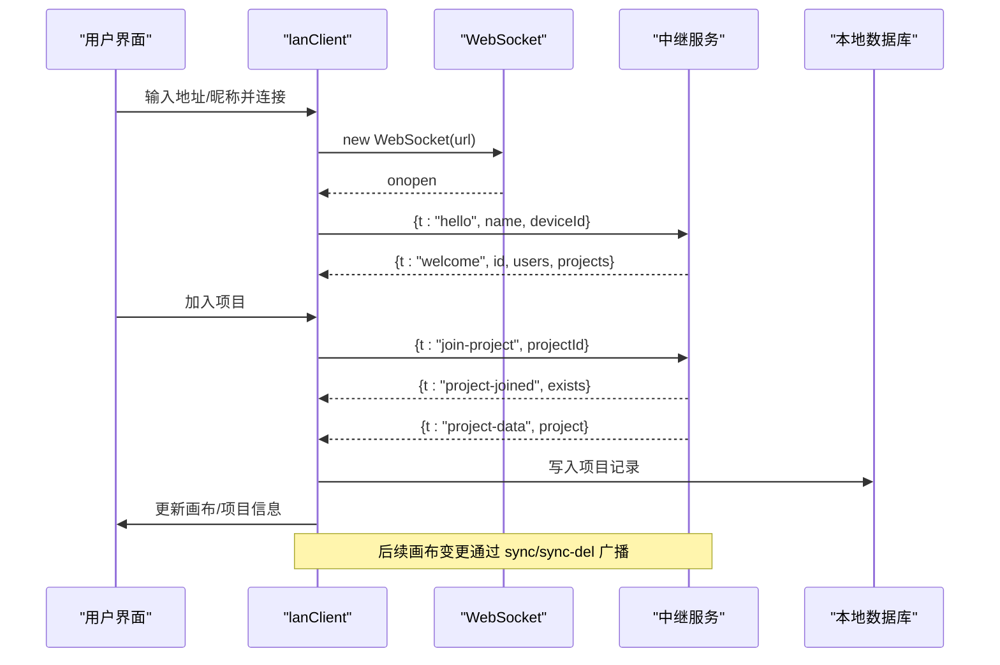
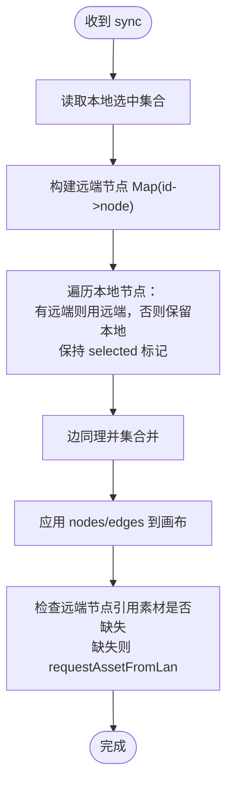
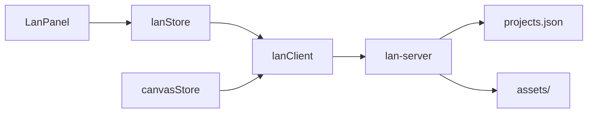

# 局域网协作状态管理 API

<cite>
**本文引用的文件**
- [src/store/lanStore.ts](file://src/store/lanStore.ts)
- [src/sync/lanClient.ts](file://src/sync/lanClient.ts)
- [server/lan-server.mjs](file://server/lan-server.mjs)
- [src/components/LanPanel.tsx](file://src/components/LanPanel.tsx)
- [src/store/canvasStore.ts](file://src/store/canvasStore.ts)
</cite>

## 目录
1. [简介](#简介)
2. [项目结构](#项目结构)
3. [核心组件](#核心组件)
4. [架构总览](#架构总览)
5. [详细组件分析](#详细组件分析)
6. [依赖关系分析](#依赖关系分析)
7. [性能考量](#性能考量)
8. [故障排查指南](#故障排查指南)
9. [结论](#结论)
10. [附录：API 参考](#附录api-参考)

## 简介
本文档面向“局域网协作”能力，系统性说明房间管理、用户连接与状态、消息广播、WebSocket 连接与重连、数据同步策略与冲突解决、成员管理与权限控制、网络监控与错误恢复、实时光标同步与协同编辑等。内容基于仓库中的前端 Store、客户端通信模块与服务端中继实现进行梳理，帮助开发者快速理解并集成协作功能。

## 项目结构
- 前端状态层：使用 Zustand 维护协作相关状态（连接、用户、活动、光标、编辑中、远程视口、共享项目等）。
- 客户端通信层：封装 WebSocket 连接、房间加入/离开、画布同步、素材传输、重连机制、墓碑删除等。
- 服务端中继：提供 WebSocket 路由、房间隔离、项目持久化、资产缓存与 HTTP Range 流式拉取、备份与回收。
- UI 面板：连接配置、成员列表、跟随视图、编辑状态与活动日志展示。

```mermaid
graph TB
subgraph "浏览器"
A["LanPanel 组件"]
B["useLanStore 状态"]
C["lanClient 客户端"]
D["canvasStore 画布状态"]
end
subgraph "局域网中继服务"
S["WebSocketServer"]
P["项目存储 projects.json"]
F["资产目录 assets/"]
end
A --> B
A --> C
C --> B
C --> D
C < --> |ws/wss| S
S --> P
S --> F
```

图表来源
- [src/components/LanPanel.tsx:17-199](file://src/components/LanPanel.tsx#L17-L199)
- [src/store/lanStore.ts:53-159](file://src/store/lanStore.ts#L53-L159)
- [src/sync/lanClient.ts:254-362](file://src/sync/lanClient.ts#L254-L362)
- [server/lan-server.mjs:449-451](file://server/lan-server.mjs#L449-L451)

章节来源
- [src/components/LanPanel.tsx:17-199](file://src/components/LanPanel.tsx#L17-L199)
- [src/store/lanStore.ts:53-159](file://src/store/lanStore.ts#L53-L159)
- [src/sync/lanClient.ts:254-362](file://src/sync/lanClient.ts#L254-L362)
- [server/lan-server.mjs:449-451](file://server/lan-server.mjs#L449-L451)

## 核心组件
- 协作状态 Store（lanStore）：集中管理连接状态、当前用户、协作者列表、活动日志、光标位置、编辑中状态、远程视口、共享项目等。
- 客户端通信（lanClient）：负责 WebSocket 生命周期、房间加入/离开、画布增量同步、删除传播、视口广播、光标与编辑状态广播、素材分片传输、自动重连与空闲超时。
- 服务端中继（lan-server）：处理 hello/join-project/leave-project、项目保存/删除/恢复、资产上传/请求/HTTP 流式拉取、房间广播、成员列表、备份清理与资源回收。
- UI 面板（LanPanel）：连接表单、成员列表、跟随他人视图、显示正在编辑的成员与最近活动。

章节来源
- [src/store/lanStore.ts:53-159](file://src/store/lanStore.ts#L53-L159)
- [src/sync/lanClient.ts:254-362](file://src/sync/lanClient.ts#L254-L362)
- [server/lan-server.mjs:661-906](file://server/lan-server.mjs#L661-L906)
- [src/components/LanPanel.tsx:17-199](file://src/components/LanPanel.tsx#L17-L199)

## 架构总览
协作流程由“客户端 - 中继 - 客户端”组成，房间级隔离保证不同项目互不干扰；画布变更通过防抖合并后广播；删除通过显式消息传播；大视频采用 HTTP Range 流式拉取以降低带宽占用；断线自动指数退避重连；项目数据按 updatedAt 比较避免覆盖本地离线编辑。



图表来源
- [src/sync/lanClient.ts:254-362](file://src/sync/lanClient.ts#L254-L362)
- [server/lan-server.mjs:661-706](file://server/lan-server.mjs#L661-L706)
- [src/sync/lanClient.ts:454-492](file://src/sync/lanClient.ts#L454-L492)

## 详细组件分析

### 协作房间管理
- 加入房间：调用 joinLanProject(projectId)，设置 activeProjectId 并发送 join-project；若项目不存在则等待 server 推送 project-data。
- 离开房间：leaveLanProject() 清除协作状态并发送 leave-project。
- 房间广播：所有房间内消息携带 projectId，服务端仅向同房间设备广播。
- 项目列表：broadcastLocalProjects() 请求服务器刷新共享项目列表；服务端返回 project-list。

章节来源
- [src/sync/lanClient.ts:767-786](file://src/sync/lanClient.ts#L767-L786)
- [server/lan-server.mjs:696-714](file://server/lan-server.mjs#L696-L714)
- [server/lan-server.mjs:495-501](file://server/lan-server.mjs#L495-L501)

### 用户连接状态与成员管理
- 连接状态：idle/connecting/connected/error，由 lanStore.status 维护；UI 根据状态显示颜色与提示。
- 成员列表：welcome/users/leave 事件维护 users；支持跟随 followId 观察他人视口。
- 权限控制：项目删除需创建者（creatorId）或旧项目无 creatorId 时允许任意删除；恢复备份也校验 creatorId。

章节来源
- [src/store/lanStore.ts:12-13](file://src/store/lanStore.ts#L12-L13)
- [src/sync/lanClient.ts:412-443](file://src/sync/lanClient.ts#L412-L443)
- [server/lan-server.mjs:731-757](file://server/lan-server.mjs#L731-L757)
- [server/lan-server.mjs:801-823](file://server/lan-server.mjs#L801-L823)

### 消息广播与活动日志
- 活动类型：create/delete/move/edit/connect/change 等，按操作类型聚合，避免刷屏。
- 活动广播：scheduleActivity() 在 350ms 窗口内合并同类操作，生成 activity 消息并 roomSend。
- 活动展示：lanStore.activities 保留最近 100 条，UI 倒序展示。

章节来源
- [src/sync/lanClient.ts:674-699](file://src/sync/lanClient.ts#L674-L699)
- [src/store/lanStore.ts:40-51](file://src/store/lanStore.ts#L40-L51)
- [src/store/lanStore.ts:142-144](file://src/store/lanStore.ts#L142-L144)

### 画布同步与冲突解决
- 增量同步：监听 canvasStore 变化，防抖 150ms 发送 sync，包含 nodes/edges（去除 selected）。
- 删除传播：节点/连线移除立即触发 scheduleSyncDel，80ms 内批量合并为一条 sync-del 消息。
- 墓碑机制：TOMBSTONE_MS=60s，标记被删除的 id，晚到快照不会复活已删元素。
- 并集合并：接收端以远端节点覆盖同 id 字段，本地独有节点保留；选择态在合并后恢复。
- 视口广播：每 100ms 广播 viewport，跟随他人时停止广播自身视口。



图表来源
- [src/sync/lanClient.ts:527-577](file://src/sync/lanClient.ts#L527-L577)
- [src/sync/lanClient.ts:718-756](file://src/sync/lanClient.ts#L718-L756)

章节来源
- [src/sync/lanClient.ts:644-756](file://src/sync/lanClient.ts#L644-L756)
- [src/sync/lanClient.ts:527-598](file://src/sync/lanClient.ts#L527-L598)

### 素材传输（含视频流式拉取）
- 元数据与分片：asset-meta 告知 totalChunks，asset-chunk 按 index 顺序到达；去重与乱序到达均正确处理。
- 封面优先：asset-thumb 先于分片下发，提升首帧体验；服务端缓存 .thumb 并在 asset-request 时回传。
- 视频优化：对 video/* 默认返回 asset-http 地址，客户端走 HTTP Range 边下边播，不再整份下载。
- 空闲超时：ASSET_IDLE_TIMEOUT_MS=60s，持续收到分片续期，长时间无数据判定失败并唤醒等待者。
- 断点续传：断开保留已收分片，重连后可从断点继续；同一接收方同素材只响应一次，避免多路覆盖。

章节来源
- [src/sync/lanClient.ts:889-1181](file://src/sync/lanClient.ts#L889-L1181)
- [server/lan-server.mjs:613-659](file://server/lan-server.mjs#L613-L659)
- [server/lan-server.mjs:828-865](file://server/lan-server.mjs#L828-L865)

### 项目数据同步与备份恢复
- 保存项目：saveProjectToLan() 将项目快照发送至服务器持久化；服务器更新 projects.json 并广播项目列表。
- 获取项目：fetchProjectFromLan() 请求 project-data，8s 超时；成功写入本地 db 并更新画布。
- 删除项目：deleteProjectFromLan() 校验 creatorId，备份后删除并广播 project-deleted。
- 备份恢复：restoreProjectFromLan() 校验过期时间与权限，恢复成功后广播项目列表。

章节来源
- [src/sync/lanClient.ts:809-887](file://src/sync/lanClient.ts#L809-L887)
- [server/lan-server.mjs:716-757](file://server/lan-server.mjs#L716-L757)
- [server/lan-server.mjs:766-823](file://server/lan-server.mjs#L766-L823)

### 实时光标同步与协同编辑
- 光标广播：sendLanCursor(x,y) 定期发送 cursor，服务端转发房间内其他用户；lanStore.cursors 维护远端光标。
- 编辑中状态：setLanEditing(nodeId,label) 与 clearLanEditing() 通知他人当前编辑目标；isNodeLockedByOther() 用于锁定节点编辑。
- 活动联动：移动/编辑节点会触发 move/edit 活动，便于审计与回溯。

章节来源
- [src/sync/lanClient.ts:788-807](file://src/sync/lanClient.ts#L788-L807)
- [src/sync/lanClient.ts:606-618](file://src/sync/lanClient.ts#L606-L618)
- [src/store/lanStore.ts:22-38](file://src/store/lanStore.ts#L22-L38)

### WebSocket 连接管理与重连机制
- 连接建立：lanConnect(url,name) 解析地址、创建 WebSocket，onopen 发送 hello 并加入项目。
- 自动重连：指数退避（1s~15s），reconnectTarget 保存上次目标；onclose 触发 scheduleReconnect。
- 页面重载：autoReconnectLan() 读取 localStorage 中上次地址并自动重连。
- 错误处理：onerror 设置 error 状态并提示；HTTPS 页面强制 wss。

章节来源
- [src/sync/lanClient.ts:119-152](file://src/sync/lanClient.ts#L119-L152)
- [src/sync/lanClient.ts:254-362](file://src/sync/lanClient.ts#L254-L362)
- [src/sync/lanClient.ts:385-407](file://src/sync/lanClient.ts#L385-L407)

### 网络状态监控与错误恢复
- 连接状态：lanStore.status 反映 idle/connecting/connected/error；UI 实时更新。
- 资源回收：服务端定时任务清理过期备份与孤立资产，避免磁盘膨胀。
- 传输中断：interruptAssetTransfers() 在断开时唤醒等待者，保留已收分片以便重连续传。

章节来源
- [src/store/lanStore.ts:91-103](file://src/store/lanStore.ts#L91-L103)
- [server/lan-server.mjs:107-205](file://server/lan-server.mjs#L107-L205)
- [src/sync/lanClient.ts:918-945](file://src/sync/lanClient.ts#L918-L945)

## 依赖关系分析
- lanStore 被 lanClient 与 LanPanel 共同消费，作为单一事实源。
- lanClient 订阅 canvasStore 的变化驱动同步与活动广播。
- 服务端维护 clients、projects、assets 三大数据结构，并通过广播维持房间一致性。



图表来源
- [src/store/lanStore.ts:53-159](file://src/store/lanStore.ts#L53-L159)
- [src/sync/lanClient.ts:718-756](file://src/sync/lanClient.ts#L718-L756)
- [server/lan-server.mjs:46-83](file://server/lan-server.mjs#L46-L83)

章节来源
- [src/store/lanStore.ts:53-159](file://src/store/lanStore.ts#L53-L159)
- [src/sync/lanClient.ts:718-756](file://src/sync/lanClient.ts#L718-L756)
- [server/lan-server.mjs:46-83](file://server/lan-server.mjs#L46-L83)

## 性能考量
- 画布同步防抖：150ms 合并多次变更，降低网络压力。
- 删除批量合并：80ms 窗口内合并多条删除，减少消息数量。
- 活动聚合：350ms 窗口内合并 create/delete 活动，避免刷屏。
- 视频流式拉取：HTTP Range 边下边播，避免全量下载打满局域网。
- 内存优化：素材分片直接解码为 Uint8Array 片段，最后拼接 Blob，避免中间大字符串。
- 服务端流式读取：按 CHUNK_SIZE 读取并发送，避免整文件入内存。

[本节为通用性能建议，无需特定文件引用]

## 故障排查指南
- 无法连接：检查 ws/wss 协议与反向代理配置；HTTPS 页面必须使用 wss。
- 重连频繁：确认网络稳定性；查看 reconnect 日志与 toast 提示。
- 素材加载失败：检查 asset-request 是否被重复广播；确认服务器资产存在且可访问。
- 项目不同步：确认 activeProjectId 一致；检查 project-data 是否按时返回（8s 超时）。
- 删除未生效：确认 sync-del 已发送；检查墓碑是否在有效期内。

章节来源
- [src/sync/lanClient.ts:254-362](file://src/sync/lanClient.ts#L254-L362)
- [src/sync/lanClient.ts:823-845](file://src/sync/lanClient.ts#L823-L845)
- [server/lan-server.mjs:854-865](file://server/lan-server.mjs#L854-L865)

## 结论
该局域网协作方案通过房间隔离、增量同步、显式删除传播、墓碑机制与 HTTP Range 流式拉取，实现了高效、稳定、低带宽占用的多人协作体验。Zustand 状态集中管理简化了 UI 与逻辑耦合，服务端中继提供了可靠的项目与资产管理能力。建议在大规模协作场景中关注网络抖动与并发导入的性能影响，并结合活动日志与备份恢复机制保障数据安全。

[本节为总结性内容，无需特定文件引用]

## 附录：API 参考

### 客户端导出函数（部分）
- resolveLanUrl(input, pageHref): string — 解析并规范化 WebSocket 地址。
- getDefaultLanUrl(): string — 获取默认中继地址。
- isLanConnected(): boolean — 检测连接状态。
- lanConnect(url, name, opts): boolean — 建立连接。
- lanDisconnect(): void — 断开连接。
- autoReconnectLan(): void — 自动重连。
- initLanSync(): () => void — 初始化画布同步订阅。
- joinLanProject(projectId): void — 加入房间。
- leaveLanProject(): void — 离开房间。
- saveProjectToLan(project): boolean — 保存项目到服务器。
- deleteProjectFromLan(projectId): boolean — 删除项目。
- fetchProjectFromLan(projectId): Promise<ProjectRecord | null> — 获取项目数据。
- fetchLanBackups(): Promise<LanBackupMeta[]> — 获取备份列表。
- restoreProjectFromLan(projectId, deletedAt): Promise<{ok,error}> — 恢复备份。
- sendLanCursor(x, y): void — 广播光标。
- setLanEditing(nodeId, label): void — 开始编辑某节点。
- clearLanEditing(): void — 结束编辑。
- pushAssetToLan(meta, blob, thumbnail?): Promise<void> — 上传素材。
- requestAssetFromLan(assetId, opts?): Promise<boolean> — 请求素材。
- getLanAssetHttpUrl(assetId): string | undefined — 获取视频 HTTP 拉流地址。
- getLanAssetThumbnail(assetId): Blob | undefined — 获取局域网同步来的封面。
- pushThumbnailToServer(assetId, thumbnail): void — 补推封面至服务器。
- isNodeLockedByOther(nodeId): boolean — 判断节点是否被他人编辑锁定。

章节来源
- [src/sync/lanClient.ts:19-57](file://src/sync/lanClient.ts#L19-L57)
- [src/sync/lanClient.ts:200-206](file://src/sync/lanClient.ts#L200-L206)
- [src/sync/lanClient.ts:254-362](file://src/sync/lanClient.ts#L254-L362)
- [src/sync/lanClient.ts:718-807](file://src/sync/lanClient.ts#L718-L807)
- [src/sync/lanClient.ts:809-887](file://src/sync/lanClient.ts#L809-L887)
- [src/sync/lanClient.ts:964-1021](file://src/sync/lanClient.ts#L964-L1021)
- [src/sync/lanClient.ts:1023-1089](file://src/sync/lanClient.ts#L1023-L1089)
- [src/sync/lanClient.ts:1091-1181](file://src/sync/lanClient.ts#L1091-L1181)

### 服务端消息路由（部分）
- hello：注册设备，返回 welcome 与项目列表。
- project-list-request：刷新共享项目列表。
- join-project / leave-project：加入/离开房间，广播 peer-joined/leave。
- project-save / project-delete / project-data-request：项目持久化与数据拉取。
- backup-list-request / backup-restore：备份列表与恢复。
- asset-meta / asset-chunk / asset-request：素材上传与请求。
- sync / sync-del / viewport / cursor / editing / activity：房间内协作消息。

章节来源
- [server/lan-server.mjs:661-906](file://server/lan-server.mjs#L661-L906)

### 状态模型（部分）
- LanUser：id/name/ip/color/projectId
- LanStatus：idle/connecting/connected/error
- LanProjectMeta：id/name/updatedAt/ownerId/creatorId
- LanCursor：userId/name/color/x/y/updatedAt
- LanEditing：userId/name/color/nodeId/label/updatedAt
- LanActivity：id/userId/name/color/kind/message/nodeId/createdAt

章节来源
- [src/store/lanStore.ts:4-51](file://src/store/lanStore.ts#L4-L51)