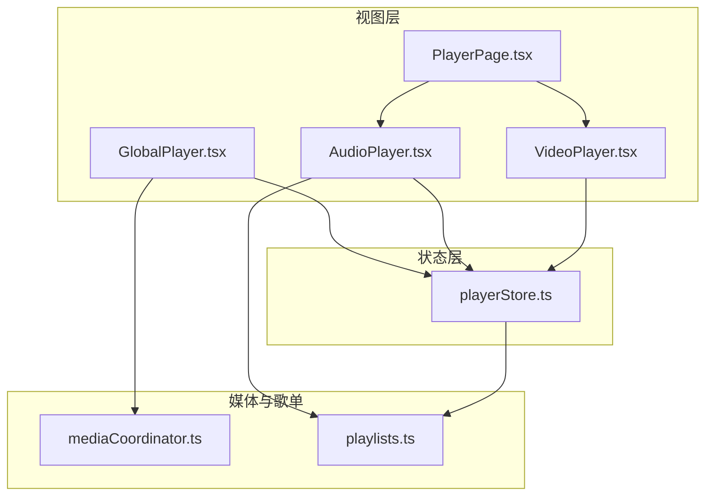
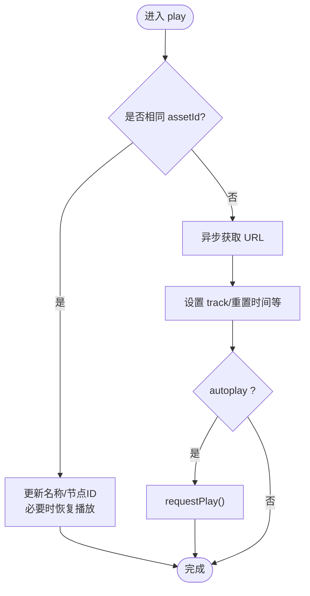
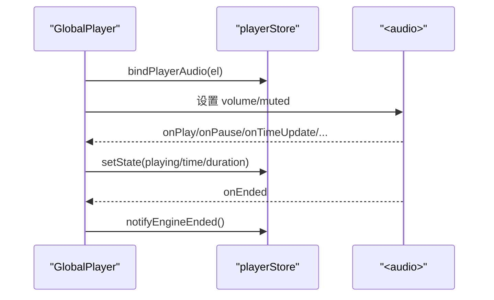
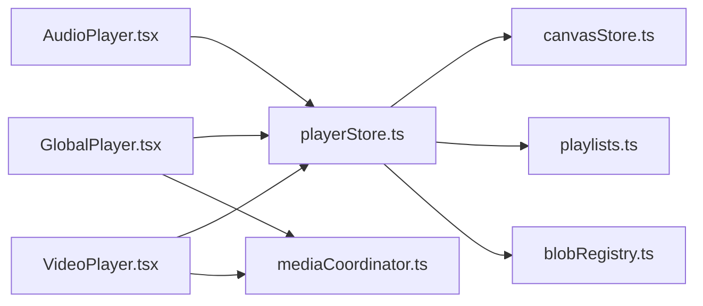

# 播放器状态管理 API

<cite>
**本文引用的文件**
- [src/store/playerStore.ts](file://src/store/playerStore.ts)
- [src/components/GlobalPlayer.tsx](file://src/components/GlobalPlayer.tsx)
- [src/components/AudioPlayer.tsx](file://src/components/AudioPlayer.tsx)
- [src/components/VideoPlayer.tsx](file://src/components/VideoPlayer.tsx)
- [src/media/playlists.ts](file://src/media/playlists.ts)
- [src/media/mediaCoordinator.ts](file://src/media/mediaCoordinator.ts)
- [src/components/PlayerPage.tsx](file://src/components/PlayerPage.tsx)
</cite>

## 目录
1. [简介](#简介)
2. [项目结构](#项目结构)
3. [核心组件](#核心组件)
4. [架构总览](#架构总览)
5. [详细组件分析](#详细组件分析)
6. [依赖关系分析](#依赖关系分析)
7. [性能考量](#性能考量)
8. [故障排查指南](#故障排查指南)
9. [结论](#结论)
10. [附录：API 速查](#附录api-速查)

## 简介
本文档面向“播放器状态管理 Store”的完整 API 与行为说明，覆盖音频播放控制、进度控制、播放列表与随机模式、全局/局部状态、事件监听与回调、缓冲与错误处理策略，以及多实例状态同步与控制。该实现以单一音频引擎为核心（全局唯一 <audio>），配合独立的视频播放器视图，形成统一的播放体验。

## 项目结构
- 状态层：Zustand store 维护全局播放状态与操作
- 视图层：全局悬浮条、沉浸式音频播放器、视频播放器页面
- 媒体协调：同类型媒体互斥播放
- 歌单系统：基于画布连线解析顺序，支持流式播放



图表来源
- [src/store/playerStore.ts:1-298](file://src/store/playerStore.ts#L1-L298)
- [src/components/GlobalPlayer.tsx:1-234](file://src/components/GlobalPlayer.tsx#L1-L234)
- [src/components/AudioPlayer.tsx:1-800](file://src/components/AudioPlayer.tsx#L1-L800)
- [src/components/VideoPlayer.tsx:1-800](file://src/components/VideoPlayer.tsx#L1-L800)
- [src/media/mediaCoordinator.ts:1-25](file://src/media/mediaCoordinator.ts#L1-L25)
- [src/media/playlists.ts:1-179](file://src/media/playlists.ts#L1-L179)
- [src/components/PlayerPage.tsx:1-101](file://src/components/PlayerPage.tsx#L1-L101)

章节来源
- [src/store/playerStore.ts:1-298](file://src/store/playerStore.ts#L1-L298)
- [src/components/GlobalPlayer.tsx:1-234](file://src/components/GlobalPlayer.tsx#L1-L234)
- [src/components/AudioPlayer.tsx:1-800](file://src/components/AudioPlayer.tsx#L1-L800)
- [src/components/VideoPlayer.tsx:1-800](file://src/components/VideoPlayer.tsx#L1-L800)
- [src/media/playlists.ts:1-179](file://src/media/playlists.ts#L1-L179)
- [src/media/mediaCoordinator.ts:1-25](file://src/media/mediaCoordinator.ts#L1-L25)
- [src/components/PlayerPage.tsx:1-101](file://src/components/PlayerPage.tsx#L1-L101)

## 核心组件
- 播放器状态 Store（Zustand）
  - 全局状态：当前曲目、播放/暂停、时间、时长、音量、静音、播放模式、队列、悬浮条可见性
  - 操作方法：play、toggle、seekTo、seekBy、next、prev、setVolume、setMuted、setMode、setQueue、stop、setBarVisible
- 全局音频元素绑定与事件驱动
  - GlobalPlayer 挂载唯一 <audio>，订阅 onPlay/onPause/onTimeUpdate/onLoadedMetadata/onDurationChange/onEnded
  - 通过 bindPlayerAudio 将元素注入 Store；onEnded 触发自动续播
- 视频播放器（独立实例）
  - VideoPlayerView 拥有自己的 <video>，具备本地播放状态与 UI
  - 通过 mediaCoordinator 与其他视频互斥播放
- 歌单与顺序
  - playlists 模块从画布节点/边解析歌单顺序，支持线性化、查找包含某首歌的歌单
  - Store 在顺序/循环/随机/流式模式下决定 next/prev/ended 的行为

章节来源
- [src/store/playerStore.ts:25-50](file://src/store/playerStore.ts#L25-L50)
- [src/store/playerStore.ts:163-291](file://src/store/playerStore.ts#L163-L291)
- [src/components/GlobalPlayer.tsx:86-179](file://src/components/GlobalPlayer.tsx#L86-L179)
- [src/components/VideoPlayer.tsx:166-349](file://src/components/VideoPlayer.tsx#L166-L349)
- [src/media/playlists.ts:17-44](file://src/media/playlists.ts#L17-L44)
- [src/media/playlists.ts:71-112](file://src/media/playlists.ts#L71-L112)

## 架构总览
下图展示音频播放的核心调用链：UI 触发 Store 方法 → Store 操作唯一 <audio> → 事件回写状态 → 结束自动切歌。

```mermaid
sequenceDiagram
participant UI as "界面(悬浮条/音频页)"
participant Store as "playerStore"
participant Audio as "<audio>"
participant End as "ended 处理"
UI->>Store : play({assetId, nodeId}, {autoplay})
Store->>Audio : set src/load()
alt autoplay
Store->>Audio : requestPlay()
end
Audio-->>Store : onPlay/onTimeUpdate/onLoadedMetadata
Store-->>UI : 更新 playing/time/duration
Audio-->>Store : onEnded
Store->>End : notifyEngineEnded()
End->>Store : 根据 mode 计算下一首并 play()
```

图表来源
- [src/store/playerStore.ts:174-209](file://src/store/playerStore.ts#L174-L209)
- [src/store/playerStore.ts:132-161](file://src/store/playerStore.ts#L132-L161)
- [src/components/GlobalPlayer.tsx:160-179](file://src/components/GlobalPlayer.tsx#L160-L179)

## 详细组件分析

### 播放器状态 Store（playerStore）
- 状态字段
  - track: EngineTrack | null
  - playing: boolean
  - time: number
  - duration: number
  - volume: number
  - muted: boolean
  - barVisible: boolean
  - mode: PlaybackMode（sequential | random | loop | single | flow）
  - queue: PlaylistQueue | null
- 关键方法
  - play(t, opts): 加载并可选立即播放；同一 assetId 不重复加载，仅恢复状态
  - toggle(): 切换播放/暂停
  - seekTo(time)/seekBy(delta): 精确跳转或相对跳转
  - next(opts)/prev(): 按模式与队列导航
  - setVolume(value)/setMuted(muted): 音量与静音
  - setMode(mode): 切换模式；离开流式时清空队列
  - setQueue(queue): 设置流式队列
  - stop(): 停止并重置状态
  - setBarVisible(visible): 控制悬浮条显示
- 内部机制
  - 唯一 <audio> 通过 bindPlayerAudio 注册
  - orderProvider 提供顺序/随机/循环模式的导航基准
  - baseOrder() 优先级：队列 → 打开播放器时的列表 → 画布连线顺序
  - ended 自动续播：单曲循环重播；其他模式按顺序/随机/循环决定是否 wrap
  - 竞态保护：playSeq 令牌确保快速连续 play() 只应用最后一次



图表来源
- [src/store/playerStore.ts:174-209](file://src/store/playerStore.ts#L174-L209)
- [src/store/playerStore.ts:72-88](file://src/store/playerStore.ts#L72-L88)

章节来源
- [src/store/playerStore.ts:25-50](file://src/store/playerStore.ts#L25-L50)
- [src/store/playerStore.ts:163-291](file://src/store/playerStore.ts#L163-L291)
- [src/store/playerStore.ts:105-130](file://src/store/playerStore.ts#L105-L130)
- [src/store/playerStore.ts:132-161](file://src/store/playerStore.ts#L132-L161)

### 全局播放器（GlobalPlayer）
- 职责
  - 挂载唯一 <audio> 并绑定到 Store
  - 同步 volume/muted 到元素
  - 监听媒体事件并更新 Store
  - 暴露迷你悬浮控制栏（播放/暂停、快进/退、最小化、隐藏）
  - 当 onEnded 时通知 Store 进行自动续播
- 与画中画集成
  - 暴露 window.__pipCtrl 供外部小窗控制（getState/toggle/next/prev/seekRatio）



图表来源
- [src/components/GlobalPlayer.tsx:86-119](file://src/components/GlobalPlayer.tsx#L86-L119)
- [src/components/GlobalPlayer.tsx:160-179](file://src/components/GlobalPlayer.tsx#L160-L179)
- [src/store/playerStore.ts:159-161](file://src/store/playerStore.ts#L159-L161)

章节来源
- [src/components/GlobalPlayer.tsx:1-234](file://src/components/GlobalPlayer.tsx#L1-L234)

### 音频播放器（AudioPlayer）
- 职责
  - 沉浸式音频播放界面（封面背景、频谱、歌词、队列）
  - 向 Store 注册歌曲列表顺序（orderProvider），用于非流式模式的导航
  - 支持从画布歌单入口设置队列并进入流式播放
  - 键盘快捷键：空格播放/暂停、方向键快进/退、音量调节、收藏
- 与 Store 交互
  - 使用 setOrderProvider 提供有序列表
  - 使用 setMode/setQueue/play/seekBy 等控制播放
  - 关闭时恢复悬浮条可见性

章节来源
- [src/components/AudioPlayer.tsx:142-249](file://src/components/AudioPlayer.tsx#L142-L249)
- [src/components/AudioPlayer.tsx:313-351](file://src/components/AudioPlayer.tsx#L313-L351)
- [src/components/AudioPlayer.tsx:377-427](file://src/components/AudioPlayer.tsx#L377-L427)

### 视频播放器（VideoPlayer）
- 职责
  - 独立视频播放界面（氛围背景、居中视频、自定义控制栏、右侧列表）
  - 本地播放状态（playing/time/duration/buffered/volume/muted/rate）
  - 支持全屏、画中画、倍速、下载、上一集/下一集
  - 通过 mediaCoordinator 与其他视频互斥播放
- 与 Store 交互
  - 在播放期间隐藏音频悬浮条，退出时恢复
  - 不直接修改 Store 的音频状态，保持音视频解耦

章节来源
- [src/components/VideoPlayer.tsx:53-184](file://src/components/VideoPlayer.tsx#L53-L184)
- [src/components/VideoPlayer.tsx:196-349](file://src/components/VideoPlayer.tsx#L196-L349)
- [src/components/VideoPlayer.tsx:374-424](file://src/components/VideoPlayer.tsx#L374-L424)

### 播放列表与顺序（playlists）
- 规则
  - 歌单名由“命名文本节点”指向首个音频节点定义
  - 歌单内容沿“音频→音频”出边 DFS 先序遍历，分叉处按边 order 升序稳定排序
  - 环与重复节点检测，去重并告警
- 能力
  - linearizeFrom：从起点线性化为资产 ID 序列
  - resolvePlaylists：扫描整张图解析所有命名歌单
  - findPlaylistByAsset：查找包含某首歌的歌单
  - resolvePlaylistsCached：缓存结果避免重复解析

章节来源
- [src/media/playlists.ts:1-16](file://src/media/playlists.ts#L1-L16)
- [src/media/playlists.ts:71-112](file://src/media/playlists.ts#L71-L112)
- [src/media/playlists.ts:114-179](file://src/media/playlists.ts#L114-L179)

### 媒体协调器（mediaCoordinator）
- 职责
  - 保证同一时刻最多一个音频和一个视频在播放
  - 任意媒体元素触发 play 时，自动暂停同类型的其他元素
- 使用方式
  - GlobalPlayer 注册 audio
  - VideoPlayer 注册 video

章节来源
- [src/media/mediaCoordinator.ts:1-25](file://src/media/mediaCoordinator.ts#L1-L25)
- [src/components/GlobalPlayer.tsx:86-97](file://src/components/GlobalPlayer.tsx#L86-L97)
- [src/components/VideoPlayer.tsx:325-330](file://src/components/VideoPlayer.tsx#L325-L330)

## 依赖关系分析
- Store 依赖
  - canvasStore：读取画布节点/边以解析流式顺序
  - playlists：线性化与歌单解析
  - blobRegistry：获取资源 URL
- 视图依赖
  - GlobalPlayer：绑定唯一 <audio>，驱动 Store 状态
  - AudioPlayer：注册 orderProvider，控制播放模式与队列
  - VideoPlayer：独立状态，互斥播放
- 外部协调
  - mediaCoordinator：同类型媒体互斥
  - pipWindow：画中画支持（GlobalPlayer 暴露控制接口）



图表来源
- [src/store/playerStore.ts:5-7](file://src/store/playerStore.ts#L5-L7)
- [src/components/GlobalPlayer.tsx:3-8](file://src/components/GlobalPlayer.tsx#L3-L8)
- [src/components/AudioPlayer.tsx:26-35](file://src/components/AudioPlayer.tsx#L26-L35)
- [src/components/VideoPlayer.tsx:31-38](file://src/components/VideoPlayer.tsx#L31-L38)
- [src/media/mediaCoordinator.ts:1-25](file://src/media/mediaCoordinator.ts#L1-L25)

章节来源
- [src/store/playerStore.ts:5-7](file://src/store/playerStore.ts#L5-L7)
- [src/components/GlobalPlayer.tsx:3-8](file://src/components/GlobalPlayer.tsx#L3-L8)
- [src/components/AudioPlayer.tsx:26-35](file://src/components/AudioPlayer.tsx#L26-L35)
- [src/components/VideoPlayer.tsx:31-38](file://src/components/VideoPlayer.tsx#L31-L38)
- [src/media/mediaCoordinator.ts:1-25](file://src/media/mediaCoordinator.ts#L1-L25)

## 性能考量
- 唯一音频元素：减少资源占用与冲突，提升稳定性
- 竞态令牌：playSeq 防止快速连续 play() 导致的状态错乱
- 歌单解析缓存：resolvePlaylistsCached 避免重复遍历画布图
- 懒加载与元数据预取：音频 preload=metadata；视频批量探测时长与缩略图
- 事件节流：timeUpdate 仅更新必要状态，避免过度渲染

[本节为通用指导，无需具体文件引用]

## 故障排查指南
- 无法自动播放
  - 检查浏览器策略与用户手势要求；Store 在 canplay/loadeddata 重试请求播放
- 切歌无响应
  - 确认 orderProvider 已正确注册；检查 baseOrder 返回值是否为空
- 随机/循环模式异常
  - 检查 mode 设置；确认队列是否为空或长度不足
- 视频无法互斥
  - 确认 registerVideo 已调用；检查是否有多个 video 未卸载
- 画中画不可用
  - 检查 isPipSupported；捕获错误提示

章节来源
- [src/store/playerStore.ts:72-88](file://src/store/playerStore.ts#L72-L88)
- [src/store/playerStore.ts:105-130](file://src/store/playerStore.ts#L105-L130)
- [src/components/VideoPlayer.tsx:284-293](file://src/components/VideoPlayer.tsx#L284-L293)
- [src/media/mediaCoordinator.ts:1-25](file://src/media/mediaCoordinator.ts#L1-L25)

## 结论
该播放器状态管理以单一音频引擎为核心，结合灵活的播放模式与画布驱动的播放列表，实现了跨界面的统一播放体验。视频播放器独立管理自身状态并通过媒体协调器保证互斥。Store 提供了完整的控制 API 与事件驱动的状态同步，满足复杂场景下的播放需求。

[本节为总结，无需具体文件引用]

## 附录：API 速查
- Store 状态
  - track: EngineTrack | null
  - playing: boolean
  - time: number
  - duration: number
  - volume: number
  - muted: boolean
  - barVisible: boolean
  - mode: PlaybackMode
  - queue: PlaylistQueue | null
- Store 方法
  - play({ assetId, name?, nodeId? }, { autoplay? })
  - toggle()
  - seekTo(time)
  - seekBy(delta)
  - next({ autoplay?, wrap? })
  - prev()
  - setVolume(value)
  - setMuted(muted)
  - setMode(mode)
  - setQueue(queue)
  - stop()
  - setBarVisible(visible)
- 辅助函数
  - bindPlayerAudio(el)
  - getPlayerAudioElement()
  - setOrderProvider(provider)
  - notifyEngineEnded()
- 歌单
  - linearizeFrom(nodes, edges, startNodeId)
  - resolvePlaylists(nodes, edges)
  - findPlaylistByAsset(playlists, assetId)
  - resolvePlaylistsCached(nodes, edges)
- 媒体协调
  - registerAudio(el)
  - registerVideo(el)

章节来源
- [src/store/playerStore.ts:25-50](file://src/store/playerStore.ts#L25-L50)
- [src/store/playerStore.ts:163-291](file://src/store/playerStore.ts#L163-L291)
- [src/media/playlists.ts:17-44](file://src/media/playlists.ts#L17-L44)
- [src/media/playlists.ts:71-112](file://src/media/playlists.ts#L71-L112)
- [src/media/playlists.ts:114-179](file://src/media/playlists.ts#L114-L179)
- [src/media/mediaCoordinator.ts:1-25](file://src/media/mediaCoordinator.ts#L1-L25)