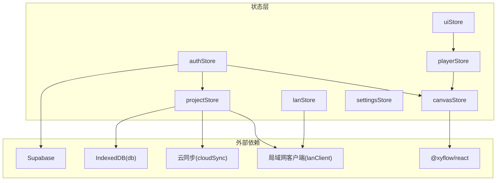
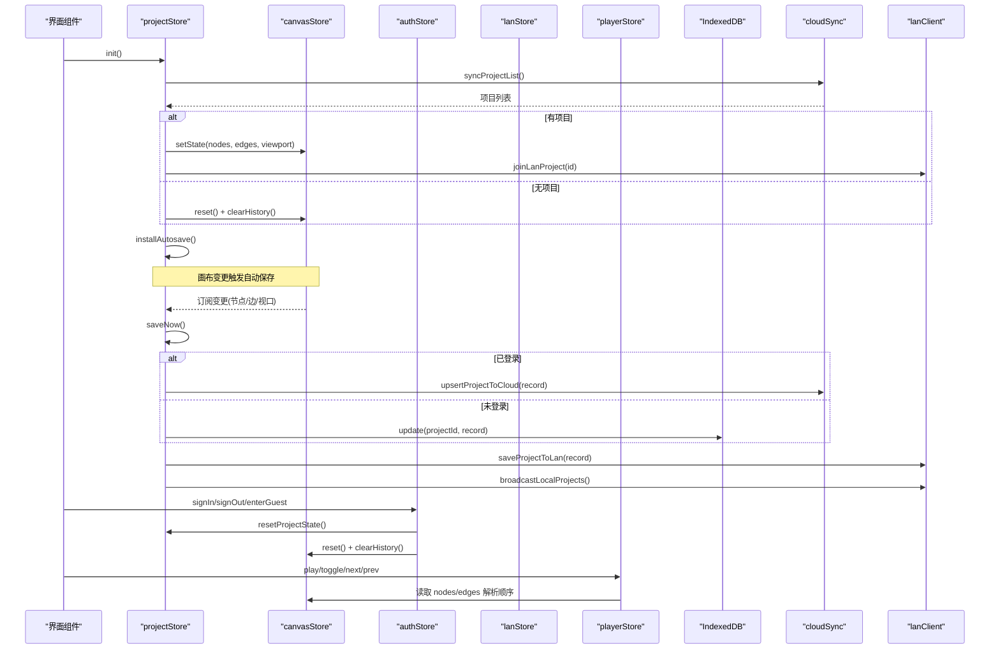
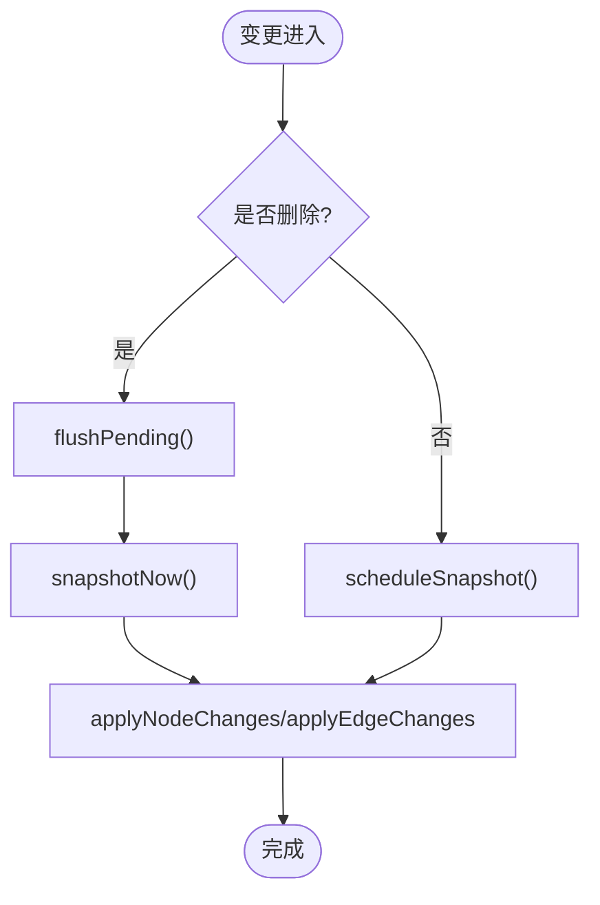
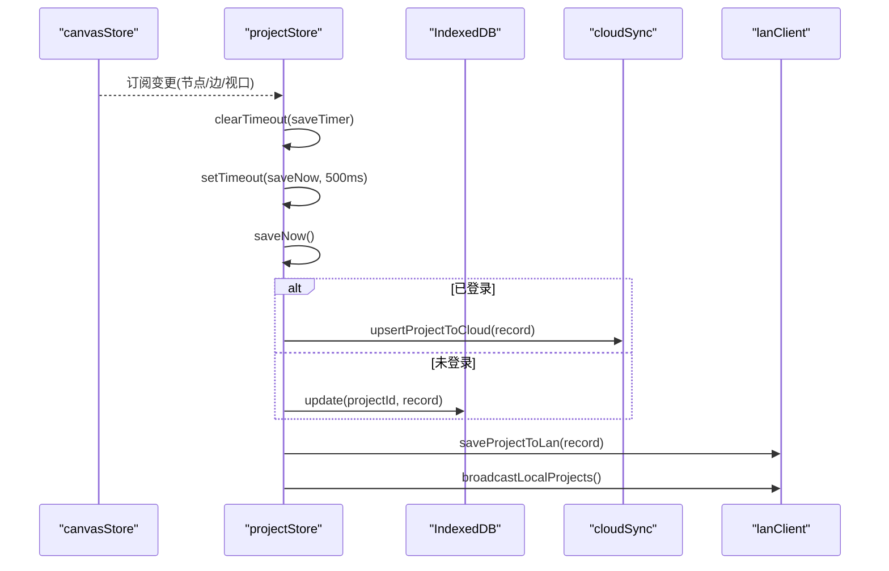
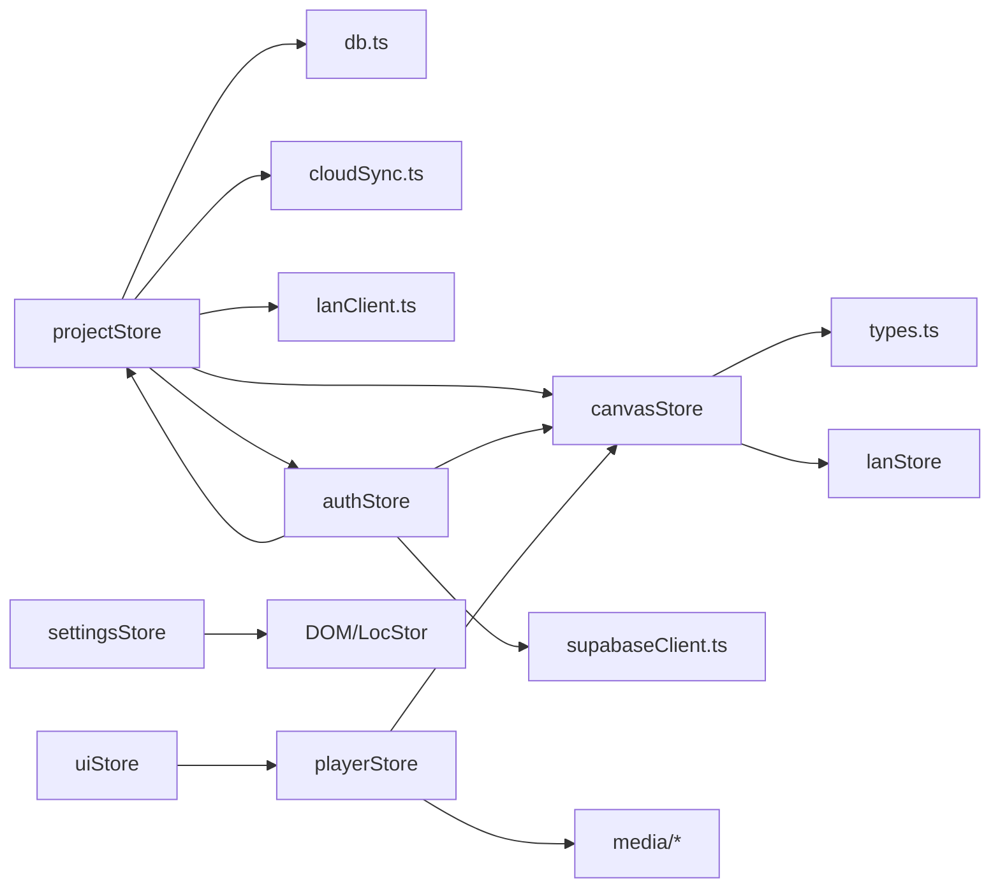

# 状态管理 API

<cite>
**本文引用的文件**
- [canvasStore.ts](file://src/store/canvasStore.ts)
- [projectStore.ts](file://src/store/projectStore.ts)
- [authStore.ts](file://src/store/authStore.ts)
- [lanStore.ts](file://src/store/lanStore.ts)
- [uiStore.ts](file://src/store/uiStore.ts)
- [playerStore.ts](file://src/store/playerStore.ts)
- [settingsStore.ts](file://src/store/settingsStore.ts)
- [types.ts](file://src/types.ts)
</cite>

## 目录
1. [简介](#简介)
2. [项目结构](#项目结构)
3. [核心组件](#核心组件)
4. [架构总览](#架构总览)
5. [详细组件分析](#详细组件分析)
6. [依赖关系分析](#依赖关系分析)
7. [性能考虑](#性能考虑)
8. [故障排查指南](#故障排查指南)
9. [结论](#结论)
10. [附录](#附录)

## 简介
本文件为 SuQCanvas 的状态管理系统 API 文档，覆盖以下 Zustand store：
- canvasStore：画布节点、边、视口与撤销重做历史
- projectStore：项目生命周期、自动保存与云端/本地同步
- authStore：用户登录态、游客模式与初始化
- lanStore：局域网协作状态（用户、光标、编辑中、活动流等）
- uiStore：全局 UI 状态（提示、查看器、播放器入口、工具模式等）
- playerStore：全局音频播放引擎（单一实例）
- settingsStore：主题设置与持久化

同时说明 Zustand 的使用模式与最佳实践、状态同步机制、数据持久化策略、订阅与更新优化建议，以及状态调试与监控方法。

## 项目结构
状态管理集中在 src/store 下，每个 store 以 create 创建独立状态切片，并通过跨 store 引用实现协作。类型定义集中在 types.ts，供各 store 共享。

图表来源
- [canvasStore.ts:1-10](file://src/store/canvasStore.ts#L1-L10)
- [projectStore.ts:1-18](file://src/store/projectStore.ts#L1-L18)
- [authStore.ts:1-7](file://src/store/authStore.ts#L1-L7)
- [lanStore.ts:1-3](file://src/store/lanStore.ts#L1-L3)
- [playerStore.ts:1-8](file://src/store/playerStore.ts#L1-L8)
- [uiStore.ts:1-3](file://src/store/uiStore.ts#L1-L3)
- [settingsStore.ts:1-3](file://src/store/settingsStore.ts#L1-L3)

章节来源
- [canvasStore.ts:1-399](file://src/store/canvasStore.ts#L1-L399)
- [projectStore.ts:1-230](file://src/store/projectStore.ts#L1-L230)
- [authStore.ts:1-104](file://src/store/authStore.ts#L1-L104)
- [lanStore.ts:1-160](file://src/store/lanStore.ts#L1-L160)
- [uiStore.ts:1-121](file://src/store/uiStore.ts#L1-L121)
- [playerStore.ts:1-298](file://src/store/playerStore.ts#L1-L298)
- [settingsStore.ts:1-40](file://src/store/settingsStore.ts#L1-L40)
- [types.ts:1-112](file://src/types.ts#L1-L112)

## 核心组件
- canvasStore：提供节点/边的增删改、连接、对齐、层级、复制粘贴、撤销/重做、视口控制与历史记录防抖合并。
- projectStore：负责项目初始化、加载、新建、重命名、保存；根据登录态选择云端或本地存储；监听画布变化进行自动保存；与局域网广播项目列表。
- authStore：处理 Supabase 会话、游客模式、登录/登出；切换登录态时重置项目与画布状态，避免串写。
- lanStore：维护局域网协作状态（用户列表、跟随目标、远端视口、活动日志、光标位置、正在编辑的节点等）。
- uiStore：统一管理 Toast、导入队列、PDF/图片/Markdown 查看器、音乐播放器入口、工具模式等。
- playerStore：单一音频播放引擎，支持顺序/随机/循环/单曲/流式模式，基于画布连线解析播放顺序。
- settingsStore：主题切换并持久化到 localStorage。

章节来源
- [canvasStore.ts:33-59](file://src/store/canvasStore.ts#L33-L59)
- [projectStore.ts:21-34](file://src/store/projectStore.ts#L21-L34)
- [authStore.ts:8-16](file://src/store/authStore.ts#L8-L16)
- [lanStore.ts:53-89](file://src/store/lanStore.ts#L53-L89)
- [uiStore.ts:18-45](file://src/store/uiStore.ts#L18-L45)
- [playerStore.ts:25-50](file://src/store/playerStore.ts#L25-L50)
- [settingsStore.ts:7-11](file://src/store/settingsStore.ts#L7-L11)

## 架构总览
下图展示关键 store 之间的调用与数据流向，包括自动保存、登录态切换、协作状态与播放引擎联动。

图表来源
- [projectStore.ts:46-67](file://src/store/projectStore.ts#L46-L67)
- [projectStore.ts:81-117](file://src/store/projectStore.ts#L81-L117)
- [projectStore.ts:196-228](file://src/store/projectStore.ts#L196-L228)
- [authStore.ts:27-42](file://src/store/authStore.ts#L27-L42)
- [authStore.ts:49-82](file://src/store/authStore.ts#L49-L82)
- [playerStore.ts:97-116](file://src/store/playerStore.ts#L97-L116)

## 详细组件分析

### canvasStore
职责
- 管理画布节点与边，处理视图缩放平移
- 提供撤销/重做历史，带防抖与去重
- 支持添加/删除/复制/粘贴/对齐/层级调整
- 记录插入元信息（创建者、时间），用于协作溯源

关键状态与方法
- 状态：nodes、edges、viewport、past、future、clipboard
- 方法：onNodesChange、onEdgesChange、onConnect、addNodes、addEdge、updateNodeData、updateEdgeData、duplicateNode、copySelected、pasteClipboard、changeNodeLayer、setNodeZIndex、removeAssets、alignSelected、undo、redo、clearHistory、setViewport、reset

历史与防抖
- 使用 pendingSnapshot 与定时器合并多次变更，减少历史条目数量
- 删除操作立即落盘快照，其他变更延迟合并

协作元信息
- 通过 lanStore 获取 selfId/name，写入节点/边的 data.createdById/createdByName/createdAt

图表来源
- [canvasStore.ts:66-107](file://src/store/canvasStore.ts#L66-L107)
- [canvasStore.ts:126-145](file://src/store/canvasStore.ts#L126-L145)

章节来源
- [canvasStore.ts:1-399](file://src/store/canvasStore.ts#L1-L399)
- [types.ts:66-107](file://src/types.ts#L66-L107)

### projectStore
职责
- 项目初始化、加载、新建、重命名、保存
- 自动保存：订阅 canvasStore 变更，延迟保存
- 根据登录态选择云端或本地存储
- 与局域网广播项目列表，加入项目

关键状态与方法
- 状态：projectId、projectName、loaded、initialized、saveStatus、busy
- 方法：init、loadProject、newProject、renameProject、saveNow、setBusy

自动保存流程
- 安装一次监听器，比较前后 state 是否变化
- 若变化则延迟 500ms 后执行 saveNow
- 保存时根据 isCloudUser 决定云端或本地

图表来源
- [projectStore.ts:46-67](file://src/store/projectStore.ts#L46-L67)
- [projectStore.ts:196-228](file://src/store/projectStore.ts#L196-L228)

章节来源
- [projectStore.ts:1-230](file://src/store/projectStore.ts#L1-L230)

### authStore
职责
- 初始化 Supabase 会话与监听
- 支持游客模式与本地 LAN 配置检测
- 登录/登出时重置项目与画布状态，防止串写

关键状态与方法
- 状态：user、guest、loading
- 方法：init、signIn、signOut、enterGuest

登录态切换影响
- 从游客切换到登录：重置项目与画布，确保后续读写走云端路径
- 登出：清除游客标记，重置项目与画布

章节来源
- [authStore.ts:1-104](file://src/store/authStore.ts#L1-L104)

### lanStore
职责
- 管理局域网协作相关状态：用户列表、跟随目标、远端视口、活动日志、光标位置、正在编辑的节点、远程项目列表等
- 提供合并与清理方法，保持状态一致性

关键状态与方法
- 状态：status、url、name、selfId、users、followId、remoteViewport、activeProjectId、remoteProjects、cursors、editing、activities
- 方法：setStatus、setUrl、setName、setSelfId、setUsers、removeUser、setFollowId、setRemoteViewport、clearRemoteViewport、setActiveProjectId、setSharedProjects、setCursor、removeCursor、setEditing、clearEditing、addActivity、clearCollaborationState、mergeRemoteProjects、removeRemoteProjectsByOwner、clearRemoteProjects

章节来源
- [lanStore.ts:1-160](file://src/store/lanStore.ts#L1-L160)

### uiStore
职责
- 全局 UI 状态：Toast、导入队列、PDF/图片/Markdown 查看器、音乐播放器入口、工具模式、首页开关等
- 提供便捷函数 toast(message, kind) 直接推送提示

关键状态与方法
- 状态：toasts、importQueue、pdfViewer、imageViewer、playerPage、markdownViewer、fileManagerOpen、playerTarget、homeOpen、tool
- 方法：pushToast、removeToast、requestImport、consumeImport、open/close*、setFileManagerOpen、openMusicPlayer、setHomeOpen、setTool

章节来源
- [uiStore.ts:1-121](file://src/store/uiStore.ts#L1-L121)

### playerStore
职责
- 单一音频播放引擎，绑定全局 <audio> 元素
- 支持顺序/随机/循环/单曲/流式播放模式
- 基于画布连线解析播放顺序（线性化）

关键状态与方法
- 状态：track、playing、time、duration、volume、muted、barVisible、mode、queue
- 方法：play、toggle、seekTo、seekBy、next、prev、setVolume、setMuted、setMode、setQueue、stop、setBarVisible

播放顺序解析
- 优先使用 queue（流式模式）
- 否则使用 orderProvider（打开时的歌曲列表）
- 最后回退到画布连线顺序（linearizeFrom）

章节来源
- [playerStore.ts:1-298](file://src/store/playerStore.ts#L1-L298)

### settingsStore
职责
- 主题切换与持久化（localStorage）
- 应用主题类名到根元素

关键状态与方法
- 状态：theme
- 方法：setTheme、toggleTheme

章节来源
- [settingsStore.ts:1-40](file://src/store/settingsStore.ts#L1-L40)

## 依赖关系分析
- canvasStore 依赖 @xyflow/react 的变更处理与类型，依赖 types.ts 中的 SuqNode/SuqEdge 定义，依赖 lanStore 获取协作元信息。
- projectStore 依赖 db（IndexedDB）、cloudSync（云端）、lanClient（局域网）、authStore（判断登录态）、canvasStore（读取/写入画布状态）。
- authStore 依赖 supabaseClient、buildMode、projectStore、canvasStore。
- playerStore 依赖 canvasStore（解析连线顺序）、media 模块（blobRegistry、playlists）。
- uiStore 与 playerStore 解耦，仅通过 openMusicPlayer 传递参数。
- settingsStore 独立，仅操作 DOM class 与 localStorage。

图表来源
- [canvasStore.ts:1-6](file://src/store/canvasStore.ts#L1-L6)
- [projectStore.ts:1-18](file://src/store/projectStore.ts#L1-L18)
- [authStore.ts:1-7](file://src/store/authStore.ts#L1-L7)
- [playerStore.ts:1-8](file://src/store/playerStore.ts#L1-L8)
- [uiStore.ts:1-3](file://src/store/uiStore.ts#L1-L3)
- [settingsStore.ts:1-3](file://src/store/settingsStore.ts#L1-L3)

章节来源
- [canvasStore.ts:1-399](file://src/store/canvasStore.ts#L1-L399)
- [projectStore.ts:1-230](file://src/store/projectStore.ts#L1-L230)
- [authStore.ts:1-104](file://src/store/authStore.ts#L1-L104)
- [playerStore.ts:1-298](file://src/store/playerStore.ts#L1-L298)
- [uiStore.ts:1-121](file://src/store/uiStore.ts#L1-L121)
- [settingsStore.ts:1-40](file://src/store/settingsStore.ts#L1-L40)

## 性能考虑
- 撤销历史防抖合并：canvasStore 使用 pendingSnapshot 与定时器合并高频变更，降低历史膨胀与渲染压力。
- 自动保存节流：projectStore 在画布变更后延迟 500ms 保存，避免频繁 IO。
- 最小化状态更新：多处使用结构化克隆与 Map 去重，减少不必要的重渲染。
- 单一播放引擎：playerStore 保证全局唯一 <audio> 实例，避免重复加载与竞态。
- 订阅优化：projectStore 仅在画布实际变化时触发保存，且只在 loaded 状态下生效。

[本节为通用性能建议，不直接分析具体代码行]

## 故障排查指南
- 自动保存失败：检查 projectStore.saveNow 的错误分支，确认云端/本地写入权限与网络状态。
- 登录态切换导致数据串写：authStore 在切换时会重置项目与画布，确保后续读写路径正确。
- 协作状态异常：lanStore 提供 clearCollaborationState 清空光标、编辑中、活动日志，便于恢复。
- 播放顺序异常：playerStore 依赖画布连线顺序，若节点/边缺失可能导致顺序为空，需检查 nodes/edges 完整性。

章节来源
- [projectStore.ts:196-228](file://src/store/projectStore.ts#L196-L228)
- [authStore.ts:27-42](file://src/store/authStore.ts#L27-L42)
- [lanStore.ts:142-144](file://src/store/lanStore.ts#L142-L144)
- [playerStore.ts:97-116](file://src/store/playerStore.ts#L97-L116)

## 结论
本项目采用多 store 拆分的状态管理方案，职责清晰、耦合可控。通过 Zustand 的 create 与 subscribe 机制，实现了高效的局部更新与跨模块协作。结合自动保存、撤销历史、协作状态与单一播放引擎，整体具备良好的可维护性与扩展性。建议在新增功能时遵循现有模式：明确状态边界、最小化副作用、合理使用持久化与订阅。

[本节为总结性内容，不直接分析具体代码行]

## 附录

### Zustand 使用模式与最佳实践
- 按领域拆分 store：每个 store 聚焦一个业务域，避免大状态对象。
- 使用 immer 风格更新：通过 set({ ... }) 返回新对象，确保不可变更新。
- 谨慎订阅：仅在必要时使用 subscribe，避免全量监听造成性能问题。
- 异步操作封装：将异步逻辑放入 store 方法内，统一错误处理与状态流转。
- 持久化策略：小状态用 localStorage（如 settingsStore），大对象用 IndexedDB（如 projectStore）。

[本节为通用实践建议，不直接分析具体代码行]

### 状态同步机制与数据持久化策略
- 画布变更 → 自动保存 → 云端/本地存储 → 局域网广播
- 登录态切换 → 重置项目与画布 → 重新初始化数据源
- 协作状态 → 局域网实时更新（用户、光标、编辑中、活动日志）
- 播放顺序 → 基于画布连线线性化，支持歌单队列与多种模式

章节来源
- [projectStore.ts:46-67](file://src/store/projectStore.ts#L46-L67)
- [projectStore.ts:196-228](file://src/store/projectStore.ts#L196-L228)
- [authStore.ts:27-42](file://src/store/authStore.ts#L27-L42)
- [lanStore.ts:119-158](file://src/store/lanStore.ts#L119-L158)
- [playerStore.ts:97-116](file://src/store/playerStore.ts#L97-L116)

### 状态订阅与更新的性能优化建议
- 使用选择性订阅：组件只订阅所需字段，避免全量重渲染。
- 批量更新：将多个相关状态更新合并到一次 setState。
- 防抖/节流：对高频事件（如拖拽、输入）进行合并，减少状态抖动。
- 惰性计算：将昂贵计算延迟到需要时再执行。

[本节为通用优化建议，不直接分析具体代码行]

### 状态调试与监控工具使用方法
- 浏览器开发者工具：在 React DevTools 中查看 Zustand store 树，观察状态变化。
- 自定义日志：在关键方法前后打印状态快照，辅助定位问题。
- 断点调试：在 store 方法内部打断点，逐步跟踪状态流转。
- 网络面板：监控云端/局域网请求，验证同步链路。

[本节为通用调试建议，不直接分析具体代码行]