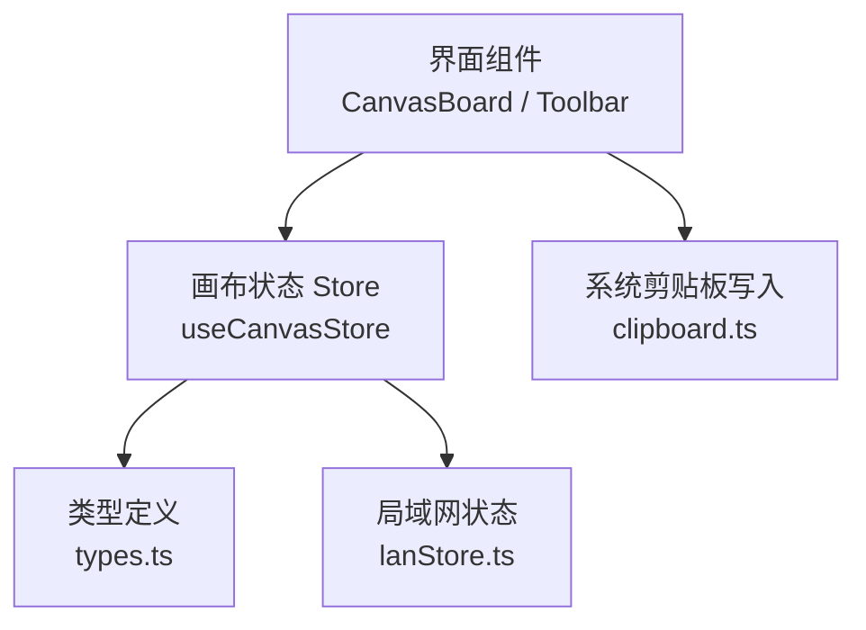
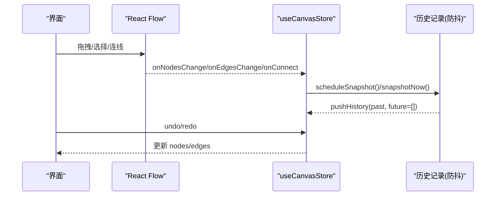
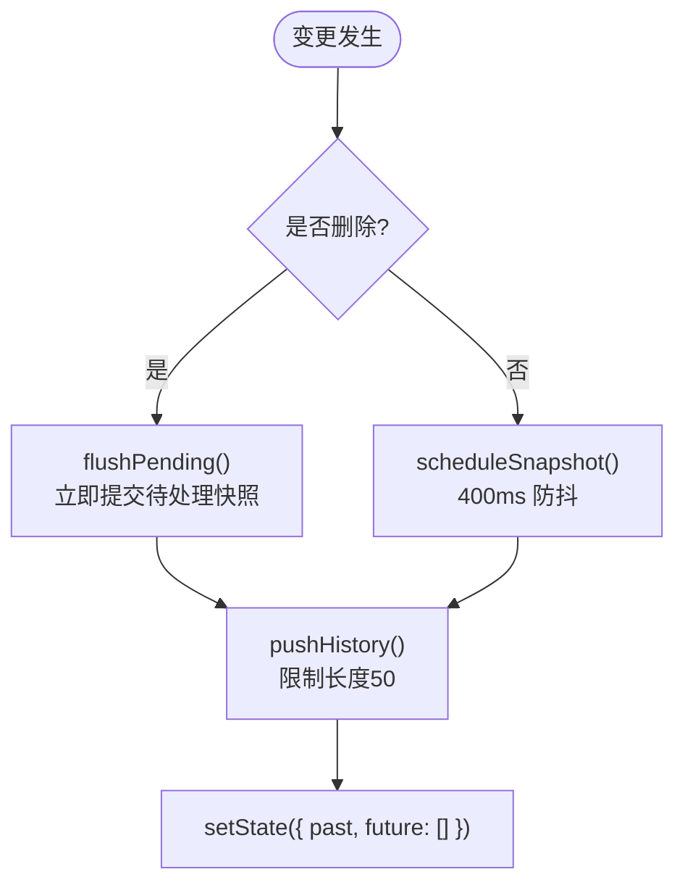
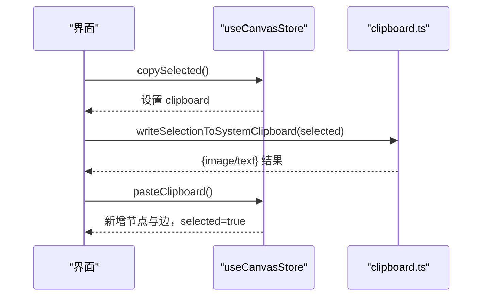
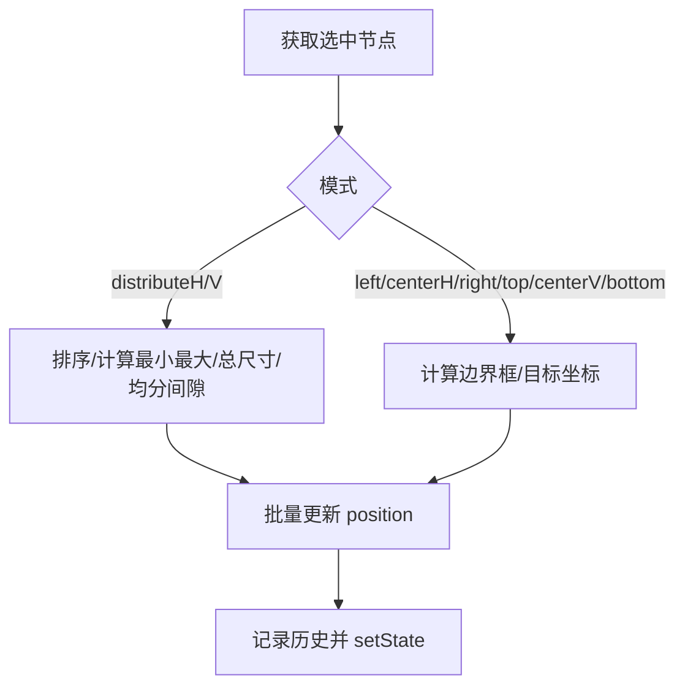
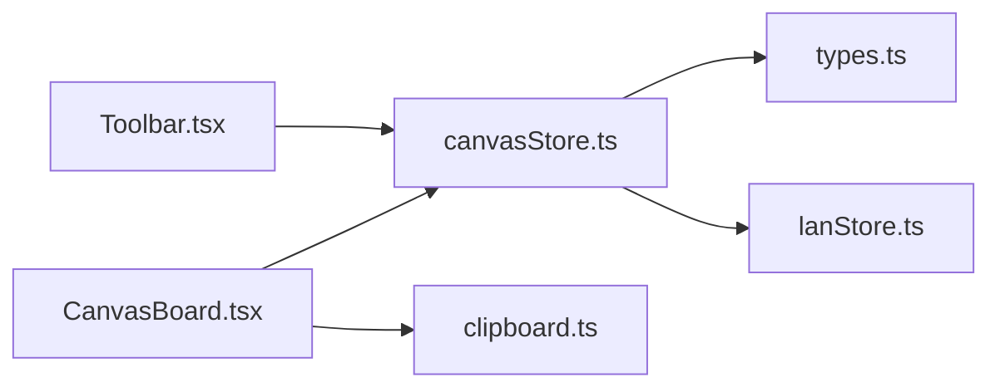

# 画布状态管理 API

<cite>
**本文引用的文件**
- [src/store/canvasStore.ts](file://src/store/canvasStore.ts)
- [src/store/canvasStore.test.ts](file://src/store/canvasStore.test.ts)
- [src/types.ts](file://src/types.ts)
- [src/store/lanStore.ts](file://src/store/lanStore.ts)
- [src/canvas/CanvasBoard.tsx](file://src/canvas/CanvasBoard.tsx)
- [src/components/Toolbar.tsx](file://src/components/Toolbar.tsx)
- [src/canvas/clipboard.ts](file://src/canvas/clipboard.ts)
</cite>

## 目录
1. [简介](#简介)
2. [项目结构](#项目结构)
3. [核心组件](#核心组件)
4. [架构总览](#架构总览)
5. [详细组件分析](#详细组件分析)
6. [依赖关系分析](#依赖关系分析)
7. [性能与优化](#性能与优化)
8. [故障排查指南](#故障排查指南)
9. [结论](#结论)
10. [附录：API 参考与示例](#附录api-参考与示例)

## 简介
本文件为画布状态管理 Store（useCanvasStore）的详细 API 文档，覆盖节点操作、边操作、视图操作、历史记录、剪贴板、对齐与层级管理等能力。文档基于源码实现进行说明，包含参数、返回值、使用场景、历史记录的防抖机制与性能优化策略，并提供具体代码示例的引用路径，便于快速定位与复用。

## 项目结构
- 状态定义与实现位于 store 层，类型定义位于 types 层，UI 交互在 canvas 与 components 中调用 Store。
- 关键文件职责：
  - src/store/canvasStore.ts：定义 useCanvasStore 的状态、方法与历史机制。
  - src/types.ts：定义 SuqNode、SuqEdge、Viewport、对齐模式等类型。
  - src/store/lanStore.ts：提供当前用户信息，用于插入元数据。
  - src/canvas/CanvasBoard.tsx：React Flow 集成、快捷键、视图同步等。
  - src/components/Toolbar.tsx：工具栏按钮与对齐、撤销/重做等交互。
  - src/canvas/clipboard.ts：系统剪贴板写入（文本/图片）。



图表来源
- [src/store/canvasStore.ts:1-59](file://src/store/canvasStore.ts#L1-L59)
- [src/types.ts:1-112](file://src/types.ts#L1-L112)
- [src/store/lanStore.ts:1-160](file://src/store/lanStore.ts#L1-L160)
- [src/canvas/CanvasBoard.tsx:1-200](file://src/canvas/CanvasBoard.tsx#L1-L200)
- [src/components/Toolbar.tsx:1-200](file://src/components/Toolbar.tsx#L1-L200)
- [src/canvas/clipboard.ts:1-132](file://src/canvas/clipboard.ts#L1-L132)

章节来源
- [src/store/canvasStore.ts:1-59](file://src/store/canvasStore.ts#L1-L59)
- [src/types.ts:1-112](file://src/types.ts#L1-L112)

## 核心组件
- useCanvasStore：基于 Zustand 创建的画布状态 Store，暴露以下能力：
  - 节点：addNodes、updateNodeData、duplicateNode、removeAssets
  - 边：addEdge、updateEdgeData
  - 视图：setViewport
  - 历史：undo、redo、clearHistory
  - 剪贴板：copySelected、pasteClipboard
  - 对齐：alignSelected
  - 层级：changeNodeLayer、setNodeZIndex
  - 事件桥接：onNodesChange、onEdgesChange、onConnect
  - 重置：reset

章节来源
- [src/store/canvasStore.ts:33-59](file://src/store/canvasStore.ts#L33-L59)

## 架构总览
- 数据流：
  - React Flow 通过 onNodesChange/onEdgesChange/onConnect 将变更交给 Store。
  - Store 内部维护 nodes、edges、viewport、past/future 历史栈、clipboard。
  - 所有可撤销的操作会触发“快照”写入 past，并清空 future。
  - undo/redo 在 past/future 之间移动指针，恢复 nodes/edges。
- 协作与元数据：
  - 新增元素时自动注入 createdById/createdByName/createdAt，来源于 lanStore。
- 剪贴板：
  - copySelected 复制选中节点到内部 clipboard；pasteClipboard 粘贴并重建边连接。
  - 系统剪贴板写入由 clipboard.ts 负责（文本或图片）。



图表来源
- [src/store/canvasStore.ts:66-107](file://src/store/canvasStore.ts#L66-L107)
- [src/store/canvasStore.ts:126-158](file://src/store/canvasStore.ts#L126-L158)
- [src/store/canvasStore.ts:362-391](file://src/store/canvasStore.ts#L362-L391)

## 详细组件分析

### 节点操作
- addNodes(nodes)
  - 参数：nodes 数组，类型为 SuqNode。
  - 行为：立即记录历史快照，为每个节点补充插入元数据（创建者、时间），追加到 nodes。
  - 返回：无。
  - 场景：从工具栏插入文本、标题、便签、图形等。
  - 示例引用：[src/components/Toolbar.tsx:86-88](file://src/components/Toolbar.tsx#L86-L88)、[src/canvas/CanvasBoard.tsx:239-240](file://src/canvas/CanvasBoard.tsx#L239-L240)
- updateNodeData(id, data)
  - 参数：id 字符串，data 为 Partial<SuqNode['data']>。
  - 行为：合并更新指定节点的 data，记录历史。
  - 返回：无。
  - 场景：编辑节点属性（如文本、样式、尺寸等）。
  - 示例引用：[src/canvas/nodes/HeadingNode.tsx:20](file://src/canvas/nodes/HeadingNode.tsx#L20)
- duplicateNode(id)
  - 参数：id 字符串。
  - 行为：克隆节点，偏移位置，重置 selected/dragging，补充元数据，记录历史后追加。
  - 返回：无。
  - 场景：快捷键 Ctrl/Cmd+D 批量复制选中节点。
  - 示例引用：[src/canvas/CanvasBoard.tsx:122-127](file://src/canvas/CanvasBoard.tsx#L122-L127)
- removeAssets(assetIds)
  - 参数：assetIds 字符串数组。
  - 行为：删除关联资源的所有节点及与之相连的边，记录历史。
  - 返回：无。
  - 场景：素材库删除后清理画布。
  - 示例引用：[src/store/canvasStore.test.ts:126-147](file://src/store/canvasStore.test.ts#L126-L147)

章节来源
- [src/store/canvasStore.ts:159-204](file://src/store/canvasStore.ts#L159-L204)
- [src/store/canvasStore.ts:275-289](file://src/store/canvasStore.ts#L275-L289)
- [src/store/canvasStore.test.ts:21-33](file://src/store/canvasStore.test.ts#L21-L33)

### 边操作
- addEdge(edge)
  - 参数：edge 为 SuqEdge。
  - 行为：记录历史后追加到 edges。
  - 返回：无。
  - 场景：手动添加连线。
- updateEdgeData(id, data)
  - 参数：id 字符串，data 为 Partial<SuqEdge['data']>。
  - 行为：合并更新指定边的 data，记录历史。
  - 返回：无。
  - 场景：修改连线样式、箭头、顺序等。
- onConnect(connection)
  - 参数：Connection 对象。
  - 行为：生成默认样式的 SuqEdge，记录历史后追加。
  - 返回：无。
  - 场景：React Flow 连线完成回调。

章节来源
- [src/store/canvasStore.ts:146-175](file://src/store/canvasStore.ts#L146-L175)
- [src/store/canvasStore.ts:184-191](file://src/store/canvasStore.ts#L184-L191)

### 视图操作
- setViewport(viewport)
  - 参数：Viewport（来自 @xyflow/react）。
  - 行为：直接设置 viewport。
  - 返回：无。
  - 场景：缩放、平移、跟随远端视口。
  - 示例引用：[src/canvas/CanvasBoard.tsx:47-49](file://src/canvas/CanvasBoard.tsx#L47-L49)、[src/canvas/CanvasBoard.tsx:88-100](file://src/canvas/CanvasBoard.tsx#L88-L100)

章节来源
- [src/store/canvasStore.ts:392-394](file://src/store/canvasStore.ts#L392-L394)

### 历史记录管理
- undo()
  - 行为：从 past 取出上一个快照，推入 future，恢复 nodes/edges。
  - 返回：无。
  - 场景：Ctrl/Cmd+Z。
- redo()
  - 行为：从 future 取出下一个快照，推入 past，恢复 nodes/edges。
  - 返回：无。
  - 场景：Ctrl/Cmd+Y 或 Shift+Ctrl/Cmd+Z。
- clearHistory()
  - 行为：清除 pending 快照与定时器，清空 past/future。
  - 返回：无。
  - 场景：切换项目或初始化时清理历史。

历史防抖机制
- scheduleSnapshot：高频操作（非删除）通过 setTimeout 延迟 400ms 合并一次快照，避免频繁写历史。
- flushPending：遇到删除操作时立即提交待处理快照。
- snapshotNow：立即记录快照（如连接、显式操作）。
- HISTORY_LIMIT：最多保留 50 条历史。



图表来源
- [src/store/canvasStore.ts:66-107](file://src/store/canvasStore.ts#L66-L107)
- [src/store/canvasStore.ts:126-145](file://src/store/canvasStore.ts#L126-L145)

章节来源
- [src/store/canvasStore.ts:66-107](file://src/store/canvasStore.ts#L66-L107)
- [src/store/canvasStore.ts:362-391](file://src/store/canvasStore.ts#L362-L391)

### 剪贴板功能
- copySelected()
  - 行为：收集 selected=true 的节点，深拷贝并清除 selected/dragging，存入 clipboard。
  - 返回：无。
  - 场景：Ctrl/Cmd+C。
- pasteClipboard()
  - 行为：深拷贝 clipboard 中的节点，重新分配 id，偏移位置，标记 selected，补充元数据；同时复制节点间边并重连到新 id。
  - 返回：无。
  - 场景：Ctrl/Cmd+V。
- 系统剪贴板写入（辅助）
  - writeSelectionToSystemClipboard：单个图片/PSD 节点尝试写入 PNG 到系统剪贴板，否则回退为文本。
  - 示例引用：[src/canvas/CanvasBoard.tsx:128-135](file://src/canvas/CanvasBoard.tsx#L128-L135)、[src/canvas/clipboard.ts:114-132](file://src/canvas/clipboard.ts#L114-L132)



图表来源
- [src/store/canvasStore.ts:205-246](file://src/store/canvasStore.ts#L205-L246)
- [src/canvas/clipboard.ts:114-132](file://src/canvas/clipboard.ts#L114-L132)
- [src/canvas/CanvasBoard.tsx:128-135](file://src/canvas/CanvasBoard.tsx#L128-L135)

章节来源
- [src/store/canvasStore.ts:205-246](file://src/store/canvasStore.ts#L205-L246)
- [src/canvas/clipboard.ts:1-132](file://src/canvas/clipboard.ts#L1-L132)
- [src/store/canvasStore.test.ts:35-92](file://src/store/canvasStore.test.ts#L35-L92)

### 对齐功能
- alignSelected(mode)
  - 参数：mode 为 AlignMode（left/centerH/right/top/centerV/bottom/distributeH/distributeV）。
  - 行为：计算选中节点边界或分布间距，批量更新 position，记录历史。
  - 返回：无。
  - 场景：工具栏对齐按钮。
  - 示例引用：[src/components/Toolbar.tsx:69-78](file://src/components/Toolbar.tsx#L69-L78)



图表来源
- [src/store/canvasStore.ts:290-361](file://src/store/canvasStore.ts#L290-L361)

章节来源
- [src/store/canvasStore.ts:290-361](file://src/store/canvasStore.ts#L290-L361)
- [src/components/Toolbar.tsx:69-78](file://src/components/Toolbar.tsx#L69-L78)

### 层级管理
- changeNodeLayer(id, mode)
  - 参数：id 字符串，mode 为 LayerMode（front/forward/backward/back）。
  - 行为：按 zIndex 排序，移动节点到目标位置，重新计算 rank 并赋值 zIndex，记录历史。
  - 返回：无。
  - 场景：置顶、上移、下移、置底。
- setNodeZIndex(id, value)
  - 参数：id 字符串，value 数字。
  - 行为：校验并裁剪到 [0, 9999] 整数范围，设置 zIndex，记录历史。
  - 返回：无。
  - 场景：精确层级控制。

```mermaid
classDiagram
class CanvasState {
+nodes : SuqNode[]
+edges : SuqEdge[]
+viewport : Viewport
+past : HistoryEntry[]
+future : HistoryEntry[]
+changeNodeLayer(id, mode) void
+setNodeZIndex(id, value) void
}
class SuqNode {
+string id
+number? zIndex
+position : {x : number,y : number}
}
CanvasState --> SuqNode : "管理层级"
```

图表来源
- [src/store/canvasStore.ts:247-274](file://src/store/canvasStore.ts#L247-L274)
- [src/types.ts:106-107](file://src/types.ts#L106-L107)

章节来源
- [src/store/canvasStore.ts:247-274](file://src/store/canvasStore.ts#L247-L274)
- [src/store/canvasStore.test.ts:94-124](file://src/store/canvasStore.test.ts#L94-L124)

## 依赖关系分析
- useCanvasStore 依赖：
  - @xyflow/react：节点/边变更应用与 Viewport 类型。
  - zustand：状态管理。
  - ../types：SuqNode/SuqEdge/Viewport/默认边样式等。
  - ./lanStore：获取当前用户信息以填充插入元数据。
- 外部交互：
  - CanvasBoard 监听键盘事件，调用 Store 的 undo/redo/duplicate/copy/paste 等。
  - Toolbar 提供对齐、撤销/重做等入口。
  - clipboard.ts 负责系统剪贴板写入。



图表来源
- [src/store/canvasStore.ts:1-6](file://src/store/canvasStore.ts#L1-L6)
- [src/canvas/CanvasBoard.tsx:17-36](file://src/canvas/CanvasBoard.tsx#L17-L36)
- [src/components/Toolbar.tsx:1-12](file://src/components/Toolbar.tsx#L1-L12)

章节来源
- [src/store/canvasStore.ts:1-6](file://src/store/canvasStore.ts#L1-L6)
- [src/canvas/CanvasBoard.tsx:17-36](file://src/canvas/CanvasBoard.tsx#L17-L36)
- [src/components/Toolbar.tsx:1-12](file://src/components/Toolbar.tsx#L1-L12)

## 性能与优化
- 历史防抖：
  - 非删除类变更通过 400ms 防抖合并快照，减少 setState 频率与历史膨胀。
  - 删除类变更立即 flushPending，保证一致性。
- 历史上限：
  - 最多保留 50 条历史，防止内存占用过高。
- 数据结构：
  - 使用 Map/Set 提升查找效率（如粘贴时 id 映射、去重）。
- 深拷贝：
  - 剪贴板使用 structuredClone，避免共享引用导致的副作用。
- 数值裁剪：
  - setNodeZIndex 对输入进行整数化与范围裁剪，避免异常层级。
- 建议：
  - 大批量操作可考虑分批执行或合并多次更新。
  - 对于超大画布，注意节点/边数量对渲染与历史的影响。

章节来源
- [src/store/canvasStore.ts:30-32](file://src/store/canvasStore.ts#L30-L32)
- [src/store/canvasStore.ts:66-107](file://src/store/canvasStore.ts#L66-L107)
- [src/store/canvasStore.ts:218-246](file://src/store/canvasStore.ts#L218-L246)
- [src/store/canvasStore.ts:266-274](file://src/store/canvasStore.ts#L266-L274)

## 故障排查指南
- 撤销/重做无效：
  - 检查是否触发了 clearHistory 或被其他逻辑清空了 past/future。
  - 确认操作是否为可记录变更（删除会立即提交，其他走防抖）。
- 粘贴后边未重连：
  - 确保被粘贴的节点之间存在边，且源/目标都在粘贴集合内。
  - 检查节点 id 映射是否正确生成。
- 对齐不生效：
  - 至少需要两个选中节点才会执行对齐。
  - 节点尺寸缺失时会回退默认值（宽 240，高 160）。
- 层级异常：
  - setNodeZIndex 会将非有限数忽略，并将值裁剪到 [0, 9999] 整数。
- 系统剪贴板写入失败：
  - 浏览器不支持 ClipboardItem 或权限不足时，会回退为文本复制。

章节来源
- [src/store/canvasStore.ts:384-391](file://src/store/canvasStore.ts#L384-L391)
- [src/store/canvasStore.ts:218-246](file://src/store/canvasStore.ts#L218-L246)
- [src/store/canvasStore.ts:290-361](file://src/store/canvasStore.ts#L290-L361)
- [src/store/canvasStore.ts:266-274](file://src/store/canvasStore.ts#L266-L274)
- [src/canvas/clipboard.ts:99-107](file://src/canvas/clipboard.ts#L99-L107)

## 结论
useCanvasStore 提供了完整的画布状态管理能力，涵盖节点/边操作、视图、历史、剪贴板、对齐与层级等。其历史机制通过防抖与上限控制兼顾了用户体验与性能。结合 CanvasBoard 与 Toolbar 的交互，形成了流畅的画布编辑体验。建议在复杂场景中合理使用批量操作与历史清理，以获得最佳性能。

## 附录：API 参考与示例

### 节点操作
- addNodes(nodes)
  - 参数：SuqNode[]
  - 返回：void
  - 场景：插入新节点
  - 示例引用：[src/components/Toolbar.tsx:86-88](file://src/components/Toolbar.tsx#L86-L88)
- updateNodeData(id, data)
  - 参数：id: string, data: Partial<SuqNode['data']>
  - 返回：void
  - 场景：更新节点数据
  - 示例引用：[src/canvas/nodes/HeadingNode.tsx:20](file://src/canvas/nodes/HeadingNode.tsx#L20)
- duplicateNode(id)
  - 参数：id: string
  - 返回：void
  - 场景：复制节点
  - 示例引用：[src/canvas/CanvasBoard.tsx:122-127](file://src/canvas/CanvasBoard.tsx#L122-L127)
- removeAssets(assetIds)
  - 参数：assetIds: string[]
  - 返回：void
  - 场景：删除资源及其关联节点和边
  - 示例引用：[src/store/canvasStore.test.ts:126-147](file://src/store/canvasStore.test.ts#L126-L147)

### 边操作
- addEdge(edge)
  - 参数：SuqEdge
  - 返回：void
  - 场景：添加边
- updateEdgeData(id, data)
  - 参数：id: string, data: Partial<SuqEdge['data']>
  - 返回：void
  - 场景：更新边数据
- onConnect(connection)
  - 参数：Connection
  - 返回：void
  - 场景：React Flow 连线回调

### 视图操作
- setViewport(viewport)
  - 参数：Viewport
  - 返回：void
  - 场景：设置视图
  - 示例引用：[src/canvas/CanvasBoard.tsx:47-49](file://src/canvas/CanvasBoard.tsx#L47-L49)

### 历史记录
- undo()
  - 返回：void
  - 场景：撤销
  - 示例引用：[src/canvas/CanvasBoard.tsx:115-118](file://src/canvas/CanvasBoard.tsx#L115-L118)
- redo()
  - 返回：void
  - 场景：重做
  - 示例引用：[src/canvas/CanvasBoard.tsx:119-121](file://src/canvas/CanvasBoard.tsx#L119-L121)
- clearHistory()
  - 返回：void
  - 场景：清空历史
  - 示例引用：[src/store/canvasStore.test.ts:15-18](file://src/store/canvasStore.test.ts#L15-L18)

### 剪贴板
- copySelected()
  - 返回：void
  - 场景：复制选中节点
  - 示例引用：[src/canvas/CanvasBoard.tsx:128-132](file://src/canvas/CanvasBoard.tsx#L128-L132)
- pasteClipboard()
  - 返回：void
  - 场景：粘贴剪贴板内容
  - 示例引用：[src/canvas/CanvasBoard.tsx:133-135](file://src/canvas/CanvasBoard.tsx#L133-L135)

### 对齐
- alignSelected(mode)
  - 参数：AlignMode
  - 返回：void
  - 场景：对齐/分布
  - 示例引用：[src/components/Toolbar.tsx:69-78](file://src/components/Toolbar.tsx#L69-L78)

### 层级
- changeNodeLayer(id, mode)
  - 参数：id: string, mode: LayerMode
  - 返回：void
  - 场景：调整层级顺序
  - 示例引用：[src/store/canvasStore.test.ts:94-110](file://src/store/canvasStore.test.ts#L94-L110)
- setNodeZIndex(id, value)
  - 参数：id: string, value: number
  - 返回：void
  - 场景：设置精确层级
  - 示例引用：[src/store/canvasStore.test.ts:112-124](file://src/store/canvasStore.test.ts#L112-L124)