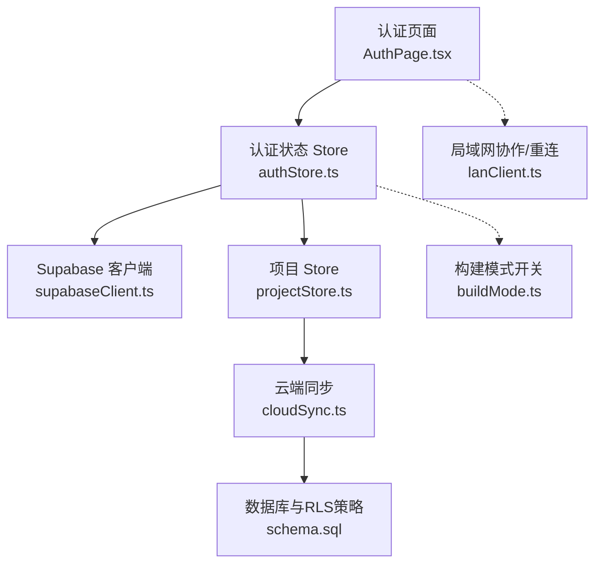
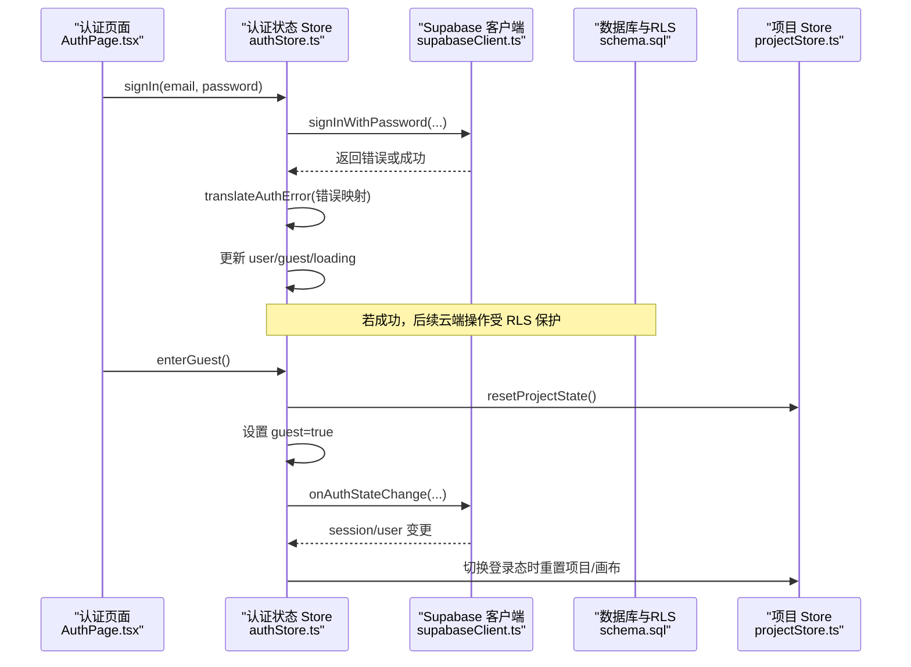
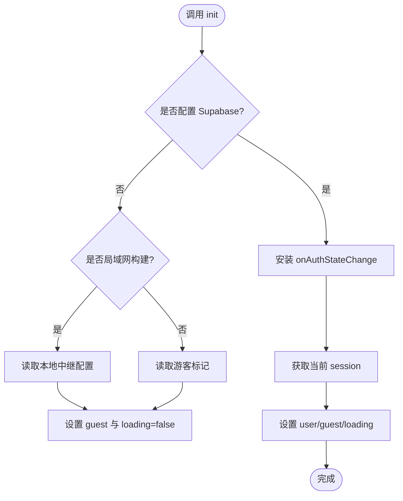
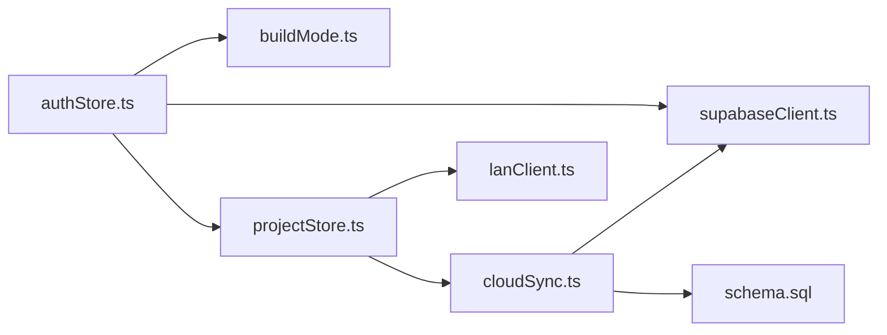

# 认证状态管理 API

<cite>
**本文引用的文件**
- [authStore.ts](file://src/store/authStore.ts)
- [supabaseClient.ts](file://src/sync/supabaseClient.ts)
- [AuthPage.tsx](file://src/components/AuthPage.tsx)
- [projectStore.ts](file://src/store/projectStore.ts)
- [cloudSync.ts](file://src/sync/cloudSync.ts)
- [schema.sql](file://supabase/schema.sql)
- [buildMode.ts](file://src/buildMode.ts)
- [lanClient.ts](file://src/sync/lanClient.ts)
</cite>

## 目录
1. [简介](#简介)
2. [项目结构](#项目结构)
3. [核心组件](#核心组件)
4. [架构总览](#架构总览)
5. [详细组件分析](#详细组件分析)
6. [依赖关系分析](#依赖关系分析)
7. [性能与可靠性](#性能与可靠性)
8. [故障排查指南](#故障排查指南)
9. [结论](#结论)
10. [附录：API 参考](#附录api-参考)

## 简介
本文档面向“认证状态管理 Store”的 API 与集成说明，覆盖以下目标：
- 用户认证状态管理：登录、登出、游客模式、会话初始化
- Supabase 认证集成与会话管理：onAuthStateChange、getSession、getUser
- 权限控制与访问验证：基于 Supabase RLS（行级安全）的用户隔离策略
- 认证状态的订阅与监听：Zustand 订阅、Supabase 事件监听
- 错误处理与重试机制：登录错误翻译、局域网自动重连
- 基于角色的访问控制（RBAC）实践建议：结合 RLS 与业务层判断实现

## 项目结构
认证相关代码主要分布在以下模块：
- 认证状态 Store：src/store/authStore.ts
- Supabase 客户端封装：src/sync/supabaseClient.ts
- 认证页面 UI：src/components/AuthPage.tsx
- 项目数据与云同步：src/store/projectStore.ts, src/sync/cloudSync.ts
- 数据库与权限策略：supabase/schema.sql
- 构建模式与在线/局域网分支：src/buildMode.ts
- 局域网协作与断线重连：src/sync/lanClient.ts

图表来源
- [authStore.ts:1-104](file://src/store/authStore.ts#L1-L104)
- [supabaseClient.ts:1-18](file://src/sync/supabaseClient.ts#L1-L18)
- [AuthPage.tsx:1-238](file://src/components/AuthPage.tsx#L1-L238)
- [projectStore.ts:1-230](file://src/store/projectStore.ts#L1-L230)
- [cloudSync.ts:1-165](file://src/sync/cloudSync.ts#L1-L165)
- [schema.sql:1-90](file://supabase/schema.sql#L1-L90)
- [buildMode.ts:1-8](file://src/buildMode.ts#L1-L8)
- [lanClient.ts:120-152](file://src/sync/lanClient.ts#L120-L152)

章节来源
- [authStore.ts:1-104](file://src/store/authStore.ts#L1-L104)
- [supabaseClient.ts:1-18](file://src/sync/supabaseClient.ts#L1-L18)
- [AuthPage.tsx:1-238](file://src/components/AuthPage.tsx#L1-L238)
- [projectStore.ts:1-230](file://src/store/projectStore.ts#L1-L230)
- [cloudSync.ts:1-165](file://src/sync/cloudSync.ts#L1-L165)
- [schema.sql:1-90](file://supabase/schema.sql#L1-L90)
- [buildMode.ts:1-8](file://src/buildMode.ts#L1-L8)
- [lanClient.ts:120-152](file://src/sync/lanClient.ts#L120-L152)

## 核心组件
- 认证状态 Store（authStore.ts）
  - 暴露状态：user、guest、loading
  - 暴露方法：init、signIn、signOut、enterGuest
  - 职责：初始化会话、登录/登出、游客模式、重置项目/画布状态、安装并响应 Supabase 认证状态变化
- Supabase 客户端（supabaseClient.ts）
  - 根据构建目标决定是否创建 Supabase 实例
  - 提供 isCloudConfigured() 用于前端能力检测
- 认证页面（AuthPage.tsx）
  - 登录表单、注册提示、游客模式入口
  - 局域网构建时显示连接界面
- 项目 Store（projectStore.ts）
  - 根据是否已登录云端决定数据来源（本地或云端）
  - 在切换登录态时重置项目/画布状态，避免串写
- 云端同步（cloudSync.ts）
  - 所有云端操作前检查当前用户身份
  - 通过 user_id 字段与 Supabase RLS 策略实现数据隔离
- 数据库策略（schema.sql）
  - 启用 RLS，定义 own projects / own assets 策略，限制 authenticated 用户仅能读写自己的数据
- 构建模式（buildMode.ts）
  - IS_LAN_BUILD / IS_ONLINE_BUILD 控制功能分支
- 局域网协作（lanClient.ts）
  - 提供断线自动重连、指数退避、空闲超时等机制

章节来源
- [authStore.ts:1-104](file://src/store/authStore.ts#L1-L104)
- [supabaseClient.ts:1-18](file://src/sync/supabaseClient.ts#L1-L18)
- [AuthPage.tsx:1-238](file://src/components/AuthPage.tsx#L1-L238)
- [projectStore.ts:1-230](file://src/store/projectStore.ts#L1-L230)
- [cloudSync.ts:1-165](file://src/sync/cloudSync.ts#L1-L165)
- [schema.sql:1-90](file://supabase/schema.sql#L1-L90)
- [buildMode.ts:1-8](file://src/buildMode.ts#L1-L8)
- [lanClient.ts:120-152](file://src/sync/lanClient.ts#L120-L152)

## 架构总览
认证流程从 UI 触发，调用 authStore 的方法，最终与 Supabase 交互；同时通过 onAuthStateChange 保持状态同步。项目数据存取根据登录态选择本地或云端，并通过 RLS 保证数据安全。

图表来源
- [AuthPage.tsx:61-73](file://src/components/AuthPage.tsx#L61-L73)
- [authStore.ts:49-102](file://src/store/authStore.ts#L49-L102)
- [supabaseClient.ts:1-18](file://src/sync/supabaseClient.ts#L1-L18)
- [schema.sql:57-77](file://supabase/schema.sql#L57-L77)
- [projectStore.ts:31-42](file://src/store/projectStore.ts#L31-L42)

## 详细组件分析

### 认证状态 Store（authStore.ts）
- 状态
  - user: 当前登录用户（来自 Supabase session）
  - guest: 是否处于游客模式（持久化到 localStorage）
  - loading: 初始化中标志
- 方法
  - init(): 安装认证状态监听器，读取当前 session，按构建模式与本地配置设置 guest
  - signIn(email, password): 调用 Supabase 密码登录，错误消息本地化
  - signOut(): 退出登录，清理游客标记，重置项目/画布状态
  - enterGuest(): 进入游客模式，持久化标记并重置项目/画布状态
- 关键逻辑
  - 使用 supabase.auth.onAuthStateChange 监听会话变化，确保 UI 与状态一致
  - 切换登录态时调用 resetProjectState()，防止云端/本地数据串写
  - 局域网构建时，优先读取本地保存的中继配置，未配置则按首次进入处理

图表来源
- [authStore.ts:49-82](file://src/store/authStore.ts#L49-L82)
- [authStore.ts:31-42](file://src/store/authStore.ts#L31-L42)

章节来源
- [authStore.ts:1-104](file://src/store/authStore.ts#L1-L104)

### Supabase 客户端与配置（supabaseClient.ts）
- 根据构建目标决定是否创建 Supabase 实例
- 提供 isCloudConfigured() 供 UI 与业务层进行能力检测
- 环境变量：VITE_SUPABASE_URL、VITE_SUPABASE_ANON_KEY

章节来源
- [supabaseClient.ts:1-18](file://src/sync/supabaseClient.ts#L1-L18)
- [buildMode.ts:1-8](file://src/buildMode.ts#L1-L8)

### 认证页面（AuthPage.tsx）
- 登录表单提交后调用 useAuthStore.signIn
- 未配置 Supabase 时提示无法登录
- 支持游客模式入口
- 局域网构建时显示连接界面，等待 lanConnect 成功后进入游客模式

章节来源
- [AuthPage.tsx:1-238](file://src/components/AuthPage.tsx#L1-L238)

### 项目数据与云同步（projectStore.ts, cloudSync.ts）
- 项目数据源选择：isCloudAuthed() 为真时使用云端，否则使用本地 IndexedDB
- 新建/保存/重命名项目时根据登录态写入不同存储
- 切换登录态时重置项目/画布状态，避免串写
- 云端操作均附带 user_id，配合 RLS 策略实现数据隔离

章节来源
- [projectStore.ts:38-42](file://src/store/projectStore.ts#L38-L42)
- [projectStore.ts:149-194](file://src/store/projectStore.ts#L149-L194)
- [projectStore.ts:196-229](file://src/store/projectStore.ts#L196-L229)
- [cloudSync.ts:18-27](file://src/sync/cloudSync.ts#L18-L27)
- [cloudSync.ts:101-165](file://src/sync/cloudSync.ts#L101-L165)

### 权限控制与访问验证（schema.sql）
- 启用行级安全（RLS），定义 own projects / own assets 策略
- 策略限定 authenticated 用户只能读写 user_id = auth.uid() 的数据
- 旧库升级兼容：补充 user_id 列与索引，保留幂等执行

章节来源
- [schema.sql:57-77](file://supabase/schema.sql#L57-L77)
- [schema.sql:38-43](file://supabase/schema.sql#L38-L43)

### 订阅与监听
- 认证状态监听：authStore 安装 supabase.auth.onAuthStateChange，统一更新 user/guest/loading
- 项目自动保存监听：projectStore 订阅 canvasStore 的变化，防抖后触发保存
- 局域网协作监听：lanClient 维护 WebSocket 生命周期，断线自动重连

章节来源
- [authStore.ts:67-78](file://src/store/authStore.ts#L67-L78)
- [projectStore.ts:46-67](file://src/store/projectStore.ts#L46-L67)
- [lanClient.ts:120-152](file://src/sync/lanClient.ts#L120-L152)

### 错误处理与重试机制
- 登录错误本地化：translateAuthError 将常见错误映射为用户可读中文提示
- 局域网自动重连：指数退避、最大延迟限制、空闲超时保护
- 云端操作失败：打印警告日志，UI 通过 toast 提示

章节来源
- [authStore.ts:18-25](file://src/store/authStore.ts#L18-L25)
- [lanClient.ts:120-152](file://src/sync/lanClient.ts#L120-L152)
- [cloudSync.ts:30-68](file://src/sync/cloudSync.ts#L30-L68)

### 基于角色的访问控制（RBAC）实践建议
- 当前实现以“用户隔离”为主（RLS 按 user_id 过滤），未在前端显式实现角色枚举
- 建议在业务层扩展：
  - 在用户信息中携带角色（如 admin/editor/viewer）
  - 在路由/组件层根据角色渲染或禁用功能
  - 在云端 Edge Function 或 RLS 策略中校验角色，实现服务端强制授权
- 本项目可作为 RBAC 的基础：已有用户身份与会话管理，可在此基础上叠加角色判断

[本节为概念性内容，不直接分析具体文件]

## 依赖关系分析
- authStore 依赖 supabaseClient、buildMode、projectStore、canvasStore
- projectStore 依赖 cloudSync、db、lanClient、uiStore
- cloudSync 依赖 supabaseClient、db
- schema.sql 定义数据模型与 RLS 策略，被 cloudSync 与后端服务共同遵守

图表来源
- [authStore.ts:1-104](file://src/store/authStore.ts#L1-L104)
- [projectStore.ts:1-230](file://src/store/projectStore.ts#L1-L230)
- [cloudSync.ts:1-165](file://src/sync/cloudSync.ts#L1-L165)
- [supabaseClient.ts:1-18](file://src/sync/supabaseClient.ts#L1-L18)
- [schema.sql:1-90](file://supabase/schema.sql#L1-L90)

章节来源
- [authStore.ts:1-104](file://src/store/authStore.ts#L1-L104)
- [projectStore.ts:1-230](file://src/store/projectStore.ts#L1-L230)
- [cloudSync.ts:1-165](file://src/sync/cloudSync.ts#L1-L165)
- [supabaseClient.ts:1-18](file://src/sync/supabaseClient.ts#L1-L18)
- [schema.sql:1-90](file://supabase/schema.sql#L1-L90)

## 性能与可靠性
- 认证状态监听只安装一次，避免重复订阅
- 项目自动保存采用防抖（500ms），减少频繁写入
- 局域网协作采用分片传输、空闲超时、墓碑机制与批量删除合并，提升并发与稳定性
- 云端操作失败不影响本地体验，降级为本地存储

[本节提供通用指导，不直接分析具体文件]

## 故障排查指南
- 无法登录
  - 检查环境变量是否配置 VITE_SUPABASE_URL 与 VITE_SUPABASE_ANON_KEY
  - 查看登录错误提示（邮箱未验证、频率限制、账号无权等）
- 游客模式异常
  - 检查 localStorage 中的游客标记与局域网配置
  - 确认局域网中继地址有效且可连接
- 项目数据串写
  - 切换登录态后会自动重置项目/画布状态，若仍出现串写，检查是否在多处手动修改了项目状态
- 云端同步失败
  - 查看控制台警告日志，确认 RLS 策略是否正确生效
  - 确认 user_id 字段存在且正确关联

章节来源
- [authStore.ts:18-25](file://src/store/authStore.ts#L18-L25)
- [AuthPage.tsx:61-73](file://src/components/AuthPage.tsx#L61-L73)
- [lanClient.ts:254-362](file://src/sync/lanClient.ts#L254-L362)
- [cloudSync.ts:30-68](file://src/sync/cloudSync.ts#L30-L68)
- [schema.sql:57-77](file://supabase/schema.sql#L57-L77)

## 结论
该认证状态管理 Store 提供了完整的登录/登出与会话管理能力，结合 Supabase 认证与 RLS 策略实现了安全的用户数据隔离。项目数据根据登录态智能选择本地或云端存储，并在切换登录态时重置状态以避免串写。局域网协作具备完善的断线重连与数据传输优化。建议在现有基础上扩展角色体系，以实现更细粒度的权限控制。

[本节为总结性内容，不直接分析具体文件]

## 附录：API 参考

### 认证状态 Store（useAuthStore）
- 状态
  - user: User | null
  - guest: boolean
  - loading: boolean
- 方法
  - init(): Promise<void>
  - signIn(email: string, password: string): Promise<string | null>
  - signOut(): Promise<void>
  - enterGuest(): void

章节来源
- [authStore.ts:8-16](file://src/store/authStore.ts#L8-L16)
- [authStore.ts:49-102](file://src/store/authStore.ts#L49-L102)

### Supabase 客户端
- 导出
  - supabase: SupabaseClient | null
  - isCloudConfigured(): boolean

章节来源
- [supabaseClient.ts:1-18](file://src/sync/supabaseClient.ts#L1-L18)

### 云端同步（cloudSync.ts）
- 函数
  - isCloudAuthed(): Promise<boolean>
  - upsertAssetMetaToCloud(meta, ossKey, ossThumbKey?): Promise<void>
  - deleteAssetFromCloud(id: string): Promise<void>
  - fetchCloudAssets(ids: string[]): Promise<CloudAsset[]>
  - fetchCloudProjects(): Promise<CloudProject[]>
  - fetchCloudProject(id: string): Promise<CloudProject | null>
  - upsertProjectToCloud(p: ProjectRecord): Promise<boolean>
  - updateProjectNameInCloud(id: string, name: string): Promise<void>
  - deleteProjectFromCloud(id: string): Promise<void>
  - syncProjectList(): Promise<ProjectRecord[]>
  - loadProjectBest(id: string): Promise<ProjectRecord | null>

章节来源
- [cloudSync.ts:18-165](file://src/sync/cloudSync.ts#L18-L165)

### 数据库与权限策略（schema.sql）
- 表
  - public.projects：id、user_id、name、graph、viewport、created_at、updated_at
  - public.assets：id、user_id、name、mime、size、kind、oss_key、oss_thumb_key、has_thumbnail、created_at
- 策略
  - own projects：authenticated 用户仅能读写 user_id = auth.uid() 的项目
  - own assets：authenticated 用户仅能读写 user_id = auth.uid() 的素材

章节来源
- [schema.sql:12-36](file://supabase/schema.sql#L12-L36)
- [schema.sql:57-77](file://supabase/schema.sql#L57-L77)