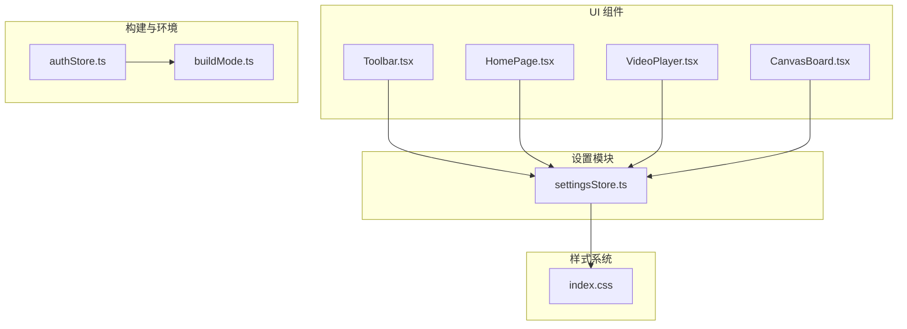
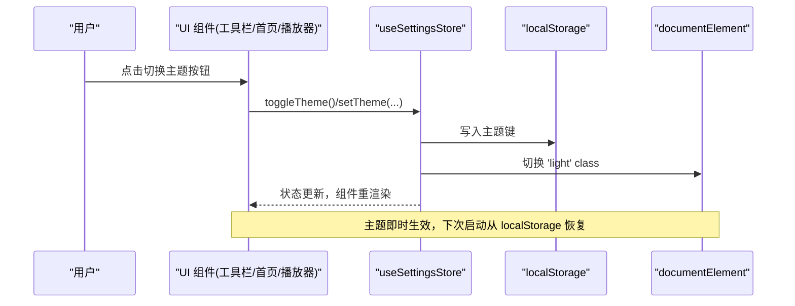
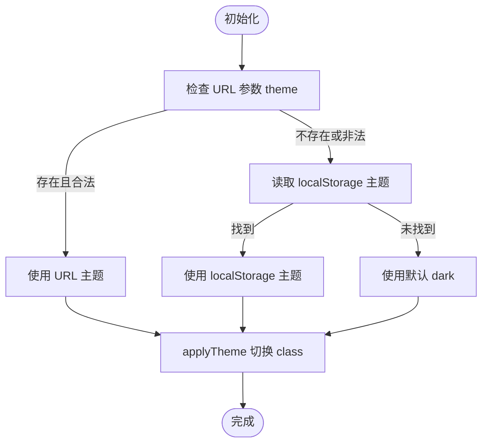
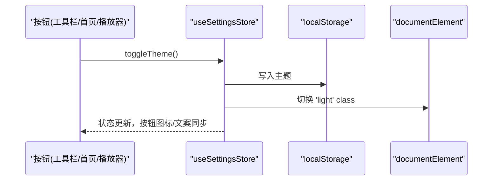
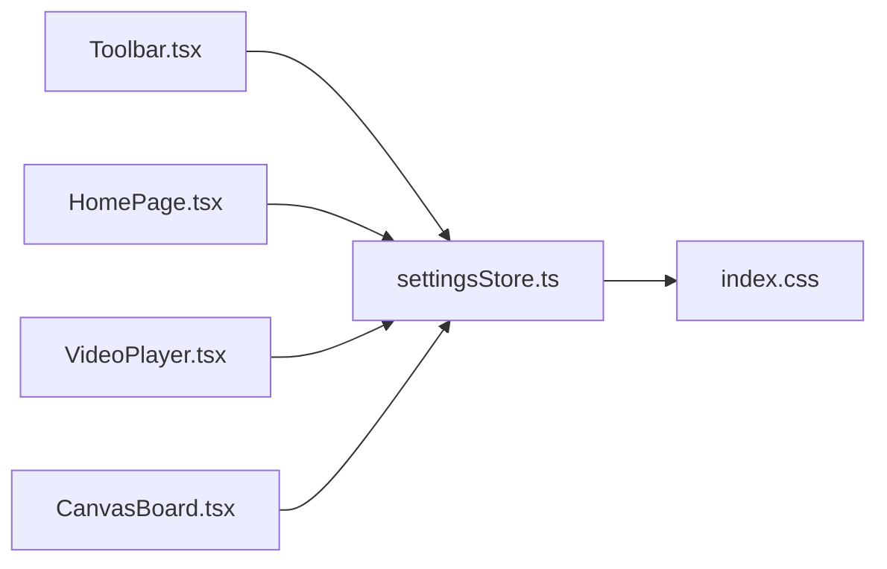

# 设置状态管理 API

<cite>
**本文引用的文件**
- [settingsStore.ts](file://src/store/settingsStore.ts)
- [Toolbar.tsx](file://src/components/Toolbar.tsx)
- [HomePage.tsx](file://src/components/HomePage.tsx)
- [VideoPlayer.tsx](file://src/components/VideoPlayer.tsx)
- [CanvasBoard.tsx](file://src/canvas/CanvasBoard.tsx)
- [index.css](file://src/index.css)
- [buildMode.ts](file://src/buildMode.ts)
- [authStore.ts](file://src/store/authStore.ts)
</cite>

## 目录
1. [简介](#简介)
2. [项目结构](#项目结构)
3. [核心组件](#核心组件)
4. [架构总览](#架构总览)
5. [详细组件分析](#详细组件分析)
6. [依赖关系分析](#依赖关系分析)
7. [性能与可扩展性](#性能与可扩展性)
8. [故障排查指南](#故障排查指南)
9. [结论](#结论)
10. [附录：API 参考](#附录api-参考)

## 简介
本文件为“设置状态管理 Store”的完整 API 文档，聚焦应用配置管理（主题、用户偏好等）、持久化存储与本地缓存机制、默认值与校验规则、动态加载与热更新、以及如何在应用中读取和应用设置。当前仓库已实现基于 Zustand 的设置 Store，主要能力包括主题切换、URL 参数覆盖、LocalStorage 持久化、以及通过 DOM class 实时生效。

## 项目结构
设置相关代码集中在 store 层，并通过 UI 组件订阅与触发变更；样式通过 CSS 变量在根节点上切换以即时生效。

图表来源
- [settingsStore.ts:1-39](file://src/store/settingsStore.ts#L1-L39)
- [Toolbar.tsx:112-113](file://src/components/Toolbar.tsx#L112-L113)
- [HomePage.tsx:424-425](file://src/components/HomePage.tsx#L424-L425)
- [VideoPlayer.tsx:74-75](file://src/components/VideoPlayer.tsx#L74-L75)
- [CanvasBoard.tsx:21,57:21-57](file://src/canvas/CanvasBoard.tsx#L21-L57)
- [index.css:25-108](file://src/index.css#L25-L108)
- [buildMode.ts:1-8](file://src/buildMode.ts#L1-L8)
- [authStore.ts:49-65](file://src/store/authStore.ts#L49-L65)

章节来源
- [settingsStore.ts:1-39](file://src/store/settingsStore.ts#L1-L39)
- [index.css:25-108](file://src/index.css#L25-L108)

## 核心组件
- 设置 Store（主题）
  - 状态字段：theme（dark | light）
  - 方法：setTheme(theme)、toggleTheme()
  - 副作用：写入 LocalStorage、切换 DOM class、立即渲染新主题
  - 初始化策略：优先 URL 参数 theme，其次 LocalStorage，最后默认 dark
- 应用入口与样式
  - 通过 document.documentElement.classList.toggle('light', ...) 切换主题类名
  - index.css 中 :root 与 html.light 定义两套 CSS 变量，实现无刷新换肤

章节来源
- [settingsStore.ts:7-39](file://src/store/settingsStore.ts#L7-L39)
- [index.css:25-108](file://src/index.css#L25-L108)

## 架构总览
设置 Store 提供单一事实源，UI 组件通过订阅获取主题并渲染；设置变更时同时写持久化与 DOM，保证跨会话一致性与即时反馈。

图表来源
- [settingsStore.ts:13-39](file://src/store/settingsStore.ts#L13-L39)
- [Toolbar.tsx:373-380](file://src/components/Toolbar.tsx#L373-L380)
- [index.css:74-108](file://src/index.css#L74-L108)

## 详细组件分析

### 设置 Store（主题）
- 职责
  - 维护全局主题状态
  - 将主题持久化到 LocalStorage
  - 通过 DOM class 切换主题
  - 支持 URL 参数覆盖初始主题
- 数据流
  - 初始化：解析 URL 参数 → 回退到 localStorage → 默认 dark
  - 变更：写入 localStorage → 切换 class → 更新状态
- 复杂度与性能
  - 单次操作 O(1)，仅读写一次 localStorage 与一次 DOM class 切换
  - 使用函数式 set 更新，避免不必要的重渲染
- 错误处理
  - 初始化阶段对 localStorage 访问进行 try/catch 保护，防止异常中断启动
- 扩展点
  - 可在此处增加更多设置项（如编辑器配置、字体大小等），复用同一持久化与副作用模式

图表来源
- [settingsStore.ts:16-27](file://src/store/settingsStore.ts#L16-L27)
- [settingsStore.ts:13-15](file://src/store/settingsStore.ts#L13-L15)

章节来源
- [settingsStore.ts:1-39](file://src/store/settingsStore.ts#L1-L39)

### 主题切换流程（组件调用）
- 工具栏、首页、视频播放器均通过 useSettingsStore 订阅主题并暴露切换方法
- 点击按钮触发 toggleTheme/setTheme，进而完成持久化与样式切换

图表来源
- [Toolbar.tsx:112-113,373-380:112-113](file://src/components/Toolbar.tsx#L112-L113)
- [HomePage.tsx:424-425](file://src/components/HomePage.tsx#L424-L425)
- [VideoPlayer.tsx:74-75](file://src/components/VideoPlayer.tsx#L74-L75)
- [settingsStore.ts:29-39](file://src/store/settingsStore.ts#L29-L39)

章节来源
- [Toolbar.tsx:112-113,373-380:112-113](file://src/components/Toolbar.tsx#L112-L113)
- [HomePage.tsx:424-425](file://src/components/HomePage.tsx#L424-L425)
- [VideoPlayer.tsx:74-75](file://src/components/VideoPlayer.tsx#L74-L75)

### 样式系统与主题变量
- 通过 CSS 变量定义暗色/亮色两套配色
- 在根元素添加/移除 .light 类即可整体切换主题，无需重新加载页面

章节来源
- [index.css:25-108](file://src/index.css#L25-L108)

### 构建模式与登录态对设置的影响
- 构建目标（局域网/在线）由 buildMode.ts 决定，影响认证流程与本地配置读取
- 认证 Store 在初始化时会读取本地访客标记与局域网配置，确保首次进入体验一致

章节来源
- [buildMode.ts:1-8](file://src/buildMode.ts#L1-L8)
- [authStore.ts:49-65](file://src/store/authStore.ts#L49-L65)

## 依赖关系分析
- 组件依赖设置 Store
  - Toolbar、HomePage、VideoPlayer、CanvasBoard 均导入并使用 useSettingsStore
- 设置 Store 依赖浏览器 API
  - window.location.search、localStorage、document.documentElement.classList
- 样式依赖 CSS 变量与根节点 class

图表来源
- [Toolbar.tsx:112-113](file://src/components/Toolbar.tsx#L112-L113)
- [HomePage.tsx:424-425](file://src/components/HomePage.tsx#L424-L425)
- [VideoPlayer.tsx:74-75](file://src/components/VideoPlayer.tsx#L74-L75)
- [CanvasBoard.tsx:21,57:21-57](file://src/canvas/CanvasBoard.tsx#L21-L57)
- [settingsStore.ts:1-39](file://src/store/settingsStore.ts#L1-L39)
- [index.css:25-108](file://src/index.css#L25-L108)

章节来源
- [settingsStore.ts:1-39](file://src/store/settingsStore.ts#L1-L39)
- [Toolbar.tsx:112-113](file://src/components/Toolbar.tsx#L112-L113)
- [HomePage.tsx:424-425](file://src/components/HomePage.tsx#L424-L425)
- [VideoPlayer.tsx:74-75](file://src/components/VideoPlayer.tsx#L74-L75)
- [CanvasBoard.tsx:21,57:21-57](file://src/canvas/CanvasBoard.tsx#L21-L57)
- [index.css:25-108](file://src/index.css#L25-L108)

## 性能与可扩展性
- 性能
  - 主题切换为 O(1) 操作，仅涉及一次 localStorage 写入与一次 DOM class 切换
  - 使用函数式更新，减少不必要重渲染
- 可扩展性
  - 可在 settingsStore 中新增其他设置项（如编辑器配置、字体大小、行高、对齐方式等），复用相同的持久化与副作用模式
  - 建议为每个设置项定义明确的默认值、校验规则与迁移策略
  - 可通过集中化的 applyXxx 函数统一应用副作用（如写入 CSS 变量、更新 DOM 属性等）

[本节为通用指导，不直接分析具体文件]

## 故障排查指南
- 主题不生效
  - 检查是否成功写入 localStorage 对应键
  - 检查根节点是否正确切换 .light class
  - 确认 CSS 变量覆盖逻辑未被其他样式覆盖
- 初始化失败
  - 若浏览器禁用 localStorage，初始化会捕获异常并回退到默认主题
  - 检查 URL 参数 theme 是否合法（仅接受 light/dark）
- 多标签页不一致
  - 当前实现未监听 storage 事件，多标签页切换需各自调用 setTheme/toggleTheme 才会同步
  - 如需跨标签同步，可在 setTheme 中 dispatch 自定义事件或在 storage 事件中监听

章节来源
- [settingsStore.ts:16-27](file://src/store/settingsStore.ts#L16-L27)
- [settingsStore.ts:29-39](file://src/store/settingsStore.ts#L29-L39)
- [index.css:74-108](file://src/index.css#L74-L108)

## 结论
当前设置状态管理以“主题”为核心，实现了简洁可靠的持久化与即时生效机制。建议在后续迭代中扩展至更全面的用户偏好与编辑器配置，保持统一的默认值、校验、持久化与应用策略，并考虑跨标签页同步与版本迁移方案，以提升用户体验与可维护性。

## 附录：API 参考
- 类型
  - Theme: 'dark' | 'light'
- 状态
  - theme: 当前主题
- 方法
  - setTheme(theme): 设置主题，持久化并立即应用
  - toggleTheme(): 切换主题（dark ↔ light）
- 副作用
  - applyTheme(theme): 切换根节点 class，驱动 CSS 变量主题
- 默认值与优先级
  - URL 参数 theme（light/dark）→ localStorage 中的主题 → 默认 dark
- 持久化键
  - suqcanvas:theme（localStorage）

章节来源
- [settingsStore.ts:3-11](file://src/store/settingsStore.ts#L3-L11)
- [settingsStore.ts:13-27](file://src/store/settingsStore.ts#L13-L27)
- [settingsStore.ts:29-39](file://src/store/settingsStore.ts#L29-L39)