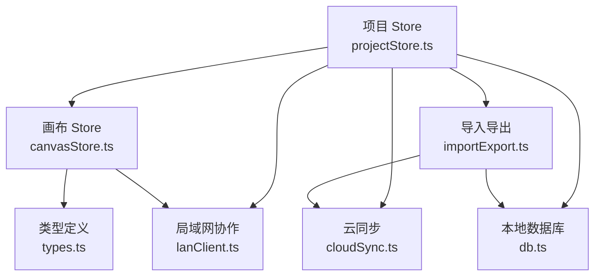
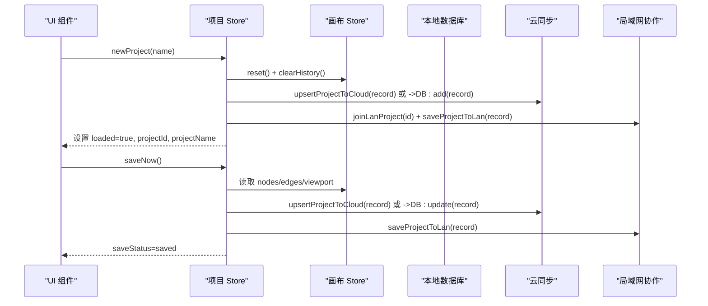
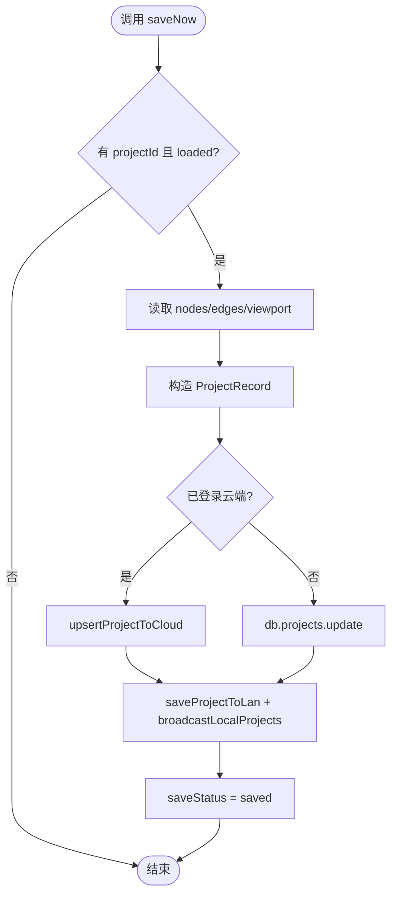
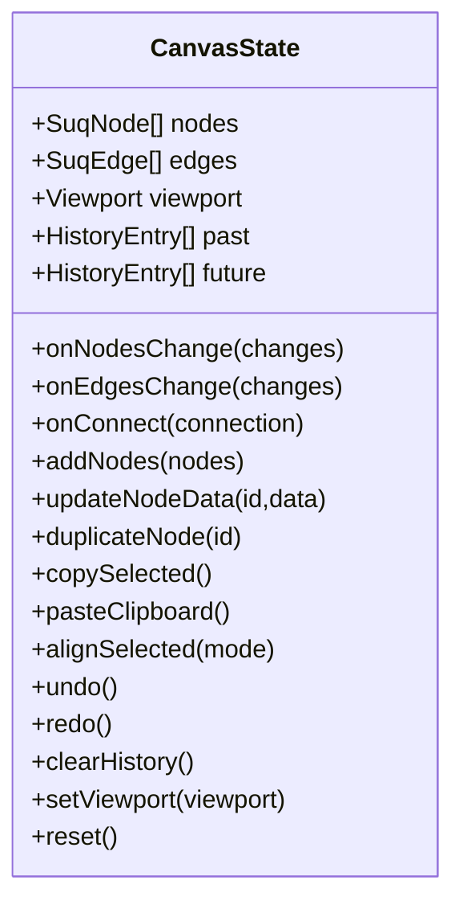
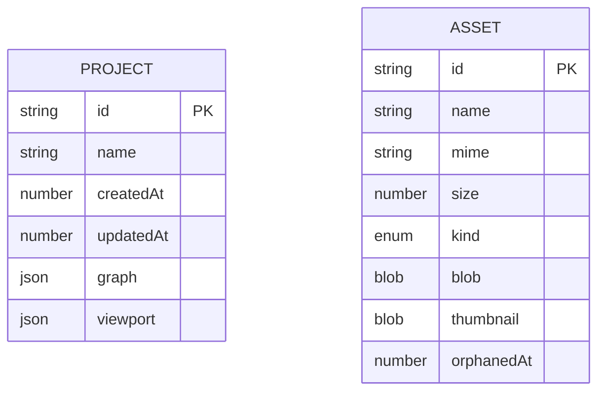
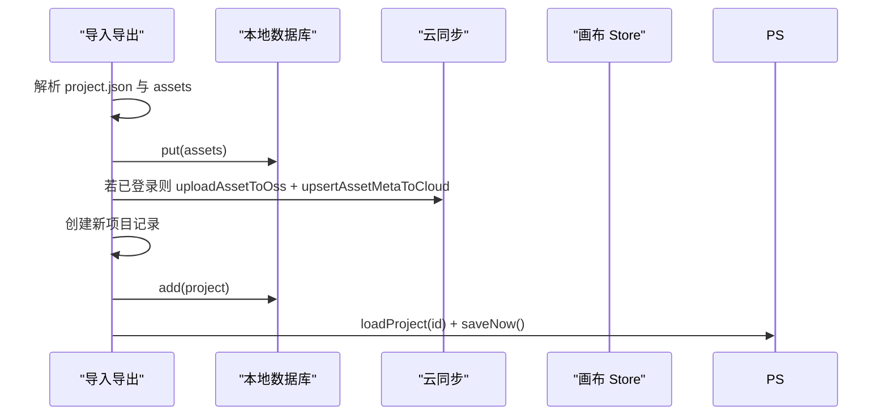
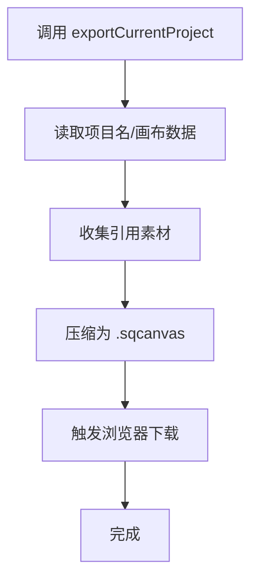
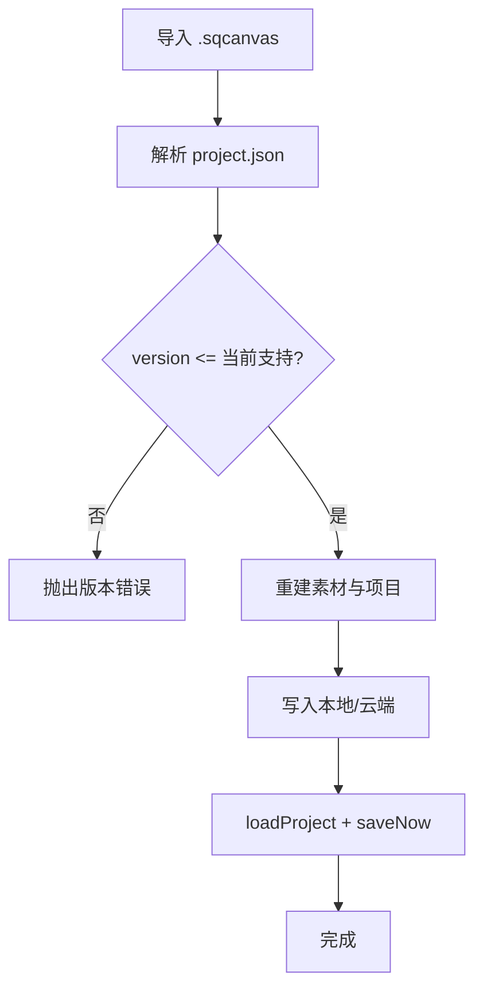
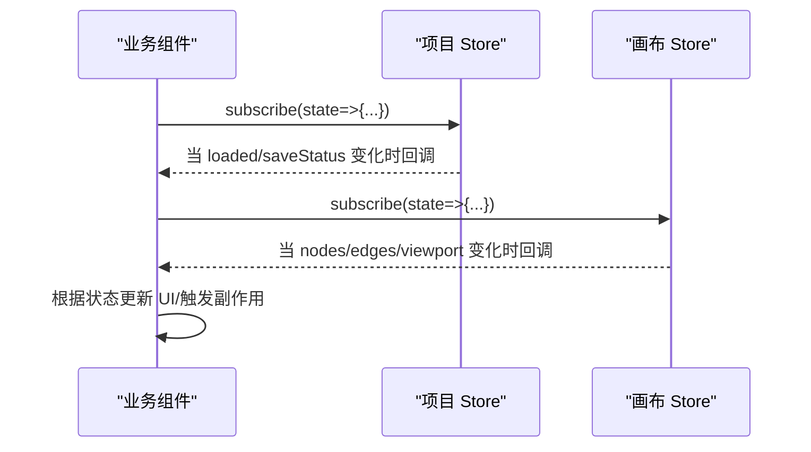
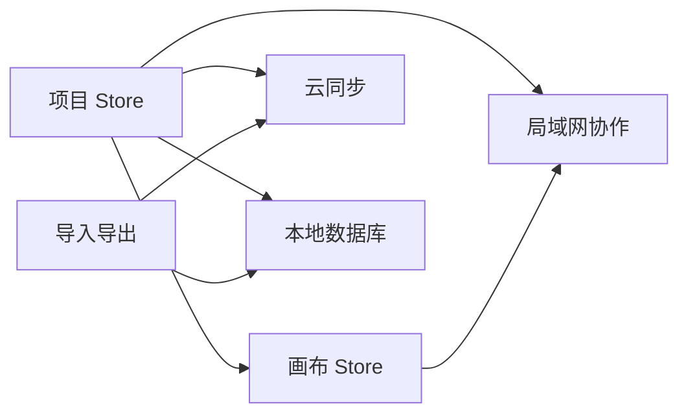

# 项目状态管理 API

<cite>
**本文引用的文件**
- [src/store/projectStore.ts](file://src/store/projectStore.ts)
- [src/store/canvasStore.ts](file://src/store/canvasStore.ts)
- [src/io/importExport.ts](file://src/io/importExport.ts)
- [src/types.ts](file://src/types.ts)
- [src/db/db.ts](file://src/db/db.ts)
- [src/sync/cloudSync.ts](file://src/sync/cloudSync.ts)
- [src/sync/lanClient.ts](file://src/sync/lanClient.ts)
- [src/media/managedFile.ts](file://src/media/managedFile.ts)
</cite>

## 目录
1. [简介](#简介)
2. [项目结构](#项目结构)
3. [核心组件](#核心组件)
4. [架构总览](#架构总览)
5. [详细组件分析](#详细组件分析)
6. [依赖关系分析](#依赖关系分析)
7. [性能考量](#性能考量)
8. [故障排查指南](#故障排查指南)
9. [结论](#结论)
10. [附录](#附录)

## 简介
本 API 文档聚焦于“项目状态管理 Store”，覆盖项目生命周期（创建、保存、加载、重命名）、数据结构与存储策略、项目与素材的关联管理、导入导出能力、版本兼容与冲突解决机制，以及在组件中订阅项目状态变化和处理项目事件的最佳实践。该模块基于 Zustand 构建，结合本地 IndexedDB、云端 Supabase 与局域网协作通道，提供一致且可扩展的项目数据管理能力。

## 项目结构
围绕项目状态管理的代码主要分布在以下模块：
- 项目 Store：负责项目级状态与持久化（创建、加载、保存、重命名）
- 画布 Store：维护节点、连线、视口与撤销历史
- 类型定义：统一节点、边、样式等数据结构
- 数据库层：IndexedDB 表结构与资源清理
- 云同步：Supabase 项目与素材元数据同步
- 局域网协作：WebSocket 实时同步、删除传播、备份恢复
- 导入导出：将项目与引用素材打包为 .sqcanvas 并支持反向导入

图表来源
- [src/store/projectStore.ts:1-229](file://src/store/projectStore.ts#L1-L229)
- [src/store/canvasStore.ts:1-399](file://src/store/canvasStore.ts#L1-L399)
- [src/sync/cloudSync.ts:1-165](file://src/sync/cloudSync.ts#L1-L165)
- [src/sync/lanClient.ts:1-800](file://src/sync/lanClient.ts#L1-L800)
- [src/db/db.ts:1-69](file://src/db/db.ts#L1-L69)
- [src/io/importExport.ts:1-203](file://src/io/importExport.ts#L1-L203)
- [src/types.ts:1-112](file://src/types.ts#L1-L112)

章节来源
- [src/store/projectStore.ts:1-229](file://src/store/projectStore.ts#L1-L229)
- [src/store/canvasStore.ts:1-399](file://src/store/canvasStore.ts#L1-L399)
- [src/io/importExport.ts:1-203](file://src/io/importExport.ts#L1-L203)
- [src/types.ts:1-112](file://src/types.ts#L1-L112)
- [src/db/db.ts:1-69](file://src/db/db.ts#L1-L69)
- [src/sync/cloudSync.ts:1-165](file://src/sync/cloudSync.ts#L1-L165)
- [src/sync/lanClient.ts:1-800](file://src/sync/lanClient.ts#L1-L800)

## 核心组件
- 项目 Store（projectStore.ts）
  - 暴露状态：projectId、projectName、loaded、initialized、saveStatus、busy
  - 方法：init、loadProject、newProject、renameProject、saveNow
  - 自动保存：监听画布变更，延迟触发保存
- 画布 Store（canvasStore.ts）
  - 状态：nodes、edges、viewport、past/future（撤销栈）、clipboard
  - 方法：onNodesChange、onEdgesChange、onConnect、addNodes、updateNodeData、duplicateNode、copySelected/pasteClipboard、alignSelected、undo/redo、clearHistory、reset、setViewport
  - 插入元信息：记录创建者、时间戳
- 类型定义（types.ts）
  - SuqNode/SuqEdge、媒体类型、边样式、标题级别等
- 数据库（db.ts）
  - Dexie 表：assets、projects；资源回收 GC
- 云同步（cloudSync.ts）
  - 项目与素材元数据的 upsert、查询、删除；按登录态选择本地或云端
- 局域网协作（lanClient.ts）
  - 连接、加入房间、画布同步、删除传播、活动广播、备份恢复
- 导入导出（importExport.ts）
  - 导出为 .sqcanvas（含 project.json 与 assets），导入时校验格式/版本并重建本地/云端数据

章节来源
- [src/store/projectStore.ts:1-229](file://src/store/projectStore.ts#L1-L229)
- [src/store/canvasStore.ts:1-399](file://src/store/canvasStore.ts#L1-L399)
- [src/types.ts:1-112](file://src/types.ts#L1-L112)
- [src/db/db.ts:1-69](file://src/db/db.ts#L1-L69)
- [src/sync/cloudSync.ts:1-165](file://src/sync/cloudSync.ts#L1-L165)
- [src/sync/lanClient.ts:1-800](file://src/sync/lanClient.ts#L1-L800)
- [src/io/importExport.ts:1-203](file://src/io/importExport.ts#L1-L203)

## 架构总览
项目状态管理以“项目 Store”为中心，协调“画布 Store”、“本地数据库”、“云端同步”和“局域网协作”。根据是否已登录云端账号，决定数据落盘位置（本地或云端）。导入导出通过压缩包实现跨设备迁移，并在导入时进行版本校验与资源重建。

图表来源
- [src/store/projectStore.ts:149-229](file://src/store/projectStore.ts#L149-L229)
- [src/store/canvasStore.ts:392-398](file://src/store/canvasStore.ts#L392-L398)
- [src/sync/cloudSync.ts:121-131](file://src/sync/cloudSync.ts#L121-L131)
- [src/sync/lanClient.ts:767-776](file://src/sync/lanClient.ts#L767-L776)

## 详细组件分析

### 项目 Store API 与生命周期
- 初始化 init
  - 同步项目列表（登录态仅云端，未登录仅本地），加载最新项目到画布，安装自动保存监听
- 新建项目 newProject
  - 清空画布与历史，生成 id 与初始 graph/viewport，写入本地或云端，加入局域网房间并广播
- 加载项目 loadProject
  - 优先从最佳源（云端/本地）拉取，替换画布数据并清理历史，加入局域网房间
- 保存 saveNow
  - 收集当前画布数据，更新 updatedAt，写入本地或云端，推送局域网，更新保存状态
- 重命名 renameProject
  - 云端/本地分别更新名称，若当前项目则更新本地显示名，广播项目列表

图表来源
- [src/store/projectStore.ts:196-229](file://src/store/projectStore.ts#L196-L229)
- [src/sync/cloudSync.ts:121-131](file://src/sync/cloudSync.ts#L121-L131)
- [src/sync/lanClient.ts:767-776](file://src/sync/lanClient.ts#L767-L776)

章节来源
- [src/store/projectStore.ts:81-229](file://src/store/projectStore.ts#L81-L229)

### 画布 Store 与撤销历史
- 节点/边变更处理：对 remove 操作立即落历史快照，其他变更防抖合并后入栈
- 复制粘贴：深拷贝选中节点，重新映射 id 与连线，保持相对偏移
- 对齐与层级：计算边界或间距，批量更新 position/zIndex
- 撤销/重做：限制历史长度，切换 past/future 栈
- 视口与重置：独立状态，不影响图数据

图表来源
- [src/store/canvasStore.ts:33-59](file://src/store/canvasStore.ts#L33-L59)
- [src/store/canvasStore.ts:118-399](file://src/store/canvasStore.ts#L118-L399)

章节来源
- [src/store/canvasStore.ts:66-107](file://src/store/canvasStore.ts#L66-L107)
- [src/store/canvasStore.ts:126-399](file://src/store/canvasStore.ts#L126-L399)

### 项目数据结构与存储策略
- 项目记录 ProjectRecord
  - 字段：id、name、createdAt、updatedAt、graph（nodes/edges）、viewport
- 素材记录 AssetRecord
  - 字段：id、name、mime、size、kind、blob、thumbnail、orphanedAt
- 存储策略
  - 未登录：仅本地 IndexedDB
  - 已登录：仅云端 Supabase
  - 局域网：作为协作通道，不替代主存储
- 资源回收 GC
  - 扫描所有项目引用的 assetId，标记孤立资源，超过保留期后删除

图表来源
- [src/db/db.ts:5-28](file://src/db/db.ts#L5-L28)
- [src/db/db.ts:48-69](file://src/db/db.ts#L48-L69)

章节来源
- [src/db/db.ts:16-33](file://src/db/db.ts#L16-L33)
- [src/db/db.ts:48-69](file://src/db/db.ts#L48-L69)

### 项目与素材的关联关系管理
- 节点数据中的 assetId/coverAssetId 指向素材
- 导出时收集所有被引用的素材，打包进 .sqcanvas
- 导入时重建本地素材库，并根据登录态上传至云端 OSS 并更新元数据
- 删除素材时，移除与之关联的节点及连线，保证一致性

图表来源
- [src/io/importExport.ts:111-203](file://src/io/importExport.ts#L111-L203)
- [src/sync/cloudSync.ts:29-50](file://src/sync/cloudSync.ts#L29-L50)
- [src/store/projectStore.ts:119-147](file://src/store/projectStore.ts#L119-L147)

章节来源
- [src/io/importExport.ts:35-109](file://src/io/importExport.ts#L35-L109)
- [src/io/importExport.ts:111-203](file://src/io/importExport.ts#L111-L203)
- [src/media/managedFile.ts:17-39](file://src/media/managedFile.ts#L17-L39)

### 导入导出 API 使用方法
- 导出
  - 入口：exportCurrentProject()
  - 行为：收集当前项目名称、nodes/edges/viewport，提取引用素材，打包为 .sqcanvas 并下载
- 导入
  - 入口：importProjectFile(file)
  - 行为：解压 zip，校验 format/version，重建素材与项目，根据登录态写入本地或云端，加载并保存

图表来源
- [src/io/importExport.ts:96-109](file://src/io/importExport.ts#L96-L109)
- [src/io/importExport.ts:35-78](file://src/io/importExport.ts#L35-L78)

章节来源
- [src/io/importExport.ts:96-109](file://src/io/importExport.ts#L96-L109)
- [src/io/importExport.ts:111-203](file://src/io/importExport.ts#L111-L203)

### 版本管理与冲突解决机制
- 版本管理
  - 导出 JSON 包含 format 与 version，导入时校验版本，拒绝高于当前支持的版本
- 冲突解决
  - 云端：按 updatedAt 比较，较新的覆盖旧的；未登录时仅本地
  - 局域网：采用“并集合并 + 显式删除传播”的策略，避免晚到旧快照复活已删除项；使用墓碑窗口防止误恢复
  - 画布撤销：本地历史栈限制长度，避免内存膨胀

图表来源
- [src/io/importExport.ts:120-131](file://src/io/importExport.ts#L120-L131)
- [src/sync/cloudSync.ts:148-164](file://src/sync/cloudSync.ts#L148-L164)
- [src/sync/lanClient.ts:527-598](file://src/sync/lanClient.ts#L527-L598)

章节来源
- [src/io/importExport.ts:120-131](file://src/io/importExport.ts#L120-L131)
- [src/sync/cloudSync.ts:148-164](file://src/sync/cloudSync.ts#L148-L164)
- [src/sync/lanClient.ts:527-598](file://src/sync/lanClient.ts#L527-L598)

### 在组件中订阅项目状态变化与处理事件
- 订阅项目状态
  - 使用 useProjectStore.getState() 读取当前项目状态（如 loaded、saveStatus）
  - 使用 useProjectStore.subscribe((state, prev) => {...}) 监听变更，例如在保存失败时提示用户
- 订阅画布状态
  - 使用 useCanvasStore.subscribe 监听 nodes/edges/viewport 变化，用于协同广播、活动统计等
- 处理项目事件
  - 局域网活动：通过 lanStore.activities 展示最近操作
  - 云端/本地保存状态：根据 saveStatus 更新 UI（idle/saving/saved/error）

图表来源
- [src/store/projectStore.ts:46-67](file://src/store/projectStore.ts#L46-L67)
- [src/store/canvasStore.ts:118-145](file://src/store/canvasStore.ts#L118-L145)

章节来源
- [src/store/projectStore.ts:46-67](file://src/store/projectStore.ts#L46-L67)
- [src/store/canvasStore.ts:118-145](file://src/store/canvasStore.ts#L118-L145)

## 依赖关系分析
- 项目 Store 依赖
  - 画布 Store：读取/写入节点、边、视口
  - 云同步：upsert/update/delete 项目与素材元数据
  - 局域网协作：加入房间、保存与广播项目
  - 本地数据库：未登录时的持久化
- 导入导出依赖
  - 类型定义：确保节点/边结构一致
  - 数据库：读写素材与项目
  - 云同步：登录态下上传素材与元数据
- 局域网协作依赖
  - 画布 Store：订阅变更，广播 sync/activity/viewport
  - 项目 Store：加载/保存项目，更新状态

图表来源
- [src/store/projectStore.ts:1-229](file://src/store/projectStore.ts#L1-L229)
- [src/io/importExport.ts:1-203](file://src/io/importExport.ts#L1-L203)
- [src/sync/cloudSync.ts:1-165](file://src/sync/cloudSync.ts#L1-L165)
- [src/sync/lanClient.ts:1-800](file://src/sync/lanClient.ts#L1-L800)
- [src/db/db.ts:1-69](file://src/db/db.ts#L1-L69)

章节来源
- [src/store/projectStore.ts:1-229](file://src/store/projectStore.ts#L1-L229)
- [src/io/importExport.ts:1-203](file://src/io/importExport.ts#L1-L203)
- [src/sync/cloudSync.ts:1-165](file://src/sync/cloudSync.ts#L1-L165)
- [src/sync/lanClient.ts:1-800](file://src/sync/lanClient.ts#L1-L800)
- [src/db/db.ts:1-69](file://src/db/db.ts#L1-L69)

## 性能考量
- 自动保存节流：画布变更后 500ms 触发保存，避免频繁 IO
- 历史快照防抖：撤销历史入栈 400ms 合并，限制最大条目数 50
- 局域网同步：节点/边变更 150ms 合并广播，视口 100ms 广播，减少网络负载
- 删除传播：显式 sync-del 消息配合墓碑窗口，避免晚到快照导致的数据复活
- 资源回收：定期扫描孤立素材，超过 24 小时保留期后删除，控制存储空间

[本节为通用性能建议，无需具体文件引用]

## 故障排查指南
- 打开项目失败
  - 检查 loadProjectBest 返回是否为空，确认云端/本地是否存在对应项目
  - 查看 toast 提示与控制台错误日志
- 保存失败
  - 检查 isCloudAuthed 与 supabase 配置
  - 关注 saveStatus 变为 error 的情况，定位网络或权限问题
- 导入失败
  - 校验 .sqcanvas 是否损坏、format/version 是否匹配
  - 素材缺失会导致导入不完整，检查 assets 目录是否存在
- 局域网协作异常
  - 检查 WebSocket 连接状态与中继地址
  - 关注 sync-del 与 sync 消息是否正确广播与接收
  - 断线重连逻辑会自动尝试，必要时手动断开重连

章节来源
- [src/store/projectStore.ts:119-147](file://src/store/projectStore.ts#L119-L147)
- [src/store/projectStore.ts:196-229](file://src/store/projectStore.ts#L196-L229)
- [src/io/importExport.ts:111-131](file://src/io/importExport.ts#L111-L131)
- [src/sync/lanClient.ts:352-642](file://src/sync/lanClient.ts#L352-L642)

## 结论
项目状态管理 Store 通过清晰的职责划分与多端存储策略，实现了稳定可靠的项目生命周期管理。结合画布 Store 的撤销历史、局域网协作的并发安全与导入导出的可移植性，系统能够在不同环境下保持一致的用户体验。建议在组件中合理使用订阅机制，及时响应状态变化，并通过版本校验与冲突解决机制保障数据一致性。

[本节为总结性内容，无需具体文件引用]

## 附录
- 关键类型参考
  - SuqNode/SuqEdge：节点与边的统一结构
  - MediaKind：媒体类型枚举
  - EdgeStyle：连线样式配置
- 常用 API 路径
  - 项目：useProjectStore 的 init/loadProject/newProject/renameProject/saveNow
  - 画布：useCanvasStore 的 onNodesChange/onEdgesChange/addNodes/undo/redo/reset
  - 导入导出：exportCurrentProject/importProjectFile
  - 云同步：upsertProjectToCloud/fetchCloudProjects/loadProjectBest
  - 局域网：joinLanProject/broadcastLocalProjects/initLanSync

章节来源
- [src/types.ts:1-112](file://src/types.ts#L1-L112)
- [src/store/projectStore.ts:21-34](file://src/store/projectStore.ts#L21-L34)
- [src/store/canvasStore.ts:33-59](file://src/store/canvasStore.ts#L33-L59)
- [src/io/importExport.ts:96-203](file://src/io/importExport.ts#L96-L203)
- [src/sync/cloudSync.ts:101-164](file://src/sync/cloudSync.ts#L101-L164)
- [src/sync/lanClient.ts:718-800](file://src/sync/lanClient.ts#L718-L800)