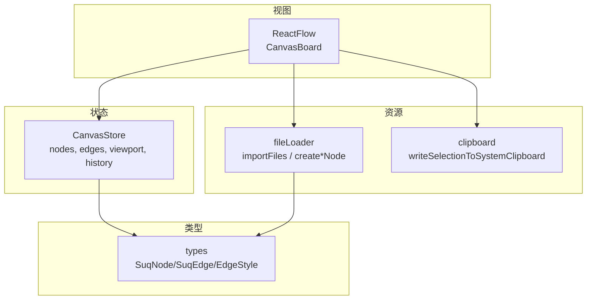
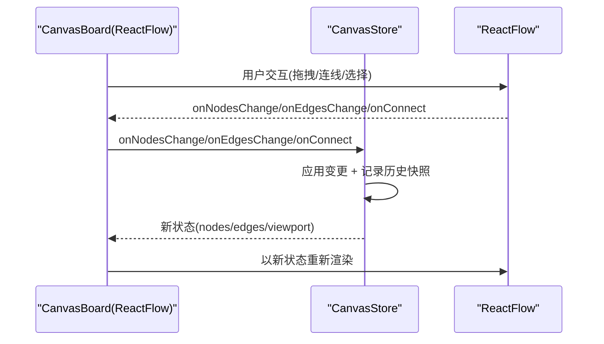
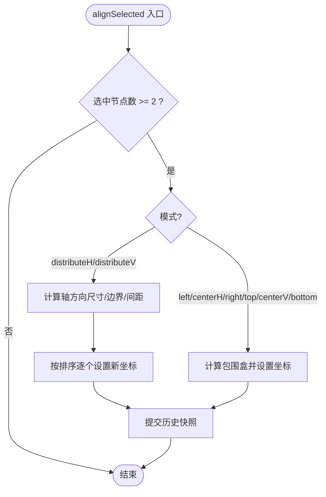
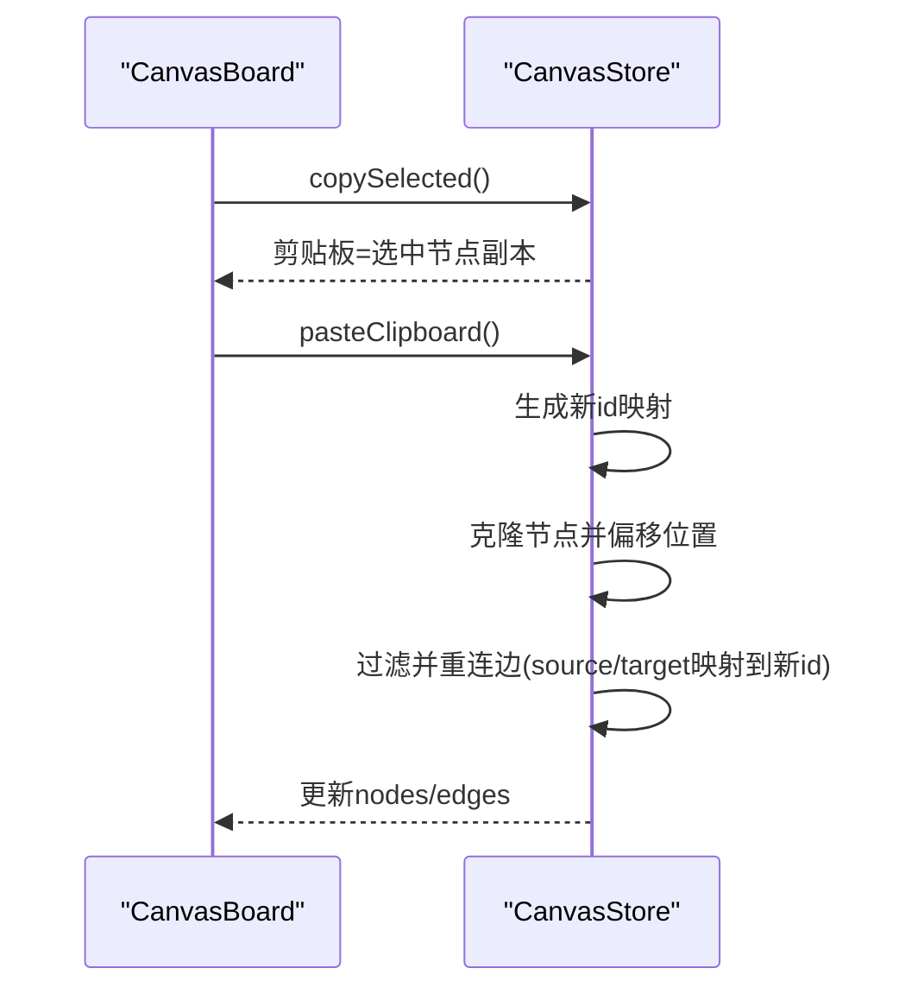
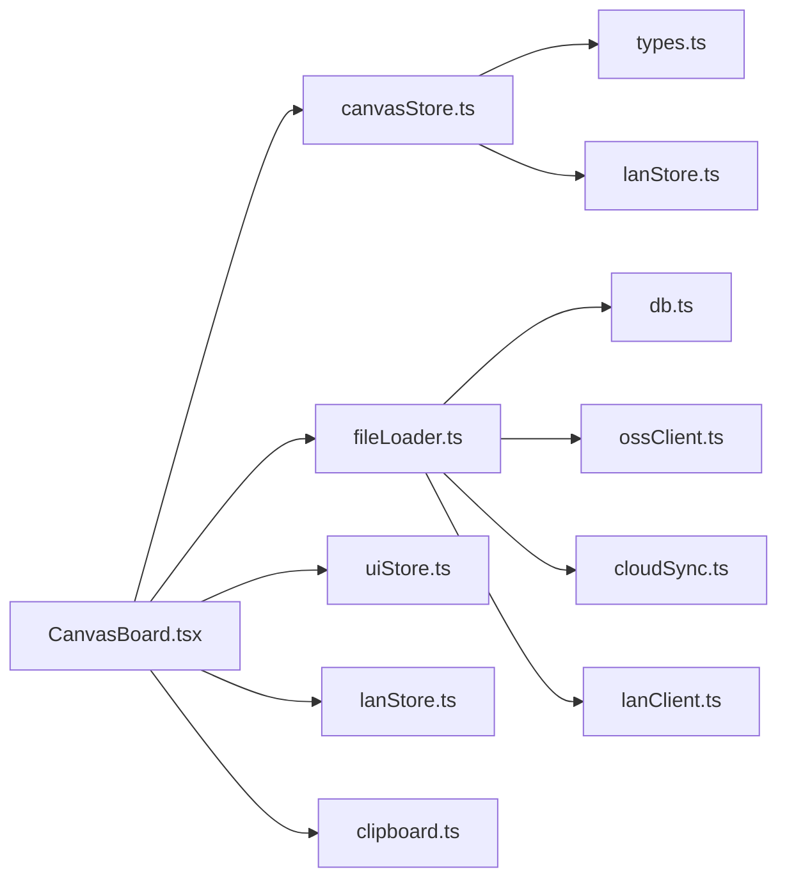

# 画布 API

<cite>
**本文引用的文件**
- [src/store/canvasStore.ts](file://src/store/canvasStore.ts)
- [src/store/canvasStore.test.ts](file://src/store/canvasStore.test.ts)
- [src/types.ts](file://src/types.ts)
- [src/canvas/CanvasBoard.tsx](file://src/canvas/CanvasBoard.tsx)
- [src/io/fileLoader.ts](file://src/io/fileLoader.ts)
- [src/canvas/clipboard.ts](file://src/canvas/clipboard.ts)
</cite>

## 目录
1. [简介](#简介)
2. [项目结构](#项目结构)
3. [核心组件](#核心组件)
4. [架构总览](#架构总览)
5. [详细组件分析](#详细组件分析)
6. [依赖分析](#依赖分析)
7. [性能考虑](#性能考虑)
8. [故障排查指南](#故障排查指南)
9. [结论](#结论)
10. [附录：API 参考与使用示例](#附录api-参考与使用示例)

## 简介
本文件为画布 API 的权威文档，聚焦于 CanvasStore 提供的全部方法，覆盖节点操作（添加、删除、更新、复制、对齐、层级）、边操作（连接、数据更新）、视图操作（缩放、平移、适配）等。同时给出状态管理最佳实践、性能优化建议、常见操作模式与错误处理方案，以及与 ReactFlow 集成的注意事项。

## 项目结构
- 状态层：CanvasStore 基于 Zustand 实现，集中管理 nodes、edges、viewport、历史栈与剪贴板。
- 视图层：CanvasBoard 将 ReactFlow 事件与 CanvasStore 方法对接，并处理快捷键、工具模式、拖拽导入、视图同步等。
- 类型定义：types.ts 定义了 SuqNode、SuqEdge、EdgeStyle、MediaKind 等核心类型。
- 资源与导入：fileLoader.ts 负责素材入库、生成节点、云端/局域网同步。
- 剪贴板：clipboard.ts 提供系统剪贴板写入能力（图片/文本）。

图表来源
- [src/store/canvasStore.ts:118-399](file://src/store/canvasStore.ts#L118-L399)
- [src/canvas/CanvasBoard.tsx:41-423](file://src/canvas/CanvasBoard.tsx#L41-L423)
- [src/io/fileLoader.ts:186-297](file://src/io/fileLoader.ts#L186-L297)
- [src/canvas/clipboard.ts:114-132](file://src/canvas/clipboard.ts#L114-L132)
- [src/types.ts:66-112](file://src/types.ts#L66-L112)

章节来源
- [src/store/canvasStore.ts:118-399](file://src/store/canvasStore.ts#L118-L399)
- [src/canvas/CanvasBoard.tsx:41-423](file://src/canvas/CanvasBoard.tsx#L41-L423)
- [src/types.ts:66-112](file://src/types.ts#L66-L112)

## 核心组件
- CanvasStore：提供所有画布状态变更的原子方法，内置撤销/重做、防抖快照、插入元数据、对齐与分布、层级调整、资源批量删除、视图设置等。
- CanvasBoard：桥接 ReactFlow 事件到 CanvasStore，并处理快捷键、工具模式切换、拖拽导入、远端视口同步、右键菜单/面板联动等。
- fileLoader：统一导入文件、创建节点、上传/同步素材。
- clipboard：将选中内容写入系统剪贴板（图片/文本）。

章节来源
- [src/store/canvasStore.ts:118-399](file://src/store/canvasStore.ts#L118-L399)
- [src/canvas/CanvasBoard.tsx:41-423](file://src/canvas/CanvasBoard.tsx#L41-L423)
- [src/io/fileLoader.ts:186-297](file://src/io/fileLoader.ts#L186-L297)
- [src/canvas/clipboard.ts:114-132](file://src/canvas/clipboard.ts#L114-L132)

## 架构总览
CanvasStore 通过 Zustand 暴露 store 实例 useCanvasStore，CanvasBoard 订阅其状态并通过 onNodesChange/onEdgesChange/onConnect 等回调驱动 ReactFlow 渲染。视图变化（移动、缩放）通过 setViewport 持久化到 store，并与局域网远端视图同步。

图表来源
- [src/canvas/CanvasBoard.tsx:66-150](file://src/canvas/CanvasBoard.tsx#L66-L150)
- [src/store/canvasStore.ts:126-158](file://src/store/canvasStore.ts#L126-L158)

## 详细组件分析

### CanvasStore 方法与语义
以下方法均位于 CanvasStore 中，调用前请确保已通过 useCanvasStore.getState() 或 hooks 获取实例。

- 节点操作
  - addNodes(nodes)
    - 参数：SuqNode[]
    - 行为：批量添加节点；自动注入 createdById/createdByName/createdAt 元数据；触发历史快照
    - 返回值：void
    - 示例路径：[src/canvas/CanvasBoard.tsx:234-261](file://src/canvas/CanvasBoard.tsx#L234-L261)
  - duplicateNode(id)
    - 参数：string
    - 行为：克隆节点，偏移位置，重置 selected/dragging，注入元数据；触发历史快照
    - 返回值：void
    - 示例路径：[src/store/canvasStore.ts:192-204](file://src/store/canvasStore.ts#L192-L204)
  - updateNodeData(id, data)
    - 参数：id: string, data: Partial<SuqNode['data']>
    - 行为：合并更新节点 data；触发历史快照
    - 返回值：void
    - 示例路径：[src/store/canvasStore.ts:176-183](file://src/store/canvasStore.ts#L176-L183)
  - removeAssets(assetIds)
    - 参数：string[]
    - 行为：删除关联节点及与之相连的边；触发历史快照
    - 返回值：void
    - 示例路径：[src/store/canvasStore.ts:275-289](file://src/store/canvasStore.ts#L275-L289)
  - alignSelected(mode)
    - 参数：AlignMode（left/centerH/right/top/centerV/bottom/distributeH/distributeV）
    - 行为：对选中节点进行对齐或均匀分布；触发历史快照
    - 返回值：void
    - 示例路径：[src/store/canvasStore.ts:290-361](file://src/store/canvasStore.ts#L290-L361)
  - changeNodeLayer(id, mode)
    - 参数：id: string, mode: LayerMode（front/forward/backward/back）
    - 行为：调整节点层级顺序；触发历史快照
    - 返回值：void
    - 示例路径：[src/store/canvasStore.ts:247-265](file://src/store/canvasStore.ts#L247-L265)
  - setNodeZIndex(id, zIndex)
    - 参数：id: string, zIndex: number（限制在 0..9999 整数）
    - 行为：设置精确层级值；触发历史快照
    - 返回值：void
    - 示例路径：[src/store/canvasStore.ts:266-274](file://src/store/canvasStore.ts#L266-L274)

- 边操作
  - onConnect(connection)
    - 参数：Connection（来自 ReactFlow）
    - 行为：创建默认样式的边；触发历史快照
    - 返回值：void
    - 示例路径：[src/store/canvasStore.ts:146-158](file://src/store/canvasStore.ts#L146-L158)
  - addEdge(edge)
    - 参数：SuqEdge
    - 行为：直接添加边；触发历史快照
    - 返回值：void
    - 示例路径：[src/store/canvasStore.ts:172-175](file://src/store/canvasStore.ts#L172-L175)
  - updateEdgeData(id, data)
    - 参数：id: string, data: Partial<SuqEdge['data']>
    - 行为：合并更新边 data；触发历史快照
    - 返回值：void
    - 示例路径：[src/store/canvasStore.ts:184-191](file://src/store/canvasStore.ts#L184-L191)

- 视图操作
  - setViewport(viewport)
    - 参数：Viewport（x/y/zoom）
    - 行为：设置当前视图；用于持久化与远端同步
    - 返回值：void
    - 示例路径：[src/store/canvasStore.ts:392-394](file://src/store/canvasStore.ts#L392-L394)
  - reset()
    - 参数：无
    - 行为：清空 nodes/edges/viewport/clipboard
    - 返回值：void
    - 示例路径：[src/store/canvasStore.ts:395-397](file://src/store/canvasStore.ts#L395-L397)

- 历史与剪贴板
  - undo()/redo()
    - 行为：撤销/重做最近的历史快照
    - 示例路径：[src/store/canvasStore.ts:362-383](file://src/store/canvasStore.ts#L362-L383)
  - clearHistory()
    - 行为：清空历史栈与待提交快照
    - 示例路径：[src/store/canvasStore.ts:384-391](file://src/store/canvasStore.ts#L384-L391)
  - copySelected()
    - 行为：将选中的节点复制到内部剪贴板（深拷贝，清除 selected/dragging）
    - 示例路径：[src/store/canvasStore.ts:205-213](file://src/store/canvasStore.ts#L205-L213)
  - pasteClipboard()
    - 行为：粘贴剪贴板节点，重映射 id，偏移位置，保留选中态；同时复制两节点间的边并重连
    - 示例路径：[src/store/canvasStore.ts:214-246](file://src/store/canvasStore.ts#L214-L246)

- 事件处理器（供 ReactFlow 调用）
  - onNodesChange(changes)
    - 行为：应用节点变更；若包含删除则立即提交历史快照，否则延迟提交
    - 示例路径：[src/store/canvasStore.ts:126-135](file://src/store/canvasStore.ts#L126-L135)
  - onEdgesChange(changes)
    - 行为：应用边变更；同上历史策略
    - 示例路径：[src/store/canvasStore.ts:136-145](file://src/store/canvasStore.ts#L136-L145)

章节来源
- [src/store/canvasStore.ts:118-399](file://src/store/canvasStore.ts#L118-L399)
- [src/store/canvasStore.test.ts:21-148](file://src/store/canvasStore.test.ts#L21-L148)

### ReactFlow 集成要点
- 事件绑定
  - onNodesChange/onEdgesChange/onConnect：由 CanvasBoard 转发至 CanvasStore
  - onMoveEnd：将最终视图写入 store，便于持久化与远端同步
  - isValidConnection：禁止自环连线
  - deleteKeyCode：支持 Backspace/Delete 删除
  - connectionLineType/connectionLineStyle：贝塞尔连线样式
  - panOnDrag/nodesDraggable/elementsSelectable/nodesConnectable/connectOnClick：根据工具模式动态控制
  - selectionMode：Partial 多选
  - zoomOnScroll/zoomOnPinch：启用滚轮/捏合缩放
- 快捷键
  - Ctrl/Cmd+Z/Y：撤销/重做
  - Ctrl/Cmd+D：复制选中节点
  - Ctrl/Cmd+C/V：复制/粘贴选中节点
  - Ctrl/Cmd+A：全选
  - F：适配视图
  - V/C/H：选择/连线/拖动工具切换；空格临时进入拖动模式
- 视图同步
  - 本地视图变化通过 setViewport 写入 store
  - 监听局域网远端视图，平滑过渡到远端视图并回写本地 store
- 双击空白处：插入文本节点
- 拖拽导入：接收文件并调用 importFiles 创建节点
- 系统剪贴板：Ctrl/Cmd+C 时调用 writeSelectionToSystemClipboard

章节来源
- [src/canvas/CanvasBoard.tsx:66-193](file://src/canvas/CanvasBoard.tsx#L66-L193)
- [src/canvas/CanvasBoard.tsx:234-374](file://src/canvas/CanvasBoard.tsx#L234-L374)

### 数据流与算法流程

#### 对齐与分布算法

图表来源
- [src/store/canvasStore.ts:290-361](file://src/store/canvasStore.ts#L290-L361)

章节来源
- [src/store/canvasStore.ts:290-361](file://src/store/canvasStore.ts#L290-L361)

#### 复制粘贴流程（含边重连）

图表来源
- [src/store/canvasStore.ts:205-246](file://src/store/canvasStore.ts#L205-L246)

章节来源
- [src/store/canvasStore.ts:205-246](file://src/store/canvasStore.ts#L205-L246)

## 依赖分析
- CanvasStore 依赖：
  - @xyflow/react：类型与 applyNodeChanges/applyEdgeChanges
  - zustand：create store
  - types：SuqNode/SuqEdge/EdgeStyle/DEFAULT_EDGE_STYLE
  - lanStore：读取 selfId/name 用于插入元数据
- CanvasBoard 依赖：
  - ReactFlow 组件与 hooks
  - fileLoader：创建节点与导入文件
  - uiStore/settingsStore/lanStore/projectStore：工具模式、主题、协同编辑、项目上下文
- fileLoader 依赖：
  - db：素材存储
  - ossClient/cloudSync/lanClient：云端/局域网同步
  - media：缩略图/PSD预览
- clipboard 依赖：
  - db/blobRegistry：素材 Blob 获取
  - media：PSD 预览

图表来源
- [src/store/canvasStore.ts:1-116](file://src/store/canvasStore.ts#L1-L116)
- [src/canvas/CanvasBoard.tsx:1-36](file://src/canvas/CanvasBoard.tsx#L1-L36)
- [src/io/fileLoader.ts:1-18](file://src/io/fileLoader.ts#L1-L18)
- [src/canvas/clipboard.ts:1-5](file://src/canvas/clipboard.ts#L1-L5)

章节来源
- [src/store/canvasStore.ts:1-116](file://src/store/canvasStore.ts#L1-L116)
- [src/canvas/CanvasBoard.tsx:1-36](file://src/canvas/CanvasBoard.tsx#L1-L36)
- [src/io/fileLoader.ts:1-18](file://src/io/fileLoader.ts#L1-L18)
- [src/canvas/clipboard.ts:1-5](file://src/canvas/clipboard.ts#L1-L5)

## 性能考虑
- 历史快照防抖
  - 非删除类变更采用 scheduleSnapshot 延迟提交，减少频繁快照开销
  - 删除类变更立即 flushPending 并提交，保证撤销一致性
- 最小化重渲染
  - 使用 applyNodeChanges/applyEdgeChanges 增量更新数组，避免全量重建
- 视图同步节流
  - 远端视图切换使用短动画时长，降低视觉抖动
- 资源导入限流
  - 单文件最大体积限制，失败时降级提示
- 剪贴板图片转换
  - 大图转 PNG 时限制最大边长，避免内存峰值过高

章节来源
- [src/store/canvasStore.ts:66-107](file://src/store/canvasStore.ts#L66-L107)
- [src/io/fileLoader.ts:184-205](file://src/io/fileLoader.ts#L184-L205)
- [src/canvas/clipboard.ts:46-70](file://src/canvas/clipboard.ts#L46-L70)

## 故障排查指南
- 无法撤销/重做
  - 检查是否调用了 clearHistory 或多次重复相同操作导致去重
  - 确认 onNodesChange/onEdgesChange 是否正确传入 changes
- 复制粘贴后边未重连
  - 确认被复制的边两端节点均在选中集合内
  - 检查 pasteClipboard 生成的 id 映射是否完整
- 对齐无效
  - 至少需要两个选中节点；distributeH/V 需要至少三个节点
- 视图不同步
  - 检查 onMoveEnd 是否调用 setViewport
  - 检查局域网远端视图订阅逻辑是否生效
- 导入失败
  - 检查文件大小限制与网络权限；查看 toast 提示与控制台错误
- 系统剪贴板写入失败
  - 浏览器不支持 ClipboardItem 或安全上下文限制；已回退为文本复制

章节来源
- [src/store/canvasStore.ts:362-391](file://src/store/canvasStore.ts#L362-L391)
- [src/store/canvasStore.test.ts:35-92](file://src/store/canvasStore.test.ts#L35-L92)
- [src/canvas/CanvasBoard.tsx:336-374](file://src/canvas/CanvasBoard.tsx#L336-L374)
- [src/io/fileLoader.ts:184-205](file://src/io/fileLoader.ts#L184-L205)
- [src/canvas/clipboard.ts:90-132](file://src/canvas/clipboard.ts#L90-L132)

## 结论
CanvasStore 提供了完整的画布状态管理能力，结合 CanvasBoard 的 ReactFlow 集成，实现了高效的节点/边/视图操作与协作体验。通过历史快照防抖、增量更新、严格的类型约束与完善的错误处理，保证了大规模编辑场景下的稳定性与性能。

## 附录：API 参考与使用示例

### 类型速览
- SuqNode：扩展 Node，data 为 SuqNodeData，包含 kind、assetId、label、text、尺寸、样式、作者元数据等
- SuqEdge：扩展 Edge，data 为 SuqEdgeData，包含 style（lineStyle/pathType/arrow/stroke/strokeWidth）与 order
- EdgeStyle：边的样式配置对象
- MediaKind：节点媒体类型枚举（image/video/audio/pdf/psd/markdown/text/file/heading/sticky/shape）

章节来源
- [src/types.ts:66-112](file://src/types.ts#L66-L112)

### 常用操作模式
- 快速添加元素
  - 双击空白处：插入文本节点
  - 工具栏/自定义事件：添加标题、便签、形状
  - 拖拽文件：批量导入并创建对应节点
- 编辑与组织
  - 选择/多选：V 工具；按住空格临时拖动
  - 对齐与分布：alignSelected
  - 层级调整：changeNodeLayer/setNodeZIndex
  - 复制粘贴：copySelected/pasteClipboard（含边重连）
- 视图导航
  - 缩放/平移：鼠标滚轮/捏合/拖拽画布
  - 适配视图：F 键或 onView('fit')
  - 居中/复位：setCenter/reset
- 撤销/重做
  - Ctrl/Cmd+Z/Y 或 redo()

章节来源
- [src/canvas/CanvasBoard.tsx:113-193](file://src/canvas/CanvasBoard.tsx#L113-L193)
- [src/canvas/CanvasBoard.tsx:234-305](file://src/canvas/CanvasBoard.tsx#L234-L305)
- [src/store/canvasStore.ts:290-397](file://src/store/canvasStore.ts#L290-L397)

### 与 ReactFlow 集成的特殊注意事项
- 必须通过 onNodesChange/onEdgesChange 传递 changes，不要直接修改 nodes/edges
- 连线校验：isValidConnection 禁止自环；connectionRadius 可按工具模式调整
- 工具模式影响交互：panOnDrag/nodesDraggable/elementsSelectable/nodesConnectable/connectOnClick
- 视图同步：onMoveEnd 必须调用 setViewport；远端视图需平滑过渡
- 快捷键冲突：注意输入框/可编辑区域时的拦截与放行
- 主题与样式：colorMode 与背景点阵、迷你地图颜色需匹配主题

章节来源
- [src/canvas/CanvasBoard.tsx:336-374](file://src/canvas/CanvasBoard.tsx#L336-L374)

### 错误处理方案
- 导入失败：捕获异常并 toast 提示；超大文件跳过
- 云端/局域网同步失败：静默失败或提示；不影响主流程
- 剪贴板写入失败：回退为文本复制
- 资源删除：removeAssets 会级联删除相关边，确保一致性

章节来源
- [src/io/fileLoader.ts:184-205](file://src/io/fileLoader.ts#L184-L205)
- [src/canvas/clipboard.ts:90-132](file://src/canvas/clipboard.ts#L90-L132)
- [src/store/canvasStore.ts:275-289](file://src/store/canvasStore.ts#L275-L289)