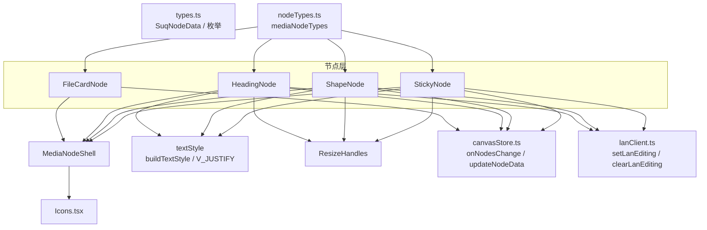
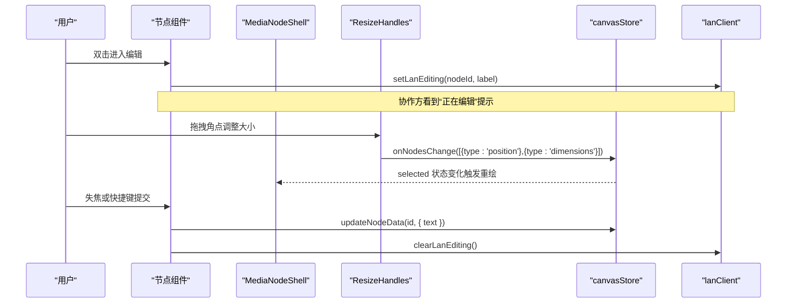
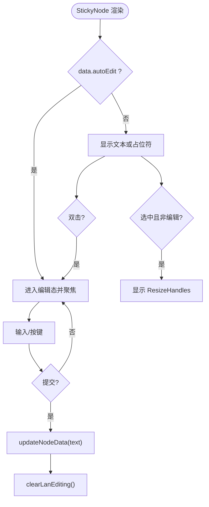
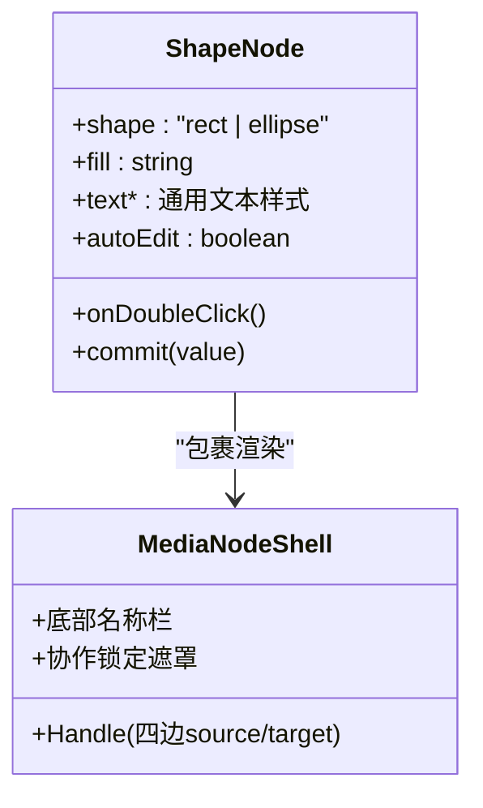
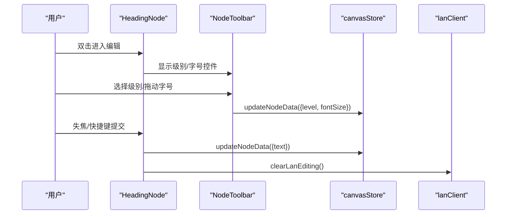
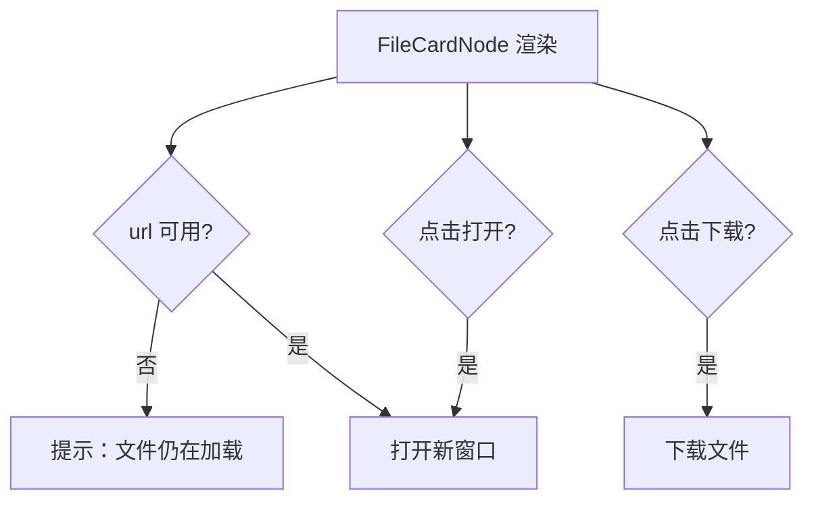
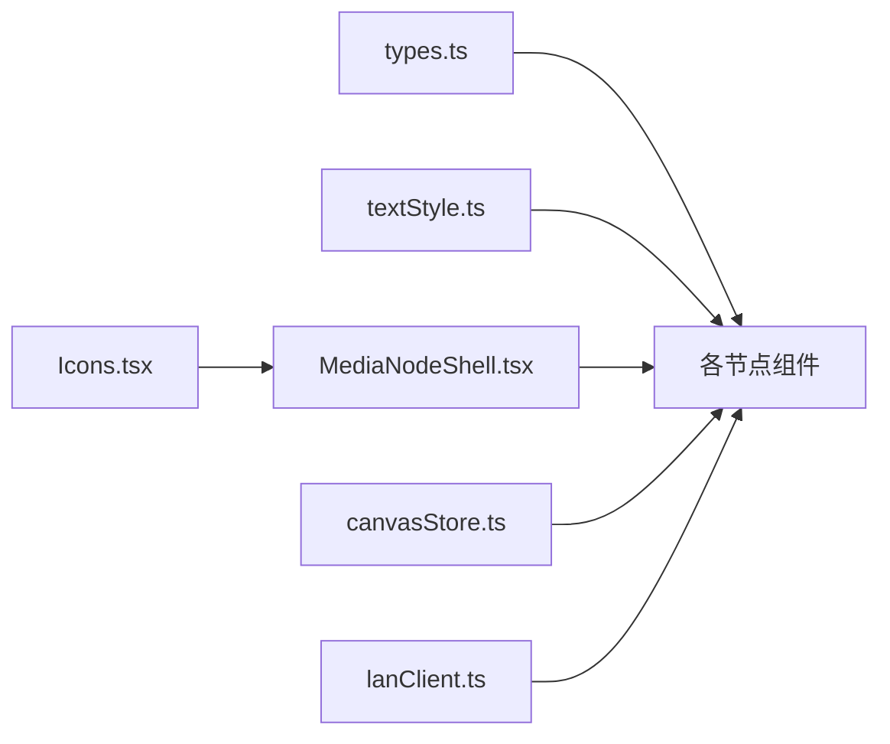

# UI 节点 API

<cite>
**本文引用的文件**
- [StickyNode.tsx](file://src/canvas/nodes/StickyNode.tsx)
- [ShapeNode.tsx](file://src/canvas/nodes/ShapeNode.tsx)
- [HeadingNode.tsx](file://src/canvas/nodes/HeadingNode.tsx)
- [FileCardNode.tsx](file://src/canvas/nodes/FileCardNode.tsx)
- [MediaNodeShell.tsx](file://src/canvas/nodes/MediaNodeShell.tsx)
- [ResizeHandles.tsx](file://src/canvas/nodes/ResizeHandles.tsx)
- [textStyle.ts](file://src/canvas/nodes/textStyle.ts)
- [nodeTypes.ts](file://src/canvas/nodes/nodeTypes.ts)
- [types.ts](file://src/types.ts)
- [canvasStore.ts](file://src/store/canvasStore.ts)
- [lanClient.ts](file://src/sync/lanClient.ts)
- [Icons.tsx](file://src/canvas/nodes/Icons.tsx)
</cite>

## 目录
1. [简介](#简介)
2. [项目结构](#项目结构)
3. [核心组件](#核心组件)
4. [架构总览](#架构总览)
5. [详细组件分析](#详细组件分析)
6. [依赖关系分析](#依赖关系分析)
7. [性能与布局](#性能与布局)
8. [故障排查](#故障排查)
9. [结论](#结论)
10. [附录：API 参考与示例](#附录api-参考与示例)

## 简介
本文档面向在画布中使用的 UI 元素节点，重点覆盖 StickyNode（便签）、ShapeNode（形状）、HeadingNode（标题）、FileCardNode（文件卡片）四类节点的属性、样式配置、交互行为与事件处理机制。同时说明这些节点如何基于 MediaNodeShell 统一外壳进行渲染、连线手柄、协作锁定、底部信息栏等通用能力；并解释 ResizeHandles 提供的拖拽调整大小实现。最后给出主题集成与样式定制建议，以及常用交互的 API 使用路径。

## 项目结构
- 节点实现位于 src/canvas/nodes，包含具体节点类型与公共外壳 MediaNodeShell、文本样式工具 textStyle、四角调整大小 ResizeHandles、图标 Icons。
- 节点类型注册在 nodeTypes.ts，将字符串类型映射到 React 组件。
- 数据模型与枚举定义在 types.ts，包括 SuqNodeData、媒体种类、对齐方式、颜色等。
- 状态管理通过 canvasStore.ts 提供 onNodesChange、updateNodeData 等方法。
- 协作编辑通过 lanClient.ts 暴露 setLanEditing/clearLanEditing 等接口。

图表来源
- [nodeTypes.ts:14-26](file://src/canvas/nodes/nodeTypes.ts#L14-L26)
- [StickyNode.tsx:1-85](file://src/canvas/nodes/StickyNode.tsx#L1-L85)
- [ShapeNode.tsx:1-86](file://src/canvas/nodes/ShapeNode.tsx#L1-L86)
- [HeadingNode.tsx:1-124](file://src/canvas/nodes/HeadingNode.tsx#L1-L124)
- [FileCardNode.tsx:1-80](file://src/canvas/nodes/FileCardNode.tsx#L1-L80)
- [MediaNodeShell.tsx:1-151](file://src/canvas/nodes/MediaNodeShell.tsx#L1-L151)
- [textStyle.ts:1-22](file://src/canvas/nodes/textStyle.ts#L1-L22)
- [ResizeHandles.tsx:1-118](file://src/canvas/nodes/ResizeHandles.tsx#L1-L118)
- [types.ts:1-112](file://src/types.ts#L1-L112)
- [canvasStore.ts:118-191](file://src/store/canvasStore.ts#L118-L191)
- [lanClient.ts:793-800](file://src/sync/lanClient.ts#L793-L800)

章节来源
- [nodeTypes.ts:14-26](file://src/canvas/nodes/nodeTypes.ts#L14-L26)

## 核心组件
- MediaNodeShell：所有节点的外壳，负责边框、阴影、选中态、四边连接手柄、协作锁定遮罩、底部名称栏、创建者角标、播放进度遮罩等。
- ResizeHandles：当节点被选中且未处于编辑态时显示四个角点，支持拖拽调整宽高与位置，最小尺寸限制。
- textStyle：统一的文本样式构建器与垂直对齐映射。
- 各节点组件：继承外壳能力，叠加自身业务逻辑（编辑、样式、交互）。

章节来源
- [MediaNodeShell.tsx:20-151](file://src/canvas/nodes/MediaNodeShell.tsx#L20-L151)
- [ResizeHandles.tsx:5-118](file://src/canvas/nodes/ResizeHandles.tsx#L5-L118)
- [textStyle.ts:4-22](file://src/canvas/nodes/textStyle.ts#L4-L22)

## 架构总览
节点通过 mediaNodeTypes 注册为 ReactFlow 节点类型，渲染时由 MediaNodeShell 提供统一容器与交互基础能力；文本样式由 textStyle 统一生成；编辑态通过 lanClient 广播协作状态；变更通过 canvasStore 更新节点数据与位置。

图表来源
- [StickyNode.tsx:17-41](file://src/canvas/nodes/StickyNode.tsx#L17-L41)
- [ShapeNode.tsx:17-41](file://src/canvas/nodes/ShapeNode.tsx#L17-L41)
- [HeadingNode.tsx:24-48](file://src/canvas/nodes/HeadingNode.tsx#L24-L48)
- [MediaNodeShell.tsx:40-67](file://src/canvas/nodes/MediaNodeShell.tsx#L40-L67)
- [ResizeHandles.tsx:45-103](file://src/canvas/nodes/ResizeHandles.tsx#L45-L103)
- [canvasStore.ts:126-183](file://src/store/canvasStore.ts#L126-L183)
- [lanClient.ts:793-800](file://src/sync/lanClient.ts#L793-L800)

## 详细组件分析

### StickyNode（便签）
- 数据字段
  - color：便签主题色，来自 STICKY_COLORS，影响背景与边框。
  - text：正文内容。
  - textAlignV：垂直对齐 top/middle/bottom。
  - autoEdit：首次插入自动进入编辑态。
  - 其他通用文本样式：fontSize、fontFamily、textColor、bold、italic、underline、lineHeight、textAlign。
- 样式
  - 背景色由 color 决定；文本样式由 buildTextStyle 生成；垂直对齐由 V_JUSTIFY 映射。
- 交互
  - 双击进入编辑；Enter+Ctrl/Cmd 或 Esc 提交；失焦提交。
  - 编辑时调用 setLanEditing 通知协作方；退出编辑调用 clearLanEditing。
  - 选中且非编辑态显示 ResizeHandles，支持拖拽调整大小。
- 事件与副作用
  - 自动编辑：若 data.autoEdit 为真则进入编辑并重置标志。
  - 文本变更通过 updateNodeData 持久化。

图表来源
- [StickyNode.tsx:17-82](file://src/canvas/nodes/StickyNode.tsx#L17-L82)
- [textStyle.ts:4-22](file://src/canvas/nodes/textStyle.ts#L4-L22)
- [lanClient.ts:793-800](file://src/sync/lanClient.ts#L793-L800)
- [canvasStore.ts:176-183](file://src/store/canvasStore.ts#L176-L183)

章节来源
- [StickyNode.tsx:1-85](file://src/canvas/nodes/StickyNode.tsx#L1-L85)
- [types.ts:26-35](file://src/types.ts#L26-L35)
- [textStyle.ts:4-22](file://src/canvas/nodes/textStyle.ts#L4-L22)

### ShapeNode（形状）
- 数据字段
  - shape：rect 或 ellipse，控制圆角与全圆角。
  - fill：填充色。
  - 文本相关字段同通用文本样式。
  - textAlignV：默认 middle。
  - autoEdit：首次插入自动进入编辑态。
- 样式
  - 根据 shape 切换圆角类名；fill 作为背景色；文本样式由 buildTextStyle 生成。
- 交互
  - 双击进入编辑；Enter+Ctrl/Cmd 或 Esc 提交；失焦提交。
  - 编辑时广播协作状态；退出编辑清除协作状态。
  - 选中且非编辑态显示 ResizeHandles。

图表来源
- [ShapeNode.tsx:10-83](file://src/canvas/nodes/ShapeNode.tsx#L10-L83)
- [MediaNodeShell.tsx:68-121](file://src/canvas/nodes/MediaNodeShell.tsx#L68-L121)

章节来源
- [ShapeNode.tsx:1-86](file://src/canvas/nodes/ShapeNode.tsx#L1-L86)
- [textStyle.ts:4-22](file://src/canvas/nodes/textStyle.ts#L4-L22)

### HeadingNode（标题）
- 数据字段
  - level：0/1/2/3，0 表示默认文本样式；1/2/3 对应不同字号与字重。
  - fontSize：可调节文字大小。
  - 文本相关字段同通用文本样式。
  - textAlignV：默认 top。
  - autoEdit：首次插入自动进入编辑态。
- 样式
  - 根据 level 应用预设样式；文本样式由 buildTextStyle 生成。
- 交互
  - 编辑时顶部出现 NodeToolbar，提供级别切换按钮与字体大小滑块。
  - 双击进入编辑；Enter+Ctrl/Cmd 或 Esc 提交；失焦提交。
  - 编辑时广播协作状态；退出编辑清除协作状态。
  - 选中且非编辑态显示 ResizeHandles。

图表来源
- [HeadingNode.tsx:17-121](file://src/canvas/nodes/HeadingNode.tsx#L17-L121)
- [canvasStore.ts:176-183](file://src/store/canvasStore.ts#L176-L183)
- [lanClient.ts:793-800](file://src/sync/lanClient.ts#L793-L800)

章节来源
- [HeadingNode.tsx:1-124](file://src/canvas/nodes/HeadingNode.tsx#L1-L124)
- [types.ts:16-22](file://src/types.ts#L16-L22)

### FileCardNode（文件卡片）
- 数据字段
  - assetId：资源 ID，用于获取 URL。
  - label：文件名。
  - fileSize：文件大小，用于展示。
- 样式
  - 固定布局：左侧图标区、中间文件名与大小、右侧操作按钮区。
- 交互
  - 双击卡片或点击打开按钮：在新窗口打开文件 URL（若尚未就绪则提示）。
  - 下载按钮：直接下载文件（若尚未就绪则阻止并提示）。
  - 无编辑态，不显示 ResizeHandles（除非外层容器需要）。

图表来源
- [FileCardNode.tsx:10-79](file://src/canvas/nodes/FileCardNode.tsx#L10-L79)

章节来源
- [FileCardNode.tsx:1-80](file://src/canvas/nodes/FileCardNode.tsx#L1-L80)

## 依赖关系分析
- 节点类型注册：mediaNodeTypes 将字符串键映射到组件，供 ReactFlow 渲染。
- 文本样式：buildTextStyle 聚合 SuqNodeData 中的文本相关字段，输出 CSSProperties。
- 协作编辑：Sticky/Shape/Heading 在编辑时调用 setLanEditing，退出时调用 clearLanEditing。
- 状态更新：所有文本与样式变更通过 updateNodeData 写入 store；拖拽调整大小通过 onNodesChange 更新 position 与 dimensions。
- 外壳能力：MediaNodeShell 提供 Handle（四边 source/target）、协作锁定遮罩、底部名称栏、创建者角标、进度遮罩等。

图表来源
- [types.ts:66-98](file://src/types.ts#L66-L98)
- [textStyle.ts:10-22](file://src/canvas/nodes/textStyle.ts#L10-L22)
- [MediaNodeShell.tsx:1-151](file://src/canvas/nodes/MediaNodeShell.tsx#L1-L151)
- [canvasStore.ts:118-191](file://src/store/canvasStore.ts#L118-L191)
- [lanClient.ts:793-800](file://src/sync/lanClient.ts#L793-L800)
- [Icons.tsx:633-657](file://src/canvas/nodes/Icons.tsx#L633-L657)

章节来源
- [nodeTypes.ts:14-26](file://src/canvas/nodes/nodeTypes.ts#L14-L26)

## 性能与布局
- 布局算法
  - 文本垂直对齐：通过 V_JUSTIFY 将 top/middle/bottom 映射为 flex 的 justify-content，保证多行文本在不同高度下的视觉一致。
  - 水平对齐：textAlign 由 buildTextStyle 直接设置。
  - 节点尺寸：ResizeHandles 维护最小宽度与高度，并在拖拽过程中同步更新 position 与 dimensions，避免过度计算。
- 响应式支持
  - 节点内部采用弹性布局与自适应换行，配合 Tailwind 类名在不同视口下保持可读性。
  - 外壳 MediaNodeShell 使用相对定位与百分比宽度，确保缩放与平移时的正确表现。
- 性能优化
  - memo 包裹节点组件减少重复渲染。
  - 协作编辑与视图同步通过防抖与批量合并降低网络压力。
  - 历史记录快照延迟写入，避免频繁重排。

[本节为通用指导，不直接分析具体文件]

## 故障排查
- 协作锁定不可编辑
  - 现象：节点上出现“某用户正在操作此元素”的遮罩，无法编辑。
  - 原因：MediaNodeShell 检测到远端编辑锁，拦截指针事件。
  - 解决：等待对方退出编辑，或检查局域网连接状态。
- 文件卡片无法打开/下载
  - 现象：点击打开或下载提示“文件仍在加载”。
  - 原因：资源 URL 尚未就绪。
  - 解决：稍后重试或检查资源是否已上传完成。
- 调整大小无效
  - 现象：拖拽角点无变化。
  - 原因：节点可能处于编辑态或未选中。
  - 解决：先退出编辑并选中节点后再调整。

章节来源
- [MediaNodeShell.tsx:40-67](file://src/canvas/nodes/MediaNodeShell.tsx#L40-L67)
- [FileCardNode.tsx:15-21](file://src/canvas/nodes/FileCardNode.tsx#L15-L21)
- [ResizeHandles.tsx:45-103](file://src/canvas/nodes/ResizeHandles.tsx#L45-L103)

## 结论
StickyNode、ShapeNode、HeadingNode、FileCardNode 均基于 MediaNodeShell 获得一致的边框、连线手柄、协作锁定与底部信息栏能力；文本样式通过 textStyle 统一管理；编辑态通过 lanClient 广播协作状态；变更通过 canvasStore 持久化。ResizeHandles 提供稳定的拖拽调整大小体验。整体设计解耦清晰，易于扩展与主题定制。

[本节为总结，不直接分析具体文件]

## 附录：API 参考与示例

### 节点属性与样式（SuqNodeData 关键子集）
- 通用文本
  - textAlign：left/center/right/justify
  - textAlignV：top/middle/bottom
  - fontSize：数字
  - fontFamily：字符串
  - textColor：颜色值
  - bold/italic/underline：布尔
  - lineHeight：数字
- 便签
  - color：yellow/green/blue/pink/purple/gray
- 形状
  - shape：rect/ellipse
  - fill：颜色值
- 标题
  - level：0/1/2/3
- 文件卡片
  - assetId：资源 ID
  - label：文件名
  - fileSize：字节数

章节来源
- [types.ts:66-98](file://src/types.ts#L66-L98)
- [types.ts:26-35](file://src/types.ts#L26-L35)

### 交互行为与事件
- 编辑模式
  - 双击进入编辑；Enter+Ctrl/Cmd 或 Esc 提交；失焦提交。
  - 编辑时调用 setLanEditing(nodeId, label)，退出时调用 clearLanEditing()。
- 调整大小
  - 选中且非编辑态显示 ResizeHandles；拖拽角点更新 position 与 dimensions。
- 文件操作
  - 打开：window.open(url, '_blank')；下载：<a download={filename}>。

章节来源
- [StickyNode.tsx:17-82](file://src/canvas/nodes/StickyNode.tsx#L17-L82)
- [ShapeNode.tsx:17-83](file://src/canvas/nodes/ShapeNode.tsx#L17-L83)
- [HeadingNode.tsx:24-121](file://src/canvas/nodes/HeadingNode.tsx#L24-L121)
- [FileCardNode.tsx:15-79](file://src/canvas/nodes/FileCardNode.tsx#L15-L79)
- [ResizeHandles.tsx:45-103](file://src/canvas/nodes/ResizeHandles.tsx#L45-L103)
- [lanClient.ts:793-800](file://src/sync/lanClient.ts#L793-L800)

### 布局与响应式
- 文本垂直对齐通过 V_JUSTIFY 映射至 flex 布局。
- 文本水平对齐通过 textAlign 设置。
- 节点外壳使用相对定位与百分比宽度，适配缩放与平移。

章节来源
- [textStyle.ts:4-22](file://src/canvas/nodes/textStyle.ts#L4-L22)
- [MediaNodeShell.tsx:53-107](file://src/canvas/nodes/MediaNodeShell.tsx#L53-L107)

### 主题与样式定制
- 便签颜色：通过 STICKY_COLORS 映射背景与边框。
- 文本样式：通过 buildTextStyle 统一注入字体、粗细、斜体、下划线、行高、颜色等。
- 外壳边框与背景：MediaNodeShell 使用 CSS 变量 --nodebg、--nodebar、--nodebarline 及 data.borderColor。
- 图标：KindIcon 根据 kind 渲染对应图标。

章节来源
- [types.ts:26-35](file://src/types.ts#L26-L35)
- [textStyle.ts:10-22](file://src/canvas/nodes/textStyle.ts#L10-L22)
- [MediaNodeShell.tsx:53-121](file://src/canvas/nodes/MediaNodeShell.tsx#L53-L121)
- [Icons.tsx:633-657](file://src/canvas/nodes/Icons.tsx#L633-L657)

### 拖拽与调整大小 API 使用示例（路径引用）
- 进入编辑并提交文本
  - 路径：[StickyNode.tsx:52-66](file://src/canvas/nodes/StickyNode.tsx#L52-L66)、[ShapeNode.tsx:57-71](file://src/canvas/nodes/ShapeNode.tsx#L57-L71)、[HeadingNode.tsx:91-105](file://src/canvas/nodes/HeadingNode.tsx#L91-L105)
- 调整节点尺寸
  - 路径：[ResizeHandles.tsx:45-103](file://src/canvas/nodes/ResizeHandles.tsx#L45-L103)
- 打开/下载文件
  - 路径：[FileCardNode.tsx:15-79](file://src/canvas/nodes/FileCardNode.tsx#L15-L79)
- 协作编辑广播
  - 路径：[lanClient.ts:793-800](file://src/sync/lanClient.ts#L793-L800)