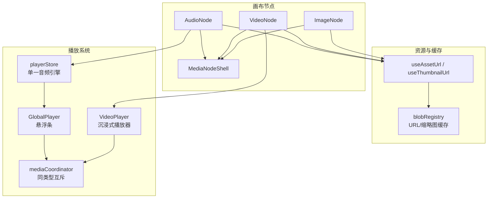
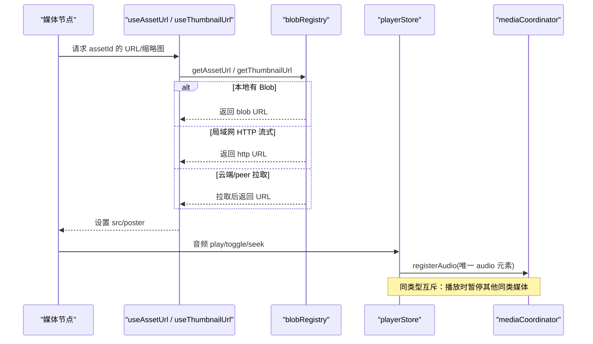
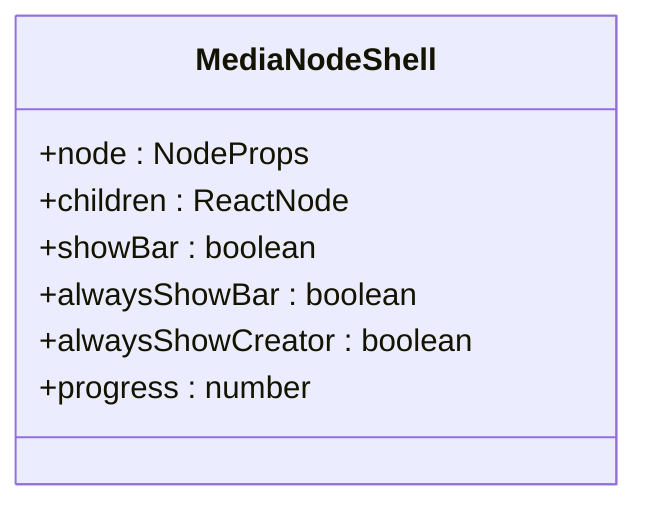
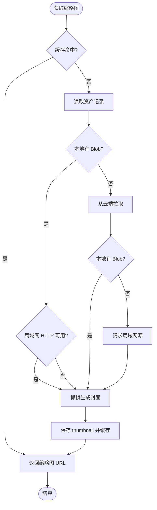
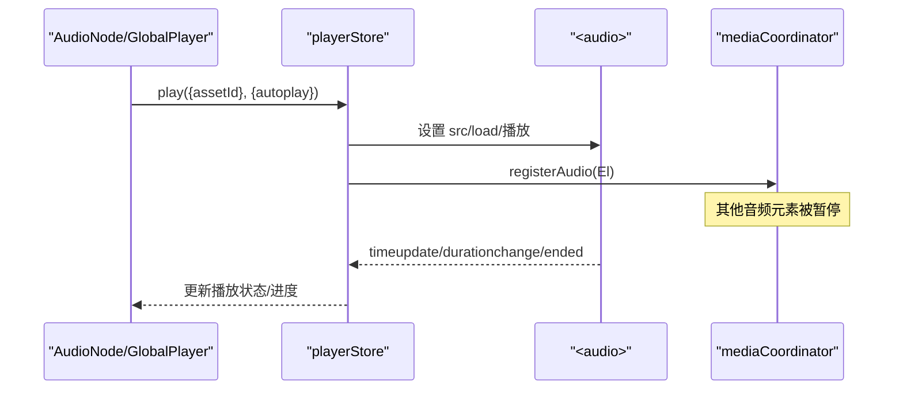
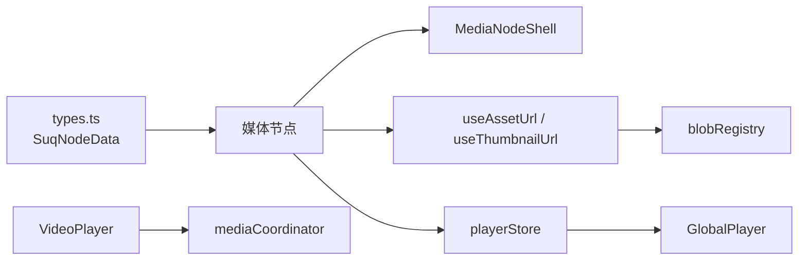

# 媒体节点 API

<cite>
**本文引用的文件**
- [MediaNodeShell.tsx](file://src/canvas/nodes/MediaNodeShell.tsx)
- [ImageNode.tsx](file://src/canvas/nodes/ImageNode.tsx)
- [VideoNode.tsx](file://src/canvas/nodes/VideoNode.tsx)
- [AudioNode.tsx](file://src/canvas/nodes/AudioNode.tsx)
- [useAssetUrl.ts](file://src/media/useAssetUrl.ts)
- [blobRegistry.ts](file://src/media/blobRegistry.ts)
- [playerStore.ts](file://src/store/playerStore.ts)
- [mediaCoordinator.ts](file://src/media/mediaCoordinator.ts)
- [playlists.ts](file://src/media/playlists.ts)
- [GlobalPlayer.tsx](file://src/components/GlobalPlayer.tsx)
- [VideoPlayer.tsx](file://src/components/VideoPlayer.tsx)
- [types.ts](file://src/types.ts)
</cite>

## 目录
1. [简介](#简介)
2. [项目结构](#项目结构)
3. [核心组件](#核心组件)
4. [架构总览](#架构总览)
5. [详细组件分析](#详细组件分析)
6. [依赖关系分析](#依赖关系分析)
7. [性能考量](#性能考量)
8. [故障排查指南](#故障排查指南)
9. [结论](#结论)
10. [附录：数据绑定与播放控制 API](#附录数据绑定与播放控制-api)

## 简介
本文档面向“媒体节点系列”的开发者与使用者，系统化说明 ImageNode、VideoNode、AudioNode 的共同基类 MediaNodeShell 的功能与扩展点，并记录各类媒体节点的通用属性、事件接口、加载机制、缓存策略、错误处理、数据绑定方式以及播放控制 API。同时提供媒体预览、缩略图生成与性能优化建议，帮助你在画布中高效地嵌入与使用图片、视频与音频资源。

## 项目结构
媒体节点位于画布节点模块下，围绕一个通用的外壳组件 MediaNodeShell 构建；资源获取与缓存集中在 media 层；播放状态由全局播放器 store 管理；视频与音频的全局互斥由协调器统一管理。

图表来源
- [MediaNodeShell.tsx:32-151](file://src/canvas/nodes/MediaNodeShell.tsx#L32-L151)
- [ImageNode.tsx:15-126](file://src/canvas/nodes/ImageNode.tsx#L15-L126)
- [VideoNode.tsx:18-88](file://src/canvas/nodes/VideoNode.tsx#L18-L88)
- [AudioNode.tsx:18-126](file://src/canvas/nodes/AudioNode.tsx#L18-L126)
- [useAssetUrl.ts:10-157](file://src/media/useAssetUrl.ts#L10-L157)
- [blobRegistry.ts:84-389](file://src/media/blobRegistry.ts#L84-L389)
- [playerStore.ts:163-298](file://src/store/playerStore.ts#L163-L298)
- [mediaCoordinator.ts:1-25](file://src/media/mediaCoordinator.ts#L1-L25)
- [GlobalPlayer.tsx:19-234](file://src/components/GlobalPlayer.tsx#L19-L234)
- [VideoPlayer.tsx:58-800](file://src/components/VideoPlayer.tsx#L58-L800)

章节来源
- [MediaNodeShell.tsx:32-151](file://src/canvas/nodes/MediaNodeShell.tsx#L32-L151)
- [types.ts:66-107](file://src/types.ts#L66-L107)

## 核心组件
- MediaNodeShell：媒体节点通用外壳，负责节点边框、四边连接手柄、底部信息栏、创建者角标、进度遮罩、局域网编辑锁定提示等。所有媒体节点通过 children 注入具体渲染内容。
- ImageNode：图片节点，支持双击打开大图、下载、自动根据原图尺寸适配节点大小，带占位与淡入过渡。
- VideoNode：视频节点，画布内仅显示封面缩略图与播放按钮，点击/双击进入全屏播放器页面，避免在画布上直接播放影响拖拽。
- AudioNode：音频节点，显示专辑封面（可选）、播放/暂停、时间/时长、下载；进度以遮罩展示当前曲目的播放进度。

章节来源
- [MediaNodeShell.tsx:32-151](file://src/canvas/nodes/MediaNodeShell.tsx#L32-L151)
- [ImageNode.tsx:15-126](file://src/canvas/nodes/ImageNode.tsx#L15-L126)
- [VideoNode.tsx:18-88](file://src/canvas/nodes/VideoNode.tsx#L18-L88)
- [AudioNode.tsx:18-126](file://src/canvas/nodes/AudioNode.tsx#L18-L126)

## 架构总览
媒体节点的数据流与控制流如下：
- 数据绑定：节点 data 中的 kind、assetId、label、coverAssetId 等字段驱动 UI 与行为。
- 资源加载：useAssetUrl/useThumbnailUrl 统一封装资源 URL 获取，内部调用 blobRegistry 进行本地 IndexedDB、局域网 HTTP 流式地址、云端拉取与缓存。
- 播放控制：音频由 playerStore 管理的单一 <audio> 元素驱动，支持顺序/随机/循环/单曲/流式模式；视频通过 VideoPlayer 独立管理，并与 mediaCoordinator 实现同类型互斥。
- 预览与缩略图：视频缩略图通过抓帧生成并缓存；PSD 预览通过专用流程生成。

图表来源
- [useAssetUrl.ts:10-157](file://src/media/useAssetUrl.ts#L10-L157)
- [blobRegistry.ts:84-389](file://src/media/blobRegistry.ts#L84-L389)
- [playerStore.ts:163-298](file://src/store/playerStore.ts#L163-L298)
- [mediaCoordinator.ts:1-25](file://src/media/mediaCoordinator.ts#L1-L25)

## 详细组件分析

### MediaNodeShell 功能与扩展点
- 节点外壳：统一的圆角边框、阴影、选中态样式、可配置边框颜色。
- 连接手柄：四边 source/target 手柄，连线模式下四条边作为连接热区。
- 底部栏：显示媒体类型图标与 label，支持始终显示。
- 创建者角标：悬停/选中/始终显示，提示插入者。
- 进度遮罩：传入 progress 可在节点上铺满显示播放进度。
- 协作锁定：当局域网有其他用户正在编辑该节点时，阻止交互并显示提示。
- 扩展点：通过 children 注入任意内容；通过 props 控制 bar/creator 显示与进度遮罩。

图表来源
- [MediaNodeShell.tsx:20-30](file://src/canvas/nodes/MediaNodeShell.tsx#L20-L30)
- [MediaNodeShell.tsx:32-151](file://src/canvas/nodes/MediaNodeShell.tsx#L32-L151)

章节来源
- [MediaNodeShell.tsx:32-151](file://src/canvas/nodes/MediaNodeShell.tsx#L32-L151)

### ImageNode 图片节点
- 数据绑定：data.assetId 用于获取图片 URL；data.label 作为文件名/标题；data.createdByName 显示插入者。
- 行为：
  - 双击打开大图查看器。
  - 右上角工具栏支持打开大图与下载。
  - 首次加载完成后按原图尺寸自适应节点宽高（最大限制）。
- 加载与缓存：通过 useAssetUrl 获取 URL，失败重试与 toast 提示。
- 错误处理：未就绪时打开大图会提示“仍在加载”。

章节来源
- [ImageNode.tsx:15-126](file://src/canvas/nodes/ImageNode.tsx#L15-L126)
- [useAssetUrl.ts:10-44](file://src/media/useAssetUrl.ts#L10-L44)

### VideoNode 视频节点
- 数据绑定：data.assetId 用于获取缩略图与播放器入口；data.label 作为名称。
- 行为：
  - 画布内仅显示缩略图与播放按钮，不内嵌播放器以避免指针抢占。
  - 双击或点击播放按钮进入全屏播放器页面。
  - 缩略图加载后按原图比例自适应节点大小。
- 缩略图：通过 useThumbnailUrl 获取，底层可能触发抓帧生成。
- 错误处理：缩略图不可用时显示占位动画。

章节来源
- [VideoNode.tsx:18-88](file://src/canvas/nodes/VideoNode.tsx#L18-L88)
- [useAssetUrl.ts:52-99](file://src/media/useAssetUrl.ts#L52-L99)

### AudioNode 音频节点
- 数据绑定：data.assetId 为音频资源；data.coverAssetId 为专辑封面；data.label 为曲目名。
- 行为：
  - 播放/暂停切换，若当前不是该节点对应曲目则开始播放并自动显示底部播放器。
  - 显示当前曲目时间与总时长；非当前曲目归零。
  - 双击进入专用播放器页（流式模式，沿用画布连线顺序）。
  - 支持下载。
- 进度遮罩：仅在播放且为当前曲目时显示进度。
- 播放控制：通过 playerStore.play/toggle/seekBy/next/prev 等 API。

章节来源
- [AudioNode.tsx:18-126](file://src/canvas/nodes/AudioNode.tsx#L18-L126)
- [playerStore.ts:163-298](file://src/store/playerStore.ts#L163-L298)

### 媒体预览与缩略图生成
- 视频缩略图：
  - 优先使用局域网同步来的封面；否则从本地 IndexedDB 读取已有 thumbnail。
  - 若无封面且为视频，尝试用本地 blob 或局域网 HTTP 流式地址抓帧生成 jpeg，并发受限（默认最多 2 个），避免阻塞浏览器连接池。
  - 黑帧检测：若画面过暗视为未解码完成或黑场，自动 seek 到下一采样点重试。
  - 兜底策略：跨源/代理异常时，一次性拉取全量素材再抓帧，确保最终可生成。
- PSD 预览：若缩略图不存在，触发 ensurePsdPreview 生成后再获取。
- 缓存：URL 与缩略图分别维护 Map 缓存，并提供失效与回收方法。

图表来源
- [blobRegistry.ts:128-268](file://src/media/blobRegistry.ts#L128-L268)
- [blobRegistry.ts:310-379](file://src/media/blobRegistry.ts#L310-L379)
- [useAssetUrl.ts:129-157](file://src/media/useAssetUrl.ts#L129-L157)

章节来源
- [blobRegistry.ts:128-268](file://src/media/blobRegistry.ts#L128-L268)
- [blobRegistry.ts:310-379](file://src/media/blobRegistry.ts#L310-L379)
- [useAssetUrl.ts:129-157](file://src/media/useAssetUrl.ts#L129-L157)

### 播放控制与互斥
- 音频：
  - 单一 <audio> 元素，playerStore 集中管理播放状态与队列。
  - 支持顺序/随机/循环/单曲/流式模式；流式模式基于画布连线解析顺序。
  - 悬浮条 GlobalPlayer 提供最小化控制与画中画能力。
- 视频：
  - VideoPlayer 独立管理视频元素，支持全屏、画中画、倍速、音量、进度拖拽、列表导航。
  - 注册到 mediaCoordinator，与其他视频元素互斥播放。
- 互斥：
  - mediaCoordinator 维护音频与视频两类集合，任一元素触发 play 时暂停其他同类元素。

图表来源
- [playerStore.ts:163-298](file://src/store/playerStore.ts#L163-L298)
- [GlobalPlayer.tsx:19-234](file://src/components/GlobalPlayer.tsx#L19-L234)
- [mediaCoordinator.ts:1-25](file://src/media/mediaCoordinator.ts#L1-L25)

章节来源
- [playerStore.ts:163-298](file://src/store/playerStore.ts#L163-L298)
- [GlobalPlayer.tsx:19-234](file://src/components/GlobalPlayer.tsx#L19-L234)
- [mediaCoordinator.ts:1-25](file://src/media/mediaCoordinator.ts#L1-L25)

## 依赖关系分析
- 节点层依赖：
  - ImageNode/VideoNode/AudioNode 均依赖 MediaNodeShell 提供外壳与交互基础。
  - 资源 URL 通过 useAssetUrl/useThumbnailUrl 获取，内部依赖 blobRegistry。
- 播放层依赖：
  - AudioNode 依赖 playerStore 进行播放控制；GlobalPlayer 作为唯一音频元素的宿主。
  - VideoPlayer 独立管理视频元素，并通过 mediaCoordinator 与全局视频互斥。
- 数据与状态：
  - types.ts 定义 SuqNodeData，包含 kind、assetId、label、coverAssetId 等字段。
  - playlists.ts 提供画布连线解析歌单的能力，供播放器流式模式使用。

图表来源
- [types.ts:66-107](file://src/types.ts#L66-L107)
- [MediaNodeShell.tsx:32-151](file://src/canvas/nodes/MediaNodeShell.tsx#L32-L151)
- [useAssetUrl.ts:10-157](file://src/media/useAssetUrl.ts#L10-L157)
- [blobRegistry.ts:84-389](file://src/media/blobRegistry.ts#L84-L389)
- [playerStore.ts:163-298](file://src/store/playerStore.ts#L163-L298)
- [GlobalPlayer.tsx:19-234](file://src/components/GlobalPlayer.tsx#L19-L234)
- [VideoPlayer.tsx:58-800](file://src/components/VideoPlayer.tsx#L58-L800)
- [mediaCoordinator.ts:1-25](file://src/media/mediaCoordinator.ts#L1-L25)

章节来源
- [types.ts:66-107](file://src/types.ts#L66-L107)
- [playlists.ts:1-179](file://src/media/playlists.ts#L1-L179)

## 性能考量
- 资源加载与缓存
  - URL 与缩略图分别缓存，避免重复请求；提供失效与回收方法。
  - 视频优先使用局域网 HTTP 流式地址，避免整份下载到本地造成内存/磁盘压力。
  - 缩略图抓取并发上限为 2，防止多 video 同时 seek 导致连接池耗尽。
- 网络与重试
  - 资源加载失败时进行有限次重试，考虑局域网传输延迟。
  - 封面抓取在局域网场景下持续轮询直至超时，离线场景快速失败。
- 播放体验
  - 音频单一元素，减少上下文切换开销；视频互斥避免多路冲突。
  - 视频节点在画布上不内嵌播放器，降低拖拽干扰与渲染成本。
- 内存管理
  - 及时释放 blob URL；批量探测视频时长后清理临时 video 元素。

[本节为通用指导，无需特定文件引用]

## 故障排查指南
- 资源加载失败
  - 现象：图片/视频缩略图无法显示，toast 提示“资源加载失败”。
  - 排查：检查局域网连接与中继可用性；确认资源是否已上传至云端或 peer 端；查看 blobRegistry 是否成功拉取并落库。
- 视频缩略图为黑帧
  - 现象：封面为黑色或空白。
  - 排查：抓帧过程中检测到黑帧会自动 seek 重试；若仍失败，尝试强制拉取全量素材再抓帧。
- 播放无声音或无法播放
  - 现象：点击播放无响应或无声。
  - 排查：确认全局 <audio> 元素已注册；检查 playerStore 的 track 与 url；确认媒体格式受支持；查看是否有其他音频元素占用互斥。
- 画布拖拽受阻
  - 现象：视频节点拖拽时指针被播放器抢占。
  - 排查：确保视频节点未内嵌播放器；使用 VideoNode 的封面+播放按钮模式；在全屏播放器中进行播放。

章节来源
- [useAssetUrl.ts:10-44](file://src/media/useAssetUrl.ts#L10-L44)
- [blobRegistry.ts:128-268](file://src/media/blobRegistry.ts#L128-L268)
- [blobRegistry.ts:310-379](file://src/media/blobRegistry.ts#L310-L379)
- [playerStore.ts:163-298](file://src/store/playerStore.ts#L163-L298)

## 结论
媒体节点系列通过 MediaNodeShell 提供一致的节点外壳与交互能力，结合 useAssetUrl 与 blobRegistry 实现了稳健的资源加载与缓存策略；playerStore 与 mediaCoordinator 保证了播放的一致性与互斥性。视频与音频在画布上的呈现遵循“轻量预览、重交互在播放器”的原则，兼顾性能与用户体验。借助数据绑定与播放控制 API，开发者可以灵活扩展媒体节点的行为与外观。

[本节为总结，无需特定文件引用]

## 附录：数据绑定与播放控制 API

### 媒体节点通用属性（来自 SuqNodeData）
- kind：媒体类型（image/video/audio/pdf/psd/markdown/text/file/heading/sticky/shape）。
- assetId：资源标识，用于获取 URL/缩略图。
- label：显示名称，常用于文件名或曲目名。
- coverAssetId：音频专辑封面资源标识。
- createdByName：插入者名称，用于显示角标。
- 其他：borderColor、backgroundColor、width、height、mime、size 等用于样式与元信息。

章节来源
- [types.ts:66-107](file://src/types.ts#L66-L107)

### 播放控制 API（音频）
- 播放与切换
  - play({ assetId, name?, nodeId? }, { autoplay? })：载入并可选择立即播放。
  - toggle()：在当前曲目上切换播放/暂停。
- 进度控制
  - seekTo(time)：跳转到指定时间点。
  - seekBy(delta)：相对当前时间快进/快退。
- 队列与模式
  - next(opts?)：下一首，支持 wrap 循环。
  - prev()：上一首。
  - setMode(mode)：设置播放模式（sequential/random/loop/single/flow）。
  - setQueue(queue)：设置歌单队列（流式模式）。
- 音量与静音
  - setVolume(value)：设置音量。
  - setMuted(muted)：设置静音。
- 停止与可见性
  - stop()：停止播放并重置状态。
  - setBarVisible(visible)：控制悬浮条可见性。

章节来源
- [playerStore.ts:163-298](file://src/store/playerStore.ts#L163-L298)
- [GlobalPlayer.tsx:19-234](file://src/components/GlobalPlayer.tsx#L19-L234)

### 媒体预览与缩略图
- 图片预览：ImageNode 双击打开大图查看器。
- 视频缩略图：VideoNode 使用 useThumbnailUrl 获取；底层可能触发抓帧生成。
- PSD 预览：usePsdPreviewUrl 在缩略图缺失时触发生成流程。

章节来源
- [ImageNode.tsx:15-126](file://src/canvas/nodes/ImageNode.tsx#L15-L126)
- [VideoNode.tsx:18-88](file://src/canvas/nodes/VideoNode.tsx#L18-L88)
- [useAssetUrl.ts:129-157](file://src/media/useAssetUrl.ts#L129-L157)

### 错误处理与用户体验
- 资源加载失败：useAssetUrl 捕获异常并 toast 提示；缩略图在局域网场景下持续轮询直至超时。
- 播放失败：playerStore 在 canplay/loadeddata 时重试播放；视频播放器对不支持特性给出提示。
- 协作锁定：MediaNodeShell 在局域网编辑锁定时禁用交互并显示提示。

章节来源
- [useAssetUrl.ts:10-44](file://src/media/useAssetUrl.ts#L10-L44)
- [useAssetUrl.ts:52-99](file://src/media/useAssetUrl.ts#L52-L99)
- [playerStore.ts:72-88](file://src/store/playerStore.ts#L72-L88)
- [MediaNodeShell.tsx:44-66](file://src/canvas/nodes/MediaNodeShell.tsx#L44-L66)