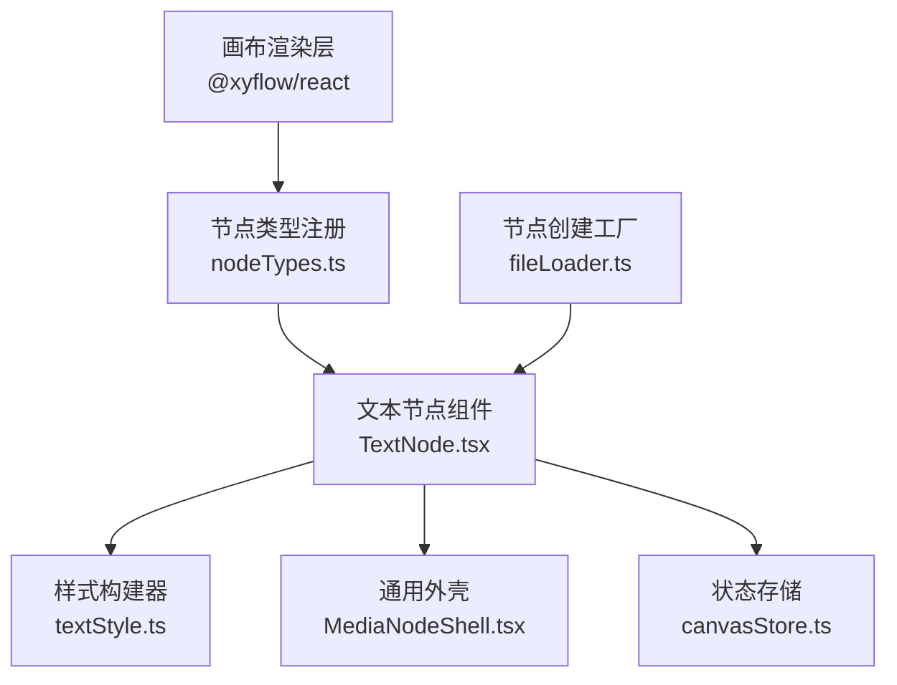
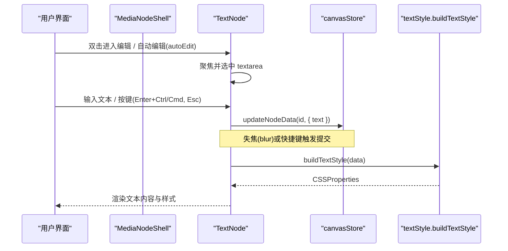
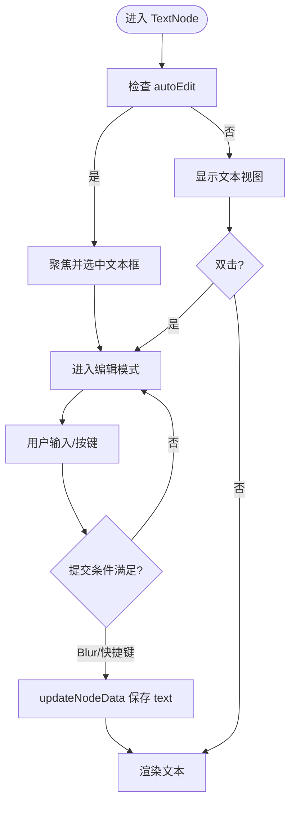
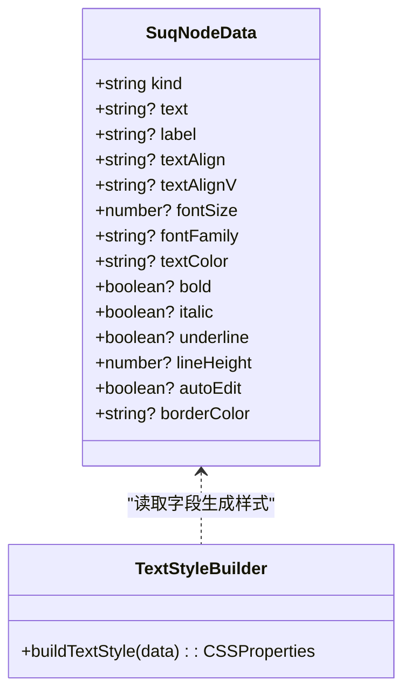
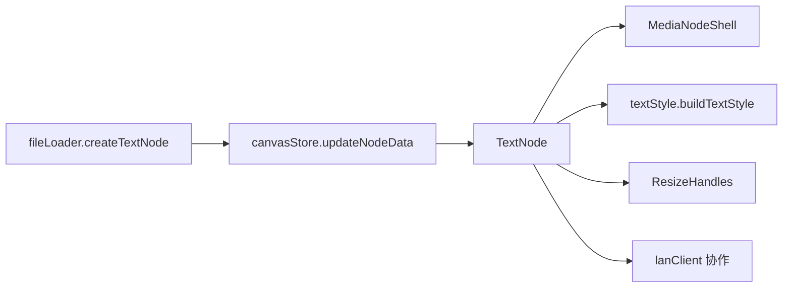

# 文本节点 API

<cite>
**本文引用的文件**
- [TextNode.tsx](file://src/canvas/nodes/TextNode.tsx)
- [textStyle.ts](file://src/canvas/nodes/textStyle.ts)
- [types.ts](file://src/types.ts)
- [nodeTypes.ts](file://src/canvas/nodes/nodeTypes.ts)
- [MediaNodeShell.tsx](file://src/canvas/nodes/MediaNodeShell.tsx)
- [fileLoader.ts](file://src/io/fileLoader.ts)
- [canvasStore.ts](file://src/store/canvasStore.ts)
</cite>

## 目录
1. [简介](#简介)
2. [项目结构](#项目结构)
3. [核心组件与数据模型](#核心组件与数据模型)
4. [架构总览](#架构总览)
5. [详细组件分析](#详细组件分析)
6. [依赖关系分析](#依赖关系分析)
7. [性能考量](#性能考量)
8. [故障排查指南](#故障排查指南)
9. [结论](#结论)
10. [附录：API 参考](#附录api-参考)

## 简介
本文档面向使用 SuQCanvas 的开发者，提供“文本节点”（Text Node）的完整 API 说明。内容涵盖：
- TextNode 组件的属性、配置项与行为
- 文本编辑事件接口（如失焦提交、快捷键提交等）
- 文本样式系统 textStyle 的使用方式（颜色、字号、字体家族、加粗、斜体、下划线、行高、对齐）
- 数据模型 SuqNodeData 在文本节点中的具体应用示例
- 富文本编辑功能的集成建议与扩展点

## 项目结构
文本节点位于画布节点体系中，作为媒体节点的一种类型被注册到画布中。其核心文件包括：
- 节点实现：TextNode.tsx
- 样式构建：textStyle.ts
- 类型定义：types.ts（包含 SuqNodeData、对齐枚举等）
- 节点注册：nodeTypes.ts（将 text 类型映射到 TextNode）
- 通用外壳：MediaNodeShell.tsx（为所有媒体节点提供统一的外壳、连接点、工具栏等）
- 创建入口：fileLoader.ts（提供 createTextNode 工厂方法）
- 状态更新：canvasStore.ts（通过 updateNodeData 持久化文本变更）

图表来源
- [nodeTypes.ts:14-26](file://src/canvas/nodes/nodeTypes.ts#L14-L26)
- [TextNode.tsx:13-106](file://src/canvas/nodes/TextNode.tsx#L13-L106)
- [textStyle.ts:10-21](file://src/canvas/nodes/textStyle.ts#L10-L21)
- [MediaNodeShell.tsx:20-39](file://src/canvas/nodes/MediaNodeShell.tsx#L20-L39)
- [fileLoader.ts:207-221](file://src/io/fileLoader.ts#L207-L221)

章节来源
- [nodeTypes.ts:14-26](file://src/canvas/nodes/nodeTypes.ts#L14-L26)
- [TextNode.tsx:13-106](file://src/canvas/nodes/TextNode.tsx#L13-L106)
- [textStyle.ts:10-21](file://src/canvas/nodes/textStyle.ts#L10-L21)
- [MediaNodeShell.tsx:20-39](file://src/canvas/nodes/MediaNodeShell.tsx#L20-L39)
- [fileLoader.ts:207-221](file://src/io/fileLoader.ts#L207-L221)

## 核心组件与数据模型
- 组件：TextNode
  - 职责：渲染文本内容、处理编辑态切换、提交文本变更、应用文本样式、可选播放歌单按钮（当文本命名了画布歌单时）。
- 数据模型：SuqNodeData
  - 文本节点相关字段：kind、text、label、textAlign、textAlignV、fontSize、fontFamily、textColor、bold、italic、underline、lineHeight、autoEdit、borderColor 等。
- 样式系统：buildTextStyle
  - 根据 SuqNodeData 生成 CSSProperties，控制水平/垂直对齐、字号、字体、颜色、粗细、斜体、下划线、行高等。

章节来源
- [TextNode.tsx:13-106](file://src/canvas/nodes/TextNode.tsx#L13-L106)
- [types.ts:66-98](file://src/types.ts#L66-L98)
- [textStyle.ts:10-21](file://src/canvas/nodes/textStyle.ts#L10-L21)

## 架构总览
下图展示了文本节点从创建到渲染、编辑、提交的完整流程，以及与状态存储和样式系统的交互。

图表来源
- [TextNode.tsx:26-53](file://src/canvas/nodes/TextNode.tsx#L26-L53)
- [textStyle.ts:10-21](file://src/canvas/nodes/textStyle.ts#L10-L21)
- [fileLoader.ts:207-221](file://src/io/fileLoader.ts#L207-L221)

## 详细组件分析

### TextNode 组件
- 属性与配置
  - 接收 React Flow 的 NodeProps<SuqNode>，内部读取 id、data、selected。
  - data 支持的关键字段：
    - 文本与标签：text、label
    - 样式：textAlign、textAlignV、fontSize、fontFamily、textColor、bold、italic、underline、lineHeight
    - 行为：autoEdit（首次自动进入编辑）
    - 外观：borderColor（由外壳渲染）
- 编辑模式
  - 默认显示纯文本；双击进入编辑模式。
  - 支持 autoEdit：首次渲染时自动聚焦并选中文本框。
  - 提交时机：
    - onBlur（失焦）提交
    - 快捷键：Esc 直接提交当前值；Ctrl/Cmd + Enter 提交
  - 同步协作：编辑中会调用 LAN 客户端广播当前编辑状态与文本预览。
- 样式应用
  - 通过 buildTextStyle(data) 生成样式对象，应用于文本容器与 textarea。
  - 垂直对齐通过 V_JUSTIFY 映射到 flex 布局的 justify-content。
- 歌单联动
  - 若该文本节点名称指向一个画布歌单（通过出边关联音频首节点），非编辑状态下会显示“歌单”按钮，点击可打开音乐播放器。
- 尺寸调整
  - 选中且未编辑时，显示 ResizeHandles 以调整节点尺寸。

图表来源
- [TextNode.tsx:26-53](file://src/canvas/nodes/TextNode.tsx#L26-L53)
- [TextNode.tsx:78-101](file://src/canvas/nodes/TextNode.tsx#L78-L101)

章节来源
- [TextNode.tsx:13-106](file://src/canvas/nodes/TextNode.tsx#L13-L106)

### 文本样式系统 textStyle
- 能力范围
  - 水平对齐：left、center、right、justify
  - 垂直对齐：top、middle、bottom（通过 flex 布局）
  - 字体：fontSize、fontFamily
  - 颜色：textColor
  - 字形：bold、italic、underline
  - 行高：lineHeight
- 使用方式
  - 在 TextNode 中通过 buildTextStyle(data) 获取 CSSProperties，并应用到文本容器与编辑器。
  - 垂直对齐通过 V_JUSTIFY 映射到 CSS 值，配合外层容器的 flex 布局实现。

图表来源
- [types.ts:66-98](file://src/types.ts#L66-L98)
- [textStyle.ts:10-21](file://src/canvas/nodes/textStyle.ts#L10-L21)

章节来源
- [textStyle.ts:10-21](file://src/canvas/nodes/textStyle.ts#L10-L21)
- [types.ts:66-98](file://src/types.ts#L66-L98)

### 数据模型 SuqNodeData 在文本节点中的应用
- 最小可用数据（用于创建文本节点）
  - kind: 'text'
  - text: ''（初始为空字符串）
  - label: '文本'（用于标识/搜索）
  - autoEdit: false（可按需开启）
  - borderColor: '#64748b'（边框色）
- 常用样式字段
  - textAlign: 'left' | 'center' | 'right' | 'justify'
  - textAlignV: 'top' | 'middle' | 'bottom'
  - fontSize: number
  - fontFamily: string
  - textColor: string
  - bold: boolean
  - italic: boolean
  - underline: boolean
  - lineHeight: number
- 示例（描述性）
  - 创建一个居中对齐、蓝色、加粗、字号 18 的文本节点，行高 1.6，初始内容为空，不自动编辑。
  - 创建一个顶部对齐、灰色文字、带下划线的便签式文本节点。

章节来源
- [fileLoader.ts:207-221](file://src/io/fileLoader.ts#L207-L221)
- [types.ts:66-98](file://src/types.ts#L66-L98)

### 文本编辑事件接口
- 进入编辑
  - 双击文本区域进入编辑模式
  - 或通过 autoEdit 在首次渲染时自动进入编辑模式
- 提交文本
  - onBlur：失去焦点时提交
  - 键盘快捷键：
    - Escape：取消编辑并提交当前值
    - Ctrl/Cmd + Enter：提交当前值
- 实时协作
  - 编辑中会通知 LAN 客户端当前正在编辑的节点及预览文本，离开编辑时清除状态

章节来源
- [TextNode.tsx:26-53](file://src/canvas/nodes/TextNode.tsx#L26-L53)
- [TextNode.tsx:78-101](file://src/canvas/nodes/TextNode.tsx#L78-L101)

### 富文本编辑功能的集成指南
- 现状说明
  - 当前文本节点基于原生 textarea 进行编辑，不支持富文本格式（如加粗、斜体、链接等）。
- 集成思路
  - 替换编辑器：将 textarea 替换为富文本编辑器（如 ProseMirror、Slate、Tiptap 等），保持与现有 updateNodeData 的对接。
  - 数据结构：
    - 方案 A：继续使用 text 字段存储 HTML 或 Markdown，并在展示层解析。
    - 方案 B：引入结构化富文本数据（如 JSON 文档树），扩展 SuqNodeData 增加 richContent 字段。
  - 样式映射：
    - 保留 buildTextStyle 对基础样式的控制（字号、颜色、对齐等），富文本内容区仅负责内容编辑。
  - 事件兼容：
    - 保持 onBlur、快捷键提交等行为一致，确保与现有交互无缝衔接。
  - 协作与剪贴板：
    - 注意富文本内容的序列化/反序列化，确保跨设备协作与复制粘贴的正确性。
  - 渐进迁移：
    - 新增字段（如 richContent）并保持向后兼容，旧文本按策略降级为纯文本展示。

[本节为概念性指导，不直接分析具体代码文件]

## 依赖关系分析
- 组件依赖
  - TextNode 依赖：
    - MediaNodeShell：提供节点外壳、连接点、工具栏等
    - textStyle：构建文本样式
    - canvasStore：更新节点数据
    - lanClient：协作编辑状态同步
    - ResizeHandles：尺寸调整
  - 节点注册：
    - nodeTypes.ts 将 'text' 类型映射到 TextNode
- 数据流
  - 创建：fileLoader.ts 的 createTextNode 生成初始节点数据
  - 渲染：React Flow 根据类型选择 TextNode
  - 编辑：用户输入 -> updateNodeData -> 持久化
  - 样式：buildTextStyle -> 应用到 DOM

图表来源
- [fileLoader.ts:207-221](file://src/io/fileLoader.ts#L207-L221)
- [nodeTypes.ts:14-26](file://src/canvas/nodes/nodeTypes.ts#L14-L26)
- [TextNode.tsx:13-106](file://src/canvas/nodes/TextNode.tsx#L13-L106)

章节来源
- [nodeTypes.ts:14-26](file://src/canvas/nodes/nodeTypes.ts#L14-L26)
- [TextNode.tsx:13-106](file://src/canvas/nodes/TextNode.tsx#L13-L106)
- [fileLoader.ts:207-221](file://src/io/fileLoader.ts#L207-L221)

## 性能考量
- 文本渲染
  - 使用 memo 包裹 TextNode，减少不必要的重渲染。
  - 样式计算 buildTextStyle 轻量，开销低。
- 编辑体验
  - 自动聚焦与选中提升效率；快捷键提交减少鼠标操作。
- 协作同步
  - 仅在编辑态广播状态，避免频繁网络请求。
- 大文本
  - 如需支持超长文本，考虑虚拟滚动或分页加载（当前实现为原生 textarea，适合中小文本）。

[本节提供一般性指导，不直接分析具体代码文件]

## 故障排查指南
- 无法进入编辑
  - 检查是否设置了 autoEdit=false 且未双击；确认双击事件未被阻止。
- 文本未保存
  - 确认 onBlur 或快捷键提交逻辑生效；检查 updateNodeData 调用是否正确。
- 样式不生效
  - 检查 SuqNodeData 对应字段是否存在且类型正确；确认 buildTextStyle 已应用至容器与编辑器。
- 协作状态异常
  - 检查 LAN 客户端是否在编辑开始时设置、退出时清理；确认 clearLanEditing 被调用。

章节来源
- [TextNode.tsx:26-53](file://src/canvas/nodes/TextNode.tsx#L26-L53)
- [TextNode.tsx:78-101](file://src/canvas/nodes/TextNode.tsx#L78-L101)

## 结论
文本节点提供了简洁高效的纯文本编辑能力，并通过统一的样式系统与外壳组件保持一致的交互体验。借助 SuqNodeData 的灵活字段，可以便捷地控制文本的外观与行为。未来可通过替换编辑器实现富文本能力，同时保持与现有数据流和交互的一致性。

[本节为总结性内容，不直接分析具体代码文件]

## 附录：API 参考

### 文本节点数据模型（SuqNodeData 关键字段）
- kind: 'text'
- text?: string
- label?: string
- textAlign?: 'left' | 'center' | 'right' | 'justify'
- textAlignV?: 'top' | 'middle' | 'bottom'
- fontSize?: number
- fontFamily?: string
- textColor?: string
- bold?: boolean
- italic?: boolean
- underline?: boolean
- lineHeight?: number
- autoEdit?: boolean
- borderColor?: string

章节来源
- [types.ts:66-98](file://src/types.ts#L66-L98)

### 文本样式系统（buildTextStyle）
- 输入：SuqNodeData
- 输出：CSSProperties
- 支持的样式映射：
  - 水平对齐：textAlign
  - 垂直对齐：textAlignV（通过 flex 布局）
  - 字体：fontSize、fontFamily
  - 颜色：textColor
  - 字形：bold、italic、underline
  - 行高：lineHeight

章节来源
- [textStyle.ts:10-21](file://src/canvas/nodes/textStyle.ts#L10-L21)

### 文本编辑事件
- 进入编辑
  - onDoubleClick：进入编辑模式
  - autoEdit：首次渲染自动进入编辑模式
- 提交文本
  - onBlur：失焦提交
  - onKeyDown：
    - Escape：提交并退出编辑
    - Ctrl/Cmd + Enter：提交并退出编辑

章节来源
- [TextNode.tsx:78-101](file://src/canvas/nodes/TextNode.tsx#L78-L101)

### 节点创建与注册
- 创建：createTextNode(position, autoEdit?)
- 注册：mediaNodeTypes['text'] = TextNode

章节来源
- [fileLoader.ts:207-221](file://src/io/fileLoader.ts#L207-L221)
- [nodeTypes.ts:14-26](file://src/canvas/nodes/nodeTypes.ts#L14-L26)