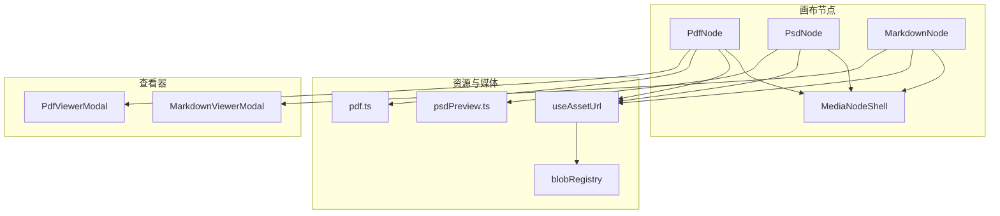
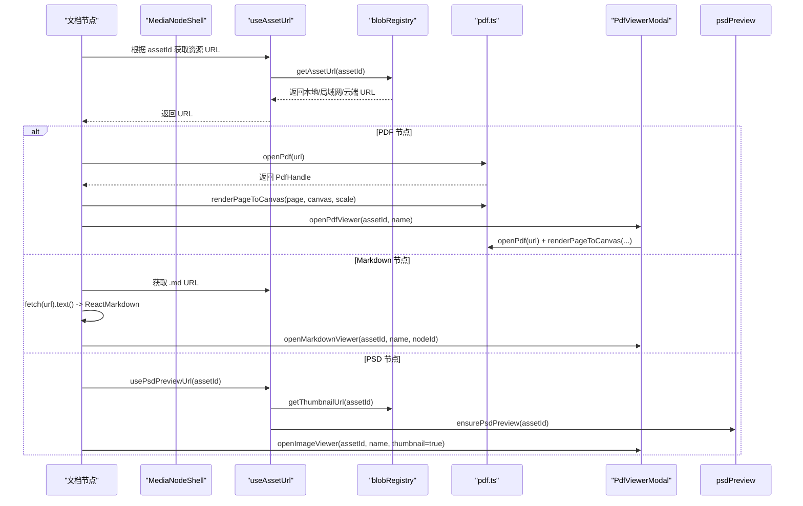
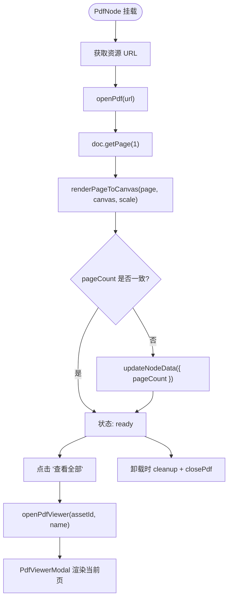
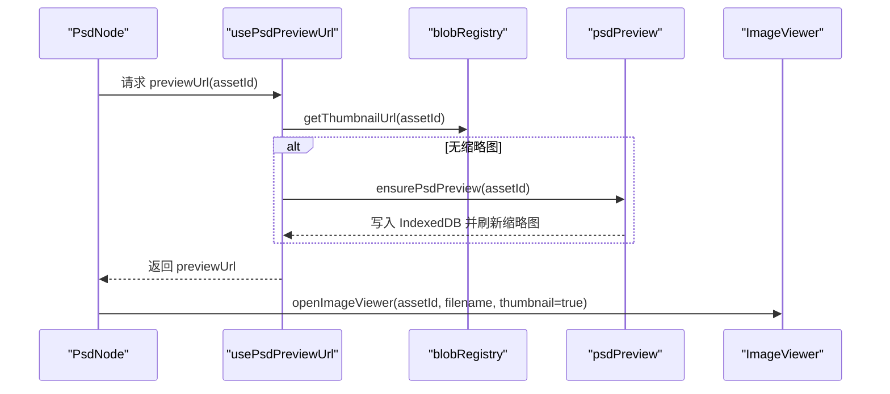
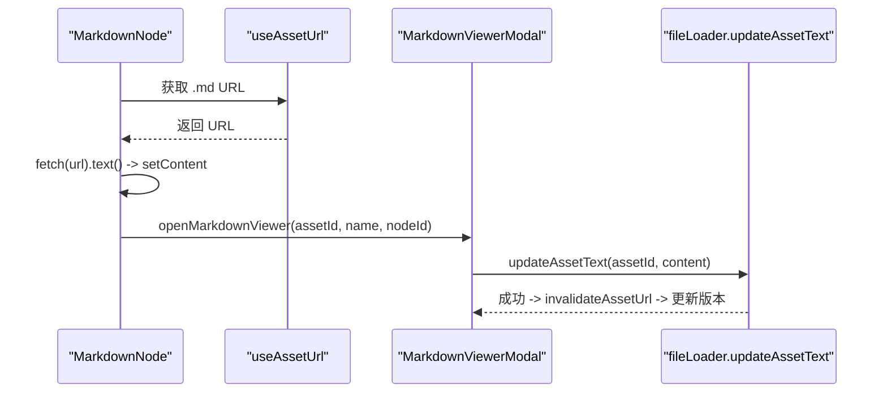
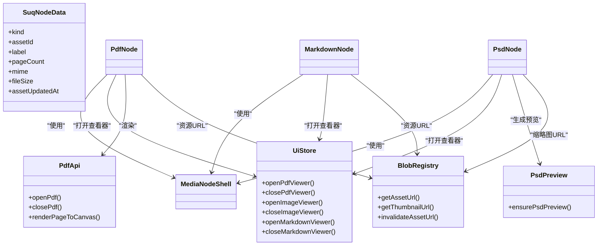

# 文档节点 API

<cite>
**本文引用的文件**
- [PdfNode.tsx](file://src/canvas/nodes/PdfNode.tsx)
- [PsdNode.tsx](file://src/canvas/nodes/PsdNode.tsx)
- [MarkdownNode.tsx](file://src/canvas/nodes/MarkdownNode.tsx)
- [pdf.ts](file://src/media/pdf.ts)
- [psdPreview.ts](file://src/media/psdPreview.ts)
- [useAssetUrl.ts](file://src/media/useAssetUrl.ts)
- [blobRegistry.ts](file://src/media/blobRegistry.ts)
- [PdfViewerModal.tsx](file://src/components/PdfViewerModal.tsx)
- [MarkdownViewerModal.tsx](file://src/components/MarkdownViewerModal.tsx)
- [MediaNodeShell.tsx](file://src/canvas/nodes/MediaNodeShell.tsx)
- [nodeTypes.ts](file://src/canvas/nodes/nodeTypes.ts)
- [types.ts](file://src/types.ts)
- [uiStore.ts](file://src/store/uiStore.ts)
- [fileLoader.ts](file://src/io/fileLoader.ts)
</cite>

## 目录
1. [简介](#简介)
2. [项目结构](#项目结构)
3. [核心组件](#核心组件)
4. [架构总览](#架构总览)
5. [详细组件分析](#详细组件分析)
6. [依赖关系分析](#依赖关系分析)
7. [性能与内存优化](#性能与内存优化)
8. [故障排查指南](#故障排查指南)
9. [结论](#结论)
10. [附录：配置项与扩展点](#附录配置项与扩展点)

## 简介
本文件面向“文档类型节点”的 API 与集成方式，覆盖三类文档节点：PDF、PSD、Markdown。内容包含：
- 各节点的特定功能与配置选项（缩放、分页、预览、编辑）
- PDF 渲染、PSD 预览、Markdown 解析的相关 API
- 文档文件管理接口（加载、缓存、内存优化）
- 文档查看器的集成方式和自定义扩展方法

## 项目结构
文档节点位于画布节点层，通过 MediaNodeShell 统一外壳渲染；资源加载由 useAssetUrl 与 blobRegistry 提供；PDF/PSD/Markdown 的具体能力分别封装在 media 层与 components 层的查看器中。

图表来源
- [PdfNode.tsx:11-89](file://src/canvas/nodes/PdfNode.tsx#L11-L89)
- [PsdNode.tsx:15-124](file://src/canvas/nodes/PsdNode.tsx#L15-L124)
- [MarkdownNode.tsx:12-104](file://src/canvas/nodes/MarkdownNode.tsx#L12-L104)
- [useAssetUrl.ts:10-156](file://src/media/useAssetUrl.ts#L10-L156)
- [blobRegistry.ts:84-126](file://src/media/blobRegistry.ts#L84-L126)
- [pdf.ts:23-49](file://src/media/pdf.ts#L23-L49)
- [psdPreview.ts:42-60](file://src/media/psdPreview.ts#L42-L60)
- [PdfViewerModal.tsx:7-145](file://src/components/PdfViewerModal.tsx#L7-L145)
- [MarkdownViewerModal.tsx:11-115](file://src/components/MarkdownViewerModal.tsx#L11-L115)

章节来源
- [nodeTypes.ts:14-26](file://src/canvas/nodes/nodeTypes.ts#L14-L26)
- [types.ts:66-98](file://src/types.ts#L66-L98)

## 核心组件
- PdfNode：加载并渲染 PDF 第一页到节点内 canvas，支持打开全屏 PDF 查看器，自动记录页数。
- PsdNode：生成/获取 PSD 缩略图作为预览，支持双击打开图片查看器，支持下载原始 PSD。
- MarkdownNode：拉取 .md 文本并渲染为 Markdown，支持打开编辑器进行在线编辑与保存。
- MediaNodeShell：统一节点外壳（边框、连线手柄、底部标签栏、协作者锁定提示）。
- pdf.ts：PDF 打开、关闭、按页面渲染到 Canvas 的底层 API。
- psdPreview.ts：基于 Worker 的 PSD 缩略图生成与缓存。
- useAssetUrl.ts / blobRegistry.ts：资源 URL 获取、重试、缩略图缓存与失效、内存 URL 释放。
- PdfViewerModal / MarkdownViewerModal：全屏查看与编辑界面，提供翻页、键盘导航、保存等交互。

章节来源
- [PdfNode.tsx:11-89](file://src/canvas/nodes/PdfNode.tsx#L11-L89)
- [PsdNode.tsx:15-124](file://src/canvas/nodes/PsdNode.tsx#L15-L124)
- [MarkdownNode.tsx:12-104](file://src/canvas/nodes/MarkdownNode.tsx#L12-L104)
- [MediaNodeShell.tsx:32-150](file://src/canvas/nodes/MediaNodeShell.tsx#L32-L150)
- [pdf.ts:23-49](file://src/media/pdf.ts#L23-L49)
- [psdPreview.ts:42-60](file://src/media/psdPreview.ts#L42-L60)
- [useAssetUrl.ts:10-156](file://src/media/useAssetUrl.ts#L10-L156)
- [blobRegistry.ts:41-56](file://src/media/blobRegistry.ts#L41-L56)

## 架构总览
下图展示了从节点到资源再到查看器的完整调用链，包括 PDF 渲染、PSD 预览与 Markdown 编辑流程。

图表来源
- [PdfNode.tsx:19-62](file://src/canvas/nodes/PdfNode.tsx#L19-L62)
- [PdfViewerModal.tsx:24-83](file://src/components/PdfViewerModal.tsx#L24-L83)
- [MarkdownNode.tsx:29-43](file://src/canvas/nodes/MarkdownNode.tsx#L29-L43)
- [useAssetUrl.ts:129-156](file://src/media/useAssetUrl.ts#L129-L156)
- [psdPreview.ts:49-60](file://src/media/psdPreview.ts#L49-L60)
- [blobRegistry.ts:310-379](file://src/media/blobRegistry.ts#L310-L379)

## 详细组件分析

### PDF 节点（PdfNode）
- 功能要点
  - 动态导入 pdf.ts，打开 PDF 并读取第一页，渲染到节点内 canvas。
  - 自动更新节点数据中的 pageCount（若与文档实际页数不一致）。
  - 提供“查看全部”按钮，调用 UiStore 打开 PdfViewerModal。
  - 清理策略：组件卸载时释放 page 与 PdfHandle，避免内存泄漏。
- 缩放与分页
  - 节点内仅渲染第 1 页，使用固定 base width 计算 scale 以适配容器宽度。
  - 全屏查看器支持上一页/下一页、键盘左右切换、Esc 关闭。
- 错误处理
  - 渲染失败时进入 error 状态并提示；组件卸载时确保资源释放。

图表来源
- [PdfNode.tsx:19-62](file://src/canvas/nodes/PdfNode.tsx#L19-L62)
- [PdfViewerModal.tsx:24-94](file://src/components/PdfViewerModal.tsx#L24-L94)
- [pdf.ts:23-49](file://src/media/pdf.ts#L23-L49)

章节来源
- [PdfNode.tsx:11-89](file://src/canvas/nodes/PdfNode.tsx#L11-L89)
- [PdfViewerModal.tsx:7-145](file://src/components/PdfViewerModal.tsx#L7-L145)
- [pdf.ts:23-49](file://src/media/pdf.ts#L23-L49)

### PSD 节点（PsdNode）
- 功能要点
  - 使用 usePsdPreviewUrl 获取缩略图 URL；若无则触发 ensurePsdPreview 生成并缓存。
  - 首次加载后根据图片自然尺寸自适应节点宽高（限制最大宽高）。
  - 双击或工具栏按钮打开图片查看器（thumbnail=true），支持下载原始 PSD。
  - 支持局域网协作锁定：当其他用户正在操作时阻止打开预览。
- 预览与下载
  - 预览走缩略图路径，降低带宽与内存占用。
  - 下载链接指向原始资源 URL。

图表来源
- [PsdNode.tsx:15-57](file://src/canvas/nodes/PsdNode.tsx#L15-L57)
- [useAssetUrl.ts:129-156](file://src/media/useAssetUrl.ts#L129-L156)
- [psdPreview.ts:49-60](file://src/media/psdPreview.ts#L49-L60)

章节来源
- [PsdNode.tsx:15-124](file://src/canvas/nodes/PsdNode.tsx#L15-L124)
- [useAssetUrl.ts:129-156](file://src/media/useAssetUrl.ts#L129-L156)
- [psdPreview.ts:42-60](file://src/media/psdPreview.ts#L42-L60)

### Markdown 节点（MarkdownNode）
- 功能要点
  - 通过 useAssetUrl 获取 .md 文本 URL，fetch 文本并限制长度，使用 ReactMarkdown 渲染。
  - 双击或工具栏按钮打开 MarkdownViewerModal，支持编辑模式与保存。
  - 保存时调用 updateAssetText 更新 Blob，并同步到局域网/云端；同时使 URL 失效以触发重新加载。
- 协作与锁定
  - 打开编辑器时设置 LAN 编辑锁，退出时清除。

图表来源
- [MarkdownNode.tsx:29-43](file://src/canvas/nodes/MarkdownNode.tsx#L29-L43)
- [MarkdownViewerModal.tsx:21-58](file://src/components/MarkdownViewerModal.tsx#L21-L58)
- [fileLoader.ts:120-135](file://src/io/fileLoader.ts#L120-L135)

章节来源
- [MarkdownNode.tsx:12-104](file://src/canvas/nodes/MarkdownNode.tsx#L12-L104)
- [MarkdownViewerModal.tsx:11-115](file://src/components/MarkdownViewerModal.tsx#L11-L115)
- [fileLoader.ts:120-135](file://src/io/fileLoader.ts#L120-L135)

### 文档节点外壳（MediaNodeShell）
- 提供统一边框、四边连接手柄、底部标签栏、协作者锁定遮罩、进度条遮罩等通用能力。
- 所有文档节点均复用此外壳，保证一致的交互体验。

章节来源
- [MediaNodeShell.tsx:32-150](file://src/canvas/nodes/MediaNodeShell.tsx#L32-L150)

## 依赖关系分析
- 节点注册：nodeTypes 将 markdown/pdf/psd 映射到对应组件。
- 数据类型：types.ts 定义 SuqNodeData，包含 kind、assetId、label、pageCount、mime、fileSize 等字段。
- 资源访问：useAssetUrl 依赖 blobRegistry 提供的 getAssetUrl/getThumbnailUrl；blobRegistry 负责本地/局域网/云端多级回退与缓存。
- 查看器：UiStore 维护 pdfViewer/markdownViewer/imageViewer 的状态，控制弹窗开关。

图表来源
- [nodeTypes.ts:14-26](file://src/canvas/nodes/nodeTypes.ts#L14-L26)
- [types.ts:66-98](file://src/types.ts#L66-L98)
- [uiStore.ts:18-45](file://src/store/uiStore.ts#L18-L45)
- [blobRegistry.ts:84-126](file://src/media/blobRegistry.ts#L84-L126)
- [pdf.ts:23-49](file://src/media/pdf.ts#L23-L49)
- [psdPreview.ts:49-60](file://src/media/psdPreview.ts#L49-L60)

章节来源
- [nodeTypes.ts:14-26](file://src/canvas/nodes/nodeTypes.ts#L14-L26)
- [types.ts:66-98](file://src/types.ts#L66-L98)
- [uiStore.ts:18-45](file://src/store/uiStore.ts#L18-L45)

## 性能与内存优化
- PDF
  - 节点内仅渲染第 1 页，减少首屏开销。
  - 使用 devicePixelRatio 提升清晰度，同时控制 scale 避免过大 canvas。
  - 组件卸载时立即 cleanup 页面并销毁 PdfHandle，防止内存泄漏。
- PSD
  - 缩略图优先：懒生成并缓存至 IndexedDB，避免重复解码大文件。
  - 并发控制：Worker 队列串行化请求，避免阻塞主线程。
- Markdown
  - 文本长度限制（200KB），避免超大文件导致 UI 卡顿。
  - 保存后主动失效 URL，确保下次渲染最新内容。
- 资源与缓存
  - blobRegistry 维护 urlCache/thumbCache，并提供 invalidate* 方法释放 blob URL。
  - 视频/图片封面抓帧有并发上限，避免占满浏览器连接池。
  - 局域网场景下对资源传输进行中继与超时重试，提高鲁棒性。

章节来源
- [pdf.ts:35-49](file://src/media/pdf.ts#L35-L49)
- [psdPreview.ts:10-47](file://src/media/psdPreview.ts#L10-L47)
- [blobRegistry.ts:12-23](file://src/media/blobRegistry.ts#L12-L23)
- [blobRegistry.ts:41-56](file://src/media/blobRegistry.ts#L41-L56)
- [blobRegistry.ts:310-379](file://src/media/blobRegistry.ts#L310-L379)

## 故障排查指南
- PDF 渲染失败
  - 检查 cMap/标准字体/WASM 资源路径是否正确（BASE_URL + pdfjs/...）。
  - 确认页面已正确 cleanup，避免残留对象。
  - 查看控制台错误信息，必要时降级显示错误态。
- PSD 预览不可用
  - 确认 ensurePsdPreview 是否执行成功；若失败会 toast 提示。
  - 检查 IndexedDB 中是否存在缩略图；必要时调用 invalidateThumbnailUrl 强制重建。
- Markdown 加载/保存失败
  - 网络异常或权限问题会导致 fetch 失败；检查 CORS 与后端服务。
  - 保存失败时检查 updateAssetText 返回值与日志；确认资产存在且可写。
- 资源加载失败
  - useAssetUrl 内置重试机制；若多次失败会 toast 提示。
  - 检查 blobRegistry 的本地/局域网/云端回退链路是否正常。

章节来源
- [pdf.ts:9-16](file://src/media/pdf.ts#L9-L16)
- [PdfNode.tsx:50-53](file://src/canvas/nodes/PdfNode.tsx#L50-L53)
- [useAssetUrl.ts:21-43](file://src/media/useAssetUrl.ts#L21-L43)
- [useAssetUrl.ts:129-156](file://src/media/useAssetUrl.ts#L129-L156)
- [MarkdownViewerModal.tsx:43-58](file://src/components/MarkdownViewerModal.tsx#L43-L58)

## 结论
本项目为文档类节点提供了统一的渲染与交互框架：PDF 节点聚焦单页预览与全屏翻页；PSD 节点通过缩略图预览与下载原文件平衡性能与可用性；Markdown 节点提供轻量级在线编辑与保存。借助 useAssetUrl 与 blobRegistry 的多级资源回退与缓存机制，系统在不同网络环境下具备良好鲁棒性。通过 UiStore 暴露的查看器 API，开发者可以便捷地集成自定义查看器或扩展现有行为。

## 附录：配置项与扩展点
- 节点数据字段（SuqNodeData）
  - kind：文档类型（pdf/psd/markdown）
  - assetId：关联资源 ID
  - label：节点名称/文件名
  - pageCount：PDF 页数（自动更新）
  - mime/fileSize：MIME 与文件大小
  - assetUpdatedAt：用于 Markdown 版本控制触发刷新
- 查看器集成
  - PDF：通过 uiStore.openPdfViewer/closePdfViewer 控制全屏查看器。
  - Markdown：通过 uiStore.openMarkdownViewer/closeMarkdownViewer 打开编辑器。
  - 图片（PSD 预览）：通过 uiStore.openImageViewer/closeImageViewer 打开图片查看器。
- 自定义扩展
  - 新增文档类型：在 nodeTypes 中注册新节点类型，并在 types.ts 扩展 MediaKind。
  - 自定义渲染：在节点组件中复用 MediaNodeShell，实现自有渲染逻辑。
  - 资源接入：扩展 blobRegistry 的 getAssetUrl/getThumbnailUrl 以支持新的存储或协议。
  - 查看器扩展：在 UiStore 中添加新的 viewer 状态与方法，并实现对应 Modal。

章节来源
- [types.ts:66-98](file://src/types.ts#L66-L98)
- [nodeTypes.ts:14-26](file://src/canvas/nodes/nodeTypes.ts#L14-L26)
- [uiStore.ts:18-45](file://src/store/uiStore.ts#L18-L45)
- [blobRegistry.ts:84-126](file://src/media/blobRegistry.ts#L84-L126)