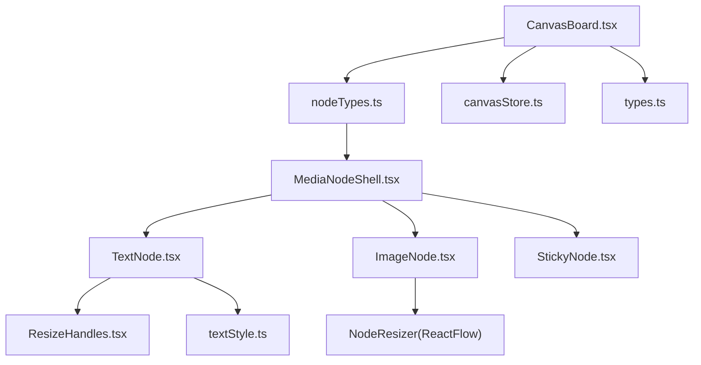
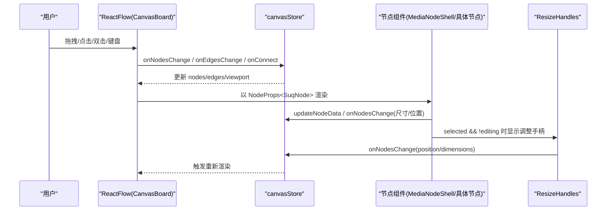
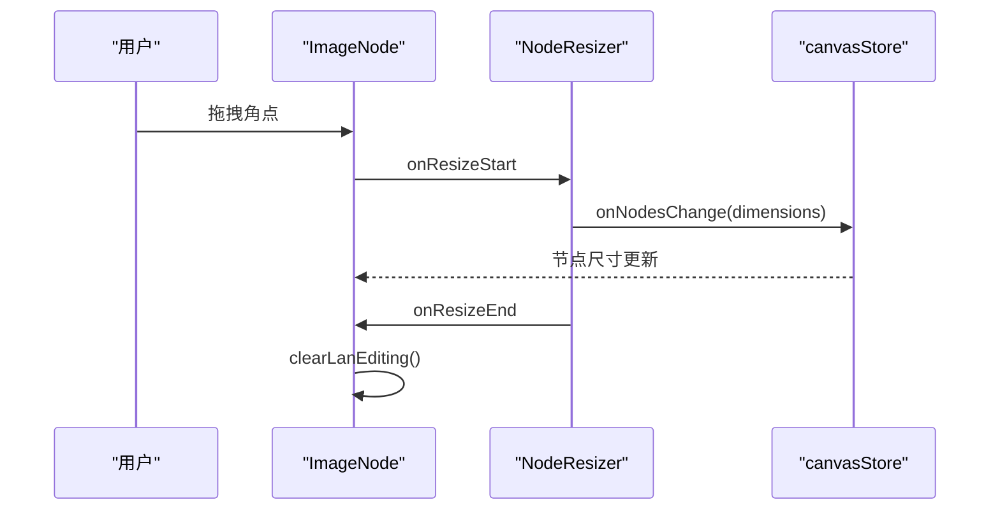
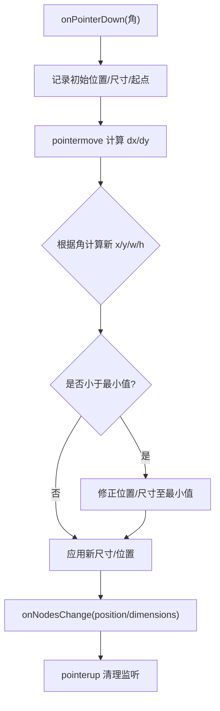
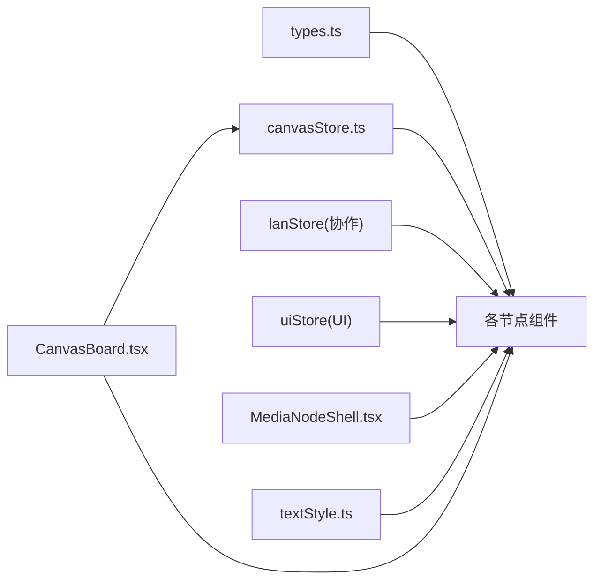

# 自定义节点开发

<cite>
**本文引用的文件**
- [CanvasBoard.tsx](file://src/canvas/CanvasBoard.tsx)
- [nodeTypes.ts](file://src/canvas/nodes/nodeTypes.ts)
- [MediaNodeShell.tsx](file://src/canvas/nodes/MediaNodeShell.tsx)
- [ResizeHandles.tsx](file://src/canvas/nodes/ResizeHandles.tsx)
- [TextNode.tsx](file://src/canvas/nodes/TextNode.tsx)
- [ImageNode.tsx](file://src/canvas/nodes/ImageNode.tsx)
- [StickyNode.tsx](file://src/canvas/nodes/StickyNode.tsx)
- [textStyle.ts](file://src/canvas/nodes/textStyle.ts)
- [types.ts](file://src/types.ts)
- [canvasStore.ts](file://src/store/canvasStore.ts)
- [clipboard.test.ts](file://src/canvas/clipboard.test.ts)
- [fuzzySearch.test.ts](file://src/search/fuzzySearch.test.ts)
</cite>

## 目录
1. [简介](#简介)
2. [项目结构](#项目结构)
3. [核心组件](#核心组件)
4. [架构总览](#架构总览)
5. [详细组件分析](#详细组件分析)
6. [依赖关系分析](#依赖关系分析)
7. [性能考虑](#性能考虑)
8. [故障排查指南](#故障排查指南)
9. [结论](#结论)
10. [附录](#附录)

## 简介
本指南面向希望在当前画布编辑器中实现“自定义节点”的开发者。内容涵盖：
- 节点组件结构与 Props 接口约定
- 状态管理与数据流（基于全局 Store）
- 与画布的交互方式（位置同步、选中态、编辑模式、连线手柄）
- ResizeHandles 的使用与自定义调整手柄的实现
- 节点测试、调试与性能优化最佳实践

本项目基于 ReactFlow，采用 Zustand 管理画布状态，节点通过统一的 MediaNodeShell 提供外壳能力（手柄、底部栏、创建者信息、播放进度遮罩等），并通过 nodeTypes 注册到画布。

## 项目结构
- 画布容器与事件中枢：CanvasBoard.tsx
- 节点类型注册：nodeTypes.ts
- 通用节点外壳：MediaNodeShell.tsx
- 内置节点示例：TextNode.tsx、ImageNode.tsx、StickyNode.tsx
- 尺寸调整手柄：ResizeHandles.tsx
- 文本样式工具：textStyle.ts
- 类型定义：types.ts
- 画布状态管理：canvasStore.ts
- 测试用例：clipboard.test.ts、fuzzySearch.test.ts



**图表来源**
- [CanvasBoard.tsx:195-379](file://src/canvas/CanvasBoard.tsx#L195-L379)
- [nodeTypes.ts:14-26](file://src/canvas/nodes/nodeTypes.ts#L14-L26)
- [MediaNodeShell.tsx:32-150](file://src/canvas/nodes/MediaNodeShell.tsx#L32-L150)
- [TextNode.tsx:13-106](file://src/canvas/nodes/TextNode.tsx#L13-L106)
- [ImageNode.tsx:15-126](file://src/canvas/nodes/ImageNode.tsx#L15-L126)
- [StickyNode.tsx:10-85](file://src/canvas/nodes/StickyNode.tsx#L10-L85)
- [ResizeHandles.tsx:35-117](file://src/canvas/nodes/ResizeHandles.tsx#L35-L117)
- [textStyle.ts:10-21](file://src/canvas/nodes/textStyle.ts#L10-L21)
- [canvasStore.ts:118-399](file://src/store/canvasStore.ts#L118-L399)
- [types.ts:66-112](file://src/types.ts#L66-L112)

**章节来源**
- [CanvasBoard.tsx:195-379](file://src/canvas/CanvasBoard.tsx#L195-L379)
- [nodeTypes.ts:14-26](file://src/canvas/nodes/nodeTypes.ts#L14-L26)

## 核心组件
- 节点外壳 MediaNodeShell：统一渲染四边连接手柄、底部名称栏、创建者标签、播放进度遮罩、局域网锁定提示；在工具切换时主动刷新节点内部测量，保证连线热区生效。
- 节点类型注册 nodeTypes：将具体节点组件映射为字符串类型键，供 ReactFlow 渲染。
- 画布 CanvasBoard：配置 ReactFlow、工具模式、快捷键、拖拽导入、视图同步、选择/连线行为、最小化地图与背景等。
- 状态 canvasStore：集中管理 nodes/edges/viewport、撤销重做历史、对齐/层级、复制粘贴、删除资源联动等。
- 类型 types：定义 SuqNodeData/SuqEdgeData 等扩展字段，约束节点数据模型。

**章节来源**
- [MediaNodeShell.tsx:32-150](file://src/canvas/nodes/MediaNodeShell.tsx#L32-L150)
- [nodeTypes.ts:14-26](file://src/canvas/nodes/nodeTypes.ts#L14-L26)
- [CanvasBoard.tsx:336-379](file://src/canvas/CanvasBoard.tsx#L336-L379)
- [canvasStore.ts:118-399](file://src/store/canvasStore.ts#L118-L399)
- [types.ts:66-112](file://src/types.ts#L66-L112)

## 架构总览
下图展示了从用户操作到节点渲染与状态更新的完整链路，包括位置同步、选中态、编辑模式与调整大小。



**图表来源**
- [CanvasBoard.tsx:66-82](file://src/canvas/CanvasBoard.tsx#L66-L82)
- [canvasStore.ts:126-158](file://src/store/canvasStore.ts#L126-L158)
- [MediaNodeShell.tsx:68-105](file://src/canvas/nodes/MediaNodeShell.tsx#L68-L105)
- [ResizeHandles.tsx:45-103](file://src/canvas/nodes/ResizeHandles.tsx#L45-L103)
- [TextNode.tsx:62-104](file://src/canvas/nodes/TextNode.tsx#L62-L104)

## 详细组件分析

### 节点外壳 MediaNodeShell
- 职责
  - 提供四个方向的标准 Handle（source/target），支持连线。
  - 在“连线模式”下，四条边作为连接热区，提升易用性。
  - 显示底部名称栏、创建者信息、播放进度遮罩。
  - 当其他用户正在编辑某节点时，阻止交互并显示锁定提示。
  - 工具切换时调用 useUpdateNodeInternals 刷新测量，确保热区正确。
- 关键交互
  - 通过 props.node.selected 控制选中态样式。
  - 通过 useLanStore 检测是否被他人锁定，禁用交互。
- 建议
  - 所有业务节点都应包裹在 MediaNodeShell 内，以获得一致的 UI 和交互体验。

**章节来源**
- [MediaNodeShell.tsx:32-150](file://src/canvas/nodes/MediaNodeShell.tsx#L32-L150)

### 文本节点 TextNode
- 功能
  - 支持双击进入编辑模式，失焦或按键提交后更新 data.text。
  - 自动聚焦与全选，便于快速修改。
  - 若该文本节点命名了画布歌单，非编辑态显示“歌单”按钮，点击可播放首曲。
  - 选中且未编辑时显示 ResizeHandles 进行尺寸调整。
- 与 Store 交互
  - 使用 updateNodeData 持久化文本内容与 autoEdit 标志。
  - 通过 onNodesChange 更新尺寸与位置（由 ResizeHandles 触发）。
- 样式
  - 使用 buildTextStyle 生成文本样式，支持水平/垂直对齐、字体、粗细、斜体、下划线、行高。

```mermaid
flowchart TD
Start(["双击文本"]) --> Edit["进入编辑模式<br/>focus/select"]
Edit --> Input["输入/修改文本"]
Input --> Commit{"提交?"}
Commit --> |失焦/Enter(Ctrl/Cmd)| Update["updateNodeData(text)"]
Update --> Exit["退出编辑模式"]
Commit --> |Esc| Exit
Exit --> End(["完成"])
```

**图表来源**
- [TextNode.tsx:23-50](file://src/canvas/nodes/TextNode.tsx#L23-L50)
- [TextNode.tsx:78-101](file://src/canvas/nodes/TextNode.tsx#L78-L101)
- [textStyle.ts:10-21](file://src/canvas/nodes/textStyle.ts#L10-L21)

**章节来源**
- [TextNode.tsx:13-106](file://src/canvas/nodes/TextNode.tsx#L13-L106)
- [textStyle.ts:10-21](file://src/canvas/nodes/textStyle.ts#L10-L21)

### 图片节点 ImageNode
- 功能
  - 使用 ReactFlow 的 NodeResizer 进行自由缩放，保持最小宽高限制。
  - 首次加载完成后根据原图尺寸计算合适缩放，设置节点尺寸。
  - 提供打开大图与下载按钮。
  - 调整大小时通过 setLanEditing/clearLanEditing 通知局域网协作状态。
- 与 Store 交互
  - 通过 onNodesChange 更新 dimensions。
  - 通过 useUiStore 打开图片查看器。
- 协作
  - 若检测到其他用户正在编辑，隐藏调整手柄，避免冲突。



**图表来源**
- [ImageNode.tsx:39-69](file://src/canvas/nodes/ImageNode.tsx#L39-L69)
- [ImageNode.tsx:60-69](file://src/canvas/nodes/ImageNode.tsx#L60-L69)

**章节来源**
- [ImageNode.tsx:15-126](file://src/canvas/nodes/ImageNode.tsx#L15-L126)

### 便签节点 StickyNode
- 功能
  - 支持多种颜色主题，双击编辑文本，失焦或按键提交。
  - 选中且未编辑时显示 ResizeHandles。
- 与 Store 交互
  - 使用 updateNodeData 保存文本与 autoEdit。
  - 通过 setLanEditing/clearLanEditing 同步编辑状态。

**章节来源**
- [StickyNode.tsx:10-85](file://src/canvas/nodes/StickyNode.tsx#L10-L85)

### 尺寸调整 ResizeHandles
- 功能
  - 提供四个角的调整手柄，支持按角拖动改变宽高与位置。
  - 限制最小宽高，防止节点过小不可用。
  - 通过 screenToFlowPosition 将屏幕坐标转换为 Flow 坐标，保证缩放/平移下的准确性。
  - 实时更新 position 与 dimensions，并写入 Store。
- 使用方式
  - 在节点组件中，当 selected 且未处于编辑态时渲染 <ResizeHandles nodeId={id} />。
- 自定义扩展
  - 可复制其指针事件处理逻辑，结合 useCanvasStore.onNodesChange 实现自定义手柄（例如顶部/左侧手柄、比例锁等）。



**图表来源**
- [ResizeHandles.tsx:45-103](file://src/canvas/nodes/ResizeHandles.tsx#L45-L103)

**章节来源**
- [ResizeHandles.tsx:35-117](file://src/canvas/nodes/ResizeHandles.tsx#L35-L117)

### 节点类型注册与画布集成
- 在 nodeTypes 中将组件映射为字符串类型键，如 image、video、text、sticky、shape 等。
- CanvasBoard 通过 nodeTypes 将这些组件注入 ReactFlow，从而支持动态渲染。
- 画布还负责：
  - 工具模式切换（选择/连线/拖动）
  - 快捷键（Ctrl+Z/Y/D/C/V/A/F）
  - 拖拽导入文件、粘贴图片
  - 视图同步与最小化地图

**章节来源**
- [nodeTypes.ts:14-26](file://src/canvas/nodes/nodeTypes.ts#L14-L26)
- [CanvasBoard.tsx:195-379](file://src/canvas/CanvasBoard.tsx#L195-L379)

## 依赖关系分析
- 节点组件依赖
  - 类型定义：SuqNodeData/SuqNode（types.ts）
  - 状态管理：useCanvasStore（canvasStore.ts）
  - 协作状态：useLanStore（用于锁定/编辑态）
  - UI 能力：useUiStore（弹窗/工具模式等）
  - 样式工具：buildTextStyle（textStyle.ts）
  - 外壳组件：MediaNodeShell（统一交互与UI）
- 画布依赖
  - ReactFlow API：useReactFlow、useStoreApi、NodeResizer、Handle 等
  - 事件：onNodesChange、onEdgesChange、onConnect、onNodeDragStart/Stop
  - 视图：fitView、setCenter、zoomIn/Out、setViewport
  - 插件：Background、Controls、MiniMap



**图表来源**
- [types.ts:66-112](file://src/types.ts#L66-L112)
- [canvasStore.ts:118-399](file://src/store/canvasStore.ts#L118-L399)
- [MediaNodeShell.tsx:32-150](file://src/canvas/nodes/MediaNodeShell.tsx#L32-L150)
- [textStyle.ts:10-21](file://src/canvas/nodes/textStyle.ts#L10-L21)
- [CanvasBoard.tsx:195-379](file://src/canvas/CanvasBoard.tsx#L195-L379)

**章节来源**
- [types.ts:66-112](file://src/types.ts#L66-L112)
- [canvasStore.ts:118-399](file://src/store/canvasStore.ts#L118-L399)
- [MediaNodeShell.tsx:32-150](file://src/canvas/nodes/MediaNodeShell.tsx#L32-L150)
- [textStyle.ts:10-21](file://src/canvas/nodes/textStyle.ts#L10-L21)
- [CanvasBoard.tsx:195-379](file://src/canvas/CanvasBoard.tsx#L195-L379)

## 性能考虑
- 使用 memo 包裹节点组件，减少不必要的重渲染（已在 TextNode、ImageNode、StickyNode、MediaNodeShell 中使用）。
- 尽量通过 onNodesChange 批量更新，避免多次 setState。
- 使用 useUpdateNodeInternals 仅在必要时刷新测量，避免频繁触发。
- 图片加载完成后一次性设置尺寸，避免重复计算。
- 历史记录防抖合并，减少快照频率（HISTORY_DEBOUNCE）。
- 在协作场景下，及时 clearLanEditing，释放锁定，避免阻塞其他用户。

[本节为通用性能建议，不直接引用具体代码]

## 故障排查指南
- 节点无法调整大小
  - 检查是否在编辑态（editing=true 时不应显示 ResizeHandles）。
  - 确认 selected 为 true，且未被其他用户锁定（useLanStore.editing）。
  - 确认 onNodesChange 已正确传入 { type: 'dimensions', dimensions }。
- 文本编辑不生效
  - 检查 onBlur/按键回调是否正确调用 updateNodeData。
  - 确认 autoEdit 标志在提交后被重置。
- 连线无效
  - 确认工具模式为 connect，且节点四边 Handle 的 isConnectable 正确。
  - 检查 isValidConnection 是否允许连接。
- 协作冲突
  - 观察锁定提示，确认 clearLanEditing 在操作结束后被调用。
- 剪贴板/搜索相关
  - 参考 clipboard.test.ts 与 fuzzySearch.test.ts 中的断言，验证行为是否符合预期。

**章节来源**
- [ResizeHandles.tsx:45-103](file://src/canvas/nodes/ResizeHandles.tsx#L45-L103)
- [TextNode.tsx:23-50](file://src/canvas/nodes/TextNode.tsx#L23-L50)
- [MediaNodeShell.tsx:44-66](file://src/canvas/nodes/MediaNodeShell.tsx#L44-L66)
- [Clipboard.test.ts:15-39](file://src/canvas/clipboard.test.ts#L15-L39)
- [FuzzySearch.test.ts:14-32](file://src/search/fuzzySearch.test.ts#L14-L32)

## 结论
- 自定义节点应基于 MediaNodeShell 构建，复用统一的手柄、底部栏、协作锁定与进度遮罩能力。
- 通过 nodeTypes 注册节点类型，并在 CanvasBoard 中统一管理画布行为。
- 使用 canvasStore 的 onNodesChange/updateNodeData 进行数据同步，确保撤销/重做与历史一致。
- 使用 ResizeHandles 或 NodeResizer 实现尺寸调整，注意最小尺寸与协作锁定。
- 借助现有测试用例与工具函数，完善节点的行为验证与用户体验。

[本节为总结性内容，不直接引用具体代码]

## 附录

### 节点 Props 与数据模型
- 节点接收 NodeProps<SuqNode>，其中 data 为 SuqNodeData，包含 kind、label、text、尺寸、样式、创建信息等字段。
- 常见字段
  - kind：节点类型标识（image/video/audio/text/sticky/shape 等）
  - label：显示名称
  - text：文本内容（文本/便签类）
  - width/height/style.width/style.height：尺寸
  - textAlign/textAlignV/fontSize/fontFamily/textColor/bold/italic/underline/lineHeight：文本样式
  - createdById/createdByName/createdAt：插入元信息
  - coverAssetId：音乐封面素材 id
  - level/color/shape/fill：特定节点属性

**章节来源**
- [types.ts:66-112](file://src/types.ts#L66-L112)

### 节点生命周期说明
- 本项目节点为函数式组件，遵循 React 生命周期：
  - 初始化：组件挂载时执行副作用（如自动编辑、焦点设置、协作状态上报）。
  - 更新：props.data 变化时触发重新渲染与必要副作用。
  - 卸载：清理事件监听、协作状态（clearLanEditing）。
- 画布级生命周期
  - onNodeDragStart/onNodeDragStop：开始/结束拖拽时上报协作编辑状态。
  - onNodesChange/onEdgesChange：变更时写入 Store 并维护历史。
  - onConnect：新建边时写入 edges。

**章节来源**
- [CanvasBoard.tsx:76-82](file://src/canvas/CanvasBoard.tsx#L76-L82)
- [canvasStore.ts:126-158](file://src/store/canvasStore.ts#L126-L158)
- [TextNode.tsx:23-45](file://src/canvas/nodes/TextNode.tsx#L23-L45)
- [StickyNode.tsx:17-36](file://src/canvas/nodes/StickyNode.tsx#L17-L36)

### 与画布的交互要点
- 位置同步：通过 onNodesChange({ type: 'position', position }) 更新节点位置。
- 选中状态：由 ReactFlow 管理 selected，节点组件读取 props.selected 控制 UI。
- 编辑模式：本地 editing 状态控制编辑框显隐，提交后更新 data 并退出编辑。
- 连线：四边 Handle 在连线模式下作为热区，支持从任意边引出/接入。

**章节来源**
- [CanvasBoard.tsx:66-82](file://src/canvas/CanvasBoard.tsx#L66-L82)
- [MediaNodeShell.tsx:68-105](file://src/canvas/nodes/MediaNodeShell.tsx#L68-L105)
- [ResizeHandles.tsx:89-92](file://src/canvas/nodes/ResizeHandles.tsx#L89-L92)

### 测试与调试建议
- 单元测试
  - 使用 Vitest 编写测试，覆盖剪贴板、搜索等纯函数逻辑。
  - 对节点行为可通过模拟 Store 与 ReactFlow 上下文进行测试。
- 调试技巧
  - 利用浏览器控制台输出 Store 状态（nodes/edges/viewport）。
  - 通过 MiniMap 与 Controls 辅助定位问题。
  - 协作场景下观察锁定提示与光标位置。

**章节来源**
- [clipboard.test.ts:1-40](file://src/canvas/clipboard.test.ts#L1-L40)
- [fuzzySearch.test.ts:1-33](file://src/search/fuzzySearch.test.ts#L1-L33)