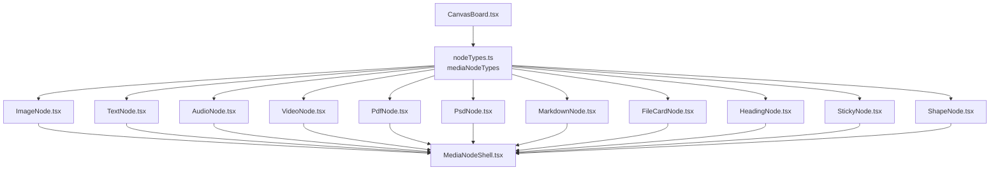
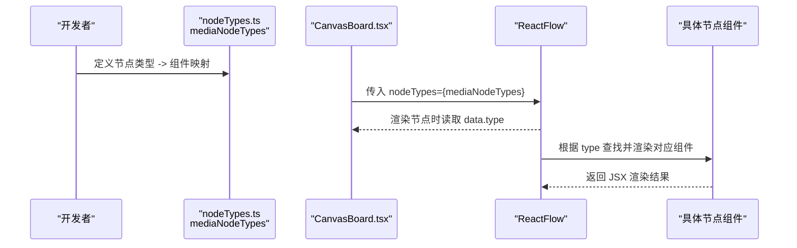
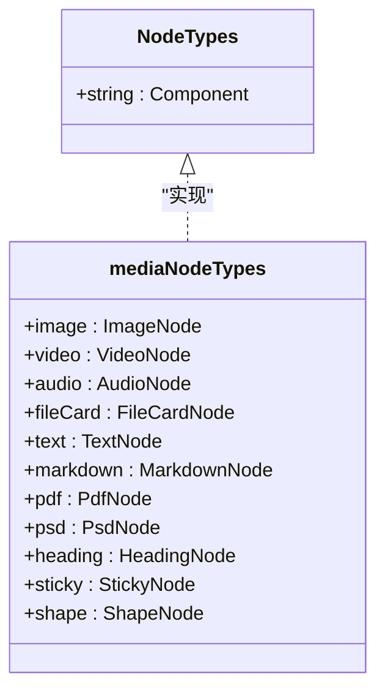
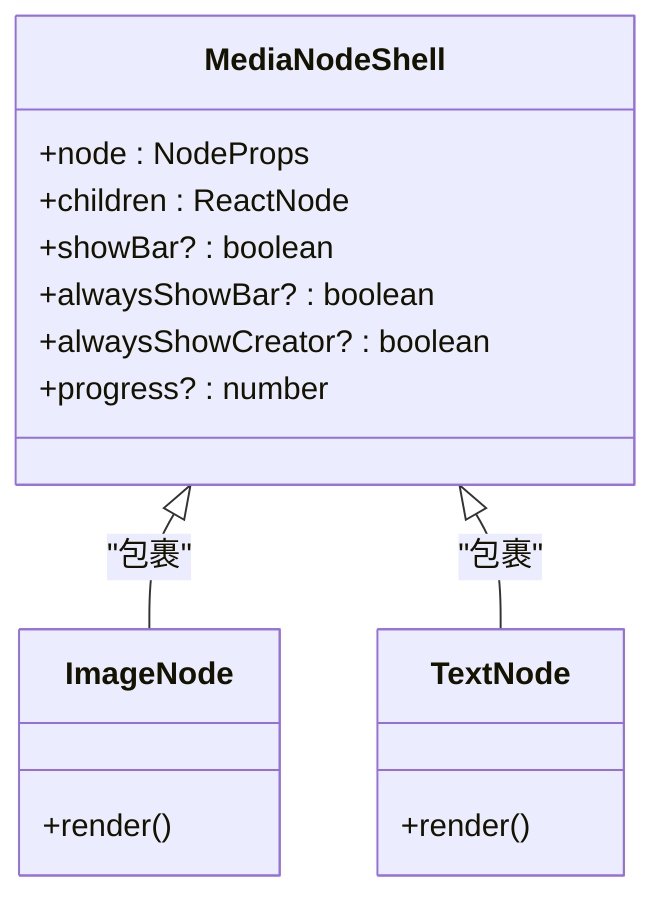
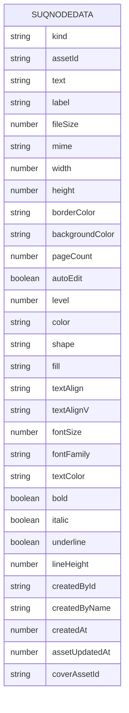
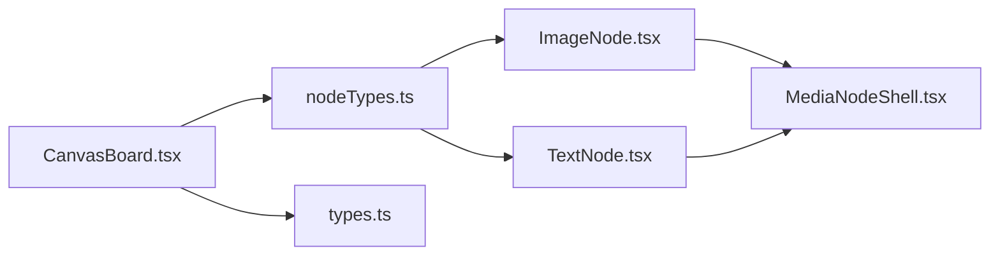

# 节点注册 API

<cite>
**本文引用的文件**
- [src/canvas/nodes/nodeTypes.ts](file://src/canvas/nodes/nodeTypes.ts)
- [src/canvas/CanvasBoard.tsx](file://src/canvas/CanvasBoard.tsx)
- [src/types.ts](file://src/types.ts)
- [src/canvas/nodes/MediaNodeShell.tsx](file://src/canvas/nodes/MediaNodeShell.tsx)
- [src/canvas/nodes/ImageNode.tsx](file://src/canvas/nodes/ImageNode.tsx)
- [src/canvas/nodes/TextNode.tsx](file://src/canvas/nodes/TextNode.tsx)
</cite>

## 目录
1. [简介](#简介)
2. [项目结构](#项目结构)
3. [核心组件](#核心组件)
4. [架构总览](#架构总览)
5. [详细组件分析](#详细组件分析)
6. [依赖关系分析](#依赖关系分析)
7. [性能考量](#性能考量)
8. [故障排查指南](#故障排查指南)
9. [结论](#结论)
10. [附录：完整注册示例与最佳实践](#附录完整注册示例与最佳实践)

## 简介
本文件面向希望在画布中扩展自定义节点类型的开发者，详细说明如何通过 mediaNodeTypes 对象注册新的节点类型，并解释 NodeTypes 接口的使用方式、节点类型映射机制、如何为不同类型指定 React 组件，以及命名规范与最佳实践。文档同时提供完整的节点注册流程说明（导入依赖、定义节点类型、导出配置），帮助快速集成到现有项目中。

## 项目结构
本项目基于 @xyflow/react 的 ReactFlow 构建可视化画布。节点类型集中注册在 nodes/nodeTypes.ts 中，由 CanvasBoard 作为入口注入到 ReactFlow 组件。每个具体节点以独立的 React 组件实现，并通过统一的 MediaNodeShell 提供一致的边框、连接点、底部信息栏等通用能力。

图表来源
- [src/canvas/CanvasBoard.tsx:195-341](file://src/canvas/CanvasBoard.tsx#L195-L341)
- [src/canvas/nodes/nodeTypes.ts:14-26](file://src/canvas/nodes/nodeTypes.ts#L14-L26)
- [src/canvas/nodes/MediaNodeShell.tsx:32-151](file://src/canvas/nodes/MediaNodeShell.tsx#L32-L151)

章节来源
- [src/canvas/CanvasBoard.tsx:195-341](file://src/canvas/CanvasBoard.tsx#L195-L341)
- [src/canvas/nodes/nodeTypes.ts:14-26](file://src/canvas/nodes/nodeTypes.ts#L14-L26)

## 核心组件
- mediaNodeTypes：集中导出节点类型到组件的映射表，类型为 @xyflow/react 的 NodeTypes。键为字符串类型的节点类型名，值为对应的 React 组件。
- CanvasBoard：将 mediaNodeTypes 通过 ReactFlow 的 nodeTypes 属性注入，使画布识别并渲染对应节点。
- MediaNodeShell：所有媒体类节点的统一外壳，提供四边连接点、选中态、底部名称栏、创建者角标、播放进度遮罩等通用 UI。
- 各节点组件：如 ImageNode、TextNode 等，负责各自业务渲染与交互，通常包裹在 MediaNodeShell 内。

章节来源
- [src/canvas/nodes/nodeTypes.ts:14-26](file://src/canvas/nodes/nodeTypes.ts#L14-L26)
- [src/canvas/CanvasBoard.tsx:195-341](file://src/canvas/CanvasBoard.tsx#L195-L341)
- [src/canvas/nodes/MediaNodeShell.tsx:32-151](file://src/canvas/nodes/MediaNodeShell.tsx#L32-L151)

## 架构总览
下图展示了从注册到渲染的关键流程：在 nodeTypes.ts 中声明节点类型映射；CanvasBoard 将该映射传入 ReactFlow；ReactFlow 根据节点数据的 type 字段选择对应组件进行渲染。

图表来源
- [src/canvas/nodes/nodeTypes.ts:14-26](file://src/canvas/nodes/nodeTypes.ts#L14-L26)
- [src/canvas/CanvasBoard.tsx:195-341](file://src/canvas/CanvasBoard.tsx#L195-L341)

## 详细组件分析

### 节点类型映射机制
- 映射位置：src/canvas/nodes/nodeTypes.ts 中的 mediaNodeTypes 对象。
- 键值约定：键为节点类型字符串（如 image、video、text 等），值为对应的 React 组件函数或类。
- 类型约束：该对象类型为 @xyflow/react 的 NodeTypes，确保键值对符合框架要求。
- 使用方式：在 CanvasBoard 中通过 useMemo 缓存后，作为 ReactFlow 的 nodeTypes 属性传入。

图表来源
- [src/canvas/nodes/nodeTypes.ts:14-26](file://src/canvas/nodes/nodeTypes.ts#L14-L26)

章节来源
- [src/canvas/nodes/nodeTypes.ts:14-26](file://src/canvas/nodes/nodeTypes.ts#L14-L26)
- [src/canvas/CanvasBoard.tsx:195-196](file://src/canvas/CanvasBoard.tsx#L195-L196)

### 节点类型与 React 组件的绑定
- 绑定方式：在 mediaNodeTypes 中将类型名与组件一一对应。
- 渲染过程：ReactFlow 根据节点数据中的 type 字段匹配 mediaNodeTypes 中的键，找到对应组件并渲染。
- 示例类型：image、video、audio、text、markdown、pdf、psd、fileCard、heading、sticky、shape。

章节来源
- [src/canvas/nodes/nodeTypes.ts:14-26](file://src/canvas/nodes/nodeTypes.ts#L14-L26)

### 节点组件结构与通用外壳
- 通用外壳：MediaNodeShell 提供统一边框、四边连接点、底部名称栏、创建者角标、播放进度遮罩等。
- 节点组件：各节点组件（如 ImageNode、TextNode）内部包含业务逻辑，并通过 MediaNodeShell 包裹以获得一致体验。
- 连接点：MediaNodeShell 在每个边的两侧分别提供 source 和 target 连接点，支持连线模式下的热区连接。

图表来源
- [src/canvas/nodes/MediaNodeShell.tsx:32-151](file://src/canvas/nodes/MediaNodeShell.tsx#L32-L151)
- [src/canvas/nodes/ImageNode.tsx:15-126](file://src/canvas/nodes/ImageNode.tsx#L15-L126)
- [src/canvas/nodes/TextNode.tsx:13-107](file://src/canvas/nodes/TextNode.tsx#L13-L107)

章节来源
- [src/canvas/nodes/MediaNodeShell.tsx:32-151](file://src/canvas/nodes/MediaNodeShell.tsx#L32-L151)
- [src/canvas/nodes/ImageNode.tsx:15-126](file://src/canvas/nodes/ImageNode.tsx#L15-L126)
- [src/canvas/nodes/TextNode.tsx:13-107](file://src/canvas/nodes/TextNode.tsx#L13-L107)

### 节点数据模型与 kind 字段
- 节点数据类型：SuqNodeData 定义了节点数据的通用字段，包括 kind、assetId、text、label、尺寸、颜色、文本样式等。
- kind 枚举：MediaKind 限定了支持的节点种类，如 image、video、audio、pdf、psd、markdown、text、file、heading、sticky、shape。
- 作用：kind 用于标识节点的业务类型，配合 MediaNodeShell 的 KindIcon 显示图标，便于用户识别。

图表来源
- [src/types.ts:66-98](file://src/types.ts#L66-L98)

章节来源
- [src/types.ts:3-14](file://src/types.ts#L3-L14)
- [src/types.ts:66-98](file://src/types.ts#L66-L98)

## 依赖关系分析
- CanvasBoard 依赖 mediaNodeTypes，并将其注入到 ReactFlow。
- 各节点组件依赖 MediaNodeShell 提供通用 UI。
- 节点数据依赖 types.ts 中的 SuqNodeData 与 MediaKind，保证数据结构一致性。

图表来源
- [src/canvas/CanvasBoard.tsx:195-341](file://src/canvas/CanvasBoard.tsx#L195-L341)
- [src/canvas/nodes/nodeTypes.ts:14-26](file://src/canvas/nodes/nodeTypes.ts#L14-L26)
- [src/canvas/nodes/MediaNodeShell.tsx:32-151](file://src/canvas/nodes/MediaNodeShell.tsx#L32-L151)
- [src/types.ts:66-98](file://src/types.ts#L66-L98)

章节来源
- [src/canvas/CanvasBoard.tsx:195-341](file://src/canvas/CanvasBoard.tsx#L195-L341)
- [src/canvas/nodes/nodeTypes.ts:14-26](file://src/canvas/nodes/nodeTypes.ts#L14-L26)
- [src/types.ts:66-98](file://src/types.ts#L66-L98)

## 性能考量
- 组件 memo：节点组件普遍使用 memo 包裹，减少不必要的重渲染。
- 连接点热区：MediaNodeShell 在连线模式下启用边条带热区，提升连接效率。
- 懒加载与占位：图片节点在加载过程中使用占位层与淡入效果，避免闪烁。
- 状态同步：通过 useUpdateNodeInternals 在工具切换时刷新节点内部测量，保证连接行为正确。

章节来源
- [src/canvas/nodes/ImageNode.tsx:15-126](file://src/canvas/nodes/ImageNode.tsx#L15-L126)
- [src/canvas/nodes/MediaNodeShell.tsx:32-151](file://src/canvas/nodes/MediaNodeShell.tsx#L32-L151)

## 故障排查指南
- 节点未渲染：检查 mediaNodeTypes 是否包含对应类型键，且 CanvasBoard 已正确传入 nodeTypes。
- 连接点不可用：确认当前工具是否为连线模式，MediaNodeShell 会在 connect 模式下启用边条带连接点。
- 节点被锁定：若其他用户正在编辑，节点会被锁定并提示，等待对方结束编辑后再操作。
- 数据不一致：确保节点数据的 kind 与节点类型一致，避免渲染异常。

章节来源
- [src/canvas/CanvasBoard.tsx:195-341](file://src/canvas/CanvasBoard.tsx#L195-L341)
- [src/canvas/nodes/MediaNodeShell.tsx:32-151](file://src/canvas/nodes/MediaNodeShell.tsx#L32-L151)

## 结论
通过 mediaNodeTypes 集中注册节点类型，结合 ReactFlow 的 nodeTypes 机制，可以灵活扩展画布的节点能力。遵循统一的节点数据模型与外壳组件，能够保证不同节点的一致体验与可维护性。建议新增节点时严格遵循命名规范与最佳实践，确保类型安全与渲染性能。

## 附录：完整注册示例与最佳实践

### 注册步骤概览
- 导入依赖：从 @xyflow/react 引入 NodeTypes 类型，从节点目录导入具体组件。
- 定义映射：在 mediaNodeTypes 中添加新类型键与组件值的映射。
- 导出配置：保持 mediaNodeTypes 为默认导出或按需导出，供 CanvasBoard 使用。
- 注入画布：CanvasBoard 已通过 useMemo 缓存并传入 ReactFlow 的 nodeTypes。

章节来源
- [src/canvas/nodes/nodeTypes.ts:1-26](file://src/canvas/nodes/nodeTypes.ts#L1-L26)
- [src/canvas/CanvasBoard.tsx:195-341](file://src/canvas/CanvasBoard.tsx#L195-L341)

### 节点类型命名规范
- 使用小写驼峰或短横线分隔的英文单词，如 image、video、text、markdown、fileCard、heading、sticky、shape。
- 与 MediaKind 保持一致，确保 kind 字段与节点类型语义一致。
- 避免使用保留字或特殊字符，确保类型键稳定且可读。

章节来源
- [src/types.ts:3-14](file://src/types.ts#L3-L14)
- [src/canvas/nodes/nodeTypes.ts:14-26](file://src/canvas/nodes/nodeTypes.ts#L14-L26)

### 最佳实践
- 使用 MediaNodeShell 包裹节点内容，获得一致的边框、连接点与底部信息栏。
- 节点组件使用 memo 包裹，减少重渲染开销。
- 在节点数据中使用 kind 明确标识类型，便于 UI 展示与逻辑判断。
- 在连线模式下利用 MediaNodeShell 的四边连接点，提升连接体验。
- 对于需要编辑的节点，使用自动编辑与局域网编辑锁，避免冲突。

章节来源
- [src/canvas/nodes/MediaNodeShell.tsx:32-151](file://src/canvas/nodes/MediaNodeShell.tsx#L32-L151)
- [src/canvas/nodes/ImageNode.tsx:15-126](file://src/canvas/nodes/ImageNode.tsx#L15-L126)
- [src/canvas/nodes/TextNode.tsx:13-107](file://src/canvas/nodes/TextNode.tsx#L13-L107)