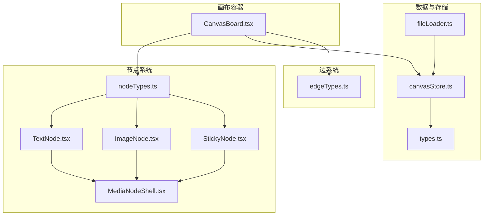
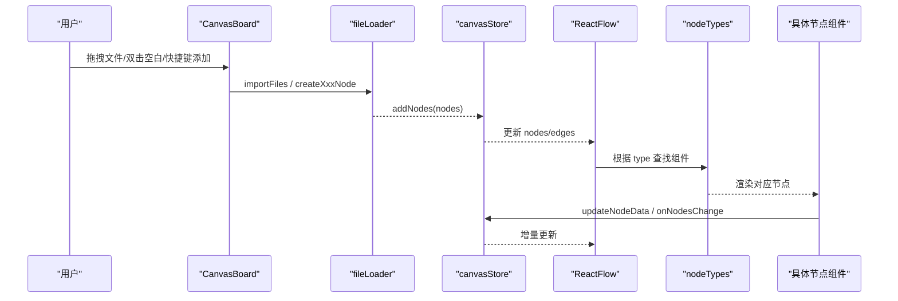
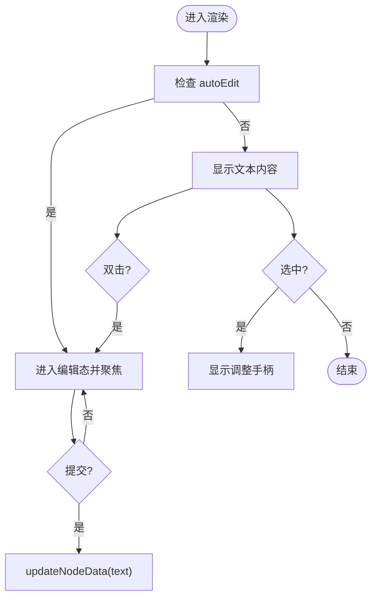
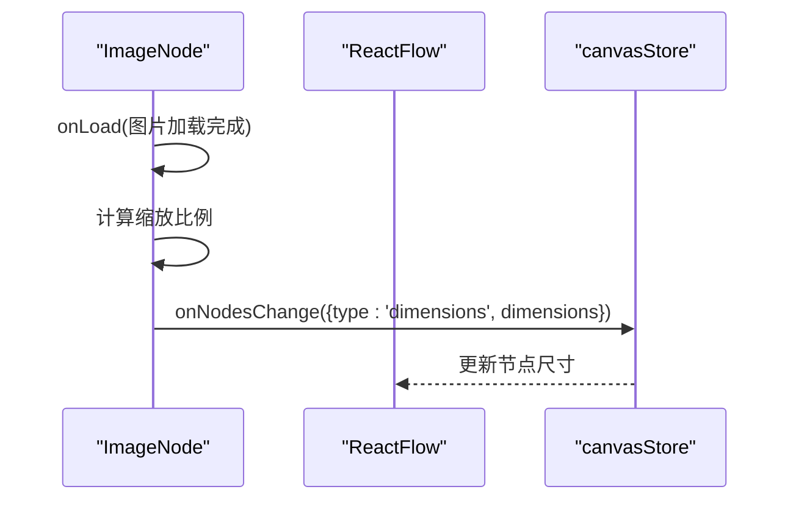
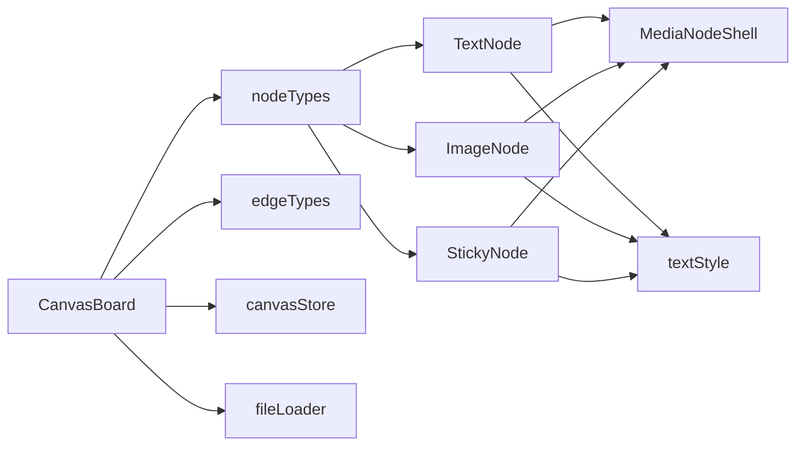

# 节点类型 API

<cite>
**本文引用的文件**
- [src/canvas/nodes/nodeTypes.ts](file://src/canvas/nodes/nodeTypes.ts)
- [src/types.ts](file://src/types.ts)
- [src/store/canvasStore.ts](file://src/store/canvasStore.ts)
- [src/canvas/CanvasBoard.tsx](file://src/canvas/CanvasBoard.tsx)
- [src/io/fileLoader.ts](file://src/io/fileLoader.ts)
- [src/canvas/nodes/MediaNodeShell.tsx](file://src/canvas/nodes/MediaNodeShell.tsx)
- [src/canvas/nodes/textStyle.ts](file://src/canvas/nodes/textStyle.ts)
- [src/canvas/nodes/TextNode.tsx](file://src/canvas/nodes/TextNode.tsx)
- [src/canvas/nodes/ImageNode.tsx](file://src/canvas/nodes/ImageNode.tsx)
- [src/canvas/nodes/StickyNode.tsx](file://src/canvas/nodes/StickyNode.tsx)
- [src/canvas/edges/edgeTypes.ts](file://src/canvas/edges/edgeTypes.ts)
</cite>

## 目录
1. [简介](#简介)
2. [项目结构](#项目结构)
3. [核心组件](#核心组件)
4. [架构总览](#架构总览)
5. [详细组件分析](#详细组件分析)
6. [依赖关系分析](#依赖关系分析)
7. [性能考量](#性能考量)
8. [故障排查指南](#故障排查指南)
9. [结论](#结论)
10. [附录](#附录)

## 简介
本文件面向希望在画布编辑器中扩展与定制“节点类型”的开发者，系统性说明：
- 如何注册自定义节点类型（通过 nodeTypes）
- 内置节点类型的属性与事件接口
- 数据模型 SuqNodeData 在不同节点中的具体应用
- 自定义节点开发完整指南（组件实现、样式定制、交互逻辑）
- 节点生命周期管理与性能优化技巧

## 项目结构
本项目基于 ReactFlow 构建可视化画布，节点类型集中在 nodes 目录，统一通过 mediaNodeTypes 暴露给 ReactFlow。画布容器 CanvasBoard 负责装配 nodeTypes、edgeTypes 以及全局交互（拖拽导入、快捷键、视图同步等）。数据状态由 zustand store 管理，素材与节点创建由 fileLoader 提供。

图表来源
- [src/canvas/CanvasBoard.tsx:195-341](file://src/canvas/CanvasBoard.tsx#L195-L341)
- [src/canvas/nodes/nodeTypes.ts:14-26](file://src/canvas/nodes/nodeTypes.ts#L14-L26)
- [src/canvas/nodes/MediaNodeShell.tsx:32-149](file://src/canvas/nodes/MediaNodeShell.tsx#L32-L149)
- [src/types.ts:66-107](file://src/types.ts#L66-L107)
- [src/store/canvasStore.ts:118-191](file://src/store/canvasStore.ts#L118-L191)
- [src/io/fileLoader.ts:165-297](file://src/io/fileLoader.ts#L165-L297)
- [src/canvas/edges/edgeTypes.ts:4-6](file://src/canvas/edges/edgeTypes.ts#L4-L6)

章节来源
- [src/canvas/CanvasBoard.tsx:195-341](file://src/canvas/CanvasBoard.tsx#L195-L341)
- [src/canvas/nodes/nodeTypes.ts:14-26](file://src/canvas/nodes/nodeTypes.ts#L14-L26)
- [src/types.ts:66-107](file://src/types.ts#L66-L107)
- [src/store/canvasStore.ts:118-191](file://src/store/canvasStore.ts#L118-L191)
- [src/io/fileLoader.ts:165-297](file://src/io/fileLoader.ts#L165-L297)
- [src/canvas/edges/edgeTypes.ts:4-6](file://src/canvas/edges/edgeTypes.ts#L4-L6)

## 核心组件
- 节点类型注册表：mediaNodeTypes 将字符串类型名映射到 React 组件，供 ReactFlow 渲染。
- 画布容器：CanvasBoard 注入 nodeTypes、edgeTypes，处理节点增删改、连线、工具模式、快捷键、拖拽导入、视图同步等。
- 通用外壳：MediaNodeShell 为所有媒体类节点提供统一的边框、手柄、底部信息栏、协作者锁定提示、播放进度遮罩等。
- 文本样式工具：textStyle 根据 SuqNodeData 生成 CSS 样式对象。
- 数据模型：types.ts 定义 SuqNodeData、SuqEdgeData、SuqNode、SuqEdge 等核心类型。
- 状态管理：canvasStore.ts 维护节点/边集合、撤销重做、对齐、层级、复制粘贴、视口等。
- 文件导入与节点创建：fileLoader.ts 将文件转为资产并创建对应节点，也提供 createTextNode/createHeadingNode/createStickyNode/createShapeNode 等工厂函数。

章节来源
- [src/canvas/nodes/nodeTypes.ts:14-26](file://src/canvas/nodes/nodeTypes.ts#L14-L26)
- [src/canvas/CanvasBoard.tsx:195-341](file://src/canvas/CanvasBoard.tsx#L195-L341)
- [src/canvas/nodes/MediaNodeShell.tsx:32-149](file://src/canvas/nodes/MediaNodeShell.tsx#L32-L149)
- [src/canvas/nodes/textStyle.ts:10-21](file://src/canvas/nodes/textStyle.ts#L10-L21)
- [src/types.ts:66-107](file://src/types.ts#L66-L107)
- [src/store/canvasStore.ts:118-191](file://src/store/canvasStore.ts#L118-L191)
- [src/io/fileLoader.ts:165-297](file://src/io/fileLoader.ts#L165-L297)

## 架构总览
下图展示了从用户操作到节点渲染的数据流与组件协作关系。

图表来源
- [src/canvas/CanvasBoard.tsx:222-240](file://src/canvas/CanvasBoard.tsx#L222-L240)
- [src/io/fileLoader.ts:186-205](file://src/io/fileLoader.ts#L186-L205)
- [src/store/canvasStore.ts:159-171](file://src/store/canvasStore.ts#L159-L171)
- [src/canvas/nodes/nodeTypes.ts:14-26](file://src/canvas/nodes/nodeTypes.ts#L14-L26)

## 详细组件分析

### 节点类型注册与扩展（nodeTypes）
- 注册方式：在 mediaNodeTypes 中将“类型名”映射到组件。例如 image、video、audio、text、markdown、pdf、psd、heading、sticky、shape。
- 扩展步骤：
  1) 新建节点组件（遵循 NodeProps<SuqNode>），内部可复用 MediaNodeShell 获得统一外壳与手柄。
  2) 在 nodeTypes.ts 中新增映射项。
  3) 如需默认尺寸或初始 data，可在 fileLoader.ts 中添加对应的 createXxxNode 工厂函数，并在 CanvasBoard 的事件处理器中调用。
- 注意：类型名需与节点 data.kind 保持一致，便于统一识别与展示。

章节来源
- [src/canvas/nodes/nodeTypes.ts:14-26](file://src/canvas/nodes/nodeTypes.ts#L14-L26)
- [src/io/fileLoader.ts:137-149](file://src/io/fileLoader.ts#L137-L149)
- [src/canvas/CanvasBoard.tsx:244-261](file://src/canvas/CanvasBoard.tsx#L244-L261)

### 数据模型 SuqNodeData 的应用
- 通用字段：kind、assetId、label、fileSize、mime、width、height、borderColor、backgroundColor、pageCount、autoEdit 等。
- 文本相关：text、textAlign、textAlignV、fontSize、fontFamily、textColor、bold、italic、underline、lineHeight。
- 标题与便签：level（1|2|3）、color（便签颜色）。
- 形状：shape（rect|ellipse）、fill。
- 音乐封面：coverAssetId。
- 元数据：createdById、createdByName、createdAt、assetUpdatedAt。
- 使用建议：
  - 文本/标题/便签/形状节点主要使用 text 系列与排版字段。
  - 媒体类节点（image/video/audio/pdf/psd）使用 assetId、label、fileSize、mime。
  - 便签使用 color；标题使用 level；形状使用 shape 与 fill。
  - autoEdit 用于新节点自动进入编辑态。

章节来源
- [src/types.ts:66-98](file://src/types.ts#L66-L98)
- [src/canvas/nodes/textStyle.ts:10-21](file://src/canvas/nodes/textStyle.ts#L10-L21)
- [src/io/fileLoader.ts:165-297](file://src/io/fileLoader.ts#L165-L297)

### 内置节点类型与事件接口

#### 文本节点 TextNode
- 功能要点：
  - 支持多行文本编辑，Enter+Ctrl/Cmd 提交，Esc 取消。
  - 自动聚焦与选择文本（autoEdit）。
  - 若该文本节点命名了歌单（通过出边连接音频首节点），显示“歌单”按钮并可直接播放。
  - 使用 buildTextStyle 与 V_JUSTIFY 控制排版。
- 事件与交互：
  - 双击进入编辑；失焦或快捷键提交；选中时显示 ResizeHandles。
  - 编辑期间通过 LAN 标记“正在编辑”，避免冲突。
- 数据字段：text、textAlign、textAlignV、fontSize、fontFamily、textColor、bold、italic、underline、lineHeight、autoEdit。

图表来源
- [src/canvas/nodes/TextNode.tsx:13-106](file://src/canvas/nodes/TextNode.tsx#L13-L106)
- [src/canvas/nodes/textStyle.ts:10-21](file://src/canvas/nodes/textStyle.ts#L10-L21)

章节来源
- [src/canvas/nodes/TextNode.tsx:13-106](file://src/canvas/nodes/TextNode.tsx#L13-L106)
- [src/canvas/nodes/textStyle.ts:10-21](file://src/canvas/nodes/textStyle.ts#L10-L21)

#### 图片节点 ImageNode
- 功能要点：
  - 首次加载后按最大宽高限制计算初始尺寸，并通过 dimensions 更新节点大小。
  - 支持打开大图查看与下载。
  - 使用 NodeResizer 调整尺寸，编辑期间通过 LAN 标记“正在编辑”。
- 事件与交互：
  - 双击打开大图；悬停显示工具条；选中显示调整手柄。
- 数据字段：assetId、label、fileSize、mime、borderColor。

图表来源
- [src/canvas/nodes/ImageNode.tsx:39-56](file://src/canvas/nodes/ImageNode.tsx#L39-L56)
- [src/store/canvasStore.ts:126-135](file://src/store/canvasStore.ts#L126-L135)

章节来源
- [src/canvas/nodes/ImageNode.tsx:15-126](file://src/canvas/nodes/ImageNode.tsx#L15-L126)

#### 便签节点 StickyNode
- 功能要点：
  - 基于 STICKY_COLORS 设置背景与边框色。
  - 支持多行文本编辑与自动聚焦。
  - 使用 buildTextStyle 与 V_JUSTIFY 控制排版。
- 事件与交互：
  - 双击编辑；失焦或快捷键提交；选中显示 ResizeHandles。
- 数据字段：color、text、textAlign、textAlignV、fontSize、fontFamily、textColor、bold、italic、underline、lineHeight、autoEdit。

章节来源
- [src/canvas/nodes/StickyNode.tsx:10-85](file://src/canvas/nodes/StickyNode.tsx#L10-L85)
- [src/types.ts:26-35](file://src/types.ts#L26-L35)

#### 其他内置节点
- 视频/音频/PDF/PSD/Markdown/文件卡片/标题/形状：均通过 nodeTypes.ts 注册，遵循相同的数据模型与外壳规范。可根据需要参考上述节点的实现模式进行扩展。

章节来源
- [src/canvas/nodes/nodeTypes.ts:14-26](file://src/canvas/nodes/nodeTypes.ts#L14-L26)

### 节点外壳与连线手柄（MediaNodeShell）
- 提供四边 Source/Target 手柄，支持连线模式下的边条热区。
- 显示底部名称栏、插入者角标、播放进度遮罩、协作者锁定提示。
- 在工具切换时触发 useUpdateNodeInternals 以刷新手柄命中区域。

章节来源
- [src/canvas/nodes/MediaNodeShell.tsx:32-149](file://src/canvas/nodes/MediaNodeShell.tsx#L32-L149)

### 边类型（edgeTypes）
- 仅注册 styled 类型，统一边样式。

章节来源
- [src/canvas/edges/edgeTypes.ts:4-6](file://src/canvas/edges/edgeTypes.ts#L4-L6)

## 依赖关系分析
- CanvasBoard 依赖：
  - nodeTypes 与 edgeTypes 提供渲染能力
  - canvasStore 提供状态与变更处理
  - fileLoader 提供导入与节点创建
  - types 提供类型约束
- 节点组件依赖：
  - MediaNodeShell 提供统一外壳
  - textStyle 提供样式生成
  - canvasStore 提供数据更新
  - LAN 客户端提供协同编辑状态

图表来源
- [src/canvas/CanvasBoard.tsx:195-341](file://src/canvas/CanvasBoard.tsx#L195-L341)
- [src/canvas/nodes/nodeTypes.ts:14-26](file://src/canvas/nodes/nodeTypes.ts#L14-L26)
- [src/canvas/nodes/MediaNodeShell.tsx:32-149](file://src/canvas/nodes/MediaNodeShell.tsx#L32-L149)
- [src/canvas/nodes/textStyle.ts:10-21](file://src/canvas/nodes/textStyle.ts#L10-L21)

章节来源
- [src/canvas/CanvasBoard.tsx:195-341](file://src/canvas/CanvasBoard.tsx#L195-L341)
- [src/canvas/nodes/nodeTypes.ts:14-26](file://src/canvas/nodes/nodeTypes.ts#L14-L26)
- [src/canvas/nodes/MediaNodeShell.tsx:32-149](file://src/canvas/nodes/MediaNodeShell.tsx#L32-L149)
- [src/canvas/nodes/textStyle.ts:10-21](file://src/canvas/nodes/textStyle.ts#L10-L21)

## 性能考量
- 节点渲染与更新
  - 使用 memo 包裹节点组件以减少重渲染（如 TextNode、ImageNode、StickyNode）。
  - 图片首次加载后一次性设置 dimensions，避免后续频繁测量。
  - 使用 NodeResizer 仅在选中且未被锁定时显示，减少 DOM 开销。
- 历史快照与防抖
  - 画布变更通过 scheduleSnapshot 与 flushPending 合并快照，降低历史记录写入频率。
  - 删除操作立即落盘快照，保证撤销/重做一致性。
- 协同编辑与锁定
  - 通过 LAN 编辑状态锁定被他人操作的节点，避免重复计算与冲突。
- 资源加载
  - 图片占位与淡入过渡提升感知性能；视频缩略图异步生成，失败不影响主流程。
- 样式与布局
  - 文本样式集中生成，减少重复计算；垂直对齐使用常量映射。

章节来源
- [src/store/canvasStore.ts:66-107](file://src/store/canvasStore.ts#L66-L107)
- [src/store/canvasStore.ts:126-145](file://src/store/canvasStore.ts#L126-L145)
- [src/canvas/nodes/ImageNode.tsx:39-56](file://src/canvas/nodes/ImageNode.tsx#L39-L56)
- [src/canvas/nodes/MediaNodeShell.tsx:48-51](file://src/canvas/nodes/MediaNodeShell.tsx#L48-L51)
- [src/io/fileLoader.ts:20-59](file://src/io/fileLoader.ts#L20-L59)

## 故障排查指南
- 无法导入大文件
  - 超过 1.5GB 的文件会被跳过并提示错误。请检查文件大小与存储策略。
- 视频缩略图生成失败
  - 生成失败会记录警告并继续流程，不影响主文件上传。
- 云端/局域网同步失败
  - 上传 OSS 或推送局域网失败会提示错误，但不阻塞本地节点创建。
- 节点被锁定无法编辑
  - 当其他用户正在编辑时，节点会被锁定并显示提示。等待对方退出或协调协作。
- 文本未自动聚焦
  - 确认 autoEdit 是否为 true；组件会在挂载时自动聚焦并清除 autoEdit 标志。

章节来源
- [src/io/fileLoader.ts:186-205](file://src/io/fileLoader.ts#L186-L205)
- [src/io/fileLoader.ts:20-59](file://src/io/fileLoader.ts#L20-L59)
- [src/canvas/nodes/MediaNodeShell.tsx:141-147](file://src/canvas/nodes/MediaNodeShell.tsx#L141-L147)
- [src/canvas/nodes/TextNode.tsx:26-31](file://src/canvas/nodes/TextNode.tsx#L26-L31)

## 结论
本项目的节点类型系统以 ReactFlow 为基础，通过 mediaNodeTypes 集中注册、MediaNodeShell 统一外壳、canvasStore 统一管理状态、fileLoader 统一创建节点，形成高内聚、低耦合的可扩展架构。借助 SuqNodeData 的强类型约束与丰富的排版字段，可快速实现多种节点类型，并通过 LAN/OSS 实现协同与云端同步。遵循本文档的扩展指南与性能建议，可高效定制与优化节点行为。

## 附录

### 如何注册自定义节点类型（步骤清单）
- 新建节点组件：实现 NodeProps<SuqNode>，内部使用 MediaNodeShell 包裹内容，按需实现编辑、交互与样式。
- 注册类型：在 nodeTypes.ts 中添加键值对，键为类型名（建议与 data.kind 一致），值为组件。
- 提供创建函数：在 fileLoader.ts 中新增 createXxxNode(position, ...params)，返回符合 SuqNodeData 的节点。
- 接入入口：在 CanvasBoard 的事件处理器中调用 createXxxNode 并 addNodes。
- 验证：确保类型名与 data.kind 一致，以便统一识别与展示。

章节来源
- [src/canvas/nodes/nodeTypes.ts:14-26](file://src/canvas/nodes/nodeTypes.ts#L14-L26)
- [src/io/fileLoader.ts:207-297](file://src/io/fileLoader.ts#L207-L297)
- [src/canvas/CanvasBoard.tsx:244-261](file://src/canvas/CanvasBoard.tsx#L244-L261)

### 节点生命周期与事件速查
- 创建：fileLoader 创建节点 -> store.addNodes -> ReactFlow 渲染。
- 编辑：节点组件监听输入事件 -> updateNodeData -> store 增量更新 -> ReactFlow 重新渲染。
- 调整尺寸：NodeResizer/ResizeHandles -> onNodesChange({type:'dimensions'}) -> store 更新。
- 连线：MediaNodeShell 提供四边手柄 -> onConnect -> store 添加边。
- 删除：ReactFlow 删除 -> onNodesChange({type:'remove'}) -> store 快照与更新。
- 协同：LAN 编辑状态 -> 锁定节点 -> 阻止非所有者操作。

章节来源
- [src/store/canvasStore.ts:126-191](file://src/store/canvasStore.ts#L126-L191)
- [src/canvas/nodes/MediaNodeShell.tsx:68-105](file://src/canvas/nodes/MediaNodeShell.tsx#L68-L105)
- [src/canvas/CanvasBoard.tsx:336-374](file://src/canvas/CanvasBoard.tsx#L336-L374)