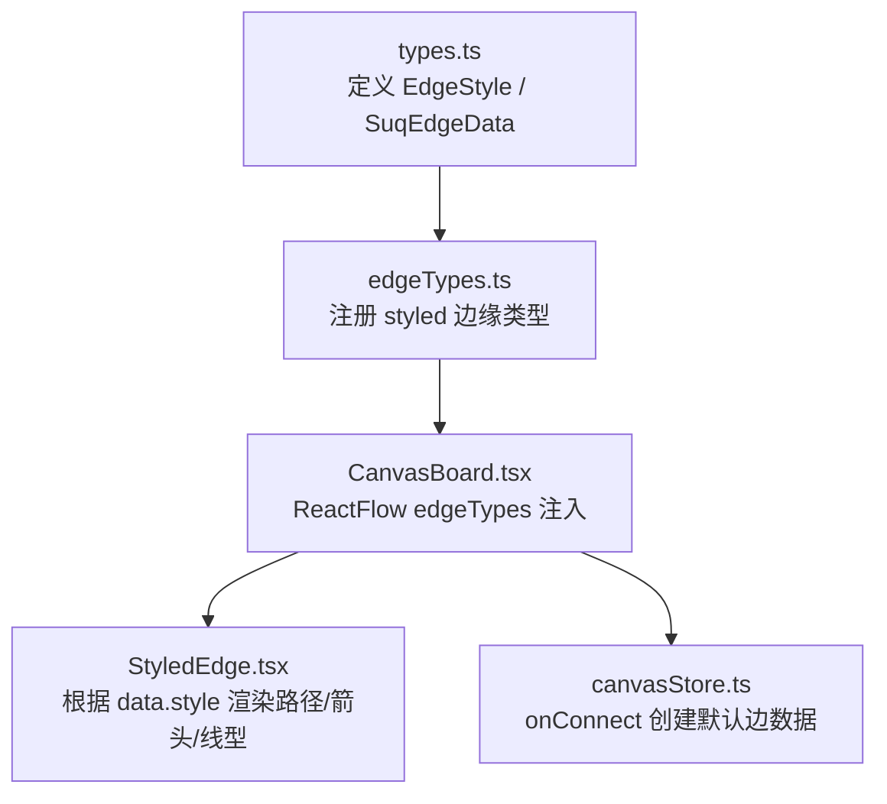
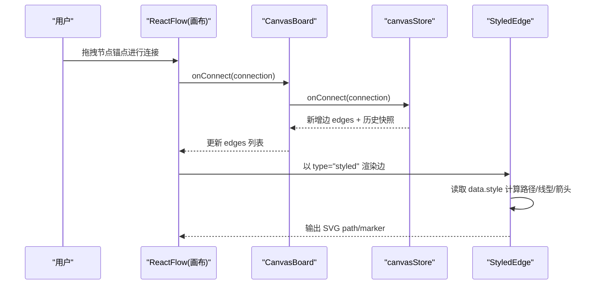
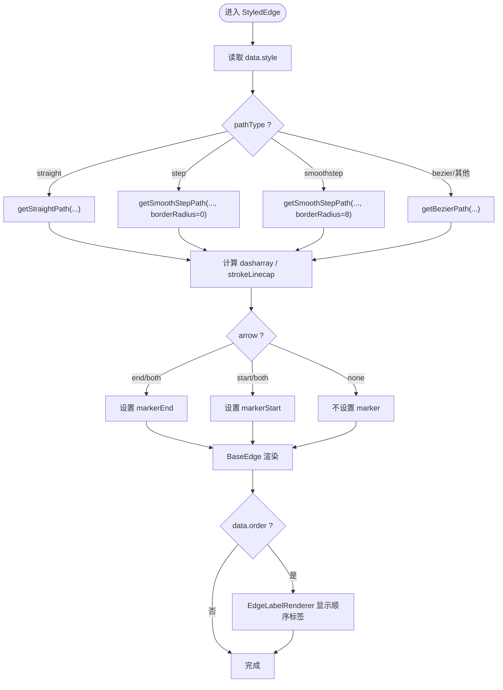
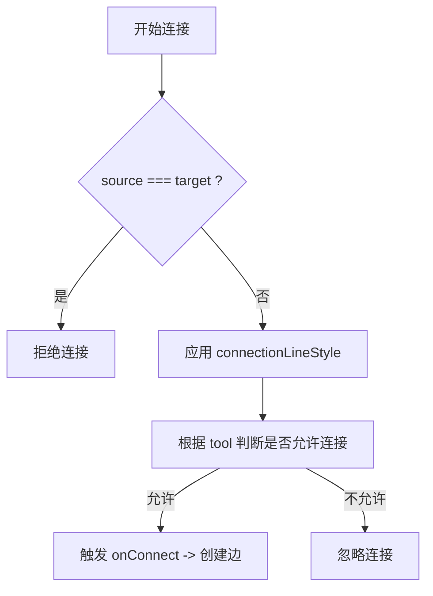
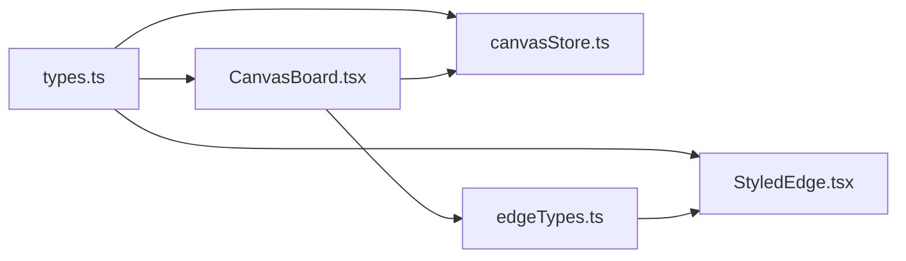

# 边缘类型 API

<cite>
**本文引用的文件**
- [types.ts](file://src/types.ts)
- [StyledEdge.tsx](file://src/canvas/edges/StyledEdge.tsx)
- [edgeTypes.ts](file://src/canvas/edges/edgeTypes.ts)
- [canvasStore.ts](file://src/store/canvasStore.ts)
- [CanvasBoard.tsx](file://src/canvas/CanvasBoard.tsx)
</cite>

## 目录
1. [简介](#简介)
2. [项目结构](#项目结构)
3. [核心组件](#核心组件)
4. [架构总览](#架构总览)
5. [详细组件分析](#详细组件分析)
6. [依赖关系分析](#依赖关系分析)
7. [性能考量](#性能考量)
8. [故障排查指南](#故障排查指南)
9. [结论](#结论)
10. [附录](#附录)

## 简介
本文件为 SuQCanvas 的边缘类型系统 API 文档，聚焦于 EdgeStyle 接口的配置项、SuqEdgeData 的扩展字段与用途、边缘连接规则与验证机制、以及边缘动画与交互行为的定制方法。读者可据此自定义边缘样式与渲染逻辑，并在画布中实现一致的连线体验。

## 项目结构
与边缘相关的代码主要分布在以下位置：
- 类型定义：src/types.ts
- 边缘渲染器：src/canvas/edges/StyledEdge.tsx
- 边缘类型注册：src/canvas/edges/edgeTypes.ts
- 状态与连接处理：src/store/canvasStore.ts
- 画布集成与连接行为：src/canvas/CanvasBoard.tsx

图表来源
- [types.ts:50-64](file://src/types.ts#L50-L64)
- [edgeTypes.ts:4-6](file://src/canvas/edges/edgeTypes.ts#L4-L6)
- [CanvasBoard.tsx:337-350](file://src/canvas/CanvasBoard.tsx#L337-L350)
- [StyledEdge.tsx:11-77](file://src/canvas/edges/StyledEdge.tsx#L11-L77)
- [canvasStore.ts:146-158](file://src/store/canvasStore.ts#L146-L158)

章节来源
- [types.ts:50-64](file://src/types.ts#L50-L64)
- [edgeTypes.ts:4-6](file://src/canvas/edges/edgeTypes.ts#L4-L6)
- [CanvasBoard.tsx:337-350](file://src/canvas/CanvasBoard.tsx#L337-L350)
- [StyledEdge.tsx:11-77](file://src/canvas/edges/StyledEdge.tsx#L11-L77)
- [canvasStore.ts:146-158](file://src/store/canvasStore.ts#L146-L158)

## 核心组件
- EdgeStyle 接口：定义边缘的视觉风格（线型、路径类型、箭头位置、颜色、粗细）。
- SuqEdgeData：边缘数据载体，包含 style 及可选的 order 等扩展字段。
- StyledEdge：基于 @xyflow/react 的 BaseEdge 实现，读取 data.style 并渲染路径、箭头、虚线/点线等。
- edgeTypes：将“styled”类型映射到 StyledEdge 组件。
- canvasStore.onConnect：在建立连接时生成带有默认样式的边。
- CanvasBoard：配置 ReactFlow 的连接行为、校验规则、连接线样式等。

章节来源
- [types.ts:50-64](file://src/types.ts#L50-L64)
- [types.ts:100-107](file://src/types.ts#L100-L107)
- [StyledEdge.tsx:11-129](file://src/canvas/edges/StyledEdge.tsx#L11-L129)
- [edgeTypes.ts:4-6](file://src/canvas/edges/edgeTypes.ts#L4-L6)
- [canvasStore.ts:146-158](file://src/store/canvasStore.ts#L146-L158)
- [CanvasBoard.tsx:337-350](file://src/canvas/CanvasBoard.tsx#L337-L350)

## 架构总览
下图展示了从用户连接到最终渲染的关键流程：

图表来源
- [CanvasBoard.tsx:337-350](file://src/canvas/CanvasBoard.tsx#L337-L350)
- [canvasStore.ts:146-158](file://src/store/canvasStore.ts#L146-L158)
- [StyledEdge.tsx:11-77](file://src/canvas/edges/StyledEdge.tsx#L11-L77)

## 详细组件分析

### EdgeStyle 接口与默认值
- lineStyle：线条样式，支持实线、虚线、点线。
- pathType：路径类型，支持贝塞尔曲线、直线、阶梯、平滑阶梯。
- arrow：箭头位置，支持无、起点、终点、双向。
- stroke：描边颜色。
- strokeWidth：描边宽度。
- DEFAULT_EDGE_STYLE：提供默认样式，便于新建边时快速生效。

这些字段在 StyledEdge 中被直接消费，用于决定 dasharray、路径函数选择、marker 应用与选中态高亮。

章节来源
- [types.ts:46-64](file://src/types.ts#L46-L64)
- [StyledEdge.tsx:24-77](file://src/canvas/edges/StyledEdge.tsx#L24-L77)

### SuqEdgeData 扩展字段与用途
- style：必填，EdgeStyle 实例，控制边的外观。
- order：可选，数字。用于歌单分叉处出边的播放顺序；未设置时按边的创建顺序（edges 数组顺序）决定。该字段会在 StyledEdge 中以标签形式显示在边中点附近。

章节来源
- [types.ts:100-107](file://src/types.ts#L100-L107)
- [StyledEdge.tsx:114-126](file://src/canvas/edges/StyledEdge.tsx#L114-L126)

### 边缘渲染与样式计算
- 路径选择：根据 pathType 调用不同的路径函数，分别生成直线路径、阶梯路径或贝塞尔路径。
- 线型与虚线：lineStyle 为 solid 时无虚线；dashed/dotted 通过 strokeDasharray 与 strokeLinecap 控制视觉效果。
- 箭头：根据 arrow 的值决定是否在起点/终点应用 marker。
- 选中态：selected 为真时，边颜色切换为高亮色，透明度提升。
- 标签：当存在 order 时，使用 EdgeLabelRenderer 在路径中点附近渲染圆形标签。

图表来源
- [StyledEdge.tsx:24-77](file://src/canvas/edges/StyledEdge.tsx#L24-L77)
- [StyledEdge.tsx:85-129](file://src/canvas/edges/StyledEdge.tsx#L85-L129)

章节来源
- [StyledEdge.tsx:24-77](file://src/canvas/edges/StyledEdge.tsx#L24-L77)
- [StyledEdge.tsx:85-129](file://src/canvas/edges/StyledEdge.tsx#L85-L129)

### 边缘类型注册与注入
- edgeTypes.ts 将字符串类型 "styled" 映射到 StyledEdge 组件。
- CanvasBoard 将 edgeTypes 注入 ReactFlow，使所有 type="styled" 的边由 StyledEdge 渲染。

章节来源
- [edgeTypes.ts:4-6](file://src/canvas/edges/edgeTypes.ts#L4-L6)
- [CanvasBoard.tsx:337-341](file://src/canvas/CanvasBoard.tsx#L337-L341)

### 连接规则与验证机制
- 禁止自连：isValidConnection 确保 source !== target。
- 连接线样式：connectionLineType 设置为贝塞尔曲线，connectionLineStyle 使用默认边颜色与固定粗细。
- 连接半径：在连接模式下增大 connectionRadius，便于远距离拖拽连接。
- 工具模式：nodesConnectable/connectOnClick 受当前工具模式影响，仅在非拖动模式下允许连接。

图表来源
- [CanvasBoard.tsx:347-350](file://src/canvas/CanvasBoard.tsx#L347-L350)
- [CanvasBoard.tsx:361-363](file://src/canvas/CanvasBoard.tsx#L361-L363)
- [canvasStore.ts:146-158](file://src/store/canvasStore.ts#L146-L158)

章节来源
- [CanvasBoard.tsx:347-350](file://src/canvas/CanvasBoard.tsx#L347-L350)
- [CanvasBoard.tsx:361-363](file://src/canvas/CanvasBoard.tsx#L361-L363)
- [canvasStore.ts:146-158](file://src/store/canvasStore.ts#L146-L158)

### 动画效果与交互行为定制
- 选中态高亮：当 selected 为真时，边颜色切换为高亮色，透明度提升，便于批量编辑与识别。
- 交互宽度：interactionWidth 设为固定值，扩大点击命中区域，改善交互体验。
- 标签提示：order 标签带 title 提示，便于理解播放顺序。
- 自定义动画：如需绘制动画，可在外部通过 CSS 动画结合 stroke-dashoffset 实现（示例见演示页面），或在 StyledEdge 基础上扩展动画逻辑。

章节来源
- [StyledEdge.tsx:24-26](file://src/canvas/edges/StyledEdge.tsx#L24-L26)
- [StyledEdge.tsx:100-113](file://src/canvas/edges/StyledEdge.tsx#L100-L113)
- [StyledEdge.tsx:114-126](file://src/canvas/edges/StyledEdge.tsx#L114-L126)

## 依赖关系分析
- types.ts 提供 EdgeStyle、SuqEdgeData 等类型定义，被 StyledEdge、canvasStore、CanvasBoard 共同引用。
- edgeTypes.ts 仅依赖 StyledEdge，负责类型映射。
- CanvasBoard 依赖 edgeTypes 与 ReactFlow 的配置项，驱动连接行为。
- canvasStore 在 onConnect 中创建默认边数据，保证新边具备一致样式。

图表来源
- [types.ts:50-64](file://src/types.ts#L50-L64)
- [types.ts:100-107](file://src/types.ts#L100-L107)
- [edgeTypes.ts:4-6](file://src/canvas/edges/edgeTypes.ts#L4-L6)
- [CanvasBoard.tsx:337-350](file://src/canvas/CanvasBoard.tsx#L337-L350)
- [canvasStore.ts:146-158](file://src/store/canvasStore.ts#L146-L158)

章节来源
- [types.ts:50-64](file://src/types.ts#L50-L64)
- [types.ts:100-107](file://src/types.ts#L100-L107)
- [edgeTypes.ts:4-6](file://src/canvas/edges/edgeTypes.ts#L4-L6)
- [CanvasBoard.tsx:337-350](file://src/canvas/CanvasBoard.tsx#L337-L350)
- [canvasStore.ts:146-158](file://src/store/canvasStore.ts#L146-L158)

## 性能考量
- 路径计算：不同 pathType 对应不同的路径函数，避免不必要的复杂路径可降低重绘开销。
- 虚线/点线：dasharray 与 strokeLinecap 的计算在每次渲染时进行，建议保持合理的 strokeWidth 范围。
- 交互宽度：interactionWidth 较大可提升易用性，但会增加命中检测成本，需权衡。
- 历史快照：onConnect/onEdgesChange 会触发历史快照，频繁操作可能带来内存压力，已做防抖与限制。

[本节为通用性能建议，无需特定文件引用]

## 故障排查指南
- 无法连接：检查 isValidConnection 是否误判 source === target；确认 nodesConnectable/connectOnClick 在当前工具模式下为真。
- 样式不生效：确认边 data.style 是否存在且字段完整；检查 pathType、lineStyle、arrow 是否为合法枚举值。
- 箭头不显示：确认 arrow 不为 none；检查 marker 是否成功挂载到 BaseEdge。
- 标签不显示：确认 data.order 已设置；检查 EdgeLabelRenderer 的位置计算是否正确。
- 连接线与边不一致：检查 connectionLineStyle 与 DEFAULT_EDGE_STYLE 的颜色/粗细是否匹配。

章节来源
- [CanvasBoard.tsx:347-350](file://src/canvas/CanvasBoard.tsx#L347-L350)
- [canvasStore.ts:146-158](file://src/store/canvasStore.ts#L146-L158)
- [StyledEdge.tsx:24-77](file://src/canvas/edges/StyledEdge.tsx#L24-L77)
- [StyledEdge.tsx:114-126](file://src/canvas/edges/StyledEdge.tsx#L114-L126)

## 结论
本 API 通过统一的 EdgeStyle 与 SuqEdgeData 抽象，配合 StyledEdge 渲染器与 ReactFlow 的连接机制，提供了灵活且一致的可定制边缘系统。开发者可通过修改 EdgeStyle 字段与扩展 SuqEdgeData 字段来实现丰富的连线样式与业务语义（如播放顺序）。同时，借助连接规则与交互配置，可构建稳定易用的画布体验。

[本节为总结性内容，无需特定文件引用]

## 附录

### EdgeStyle 配置选项速查
- lineStyle：'solid' | 'dashed' | 'dotted'
- pathType：'bezier' | 'straight' | 'step' | 'smoothstep'
- arrow：'none' | 'start' | 'end' | 'both'
- stroke：颜色字符串
- strokeWidth：数值

章节来源
- [types.ts:46-64](file://src/types.ts#L46-L64)

### SuqEdgeData 扩展字段说明
- style：EdgeStyle，必需
- order：number，可选，表示播放顺序（越小越先播放）

章节来源
- [types.ts:100-107](file://src/types.ts#L100-L107)

### 自定义边缘样式与渲染逻辑
- 修改 EdgeStyle：通过 updateEdgeData 更新 data.style 即可实时改变样式。
- 自定义渲染：可复制 StyledEdge 并替换路径函数、箭头、标签等逻辑，再在 edgeTypes 中注册新类型。
- 连接行为：在 CanvasBoard 中调整 isValidConnection、connectionLineType、connectionLineStyle 等属性。

章节来源
- [canvasStore.ts:184-191](file://src/store/canvasStore.ts#L184-L191)
- [edgeTypes.ts:4-6](file://src/canvas/edges/edgeTypes.ts#L4-L6)
- [CanvasBoard.tsx:347-350](file://src/canvas/CanvasBoard.tsx#L347-L350)