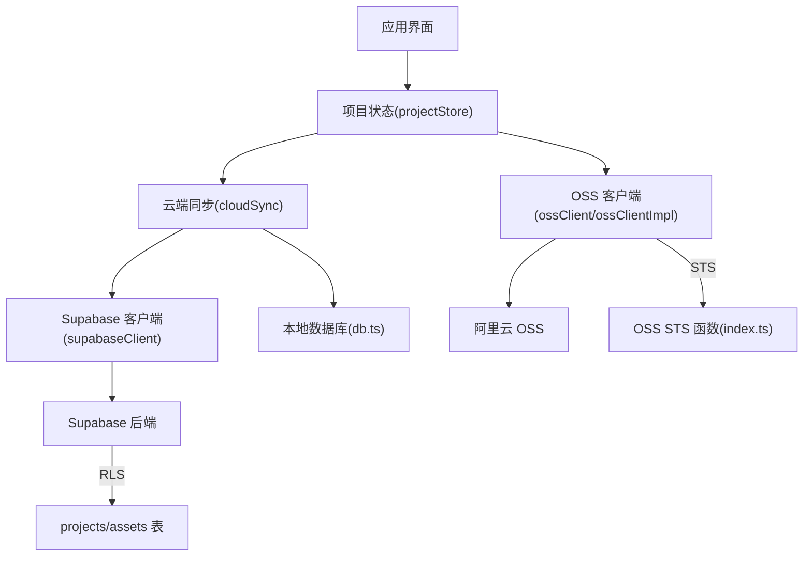
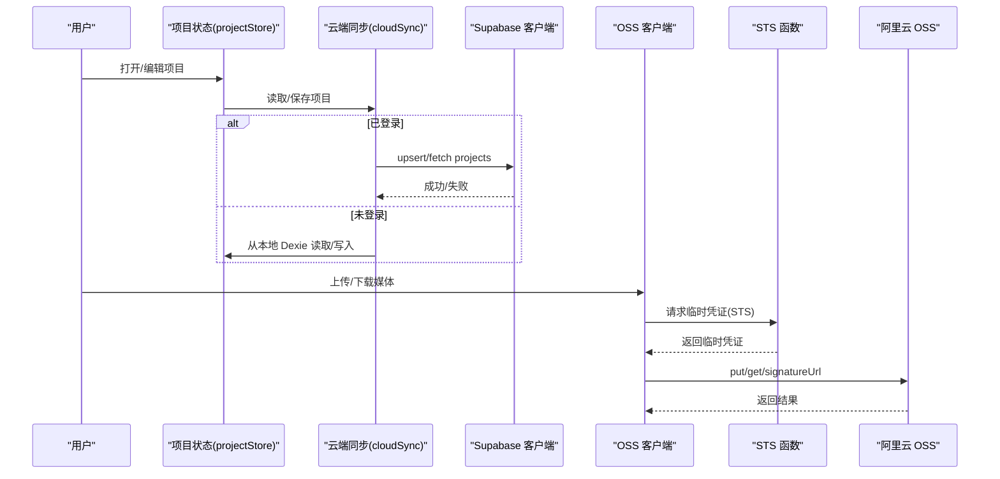
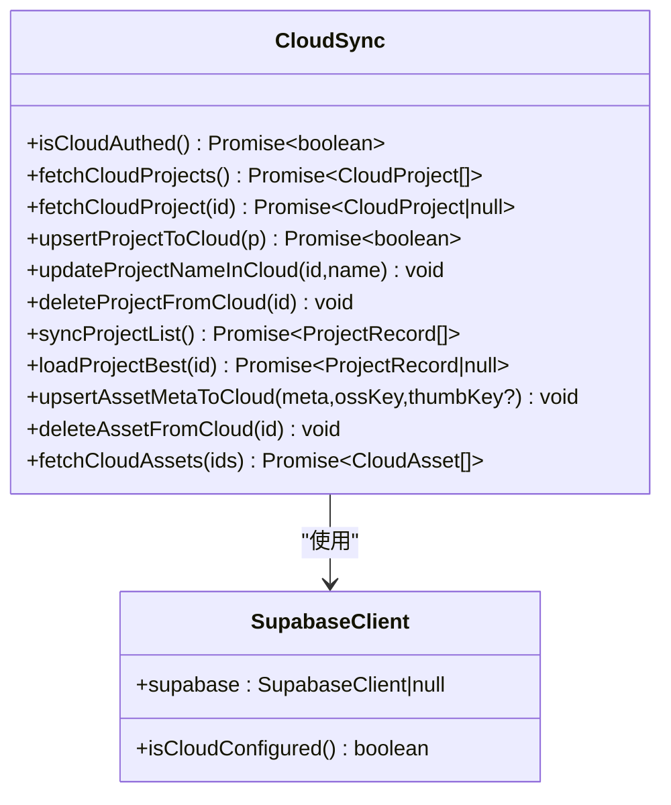
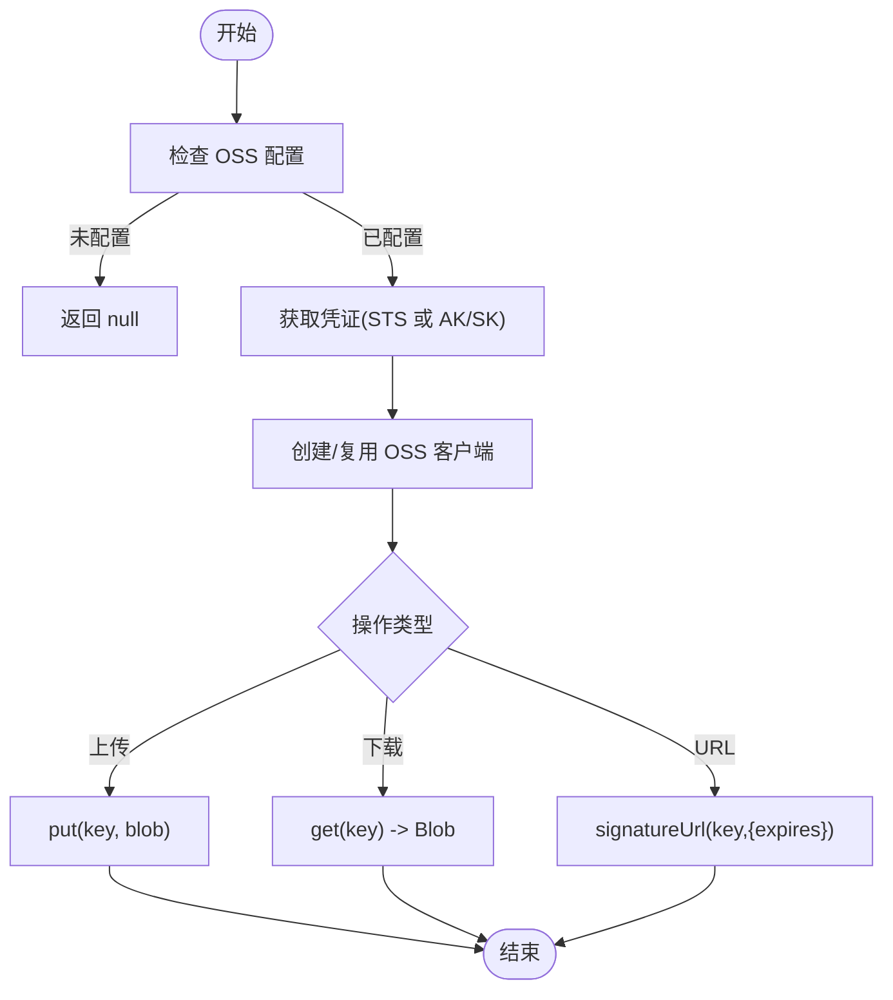
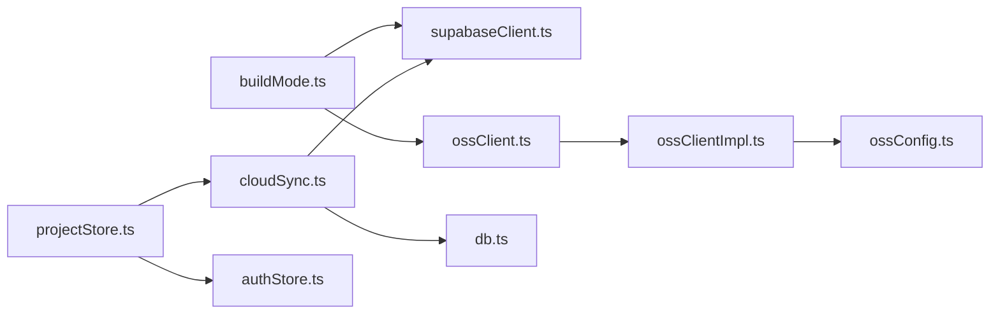

# 云端同步

<cite>
**本文引用的文件**
- [cloudSync.ts](file://src/sync/cloudSync.ts)
- [supabaseClient.ts](file://src/sync/supabaseClient.ts)
- [ossClient.ts](file://src/sync/ossClient.ts)
- [ossClientImpl.ts](file://src/sync/ossClientImpl.ts)
- [ossConfig.ts](file://src/sync/ossConfig.ts)
- [schema.sql](file://supabase/schema.sql)
- [index.ts](file://supabase/functions/oss-sts/index.ts)
- [db.ts](file://src/db/db.ts)
- [authStore.ts](file://src/store/authStore.ts)
- [projectStore.ts](file://src/store/projectStore.ts)
- [types.ts](file://src/types.ts)
- [buildMode.ts](file://src/buildMode.ts)
</cite>

## 目录
1. [简介](#简介)
2. [项目结构](#项目结构)
3. [核心组件](#核心组件)
4. [架构总览](#架构总览)
5. [详细组件分析](#详细组件分析)
6. [依赖关系分析](#依赖关系分析)
7. [性能与可靠性](#性能与可靠性)
8. [故障排查指南](#故障排查指南)
9. [配置指南](#配置指南)
10. [使用示例](#使用示例)
11. [结论](#结论)

## 简介
本技术文档围绕“云端同步”能力，系统性阐述 Supabase 集成（数据库、认证、行级安全）、阿里云 OSS 对象存储客户端（上传、下载、签名 URL、凭证刷新）、云同步策略（数据版本控制、冲突解决、增量思路）与安全考量（访问控制、权限隔离、密钥管理），并提供可操作的配置说明与自定义扩展示例。系统支持在线版与局域网版两种构建目标：在线版启用 Supabase 与 OSS；局域网版仅本地 Dexie 存储与 LAN 同步。

## 项目结构
云端同步相关代码主要分布在以下模块：
- 同步编排层：src/sync/cloudSync.ts
- Supabase 客户端封装：src/sync/supabaseClient.ts
- 阿里云 OSS 客户端封装与实现：src/sync/ossClient.ts、src/sync/ossClientImpl.ts、src/sync/ossConfig.ts
- 数据库模式与 RLS 策略：supabase/schema.sql
- STS 临时凭证签发服务：supabase/functions/oss-sts/index.ts
- 本地持久化与清理：src/db/db.ts
- 认证状态与登录流程：src/store/authStore.ts
- 项目生命周期与自动保存：src/store/projectStore.ts
- 类型定义：src/types.ts
- 构建目标开关：src/buildMode.ts

图表来源
- [projectStore.ts:1-230](file://src/store/projectStore.ts#L1-L230)
- [cloudSync.ts:1-165](file://src/sync/cloudSync.ts#L1-L165)
- [supabaseClient.ts:1-18](file://src/sync/supabaseClient.ts#L1-L18)
- [ossClient.ts:1-63](file://src/sync/ossClient.ts#L1-L63)
- [ossClientImpl.ts:1-135](file://src/sync/ossClientImpl.ts#L1-L135)
- [schema.sql:1-90](file://supabase/schema.sql#L1-L90)
- [index.ts:1-111](file://supabase/functions/oss-sts/index.ts#L1-L111)

章节来源
- [projectStore.ts:1-230](file://src/store/projectStore.ts#L1-L230)
- [cloudSync.ts:1-165](file://src/sync/cloudSync.ts#L1-L165)
- [supabaseClient.ts:1-18](file://src/sync/supabaseClient.ts#L1-L18)
- [ossClient.ts:1-63](file://src/sync/ossClient.ts#L1-L63)
- [ossClientImpl.ts:1-135](file://src/sync/ossClientImpl.ts#L1-L135)
- [schema.sql:1-90](file://supabase/schema.sql#L1-L90)
- [index.ts:1-111](file://supabase/functions/oss-sts/index.ts#L1-L111)
- [db.ts:1-69](file://src/db/db.ts#L1-L69)
- [authStore.ts:1-104](file://src/store/authStore.ts#L1-L104)
- [types.ts:1-112](file://src/types.ts#L1-L112)
- [buildMode.ts:1-8](file://src/buildMode.ts#L1-L8)

## 核心组件
- 云端同步编排器（cloudSync.ts）
  - 负责将本地项目/素材与云端 Supabase 进行读写映射，处理用户身份校验、数据转换、错误提示。
- Supabase 客户端（supabaseClient.ts）
  - 基于环境变量初始化 Supabase 客户端，提供 isCloudConfigured 判断是否启用云端能力。
- 阿里云 OSS 客户端（ossClient.ts + ossClientImpl.ts + ossConfig.ts）
  - 对外暴露统一接口：上传/下载媒体与缩略图、获取签名 URL、检查配置是否就绪。
  - 内部通过 STS 或 AK/SK 获取临时/长期凭证，维护客户端实例与过期时间，支持自动刷新。
- 数据库模式与 RLS（schema.sql）
  - 定义 projects 与 assets 表结构，启用行级安全策略，确保按 user_id 隔离数据。
- STS 凭证服务（supabase/functions/oss-sts/index.ts）
  - 在 Supabase Edge Functions 中调用阿里云 STS AssumeRole，返回临时凭证供前端直传 OSS。
- 本地存储与清理（db.ts）
  - 使用 Dexie 维护本地项目与素材，提供垃圾回收逻辑，避免孤立资源占用空间。
- 认证与项目状态（authStore.ts, projectStore.ts）
  - 管理登录态、游客模式切换；根据登录态选择云端或本地数据源；实现自动保存与列表同步。

章节来源
- [cloudSync.ts:1-165](file://src/sync/cloudSync.ts#L1-L165)
- [supabaseClient.ts:1-18](file://src/sync/supabaseClient.ts#L1-L18)
- [ossClient.ts:1-63](file://src/sync/ossClient.ts#L1-L63)
- [ossClientImpl.ts:1-135](file://src/sync/ossClientImpl.ts#L1-L135)
- [ossConfig.ts:1-20](file://src/sync/ossConfig.ts#L1-L20)
- [schema.sql:1-90](file://supabase/schema.sql#L1-L90)
- [index.ts:1-111](file://supabase/functions/oss-sts/index.ts#L1-L111)
- [db.ts:1-69](file://src/db/db.ts#L1-L69)
- [authStore.ts:1-104](file://src/store/authStore.ts#L1-L104)
- [projectStore.ts:1-230](file://src/store/projectStore.ts#L1-L230)

## 架构总览
系统采用“双通道”数据流：
- 项目元数据（nodes/edges/viewport）通过 Supabase 的 projects 表进行云端持久化；未登录时落盘 Dexie。
- 媒体文件（图片/视频/PDF 等）通过阿里云 OSS 存储，assets 表仅保存元数据（名称、MIME、大小、kind、OSS key）。
- 认证由 Supabase Auth 管理，行级安全策略保证每个用户只能访问自己的数据。
- 构建目标决定功能开关：在线版启用 Supabase/OSS；局域网版禁用并回退到本地/LAN 同步。

图表来源
- [projectStore.ts:1-230](file://src/store/projectStore.ts#L1-L230)
- [cloudSync.ts:1-165](file://src/sync/cloudSync.ts#L1-L165)
- [supabaseClient.ts:1-18](file://src/sync/supabaseClient.ts#L1-L18)
- [ossClient.ts:1-63](file://src/sync/ossClient.ts#L1-L63)
- [ossClientImpl.ts:1-135](file://src/sync/ossClientImpl.ts#L1-L135)
- [index.ts:1-111](file://supabase/functions/oss-sts/index.ts#L1-L111)

## 详细组件分析

### Supabase 集成（数据库、认证、行级安全）
- 客户端初始化与可用性判断
  - 通过环境变量注入 Supabase URL 与匿名 Key，仅在在线构建下创建客户端。
  - 提供 isCloudConfigured 用于上层判断是否启用云端能力。
- 认证与会话
  - 认证状态由 authStore 管理，监听会话变化，切换游客/登录态，并在切换时重置项目状态，防止云端与本地数据串写。
- 数据模型与 RLS
  - projects 表：id(user uuid)、user_id、name、graph(jsonb)、viewport(jsonb)、created_at、updated_at。
  - assets 表：id(text)、user_id、name、mime、size、kind、oss_key、oss_thumb_key、has_thumbnail、created_at。
  - 启用行级安全策略，仅允许 authenticated 用户读写 own 数据（user_id = auth.uid()）。
- 云端 CRUD
  - 项目：列表查询、单条查询、插入/更新（upsert）、重命名、删除。
  - 素材元数据：upsert、删除、按 id 列表查询。
  - 所有写操作均附带当前用户 ID，读操作受 RLS 保护。

图表来源
- [cloudSync.ts:1-165](file://src/sync/cloudSync.ts#L1-L165)
- [supabaseClient.ts:1-18](file://src/sync/supabaseClient.ts#L1-L18)

章节来源
- [supabaseClient.ts:1-18](file://src/sync/supabaseClient.ts#L1-L18)
- [schema.sql:1-90](file://supabase/schema.sql#L1-L90)
- [authStore.ts:1-104](file://src/store/authStore.ts#L1-L104)
- [cloudSync.ts:1-165](file://src/sync/cloudSync.ts#L1-L165)

### 阿里云 OSS 客户端（上传、下载、签名 URL、凭证刷新）
- 配置检测与动态加载
  - 通过 VITE_BUILD_TARGET 与 VITE_OSS_* 环境变量判断是否启用 OSS。
  - 在线构建且配置齐全时才加载 ossClientImpl，否则返回空实现，避免引入 ali-oss。
- 凭证获取与刷新
  - 优先通过 STS 函数获取临时凭证（含 securityToken 与 expiration），未配置则回退为 AK/SK。
  - 客户端缓存实例，并在过期前 5 分钟主动刷新；若使用 STS，开启 refreshSTSToken 回调与定时刷新间隔。
- 文件操作
  - 上传媒体与缩略图：put(key, blob)，key 由 assetKey/thumbKey 生成。
  - 下载媒体与缩略图：get(key) 并统一转换为 Blob。
  - 获取可访问 URL：signatureUrl(key, { expires: 3600 })，默认 1 小时有效。
- 错误处理
  - 下载/URL 生成失败时记录警告并返回空值，避免阻断主流程。

图表来源
- [ossConfig.ts:1-20](file://src/sync/ossConfig.ts#L1-L20)
- [ossClientImpl.ts:1-135](file://src/sync/ossClientImpl.ts#L1-L135)
- [ossClient.ts:1-63](file://src/sync/ossClient.ts#L1-L63)

章节来源
- [ossConfig.ts:1-20](file://src/sync/ossConfig.ts#L1-L20)
- [ossClientImpl.ts:1-135](file://src/sync/ossClientImpl.ts#L1-L135)
- [ossClient.ts:1-63](file://src/sync/ossClient.ts#L1-L63)

### 云同步策略（版本控制、冲突解决、增量同步）
- 版本控制
  - 项目记录包含 updated_at 字段，每次保存更新该时间戳；列表按更新时间倒序展示最新项目。
  - 素材记录包含 created_at，便于后续扩展审计与回溯。
- 冲突解决
  - 当前实现以“最后写入者胜”的策略：后保存的项目覆盖先前版本（upsert by id）。
  - 如需乐观锁/版本号冲突检测，可在服务端增加 version 字段并在更新时校验。
- 增量同步
  - 当前为全量保存项目 graph（nodes/edges/viewport），适合中小型画布。
  - 可扩展为基于节点/边差异的增量同步，减少网络负载。
- 数据源隔离
  - 已登录用户：项目列表与加载均来自云端；未登录/游客：仅本地 Dexie。
  - 切换登录态会重置项目状态，避免跨环境数据串写。

章节来源
- [schema.sql:1-90](file://supabase/schema.sql#L1-L90)
- [cloudSync.ts:1-165](file://src/sync/cloudSync.ts#L1-L165)
- [projectStore.ts:1-230](file://src/store/projectStore.ts#L1-L230)

### 安全考虑（访问控制、数据加密、权限管理）
- 认证与会话
  - 使用 Supabase Auth 管理用户登录态，监听会话变化，退出时清理本地状态。
- 行级安全（RLS）
  - projects 与 assets 表启用 RLS，限制 authenticated 用户仅能读写 own 数据（user_id = auth.uid()）。
- 密钥与凭证
  - 前端不直接持有高权限 AK/SK；通过 STS 函数获取短期凭证，降低泄露风险。
  - STS 函数部署在 Supabase Edge Functions，凭据以 Secrets 形式管理。
- 传输安全
  - OSS 客户端使用 secure: true，强制 HTTPS 传输。
- 最小权限原则
  - RAM 角色仅授予必要的 sts:AssumeRole 与 OSS 读写权限。

章节来源
- [schema.sql:1-90](file://supabase/schema.sql#L1-L90)
- [index.ts:1-111](file://supabase/functions/oss-sts/index.ts#L1-L111)
- [ossClientImpl.ts:1-135](file://src/sync/ossClientImpl.ts#L1-L135)
- [authStore.ts:1-104](file://src/store/authStore.ts#L1-L104)

## 依赖关系分析
- 构建目标影响依赖注入
  - buildMode.ts 定义 IS_LAN_BUILD/IS_ONLINE_BUILD，用于条件编译移除无关依赖。
  - supabaseClient.ts 仅在在线构建下创建 Supabase 客户端。
  - ossClient.ts 仅在在线构建下动态导入 ossClientImpl，避免引入 ali-oss。
- 运行时依赖
  - cloudSync.ts 依赖 supabaseClient.ts 与 db.ts。
  - projectStore.ts 依赖 cloudSync.ts、authStore.ts、lanClient.ts（LAN 同步，不在本文范围）。
  - ossClientImpl.ts 依赖 ossConfig.ts 与 ali-oss。

图表来源
- [buildMode.ts:1-8](file://src/buildMode.ts#L1-L8)
- [supabaseClient.ts:1-18](file://src/sync/supabaseClient.ts#L1-L18)
- [ossClient.ts:1-63](file://src/sync/ossClient.ts#L1-L63)
- [ossClientImpl.ts:1-135](file://src/sync/ossClientImpl.ts#L1-L135)
- [ossConfig.ts:1-20](file://src/sync/ossConfig.ts#L1-L20)
- [cloudSync.ts:1-165](file://src/sync/cloudSync.ts#L1-L165)
- [db.ts:1-69](file://src/db/db.ts#L1-L69)
- [projectStore.ts:1-230](file://src/store/projectStore.ts#L1-L230)
- [authStore.ts:1-104](file://src/store/authStore.ts#L1-L104)

章节来源
- [buildMode.ts:1-8](file://src/buildMode.ts#L1-L8)
- [supabaseClient.ts:1-18](file://src/sync/supabaseClient.ts#L1-L18)
- [ossClient.ts:1-63](file://src/sync/ossClient.ts#L1-L63)
- [ossClientImpl.ts:1-135](file://src/sync/ossClientImpl.ts#L1-L135)
- [ossConfig.ts:1-20](file://src/sync/ossConfig.ts#L1-L20)
- [cloudSync.ts:1-165](file://src/sync/cloudSync.ts#L1-L165)
- [db.ts:1-69](file://src/db/db.ts#L1-L69)
- [projectStore.ts:1-230](file://src/store/projectStore.ts#L1-L230)
- [authStore.ts:1-104](file://src/store/authStore.ts#L1-L104)

## 性能与可靠性
- 客户端缓存与凭证刷新
  - OSS 客户端实例缓存，避免重复初始化；在过期前 5 分钟刷新，减少中断概率。
  - STS 模式下设置 refreshSTSTokenInterval 定期刷新，提升长连接稳定性。
- 网络优化建议
  - 合理设置签名 URL 过期时间，兼顾安全性与播放体验。
  - 对大文件上传可考虑分片上传（需扩展实现），结合断点续传提升成功率。
- 数据一致性
  - 项目保存为全量覆盖，简单可靠；如需更高并发协作，建议引入版本号与冲突合并策略。
- 本地清理
  - 提供 GC 逻辑，标记并清理长时间未被项目引用的孤立素材，释放浏览器存储空间。

[本节为通用指导，不直接分析具体文件]

## 故障排查指南
- 无法登录或无云端能力
  - 检查环境变量是否配置了 Supabase URL 与匿名 Key；确认在线构建目标。
  - 参考认证错误翻译逻辑，定位邮箱未验证、频率限制等问题。
- 项目列表为空或无法加载
  - 检查 RLS 策略是否正确启用；确认 user_id 关联正确。
  - 查看云端拉取失败的日志提示。
- 媒体文件无法上传/下载
  - 检查 OSS 配置是否齐全（region、bucket、AK 或 STS URL）。
  - 确认 STS 函数可用且返回正常；检查 CORS 与鉴权头。
  - 下载失败会记录警告并返回空值，请检查网络与权限。
- 自动保存失败
  - 关注保存状态变为 error 时的错误日志；检查网络与云端可达性。

章节来源
- [authStore.ts:1-104](file://src/store/authStore.ts#L1-L104)
- [cloudSync.ts:1-165](file://src/sync/cloudSync.ts#L1-L165)
- [ossClientImpl.ts:1-135](file://src/sync/ossClientImpl.ts#L1-L135)
- [index.ts:1-111](file://supabase/functions/oss-sts/index.ts#L1-L111)

## 配置指南
- 环境变量（前端）
  - Supabase：VITE_SUPABASE_URL、VITE_SUPABASE_ANON_KEY
  - OSS：VITE_OSS_REGION、VITE_OSS_BUCKET、VITE_OSS_ACCESS_KEY_ID、VITE_OSS_ACCESS_KEY_SECRET、VITE_OSS_STS_URL
  - 构建目标：VITE_BUILD_TARGET（lan 或 online）
- Supabase 函数（STS）
  - 部署到 Supabase Edge Functions，配置 Secrets：ALIYUN_AK_ID、ALIYUN_AK_SECRET、ALIYUN_ROLE_ARN
  - 函数返回临时凭证，前端通过 fetch 调用并传入 Authorization/apikey 头（可选）
- 数据库初始化
  - 执行 schema.sql 创建表、索引、触发器与 RLS 策略
- 网络优化
  - 确保 CDN/边缘节点就近访问 Supabase 与 OSS
  - 合理设置签名 URL 过期时间与缓存策略

章节来源
- [supabaseClient.ts:1-18](file://src/sync/supabaseClient.ts#L1-L18)
- [ossConfig.ts:1-20](file://src/sync/ossConfig.ts#L1-L20)
- [ossClientImpl.ts:1-135](file://src/sync/ossClientImpl.ts#L1-L135)
- [index.ts:1-111](file://supabase/functions/oss-sts/index.ts#L1-L111)
- [schema.sql:1-90](file://supabase/schema.sql#L1-L90)
- [buildMode.ts:1-8](file://src/buildMode.ts#L1-L8)

## 使用示例
以下为常见场景的实现要点与路径指引（不直接粘贴代码）：

- 新建项目并保存到云端
  - 入口：projectStore.newProject
  - 行为：构造 ProjectRecord，调用 upsertProjectToCloud 写入云端 projects 表
  - 参考路径：[projectStore.ts:149-182](file://src/store/projectStore.ts#L149-L182)、[cloudSync.ts:121-131](file://src/sync/cloudSync.ts#L121-L131)

- 自动保存项目
  - 入口：projectStore.saveNow
  - 行为：收集 nodes/edges/viewport，根据登录态选择云端或本地保存
  - 参考路径：[projectStore.ts:196-228](file://src/store/projectStore.ts#L196-L228)、[cloudSync.ts:121-131](file://src/sync/cloudSync.ts#L121-L131)

- 加载最近项目
  - 入口：projectStore.init
  - 行为：调用 syncProjectList 获取列表，选择最新项目加载
  - 参考路径：[projectStore.ts:81-117](file://src/store/projectStore.ts#L81-L117)、[cloudSync.ts:148-155](file://src/sync/cloudSync.ts#L148-L155)

- 上传媒体文件到 OSS
  - 入口：ossClient.uploadAssetToOss
  - 行为：动态导入 ossClientImpl，调用 put 上传并返回 key
  - 参考路径：[ossClient.ts:22-28](file://src/sync/ossClient.ts#L22-L28)、[ossClientImpl.ts:74-81](file://src/sync/ossClientImpl.ts#L74-L81)

- 上传视频缩略图
  - 入口：ossClient.uploadThumbToOss
  - 行为：调用 thumbKey 生成 key 并上传
  - 参考路径：[ossClient.ts:30-36](file://src/sync/ossClient.ts#L30-L36)、[ossClientImpl.ts:83-90](file://src/sync/ossClientImpl.ts#L83-L90)

- 下载媒体文件
  - 入口：ossClient.downloadAssetFromOss
  - 行为：调用 get 并转换为 Blob
  - 参考路径：[ossClient.ts:38-44](file://src/sync/ossClient.ts#L38-L44)、[ossClientImpl.ts:101-112](file://src/sync/ossClientImpl.ts#L101-L112)

- 获取可访问 URL（私有桶）
  - 入口：ossClient.getOssUrl
  - 行为：调用 signatureUrl 生成带签名的 URL
  - 参考路径：[ossClient.ts:56-63](file://src/sync/ossClient.ts#L56-L63)、[ossClientImpl.ts:124-135](file://src/sync/ossClientImpl.ts#L124-L135)

- 同步素材元数据到云端
  - 入口：cloudSync.upsertAssetMetaToCloud
  - 行为：upsert 到 assets 表，记录 oss_key 与缩略图 key
  - 参考路径：[cloudSync.ts:29-50](file://src/sync/cloudSync.ts#L29-L50)

- 自定义云端同步逻辑
  - 在 cloudSync.ts 中新增方法，封装业务逻辑（如批量同步、增量对比、重试机制）
  - 在 projectStore.ts 或业务组件中调用新接口，保持与现有流程一致
  - 参考路径：[cloudSync.ts:1-165](file://src/sync/cloudSync.ts#L1-L165)、[projectStore.ts:1-230](file://src/store/projectStore.ts#L1-L230)

## 结论
本方案通过 Supabase 与阿里云 OSS 的组合，实现了项目元数据的云端持久化与媒体文件的对象存储，配合行级安全与 STS 临时凭证，保障了数据安全与访问可控。系统在设计上清晰分层：同步编排、客户端封装、存储实现与认证管理各司其职，并通过构建目标开关灵活适配在线与局域网场景。未来可在此基础上扩展增量同步、冲突合并、分片上传与更细粒度的权限控制，以满足更大规模协作需求。