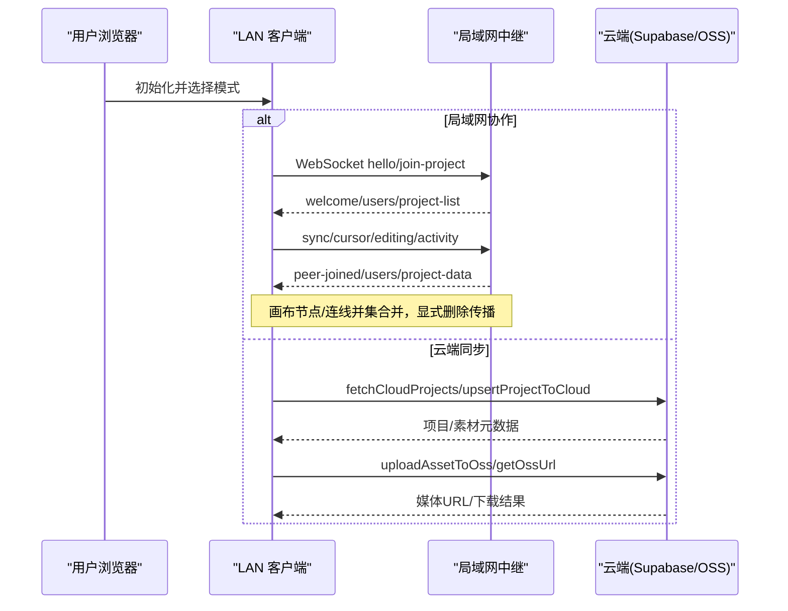
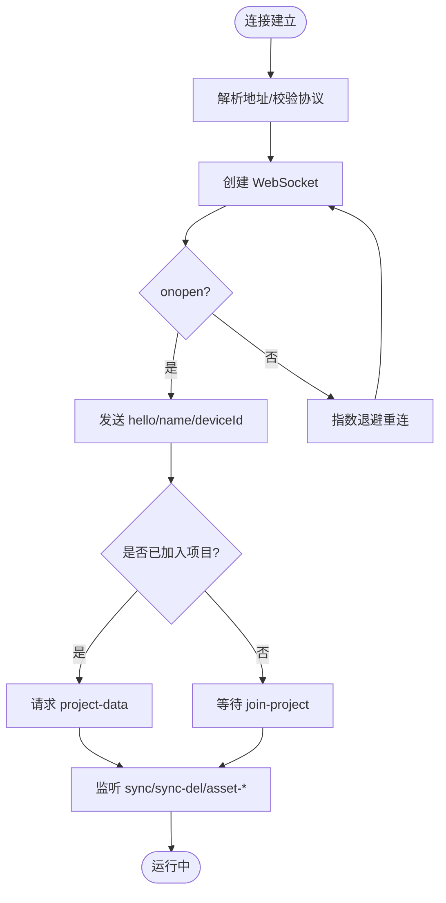
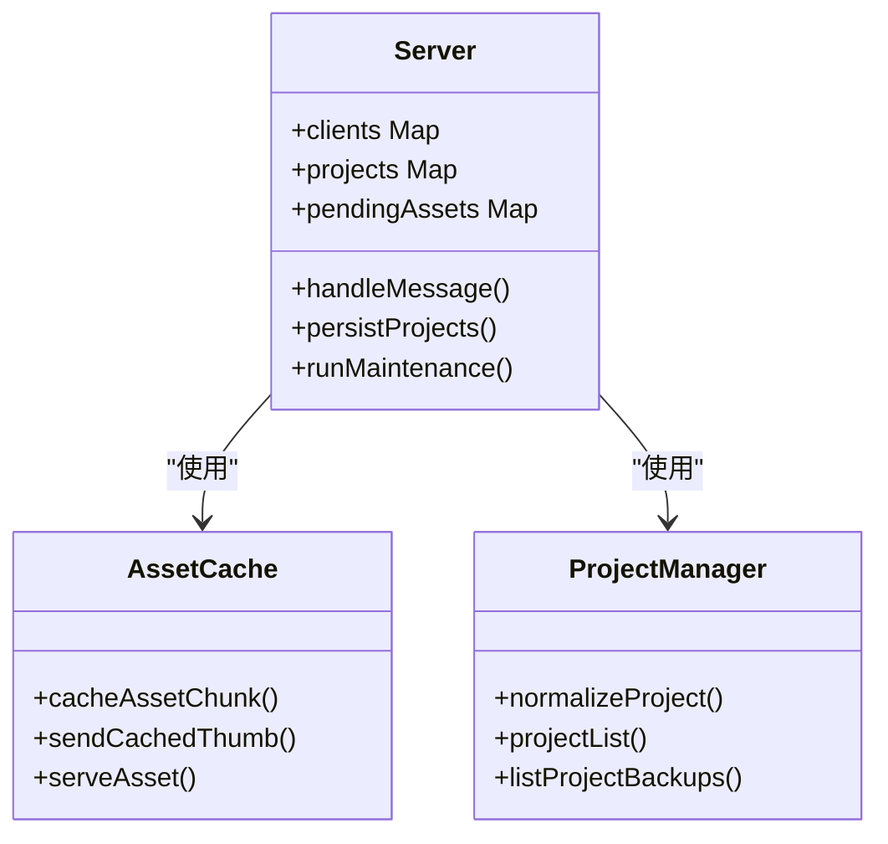
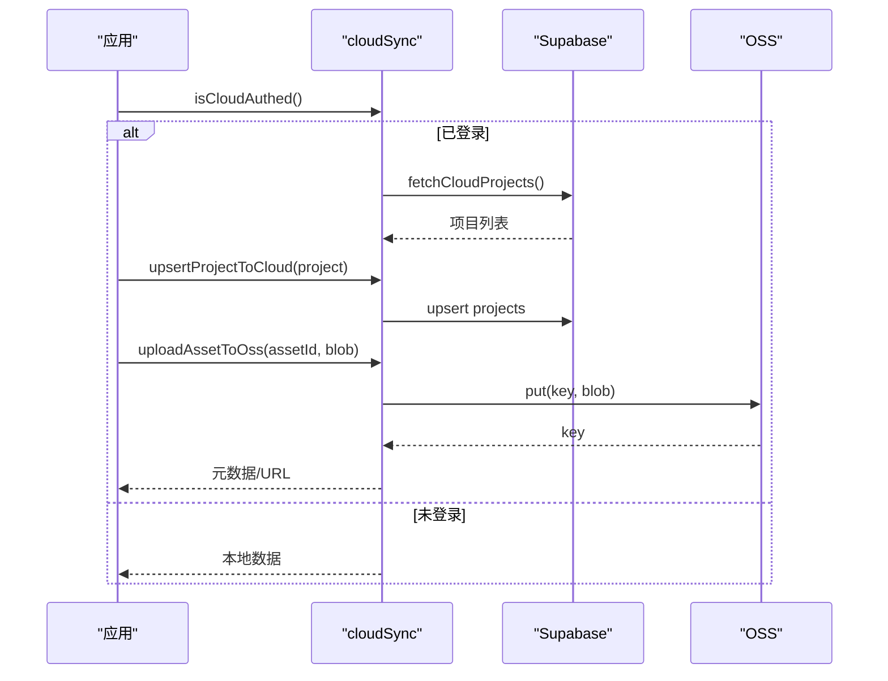
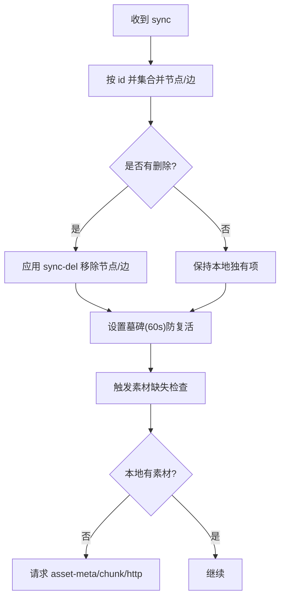
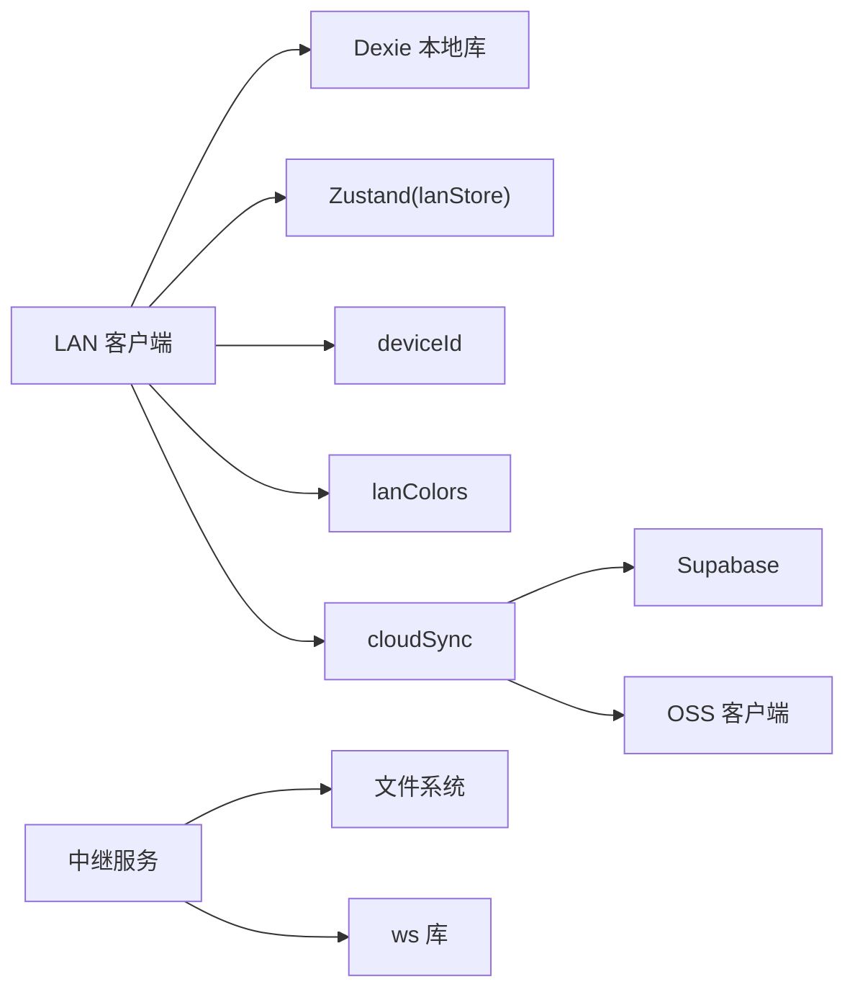

# 协作同步系统

<cite>
**本文引用的文件**
- [src/sync/lanClient.ts](file://src/sync/lanClient.ts)
- [server/lan-server.mjs](file://server/lan-server.mjs)
- [src/sync/cloudSync.ts](file://src/sync/cloudSync.ts)
- [src/sync/supabaseClient.ts](file://src/sync/supabaseClient.ts)
- [src/sync/ossClient.ts](file://src/sync/ossClient.ts)
- [src/sync/ossClientImpl.ts](file://src/sync/ossClientImpl.ts)
- [src/store/lanStore.ts](file://src/store/lanStore.ts)
- [supabase/schema.sql](file://supabase/schema.sql)
- [README.md](file://README.md)
</cite>

## 目录
1. [简介](#简介)
2. [项目结构](#项目结构)
3. [核心组件](#核心组件)
4. [架构总览](#架构总览)
5. [详细组件分析](#详细组件分析)
6. [依赖关系分析](#依赖关系分析)
7. [性能考量](#性能考量)
8. [故障排查指南](#故障排查指南)
9. [结论](#结论)
10. [附录：部署与使用示例](#附录部署与使用示例)

## 简介
本技术文档面向协作同步系统，重点阐述局域网（LAN）客户端实现原理、云端同步能力、断线重连与冲突解决策略、数据一致性保证、多用户颜色标识与界面反馈机制，以及服务器端部署要点。同时提供自定义同步策略的使用示例路径，帮助读者在现有框架上扩展或替换同步逻辑。

## 项目结构
系统由前端协作客户端、局域网中继服务、云端 Supabase 与对象存储（OSS）三部分组成：
- 前端协作客户端：负责 WebSocket 连接管理、消息协议处理、实时画布同步、素材分片传输、断线重连、活动日志与多人光标/编辑状态广播。
- 局域网中继服务：维护房间级项目数据、资产缓存、备份与清理任务、HTTP 流式拉流（Range）、反向代理兼容。
- 云端同步：通过 Supabase 持久化项目与素材元数据，通过 OSS 存储媒体文件；支持登录态隔离与行级安全。

```mermaid
graph TB
subgraph "浏览器"
A["LAN 客户端<br/>WebSocket 连接/消息处理"]
B["本地状态与画布<br/>Zustand + CanvasStore"]
C["云端客户端<br/>Supabase/OSS"]
end
subgraph "局域网中继"
D["WS 服务器<br/>房间/用户/项目/资产"]
E["HTTP 静态与资源<br/>/SuQCanvas/assets/*"]
F["本地磁盘<br/>projects.json / assets / backups"]
end
subgraph "云端"
G["Supabase 数据库<br/>projects / assets"]
H["对象存储 OSS<br/>媒体二进制"]
end
A < --> D
A --> C
D --> F
C --> G
C --> H
E --> D
```

图表来源
- [src/sync/lanClient.ts:254-362](file://src/sync/lanClient.ts#L254-L362)
- [server/lan-server.mjs:449-451](file://server/lan-server.mjs#L449-L451)
- [src/sync/cloudSync.ts:101-165](file://src/sync/cloudSync.ts#L101-L165)
- [src/sync/supabaseClient.ts:1-18](file://src/sync/supabaseClient.ts#L1-L18)
- [src/sync/ossClient.ts:1-63](file://src/sync/ossClient.ts#L1-L63)

章节来源
- [README.md:28-123](file://README.md#L28-L123)

## 核心组件
- LAN 客户端（WebSocket 层）：负责地址解析、连接建立、心跳与自动重连、房间加入/离开、画布增量同步、删除传播、视口广播、光标与编辑状态广播、活动日志聚合、素材请求与接收、HTTP Range 流式播放切换。
- 局域网中继服务：维护在线用户、房间成员、共享项目列表、项目快照持久化、资产分片落盘、封面缓存、备份恢复、孤儿资产回收、HTTP Range 流式拉流。
- 云端同步：Supabase 项目与素材元数据的读写、登录态判断、按用户隔离；OSS 上传/下载/签名 URL。
- 状态与 UI：Zustand 的 lanStore 维护连接状态、用户列表、光标、编辑中状态、活动日志、跟随视角等；UI 层根据状态渲染多用户反馈。

章节来源
- [src/sync/lanClient.ts:59-117](file://src/sync/lanClient.ts#L59-L117)
- [src/sync/lanClient.ts:254-362](file://src/sync/lanClient.ts#L254-L362)
- [src/sync/lanClient.ts:409-642](file://src/sync/lanClient.ts#L409-L642)
- [src/sync/lanClient.ts:644-756](file://src/sync/lanClient.ts#L644-L756)
- [server/lan-server.mjs:461-800](file://server/lan-server.mjs#L461-L800)
- [src/sync/cloudSync.ts:1-165](file://src/sync/cloudSync.ts#L1-L165)
- [src/sync/supabaseClient.ts:1-18](file://src/sync/supabaseClient.ts#L1-L18)
- [src/sync/ossClient.ts:1-63](file://src/sync/ossClient.ts#L1-L63)
- [src/sync/ossClientImpl.ts:1-135](file://src/sync/ossClientImpl.ts#L1-L135)
- [src/store/lanStore.ts:1-160](file://src/store/lanStore.ts#L1-L160)

## 架构总览
系统采用“前端直连局域网中继 + 可选云端同步”的双通道架构：
- 局域网通道：低延迟、同网段内高效协作，适合会议、教室、办公室场景。
- 云端通道：跨地域访问、账号隔离、持久化备份与分享。



图表来源
- [src/sync/lanClient.ts:254-362](file://src/sync/lanClient.ts#L254-L362)
- [src/sync/lanClient.ts:409-642](file://src/sync/lanClient.ts#L409-L642)
- [src/sync/cloudSync.ts:101-165](file://src/sync/cloudSync.ts#L101-L165)
- [src/sync/ossClient.ts:22-63](file://src/sync/ossClient.ts#L22-L63)

## 详细组件分析

### LAN 客户端：WebSocket 连接管理与消息协议
- 连接建立与默认地址解析：支持相对路径、http(s) 转换、HTTPS 强制 wss 校验。
- 房间模型：join-project/leave-project 将画布、视口、素材限制在当前项目房间内。
- 消息协议要点：
  - hello/welcome：握手与初始用户/项目列表。
  - sync：画布节点/连线并集合并，保留选中状态。
  - sync-del：显式删除传播，配合墓碑窗口避免晚到旧快照复活。
  - viewport：视口广播（跟随他人时不广播）。
  - cursor/editing：光标位置与编辑中状态广播。
  - activity：操作活动日志聚合与去抖。
  - asset-*：素材元数据、分片、封面、HTTP Range 地址通知。
- 断线重连：指数退避、目标保存、会话恢复、自动重试提示。
- 素材传输：分片大小对齐 base64 边界，空闲超时保护，并发去重，失败中断与续传。



图表来源
- [src/sync/lanClient.ts:19-57](file://src/sync/lanClient.ts#L19-L57)
- [src/sync/lanClient.ts:254-362](file://src/sync/lanClient.ts#L254-L362)
- [src/sync/lanClient.ts:409-642](file://src/sync/lanClient.ts#L409-L642)

章节来源
- [src/sync/lanClient.ts:19-57](file://src/sync/lanClient.ts#L19-L57)
- [src/sync/lanClient.ts:254-362](file://src/sync/lanClient.ts#L254-L362)
- [src/sync/lanClient.ts:409-642](file://src/sync/lanClient.ts#L409-L642)

### 局域网中继：房间、项目与资产管理
- 房间与会话：维护 clients Map，按 projectId 过滤广播。
- 项目持久化：projects.json 持久化，写入串行化避免竞态。
- 资产缓存：分片有序落盘，临时文件 rename 原子性，封面缓存复用。
- HTTP Range 流式拉流：视频优先走 HTTP Range，减少 WS 带宽占用。
- 备份与清理：删除项目生成备份，24 小时过期清理；孤儿资产标记与回收。
- 安全校验：safe id 校验、路径穿越防护、MIME 类型控制。



图表来源
- [server/lan-server.mjs:461-800](file://server/lan-server.mjs#L461-L800)
- [server/lan-server.mjs:326-447](file://server/lan-server.mjs#L326-L447)
- [server/lan-server.mjs:107-205](file://server/lan-server.mjs#L107-L205)

章节来源
- [server/lan-server.mjs:461-800](file://server/lan-server.mjs#L461-L800)
- [server/lan-server.mjs:326-447](file://server/lan-server.mjs#L326-L447)
- [server/lan-server.mjs:107-205](file://server/lan-server.mjs#L107-L205)

### 云端同步：Supabase 与 OSS 集成
- Supabase 客户端：构建期按需引入，未配置时为 null，避免产物膨胀。
- 项目与素材元数据：按用户隔离，RLS 策略保障数据安全。
- OSS 客户端：动态导入，支持 STS 临时凭证刷新、私有桶签名 URL、缩略图上传/下载。
- 同步策略：登录后仅云端数据，游客仅本地数据；加载项目时优先云端。



图表来源
- [src/sync/cloudSync.ts:18-165](file://src/sync/cloudSync.ts#L18-L165)
- [src/sync/supabaseClient.ts:1-18](file://src/sync/supabaseClient.ts#L1-L18)
- [src/sync/ossClient.ts:15-63](file://src/sync/ossClient.ts#L15-L63)
- [src/sync/ossClientImpl.ts:20-135](file://src/sync/ossClientImpl.ts#L20-L135)

章节来源
- [src/sync/cloudSync.ts:1-165](file://src/sync/cloudSync.ts#L1-L165)
- [src/sync/supabaseClient.ts:1-18](file://src/sync/supabaseClient.ts#L1-L18)
- [src/sync/ossClient.ts:1-63](file://src/sync/ossClient.ts#L1-L63)
- [src/sync/ossClientImpl.ts:1-135](file://src/sync/ossClientImpl.ts#L1-L135)

### 断线重连、冲突解决与数据一致性
- 断线重连：指数退避、目标保存、自动重试、首次连接后持续保持目标。
- 冲突解决：
  - 画布节点/连线按 id 并集合并，远端覆盖同 id 字段，本地独有保留。
  - 删除通过 sync-del 显式传播，结合墓碑窗口防止晚到旧快照复活。
  - 项目数据以 updatedAt 比较，远端更新整幅替换，本地离线编辑不被覆盖。
- 数据一致性：
  - 素材分片有序落盘，临时文件原子替换，避免并发写损坏。
  - 视频优先 HTTP Range 流式拉取，降低重复传输与内存压力。
  - 活动日志聚合去抖，避免刷屏。



图表来源
- [src/sync/lanClient.ts:527-598](file://src/sync/lanClient.ts#L527-L598)
- [src/sync/lanClient.ts:619-642](file://src/sync/lanClient.ts#L619-L642)
- [server/lan-server.mjs:613-659](file://server/lan-server.mjs#L613-L659)

章节来源
- [src/sync/lanClient.ts:527-598](file://src/sync/lanClient.ts#L527-L598)
- [src/sync/lanClient.ts:619-642](file://src/sync/lanClient.ts#L619-L642)
- [server/lan-server.mjs:613-659](file://server/lan-server.mjs#L613-L659)

### 多用户颜色标识与界面反馈
- 颜色分配：基于 userId 哈希映射固定色板，支持传入自定义色；服务端为每个用户分配唯一颜色。
- 界面反馈：
  - 用户列表与在线状态。
  - 光标位置实时更新。
  - 编辑中状态（节点 ID、标签、时间戳）。
  - 活动日志（新增/删除/移动/编辑/连线/变更），聚合去抖。
  - 跟随他人视角时停止广播自身视口。

章节来源
- [src/sync/lanColors.ts:1-24](file://src/sync/lanColors.ts#L1-L24)
- [src/sync/lanClient.ts:239-252](file://src/sync/lanClient.ts#L239-L252)
- [src/sync/lanClient.ts:606-618](file://src/sync/lanClient.ts#L606-L618)
- [src/sync/lanClient.ts:674-699](file://src/sync/lanClient.ts#L674-L699)
- [src/store/lanStore.ts:4-51](file://src/store/lanStore.ts#L4-L51)

## 依赖关系分析
- LAN 客户端依赖：
  - 本地数据库 Dexie（项目/素材记录）。
  - Zustand store（lanStore 维护协作状态）。
  - 设备 ID 工具（deviceId）。
  - 颜色工具（lanColors）。
- 中继服务依赖：
  - Node ws 库（WebSocket）。
  - 文件系统（fs/promises）用于项目与资产持久化。
  - 网络接口（os.networkInterfaces）用于诊断。
- 云端依赖：
  - Supabase JS SDK（条件编译，未配置时移除）。
  - 阿里云 OSS SDK（条件编译，未配置时移除）。



图表来源
- [src/sync/lanClient.ts:1-9](file://src/sync/lanClient.ts#L1-L9)
- [src/sync/cloudSync.ts:1-5](file://src/sync/cloudSync.ts#L1-L5)
- [src/sync/supabaseClient.ts:1-18](file://src/sync/supabaseClient.ts#L1-L18)
- [src/sync/ossClient.ts:1-63](file://src/sync/ossClient.ts#L1-L63)
- [server/lan-server.mjs:1-25](file://server/lan-server.mjs#L1-L25)

章节来源
- [src/sync/lanClient.ts:1-9](file://src/sync/lanClient.ts#L1-L9)
- [src/sync/cloudSync.ts:1-5](file://src/sync/cloudSync.ts#L1-L5)
- [src/sync/supabaseClient.ts:1-18](file://src/sync/supabaseClient.ts#L1-L18)
- [src/sync/ossClient.ts:1-63](file://src/sync/ossClient.ts#L1-L63)
- [server/lan-server.mjs:1-25](file://server/lan-server.mjs#L1-L25)

## 性能考量
- 画布同步：批量合并与去抖（150ms），避免频繁广播；删除单独消息快速发出（80ms）。
- 视口广播：100ms 节流，跟随他人时停止广播自身。
- 活动日志：350ms 聚合去抖，合并连续新增/删除计数。
- 素材传输：分片大小 262143 字节（base64 对齐），空闲超时 60s，避免大文件误杀；视频优先 HTTP Range 流式拉取，减少 WS 负载。
- 中继侧：分片有序落盘，临时文件原子替换；维护任务每小时扫描孤儿资产与过期备份。

[本节为通用性能讨论，无需特定文件引用]

## 故障排查指南
- 无法连接中继：
  - 检查地址解析与 HTTPS/wss 要求；确认反向代理配置正确。
  - 查看错误提示与 toast 信息。
- 素材传输失败：
  - 检查 asset-id 合法性、分片顺序、空闲超时；确认服务器资产存在且可访问。
  - 视频优先走 HTTP Range，若跨域需确保 CORS 头与反代配置。
- 项目删除权限：
  - 只有创建者（首次保存盖章的设备 ID）可删除；非创建者会收到拒绝提示。
- 云端同步失败：
  - 检查 Supabase 配置与 RLS 策略；确认用户登录态；查看控制台警告信息。

章节来源
- [src/sync/lanClient.ts:267-350](file://src/sync/lanClient.ts#L267-L350)
- [server/lan-server.mjs:731-756](file://server/lan-server.mjs#L731-L756)
- [src/sync/cloudSync.ts:121-143](file://src/sync/cloudSync.ts#L121-L143)

## 结论
该系统通过局域网中继实现低延迟多人协作，结合云端同步满足跨地域访问与账号隔离需求。其设计在消息协议、冲突解决、数据一致性与性能优化方面具备工程实践价值。建议在生产环境使用反向代理与防火墙策略确保安全与稳定，并根据业务需求扩展自定义同步策略。

[本节为总结，无需特定文件引用]

## 附录：部署与使用示例

### 服务器端部署指南
- 环境准备：安装 Node.js 依赖，构建局域网版 dist-lan。
- 启动中继：npm run lan 或使用 PM2 守护进程。
- 防火墙设置：Windows 首次部署放行端口；Linux 开放 8790 或仅内网访问。
- 反向代理：Nginx 配置 /lan-ws 与 /SuQCanvas/assets/ 转发至 127.0.0.1:8790，设置 Upgrade/Connection 头与超时。
- 数据目录：LAN_DATA_DIR 可指定独立数据盘；定期备份 server/data/。

章节来源
- [README.md:62-123](file://README.md#L62-L123)

### Supabase 与 OSS 配置
- 执行 schema.sql 初始化表结构与 RLS 策略。
- 配置环境变量：VITE_SUPABASE_URL、VITE_SUPABASE_ANON_KEY、VITE_OSS_*、VITE_OSS_STS_URL。
- 验证登录态与数据隔离：登录后仅可见 own projects/assets。

章节来源
- [supabase/schema.sql:1-90](file://supabase/schema.sql#L1-L90)
- [src/sync/supabaseClient.ts:1-18](file://src/sync/supabaseClient.ts#L1-L18)
- [src/sync/ossClientImpl.ts:1-135](file://src/sync/ossClientImpl.ts#L1-L135)

### 自定义同步策略示例
- 替换云端同步：
  - 在 cloudSync.ts 中修改 fetchCloudProjects/upsertProjectToCloud 等函数，对接自有后端 API。
  - 参考路径：[src/sync/cloudSync.ts:101-165](file://src/sync/cloudSync.ts#L101-L165)
- 扩展 LAN 消息协议：
  - 在 lanClient.ts 的 handleMessage 中添加新 t 分支，并在 roomSend 中发送自定义 payload。
  - 参考路径：[src/sync/lanClient.ts:409-642](file://src/sync/lanClient.ts#L409-L642)
- 调整同步策略：
  - 修改并集合并逻辑与删除传播阈值，或在中继侧增加版本向量/CRDT 支持。
  - 参考路径：[src/sync/lanClient.ts:527-598](file://src/sync/lanClient.ts#L527-L598)

[本节提供具体文件路径作为示例指引，不包含代码内容]