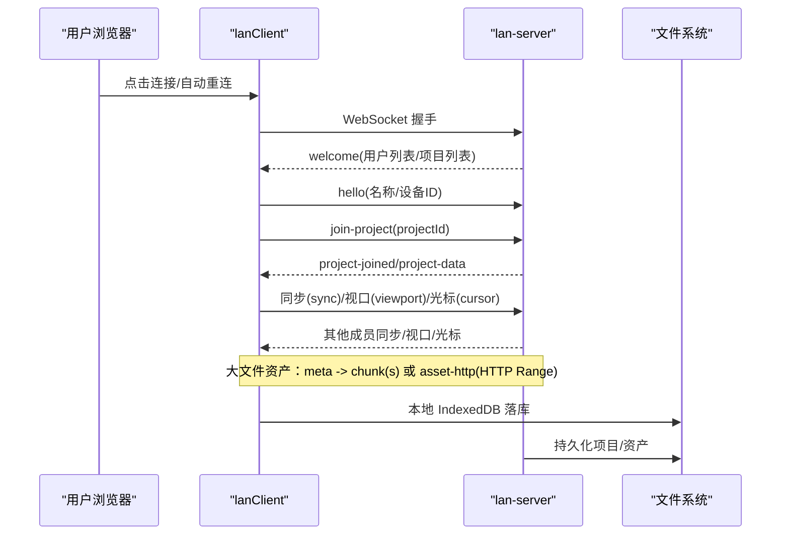
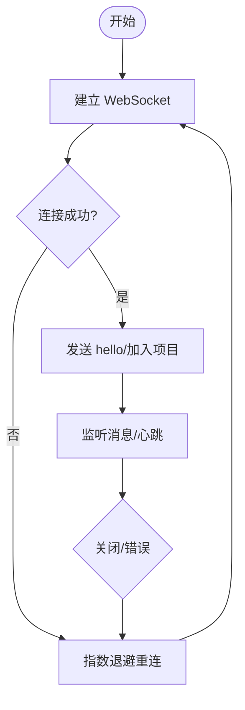
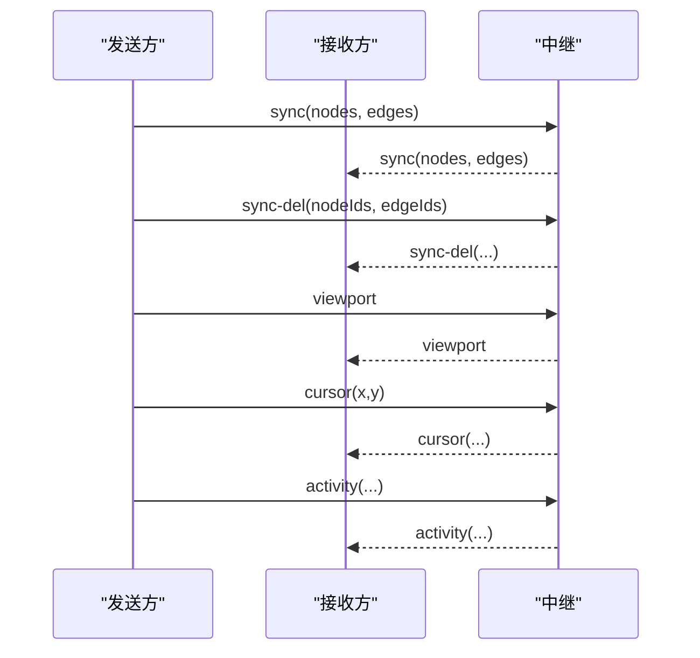
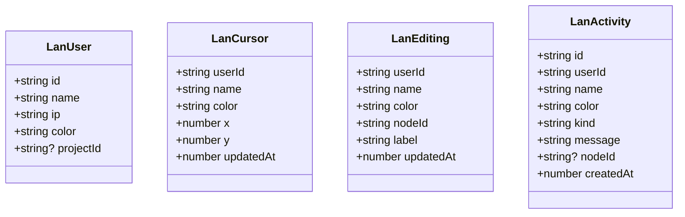
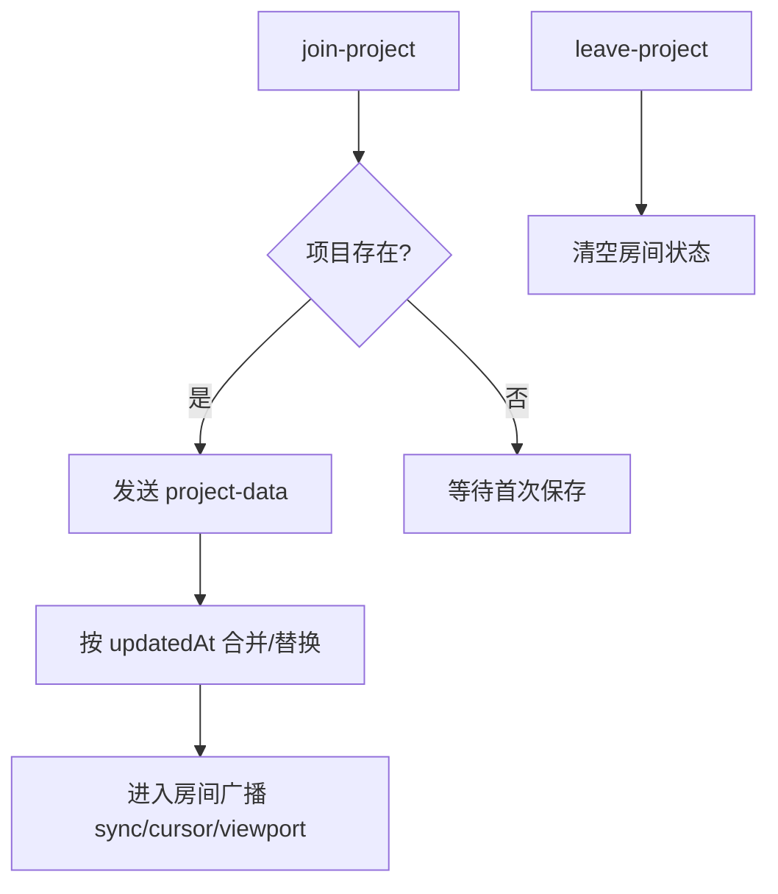
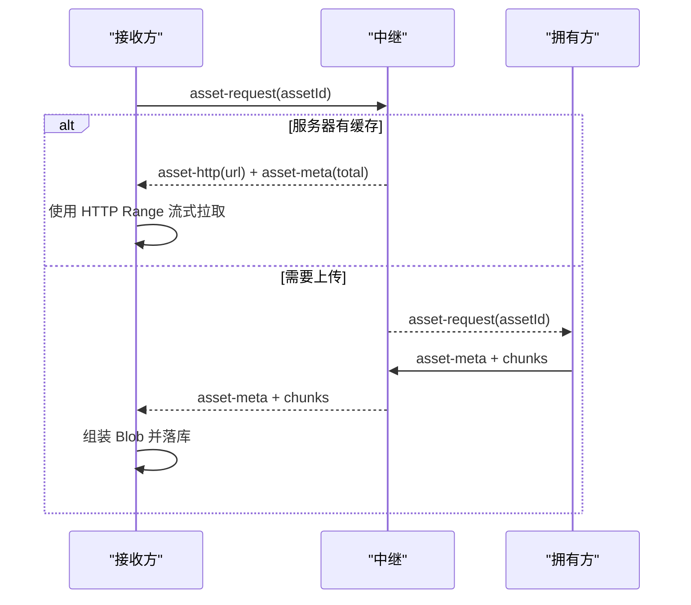
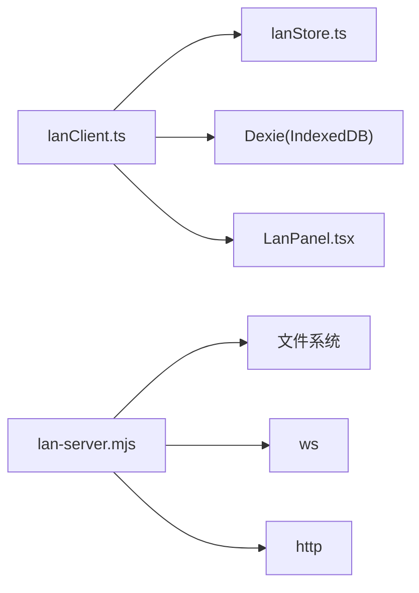

# 局域网协作

<cite>
**本文引用的文件**
- [server/lan-server.mjs](file://server/lan-server.mjs)
- [src/sync/lanClient.ts](file://src/sync/lanClient.ts)
- [src/sync/lanColors.ts](file://src/sync/lanColors.ts)
- [src/store/lanStore.ts](file://src/store/lanStore.ts)
- [src/components/LanPanel.tsx](file://src/components/LanPanel.tsx)
- [package.json](file://package.json)
- [README.md](file://README.md)
</cite>

## 目录
1. [简介](#简介)
2. [项目结构](#项目结构)
3. [核心组件](#核心组件)
4. [架构总览](#架构总览)
5. [详细组件分析](#详细组件分析)
6. [依赖关系分析](#依赖关系分析)
7. [性能与可靠性](#性能与可靠性)
8. [故障排查指南](#故障排查指南)
9. [结论](#结论)
10. [附录：部署与使用示例](#附录部署与使用示例)

## 简介
本技术文档围绕 SuQCanvas 的“局域网协作”能力展开，重点解释 WebSocket 连接管理、断线重连与自动恢复、消息协议设计（同步、删除、视口、光标等）、多用户协作实现原理（用户状态、颜色标识、活动日志）、项目房间机制（加入/离开、数据同步、冲突解决），以及服务器端部署与反向代理配置。文末提供自定义协作功能的接入示例。

## 项目结构
- 服务端：基于 Node.js + ws 的轻量中继服务，负责 WebSocket 路由、房间隔离、项目持久化、资产缓存与清理、HTTP 静态资源与 Range 流式拉取。
- 客户端：React + TypeScript，封装 WebSocket 连接、消息收发、断线重连、画布同步、素材分片传输、活动日志与用户状态管理。
- 状态层：Zustand 集中管理连接状态、用户列表、光标、编辑中状态、活动日志、当前项目 ID 等。
- UI 层：提供连接面板、用户跟随、活动记录展示等交互入口。

```mermaid
graph TB
subgraph "浏览器"
UI["LanPanel 组件"]
Client["lanClient 客户端"]
Store["lanStore 状态"]
end
subgraph "Node.js 中继"
HTTP["HTTP 静态/Range 流"]
WS["WebSocket 服务"]
Room["房间广播/路由"]
FS["项目/资产文件系统"]
end
UI --> Client
Client --> Store
Client < --> WS
WS --> Room
Room --> FS
HTTP --> FS
```

图表来源
- [src/components/LanPanel.tsx:17-199](file://src/components/LanPanel.tsx#L17-L199)
- [src/sync/lanClient.ts:254-362](file://src/sync/lanClient.ts#L254-L362)
- [server/lan-server.mjs:449-451](file://server/lan-server.mjs#L449-L451)
- [server/lan-server.mjs:661-906](file://server/lan-server.mjs#L661-L906)

章节来源
- [README.md:62-123](file://README.md#L62-L123)
- [package.json:6-20](file://package.json#L6-L20)

## 核心组件
- 连接管理：客户端建立/断开 WebSocket，支持自动重连、断点续传、空闲超时保护。
- 消息协议：定义 sync、sync-del、viewport、cursor、editing、activity、asset-* 等消息类型，按房间广播或点对点发送。
- 房间机制：join-project/leave-project 隔离不同项目的画布、视口、素材与活动日志。
- 用户状态：服务器分配颜色，客户端计算并显示；支持跟随他人视口。
- 活动日志：批量合并与防抖，记录创建/删除/移动/编辑/连线等操作。
- 项目持久化：保存至 server/data/projects.json，删除保留 24h 备份，支持恢复。
- 资产传输：大文件分片 base64 传输；视频优先走 HTTP Range 流式拉取；封面先于主体到达。

章节来源
- [src/sync/lanClient.ts:119-182](file://src/sync/lanClient.ts#L119-L182)
- [src/sync/lanClient.ts:409-642](file://src/sync/lanClient.ts#L409-L642)
- [server/lan-server.mjs:661-906](file://server/lan-server.mjs#L661-L906)
- [src/store/lanStore.ts:1-160](file://src/store/lanStore.ts#L1-L160)

## 架构总览


图表来源
- [src/sync/lanClient.ts:254-362](file://src/sync/lanClient.ts#L254-L362)
- [src/sync/lanClient.ts:409-642](file://src/sync/lanClient.ts#L409-L642)
- [server/lan-server.mjs:661-906](file://server/lan-server.mjs#L661-L906)

## 详细组件分析

### WebSocket 连接管理与断线重连
- 连接建立：解析地址（ws/wss）、设置默认端口与反代路径、存储上次连接信息、发送 hello 并请求项目列表。
- 断线重连：指数退避重试，保留已收分片，重连后自动补发缺失素材请求，恢复项目数据。
- 空闲超时：素材传输期间持续收到分片即续期，长时间无数据判定失败并清理状态。
- 安全校验：仅接受 JSON 文本消息，过滤非法消息体。



图表来源
- [src/sync/lanClient.ts:119-182](file://src/sync/lanClient.ts#L119-L182)
- [src/sync/lanClient.ts:254-362](file://src/sync/lanClient.ts#L254-L362)
- [src/sync/lanClient.ts:891-945](file://src/sync/lanClient.ts#L891-L945)

章节来源
- [src/sync/lanClient.ts:119-182](file://src/sync/lanClient.ts#L119-L182)
- [src/sync/lanClient.ts:254-362](file://src/sync/lanClient.ts#L254-L362)
- [src/sync/lanClient.ts:891-945](file://src/sync/lanClient.ts#L891-L945)

### 消息协议设计
- 同步消息 sync：包含 nodes/edges，按 id 并集合并，避免整幅覆盖导致误删。
- 删除消息 sync-del：显式传播删除，配合墓碑机制防止晚到旧快照复活节点。
- 视口同步 viewport：跟随模式下接收远端视口，非跟随时广播自身视口。
- 光标位置 cursor：实时广播鼠标坐标，用于显示协作者光标。
- 编辑状态 editing：标记某用户正在编辑某节点，避免冲突编辑。
- 活动日志 activity：批量合并操作，记录 create/delete/move/edit/connect/change。
- 资产相关：
  - asset-meta：元数据与分片总数
  - asset-chunk：分片数据（base64）
  - asset-thumb：封面字节（先于主体到达）
  - asset-request：请求缺失素材
  - asset-http：视频走 HTTP Range 流式拉取，不再通过 WS 整份下发



图表来源
- [src/sync/lanClient.ts:409-642](file://src/sync/lanClient.ts#L409-L642)
- [server/lan-server.mjs:868-888](file://server/lan-server.mjs#L868-L888)

章节来源
- [src/sync/lanClient.ts:409-642](file://src/sync/lanClient.ts#L409-L642)
- [server/lan-server.mjs:868-888](file://server/lan-server.mjs#L868-L888)

### 多用户协作实现
- 用户状态管理：服务器维护 clients Map，分配唯一 id、IP、颜色；客户端渲染用户列表与跟随按钮。
- 颜色标识系统：服务器从固定色表分配未占用颜色；客户端根据 userId 哈希生成稳定颜色。
- 活动日志记录：客户端将频繁操作合并为一条 activity，减少网络开销；服务端透传 from/color。
- 编辑锁定：editing 消息标记谁在编辑哪个节点，避免多人同时修改同一节点。



图表来源
- [src/store/lanStore.ts:4-51](file://src/store/lanStore.ts#L4-L51)
- [src/sync/lanColors.ts:1-24](file://src/sync/lanColors.ts#L1-L24)

章节来源
- [src/store/lanStore.ts:4-51](file://src/store/lanStore.ts#L4-L51)
- [src/sync/lanColors.ts:1-24](file://src/sync/lanColors.ts#L1-L24)
- [src/sync/lanClient.ts:674-716](file://src/sync/lanClient.ts#L674-L716)

### 项目房间机制
- 加入/离开：join-project/leave-project 切换 activeProjectId，进入房间后只在该房间内广播/接收消息。
- 数据同步策略：project-data 携带完整 graph/viewport，按 updatedAt 比较决定是否替换本地；删除项目时广播 project-deleted。
- 冲突解决算法：
  - 节点/边采用 id 并集合并，远端同 id 覆盖本地字段，本地独有保留。
  - 删除通过 sync-del 显式传播，结合墓碑窗口避免晚到旧快照复活。
  - 项目所有权由 creatorId 控制，仅创建者可删除。



图表来源
- [server/lan-server.mjs:696-728](file://server/lan-server.mjs#L696-L728)
- [src/sync/lanClient.ts:444-493](file://src/sync/lanClient.ts#L444-L493)
- [src/sync/lanClient.ts:527-598](file://src/sync/lanClient.ts#L527-L598)

章节来源
- [server/lan-server.mjs:696-728](file://server/lan-server.mjs#L696-L728)
- [src/sync/lanClient.ts:444-493](file://src/sync/lanClient.ts#L444-L493)
- [src/sync/lanClient.ts:527-598](file://src/sync/lanClient.ts#L527-L598)

### 资产传输与流式播放
- 分片传输：asset-meta 告知 totalChunks，随后多次 asset-chunk 传输 base64 分片；去重、乱序到达、断点续传。
- 视频优化：若服务器可返回 HTTP Range 流式地址（asset-http），客户端直接使用该 URL 边下边播，不再收集整份分片。
- 封面优先：asset-thumb 先于主体到达，提升首帧体验；本地已有封面可补推至服务器以修复历史缺失。
- 空闲超时：持续收到分片则续期，长时间无数据判定失败并清理。



图表来源
- [server/lan-server.mjs:593-659](file://server/lan-server.mjs#L593-L659)
- [server/lan-server.mjs:828-865](file://server/lan-server.mjs#L828-L865)
- [src/sync/lanClient.ts:1023-1089](file://src/sync/lanClient.ts#L1023-L1089)
- [src/sync/lanClient.ts:1091-1181](file://src/sync/lanClient.ts#L1091-L1181)

章节来源
- [server/lan-server.mjs:593-659](file://server/lan-server.mjs#L593-L659)
- [server/lan-server.mjs:828-865](file://server/lan-server.mjs#L828-L865)
- [src/sync/lanClient.ts:1023-1089](file://src/sync/lanClient.ts#L1023-L1089)
- [src/sync/lanClient.ts:1091-1181](file://src/sync/lanClient.ts#L1091-L1181)

## 依赖关系分析
- 客户端依赖：
  - Zustand 状态管理 lanStore，集中订阅/更新用户、光标、活动、项目等。
  - Dexie (IndexedDB) 持久化资产与项目。
  - React Flow (@xyflow/react) 作为画布引擎。
- 服务端依赖：
  - ws 处理 WebSocket 通信。
  - node:fs/promises 进行项目与资产文件的读写、备份与清理。
  - node:http 提供静态资源与 Range 流式拉取。



图表来源
- [src/sync/lanClient.ts:1-8](file://src/sync/lanClient.ts#L1-L8)
- [src/store/lanStore.ts:1-2](file://src/store/lanStore.ts#L1-L2)
- [server/lan-server.mjs:4-11](file://server/lan-server.mjs#L4-L11)

章节来源
- [package.json:22-34](file://package.json#L22-L34)
- [server/lan-server.mjs:4-11](file://server/lan-server.mjs#L4-L11)
- [src/sync/lanClient.ts:1-8](file://src/sync/lanClient.ts#L1-L8)

## 性能与可靠性
- 批量与防抖：
  - 删除消息合并（80ms 窗口）减少网络抖动。
  - 活动日志合并（350ms 窗口）避免刷屏。
  - 画布同步（150ms 窗口）降低高频变更带来的带宽压力。
- 内存与吞吐：
  - 分片 base64 解码为独立 Uint8Array 片段，避免拼接整个 base64 字符串造成双倍内存。
  - 视频优先走 HTTP Range 流式拉取，避免多台设备同时下载整份视频打满局域网。
  - 服务器侧对 asset-request 做 60s 去重广播，防止重复触发上传。
- 可靠性：
  - 断线重连保留已收分片，支持断点续传。
  - 项目删除保留 24h 备份，支持恢复。
  - 未被引用资产同样保留 24h 后清理，避免磁盘膨胀。

章节来源
- [src/sync/lanClient.ts:96-117](file://src/sync/lanClient.ts#L96-L117)
- [src/sync/lanClient.ts:655-716](file://src/sync/lanClient.ts#L655-L716)
- [src/sync/lanClient.ts:891-945](file://src/sync/lanClient.ts#L891-L945)
- [server/lan-server.mjs:107-205](file://server/lan-server.mjs#L107-L205)
- [server/lan-server.mjs:854-865](file://server/lan-server.mjs#L854-L865)

## 故障排查指南
- 无法连接中继：
  - 检查地址是否为 ws:// 或 wss://，HTTPS 页面必须使用 wss。
  - 确认防火墙放行 8790 端口或使用反向代理 /lan-ws。
- 连接不稳定：
  - 观察是否频繁断线重连，检查网络质量与代理配置。
  - 查看资产传输是否因空闲超时失败，确认源端在线且可访问。
- 项目无法删除：
  - 只有项目创建者可以删除，确认 deviceId/creatorId 匹配。
- 素材缺失：
  - 检查 asset-request 是否被服务器广播，确认持有方在线。
  - 对于视频，确认 asset-http 地址可访问（反向代理正确转发）。

章节来源
- [src/sync/lanClient.ts:19-57](file://src/sync/lanClient.ts#L19-L57)
- [src/sync/lanClient.ts:321-350](file://src/sync/lanClient.ts#L321-L350)
- [server/lan-server.mjs:731-757](file://server/lan-server.mjs#L731-L757)
- [server/lan-server.mjs:593-659](file://server/lan-server.mjs#L593-L659)

## 结论
该局域网协作方案通过房间隔离、并集合并与显式删除、资产分片与 HTTP Range 流式拉取、断线重连与空闲超时等机制，实现了高效、可靠的多用户协同编辑体验。服务端兼顾了项目与资产的持久化、备份与清理，客户端提供了友好的连接与协作界面。整体架构简洁清晰，易于扩展与维护。

## 附录：部署与使用示例

### 服务器端部署指南
- 环境要求：Node.js 运行环境，安装依赖后启动中继服务。
- 启动方式：
  - 开发模式：npm run dev:lan
  - 生产模式：npm run lan（可用 PM2 守护）
- 防火墙：Windows 首次部署需放行 8790 端口（脚本 open-lan-firewall.ps1）。
- 反向代理（推荐 HTTPS + wss）：
  - Nginx 配置示例：
    - /lan-ws 反向代理到 http://127.0.0.1:8790，启用 Upgrade/Connection 头与长超时。
    - /SuQCanvas/assets/ 反向代理到 http://127.0.0.1:8790，以便跨域读取素材封面。
- 数据目录：server/data/ 下包含 projects.json、assets/、backups/，建议定期备份；可通过 LAN_DATA_DIR 环境变量指定独立数据盘。

章节来源
- [README.md:62-123](file://README.md#L62-L123)
- [package.json:6-20](file://package.json#L6-L20)

### 自定义协作功能接入示例
- 新增自定义消息类型：
  - 客户端：在 onmessage 分支中添加新消息类型的处理逻辑，例如 chat、vote、annotation 等。
  - 服务端：在消息分发处添加新类型的路由，选择广播或点对点发送，并附加 from/color。
- 示例流程（以聊天消息为例）：
  - 客户端发送 t: 'chat', message: '...'
  - 服务端转发给房间内所有成员
  - 客户端渲染聊天列表，并可合并/分页显示
- 注意事项：
  - 保持消息体最小化，避免影响画布同步性能。
  - 对敏感信息进行过滤或加密。
  - 对高频消息进行合并与限流。

章节来源
- [src/sync/lanClient.ts:409-642](file://src/sync/lanClient.ts#L409-L642)
- [server/lan-server.mjs:868-888](file://server/lan-server.mjs#L868-L888)