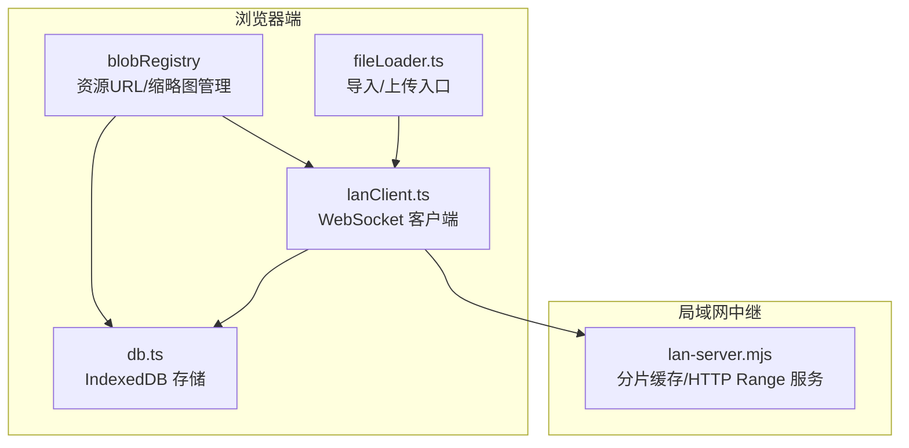
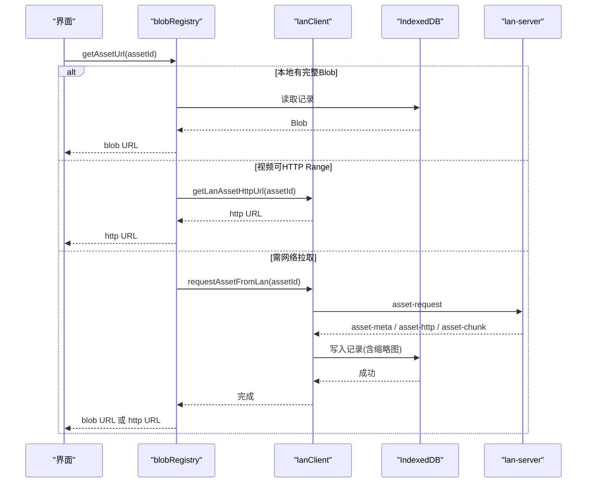
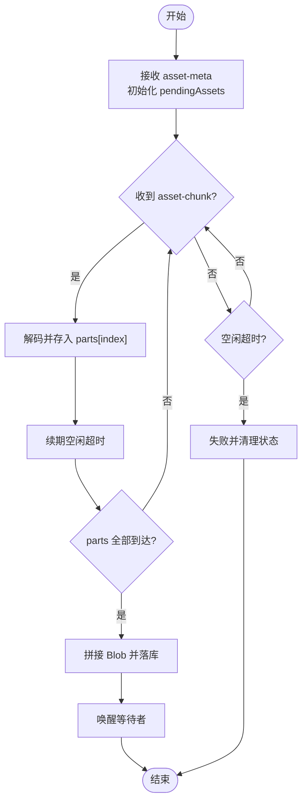
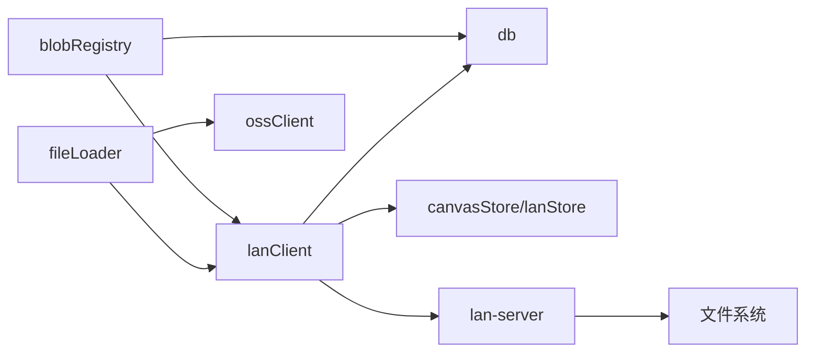

# 素材传输

<cite>
**本文引用的文件**
- [src/sync/lanClient.ts](file://src/sync/lanClient.ts)
- [server/lan-server.mjs](file://server/lan-server.mjs)
- [src/media/blobRegistry.ts](file://src/media/blobRegistry.ts)
- [src/io/fileLoader.ts](file://src/io/fileLoader.ts)
- [src/db/db.ts](file://src/db/db.ts)
- [src/types.ts](file://src/types.ts)
- [src/media/fileKind.ts](file://src/media/fileKind.ts)
- [src/sync/ossClient.ts](file://src/sync/ossClient.ts)
</cite>

## 目录
1. [简介](#简介)
2. [项目结构](#项目结构)
3. [核心组件](#核心组件)
4. [架构总览](#架构总览)
5. [详细组件分析](#详细组件分析)
6. [依赖关系分析](#依赖关系分析)
7. [性能考量](#性能考量)
8. [故障排查指南](#故障排查指南)
9. [结论](#结论)
10. [附录：使用示例](#附录使用示例)

## 简介
本技术文档围绕“素材传输系统”展开，重点解释大文件分片传输机制（分片大小计算、内存优化、断点续传）、传输协议（asset-meta、asset-chunk、asset-thumb、asset-http 等消息类型）、传输优化策略（HTTP Range 流式传输、空闲超时检测、重复请求防护），以及素材管理（本地缓存、内存管理、垃圾回收）。同时提供性能调优指南与具体使用示例，帮助开发者高效处理图片、视频、音频、PDF、PSD、Markdown、文本等多种媒体文件的传输与展示。

## 项目结构
该仓库采用前端 + 局域网中继服务的协作模式：
- 前端负责素材导入、本地缓存、缩略图生成、WebSocket 通信、HTTP Range 播放等。
- 局域网中继服务负责接收分片并落盘、提供 HTTP Range 流式访问、转发 WebSocket 消息。

图表来源
- [src/media/blobRegistry.ts:84-126](file://src/media/blobRegistry.ts#L84-L126)
- [src/sync/lanClient.ts:1023-1089](file://src/sync/lanClient.ts#L1023-L1089)
- [src/io/fileLoader.ts:77-117](file://src/io/fileLoader.ts#L77-L117)
- [src/db/db.ts:25-33](file://src/db/db.ts#L25-L33)
- [server/lan-server.mjs:613-659](file://server/lan-server.mjs#L613-L659)

章节来源
- [src/sync/lanClient.ts:1-1254](file://src/sync/lanClient.ts#L1-L1254)
- [server/lan-server.mjs:304-659](file://server/lan-server.mjs#L304-L659)
- [src/media/blobRegistry.ts:1-389](file://src/media/blobRegistry.ts#L1-L389)
- [src/io/fileLoader.ts:1-297](file://src/io/fileLoader.ts#L1-L297)
- [src/db/db.ts:1-69](file://src/db/db.ts#L1-L69)

## 核心组件
- 资源 URL 与缩略图管理：统一获取资源 URL、缩略图 URL，支持本地 IndexedDB、OSS、局域网 HTTP Range 三种来源；并发抓帧控制与黑帧自检。
- 局域网传输客户端：实现 asset-meta、asset-chunk、asset-thumb、asset-request、asset-http 等消息的收发；分片收集、空闲超时、断线重连、去重与重试。
- 局域网中继服务：分片落盘、HTTP Range 流式响应、跨域头设置、封面缓存与下发。
- 本地持久化与清理：IndexedDB 存储资产与项目数据；按引用关系标记孤儿资产并定期清理。
- 导入与同步：文件导入时识别类型、生成缩略图、推送至局域网与云端（可选）。

章节来源
- [src/media/blobRegistry.ts:84-126](file://src/media/blobRegistry.ts#L84-L126)
- [src/sync/lanClient.ts:1023-1089](file://src/sync/lanClient.ts#L1023-L1089)
- [server/lan-server.mjs:613-659](file://server/lan-server.mjs#L613-L659)
- [src/db/db.ts:46-69](file://src/db/db.ts#L46-L69)
- [src/io/fileLoader.ts:77-117](file://src/io/fileLoader.ts#L77-L117)

## 架构总览
整体流程包括：
- 导入阶段：用户选择文件，前端识别类型、生成缩略图、写入 IndexedDB，并通过 WebSocket 推送给局域网中继或房间内设备。
- 拉取阶段：当需要某素材时，优先走本地 IndexedDB；若为视频且服务器可提供 HTTP Range，则直接返回流式地址；否则通过 WebSocket 请求分片。
- 播放阶段：视频播放器直接使用 HTTP Range 地址边下边播；缩略图优先使用已下发的封面字节，否则从本地 blob 或流式地址抓帧生成。

图表来源
- [src/media/blobRegistry.ts:84-126](file://src/media/blobRegistry.ts#L84-L126)
- [src/sync/lanClient.ts:1054-1089](file://src/sync/lanClient.ts#L1054-L1089)
- [server/lan-server.mjs:613-659](file://server/lan-server.mjs#L613-L659)

## 详细组件分析

### 分片传输协议与消息类型
- asset-meta：声明资产元信息（id、name、mime、size、kind）与分片总数 totalChunks；用于初始化接收端分片收集器。
- asset-chunk：携带分片索引 index、总数 total、base64 编码的数据 data；接收端按 index 存入 parts 数组，全部到达后拼接成 Blob 并落库。
- asset-thumb：携带缩略图 MIME 与 base64 数据；优先于整份文件下发，使节点在传输过程中即可显示封面。
- asset-request：请求方发起拉取；服务端根据是否 forceBlob 决定返回 HTTP Range 地址或直接分片下发。
- asset-http：告知客户端可使用 HTTP Range 流式拉取（仅视频类），客户端收到后停止 WebSocket 下载，改用浏览器原生 Range 能力边下边播。

图表来源
- [src/sync/lanClient.ts:1091-1181](file://src/sync/lanClient.ts#L1091-L1181)
- [src/sync/lanClient.ts:891-945](file://src/sync/lanClient.ts#L891-L945)

章节来源
- [src/sync/lanClient.ts:1023-1089](file://src/sync/lanClient.ts#L1023-L1089)
- [src/sync/lanClient.ts:1091-1181](file://src/sync/lanClient.ts#L1091-L1181)
- [server/lan-server.mjs:613-659](file://server/lan-server.mjs#L613-L659)

### 分片大小与内存优化
- 分片大小：固定为 262143 字节（约 256KB - 1），确保每个分片的 base64 对齐到 3 的倍数边界，拼接后可精确还原原始数据。
- 内存优化：
  - 接收端将每个分片解码为独立 Uint8Array，收齐后再用 Blob(parts) 惰性引用，避免先拼接整个 base64 字符串造成双倍内存占用。
  - 发送端每 8 个分片让出一次主线程（await setTimeout(r, 0)），避免长时间阻塞导致浏览器判定无响应。
  - 服务器侧对视频类资产默认只返回 HTTP Range 地址，不再整份经 WebSocket 下发，减少带宽与内存压力。

章节来源
- [src/sync/lanClient.ts:10-13](file://src/sync/lanClient.ts#L10-L13)
- [src/sync/lanClient.ts:1131-1181](file://src/sync/lanClient.ts#L1131-L1181)
- [src/sync/lanClient.ts:1023-1052](file://src/sync/lanClient.ts#L1023-L1052)
- [server/lan-server.mjs:613-659](file://server/lan-server.mjs#L613-L659)

### 断点续传与空闲超时
- 断点续传：连接断开时保留已收到的分片与空闲定时器；自动重连后 onopen 会重新发起请求，接收端跳过已收分片继续收集。
- 空闲超时：只要持续有分片到达就续期，长时间无数据才判定失败；避免大视频因传输时间长被误判失败。
- 重复请求防护：同一素材在同一接收方只响应一次（sendingTargets），防止超时重试产生多路并发传输流互相覆盖。

章节来源
- [src/sync/lanClient.ts:118-152](file://src/sync/lanClient.ts#L118-L152)
- [src/sync/lanClient.ts:154-179](file://src/sync/lanClient.ts#L154-L179)
- [src/sync/lanClient.ts:891-945](file://src/sync/lanClient.ts#L891-L945)
- [src/sync/lanClient.ts:1183-1230](file://src/sync/lanClient.ts#L1183-L1230)

### HTTP Range 流式传输
- 服务器支持 Range 请求：解析 Range 头，返回 206 部分响应，包含 Content-Range 与 Accept-Ranges。
- 跨域支持：返回 Access-Control-Allow-Origin: *，允许不同源的视频元素抓取画面生成缩略图。
- 客户端行为：收到 asset-http 后记录流式地址，后续 getAssetUrl 直接返回该地址，播放器边下边播，不再整份下载。

章节来源
- [server/lan-server.mjs:304-372](file://server/lan-server.mjs#L304-L372)
- [server/lan-server.mjs:613-659](file://server/lan-server.mjs#L613-L659)
- [src/media/blobRegistry.ts:94-104](file://src/media/blobRegistry.ts#L94-L104)

### 缩略图生成与管理
- 优先使用局域网同步来的封面字节，避免重复解码。
- 若无封面，尝试从本地 blob 或 HTTP Range 地址抓帧；抓帧过程限制并发（最多 2 个），避免占满浏览器连接池。
- 黑帧自检：检测到全黑封面时自动 seek 并重试，直至获得有效画面。
- 兜底策略：若跨源/代理/编码异常导致抓帧失败，一次性拉取全量素材（forceBlob）再抓帧，避免反复拉大文件。

章节来源
- [src/media/blobRegistry.ts:128-239](file://src/media/blobRegistry.ts#L128-L239)
- [src/media/blobRegistry.ts:241-379](file://src/media/blobRegistry.ts#L241-L379)
- [src/sync/lanClient.ts:974-1021](file://src/sync/lanClient.ts#L974-L1021)

### 素材管理与垃圾回收
- 本地缓存：所有素材以 AssetRecord 形式存储在 IndexedDB，包含 id、name、mime、size、kind、blob、thumbnail。
- 引用追踪：遍历项目中的节点，收集被引用的 assetId；未被引用的资产标记 orphanedAt，超过保留时间后删除。
- 内存释放：URL.revokeObjectURL 及时释放 blob URL；批量清理函数在会话结束时释放所有缓存。

章节来源
- [src/db/db.ts:5-14](file://src/db/db.ts#L5-L14)
- [src/db/db.ts:46-69](file://src/db/db.ts#L46-L69)
- [src/media/blobRegistry.ts:381-389](file://src/media/blobRegistry.ts#L381-L389)

## 依赖关系分析
- blobRegistry 依赖 lanClient 获取局域网资源与缩略图，依赖 db 进行本地持久化。
- lanClient 依赖 db 存储资产记录，依赖 useCanvasStore/useLanStore 管理画布与协作状态。
- fileLoader 依赖 mediaCoordinator（未在本节详述）、ossClient、cloudSync、lanClient 完成导入与同步。
- server 依赖文件系统操作与 WebSocket 广播，提供 HTTP Range 服务。

图表来源
- [src/media/blobRegistry.ts:1-10](file://src/media/blobRegistry.ts#L1-L10)
- [src/sync/lanClient.ts:1-9](file://src/sync/lanClient.ts#L1-L9)
- [src/io/fileLoader.ts:1-18](file://src/io/fileLoader.ts#L1-L18)
- [server/lan-server.mjs:661-907](file://server/lan-server.mjs#L661-L907)

章节来源
- [src/media/blobRegistry.ts:1-10](file://src/media/blobRegistry.ts#L1-L10)
- [src/sync/lanClient.ts:1-9](file://src/sync/lanClient.ts#L1-L9)
- [src/io/fileLoader.ts:1-18](file://src/io/fileLoader.ts#L1-L18)
- [server/lan-server.mjs:661-907](file://server/lan-server.mjs#L661-L907)

## 性能考量
- 传输速度优化：
  - 视频优先使用 HTTP Range 流式地址，避免整份下载，提升首帧速度与拖动响应。
  - 分片大小适中（~256KB），平衡网络开销与解码效率。
  - 服务器侧流式读取分片，避免内存峰值。
- 内存使用优化：
  - 接收端按分片存储 Uint8Array，收齐后惰性构建 Blob，降低中间态内存占用。
  - 缩略图抓帧限制并发，避免过多 video 元素同时 seek 导致连接池耗尽。
  - 及时 revokeObjectURL，避免对象 URL 泄漏。
- 网络带宽优化：
  - 视频类资产默认只向服务器缓存推送，其他设备通过 HTTP Range 拉取，避免局域网内 N 份拷贝打满带宽。
  - 重复请求防护与空闲超时，减少无效重传与并发流。

[本节为通用指导，不直接分析具体文件]

## 故障排查指南
- 无法连接局域网中继：检查 ws/wss 地址与反向代理配置；HTTPS 页面必须使用 wss。
- 视频封面生成失败：确认服务器返回 CORS 头；若跨源失败，触发 forceBlob 兜底策略。
- 传输长时间无响应：检查空闲超时是否被正确续期；确认源端是否在线。
- 重复传输流：确认 sendingTargets 去重逻辑生效；避免多次 asset-request 导致多路并发。
- 内存溢出：监控 pendingAssets.parts 大小；确保分片解码与 Blob 构建顺序合理。

章节来源
- [src/sync/lanClient.ts:19-57](file://src/sync/lanClient.ts#L19-L57)
- [src/media/blobRegistry.ts:128-239](file://src/media/blobRegistry.ts#L128-L239)
- [src/sync/lanClient.ts:1183-1230](file://src/sync/lanClient.ts#L1183-L1230)

## 结论
该素材传输系统通过分片协议、HTTP Range 流式传输、空闲超时与断点续传等机制，实现了高效、稳定、低内存占用的大文件传输方案。结合本地缓存与垃圾回收，保障了离线可用性与长期运行的稳定性。对于不同媒体类型，系统提供了统一的导入、同步与展示流程，便于扩展与维护。

[本节为总结性内容，不直接分析具体文件]

## 附录：使用示例
以下示例展示如何处理不同类型的媒体文件传输：

- 图片导入与展示：
  - 调用 importFiles 选择图片文件，系统识别类型为 image，生成节点并推送到局域网与云端（可选）。
  - 通过 getAssetUrl 获取本地 blob URL 或 HTTP Range 地址，直接用于 img 标签展示。

- 视频导入与播放：
  - 导入时生成缩略图并推送；若服务器缓存就绪，getAssetUrl 返回 HTTP Range 地址，播放器边下边播。
  - 缩略图优先使用局域网同步的封面字节，否则从本地 blob 或流式地址抓帧生成。

- 音频导入与播放：
  - 导入时识别类型为 audio，生成节点并推送；播放时使用本地 blob URL。
  - 通过 mediaCoordinator 管理音频互斥，避免多个音频同时播放。

- PDF/PSD/Markdown/文本：
  - 导入时识别类型，生成对应节点；文本类可通过 updateAssetText 更新内容并同步。
  - PSD 预览生成失败时提示用户仍可下载原文件。

章节来源
- [src/io/fileLoader.ts:77-117](file://src/io/fileLoader.ts#L77-L117)
- [src/io/fileLoader.ts:186-205](file://src/io/fileLoader.ts#L186-L205)
- [src/media/fileKind.ts:3-16](file://src/media/fileKind.ts#L3-L16)
- [src/media/blobRegistry.ts:84-126](file://src/media/blobRegistry.ts#L84-L126)
- [src/media/blobRegistry.ts:241-379](file://src/media/blobRegistry.ts#L241-L379)