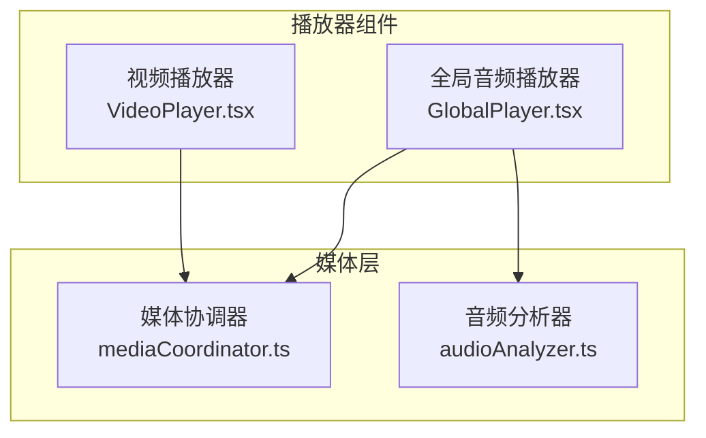
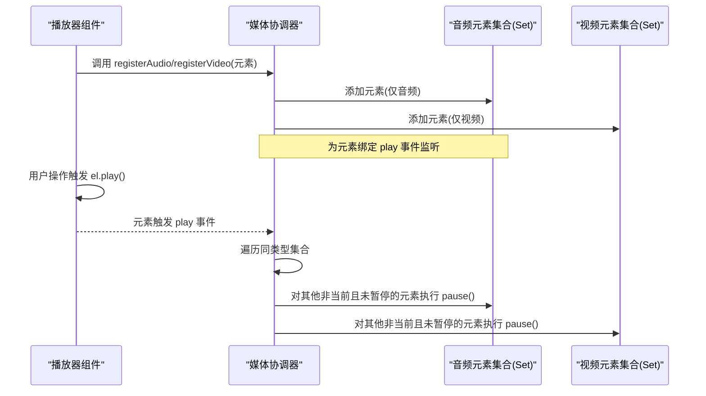
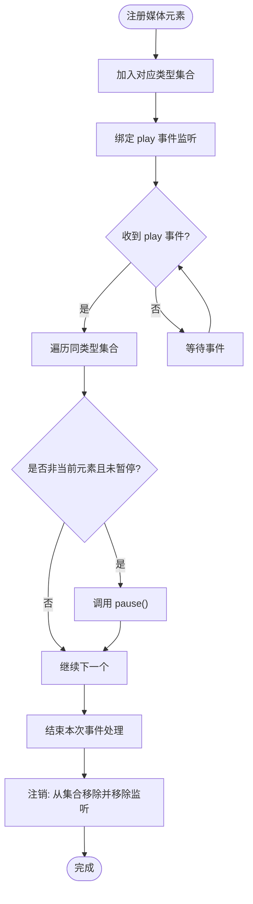
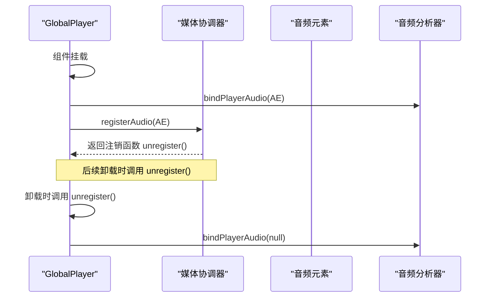
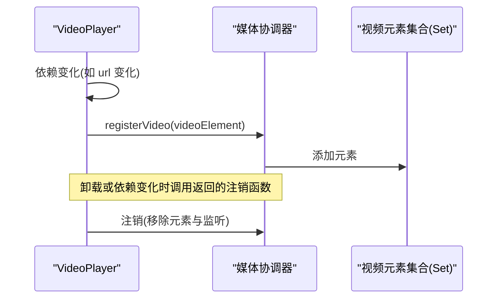
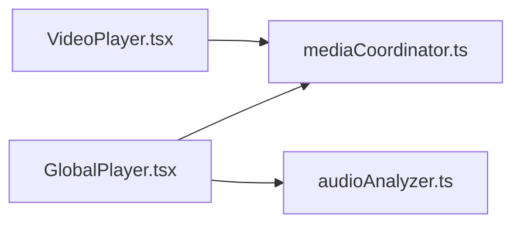

# 媒体协调器

<cite>
**本文引用的文件**
- [mediaCoordinator.ts](file://src/media/mediaCoordinator.ts)
- [GlobalPlayer.tsx](file://src/components/GlobalPlayer.tsx)
- [VideoPlayer.tsx](file://src/components/VideoPlayer.tsx)
- [audioAnalyzer.ts](file://src/media/audioAnalyzer.ts)
</cite>

## 目录
1. [简介](#简介)
2. [项目结构](#项目结构)
3. [核心组件](#核心组件)
4. [架构总览](#架构总览)
5. [详细组件分析](#详细组件分析)
6. [依赖关系分析](#依赖关系分析)
7. [性能考虑](#性能考虑)
8. [故障排查指南](#故障排查指南)
9. [结论](#结论)
10. [附录：最佳实践与示例](#附录最佳实践与示例)

## 简介
本技术文档聚焦于“媒体协调器”的核心设计与实现，解释其互斥播放机制、媒体元素注册管理、播放状态控制与资源清理策略。重点说明 makeRegistrar 工厂函数的工作原理、Set 集合的使用模式、事件监听器的生命周期管理，并给出在组件中正确注册与注销媒体元素的实践建议，包括内存泄漏防护与性能优化要点。

## 项目结构
媒体协调器位于 src/media/mediaCoordinator.ts，提供全局的音频与视频互斥播放能力；音频播放器通过 GlobalPlayer.tsx 使用 registerAudio；视频播放器通过 VideoPlayer.tsx 使用 registerVideo。音频可视化与分析由 audioAnalyzer.ts 提供。

图表来源
- [mediaCoordinator.ts:1-25](file://src/media/mediaCoordinator.ts#L1-L25)
- [GlobalPlayer.tsx:86-97](file://src/components/GlobalPlayer.tsx#L86-L97)
- [VideoPlayer.tsx:325-330](file://src/components/VideoPlayer.tsx#L325-L330)
- [audioAnalyzer.ts:1-59](file://src/media/audioAnalyzer.ts#L1-L59)

章节来源
- [mediaCoordinator.ts:1-25](file://src/media/mediaCoordinator.ts#L1-L25)
- [GlobalPlayer.tsx:86-97](file://src/components/GlobalPlayer.tsx#L86-L97)
- [VideoPlayer.tsx:325-330](file://src/components/VideoPlayer.tsx#L325-L330)
- [audioAnalyzer.ts:1-59](file://src/media/audioAnalyzer.ts#L1-L59)

## 核心组件
- 媒体协调器（mediaCoordinator.ts）
  - 维护两个全局 Set：音频元素集合与视频元素集合。
  - 提供 makeRegistrar 工厂函数，为指定类型的媒体元素创建注册器。
  - 导出 registerAudio 与 registerVideo，供各播放器组件调用。
- 全局音频播放器（GlobalPlayer.tsx）
  - 持有唯一的全局 <audio> 元素，并在挂载时调用 registerAudio 完成注册。
  - 在卸载回调中调用返回的注销函数，确保事件监听与集合引用被清理。
- 视频播放器（VideoPlayer.tsx）
  - 在 useEffect 中根据当前视频 URL 获取 videoRef，并调用 registerVideo 完成注册。
  - 利用返回的注销函数在依赖变化或卸载时清理。
- 音频分析器（audioAnalyzer.ts）
  - 单例 AudioContext + AnalyserNode，将当前播放的 <audio> 接入频谱分析，用于可视化。

章节来源
- [mediaCoordinator.ts:1-25](file://src/media/mediaCoordinator.ts#L1-L25)
- [GlobalPlayer.tsx:86-97](file://src/components/GlobalPlayer.tsx#L86-L97)
- [VideoPlayer.tsx:325-330](file://src/components/VideoPlayer.tsx#L325-L330)
- [audioAnalyzer.ts:1-59](file://src/media/audioAnalyzer.ts#L1-L59)

## 架构总览
媒体协调器采用“集中式互斥”的策略：同一时刻最多一个音频和一个视频在播放。任意媒体元素触发 play 事件时，协调器会暂停同类型其他正在播放的元素，从而实现互斥。

图表来源
- [mediaCoordinator.ts:7-21](file://src/media/mediaCoordinator.ts#L7-L21)
- [GlobalPlayer.tsx:86-97](file://src/components/GlobalPlayer.tsx#L86-L97)
- [VideoPlayer.tsx:325-330](file://src/components/VideoPlayer.tsx#L325-L330)

## 详细组件分析

### 媒体协调器（makeRegistrar 与 Set 模式）
- 设计目标
  - 保证同类型媒体互斥播放：任一元素开始播放时，自动暂停同类型其他正在播放的元素。
  - 最小化耦合：通过工厂函数生成注册器，避免在组件内直接操作全局集合。
- 关键实现
  - 使用两个全局 Set 分别保存音频与视频元素，天然去重且 O(1) 查找。
  - makeRegistrar 接收一个 Set 作为上下文，返回一个注册函数：
    - 将传入元素加入集合。
    - 为该元素绑定 play 事件监听：当该元素触发 play 时，遍历集合，对除自身外的所有未暂停元素调用 pause。
    - 返回一个注销函数：从集合移除元素，并移除事件监听，防止内存泄漏。
- 复杂度与性能
  - 每次 play 事件触发时，需遍历同类型集合进行暂停，时间复杂度 O(n)。由于 n 通常很小（页面可见媒体数量有限），开销可接受。
  - 使用 Set 保证元素唯一性，避免重复注册导致的重复监听与重复暂停。
- 错误处理
  - 若元素已不在 DOM 或被销毁，事件监听仍可能触发；但集合删除与 removeEventListener 能安全地释放引用。
  - 对于不支持 Web API 的环境，上层组件应做好降级处理（如禁用相关功能）。

图表来源
- [mediaCoordinator.ts:7-21](file://src/media/mediaCoordinator.ts#L7-L21)

章节来源
- [mediaCoordinator.ts:1-25](file://src/media/mediaCoordinator.ts#L1-L25)

### 全局音频播放器（GlobalPlayer）
- 职责
  - 维护唯一的 <audio> 元素，作为全局播放引擎。
  - 在组件挂载时将音频元素注册到媒体协调器，并在卸载时调用注销函数。
  - 同步音量、静音等状态到音频元素。
- 与协调器的交互
  - 使用 registerAudio(audioElement) 完成注册，返回的注销函数在组件卸载时调用，确保事件监听与集合引用被清理。
- 与音频分析器的协作
  - 通过 bindPlayerAudio 将当前音频元素接入分析器，用于频谱可视化。

图表来源
- [GlobalPlayer.tsx:86-97](file://src/components/GlobalPlayer.tsx#L86-L97)
- [audioAnalyzer.ts:26-39](file://src/media/audioAnalyzer.ts#L26-L39)

章节来源
- [GlobalPlayer.tsx:86-97](file://src/components/GlobalPlayer.tsx#L86-L97)
- [audioAnalyzer.ts:1-59](file://src/media/audioAnalyzer.ts#L1-L59)

### 视频播放器（VideoPlayer）
- 职责
  - 管理当前视频的播放、进度、音量、倍速、全屏、画中画等功能。
  - 在依赖变化（如当前视频 URL）时重新注册视频元素到媒体协调器。
- 与协调器的交互
  - 在 useEffect 中获取 videoRef，调用 registerVideo(videoElement)，并利用返回的注销函数在依赖变化或卸载时清理。
- 互斥行为
  - 当某个视频元素触发 play 时，协调器会暂停其他正在播放的视频元素，确保同一时刻只有一个视频在播放。

图表来源
- [VideoPlayer.tsx:325-330](file://src/components/VideoPlayer.tsx#L325-L330)
- [mediaCoordinator.ts:7-21](file://src/media/mediaCoordinator.ts#L7-L21)

章节来源
- [VideoPlayer.tsx:325-330](file://src/components/VideoPlayer.tsx#L325-L330)
- [mediaCoordinator.ts:1-25](file://src/media/mediaCoordinator.ts#L1-L25)

## 依赖关系分析
- 组件到协调器的依赖
  - GlobalPlayer 依赖 registerAudio，确保全局音频互斥。
  - VideoPlayer 依赖 registerVideo，确保视频互斥。
- 协调器内部依赖
  - 使用原生 HTMLMediaElement 的 play/pause 事件与 API。
  - 使用 Set 管理元素集合，保证唯一性与高效操作。
- 外部依赖
  - 音频分析器依赖浏览器 Web Audio API，用于频谱可视化。

图表来源
- [GlobalPlayer.tsx:86-97](file://src/components/GlobalPlayer.tsx#L86-L97)
- [VideoPlayer.tsx:325-330](file://src/components/VideoPlayer.tsx#L325-L330)
- [mediaCoordinator.ts:1-25](file://src/media/mediaCoordinator.ts#L1-L25)
- [audioAnalyzer.ts:1-59](file://src/media/audioAnalyzer.ts#L1-L59)

章节来源
- [GlobalPlayer.tsx:86-97](file://src/components/GlobalPlayer.tsx#L86-L97)
- [VideoPlayer.tsx:325-330](file://src/components/VideoPlayer.tsx#L325-L330)
- [mediaCoordinator.ts:1-25](file://src/media/mediaCoordinator.ts#L1-L25)
- [audioAnalyzer.ts:1-59](file://src/media/audioAnalyzer.ts#L1-L59)

## 性能考虑
- 事件处理复杂度
  - 每次 play 事件触发时，协调器遍历同类型集合进行暂停，时间复杂度 O(n)。由于页面同时存在的媒体元素数量通常较小，影响有限。
- 集合操作效率
  - 使用 Set 进行元素的增删查，平均时间复杂度 O(1)，适合高频注册/注销场景。
- 事件监听生命周期
  - 通过返回注销函数的方式，确保在组件卸载或依赖变化时及时移除事件监听，避免内存泄漏。
- 音频分析器
  - 使用 WeakSet 跟踪已接入分析器的元素，避免重复连接；仅在必要时恢复 AudioContext，减少不必要的唤醒成本。

[本节为通用性能讨论，不直接分析具体代码行]

## 故障排查指南
- 现象：多个音频/视频同时播放
  - 检查是否正确调用 registerAudio/registerVideo，并确保在卸载时调用返回的注销函数。
  - 确认媒体元素确实触发了 play 事件（某些浏览器需要用户手势才能自动播放）。
- 现象：内存泄漏或事件重复触发
  - 确认每个媒体元素只注册一次，且在组件卸载或依赖变化时调用注销函数。
  - 避免在循环或频繁渲染中重复注册同一元素。
- 现象：音频可视化无效
  - 检查 bindPlayerAudio 是否正确绑定当前音频元素。
  - 确认浏览器支持 Web Audio API，且 AudioContext 状态为 running。

章节来源
- [GlobalPlayer.tsx:86-97](file://src/components/GlobalPlayer.tsx#L86-L97)
- [VideoPlayer.tsx:325-330](file://src/components/VideoPlayer.tsx#L325-L330)
- [audioAnalyzer.ts:26-39](file://src/media/audioAnalyzer.ts#L26-L39)

## 结论
媒体协调器通过简洁的工厂函数与 Set 集合，实现了可靠的同类型媒体互斥播放机制。配合组件中的注册/注销生命周期管理，确保了资源的安全释放与稳定的播放体验。在实际使用中，遵循正确的注册与注销模式，可以有效避免内存泄漏与并发播放问题，同时保持较好的性能表现。

[本节为总结性内容，不直接分析具体代码行]

## 附录：最佳实践与示例

### 媒体元素注册与注销的最佳实践
- 始终在组件挂载或依赖变化时注册媒体元素，并在卸载或依赖变化时调用返回的注销函数。
- 避免重复注册同一元素；如需切换元素，先注销旧元素再注册新元素。
- 对于动态生成的媒体元素，确保在 DOM 移除前完成注销。
- 在不可自动播放的环境中，提示用户进行交互以触发首次播放。

章节来源
- [GlobalPlayer.tsx:86-97](file://src/components/GlobalPlayer.tsx#L86-L97)
- [VideoPlayer.tsx:325-330](file://src/components/VideoPlayer.tsx#L325-L330)
- [mediaCoordinator.ts:7-21](file://src/media/mediaCoordinator.ts#L7-L21)

### 在组件中正确使用媒体协调器的示例路径
- 音频播放器注册与注销
  - 参考路径：[GlobalPlayer.tsx:86-97](file://src/components/GlobalPlayer.tsx#L86-L97)
- 视频播放器注册与注销
  - 参考路径：[VideoPlayer.tsx:325-330](file://src/components/VideoPlayer.tsx#L325-L330)
- 音频分析器接入
  - 参考路径：[audioAnalyzer.ts:26-39](file://src/media/audioAnalyzer.ts#L26-L39)

### 内存泄漏防护清单
- 确保每个注册都有对应的注销调用。
- 避免在闭包中捕获过期的元素引用。
- 在组件卸载时清理定时器、事件监听与媒体元素引用。

### 性能优化建议
- 尽量减少同时存在的媒体元素数量。
- 合理使用 preload 属性，避免不必要的预加载。
- 在大数据量场景下，考虑分页或懒加载媒体列表。

[本节为通用指导，不直接分析具体代码行]