# 媒体处理系统

<cite>
**本文引用的文件**
- [mediaCoordinator.ts](file://src/media/mediaCoordinator.ts)
- [managedFile.ts](file://src/media/managedFile.ts)
- [fileKind.ts](file://src/media/fileKind.ts)
- [blobRegistry.ts](file://src/media/blobRegistry.ts)
- [audioAnalyzer.ts](file://src/media/audioAnalyzer.ts)
- [playlists.ts](file://src/media/playlists.ts)
- [pdf.ts](file://src/media/pdf.ts)
- [psdPreview.ts](file://src/media/psdPreview.ts)
- [useAssetUrl.ts](file://src/media/useAssetUrl.ts)
- [coverColor.ts](file://src/media/coverColor.ts)
- [db.ts](file://src/db/db.ts)
- [types.ts](file://src/types.ts)
- [AudioPlayer.tsx](file://src/components/AudioPlayer.tsx)
- [PdfViewerModal.tsx](file://src/components/PdfViewerModal.tsx)
</cite>

## 目录
1. [简介](#简介)
2. [项目结构](#项目结构)
3. [核心组件](#核心组件)
4. [架构总览](#架构总览)
5. [详细组件分析](#详细组件分析)
6. [依赖关系分析](#依赖关系分析)
7. [性能考量与优化建议](#性能考量与优化建议)
8. [故障排查指南](#故障排查指南)
9. [结论](#结论)

## 简介
本技术文档面向媒体处理子系统，围绕以下目标展开：
- 解释 MediaCoordinator（媒体协调器）的互斥播放机制与工作流程。
- 说明 ManagedFile 文件管理机制：生命周期、内存管理、缓存策略。
- 阐述 FileKind 文件类型识别算法与扩展点。
- 详解 BlobRegistry 资源注册表：URL 生成、资源去重、内存优化、缩略图抓取。
- 深入音频分析器、播放列表管理、PDF 渲染、PSD 预览等具体功能实现。
- 提供媒体文件处理的性能优化建议与最佳实践。

## 项目结构
媒体子系统位于 src/media 下，按职责划分模块：
- 资源与 URL：blobRegistry.ts、useAssetUrl.ts
- 文件识别与管理：fileKind.ts、managedFile.ts
- 媒体协调：mediaCoordinator.ts
- 音频能力：audioAnalyzer.ts、coverColor.ts
- 播放列表：playlists.ts
- 文档与图像：pdf.ts、psdPreview.ts
- 数据持久化：db.ts
- 类型定义：types.ts
- 上层集成：AudioPlayer.tsx、PdfViewerModal.tsx

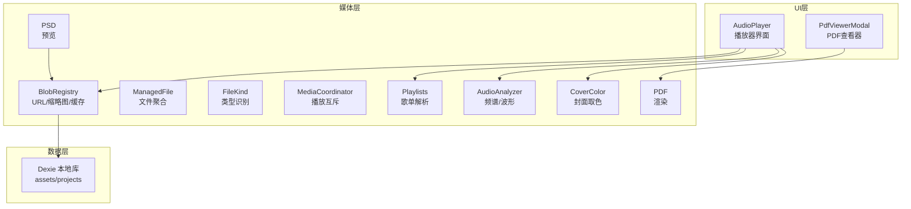

图表来源
- [blobRegistry.ts:1-389](file://src/media/blobRegistry.ts#L1-L389)
- [managedFile.ts:1-39](file://src/media/managedFile.ts#L1-L39)
- [fileKind.ts:1-24](file://src/media/fileKind.ts#L1-L24)
- [mediaCoordinator.ts:1-25](file://src/media/mediaCoordinator.ts#L1-L25)
- [audioAnalyzer.ts:1-59](file://src/media/audioAnalyzer.ts#L1-L59)
- [coverColor.ts:1-252](file://src/media/coverColor.ts#L1-L252)
- [playlists.ts:1-179](file://src/media/playlists.ts#L1-L179)
- [pdf.ts:1-50](file://src/media/pdf.ts#L1-L50)
- [psdPreview.ts:1-62](file://src/media/psdPreview.ts#L1-L62)
- [db.ts:1-69](file://src/db/db.ts#L1-L69)
- [AudioPlayer.tsx:1-800](file://src/components/AudioPlayer.tsx#L1-L800)
- [PdfViewerModal.tsx:1-146](file://src/components/PdfViewerModal.tsx#L1-L146)

章节来源
- [blobRegistry.ts:1-389](file://src/media/blobRegistry.ts#L1-L389)
- [managedFile.ts:1-39](file://src/media/managedFile.ts#L1-L39)
- [fileKind.ts:1-24](file://src/media/fileKind.ts#L1-L24)
- [mediaCoordinator.ts:1-25](file://src/media/mediaCoordinator.ts#L1-L25)
- [audioAnalyzer.ts:1-59](file://src/media/audioAnalyzer.ts#L1-L59)
- [coverColor.ts:1-252](file://src/media/coverColor.ts#L1-L252)
- [playlists.ts:1-179](file://src/media/playlists.ts#L1-L179)
- [pdf.ts:1-50](file://src/media/pdf.ts#L1-L50)
- [psdPreview.ts:1-62](file://src/media/psdPreview.ts#L1-L62)
- [db.ts:1-69](file://src/db/db.ts#L1-L69)
- [AudioPlayer.tsx:1-800](file://src/components/AudioPlayer.tsx#L1-L800)
- [PdfViewerModal.tsx:1-146](file://src/components/PdfViewerModal.tsx#L1-L146)

## 核心组件
- MediaCoordinator：全局媒体互斥，确保同一时刻最多一个音频和一个视频在播放；任意媒体元素触发 play 时自动暂停同类型的其他元素。
- ManagedFile：从画布节点与素材记录聚合出可管理的文件列表，每个 assetId 一份，便于播放器统一处理。
- FileKind：基于 MIME 与扩展名进行文件类型识别，支持图片、视频、音频、PDF、Markdown、文本、PSD、通用文件等。
- BlobRegistry：资源 URL/缩略图获取、缓存、并发控制、跨源抓帧、局域网/云端回退、内存释放。
- AudioAnalyzer：Web Audio AnalyserNode 接入，提供频谱与音量级，用于可视化背景与频谱条。
- Playlists：从画布图结构派生歌单，DFS 先序线性化，边 order 排序，环/重复检测与告警。
- PDF：基于 pdfjs-dist 的打开、关闭、页面渲染到 Canvas。
- PSD 预览：通过 Web Worker 异步解码 PSD 并生成缩略图，队列串行执行避免阻塞。
- useAssetUrl/useThumbnailUrl：React Hook 封装资源与缩略图的加载、重试、轮询与失效。
- CoverColor：从封面提取主色调与歌词区亮度，驱动 UI 主题与对比度自适应。

章节来源
- [mediaCoordinator.ts:1-25](file://src/media/mediaCoordinator.ts#L1-L25)
- [managedFile.ts:1-39](file://src/media/managedFile.ts#L1-L39)
- [fileKind.ts:1-24](file://src/media/fileKind.ts#L1-L24)
- [blobRegistry.ts:1-389](file://src/media/blobRegistry.ts#L1-L389)
- [audioAnalyzer.ts:1-59](file://src/media/audioAnalyzer.ts#L1-L59)
- [playlists.ts:1-179](file://src/media/playlists.ts#L1-L179)
- [pdf.ts:1-50](file://src/media/pdf.ts#L1-L50)
- [psdPreview.ts:1-62](file://src/media/psdPreview.ts#L1-L62)
- [useAssetUrl.ts:1-157](file://src/media/useAssetUrl.ts#L1-L157)
- [coverColor.ts:1-252](file://src/media/coverColor.ts#L1-L252)

## 架构总览
媒体子系统以“资源注册表”为核心，向上为播放器与查看器提供稳定的 URL/缩略图，向下对接本地 IndexedDB、局域网中继与云端 OSS。关键流程包括：
- 资源 URL 获取：优先本地 blob，其次局域网 HTTP 流式地址，最后兜底拉取完整资源。
- 缩略图生成：视频通过抓帧生成 JPEG，限制并发，失败时回退到全量 blob 再抓。
- 播放互斥：音频/视频各自维护集合，play 事件触发时暂停同类型其他实例。
- 歌单解析：基于画布连线 DFS 线性化，保证播放顺序一致。
- 文档与图像：PDF 懒加载渲染，PSD 通过 Worker 异步解码。

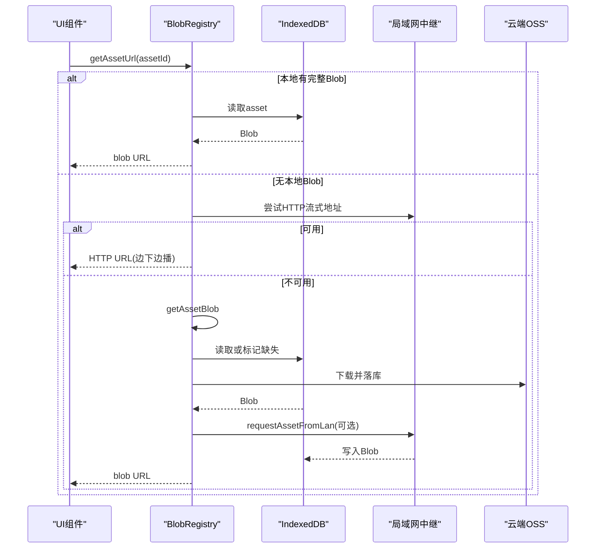

图表来源
- [blobRegistry.ts:84-126](file://src/media/blobRegistry.ts#L84-L126)
- [blobRegistry.ts:128-239](file://src/media/blobRegistry.ts#L128-L239)
- [blobRegistry.ts:310-379](file://src/media/blobRegistry.ts#L310-L379)
- [db.ts:1-69](file://src/db/db.ts#L1-L69)

章节来源
- [blobRegistry.ts:84-126](file://src/media/blobRegistry.ts#L84-L126)
- [blobRegistry.ts:128-239](file://src/media/blobRegistry.ts#L128-L239)
- [blobRegistry.ts:310-379](file://src/media/blobRegistry.ts#L310-L379)
- [db.ts:1-69](file://src/db/db.ts#L1-L69)

## 详细组件分析

### MediaCoordinator 媒体协调器
- 作用：全局互斥播放，防止多音频/多视频同时播放导致体验冲突。
- 机制：分别维护 audio/video 元素集合；对每个元素注册 play 监听，触发时暂停同类型其他元素；卸载时移除监听并从集合删除。
- 复杂度：O(n) 遍历暂停，n 为同类型媒体元素数量；通常较小。
- 扩展性：可按需增加新媒体类型（如直播流）。

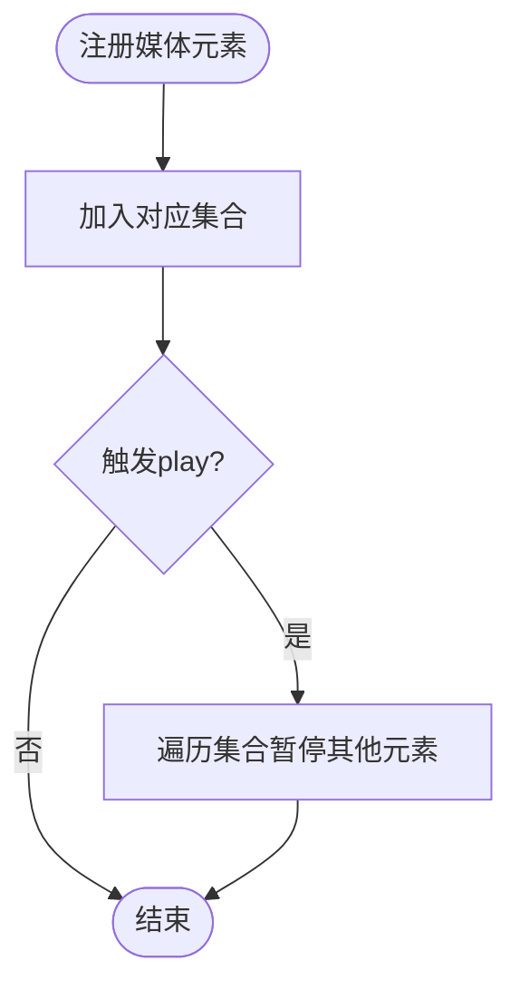

图表来源
- [mediaCoordinator.ts:7-21](file://src/media/mediaCoordinator.ts#L7-L21)

章节来源
- [mediaCoordinator.ts:1-25](file://src/media/mediaCoordinator.ts#L1-L25)

### ManagedFile 文件管理机制
- 聚合逻辑：将画布节点按 assetId 分组，结合数据库中的 AssetRecord 生成 ManagedFile，包含名称、类型、MIME、大小、关联节点。
- 用途：播放器批量展示、搜索、排序、下载等。
- 内存与生命周期：ManagedFile 本身轻量，实际大对象由 BlobRegistry 管理 URL/Blob；当资源失效或切换时，通过 invalidate* 释放 URL。
- 扩展点：isMp3 判断可用于快速筛选 MP3；未来可扩展 isVideo/isImage 等。

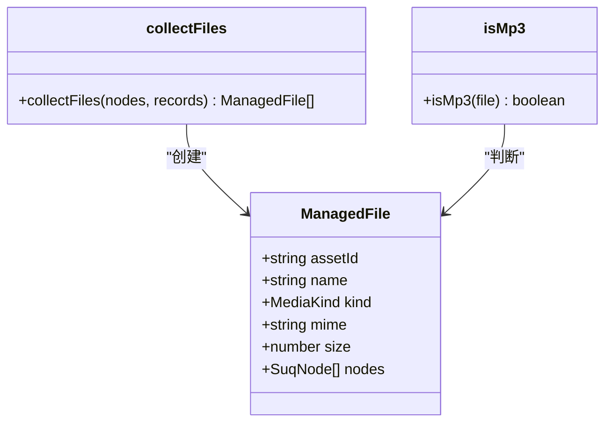

图表来源
- [managedFile.ts:4-39](file://src/media/managedFile.ts#L4-L39)

章节来源
- [managedFile.ts:1-39](file://src/media/managedFile.ts#L1-L39)

### FileKind 文件类型识别算法
- 规则：优先扩展名（如 psd、pdf、md/markdown），其次 MIME 前缀（image/、video/、audio/、text/），最后回退为 file。
- 扩展方式：新增类型只需在 detectKind 中增加分支；formatBytes 用于显示文件大小。
- 复杂度：O(1)，仅字符串操作与前缀匹配。

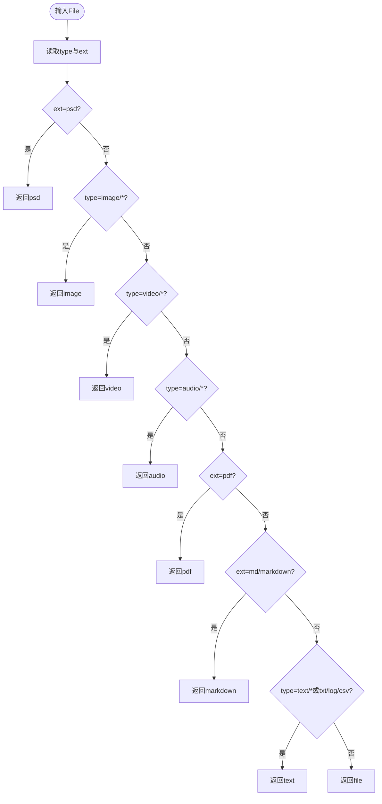

图表来源
- [fileKind.ts:3-16](file://src/media/fileKind.ts#L3-L16)

章节来源
- [fileKind.ts:1-24](file://src/media/fileKind.ts#L1-L24)

### BlobRegistry 资源注册表
- URL 生成策略：
  - 优先本地 IndexedDB 中的完整 Blob，生成 blob URL 并缓存。
  - 若存在局域网 HTTP 流式地址，直接返回该 URL，支持边下边播与拖动进度。
  - 否则调用 getAssetBlob 获取完整资源：先从云端下载并落库，必要时请求局域网传输。
- 缩略图抓取：
  - 视频：使用隐藏的 video 元素 seek 到合适时间点，canvas 绘制后 toBlob 生成 JPEG；限制并发（默认2），避免阻塞浏览器连接池。
  - 黑帧检测：采样像素均值，过低则 seek 下一采样点重试，最多若干次。
  - 跨源问题：设置 crossOrigin=anonymous，配合服务器 CORS。
  - 失败回退：HTTP 抓帧失败且无本地文件时，一次性强制拉取完整 blob 再抓帧。
- 缓存与去重：
  - urlCache/thumbCache 缓存 URL，避免重复 createObjectURL。
  - thumbnailGenerating 防止同一资产并发重复抓帧。
  - lanSourceRequested 防止重复发起局域网取源请求。
  - blobFallbackAttempted 避免反复拉取大文件。
- 内存优化：
  - 及时 revokeObjectURL（invalidate*、revokeAllUrls）。
  - 视频抓帧临时 URL 立即释放。
  - 并发上限保护，避免过多视频元素同时 seek。

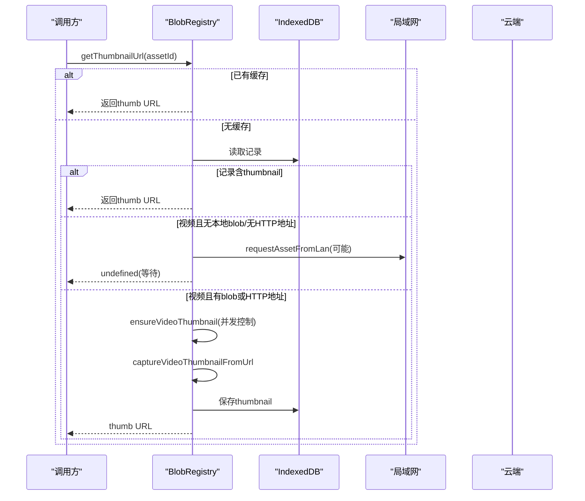

图表来源
- [blobRegistry.ts:310-379](file://src/media/blobRegistry.ts#L310-L379)
- [blobRegistry.ts:128-239](file://src/media/blobRegistry.ts#L128-L239)
- [blobRegistry.ts:241-268](file://src/media/blobRegistry.ts#L241-L268)

章节来源
- [blobRegistry.ts:1-389](file://src/media/blobRegistry.ts#L1-L389)

### 音频分析器与可视化
- 接入方式：单例 AudioContext + AnalyserNode，首次使用时创建并配置 FFTSize 与平滑系数；通过 MediaElementAudioSourceNode 接入 <audio>。
- 数据读取：getAnalyser() 获取 AnalyserNode；getAudioLevel() 计算归一化音量级供波纹幅度使用。
- 兼容性：WeakSet 跟踪已接入元素，避免重复连接；捕获异常降级为无动画。

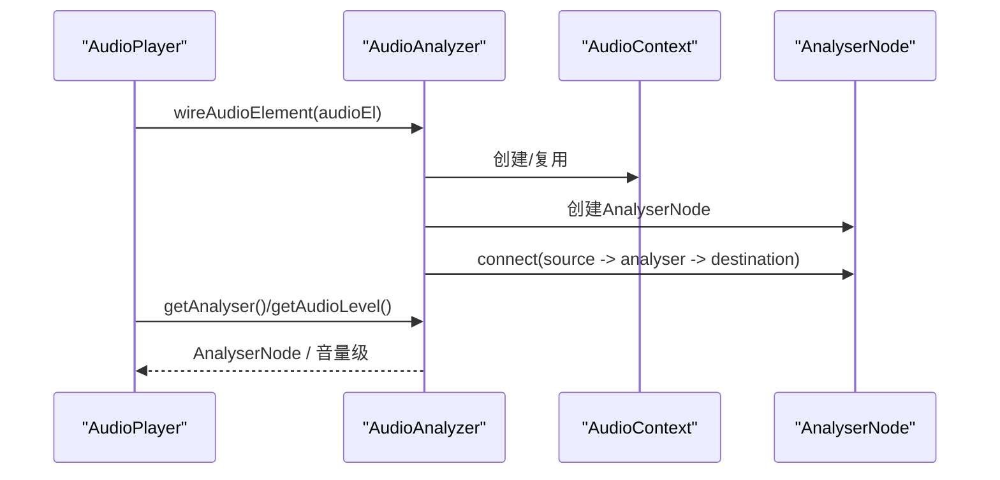

图表来源
- [audioAnalyzer.ts:1-59](file://src/media/audioAnalyzer.ts#L1-L59)

章节来源
- [audioAnalyzer.ts:1-59](file://src/media/audioAnalyzer.ts#L1-L59)

### 播放列表管理
- 规则：命名文本节点（无入边、恰好一条出边指向音频）作为歌单名；首节点为该音频；内容沿“音频→音频”边做 DFS 先序遍历。
- 排序：分叉处按边 data.order 升序，未设置排后，再按 edges 数组顺序稳定排序。
- 健壮性：环检测（onPath）、重复节点跳过、同一 assetId 只保留第一次出现并告警。
- 缓存：resolvePlaylistsCached 基于引用相等缓存结果，避免重复解析整张图。

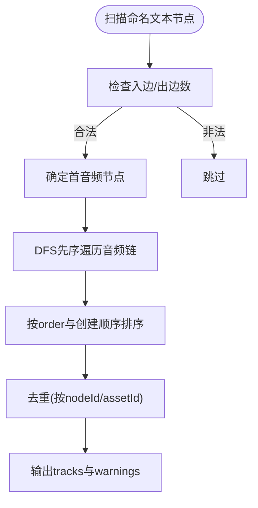

图表来源
- [playlists.ts:71-112](file://src/media/playlists.ts#L71-L112)
- [playlists.ts:114-153](file://src/media/playlists.ts#L114-L153)

章节来源
- [playlists.ts:1-179](file://src/media/playlists.ts#L1-L179)

### PDF 渲染
- 懒加载：PdfViewerModal 动态 import pdf 模块，按需加载 pdfjs-dist。
- 配置：设置 workerSrc、cMapUrl、standardFontDataUrl、wasmUrl，解决 CJK 字体与标准字体/JBIG2/JPX 图片兼容问题。
- 渲染：根据设备像素比调整 canvas 尺寸，使用 page.getViewport 与 render 渲染到 Canvas。
- 资源清理：closePdf 销毁任务，避免内存泄漏。

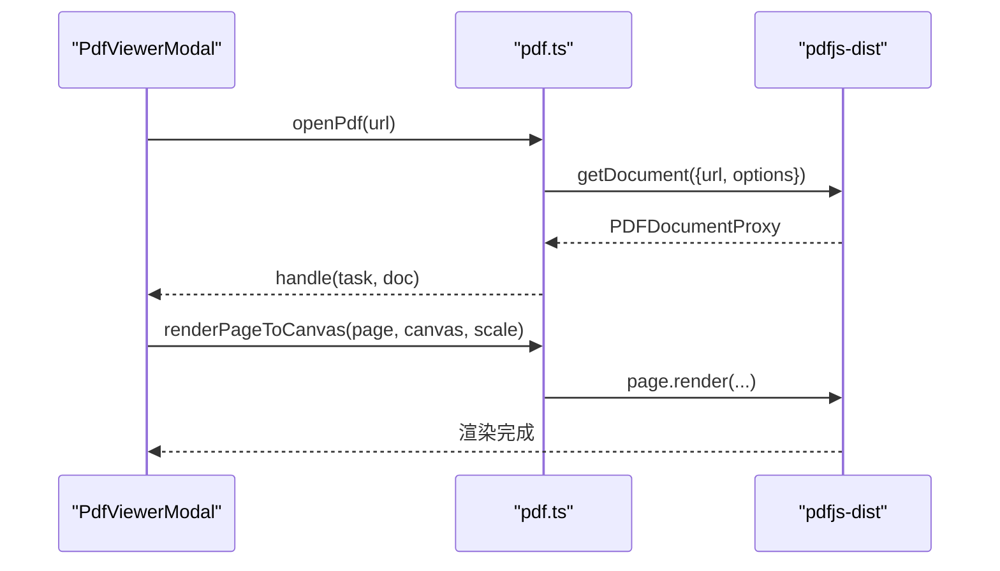

图表来源
- [pdf.ts:1-50](file://src/media/pdf.ts#L1-L50)
- [PdfViewerModal.tsx:24-78](file://src/components/PdfViewerModal.tsx#L24-L78)

章节来源
- [pdf.ts:1-50](file://src/media/pdf.ts#L1-L50)
- [PdfViewerModal.tsx:1-146](file://src/components/PdfViewerModal.tsx#L1-L146)

### PSD 预览
- 工作线程：psdPreview.worker.ts 负责解码 PSD，主线程通过 Worker 消息传递 ArrayBuffer。
- 队列串行：queue Promise 链串行执行，避免多个 PSD 同时解码造成卡顿。
- 缓存与失效：生成缩略图后存入 assets.thumbnail，并调用 invalidateThumbnailUrl 使旧 URL 失效。
- 错误处理：Worker 出错时清空 pending 并终止 Worker，重新创建。

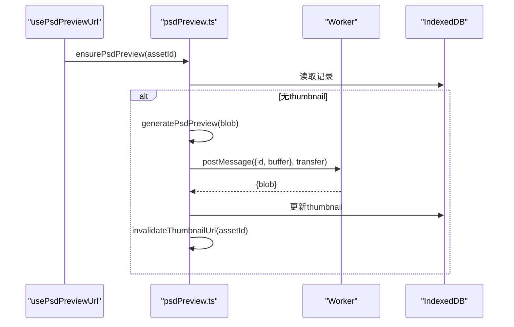

图表来源
- [psdPreview.ts:1-62](file://src/media/psdPreview.ts#L1-L62)
- [useAssetUrl.ts:129-157](file://src/media/useAssetUrl.ts#L129-L157)

章节来源
- [psdPreview.ts:1-62](file://src/media/psdPreview.ts#L1-L62)
- [useAssetUrl.ts:1-157](file://src/media/useAssetUrl.ts#L1-L157)

### 封面取色与歌词对比度
- 主色提取：采样高饱和像素均值，转换为 HSL 并钳制饱和度/亮度区间，生成强调色与背景 tint。
- 歌词区亮度：模拟播放器背景 cover-fit 裁剪区域，计算 WCAG 相对亮度，用于选择白字或深灰字。
- 对比度：基于 WCAG 公式计算对比度，结合迟滞余量避免临界亮度闪烁。

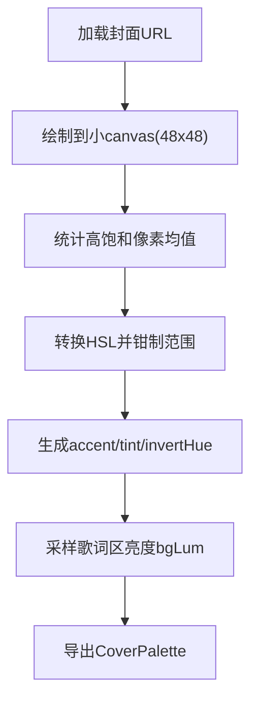

图表来源
- [coverColor.ts:154-229](file://src/media/coverColor.ts#L154-L229)
- [coverColor.ts:111-148](file://src/media/coverColor.ts#L111-L148)

章节来源
- [coverColor.ts:1-252](file://src/media/coverColor.ts#L1-L252)

## 依赖关系分析
- 模块耦合：
  - AudioPlayer 依赖 playlists、blobRegistry、audioAnalyzer、coverColor、useAssetUrl。
  - PdfViewerModal 依赖 blobRegistry（通过 useAssetUrl）与 pdf 模块。
  - BlobRegistry 依赖 db、lanClient、ossClient、cloudSync。
- 外部依赖：
  - pdfjs-dist：PDF 渲染与资源（worker/cmaps/wasm）。
  - Dexie：IndexedDB 封装。
  - @xyflow/react：画布节点/边类型。
- 潜在循环：当前未见直接循环依赖；Hook 与模块间通过函数调用解耦。

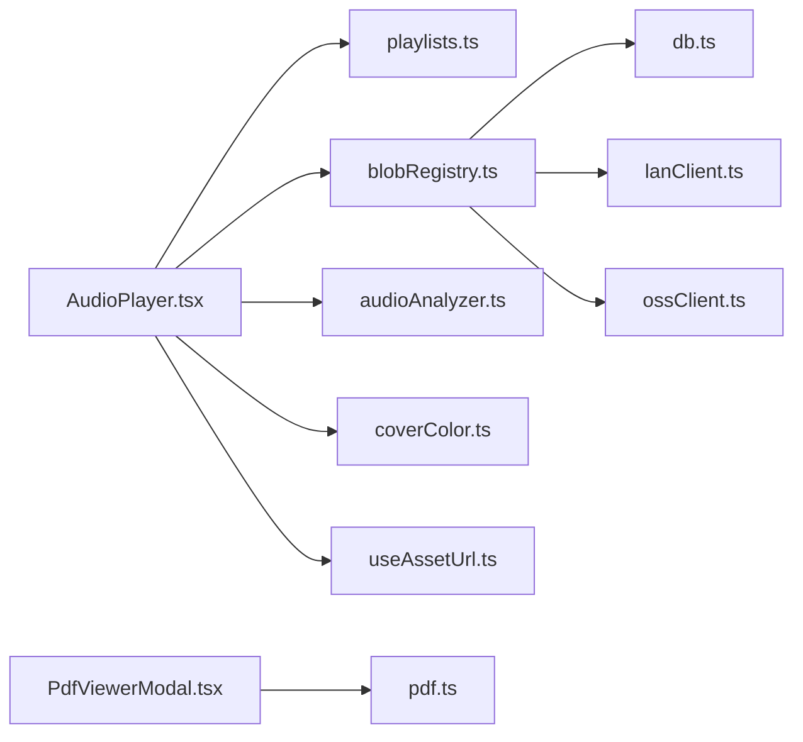

图表来源
- [AudioPlayer.tsx:1-800](file://src/components/AudioPlayer.tsx#L1-L800)
- [PdfViewerModal.tsx:1-146](file://src/components/PdfViewerModal.tsx#L1-L146)
- [blobRegistry.ts:1-389](file://src/media/blobRegistry.ts#L1-L389)

章节来源
- [AudioPlayer.tsx:1-800](file://src/components/AudioPlayer.tsx#L1-L800)
- [PdfViewerModal.tsx:1-146](file://src/components/PdfViewerModal.tsx#L1-L146)
- [blobRegistry.ts:1-389](file://src/media/blobRegistry.ts#L1-L389)

## 性能考量与优化建议
- 资源 URL 与缩略图缓存
  - 使用 urlCache/thumbCache 减少重复 createObjectURL，降低内存压力。
  - 及时调用 invalidate* 与 revokeAllUrls 释放 URL，避免内存泄漏。
- 并发控制
  - 视频缩略图抓取限制并发（THUMB_MAX_CONCURRENT=2），避免浏览器连接池耗尽影响播放。
  - PSD 预览通过 Promise 队列串行执行，避免多任务竞争 CPU。
- 网络与存储
  - 优先使用局域网 HTTP 流式地址，边下边播，避免整份下载到 IndexedDB。
  - 云端下载后落库，提升离线可用性；局域网传输失败时重试一次。
- 渲染优化
  - PDF 渲染根据 devicePixelRatio 调整 canvas 尺寸，避免过度缩放。
  - 封面取色使用小尺寸 canvas 采样，降低计算开销。
- 内存管理
  - 视频抓帧临时 URL 立即释放；Blob 过大时谨慎使用，优先流式。
  - 定期 GC：gcAssets 清理未被项目引用的孤儿资源。

[本节为通用指导，不直接分析具体文件]

## 故障排查指南
- 视频缩略图始终为黑图
  - 检查跨域设置：crossOrigin=anonymous，确认服务器允许跨域。
  - 观察 captureVideoThumbnailFromUrl 的黑帧检测与重试逻辑，确认 duration>1 且多次 seek。
  - 若 HTTP 抓帧失败，确认 blobFallbackAttempted 是否触发，必要时强制拉取完整 blob。
- 资源加载失败
  - useAssetUrl 内置重试（MAX_ATTEMPTS=5，RETRY_DELAY=1200ms），关注 toast 提示。
  - 检查局域网连接状态与中继是否在线；必要时手动刷新或重新请求。
- 播放冲突
  - 若多音频/视频同时播放，确认 MediaCoordinator 是否正确注册与取消注册。
  - 检查元素是否在 DOM 中正确挂载与卸载。
- PDF 打开失败
  - 确认 pdfjs 资源路径（BASE_URL + 'pdfjs/'）正确，worker/cmaps/wasm 可访问。
  - 查看控制台错误，确认页面权限与跨域。
- PSD 预览失败
  - 检查 Worker 是否成功初始化与消息传递；查看 pending 队列是否清空。
  - 大文件或格式不支持时，toast 提示用户。

章节来源
- [blobRegistry.ts:128-239](file://src/media/blobRegistry.ts#L128-L239)
- [blobRegistry.ts:310-379](file://src/media/blobRegistry.ts#L310-L379)
- [useAssetUrl.ts:10-44](file://src/media/useAssetUrl.ts#L10-L44)
- [mediaCoordinator.ts:1-25](file://src/media/mediaCoordinator.ts#L1-L25)
- [pdf.ts:1-50](file://src/media/pdf.ts#L1-L50)
- [psdPreview.ts:1-62](file://src/media/psdPreview.ts#L1-L62)

## 结论
媒体处理系统以 BlobRegistry 为核心，统一管理资源 URL 与缩略图，结合局域网与云端能力，提供高效、可靠的媒体访问。MediaCoordinator 保障播放互斥，ManagedFile 简化文件管理，FileKind 提供灵活的类型识别。音频分析器、播放列表、PDF 渲染与 PSD 预览共同构成完整的媒体体验。通过缓存、并发控制与内存优化，系统在复杂场景下仍保持良好性能。建议在生产环境中持续监控资源占用与网络状况，并根据业务需求扩展类型识别与媒体处理能力。