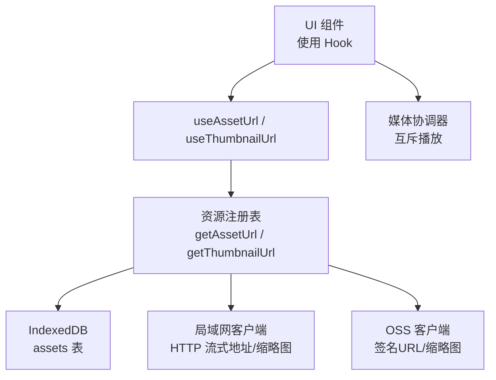
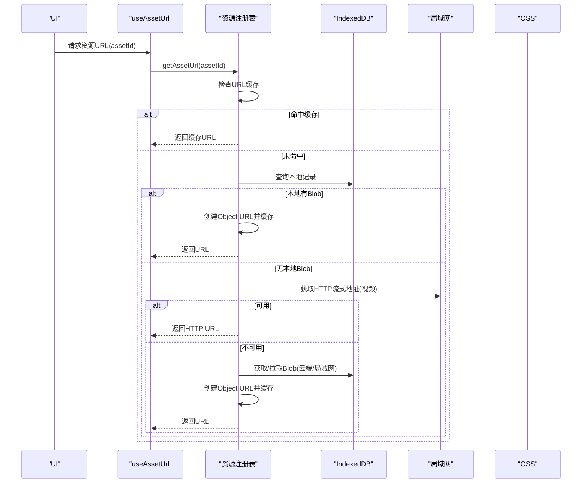
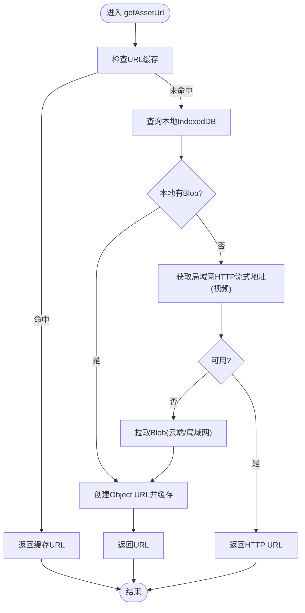
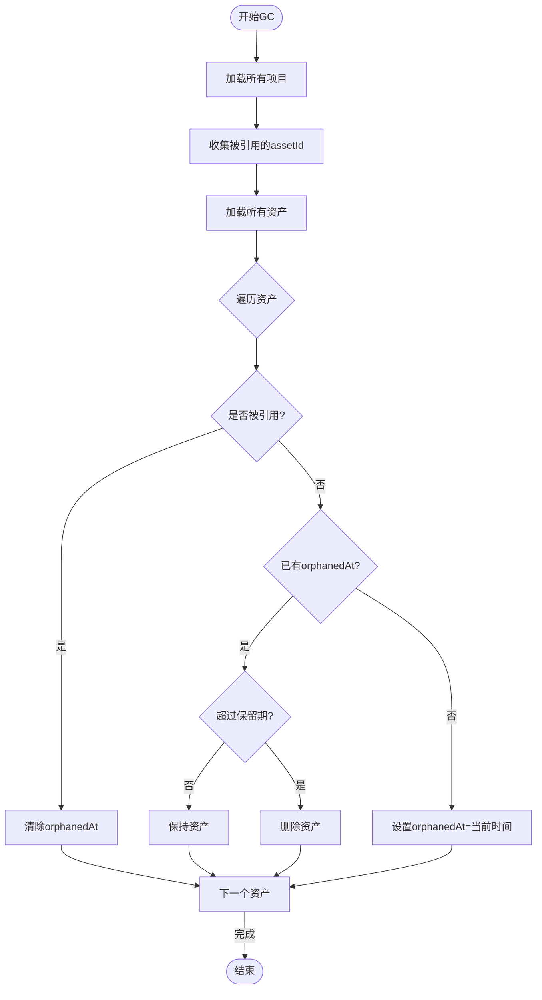
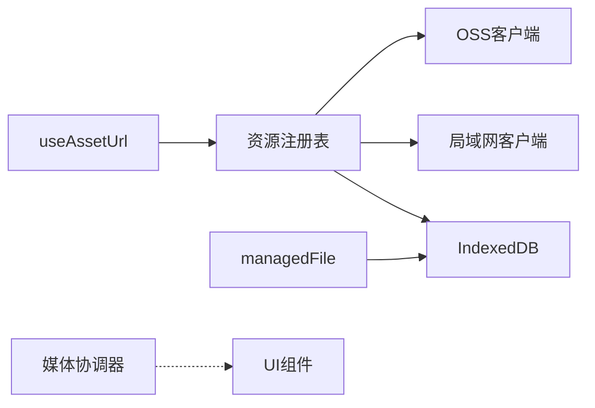

# Blob 资源注册表

<cite>
**本文引用的文件**
- [blobRegistry.ts](file://src/media/blobRegistry.ts)
- [useAssetUrl.ts](file://src/media/useAssetUrl.ts)
- [managedFile.ts](file://src/media/managedFile.ts)
- [db.ts](file://src/db/db.ts)
- [lanClient.ts](file://src/sync/lanClient.ts)
- [ossClientImpl.ts](file://src/sync/ossClientImpl.ts)
- [mediaCoordinator.ts](file://src/media/mediaCoordinator.ts)
- [types.ts](file://src/types.ts)
</cite>

## 目录
1. [简介](#简介)
2. [项目结构](#项目结构)
3. [核心组件](#核心组件)
4. [架构总览](#架构总览)
5. [详细组件分析](#详细组件分析)
6. [依赖关系分析](#依赖关系分析)
7. [性能考量](#性能考量)
8. [故障排查指南](#故障排查指南)
9. [结论](#结论)
10. [附录：API 参考与最佳实践](#附录api-参考与最佳实践)

## 简介
本技术文档围绕前端“Blob 资源注册表”展开，系统性阐述其设计模式、数据结构与核心机制（资源映射、引用计数、内存管理），并深入说明 URL 生成算法与资源定位策略（唯一性保证与冲突解决）、自动清理与垃圾回收（过期检测、内存释放）、以及性能优化建议与监控指标。同时提供完整的 API 参考与最佳实践示例，帮助开发者安全高效地使用资源管理系统。

## 项目结构
该功能主要位于 media 层，配合 db 持久化、sync 局域网与云端同步、以及 React Hook 暴露给 UI 使用。关键文件职责如下：
- blobRegistry.ts：资源注册表核心，负责 URL 缓存、缩略图缓存、抓取封面、本地/局域网/云端资源获取与落库。
- useAssetUrl.ts：React Hook，封装资源 URL 与缩略图 URL 的加载、重试与生命周期管理。
- managedFile.ts：聚合画布节点与素材记录，形成可管理的文件视图（用于统计、批量操作等）。
- db.ts：IndexedDB 抽象，定义资产记录结构与垃圾回收逻辑。
- lanClient.ts：局域网传输协议与 HTTP 流式地址、缩略图同步、分片接收与空闲超时等。
- ossClientImpl.ts：OSS 客户端实现，提供签名 URL 与缩略图下载。
- mediaCoordinator.ts：全局媒体互斥（同一时刻最多一个音频/视频播放）。
- types.ts：类型定义，包括 MediaKind、SuqNodeData 等。

图表来源
- [blobRegistry.ts:84-126](file://src/media/blobRegistry.ts#L84-L126)
- [useAssetUrl.ts:10-44](file://src/media/useAssetUrl.ts#L10-L44)
- [lanClient.ts:154-181](file://src/sync/lanClient.ts#L154-L181)
- [ossClientImpl.ts:124-134](file://src/sync/ossClientImpl.ts#L124-L134)
- [mediaCoordinator.ts:1-25](file://src/media/mediaCoordinator.ts#L1-L25)

章节来源
- [blobRegistry.ts:1-389](file://src/media/blobRegistry.ts#L1-L389)
- [useAssetUrl.ts:1-157](file://src/media/useAssetUrl.ts#L1-L157)
- [managedFile.ts:1-39](file://src/media/managedFile.ts#L1-L39)
- [db.ts:1-69](file://src/db/db.ts#L1-L69)
- [lanClient.ts:1-200](file://src/sync/lanClient.ts#L1-L200)
- [ossClientImpl.ts:116-134](file://src/sync/ossClientImpl.ts#L116-L134)
- [mediaCoordinator.ts:1-25](file://src/media/mediaCoordinator.ts#L1-L25)
- [types.ts:1-112](file://src/types.ts#L1-L112)

## 核心组件
- 资源注册表（blobRegistry）
  - 维护 URL 缓存与缩略图缓存，避免重复创建 Object URL。
  - 提供资源 URL 与缩略图 URL 的统一入口，内部决定从本地 IndexedDB、局域网 HTTP 流式地址或云端 OSS 拉取。
  - 对视频资源进行抓帧生成封面，支持并发控制与黑帧自检替换。
- 资源持久化（db）
  - 使用 Dexie 管理 assets 表，包含 id、name、mime、size、kind、blob、thumbnail、orphanedAt 等字段。
  - 提供垃圾回收函数 gcAssets，基于项目引用集合标记孤儿资源并清理。
- 局域网同步（lanClient）
  - 维护 HTTP 流式地址映射、缩略图缓存、分片接收状态与空闲超时，确保大文件传输稳定。
  - 提供 requestAssetFromLan、getLanAssetHttpUrl、pushThumbnailToServer 等接口供注册表调用。
- 云端同步（ossClientImpl）
  - 提供签名 URL 与缩略图下载能力，作为离线/跨设备场景的资源补充。
- 媒体协调（mediaCoordinator）
  - 全局互斥播放，避免多音频/视频同时播放导致体验问题。

章节来源
- [blobRegistry.ts:12-23](file://src/media/blobRegistry.ts#L12-L23)
- [db.ts:5-14](file://src/db/db.ts#L5-L14)
- [lanClient.ts:154-181](file://src/sync/lanClient.ts#L154-L181)
- [ossClientImpl.ts:116-134](file://src/sync/ossClientImpl.ts#L116-L134)
- [mediaCoordinator.ts:1-25](file://src/media/mediaCoordinator.ts#L1-L25)

## 架构总览
资源注册表采用“分层缓存 + 多源回退”的架构：
- 第一层：进程内 Map/Set 缓存（URL、缩略图、正在生成的封面、已尝试的兜底等）。
- 第二层：IndexedDB 持久化（assets 表），存储完整资源与缩略图。
- 第三层：局域网 HTTP 流式地址（视频优先边下边播）与缩略图同步。
- 第四层：云端 OSS（签名 URL、缩略图下载）。

图表来源
- [blobRegistry.ts:84-126](file://src/media/blobRegistry.ts#L84-L126)
- [lanClient.ts:154-181](file://src/sync/lanClient.ts#L154-L181)
- [ossClientImpl.ts:124-134](file://src/sync/ossClientImpl.ts#L124-L134)

## 详细组件分析

### 资源注册表（blobRegistry）
- 资源映射与缓存
  - urlCache：assetId -> URL 字符串（可能为 blob: 或 http(s):）。
  - thumbCache：assetId -> 缩略图 URL。
  - thumbnailGenerating：防止并发重复抓帧。
  - blobFallbackAttempted：HTTP 抓帧失败后一次性兜底拉取全量资源再抓帧。
  - lanSourceRequested：防止重复向局域网发起取源请求。
- 引用计数与内存管理
  - 通过 URL.createObjectURL 创建 URL，并在 invalidate/revoke 时显式释放。
  - revokeAllUrls 统一释放所有缓存 URL，避免内存泄漏。
- URL 生成与定位
  - 优先本地 IndexedDB 的 Blob；若为视频且局域网可提供 HTTP Range 流式地址则直接使用该 URL；否则拉取 Blob 并创建 Object URL。
  - 缩略图优先使用局域网同步的缩略图；若无则从本地记录或云端拉取，并对视频进行抓帧生成。
- 并发控制
  - 抓帧并发上限 THUMB_MAX_CONCURRENT，通过 acquireThumbSlot 排队控制，避免阻塞浏览器连接池。
- 错误处理与兜底
  - 视频封面抓帧失败时，尝试强制拉取全量资源再进行同源抓帧，确保最终可生成封面。
  - 对黑帧图片进行自检并重新抓帧替换。

图表来源
- [blobRegistry.ts:84-126](file://src/media/blobRegistry.ts#L84-L126)

章节来源
- [blobRegistry.ts:12-23](file://src/media/blobRegistry.ts#L12-L23)
- [blobRegistry.ts:41-56](file://src/media/blobRegistry.ts#L41-L56)
- [blobRegistry.ts:84-126](file://src/media/blobRegistry.ts#L84-L126)
- [blobRegistry.ts:128-239](file://src/media/blobRegistry.ts#L128-L239)
- [blobRegistry.ts:241-379](file://src/media/blobRegistry.ts#L241-L379)
- [blobRegistry.ts:381-389](file://src/media/blobRegistry.ts#L381-L389)

### 资源持久化与垃圾回收（db）
- 资产记录结构
  - id、name、mime、size、kind、blob、thumbnail、orphanedAt。
- 垃圾回收策略
  - 扫描所有项目中的节点，收集被引用的 assetId。
  - 对未被引用的资产设置 orphanedAt；超过保留期（24小时）则删除。
  - 对被重新引用的资产清除 orphanedAt。

图表来源
- [db.ts:46-68](file://src/db/db.ts#L46-L68)

章节来源
- [db.ts:5-14](file://src/db/db.ts#L5-L14)
- [db.ts:46-68](file://src/db/db.ts#L46-L68)

### 局域网与云端集成（lanClient、ossClientImpl）
- 局域网
  - 维护 HTTP 流式地址映射与缩略图缓存，支持分片接收与空闲超时，保障大文件传输稳定性。
  - 提供 requestAssetFromLan、getLanAssetHttpUrl、pushThumbnailToServer 等接口。
- 云端
  - 提供签名 URL 与缩略图下载，作为离线/跨设备场景的资源补充。

章节来源
- [lanClient.ts:154-181](file://src/sync/lanClient.ts#L154-L181)
- [ossClientImpl.ts:116-134](file://src/sync/ossClientImpl.ts#L116-L134)

### 媒体协调（mediaCoordinator）
- 全局互斥播放：同一时刻最多一个音频和一个视频在播放。
- 通过注册媒体元素并在 play 事件时暂停其他同类型元素，提升用户体验。

章节来源
- [mediaCoordinator.ts:1-25](file://src/media/mediaCoordinator.ts#L1-L25)

## 依赖关系分析
- blobRegistry 依赖：
  - db.assets 读写资产记录。
  - lanClient 的 HTTP 流式地址、缩略图同步与资源请求。
  - ossClient 的云端资源下载与缩略图获取。
- useAssetUrl 依赖：
  - 资源注册表提供的 URL 获取能力。
  - 局域网连接状态判断与重试策略。
- managedFile 依赖：
  - 将节点与资产记录聚合为可管理文件列表，便于统计与批量操作。

图表来源
- [blobRegistry.ts:84-126](file://src/media/blobRegistry.ts#L84-L126)
- [useAssetUrl.ts:10-44](file://src/media/useAssetUrl.ts#L10-L44)
- [managedFile.ts:17-38](file://src/media/managedFile.ts#L17-L38)
- [mediaCoordinator.ts:1-25](file://src/media/mediaCoordinator.ts#L1-L25)

章节来源
- [blobRegistry.ts:84-126](file://src/media/blobRegistry.ts#L84-L126)
- [useAssetUrl.ts:10-44](file://src/media/useAssetUrl.ts#L10-L44)
- [managedFile.ts:17-38](file://src/media/managedFile.ts#L17-L38)
- [mediaCoordinator.ts:1-25](file://src/media/mediaCoordinator.ts#L1-L25)

## 性能考量
- 缓存策略
  - URL 与缩略图缓存减少重复创建与网络请求。
  - 局域网缩略图优先，避免重复解码。
- 并发控制
  - 抓帧并发上限避免阻塞浏览器连接池。
- 流式播放
  - 视频优先使用 HTTP Range 流式地址，降低内存与磁盘压力。
- 垃圾回收
  - 定期清理孤儿资源，避免 IndexedDB 膨胀。
- 监控指标建议
  - 缓存命中率（URL/缩略图）。
  - 抓帧成功率与耗时。
  - 局域网传输成功率与平均耗时。
  - 云端下载成功率与耗时。
  - 内存占用（Object URL 数量与大小）。
  - 垃圾回收频率与清理数量。

[本节为通用性能讨论，不直接分析具体文件]

## 故障排查指南
- 资源加载失败
  - 检查局域网连接状态与重试策略。
  - 确认本地是否有有效 Blob，必要时触发云端或局域网拉取。
- 缩略图生成失败
  - 检查跨域配置（crossOrigin）与服务器 CORS。
  - 验证视频元数据加载与 seek 成功。
  - 使用黑帧自检与兜底拉取全量资源再抓帧。
- 内存泄漏
  - 确保在页面卸载或资源失效时调用 revokeAllUrls。
  - 检查 URL 缓存是否正确清理。
- 局域网传输异常
  - 检查分片接收与空闲超时配置。
  - 确认 HTTP 流式地址可用性与 CORS。

章节来源
- [useAssetUrl.ts:10-44](file://src/media/useAssetUrl.ts#L10-L44)
- [blobRegistry.ts:128-239](file://src/media/blobRegistry.ts#L128-L239)
- [blobRegistry.ts:381-389](file://src/media/blobRegistry.ts#L381-L389)
- [lanClient.ts:154-181](file://src/sync/lanClient.ts#L154-L181)

## 结论
Blob 资源注册表通过多层缓存与多源回退机制，实现了高效、稳定的资源定位与展示。结合 IndexedDB 持久化与垃圾回收，保障了内存与存储的健康。局域网与云端的协同进一步提升了跨设备与离线场景下的可用性。通过合理的并发控制与监控指标，系统可在复杂环境下保持稳定与高性能。

[本节为总结性内容，不直接分析具体文件]

## 附录：API 参考与最佳实践

### 资源注册表 API
- getAssetUrl(assetId): Promise<string>
  - 返回资源的 URL（本地 Blob URL 或局域网 HTTP 流式地址）。
  - 内部缓存 URL，避免重复创建。
- getAssetBlob(assetId): Promise<Blob>
  - 返回原始资源 Blob（优先本地，其次云端/局域网）。
- getThumbnailUrl(assetId): Promise<string | undefined>
  - 返回缩略图 URL（优先局域网同步，其次本地或云端，视频支持抓帧生成）。
- invalidateAssetUrl(assetId): void
  - 使指定资源的 URL 失效并释放内存。
- invalidateThumbnailUrl(assetId): void
  - 使指定资源的缩略图 URL 失效并释放内存。
- invalidateAllAssetUrls(assetId): void
  - 同时使资源与缩略图 URL 失效。
- revokeAllUrls(): void
  - 释放所有缓存的 URL，建议在页面卸载或资源重置时调用。

章节来源
- [blobRegistry.ts:41-56](file://src/media/blobRegistry.ts#L41-L56)
- [blobRegistry.ts:84-126](file://src/media/blobRegistry.ts#L84-L126)
- [blobRegistry.ts:310-379](file://src/media/blobRegistry.ts#L310-L379)
- [blobRegistry.ts:381-389](file://src/media/blobRegistry.ts#L381-L389)

### React Hook API
- useAssetUrl(assetId, version?): string | undefined
  - 管理资源 URL 的加载、重试与生命周期。
- useThumbnailUrl(assetId?): string | undefined
  - 管理缩略图 URL 的轮询加载与超时处理。
- useAssetSourceUrl(assetId?, source?: 'asset' | 'thumbnail'): string | undefined
  - 通用资源或缩略图 URL 加载 Hook。
- usePsdPreviewUrl(assetId?): string | undefined
  - PSD 预览 URL 加载，必要时触发预览生成。

章节来源
- [useAssetUrl.ts:10-44](file://src/media/useAssetUrl.ts#L10-L44)
- [useAssetUrl.ts:52-99](file://src/media/useAssetUrl.ts#L52-L99)
- [useAssetUrl.ts:101-127](file://src/media/useAssetUrl.ts#L101-L127)
- [useAssetUrl.ts:129-157](file://src/media/useAssetUrl.ts#L129-L157)

### 最佳实践示例
- 资源加载
  - 使用 useAssetUrl 获取资源 URL，并在组件卸载时确保资源释放。
  - 对于视频，优先利用局域网 HTTP 流式地址以获得更好的播放体验。
- 缩略图展示
  - 使用 useThumbnailUrl 获取缩略图 URL，注意局域网环境下的轮询等待。
  - 对视频资源，确保跨域配置正确以支持抓帧。
- 内存管理
  - 在页面卸载或资源失效时调用 revokeAllUrls，避免内存泄漏。
  - 定期检查缓存命中率与内存占用，优化缓存策略。
- 局域网与云端协同
  - 在网络不稳定时，合理设置重试次数与延迟，提升用户体验。
  - 利用局域网缩略图同步减少重复解码，提升性能。

[本节为通用实践指导，不直接分析具体文件]