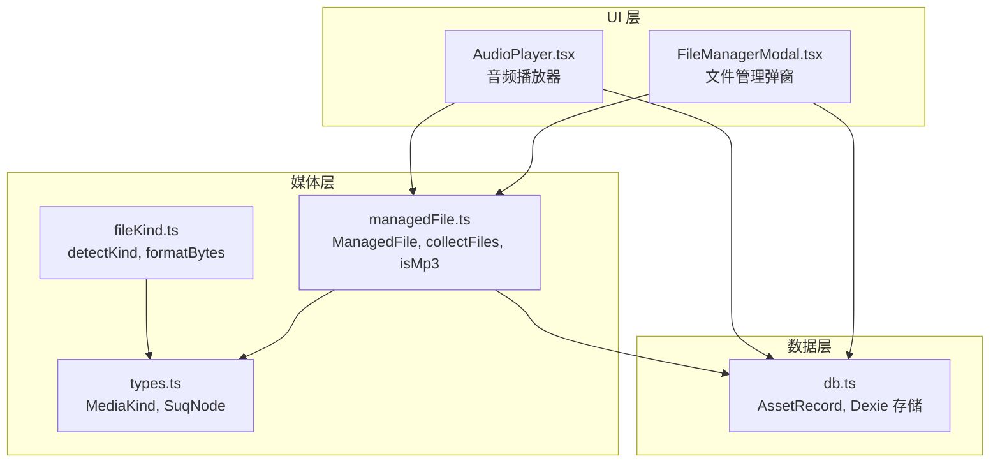
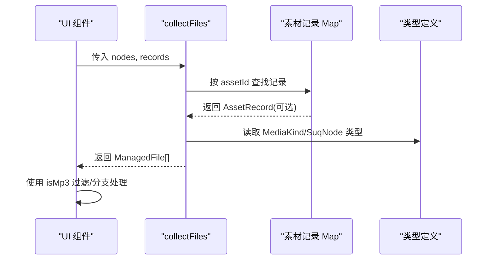
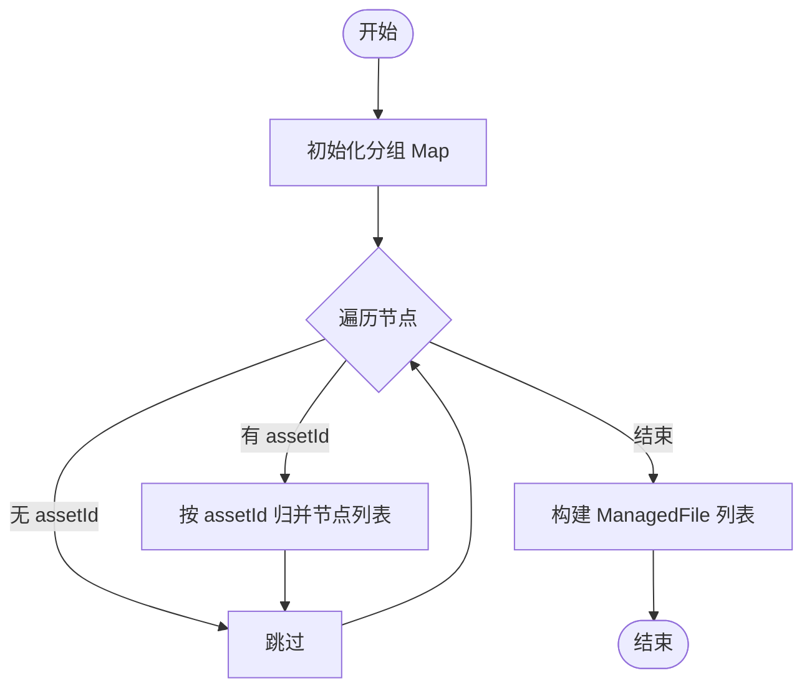
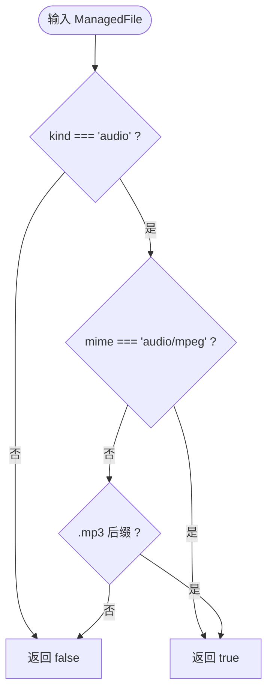
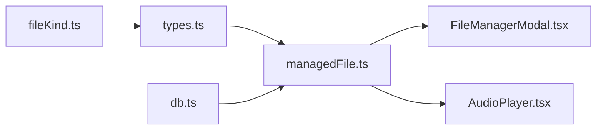

# ManagedFile 文件管理

<cite>
**本文引用的文件**
- [managedFile.ts](file://src/media/managedFile.ts)
- [types.ts](file://src/types.ts)
- [db.ts](file://src/db/db.ts)
- [FileManagerModal.tsx](file://src/components/FileManagerModal.tsx)
- [AudioPlayer.tsx](file://src/components/AudioPlayer.tsx)
- [fileKind.ts](file://src/media/fileKind.ts)
</cite>

## 目录
1. [简介](#简介)
2. [项目结构](#项目结构)
3. [核心组件](#核心组件)
4. [架构总览](#架构总览)
5. [详细组件分析](#详细组件分析)
6. [依赖关系分析](#依赖关系分析)
7. [性能考虑](#性能考虑)
8. [故障排查指南](#故障排查指南)
9. [结论](#结论)
10. [附录：API 参考与使用示例](#附录api-参考与使用示例)

## 简介
本文件围绕 ManagedFile 接口及其相关工具函数，系统化说明 SuQCanvas 中“可管理文件”的数据模型、聚合逻辑与使用方式。重点包括：
- ManagedFile 数据结构字段含义及与画布节点、素材记录的关系
- collectFiles 函数的实现原理与数据流
- isMp3 工具函数的判断逻辑与应用场景
- 文件聚合的性能优化策略与错误处理机制
- 完整的 API 参考与实际使用示例

## 项目结构
ManagedFile 相关文件位于媒体层与 UI 层之间：
- 媒体层提供类型定义、文件聚合与工具函数
- UI 层（文件管理器、音频播放器）消费这些能力进行展示与交互
- 数据库层提供素材记录（AssetRecord），用于覆盖或补充节点元信息

图表来源
- [managedFile.ts:1-39](file://src/media/managedFile.ts#L1-L39)
- [types.ts:1-112](file://src/types.ts#L1-L112)
- [db.ts:1-69](file://src/db/db.ts#L1-L69)
- [FileManagerModal.tsx:120-180](file://src/components/FileManagerModal.tsx#L120-L180)
- [AudioPlayer.tsx:150-170](file://src/components/AudioPlayer.tsx#L150-L170)

章节来源
- [managedFile.ts:1-39](file://src/media/managedFile.ts#L1-L39)
- [types.ts:1-112](file://src/types.ts#L1-L112)
- [db.ts:1-69](file://src/db/db.ts#L1-L69)

## 核心组件
- ManagedFile：表示一个可管理的文件实体，包含资产标识、名称、类型、MIME、大小以及关联的画布节点集合
- collectFiles：将画布节点与素材记录聚合为去重后的文件列表
- isMp3：判断是否为 MP3 音频文件的工具函数

章节来源
- [managedFile.ts:4-38](file://src/media/managedFile.ts#L4-L38)

## 架构总览
ManagedFile 作为“跨层抽象”，屏蔽了底层节点与素材记录的差异，向上提供统一的文件视图。UI 组件通过 collectFiles 生成文件清单，再结合 isMp3 等工具进行业务分支处理（如打开播放器、图片查看器等）。

图表来源
- [managedFile.ts:17-38](file://src/media/managedFile.ts#L17-L38)
- [types.ts:3-15](file://src/types.ts#L3-L15)
- [db.ts:5-14](file://src/db/db.ts#L5-L14)

## 详细组件分析

### ManagedFile 数据结构
- assetId：唯一标识一个素材资源，用于在画布节点与素材记录之间建立关联
- name：显示名称，优先来自素材记录，其次回退到节点的 label，最后兜底为“未命名文件”
- kind：媒体类型，来源于素材记录或节点；类型由 MediaKind 枚举约束
- mime：MIME 类型，用于浏览器识别内容类型；优先素材记录，其次节点
- size：文件大小，优先素材记录，其次节点 fileSize
- nodes：与该 assetId 关联的所有画布节点数组，体现“一物多节点”的场景

设计要点
- 以 assetId 为键进行去重聚合，避免同一素材被重复列出
- 字段采用“记录优先、节点回退”的策略，保证离线/本地编辑时仍可展示基本信息
- nodes 保留所有引用该素材的节点，便于后续批量操作（删除、下载、播放等）

章节来源
- [managedFile.ts:4-11](file://src/media/managedFile.ts#L4-L11)
- [types.ts:66-107](file://src/types.ts#L66-L107)
- [db.ts:5-14](file://src/db/db.ts#L5-L14)

### collectFiles 函数实现原理
输入
- nodes：画布节点数组，每个节点可能包含 data.assetId
- records：以 assetId 为键的素材记录 Map

处理流程
- 遍历节点，按 assetId 分组收集节点列表
- 对每个 assetId：
  - 取第一个节点作为元信息回退源
  - 从 records 获取对应素材记录，优先使用记录中的 name/kind/mime/size
  - 组装 ManagedFile 并附带全部关联节点

复杂度
- 时间复杂度 O(N)，N 为节点数量
- 空间复杂度 O(N)，用于分组 Map 与结果数组

健壮性
- 忽略没有 assetId 的节点
- 当缺少素材记录时，安全回退到节点字段
- 当节点也缺少名称时，使用默认值“未命名文件”

图表来源
- [managedFile.ts:17-38](file://src/media/managedFile.ts#L17-L38)

章节来源
- [managedFile.ts:17-38](file://src/media/managedFile.ts#L17-L38)

### isMp3 工具函数
判断逻辑
- 仅当 kind 为 audio 且满足以下任一条件时返回 true：
  - MIME 类型为 audio/mpeg
  - 文件名以 .mp3 结尾（不区分大小写）

使用场景
- 文件管理器双击打开时，MP3 直接跳转至音频播放器
- 音频播放器内部过滤出 mp3 文件，构建播放列表与歌单

图表来源
- [managedFile.ts:13-15](file://src/media/managedFile.ts#L13-L15)

章节来源
- [managedFile.ts:13-15](file://src/media/managedFile.ts#L13-L15)

### 与 UI 层的集成
- 文件管理器（FileManagerModal）
  - 使用 collectFiles 生成文件清单，支持搜索、筛选、多选、下载、删除等操作
  - 双击 MP3 进入播放器；其他类型根据 kind 路由到相应查看器
- 音频播放器（AudioPlayer）
  - 使用 isMp3 过滤出可播放的 MP3 文件
  - 基于画布节点与边解析歌单，并与 ManagedFile 列表联动

章节来源
- [FileManagerModal.tsx:120-180](file://src/components/FileManagerModal.tsx#L120-L180)
- [AudioPlayer.tsx:150-170](file://src/components/AudioPlayer.tsx#L150-L170)

## 依赖关系分析
- managedFile.ts 依赖 types.ts 的 MediaKind、SuqNode 类型
- managedFile.ts 依赖 db.ts 的 AssetRecord 类型
- FileManagerModal.tsx 与 AudioPlayer.tsx 消费 managedFile.ts 的导出
- fileKind.ts 提供 detectKind/formatBytes 辅助，虽不直接参与 collectFiles/isMp3，但属于同域工具集

图表来源
- [managedFile.ts:1-3](file://src/media/managedFile.ts#L1-L3)
- [types.ts:1-15](file://src/types.ts#L1-L15)
- [db.ts:1-14](file://src/db/db.ts#L1-L14)
- [FileManagerModal.tsx:120-180](file://src/components/FileManagerModal.tsx#L120-L180)
- [AudioPlayer.tsx:150-170](file://src/components/AudioPlayer.tsx#L150-L170)

章节来源
- [managedFile.ts:1-3](file://src/media/managedFile.ts#L1-L3)
- [types.ts:1-15](file://src/types.ts#L1-L15)
- [db.ts:1-14](file://src/db/db.ts#L1-L14)

## 性能考虑
- 聚合阶段
  - 使用 Map 按 assetId 分组，单次遍历完成聚合，时间复杂度 O(N)
  - 结果数组通过 entries() 映射生成，避免额外嵌套循环
- 渲染阶段
  - UI 层使用 useMemo 缓存 collectFiles 的结果，仅在 nodes/records 变化时重新计算
  - 搜索与筛选在已聚合结果上进行，减少重复计算
- 资源访问
  - 文件下载与打开通过 URL 获取，避免重复加载大文件
  - 删除时批量删除并失效 URL 缓存，降低内存占用
- 并发与稳定性
  - 批量下载间加入微小延时，避免瞬时过多请求
  - 删除前检查是否被其他用户锁定，防止并发冲突

[本节为通用性能建议，不直接分析具体代码行]

## 故障排查指南
常见问题与定位
- 文件未出现在列表中
  - 检查节点是否设置了有效的 assetId
  - 确认 records 中是否存在对应 assetId 的记录
- 名称/类型/大小不正确
  - 若 records 缺失，会回退到节点字段；检查节点 data.label/kind/mime/fileSize
- MP3 无法进入播放器
  - 确认 isMp3 判定：kind 必须为 audio，且 mime 为 audio/mpeg 或后缀为 .mp3
- 删除失败或被阻止
  - 检查是否有其他用户锁定了关联节点
  - 确认资产未被其他项目引用

章节来源
- [FileManagerModal.tsx:160-244](file://src/components/FileManagerModal.tsx#L160-L244)
- [managedFile.ts:17-38](file://src/media/managedFile.ts#L17-L38)

## 结论
ManagedFile 以 assetId 为核心，统一了画布节点与素材记录的差异，提供了简洁的文件视图。collectFiles 实现了高效、健壮的聚合逻辑，isMp3 则精准识别 MP3 音频，支撑播放器与文件管理器的关键路径。配合 UI 层的缓存与批处理策略，整体具备良好的性能与可扩展性。

[本节为总结性内容，不直接分析具体代码行]

## 附录：API 参考与使用示例

### API 参考
- ManagedFile
  - assetId: string — 素材唯一标识
  - name: string — 文件显示名（记录优先，节点回退）
  - kind: MediaKind — 媒体类型
  - mime: string — MIME 类型
  - size: number — 文件大小
  - nodes: SuqNode[] — 关联的画布节点集合

- collectFiles(nodes: SuqNode[], records: Map<string, AssetRecord>): ManagedFile[]
  - 作用：将画布节点与素材记录聚合为去重后的文件列表
  - 行为：按 assetId 分组，优先使用素材记录元信息，否则回退到节点字段

- isMp3(file: ManagedFile): boolean
  - 作用：判断是否为 MP3 音频文件
  - 规则：kind 为 audio 且 mime 为 audio/mpeg 或文件名以 .mp3 结尾

章节来源
- [managedFile.ts:4-38](file://src/media/managedFile.ts#L4-L38)
- [types.ts:3-15](file://src/types.ts#L3-L15)
- [db.ts:5-14](file://src/db/db.ts#L5-L14)

### 使用示例（概念性）
- 在文件管理器中生成文件清单
  - 调用 collectFiles 获取 ManagedFile[]
  - 使用 isMp3 过滤出可播放的 MP3 文件
  - 根据 kind 路由到不同查看器（图片、PDF、视频等）
- 在音频播放器中构建播放列表
  - 使用 isMp3 过滤文件
  - 结合画布节点与边解析歌单，设置播放队列与模式

[本节为概念性示例，不直接分析具体代码行]