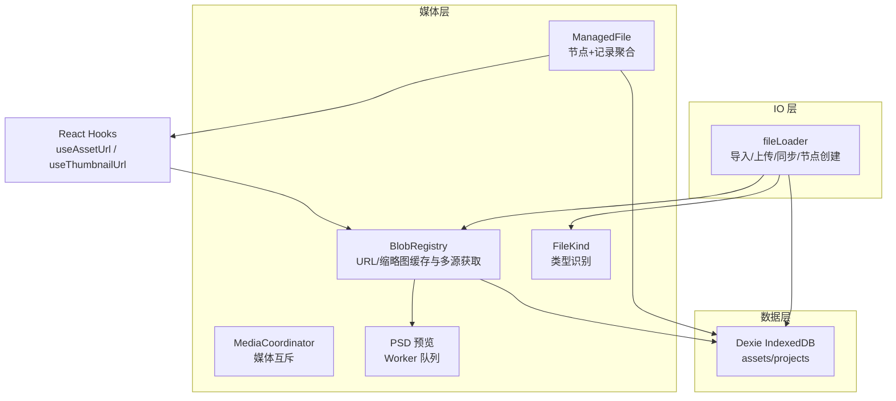
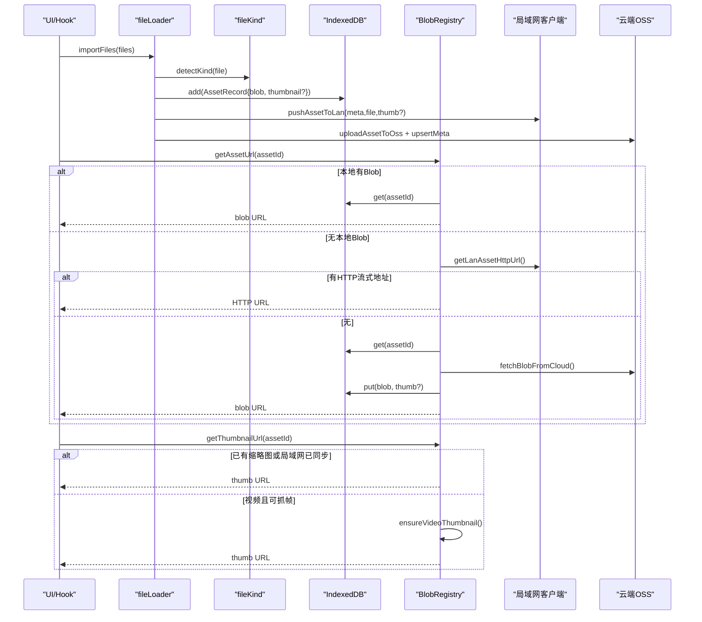
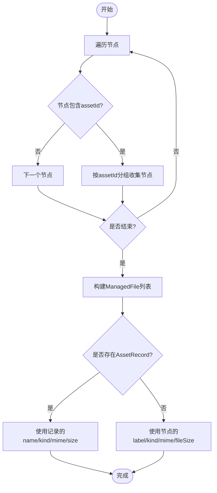
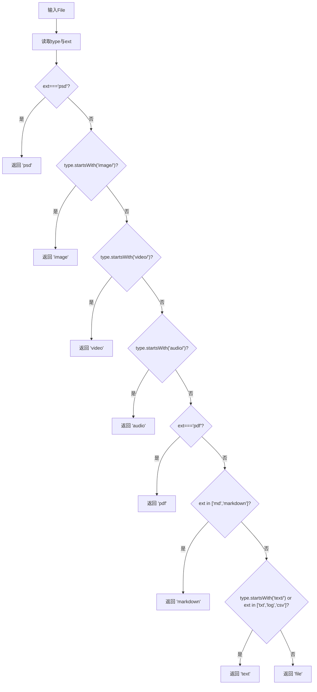
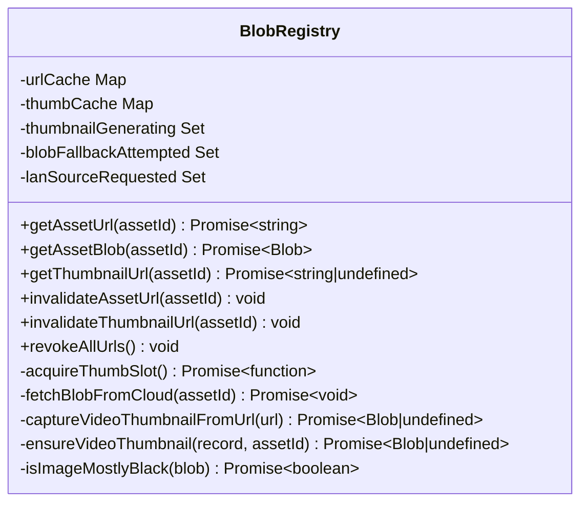
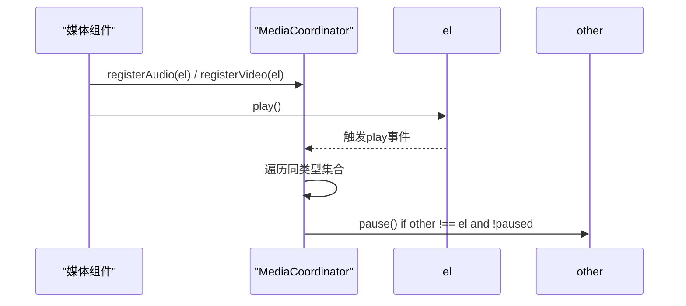
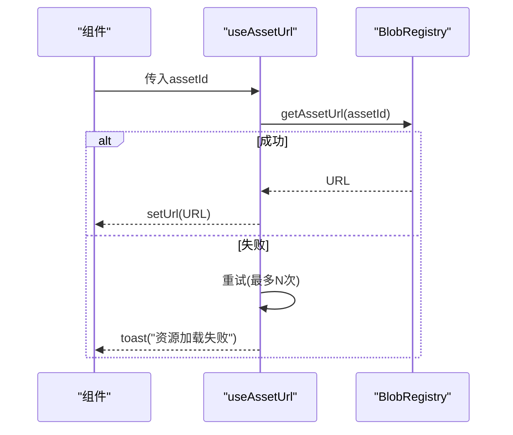
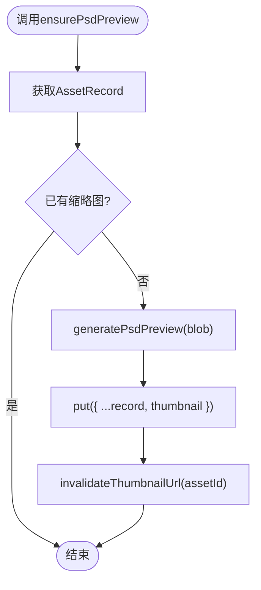
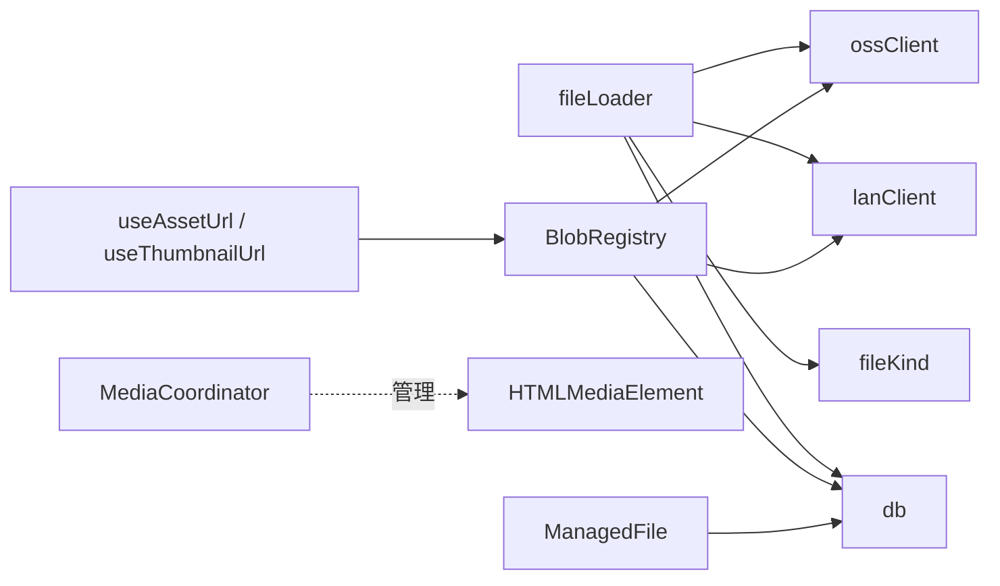

# 文件管理机制

<cite>
**本文引用的文件**
- [src/media/managedFile.ts](file://src/media/managedFile.ts)
- [src/media/blobRegistry.ts](file://src/media/blobRegistry.ts)
- [src/media/fileKind.ts](file://src/media/fileKind.ts)
- [src/media/mediaCoordinator.ts](file://src/media/mediaCoordinator.ts)
- [src/media/useAssetUrl.ts](file://src/media/useAssetUrl.ts)
- [src/media/psdPreview.ts](file://src/media/psdPreview.ts)
- [src/io/fileLoader.ts](file://src/io/fileLoader.ts)
- [src/db/db.ts](file://src/db/db.ts)
- [src/types.ts](file://src/types.ts)
</cite>

## 目录
1. [简介](#简介)
2. [项目结构](#项目结构)
3. [核心组件](#核心组件)
4. [架构总览](#架构总览)
5. [详细组件分析](#详细组件分析)
6. [依赖关系分析](#依赖关系分析)
7. [性能考虑](#性能考虑)
8. [故障排查指南](#故障排查指南)
9. [结论](#结论)
10. [附录：使用示例与最佳实践](#附录使用示例与最佳实践)

## 简介
本文件管理机制围绕“资源即资产”的理念，提供从文件导入、类型识别、本地/云端/局域网多源获取、缩略图生成与缓存、到生命周期清理的完整闭环。核心包括：
- ManagedFile：将画布节点与素材记录聚合为可管理的文件视图，便于批量操作与统计。
- FileKind：基于 MIME 与扩展名的文件类型识别算法，支持多种媒体与文档格式。
- BlobRegistry：统一的资源 URL/缩略图访问层，负责缓存、去重、并发控制、内存优化与多源回退策略。
- MediaCoordinator：全局媒体互斥，避免音频/视频同时播放造成体验问题。
- useAssetUrl/useThumbnailUrl：React Hook，封装资源加载重试与轮询逻辑，提升用户体验。

## 项目结构
该机制主要分布在 media、io、db 三个层次：
- media：资源访问与协调（BlobRegistry、ManagedFile、FileKind、MediaCoordinator、PSD 预览）
- io：文件导入、上传、云端/局域网同步、节点创建
- db：IndexedDB 持久化存储与垃圾回收

图表来源
- [src/media/blobRegistry.ts:1-389](file://src/media/blobRegistry.ts#L1-L389)
- [src/media/managedFile.ts:1-39](file://src/media/managedFile.ts#L1-L39)
- [src/media/fileKind.ts:1-24](file://src/media/fileKind.ts#L1-L24)
- [src/media/mediaCoordinator.ts:1-25](file://src/media/mediaCoordinator.ts#L1-L25)
- [src/media/psdPreview.ts:1-62](file://src/media/psdPreview.ts#L1-L62)
- [src/io/fileLoader.ts:1-297](file://src/io/fileLoader.ts#L1-L297)
- [src/db/db.ts:1-69](file://src/db/db.ts#L1-L69)

章节来源
- [src/media/blobRegistry.ts:1-389](file://src/media/blobRegistry.ts#L1-L389)
- [src/io/fileLoader.ts:1-297](file://src/io/fileLoader.ts#L1-L297)
- [src/db/db.ts:1-69](file://src/db/db.ts#L1-L69)

## 核心组件
- ManagedFile：以 assetId 为单位聚合多个画布节点与一条素材记录，提供统一视图与便捷判断（如 MP3）。
- FileKind：根据 file.type 与扩展名推断 MediaKind，支持 image/video/audio/pdf/psd/markdown/text/file 等。
- BlobRegistry：集中管理资源 URL 与缩略图 URL，实现多级缓存、并发限制、多源回退与内存释放。
- MediaCoordinator：注册音频/视频元素，保证同类型媒体互斥播放。
- useAssetUrl/useThumbnailUrl：在 React 中安全地获取资源 URL，内置重试与轮询，适配局域网异步传输场景。
- PSD 预览：通过 Worker 串行处理大文件，生成缩略图并落库。

章节来源
- [src/media/managedFile.ts:1-39](file://src/media/managedFile.ts#L1-L39)
- [src/media/fileKind.ts:1-24](file://src/media/fileKind.ts#L1-L24)
- [src/media/blobRegistry.ts:1-389](file://src/media/blobRegistry.ts#L1-L389)
- [src/media/mediaCoordinator.ts:1-25](file://src/media/mediaCoordinator.ts#L1-L25)
- [src/media/useAssetUrl.ts:1-157](file://src/media/useAssetUrl.ts#L1-L157)
- [src/media/psdPreview.ts:1-62](file://src/media/psdPreview.ts#L1-L62)

## 架构总览
下图展示了从文件导入到最终渲染的关键流程，涵盖类型识别、本地/云端/局域网多源获取、缩略图生成与缓存、以及生命周期清理。

图表来源
- [src/io/fileLoader.ts:77-117](file://src/io/fileLoader.ts#L77-L117)
- [src/media/fileKind.ts:3-16](file://src/media/fileKind.ts#L3-L16)
- [src/media/blobRegistry.ts:84-126](file://src/media/blobRegistry.ts#L84-L126)
- [src/media/blobRegistry.ts:310-379](file://src/media/blobRegistry.ts#L310-L379)

## 详细组件分析

### ManagedFile：文件聚合与管理视图
- 设计目标：将“画布节点 + 素材记录”聚合为一份可管理的文件对象，按 assetId 去重，便于统计、批量操作与展示。
- 关键能力：
  - collectFiles：遍历节点，按 assetId 分组，合并节点列表；优先使用数据库中的 AssetRecord 元信息，否则回退到节点数据。
  - isMp3：快速判断是否为 MP3（基于 kind 与 mime/扩展名）。
- 复杂度：时间 O(N) 遍历节点，空间 O(U) 去重映射（U 为唯一 assetId 数量）。
- 错误处理：缺失记录时回退到节点字段，保证可用性。

图表来源
- [src/media/managedFile.ts:18-38](file://src/media/managedFile.ts#L18-L38)

章节来源
- [src/media/managedFile.ts:1-39](file://src/media/managedFile.ts#L1-L39)

### FileKind：文件类型识别算法
- 识别顺序：
  - 特殊扩展名优先：psd
  - MIME 前缀匹配：image/*、video/*、audio/*
  - 特定扩展名：pdf、md/markdown
  - 文本类：text/* 或 txt/log/csv
  - 兜底：file
- 扩展性：新增类型只需在分支中添加条件，保持单一职责与易维护性。
- 辅助工具：formatBytes 用于友好显示文件大小。

图表来源
- [src/media/fileKind.ts:3-16](file://src/media/fileKind.ts#L3-L16)

章节来源
- [src/media/fileKind.ts:1-24](file://src/media/fileKind.ts#L1-L24)

### BlobRegistry：资源注册表与生命周期管理
- 缓存策略：
  - urlCache：资源 URL 缓存（本地 blob URL 或局域网 HTTP 流式地址）
  - thumbCache：缩略图 URL 缓存
  - 一次性标记：thumbnailGenerating、blobFallbackAttempted、lanSourceRequested 防止重复任务与请求堆积
- 并发控制：
  - THUMB_MAX_CONCURRENT 限制同时抓帧数量，避免阻塞浏览器连接池
  - acquireThumbSlot 提供排队与释放机制
- 多源获取：
  - 优先本地 IndexedDB 的 Blob
  - 其次局域网 HTTP 流式地址（边下边播）
  - 最后云端 OSS 下载并落库
- 缩略图生成：
  - 视频：通过临时 video 元素抓取画面，黑帧检测与多次 seek 重试，跨源设置 crossOrigin
  - 图片：全黑检测，必要时重新抓帧替换
  - 局域网 meta-only 记录：主动请求源与封面，确保可用
- 内存优化：
  - 及时 revokeObjectURL 释放 blob URL
  - 对 HTTP 流式资源不整份下载，减少内存占用
  - 失败后一次性回退拉取全量，避免反复网络开销
- 失效接口：invalidateAssetUrl、invalidateThumbnailUrl、revokeAllUrls

图表来源
- [src/media/blobRegistry.ts:12-389](file://src/media/blobRegistry.ts#L12-L389)

章节来源
- [src/media/blobRegistry.ts:1-389](file://src/media/blobRegistry.ts#L1-L389)

### MediaCoordinator：媒体互斥播放
- 设计目标：同一时刻最多一个音频和一个视频在播放，避免互相抢占资源。
- 实现方式：
  - 分别维护 audioElements 与 videoElements 集合
  - 注册元素时监听 play 事件，自动暂停其他未暂停的同类型元素
  - 提供销毁函数移除监听与集合项

图表来源
- [src/media/mediaCoordinator.ts:4-24](file://src/media/mediaCoordinator.ts#L4-L24)

章节来源
- [src/media/mediaCoordinator.ts:1-25](file://src/media/mediaCoordinator.ts#L1-L25)

### useAssetUrl/useThumbnailUrl：React 资源加载封装
- useAssetUrl：
  - 获取资源 URL，失败时有限重试（MAX_ATTEMPTS），避免瞬时网络抖动导致失败
  - 组件卸载时清理状态，避免内存泄漏
- useThumbnailUrl：
  - 针对局域网场景的轮询策略：快速尝试若干次，若仍在线则慢速等待至超时
  - 成功即设置 URL，失败则继续轮询直至达到上限
- usePsdPreviewUrl：
  - 先尝试缩略图，若无则调用 ensurePsdPreview 生成后再获取

图表来源
- [src/media/useAssetUrl.ts:10-44](file://src/media/useAssetUrl.ts#L10-L44)
- [src/media/blobRegistry.ts:84-126](file://src/media/blobRegistry.ts#L84-L126)

章节来源
- [src/media/useAssetUrl.ts:1-157](file://src/media/useAssetUrl.ts#L1-L157)

### PSD 预览：后台串行处理
- 通过 Web Worker 解析 PSD 二进制，避免主线程卡顿
- 使用 Promise 队列串行执行，避免并发过大导致内存峰值
- 成功后将缩略图写入 IndexedDB，并失效对应缩略图 URL 缓存

图表来源
- [src/media/psdPreview.ts:49-60](file://src/media/psdPreview.ts#L49-L60)

章节来源
- [src/media/psdPreview.ts:1-62](file://src/media/psdPreview.ts#L1-L62)

## 依赖关系分析
- fileLoader 依赖 fileKind 进行类型识别，依赖 db 进行持久化，依赖 lanClient/ossClient 进行同步。
- BlobRegistry 依赖 db、lanClient、ossClient，并提供 URL 与缩略图访问。
- useAssetUrl/useThumbnailUrl 依赖 BlobRegistry，并在 UI 层处理重试与轮询。
- MediaCoordinator 独立于资源层，仅管理媒体元素实例。
- ManagedFile 依赖 types 与 db，用于聚合节点与记录。

图表来源
- [src/io/fileLoader.ts:1-297](file://src/io/fileLoader.ts#L1-L297)
- [src/media/blobRegistry.ts:1-389](file://src/media/blobRegistry.ts#L1-L389)
- [src/media/useAssetUrl.ts:1-157](file://src/media/useAssetUrl.ts#L1-L157)
- [src/media/mediaCoordinator.ts:1-25](file://src/media/mediaCoordinator.ts#L1-L25)
- [src/media/managedFile.ts:1-39](file://src/media/managedFile.ts#L1-L39)

章节来源
- [src/io/fileLoader.ts:1-297](file://src/io/fileLoader.ts#L1-L297)
- [src/media/blobRegistry.ts:1-389](file://src/media/blobRegistry.ts#L1-L389)
- [src/media/useAssetUrl.ts:1-157](file://src/media/useAssetUrl.ts#L1-L157)
- [src/media/mediaCoordinator.ts:1-25](file://src/media/mediaCoordinator.ts#L1-L25)
- [src/media/managedFile.ts:1-39](file://src/media/managedFile.ts#L1-L39)

## 性能考虑
- 多源优先顺序：本地 Blob > 局域网 HTTP 流式 > 云端下载，减少不必要的大文件下载与内存占用。
- 并发控制：缩略图抓帧限制并发数，避免阻塞浏览器连接池影响播放。
- 内存管理：及时 revokeObjectURL，避免长期持有大量 blob URL；对失败路径做一次性回退，避免重复网络开销。
- 懒加载与轮询：useThumbnailUrl 在局域网环境下采用快慢轮询，平衡响应速度与成功率。
- 大文件保护：导入时限制最大文件大小，避免内存溢出。

[本节为通用性能建议，无需具体文件引用]

## 故障排查指南
- 资源加载失败：
  - 检查 useAssetUrl 的重试次数与延迟配置，确认网络连通性与源端可用性
  - 查看 BlobRegistry 的多源回退路径是否正确（本地/局域网/云端）
- 缩略图始终为空：
  - 确认视频资源是否可被解码（跨域设置 crossOrigin）
  - 检查缩略图并发限制与队列是否阻塞
  - 对于局域网 meta-only 记录，确保已触发 requestAssetFromLan 获取源与封面
- PSD 预览失败：
  - 检查 Worker 是否正常运行，队列是否被阻塞
  - 确认资源是否已下载到 IndexedDB
- 内存泄漏：
  - 确保组件卸载时清理 URL 引用（revokeObjectURL）
  - 使用 invalidate* 接口主动失效缓存

章节来源
- [src/media/useAssetUrl.ts:10-44](file://src/media/useAssetUrl.ts#L10-L44)
- [src/media/blobRegistry.ts:128-239](file://src/media/blobRegistry.ts#L128-L239)
- [src/media/blobRegistry.ts:310-379](file://src/media/blobRegistry.ts#L310-L379)
- [src/media/psdPreview.ts:15-32](file://src/media/psdPreview.ts#L15-L32)

## 结论
该文件管理机制通过清晰的职责划分与多层缓存策略，实现了高效、稳定、可扩展的资源管理。ManagedFile 提供统一视图，FileKind 支持灵活的类型识别，BlobRegistry 保障多源获取与内存优化，MediaCoordinator 确保媒体播放体验。结合 React Hook 的重试与轮询，整体系统在离线、局域网与云端混合场景下具备良好鲁棒性。

[本节为总结性内容，无需具体文件引用]

## 附录：使用示例与最佳实践
- 导入文件并创建节点：
  - 调用 importFiles(files, position)，内部会识别类型、生成缩略图、持久化并同步到局域网/云端
  - 参考路径：[src/io/fileLoader.ts:186-205](file://src/io/fileLoader.ts#L186-L205)
- 在组件中获取资源 URL：
  - 使用 useAssetUrl(assetId) 或 useThumbnailUrl(assetId)
  - 参考路径：[src/media/useAssetUrl.ts:10-44](file://src/media/useAssetUrl.ts#L10-L44)、[src/media/useAssetUrl.ts:52-99](file://src/media/useAssetUrl.ts#L52-L99)
- 聚合文件列表：
  - 使用 collectFiles(nodes, records) 得到 ManagedFile 数组
  - 参考路径：[src/media/managedFile.ts:18-38](file://src/media/managedFile.ts#L18-L38)
- 手动失效缓存：
  - 当资源更新或需要强制刷新时，调用 invalidateAssetUrl/invalidateThumbnailUrl/revokeAllUrls
  - 参考路径：[src/media/blobRegistry.ts:41-56](file://src/media/blobRegistry.ts#L41-L56)、[src/media/blobRegistry.ts:381-389](file://src/media/blobRegistry.ts#L381-L389)
- 媒体互斥播放：
  - 在音频/视频组件挂载时注册，卸载时调用返回的销毁函数
  - 参考路径：[src/media/mediaCoordinator.ts:7-24](file://src/media/mediaCoordinator.ts#L7-L24)

章节来源
- [src/io/fileLoader.ts:186-205](file://src/io/fileLoader.ts#L186-L205)
- [src/media/useAssetUrl.ts:10-44](file://src/media/useAssetUrl.ts#L10-L44)
- [src/media/useAssetUrl.ts:52-99](file://src/media/useAssetUrl.ts#L52-L99)
- [src/media/managedFile.ts:18-38](file://src/media/managedFile.ts#L18-L38)
- [src/media/blobRegistry.ts:41-56](file://src/media/blobRegistry.ts#L41-L56)
- [src/media/blobRegistry.ts:381-389](file://src/media/blobRegistry.ts#L381-L389)
- [src/media/mediaCoordinator.ts:7-24](file://src/media/mediaCoordinator.ts#L7-L24)