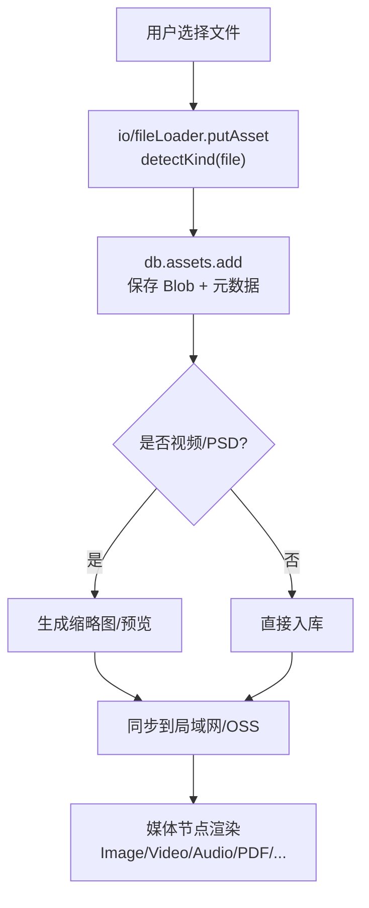
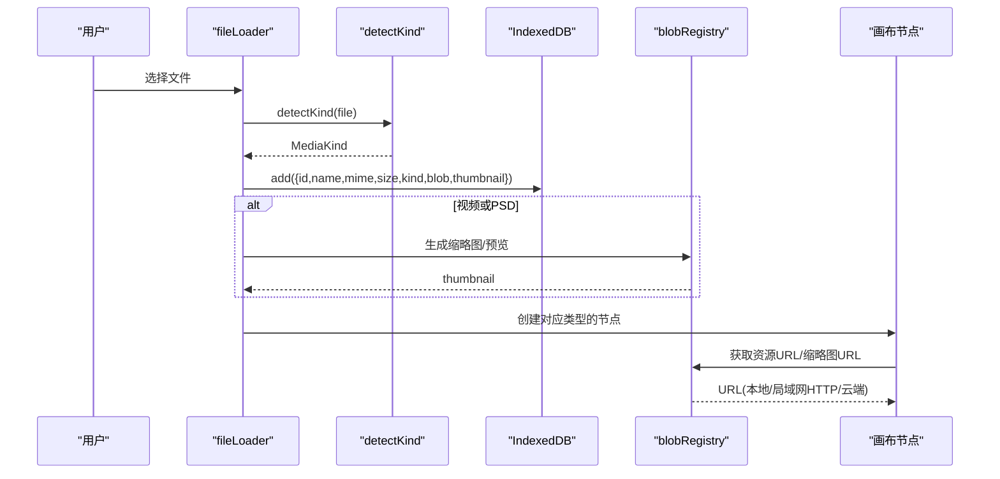
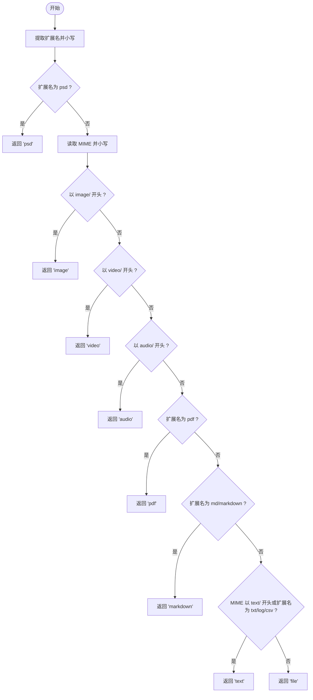
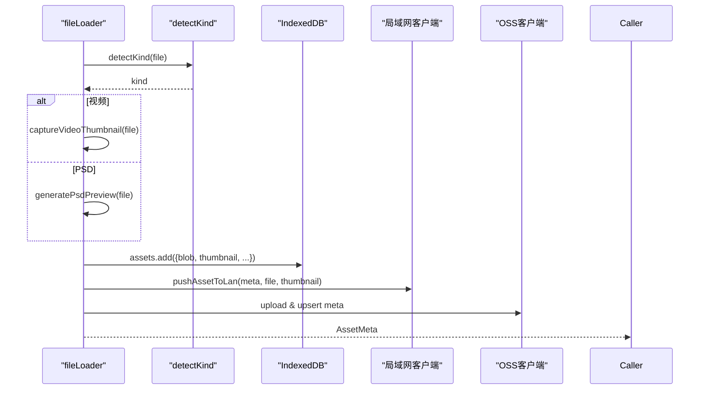
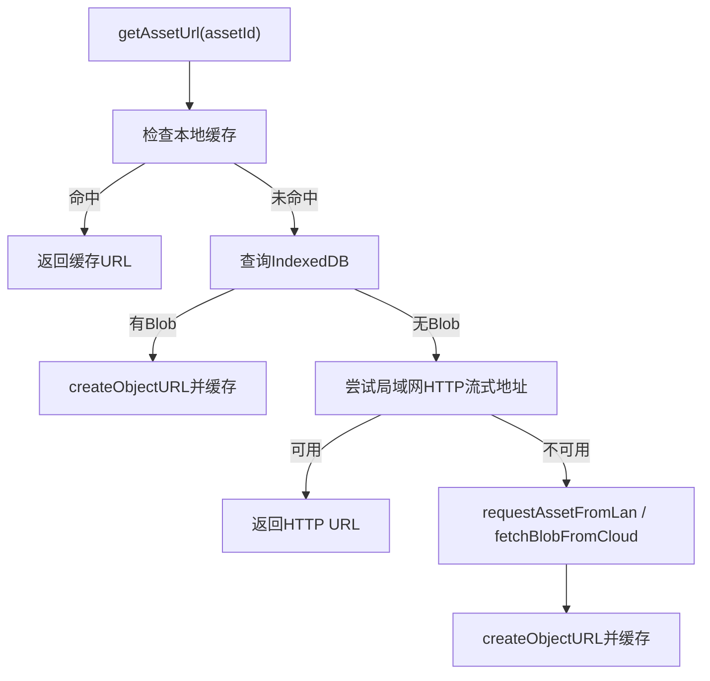
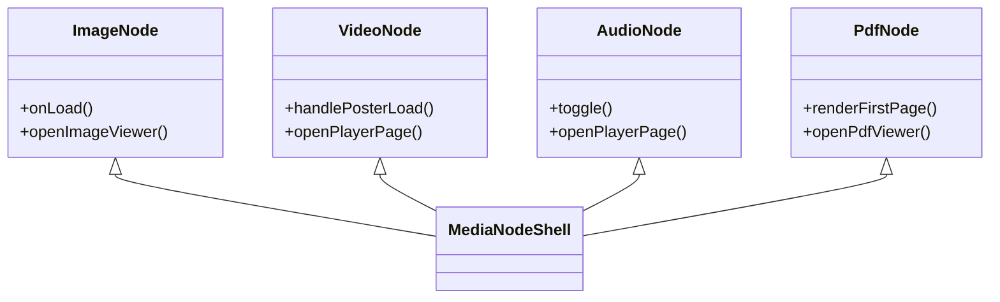
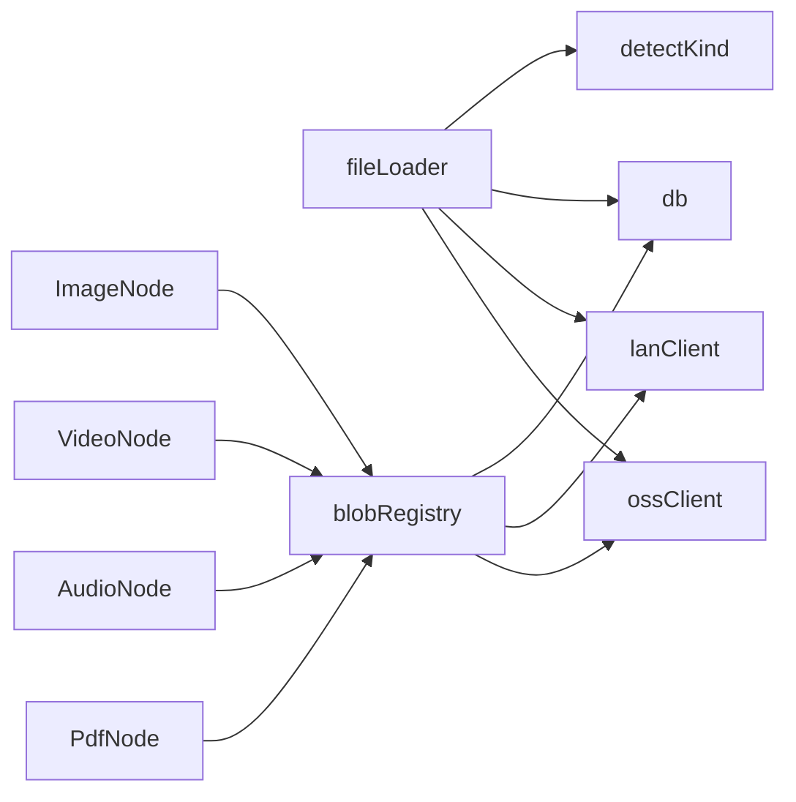

# 文件类型识别

<cite>
**本文引用的文件**
- [src/types.ts](file://src/types.ts)
- [src/media/fileKind.ts](file://src/media/fileKind.ts)
- [src/media/fileKind.test.ts](file://src/media/fileKind.test.ts)
- [src/io/fileLoader.ts](file://src/io/fileLoader.ts)
- [src/media/blobRegistry.ts](file://src/media/blobRegistry.ts)
- [src/canvas/nodes/ImageNode.tsx](file://src/canvas/nodes/ImageNode.tsx)
- [src/canvas/nodes/VideoNode.tsx](file://src/canvas/nodes/VideoNode.tsx)
- [src/canvas/nodes/AudioNode.tsx](file://src/canvas/nodes/AudioNode.tsx)
- [src/canvas/nodes/PdfNode.tsx](file://src/canvas/nodes/PdfNode.tsx)
- [src/components/FileManagerModal.tsx](file://src/components/FileManagerModal.tsx)
</cite>

## 目录
1. [简介](#简介)
2. [项目结构](#项目结构)
3. [核心组件](#核心组件)
4. [架构总览](#架构总览)
5. [详细组件分析](#详细组件分析)
6. [依赖关系分析](#依赖关系分析)
7. [性能考虑](#性能考虑)
8. [故障排除指南](#故障排除指南)
9. [结论](#结论)
10. [附录](#附录)

## 简介
本文件系统围绕“文件类型识别”展开，提供从上传到渲染的完整链路：通过 MIME 类型、扩展名与特殊规则进行快速分类，生成缩略图/预览，并在画布中以节点形式展示。系统支持图片、视频、音频、PDF、PSD、Markdown、文本以及通用文件等类别，并提供可扩展的分类机制与配置方式。

## 项目结构
- 类型定义集中在 types 中，统一枚举 MediaKind，作为全系统的分类标准。
- 文件检测逻辑位于 media/fileKind.ts，负责将浏览器 File 对象归类为 MediaKind。
- 导入与入库流程在 io/fileLoader.ts，调用 detectKind 并持久化资源与元数据。
- 资源 URL 与缩略图管理在 media/blobRegistry.ts，提供本地缓存、局域网流式地址、云端拉取与封面生成。
- 画布节点按 MediaKind 渲染不同 UI（图片、视频、音频、PDF、PSD、文本等）。
- 文件管理器按类型分组展示与管理。

**图表来源**
- [src/io/fileLoader.ts:77-117](file://src/io/fileLoader.ts#L77-L117)
- [src/media/blobRegistry.ts:241-268](file://src/media/blobRegistry.ts#L241-L268)

**章节来源**
- [src/types.ts:3-14](file://src/types.ts#L3-L14)
- [src/media/fileKind.ts:3-16](file://src/media/fileKind.ts#L3-L16)
- [src/io/fileLoader.ts:77-117](file://src/io/fileLoader.ts#L77-L117)

## 核心组件
- MediaKind 枚举：定义所有受支持的媒体与文档类型，作为分类与渲染的统一标识。
- detectKind：基于 MIME 前缀与扩展名的快速分类函数，包含对 PSD 的特殊优先处理。
- fileLoader.putAsset：入口函数，完成检测、缩略图生成、入库、同步与节点创建。
- blobRegistry：资源 URL 与缩略图缓存、并发控制、跨源抓帧与回退策略。
- 节点渲染：按 MediaKind 分别渲染图片、视频、音频、PDF、PSD、文本等。

**章节来源**
- [src/types.ts:3-14](file://src/types.ts#L3-L14)
- [src/media/fileKind.ts:3-16](file://src/media/fileKind.ts#L3-L16)
- [src/io/fileLoader.ts:77-117](file://src/io/fileLoader.ts#L77-L117)
- [src/media/blobRegistry.ts:84-126](file://src/media/blobRegistry.ts#L84-L126)
- [src/canvas/nodes/ImageNode.tsx:15-126](file://src/canvas/nodes/ImageNode.tsx#L15-L126)
- [src/canvas/nodes/VideoNode.tsx:18-88](file://src/canvas/nodes/VideoNode.tsx#L18-L88)
- [src/canvas/nodes/AudioNode.tsx:18-126](file://src/canvas/nodes/AudioNode.tsx#L18-L126)
- [src/canvas/nodes/PdfNode.tsx:11-90](file://src/canvas/nodes/PdfNode.tsx#L11-L90)

## 架构总览
下图展示了从文件选择到最终渲染的关键路径，包括类型识别、缩略图生成、资源获取与节点渲染。

**图表来源**
- [src/io/fileLoader.ts:77-117](file://src/io/fileLoader.ts#L77-L117)
- [src/media/blobRegistry.ts:84-126](file://src/media/blobRegistry.ts#L84-L126)
- [src/media/blobRegistry.ts:241-268](file://src/media/blobRegistry.ts#L241-L268)

## 详细组件分析

### 文件类型识别算法（detectKind）
- 输入：浏览器 File 对象（name、type）。
- 策略：
  - 先检查扩展名是否为 psd，若是则优先归类为 psd，避免被 image/* 误判。
  - 根据 MIME 前缀判断 image/video/audio。
  - 针对 pdf、markdown/md、text/* 及 txt/log/csv 扩展名归类为 pdf/markdown/text。
  - 其他情况归为 file。
- 复杂度：O(1)，仅字符串操作与比较。
- 准确性保证：
  - 对常见格式使用 MIME 前缀判定，兼顾浏览器提供的 type。
  - 对易混淆格式（如 PSD）采用扩展名优先，确保正确分类。
  - 测试用例覆盖关键分支（PSD 优先于 image/*）。

**图表来源**
- [src/media/fileKind.ts:3-16](file://src/media/fileKind.ts#L3-L16)

**章节来源**
- [src/media/fileKind.ts:3-16](file://src/media/fileKind.ts#L3-L16)
- [src/media/fileKind.test.ts:8-16](file://src/media/fileKind.test.ts#L8-L16)

### 文件导入与入库流程（fileLoader.putAsset）
- 步骤：
  - 调用 detectKind 确定类型。
  - 若为视频，抓取首帧作为缩略图；若为 PSD，生成预览图。
  - 写入 IndexedDB（assets），记录 name、mime、size、kind、blob、thumbnail。
  - 若连接局域网，推送资源与缩略图；同时尝试同步到 OSS。
  - 返回 AssetMeta，用于创建画布节点。
- 错误处理：缩略图生成失败不影响主文件入库；网络异常时提示用户。

**图表来源**
- [src/io/fileLoader.ts:77-117](file://src/io/fileLoader.ts#L77-L117)

**章节来源**
- [src/io/fileLoader.ts:77-117](file://src/io/fileLoader.ts#L77-L117)

### 资源 URL 与缩略图管理（blobRegistry）
- 资源 URL 获取：
  - 优先本地缓存（IndexedDB 中的 Blob）。
  - 若为视频且局域网可提供 HTTP Range 流式地址，直接返回该 URL，边下边播，避免整份下载。
  - 否则拉取 Blob 并转为 object URL。
- 缩略图生成：
  - 视频：通过隐藏的 video 元素 seek 到合适时间点，绘制到 canvas 并 toBlob 生成 JPEG；支持跨源请求（crossOrigin=anonymous）与黑帧重试；并发限制（最多 2 个）避免阻塞播放。
  - 图片：若检测到旧版黑图，自动重新抓帧替换。
  - 局域网场景：优先使用已同步的缩略图；若无，则触发抓帧并推送到服务器。
- 缓存与失效：
  - urlCache、thumbCache 存储 object URL，提供 invalidate 方法释放内存。
  - 并发队列与 Set 防止重复任务与轮询堆积。

**图表来源**
- [src/media/blobRegistry.ts:84-126](file://src/media/blobRegistry.ts#L84-L126)

**章节来源**
- [src/media/blobRegistry.ts:84-126](file://src/media/blobRegistry.ts#L84-L126)
- [src/media/blobRegistry.ts:128-239](file://src/media/blobRegistry.ts#L128-L239)
- [src/media/blobRegistry.ts:310-379](file://src/media/blobRegistry.ts#L310-L379)

### 节点渲染与交互
- 图片节点：加载完成后自适应尺寸，支持打开大图与下载。
- 视频节点：显示缩略图与播放按钮，点击进入播放器页；画布上不解码大文件，节省内存。
- 音频节点：显示进度与播放控制，双击进入专用播放器页。
- PDF 节点：懒加载 PDFJS，渲染第一页到 canvas，支持查看全文。

**图表来源**
- [src/canvas/nodes/ImageNode.tsx:15-126](file://src/canvas/nodes/ImageNode.tsx#L15-L126)
- [src/canvas/nodes/VideoNode.tsx:18-88](file://src/canvas/nodes/VideoNode.tsx#L18-L88)
- [src/canvas/nodes/AudioNode.tsx:18-126](file://src/canvas/nodes/AudioNode.tsx#L18-L126)
- [src/canvas/nodes/PdfNode.tsx:11-90](file://src/canvas/nodes/PdfNode.tsx#L11-L90)

**章节来源**
- [src/canvas/nodes/ImageNode.tsx:15-126](file://src/canvas/nodes/ImageNode.tsx#L15-L126)
- [src/canvas/nodes/VideoNode.tsx:18-88](file://src/canvas/nodes/VideoNode.tsx#L18-L88)
- [src/canvas/nodes/AudioNode.tsx:18-126](file://src/canvas/nodes/AudioNode.tsx#L18-L126)
- [src/canvas/nodes/PdfNode.tsx:11-90](file://src/canvas/nodes/PdfNode.tsx#L11-L90)

### 自定义文件类型扩展机制与配置
- 扩展点：
  - MediaKind 枚举：新增类型需在 types.ts 中添加联合成员。
  - detectKind：在 fileKind.ts 中增加匹配规则（MIME 前缀或扩展名）。
  - 节点映射：在 nodeTypes.ts 中注册新类型的节点组件。
  - 文件管理器分组：在 FileManagerModal 中为新类型添加分组与标签。
- 配置建议：
  - 保持 detectKind 的优先级顺序合理，避免高优规则被低优规则覆盖。
  - 为复杂格式（如 PSD）优先使用扩展名判定，提高准确率。
  - 为文本类格式统一归类到 text，便于后续解析器扩展。

**章节来源**
- [src/types.ts:3-14](file://src/types.ts#L3-L14)
- [src/media/fileKind.ts:3-16](file://src/media/fileKind.ts#L3-L16)
- [src/components/FileManagerModal.tsx:21-39](file://src/components/FileManagerModal.tsx#L21-L39)

## 依赖关系分析
- fileLoader 依赖 detectKind 进行分类，依赖 db 进行持久化，依赖局域网/OSS 客户端进行同步。
- blobRegistry 依赖 db、局域网/OSS 客户端，提供 URL 与缩略图能力。
- 节点组件依赖 useAssetUrl/useThumbnailUrl 获取资源与缩略图。
- FileManagerModal 依赖 formatBytes、collectFiles、isMp3 等工具进行展示与管理。

**图表来源**
- [src/io/fileLoader.ts:77-117](file://src/io/fileLoader.ts#L77-L117)
- [src/media/blobRegistry.ts:84-126](file://src/media/blobRegistry.ts#L84-L126)

**章节来源**
- [src/io/fileLoader.ts:77-117](file://src/io/fileLoader.ts#L77-L117)
- [src/media/blobRegistry.ts:84-126](file://src/media/blobRegistry.ts#L84-L126)

## 性能考虑
- 视频缩略图并发限制：最多 2 个并发抓帧，避免占满浏览器连接池导致播放卡顿。
- 懒加载与流式播放：视频优先使用局域网 HTTP Range 地址，边下边播，减少内存占用。
- 缓存策略：urlCache 与 thumbCache 复用 object URL，减少重复创建与垃圾回收压力。
- 黑帧检测与重试：视频封面生成时检测黑帧并自动 seek 重试，提升成功率。
- 文件大小限制：导入时跳过超过阈值的大文件，避免内存溢出。

[本节为通用性能指导，不直接分析具体文件]

## 故障排除指南
- 无法生成视频缩略图：
  - 检查跨域设置（crossOrigin=anonymous）与服务器 CORS 响应头。
  - 确认视频可正常加载 metadata 与 seek。
  - 观察是否触发黑帧重试逻辑。
- 图片显示为黑图：
  - 系统会检测并重新抓帧；若仍失败，检查图片解码与 canvas 权限。
- 局域网资源不可用：
  - 检查 lanClient 的连接状态与超时重试逻辑。
  - 确认服务端是否提供 HTTP Range 与缩略图。
- 导入失败：
  - 检查文件大小限制与 IndexedDB 空间。
  - 查看 toast 提示与控制台错误日志。

**章节来源**
- [src/media/blobRegistry.ts:128-239](file://src/media/blobRegistry.ts#L128-L239)
- [src/media/blobRegistry.ts:310-379](file://src/media/blobRegistry.ts#L310-L379)
- [src/io/fileLoader.ts:186-205](file://src/io/fileLoader.ts#L186-L205)

## 结论
本文件系统通过简洁高效的 detectKind 实现文件类型识别，结合缩略图生成、资源缓存与多端同步，提供了稳定可靠的媒体与文档处理能力。通过扩展 MediaKind 与 detectKind 规则，可灵活支持更多文件格式。性能方面采用并发控制、懒加载与流式播放，确保在大文件与多节点场景下的流畅体验。

[本节为总结性内容，不直接分析具体文件]

## 附录
- 常见格式检测示例（基于 detectKind 规则）：
  - 图片：MIME 以 image/ 开头（如 image/png、image/jpeg）。
  - 视频：MIME 以 video/ 开头（如 video/mp4、video/webm）。
  - 音频：MIME 以 audio/ 开头（如 audio/mpeg、audio/ogg）。
  - PDF：扩展名为 pdf。
  - Markdown：扩展名为 md 或 markdown。
  - 文本：MIME 以 text/ 开头或扩展名为 txt/log/csv。
  - PSD：扩展名为 psd（优先于 image/*）。
  - 其他：以上都不满足时归为 file。

[本节为概念性说明，不直接分析具体文件]