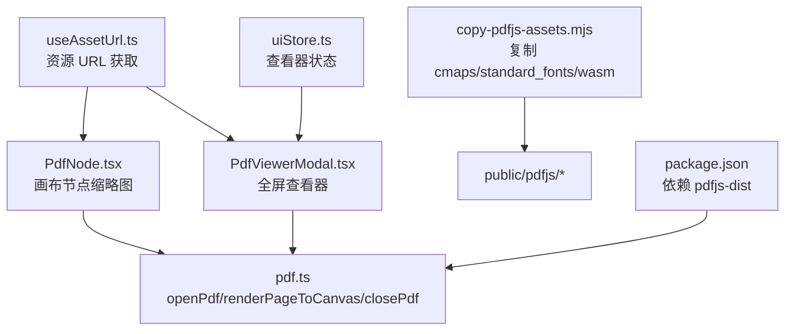
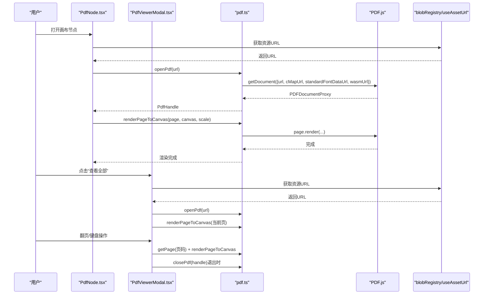
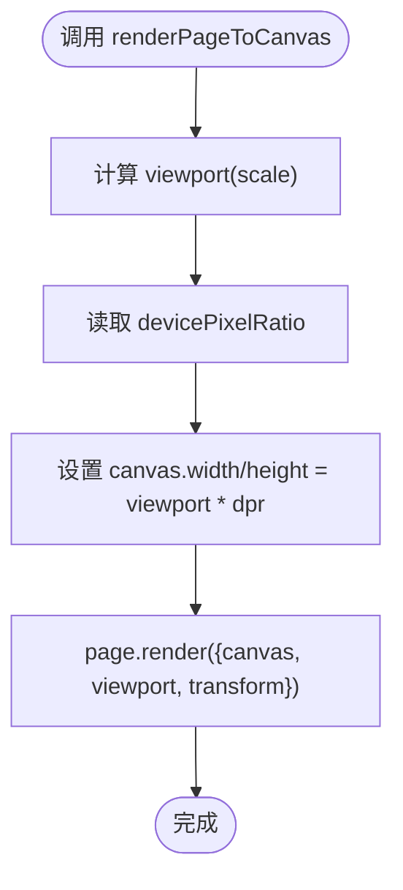
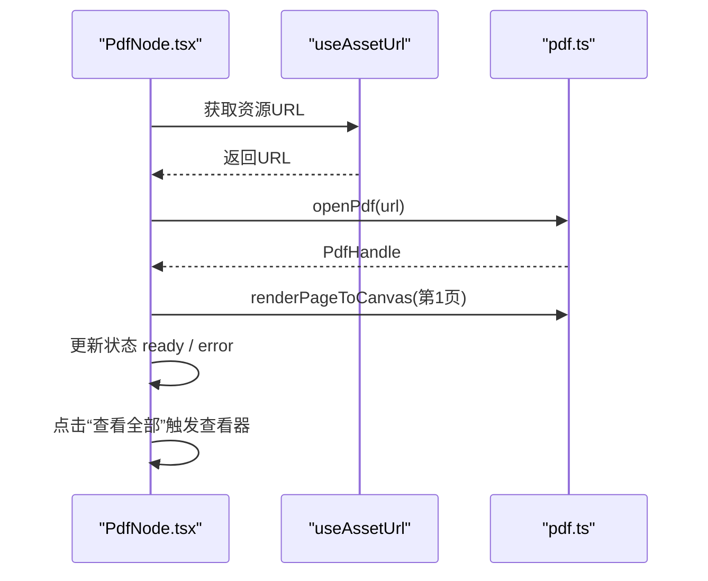
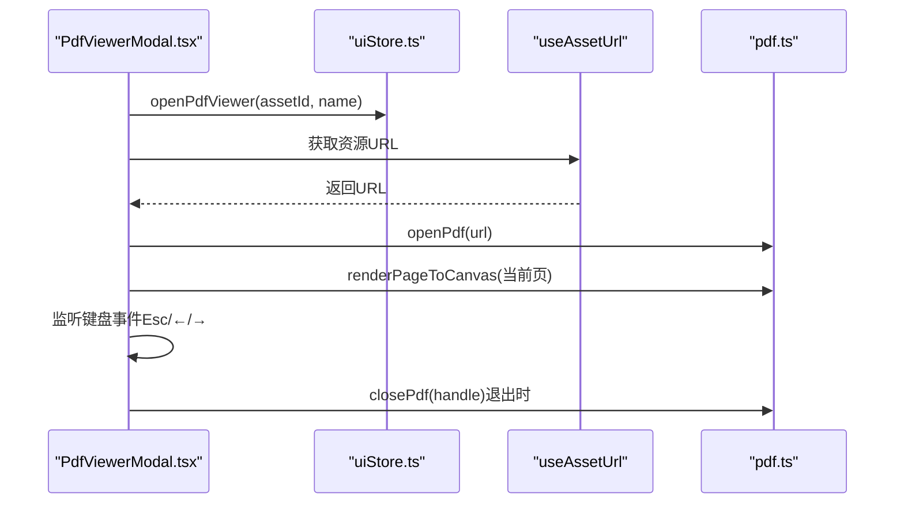
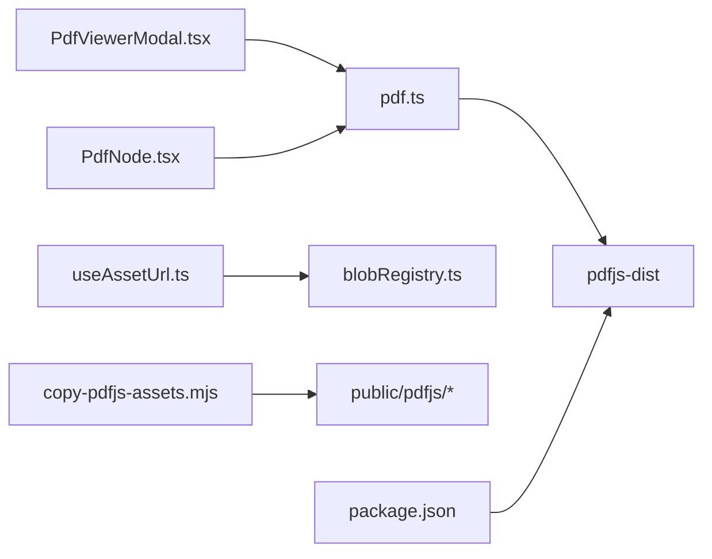

# PDF 渲染器

<cite>
**本文引用的文件**
- [src/media/pdf.ts](file://src/media/pdf.ts)
- [src/components/PdfViewerModal.tsx](file://src/components/PdfViewerModal.tsx)
- [src/canvas/nodes/PdfNode.tsx](file://src/canvas/nodes/PdfNode.tsx)
- [scripts/copy-pdfjs-assets.mjs](file://scripts/copy-pdfjs-assets.mjs)
- [package.json](file://package.json)
- [src/media/useAssetUrl.ts](file://src/media/useAssetUrl.ts)
- [src/store/uiStore.ts](file://src/store/uiStore.ts)
- [src/media/blobRegistry.ts](file://src/media/blobRegistry.ts)
</cite>

## 目录
1. [简介](#简介)
2. [项目结构](#项目结构)
3. [核心组件](#核心组件)
4. [架构总览](#架构总览)
5. [详细组件分析](#详细组件分析)
6. [依赖关系分析](#依赖关系分析)
7. [性能与优化](#性能与优化)
8. [安全与错误处理](#安全与错误处理)
9. [使用示例与常见问题](#使用示例与常见问题)
10. [结论](#结论)

## 简介
本仓库实现了一个基于 PDF.js 的 PDF 预览能力，覆盖画布节点中的缩略图渲染与全屏查看器。功能包括：
- 文档加载、页面渲染、资源路径配置（cMapUrl、standardFontDataUrl、wasmUrl）
- 高 DPI 屏幕适配
- 分页浏览（上一页/下一页）、键盘导航
- 内存管理与资源释放
- 错误提示与失败兜底

该方案将 PDF.js 作为按需动态导入的模块，避免首屏体积膨胀；通过统一的资源复制脚本确保 cmaps、标准字体和 wasm 可用；在 UI 层提供简洁的交互体验。

## 项目结构
PDF 相关代码主要分布在以下位置：
- 媒体层：封装 PDF.js 的打开、关闭、渲染等能力
- UI 层：画布节点内嵌 PDF 缩略图与全屏查看器
- 构建期：复制 PDF.js 静态资源到 public 目录供运行时加载
- 状态管理：控制查看器的开关与数据流

图表来源
- [src/canvas/nodes/PdfNode.tsx:1-90](file://src/canvas/nodes/PdfNode.tsx#L1-L90)
- [src/components/PdfViewerModal.tsx:1-146](file://src/components/PdfViewerModal.tsx#L1-L146)
- [src/media/pdf.ts:1-50](file://src/media/pdf.ts#L1-L50)
- [scripts/copy-pdfjs-assets.mjs:1-20](file://scripts/copy-pdfjs-assets.mjs#L1-L20)
- [package.json:1-52](file://package.json#L1-L52)

章节来源
- [src/media/pdf.ts:1-50](file://src/media/pdf.ts#L1-L50)
- [src/components/PdfViewerModal.tsx:1-146](file://src/components/PdfViewerModal.tsx#L1-L146)
- [src/canvas/nodes/PdfNode.tsx:1-90](file://src/canvas/nodes/PdfNode.tsx#L1-L90)
- [scripts/copy-pdfjs-assets.mjs:1-20](file://scripts/copy-pdfjs-assets.mjs#L1-L20)
- [package.json:1-52](file://package.json#L1-L52)

## 核心组件
- PDF 媒体封装（pdf.ts）
  - 设置 PDF.js Worker 地址
  - 配置 cMapUrl、standardFontDataUrl、wasmUrl
  - 打开/关闭文档、渲染指定页到 Canvas
- 画布 PDF 节点（PdfNode.tsx）
  - 懒加载 PDF 模块并渲染第一页为缩略图
  - 更新节点元数据（页数），点击可进入全屏查看器
- 全屏 PDF 查看器（PdfViewerModal.tsx）
  - 动态导入 PDF 模块，加载文档并渲染当前页
  - 支持上一页/下一页、键盘快捷键（Esc、左右方向键）
  - 清理页面与文档资源，避免内存泄漏
- 资源 URL 获取（useAssetUrl.ts）
  - 从本地 IndexedDB、局域网 HTTP 流或云端拉取资源并返回 URL
  - 带重试机制与错误提示
- 构建期资源复制（copy-pdfjs-assets.mjs）
  - 将 pdfjs-dist 的 cmaps、standard_fonts、wasm 复制到 public/pdfjs
- 状态管理（uiStore.ts）
  - 维护查看器开关与参数

章节来源
- [src/media/pdf.ts:1-50](file://src/media/pdf.ts#L1-L50)
- [src/canvas/nodes/PdfNode.tsx:1-90](file://src/canvas/nodes/PdfNode.tsx#L1-L90)
- [src/components/PdfViewerModal.tsx:1-146](file://src/components/PdfViewerModal.tsx#L1-L146)
- [src/media/useAssetUrl.ts:1-157](file://src/media/useAssetUrl.ts#L1-L157)
- [scripts/copy-pdfjs-assets.mjs:1-20](file://scripts/copy-pdfjs-assets.mjs#L1-L20)
- [src/store/uiStore.ts:1-121](file://src/store/uiStore.ts#L1-L121)

## 架构总览
PDF 渲染流程由“资源获取 → 文档加载 → 页面渲染 → 资源释放”构成，UI 层负责交互与生命周期管理。

图表来源
- [src/canvas/nodes/PdfNode.tsx:1-90](file://src/canvas/nodes/PdfNode.tsx#L1-L90)
- [src/components/PdfViewerModal.tsx:1-146](file://src/components/PdfViewerModal.tsx#L1-L146)
- [src/media/pdf.ts:1-50](file://src/media/pdf.ts#L1-L50)
- [src/media/useAssetUrl.ts:1-157](file://src/media/useAssetUrl.ts#L1-L157)

## 详细组件分析

### PDF 媒体封装（pdf.ts）
- 初始化
  - 设置 PDF.js Worker 地址，避免主线程阻塞
  - 配置 cMapUrl、standardFontDataUrl、wasmUrl，解决 CJK 字体与图片解码问题
- API
  - openPdf：创建文档任务并等待解析完成
  - closePdf：销毁任务以释放内存
  - renderPageToCanvas：根据设备像素比调整 Canvas 尺寸并渲染页面

图表来源
- [src/media/pdf.ts:35-49](file://src/media/pdf.ts#L35-L49)

章节来源
- [src/media/pdf.ts:1-50](file://src/media/pdf.ts#L1-L50)

### 画布 PDF 节点（PdfNode.tsx）
- 行为
  - 首次加载时动态引入 pdf.ts，打开文档并渲染第 1 页为缩略图
  - 更新节点元数据中的页数，便于后续展示
  - 点击按钮打开全屏查看器
- 生命周期
  - 组件卸载时取消异步、清理页面与文档句柄，防止内存泄漏

图表来源
- [src/canvas/nodes/PdfNode.tsx:1-90](file://src/canvas/nodes/PdfNode.tsx#L1-L90)
- [src/media/useAssetUrl.ts:1-157](file://src/media/useAssetUrl.ts#L1-L157)

章节来源
- [src/canvas/nodes/PdfNode.tsx:1-90](file://src/canvas/nodes/PdfNode.tsx#L1-L90)

### 全屏 PDF 查看器（PdfViewerModal.tsx）
- 行为
  - 动态导入 pdf.ts，加载文档并渲染当前页
  - 支持上一页/下一页、Esc 关闭、左右方向键翻页
  - 退出时清理页面与文档句柄
- 缩放策略
  - 根据页面原始宽度计算缩放比例，限制最大缩放，保证在容器内完整显示

图表来源
- [src/components/PdfViewerModal.tsx:1-146](file://src/components/PdfViewerModal.tsx#L1-L146)
- [src/store/uiStore.ts:1-121](file://src/store/uiStore.ts#L1-L121)
- [src/media/useAssetUrl.ts:1-157](file://src/media/useAssetUrl.ts#L1-L157)
- [src/media/pdf.ts:1-50](file://src/media/pdf.ts#L1-L50)

章节来源
- [src/components/PdfViewerModal.tsx:1-146](file://src/components/PdfViewerModal.tsx#L1-L146)
- [src/store/uiStore.ts:1-121](file://src/store/uiStore.ts#L1-L121)

### 资源 URL 获取（useAssetUrl.ts）
- 策略
  - 优先本地 IndexedDB 缓存，其次局域网 HTTP 流式地址，最后尝试云端下载
  - 对网络不稳定场景进行有限次重试，失败时提示用户
- 与 PDF 的关系
  - 为 PDF 节点与查看器提供稳定的资源访问入口，屏蔽底层存储差异

章节来源
- [src/media/useAssetUrl.ts:1-157](file://src/media/useAssetUrl.ts#L1-L157)

### 构建期资源复制（copy-pdfjs-assets.mjs）
- 作用
  - 将 pdfjs-dist 的 cmaps、standard_fonts、wasm 复制到 public/pdfjs，供运行时按 BASE_URL 加载
- 必要性
  - PDF.js v5+ 默认不内置这些资源，缺少时会抛出 CJK 字体或图片解码错误

章节来源
- [scripts/copy-pdfjs-assets.mjs:1-20](file://scripts/copy-pdfjs-assets.mjs#L1-L20)

## 依赖关系分析
- 运行时依赖
  - pdfjs-dist：PDF 解析与渲染核心库
  - React/Zustand：UI 与状态管理
- 构建依赖
  - Vite/Ts：开发与构建工具链
- 资源依赖
  - cmaps、standard_fonts、wasm：通过脚本复制到 public/pdfjs，并在 pdf.ts 中配置路径

图表来源
- [src/media/pdf.ts:1-50](file://src/media/pdf.ts#L1-L50)
- [src/components/PdfViewerModal.tsx:1-146](file://src/components/PdfViewerModal.tsx#L1-L146)
- [src/canvas/nodes/PdfNode.tsx:1-90](file://src/canvas/nodes/PdfNode.tsx#L1-L90)
- [src/media/useAssetUrl.ts:1-157](file://src/media/useAssetUrl.ts#L1-L157)
- [src/media/blobRegistry.ts:1-389](file://src/media/blobRegistry.ts#L1-L389)
- [scripts/copy-pdfjs-assets.mjs:1-20](file://scripts/copy-pdfjs-assets.mjs#L1-L20)
- [package.json:1-52](file://package.json#L1-L52)

章节来源
- [package.json:1-52](file://package.json#L1-L52)
- [src/media/pdf.ts:1-50](file://src/media/pdf.ts#L1-L50)
- [src/media/blobRegistry.ts:1-389](file://src/media/blobRegistry.ts#L1-L389)

## 性能与优化
- 分页加载
  - 仅渲染当前页，切换页面前清理旧页面，减少内存占用
- 高 DPI 适配
  - 根据 devicePixelRatio 调整 Canvas 尺寸与变换矩阵，确保清晰度
- 资源路径优化
  - 通过 cMapUrl、standardFontDataUrl、wasmUrl 指向公共静态资源，避免重复下载
- 懒加载与动态导入
  - PDF.js 模块按需加载，降低首屏体积
- 内存管理
  - 显式调用页面 cleanup 与文档 destroy，避免资源泄漏
- 资源获取优化
  - useAssetUrl 与 blobRegistry 提供本地缓存、HTTP 流式拉取与重试机制，减少大文件重复下载

[本节为通用指导，不直接分析具体文件]

## 安全与错误处理
- 安全
  - 资源 URL 来自受控的来源（本地 IndexedDB、局域网服务器、云端），避免任意外部注入
  - 视频封面抓取使用跨域标志与超时保护，避免无限等待
- 错误处理
  - PDF 打开失败：捕获异常并提示用户
  - 页面渲染失败：捕获异常并提示用户
  - 资源加载失败：有限次重试后提示用户
  - 组件卸载：清理页面与文档句柄，避免残留引用导致内存泄漏

章节来源
- [src/components/PdfViewerModal.tsx:24-56](file://src/components/PdfViewerModal.tsx#L24-L56)
- [src/canvas/nodes/PdfNode.tsx:19-62](file://src/canvas/nodes/PdfNode.tsx#L19-L62)
- [src/media/useAssetUrl.ts:14-44](file://src/media/useAssetUrl.ts#L14-L44)
- [src/media/blobRegistry.ts:84-126](file://src/media/blobRegistry.ts#L84-L126)

## 使用示例与常见问题

### 基本使用流程
- 在画布中添加 PDF 节点，自动加载并渲染第一页缩略图
- 点击“查看全部”打开全屏查看器，支持翻页与键盘操作
- 退出查看器时自动释放资源

章节来源
- [src/canvas/nodes/PdfNode.tsx:1-90](file://src/canvas/nodes/PdfNode.tsx#L1-L90)
- [src/components/PdfViewerModal.tsx:1-146](file://src/components/PdfViewerModal.tsx#L1-L146)

### 关键配置说明
- cMapUrl、standardFontDataUrl、wasmUrl
  - 必须指向 public/pdfjs 下的对应目录，否则 CJK 字体与图片解码会失败
  - 构建前需运行资源复制脚本，确保目录存在
- 高 DPI 屏幕
  - 渲染时使用 devicePixelRatio 调整 Canvas 尺寸与变换矩阵，保证清晰度

章节来源
- [src/media/pdf.ts:7-16](file://src/media/pdf.ts#L7-L16)
- [src/media/pdf.ts:35-49](file://src/media/pdf.ts#L35-L49)
- [scripts/copy-pdfjs-assets.mjs:1-20](file://scripts/copy-pdfjs-assets.mjs#L1-L20)

### 常见问题与解决方案
- 中文/日文/韩文字体乱码或空白
  - 确认已复制 cmaps 到 public/pdfjs/cmaps，并在 pdf.ts 中正确配置 cMapUrl
- 图片无法显示（JBIG2/JPX）
  - 确认已复制 wasm 到 public/pdfjs/wasm，并在 pdf.ts 中正确配置 wasmUrl
- 页面模糊
  - 检查 devicePixelRatio 是否生效，确保 Canvas 尺寸与变换矩阵正确设置
- 内存占用过高
  - 确保每次切换页面时调用页面 cleanup，退出查看器时调用文档 destroy
- 资源加载失败
  - 检查 useAssetUrl 的重试逻辑与网络环境，必要时手动刷新或重新导入资源

章节来源
- [src/media/pdf.ts:7-16](file://src/media/pdf.ts#L7-L16)
- [src/media/pdf.ts:35-49](file://src/media/pdf.ts#L35-L49)
- [src/components/PdfViewerModal.tsx:24-56](file://src/components/PdfViewerModal.tsx#L24-L56)
- [src/canvas/nodes/PdfNode.tsx:19-62](file://src/canvas/nodes/PdfNode.tsx#L19-L62)
- [src/media/useAssetUrl.ts:14-44](file://src/media/useAssetUrl.ts#L14-L44)

## 结论
本项目以最小侵入的方式集成了 PDF.js，提供了稳定可靠的 PDF 预览能力。通过合理的资源路径配置、高 DPI 适配、分页渲染与严格的资源释放策略，实现了良好的性能与用户体验。建议在部署前确保 PDF.js 静态资源已正确复制，并根据实际业务需求扩展搜索、文本选择等功能。

[本节为总结性内容，不直接分析具体文件]