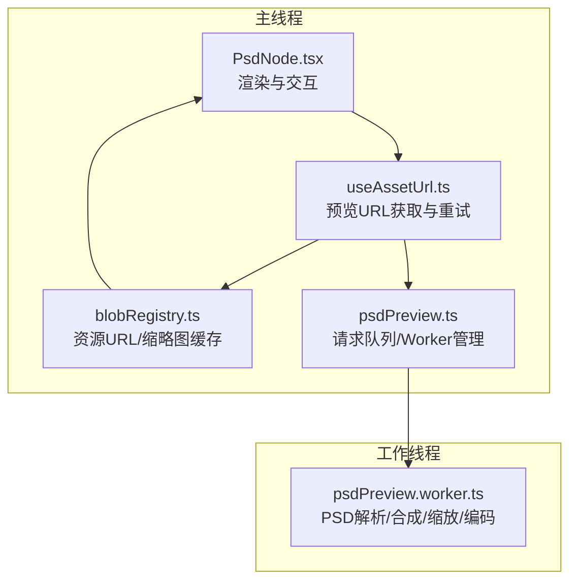
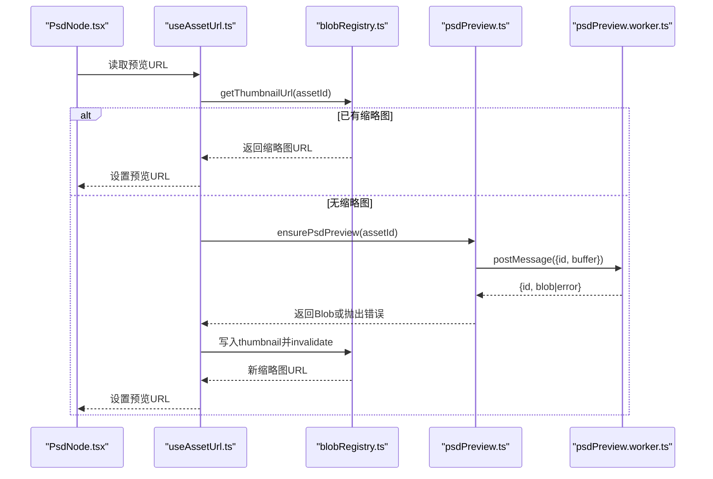
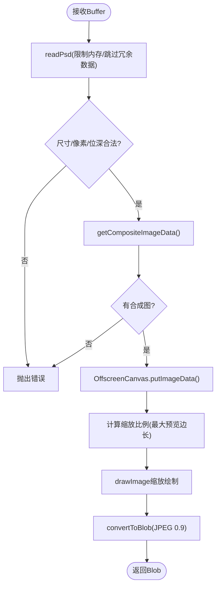
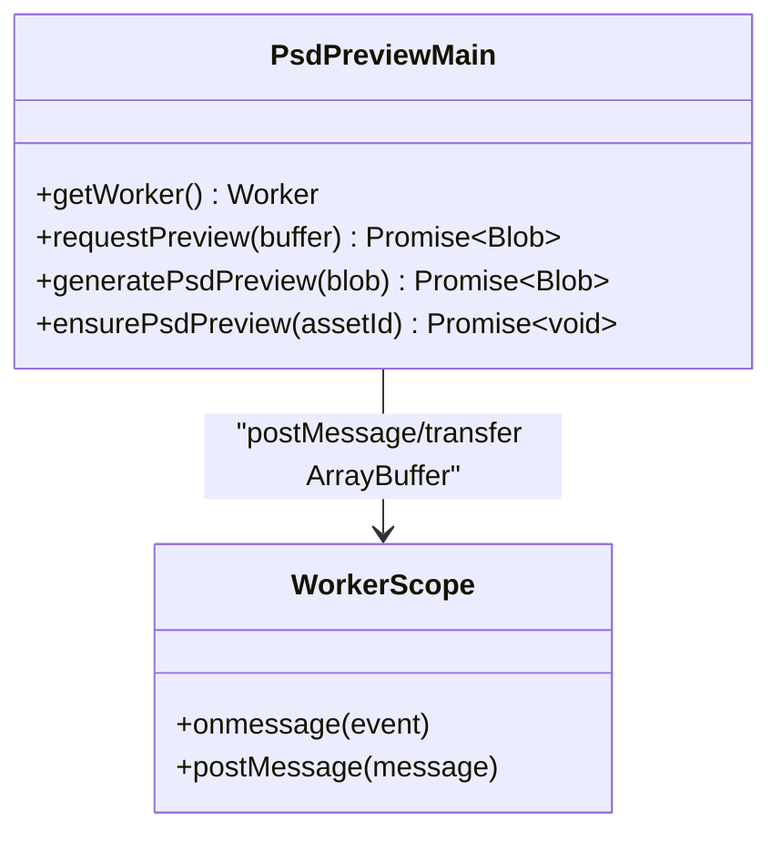
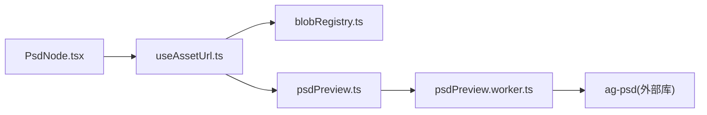

# PSD 预览处理

<cite>
**本文引用的文件**
- [src/media/psdPreview.ts](file://src/media/psdPreview.ts)
- [src/media/psdPreview.worker.ts](file://src/media/psdPreview.worker.ts)
- [src/canvas/nodes/PsdNode.tsx](file://src/canvas/nodes/PsdNode.tsx)
- [src/media/useAssetUrl.ts](file://src/media/useAssetUrl.ts)
- [src/media/blobRegistry.ts](file://src/media/blobRegistry.ts)
- [src/io/fileLoader.ts](file://src/io/fileLoader.ts)
- [src/canvas/clipboard.ts](file://src/canvas/clipboard.ts)
</cite>

## 目录
1. [简介](#简介)
2. [项目结构](#项目结构)
3. [核心组件](#核心组件)
4. [架构总览](#架构总览)
5. [详细组件分析](#详细组件分析)
6. [依赖关系分析](#依赖关系分析)
7. [性能考量](#性能考量)
8. [故障排查指南](#故障排查指南)
9. [结论](#结论)
10. [附录](#附录)

## 简介
本技术文档围绕 PSD 预览处理系统，系统性阐述 PSD 文件解析、工作线程通信协议、数据传输优化、错误处理与性能优化策略。重点说明主线程与工作线程的协作方式、内存与渲染优化、大文件处理方案，以及兼容性与调试技巧，帮助读者理解并高效使用或扩展该子系统。

## 项目结构
PSD 预览相关代码主要分布在媒体处理层（worker 与主线程协调）、资源注册与缓存、UI 节点渲染与交互、以及导入流程中：
- 媒体处理层：负责将 PSD 原始数据解析为缩略图 Blob，并通过 Worker 在独立线程执行，避免阻塞 UI。
- 资源注册与缓存：提供资产 URL、缩略图 URL 的获取与失效机制，支持本地 IndexedDB、局域网与云端来源。
- UI 节点：在画布中以节点形式展示 PSD，并在需要时触发预览生成与显示。
- 导入流程：在文件导入阶段尝试生成 PSD 预览，失败不影响原文件入库。

图表来源
- [src/canvas/nodes/PsdNode.tsx:15-125](file://src/canvas/nodes/PsdNode.tsx#L15-L125)
- [src/media/useAssetUrl.ts:129-156](file://src/media/useAssetUrl.ts#L129-L156)
- [src/media/blobRegistry.ts:84-105](file://src/media/blobRegistry.ts#L84-L105)
- [src/media/psdPreview.ts:15-47](file://src/media/psdPreview.ts#L15-L47)
- [src/media/psdPreview.worker.ts:29-81](file://src/media/psdPreview.worker.ts#L29-L81)

章节来源
- [src/canvas/nodes/PsdNode.tsx:15-125](file://src/canvas/nodes/PsdNode.tsx#L15-L125)
- [src/media/useAssetUrl.ts:129-156](file://src/media/useAssetUrl.ts#L129-L156)
- [src/media/blobRegistry.ts:84-105](file://src/media/blobRegistry.ts#L84-L105)
- [src/media/psdPreview.ts:15-47](file://src/media/psdPreview.ts#L15-L47)
- [src/media/psdPreview.worker.ts:29-81](file://src/media/psdPreview.worker.ts#L29-L81)

## 核心组件
- 主线程调度器（psdPreview.ts）：维护 Worker 实例、请求 ID、待处理队列与 Promise 串行化，确保同一时间仅一个任务进入 worker，避免并发解码导致内存峰值过高。
- 工作线程处理器（psdPreview.worker.ts）：基于 ag-psd 进行 PSD 解析，限制最大维度与像素数，提取合成图像数据，通过 OffscreenCanvas 缩放并编码为 JPEG Blob。
- 资源与缩略图管理（blobRegistry.ts）：提供 getAssetUrl/getThumbnailUrl 等能力，包含本地 IndexedDB、局域网流式地址、云端下载等多源融合与缓存失效。
- UI 节点（PsdNode.tsx）：根据预览 URL 渲染图片，双击打开大图查看；若预览未就绪则提示等待。
- 资源加载 Hook（useAssetUrl.ts）：封装 usePsdPreviewUrl，自动检测缩略图是否存在，不存在则调用 ensurePsdPreview 生成并刷新缓存。
- 导入流程（fileLoader.ts）：导入文件时尝试生成 PSD 预览，失败不阻断入库，并给出用户提示。

章节来源
- [src/media/psdPreview.ts:15-47](file://src/media/psdPreview.ts#L15-L47)
- [src/media/psdPreview.worker.ts:41-81](file://src/media/psdPreview.worker.ts#L41-L81)
- [src/media/blobRegistry.ts:84-105](file://src/media/blobRegistry.ts#L84-L105)
- [src/canvas/nodes/PsdNode.tsx:15-125](file://src/canvas/nodes/PsdNode.tsx#L15-L125)
- [src/media/useAssetUrl.ts:129-156](file://src/media/useAssetUrl.ts#L129-L156)
- [src/io/fileLoader.ts:77-117](file://src/io/fileLoader.ts#L77-L117)

## 架构总览
下图展示了从 UI 到 Worker 的完整调用链路与数据流向，包括预览生成、缓存更新与 UI 刷新。

图表来源
- [src/canvas/nodes/PsdNode.tsx:15-125](file://src/canvas/nodes/PsdNode.tsx#L15-L125)
- [src/media/useAssetUrl.ts:129-156](file://src/media/useAssetUrl.ts#L129-L156)
- [src/media/blobRegistry.ts:310-379](file://src/media/blobRegistry.ts#L310-L379)
- [src/media/psdPreview.ts:42-60](file://src/media/psdPreview.ts#L42-L60)
- [src/media/psdPreview.worker.ts:29-81](file://src/media/psdPreview.worker.ts#L29-L81)

## 详细组件分析

### 工作线程：PSD 解析与渲染
- 初始化 Canvas：通过 initializeCanvas 注入 OffscreenCanvas/ImageData 工厂，使 ag-psd 能在 worker 环境中正确创建画布与像素数据。
- 解析参数：readPsd 启用 raw data/raw thumbnail，跳过图层图像数据与链接文件数据，限制总解码内存，降低内存占用。
- 尺寸与位深校验：限制最大边长、总像素数，仅支持 8-bit 通道深度，超出即报错。
- 合成图像提取：getCompositeImageData 获取合并后的像素数据，若无合成图直接报错。
- 缩放与编码：将像素数据写入 OffscreenCanvas，按最大预览边长计算缩放比例，绘制到目标画布后以 JPEG quality=0.9 编码输出 Blob。

图表来源
- [src/media/psdPreview.worker.ts:8-11](file://src/media/psdPreview.worker.ts#L8-L11)
- [src/media/psdPreview.worker.ts:41-81](file://src/media/psdPreview.worker.ts#L41-L81)

章节来源
- [src/media/psdPreview.worker.ts:8-11](file://src/media/psdPreview.worker.ts#L8-L11)
- [src/media/psdPreview.worker.ts:41-81](file://src/media/psdPreview.worker.ts#L41-L81)

### 主线程：请求队列与 Worker 管理
- Worker 生命周期：首次访问时创建，onmessage 路由响应到 pending Map，onerror 清理所有挂起请求并重置 worker。
- 请求序列化：通过 queue Promise 串行化请求，避免同时多个 PSD 解码造成内存峰值。
- 传输优化：postMessage 使用 transferable ArrayBuffer，减少拷贝开销。
- 结果处理：成功返回 Blob，失败统一拒绝并携带错误信息。

图表来源
- [src/media/psdPreview.ts:15-47](file://src/media/psdPreview.ts#L15-L47)
- [src/media/psdPreview.worker.ts:24-39](file://src/media/psdPreview.worker.ts#L24-L39)

章节来源
- [src/media/psdPreview.ts:15-47](file://src/media/psdPreview.ts#L15-L47)

### 资源与缩略图：缓存、失效与多源融合
- 缩略图优先：优先使用局域网同步来的封面，其次检查本地 IndexedDB 记录，必要时重新抓帧或拉取。
- 视频与图片差异化：对视频采用抓帧逻辑，对 PSD 通过 ensurePsdPreview 生成缩略图。
- 缓存失效：当缩略图更新时调用 invalidateThumbnailUrl 释放旧 URL 并清空缓存，促使 UI 重新获取新 URL。
- 并发控制：针对视频抓帧有并发槽位控制，PSD 预览通过主线程队列串行化，避免同时解码。

章节来源
- [src/media/blobRegistry.ts:310-379](file://src/media/blobRegistry.ts#L310-L379)
- [src/media/blobRegistry.ts:41-56](file://src/media/blobRegistry.ts#L41-L56)
- [src/media/psdPreview.ts:49-60](file://src/media/psdPreview.ts#L49-L60)

### UI 节点：渲染与交互
- 预览展示：若存在 previewUrl 则渲染图片，否则显示“正在生成 PSD 预览”占位。
- 自适应尺寸：图片加载完成后根据自然宽高计算缩放，设置节点初始尺寸。
- 交互：双击打开大图查看；悬停显示打开与下载按钮。

章节来源
- [src/canvas/nodes/PsdNode.tsx:15-125](file://src/canvas/nodes/PsdNode.tsx#L15-L125)

### 资源加载 Hook：自动触发预览生成
- 先尝试获取缩略图 URL，若不存在则调用 ensurePsdPreview 生成并再次获取。
- 捕获异常并提示用户，保证 UI 健壮性。

章节来源
- [src/media/useAssetUrl.ts:129-156](file://src/media/useAssetUrl.ts#L129-L156)

### 导入流程：非阻塞预览生成
- 导入文件时识别类型，PSD 尝试生成预览，失败不影响入库，并提示用户仍可下载原文件。

章节来源
- [src/io/fileLoader.ts:77-117](file://src/io/fileLoader.ts#L77-L117)

### 剪贴板集成：PSD 复制为 PNG
- 对于单个 PSD 节点，优先尝试复制其缩略图为 PNG；失败回退为文本复制。
- 内部先将 PSD 缩略图转换为 PNG，再写入系统剪贴板。

章节来源
- [src/canvas/clipboard.ts:28-44](file://src/canvas/clipboard.ts#L28-L44)
- [src/canvas/clipboard.ts:46-70](file://src/canvas/clipboard.ts#L46-L70)
- [src/canvas/clipboard.ts:99-107](file://src/canvas/clipboard.ts#L99-L107)

## 依赖关系分析
- 主线程 psdPreview.ts 依赖：
  - db 存储（IndexedDB）用于持久化缩略图
  - blobRegistry 提供资源 URL 与缩略图 URL 的获取与失效
- 工作线程 psdPreview.worker.ts 依赖：
  - ag-psd 库进行 PSD 解析与合成图像提取
  - OffscreenCanvas/ImageData 进行像素操作与编码
- UI 层依赖：
  - useAssetUrl 提供预览 URL 的获取与重试
  - PsdNode 负责渲染与交互

图表来源
- [src/canvas/nodes/PsdNode.tsx:15-125](file://src/canvas/nodes/PsdNode.tsx#L15-L125)
- [src/media/useAssetUrl.ts:129-156](file://src/media/useAssetUrl.ts#L129-L156)
- [src/media/blobRegistry.ts:84-105](file://src/media/blobRegistry.ts#L84-L105)
- [src/media/psdPreview.ts:15-47](file://src/media/psdPreview.ts#L15-L47)
- [src/media/psdPreview.worker.ts:1-11](file://src/media/psdPreview.worker.ts#L1-L11)

章节来源
- [src/canvas/nodes/PsdNode.tsx:15-125](file://src/canvas/nodes/PsdNode.tsx#L15-L125)
- [src/media/useAssetUrl.ts:129-156](file://src/media/useAssetUrl.ts#L129-L156)
- [src/media/blobRegistry.ts:84-105](file://src/media/blobRegistry.ts#L84-L105)
- [src/media/psdPreview.ts:15-47](file://src/media/psdPreview.ts#L15-L47)
- [src/media/psdPreview.worker.ts:1-11](file://src/media/psdPreview.worker.ts#L1-L11)

## 性能考量
- 大文件处理：
  - 限制最大文档边长与总像素数，防止超大 PSD 导致内存溢出或卡顿。
  - 跳过图层图像数据与链接文件数据，仅处理合成图像，显著降低内存与 CPU 消耗。
- 内存管理：
  - 设置 totalMemoryLimit 限制解码内存上限。
  - 使用 transferable ArrayBuffer 进行零拷贝传输，减少主线程与 worker 间的数据拷贝开销。
  - 缩略图 URL 使用 URL.createObjectURL 并配合 invalidate 及时释放，避免内存泄漏。
- 渲染优化：
  - 将合成像素数据写入 OffscreenCanvas，按最大预览边长缩放后再编码，降低最终图片体积与渲染压力。
  - 使用 JPEG 质量 0.9 平衡清晰度与体积。
- 并发控制：
  - 主线程通过 Promise 队列串行化 PSD 预览生成，避免并发解码导致的内存尖峰。
  - 视频缩略图抓取有并发槽位控制，避免阻塞播放。

[本节为通用性能讨论，无需具体文件引用]

## 故障排查指南
- 常见错误与定位：
  - “PSD dimensions exceed preview limits”：文件尺寸或像素数超过限制，需裁剪或降低分辨率。
  - “Only 8-bit PSD previews are supported”：当前仅支持 8-bit 通道深度，更高位深需转换。
  - “PSD has no composite image”：文件缺少合成图，无法生成预览。
  - “PSD preview worker failed”：worker 崩溃或通信异常，主线程会清理并重建 worker。
- 调试技巧：
  - 在主线程 onerror 中捕获 worker 错误并打印日志，确认是否频繁崩溃。
  - 检查 readPsd 配置是否正确（如 skipLayerImageData、totalMemoryLimit）。
  - 验证 OffscreenCanvas 是否可用（某些环境可能受限）。
  - 观察缩略图缓存是否被正确失效（invalidateThumbnailUrl），避免旧 URL 复用。
- 用户体验：
  - 导入阶段预览失败不影响入库，提示用户仍可下载原文件。
  - UI 层在预览未就绪时显示占位与提示，避免误判。

章节来源
- [src/media/psdPreview.worker.ts:51-63](file://src/media/psdPreview.worker.ts#L51-L63)
- [src/media/psdPreview.ts:25-31](file://src/media/psdPreview.ts#L25-L31)
- [src/io/fileLoader.ts:84-88](file://src/io/fileLoader.ts#L84-L88)
- [src/media/blobRegistry.ts:47-56](file://src/media/blobRegistry.ts#L47-L56)

## 结论
本系统通过工作线程隔离重计算的 PSD 解析与渲染，结合严格的尺寸与内存限制、序列化的主线程队列、以及高效的 ArrayBuffer 传输，实现了稳定且高性能的 PSD 预览能力。资源层的多源融合与缓存机制确保了在不同网络与存储环境下的一致体验。整体设计兼顾了可扩展性与鲁棒性，便于后续增加更多格式支持与优化策略。

[本节为总结性内容，无需具体文件引用]

## 附录
- 关键实现路径参考：
  - 主线程调度与 Worker 管理：[src/media/psdPreview.ts:15-47](file://src/media/psdPreview.ts#L15-L47)
  - 工作线程解析与渲染：[src/media/psdPreview.worker.ts:41-81](file://src/media/psdPreview.worker.ts#L41-L81)
  - 资源与缩略图管理：[src/media/blobRegistry.ts:310-379](file://src/media/blobRegistry.ts#L310-L379)
  - UI 节点渲染与交互：[src/canvas/nodes/PsdNode.tsx:15-125](file://src/canvas/nodes/PsdNode.tsx#L15-L125)
  - 资源加载 Hook：[src/media/useAssetUrl.ts:129-156](file://src/media/useAssetUrl.ts#L129-L156)
  - 导入流程：[src/io/fileLoader.ts:77-117](file://src/io/fileLoader.ts#L77-L117)
  - 剪贴板集成：[src/canvas/clipboard.ts:28-44](file://src/canvas/clipboard.ts#L28-L44)

[本节为附录，无需具体文件引用]