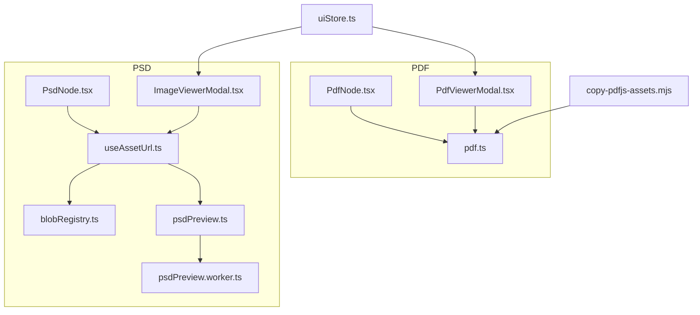
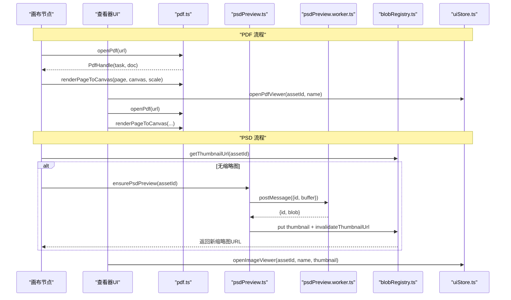
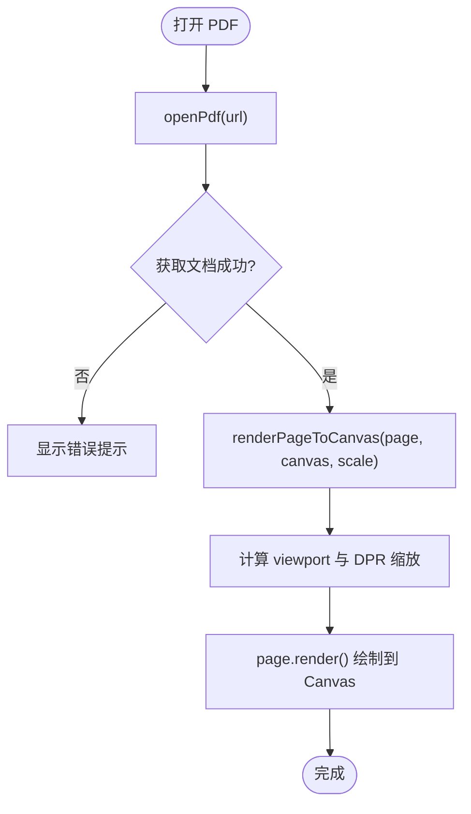
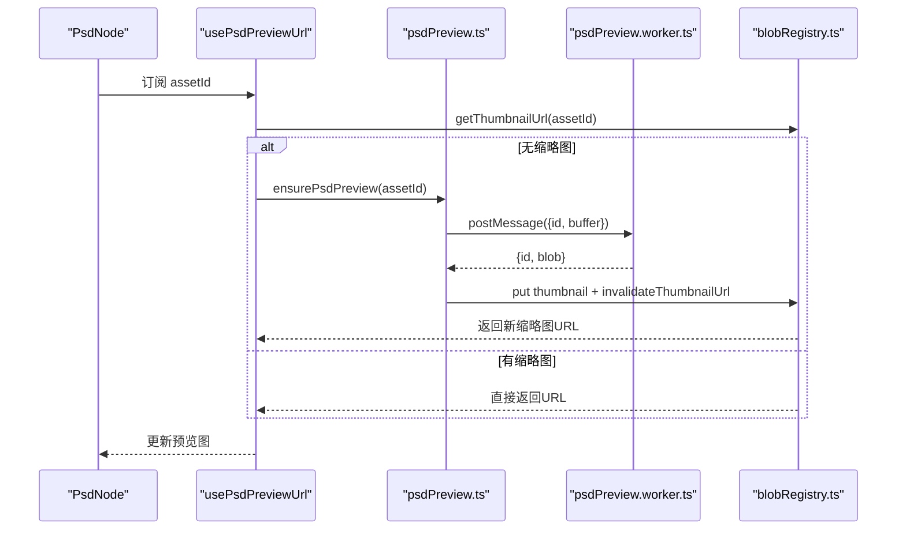
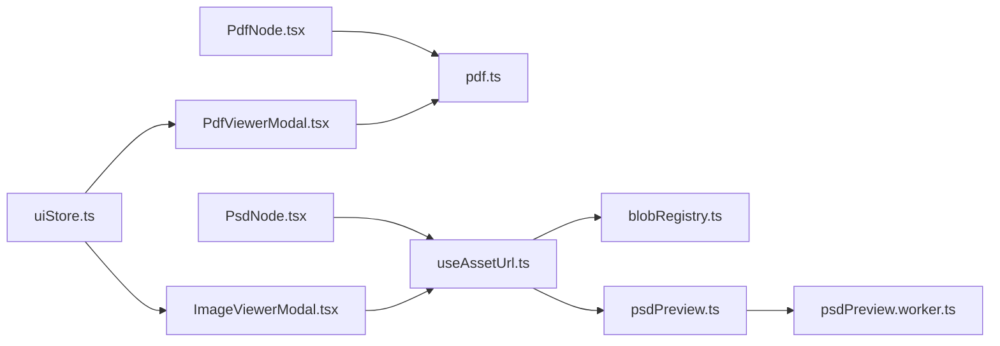

# 文档预览

<cite>
**本文引用的文件**
- [src/media/pdf.ts](file://src/media/pdf.ts)
- [src/components/PdfViewerModal.tsx](file://src/components/PdfViewerModal.tsx)
- [src/canvas/nodes/PdfNode.tsx](file://src/canvas/nodes/PdfNode.tsx)
- [scripts/copy-pdfjs-assets.mjs](file://scripts/copy-pdfjs-assets.mjs)
- [src/media/psdPreview.ts](file://src/media/psdPreview.ts)
- [src/media/psdPreview.worker.ts](file://src/media/psdPreview.worker.ts)
- [src/canvas/nodes/PsdNode.tsx](file://src/canvas/nodes/PsdNode.tsx)
- [src/components/ImageViewerModal.tsx](file://src/components/ImageViewerModal.tsx)
- [src/media/useAssetUrl.ts](file://src/media/useAssetUrl.ts)
- [src/media/blobRegistry.ts](file://src/media/blobRegistry.ts)
- [src/store/uiStore.ts](file://src/store/uiStore.ts)
</cite>

## 目录
1. [简介](#简介)
2. [项目结构](#项目结构)
3. [核心组件](#核心组件)
4. [架构总览](#架构总览)
5. [详细组件分析](#详细组件分析)
6. [依赖关系分析](#依赖关系分析)
7. [性能考量](#性能考量)
8. [故障排除指南](#故障排除指南)
9. [结论](#结论)
10. [附录](#附录)

## 简介
本技术文档围绕“文档预览”能力，系统性说明 PDF 与 PSD 两类文档在画布节点、弹窗查看器中的渲染与交互实现。重点覆盖：
- PDF.js 集成：工作线程配置、CJK 字体与标准字体资源、页面加载与缩放、Canvas 渲染与 DPR 适配。
- PSD 预览机制：图层解析策略、缩略图生成、内存限制与并发控制、主线程与工作线程通信。
- 性能优化：懒加载、按需渲染、队列化请求、缓存与 URL 生命周期管理。
- 用户体验：键盘导航、缩放、适应窗口、错误提示与降级策略。
- 完整示例与排错：从构建期资源拷贝到运行时异常处理的全链路说明。

## 项目结构
文档预览相关代码主要分布在以下模块：
- PDF 渲染：media/pdf.ts（PDF.js 封装）、components/PdfViewerModal.tsx（全屏查看器）、canvas/nodes/PdfNode.tsx（画布内缩略页）。
- PSD 预览：media/psdPreview.ts（主线程调度）、media/psdPreview.worker.ts（Worker 解码与合成）、canvas/nodes/PsdNode.tsx（画布节点）、components/ImageViewerModal.tsx（图片查看器，支持 PSD 预览）。
- 资源与缓存：media/useAssetUrl.ts（URL 获取与重试）、media/blobRegistry.ts（Blob/缩略图缓存与抓取）。
- UI 状态：store/uiStore.ts（打开/关闭查看器的全局状态）。
- 构建脚本：scripts/copy-pdfjs-assets.mjs（复制 PDF.js 所需 cmaps/standard_fonts/wasm 到 public/pdfjs）。

图表来源
- [src/canvas/nodes/PdfNode.tsx:1-90](file://src/canvas/nodes/PdfNode.tsx#L1-L90)
- [src/components/PdfViewerModal.tsx:1-146](file://src/components/PdfViewerModal.tsx#L1-L146)
- [src/media/pdf.ts:1-50](file://src/media/pdf.ts#L1-L50)
- [src/canvas/nodes/PsdNode.tsx:1-125](file://src/canvas/nodes/PsdNode.tsx#L1-L125)
- [src/media/useAssetUrl.ts:1-157](file://src/media/useAssetUrl.ts#L1-L157)
- [src/media/blobRegistry.ts:1-389](file://src/media/blobRegistry.ts#L1-L389)
- [src/media/psdPreview.ts:1-62](file://src/media/psdPreview.ts#L1-L62)
- [src/media/psdPreview.worker.ts:1-82](file://src/media/psdPreview.worker.ts#L1-L82)
- [src/components/ImageViewerModal.tsx:1-165](file://src/components/ImageViewerModal.tsx#L1-L165)
- [src/store/uiStore.ts:1-121](file://src/store/uiStore.ts#L1-L121)
- [scripts/copy-pdfjs-assets.mjs:1-20](file://scripts/copy-pdfjs-assets.mjs#L1-L20)

章节来源
- [src/media/pdf.ts:1-50](file://src/media/pdf.ts#L1-L50)
- [src/components/PdfViewerModal.tsx:1-146](file://src/components/PdfViewerModal.tsx#L1-L146)
- [src/canvas/nodes/PdfNode.tsx:1-90](file://src/canvas/nodes/PdfNode.tsx#L1-L90)
- [src/media/psdPreview.ts:1-62](file://src/media/psdPreview.ts#L1-L62)
- [src/media/psdPreview.worker.ts:1-82](file://src/media/psdPreview.worker.ts#L1-L82)
- [src/canvas/nodes/PsdNode.tsx:1-125](file://src/canvas/nodes/PsdNode.tsx#L1-L125)
- [src/components/ImageViewerModal.tsx:1-165](file://src/components/ImageViewerModal.tsx#L1-L165)
- [src/media/useAssetUrl.ts:1-157](file://src/media/useAssetUrl.ts#L1-L157)
- [src/media/blobRegistry.ts:1-389](file://src/media/blobRegistry.ts#L1-L389)
- [src/store/uiStore.ts:1-121](file://src/store/uiStore.ts#L1-L121)
- [scripts/copy-pdfjs-assets.mjs:1-20](file://scripts/copy-pdfjs-assets.mjs#L1-L20)

## 核心组件
- PDF 渲染引擎封装：提供 open/close/renderPageToCanvas 等能力，统一配置 workerSrc、cMapUrl、standardFontDataUrl、wasmUrl，并处理高 DPI Canvas 渲染。
- PDF 查看器与节点：PdfViewerModal 负责全屏翻页、键盘导航；PdfNode 在画布中仅渲染第一页作为缩略，点击可进入全屏查看。
- PSD 预览管线：PsdNode 通过 usePsdPreviewUrl 触发 ensurePsdPreview，使用 Worker 解码 PSD 并生成 JPEG 缩略图，存入 IndexedDB 并通过 blob URL 展示。
- 资源与缓存：useAssetUrl 提供带重试的资源 URL 获取；blobRegistry 统一管理 Blob URL 与缩略图缓存、并发控制与失效。
- UI 状态：uiStore 集中管理查看器开关与参数，避免跨组件状态同步问题。

章节来源
- [src/media/pdf.ts:1-50](file://src/media/pdf.ts#L1-L50)
- [src/components/PdfViewerModal.tsx:1-146](file://src/components/PdfViewerModal.tsx#L1-L146)
- [src/canvas/nodes/PdfNode.tsx:1-90](file://src/canvas/nodes/PdfNode.tsx#L1-L90)
- [src/media/psdPreview.ts:1-62](file://src/media/psdPreview.ts#L1-L62)
- [src/media/psdPreview.worker.ts:1-82](file://src/media/psdPreview.worker.ts#L1-L82)
- [src/canvas/nodes/PsdNode.tsx:1-125](file://src/canvas/nodes/PsdNode.tsx#L1-L125)
- [src/media/useAssetUrl.ts:1-157](file://src/media/useAssetUrl.ts#L1-L157)
- [src/media/blobRegistry.ts:1-389](file://src/media/blobRegistry.ts#L1-L389)
- [src/store/uiStore.ts:1-121](file://src/store/uiStore.ts#L1-L121)

## 架构总览
下图展示了 PDF 与 PSD 预览的整体数据流与控制流：

图表来源
- [src/canvas/nodes/PdfNode.tsx:1-90](file://src/canvas/nodes/PdfNode.tsx#L1-L90)
- [src/components/PdfViewerModal.tsx:1-146](file://src/components/PdfViewerModal.tsx#L1-L146)
- [src/media/pdf.ts:1-50](file://src/media/pdf.ts#L1-L50)
- [src/media/psdPreview.ts:1-62](file://src/media/psdPreview.ts#L1-L62)
- [src/media/psdPreview.worker.ts:1-82](file://src/media/psdPreview.worker.ts#L1-L82)
- [src/media/blobRegistry.ts:1-389](file://src/media/blobRegistry.ts#L1-L389)
- [src/store/uiStore.ts:1-121](file://src/store/uiStore.ts#L1-L121)

## 详细组件分析

### PDF 渲染引擎集成（PDF.js）
- 工作线程与资源路径
  - 设置 pdfjs.GlobalWorkerOptions.workerSrc 指向打包产物中的 worker 文件。
  - 配置 cMapUrl、standardFontDataUrl、wasmUrl，确保 CJK 字体、标准字体与 JBIG2/JPX 图片正常渲染。
  - 构建阶段通过 copy-pdfjs-assets.mjs 将 cmaps/standard_fonts/wasm 复制到 public/pdfjs，供运行时加载。
- 页面加载与渲染
  - openPdf 创建 DocumentLoadingTask 并等待 promise 得到 PDFDocumentProxy。
  - renderPageToCanvas 根据页面 viewport 计算 Canvas 尺寸，考虑 devicePixelRatio 进行缩放变换，调用 page.render 完成绘制。
- 查看器交互
  - PdfViewerModal 支持上一页/下一页、Esc 关闭、点击遮罩关闭，渲染当前页并自动计算合适缩放比例。
  - PdfNode 在画布中仅渲染第一页作为缩略，点击“查看全部”进入 PdfViewerModal。
- 文本选择
  - 当前实现基于 Canvas 渲染，未启用 PDF.js 的文本层叠加，因此不支持文本选择。如需文本选择，可在 PDF.js 中启用 textLayer 并在 Canvas 上方叠加文本层 DOM。

图表来源
- [src/media/pdf.ts:1-50](file://src/media/pdf.ts#L1-L50)
- [src/components/PdfViewerModal.tsx:1-146](file://src/components/PdfViewerModal.tsx#L1-L146)
- [src/canvas/nodes/PdfNode.tsx:1-90](file://src/canvas/nodes/PdfNode.tsx#L1-L90)
- [scripts/copy-pdfjs-assets.mjs:1-20](file://scripts/copy-pdfjs-assets.mjs#L1-L20)

章节来源
- [src/media/pdf.ts:1-50](file://src/media/pdf.ts#L1-L50)
- [src/components/PdfViewerModal.tsx:1-146](file://src/components/PdfViewerModal.tsx#L1-L146)
- [src/canvas/nodes/PdfNode.tsx:1-90](file://src/canvas/nodes/PdfNode.tsx#L1-L90)
- [scripts/copy-pdfjs-assets.mjs:1-20](file://scripts/copy-pdfjs-assets.mjs#L1-L20)

### PSD 预览处理机制
- 主线程调度
  - usePsdPreviewUrl 先尝试获取已有缩略图 URL；若无则调用 ensurePsdPreview 生成。
  - ensurePsdPreview 读取资产 Blob，调用 generatePsdPreview 生成缩略图并写入 IndexedDB，同时使缓存失效以刷新视图。
- 工作线程解码与合成
  - psdPreview.worker.ts 使用 ag-psd 的 readPsd 读取 PSD，开启 useRawData/useRawThumbnail/skipLayerImageData 等选项以降低内存占用。
  - 校验文档尺寸与像素上限、位深限制，提取合成图像数据，使用 OffscreenCanvas 缩放至最大边长限制，输出 JPEG 缩略图。
- 主线程通信与队列
  - psdPreview.ts 维护单例 Worker、请求 ID、pending Map 与 Promise 队列，保证同一时间串行执行，避免大文件解码阻塞主线程。
  - 通过 postMessage 传输 ArrayBuffer（结构化克隆），接收结果后 resolve/reject 对应 Promise。
- 内存与并发优化
  - 限制最大文档边长、像素数、解码内存上限，防止 OOM。
  - 使用 OffscreenCanvas 减少主线程压力；JPEG 质量 0.9 平衡清晰度与体积。
  - 对缩略图生成进行队列化，避免重复解码。

图表来源
- [src/canvas/nodes/PsdNode.tsx:1-125](file://src/canvas/nodes/PsdNode.tsx#L1-L125)
- [src/media/useAssetUrl.ts:1-157](file://src/media/useAssetUrl.ts#L1-L157)
- [src/media/psdPreview.ts:1-62](file://src/media/psdPreview.ts#L1-L62)
- [src/media/psdPreview.worker.ts:1-82](file://src/media/psdPreview.worker.ts#L1-L82)
- [src/media/blobRegistry.ts:1-389](file://src/media/blobRegistry.ts#L1-L389)

章节来源
- [src/media/psdPreview.ts:1-62](file://src/media/psdPreview.ts#L1-L62)
- [src/media/psdPreview.worker.ts:1-82](file://src/media/psdPreview.worker.ts#L1-L82)
- [src/canvas/nodes/PsdNode.tsx:1-125](file://src/canvas/nodes/PsdNode.tsx#L1-L125)
- [src/media/useAssetUrl.ts:1-157](file://src/media/useAssetUrl.ts#L1-L157)
- [src/media/blobRegistry.ts:1-389](file://src/media/blobRegistry.ts#L1-L389)

### 图片查看器（含 PSD 预览）
- ImageViewerModal 支持缩放（滚轮/按钮/快捷键）、适应窗口、下载原始文件，以及针对 PSD 的“在 Photoshop 中打开”下载流程。
- 当 viewer.thumbnail 为真时，优先使用 PSD 预览缩略图 URL；否则使用原图 URL。
- 通过 useAssetSourceUrl 与 usePsdPreviewUrl 组合，智能选择最佳源。

章节来源
- [src/components/ImageViewerModal.tsx:1-165](file://src/components/ImageViewerModal.tsx#L1-L165)
- [src/media/useAssetUrl.ts:1-157](file://src/media/useAssetUrl.ts#L1-L157)

### 资源与缓存（Blob/缩略图）
- getAssetUrl：优先本地 Blob URL，其次局域网 HTTP 流式地址，最后回退到 IndexedDB 或云端拉取。
- getThumbnailUrl：优先局域网同步的缩略图；视频类资源会抓帧生成封面；存在黑帧检测与重试逻辑；并发限制避免阻塞播放。
- invalidate*：在缩略图更新或资源变更时清理旧 Blob URL，避免内存泄漏。

章节来源
- [src/media/blobRegistry.ts:1-389](file://src/media/blobRegistry.ts#L1-L389)

### UI 状态管理
- uiStore 集中管理查看器开关（PDF/图片/播放器/Markdown），提供 open/close 方法，便于各组件订阅与响应。

章节来源
- [src/store/uiStore.ts:1-121](file://src/store/uiStore.ts#L1-L121)

## 依赖关系分析
- PDF 模块依赖 pdfjs-dist 及其构建产物（worker、cmaps、standard_fonts、wasm），构建期需执行 copy-pdfjs-assets.mjs。
- PSD 模块依赖 ag-psd 与浏览器原生 OffscreenCanvas/ImageData。
- 资源访问依赖 blobRegistry 提供的缓存与网络/局域网/云端多路回退。
- UI 组件通过 zustand store 共享查看器状态。

图表来源
- [src/canvas/nodes/PdfNode.tsx:1-90](file://src/canvas/nodes/PdfNode.tsx#L1-L90)
- [src/components/PdfViewerModal.tsx:1-146](file://src/components/PdfViewerModal.tsx#L1-L146)
- [src/media/pdf.ts:1-50](file://src/media/pdf.ts#L1-L50)
- [src/canvas/nodes/PsdNode.tsx:1-125](file://src/canvas/nodes/PsdNode.tsx#L1-L125)
- [src/media/useAssetUrl.ts:1-157](file://src/media/useAssetUrl.ts#L1-L157)
- [src/media/blobRegistry.ts:1-389](file://src/media/blobRegistry.ts#L1-L389)
- [src/media/psdPreview.ts:1-62](file://src/media/psdPreview.ts#L1-L62)
- [src/media/psdPreview.worker.ts:1-82](file://src/media/psdPreview.worker.ts#L1-L82)
- [src/components/ImageViewerModal.tsx:1-165](file://src/components/ImageViewerModal.tsx#L1-L165)
- [src/store/uiStore.ts:1-121](file://src/store/uiStore.ts#L1-L121)

章节来源
- [src/media/pdf.ts:1-50](file://src/media/pdf.ts#L1-L50)
- [src/media/psdPreview.ts:1-62](file://src/media/psdPreview.ts#L1-L62)
- [src/media/blobRegistry.ts:1-389](file://src/media/blobRegistry.ts#L1-L389)
- [src/store/uiStore.ts:1-121](file://src/store/uiStore.ts#L1-L121)

## 性能考量
- PDF 渲染
  - 仅在需要时加载 PDF.js（动态 import），降低首屏体积。
  - 画布节点仅渲染第一页，全屏查看才逐页渲染；合理缩放避免过大 Canvas。
  - 使用 DPR 适配提升清晰度，但注意高分屏下内存消耗。
  - 关闭查看器时主动销毁任务与释放页面资源。
- PSD 预览
  - 工作线程解码，避免阻塞主线程；队列化请求串行执行，避免并发解码导致卡顿。
  - 严格限制文档尺寸、像素数、解码内存，防止 OOM。
  - 使用 OffscreenCanvas 与 JPEG 压缩，平衡质量与体积。
  - 缩略图持久化到 IndexedDB，避免重复生成；URL 失效机制及时释放内存。
- 资源加载
  - 资源 URL 获取具备重试与超时保护，局域网场景下延迟等待与快速失败结合。
  - 视频缩略图抓帧并发限制，避免连接池耗尽影响播放体验。

[本节为通用性能建议，不直接分析具体文件]

## 故障排除指南
- PDF 无法显示或报错
  - 检查构建是否执行了 copy-pdfjs-assets.mjs，确保 public/pdfjs 下存在 cmaps、standard_fonts、wasm。
  - 确认 BASE_URL 正确拼接至 pdfjs 资源路径。
  - 若出现 CJK 字体或 JBIG2/JPX 图片错误，通常是缺少上述资源。
- PDF 页面空白或模糊
  - 检查 DPR 与 Canvas 尺寸设置是否正确；确认 renderPageToCanvas 传入的 scale 合理。
  - 确认页面已正确获取且未被提前 cleanup。
- PSD 预览失败或过慢
  - 检查文件大小与尺寸是否超过限制（文档边长、像素上限、位深）。
  - 观察 Worker 是否崩溃或消息丢失；必要时重启 Worker。
  - 若缩略图始终为空，检查 ensurePsdPreview 是否被调用及 IndexedDB 写入是否成功。
- 资源加载失败
  - useAssetUrl 具备重试逻辑，若仍失败，检查局域网/云端可用性。
  - 对于视频缩略图，关注跨域与 CORS 配置，确保能安全绘制到 Canvas。

章节来源
- [src/media/pdf.ts:1-50](file://src/media/pdf.ts#L1-L50)
- [src/components/PdfViewerModal.tsx:1-146](file://src/components/PdfViewerModal.tsx#L1-L146)
- [src/media/psdPreview.ts:1-62](file://src/media/psdPreview.ts#L1-L62)
- [src/media/psdPreview.worker.ts:1-82](file://src/media/psdPreview.worker.ts#L1-L82)
- [src/media/useAssetUrl.ts:1-157](file://src/media/useAssetUrl.ts#L1-L157)
- [src/media/blobRegistry.ts:1-389](file://src/media/blobRegistry.ts#L1-L389)
- [scripts/copy-pdfjs-assets.mjs:1-20](file://scripts/copy-pdfjs-assets.mjs#L1-L20)

## 结论
本项目实现了稳定高效的 PDF 与 PSD 文档预览能力：
- PDF 通过 PDF.js 工作线程与资源路径配置，实现高质量 Canvas 渲染与流畅翻页。
- PSD 通过 Worker 解码与缩略图缓存，兼顾性能与内存占用，适合大文件预览。
- 统一的资源管理与 UI 状态管理提升了可维护性与用户体验。
后续可扩展方向包括：PDF 文本层叠加以实现文本选择、PSD 图层级浏览、更细粒度的缩放与手势操作等。

[本节为总结性内容，不直接分析具体文件]

## 附录
- 构建与部署要点
  - 运行构建脚本复制 PDF.js 资源：scripts/copy-pdfjs-assets.mjs。
  - 确保应用 BASE_URL 正确指向静态资源根路径。
- 关键 API 与入口
  - PDF：openPdf、closePdf、renderPageToCanvas。
  - PSD：generatePsdPreview、ensurePsdPreview。
  - 资源：getAssetUrl、getThumbnailUrl、invalidateThumbnailUrl。
  - UI：openPdfViewer、openImageViewer、closePdfViewer、closeImageViewer。

章节来源
- [src/media/pdf.ts:1-50](file://src/media/pdf.ts#L1-L50)
- [src/media/psdPreview.ts:1-62](file://src/media/psdPreview.ts#L1-L62)
- [src/media/blobRegistry.ts:1-389](file://src/media/blobRegistry.ts#L1-L389)
- [src/store/uiStore.ts:1-121](file://src/store/uiStore.ts#L1-L121)
- [scripts/copy-pdfjs-assets.mjs:1-20](file://scripts/copy-pdfjs-assets.mjs#L1-L20)