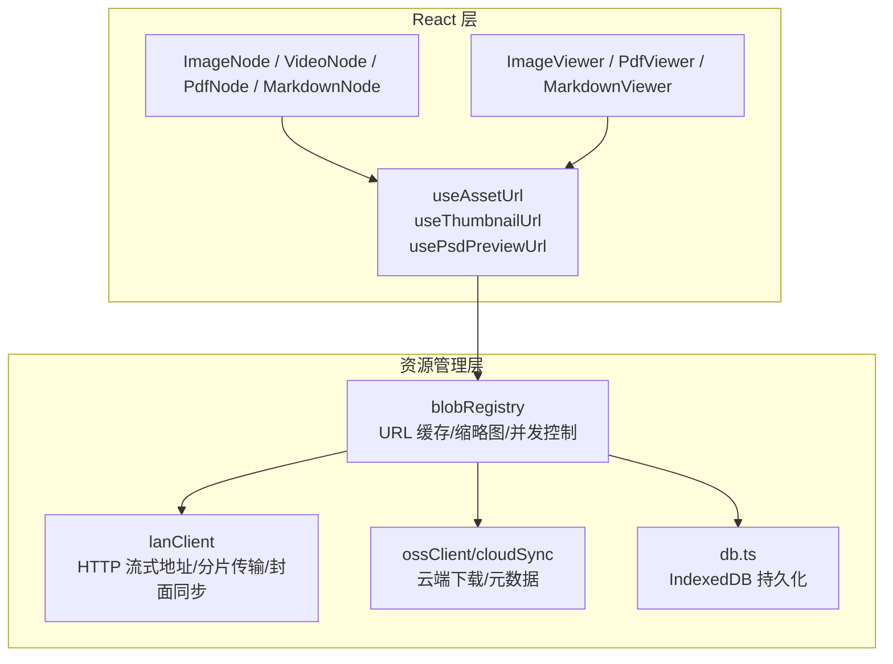
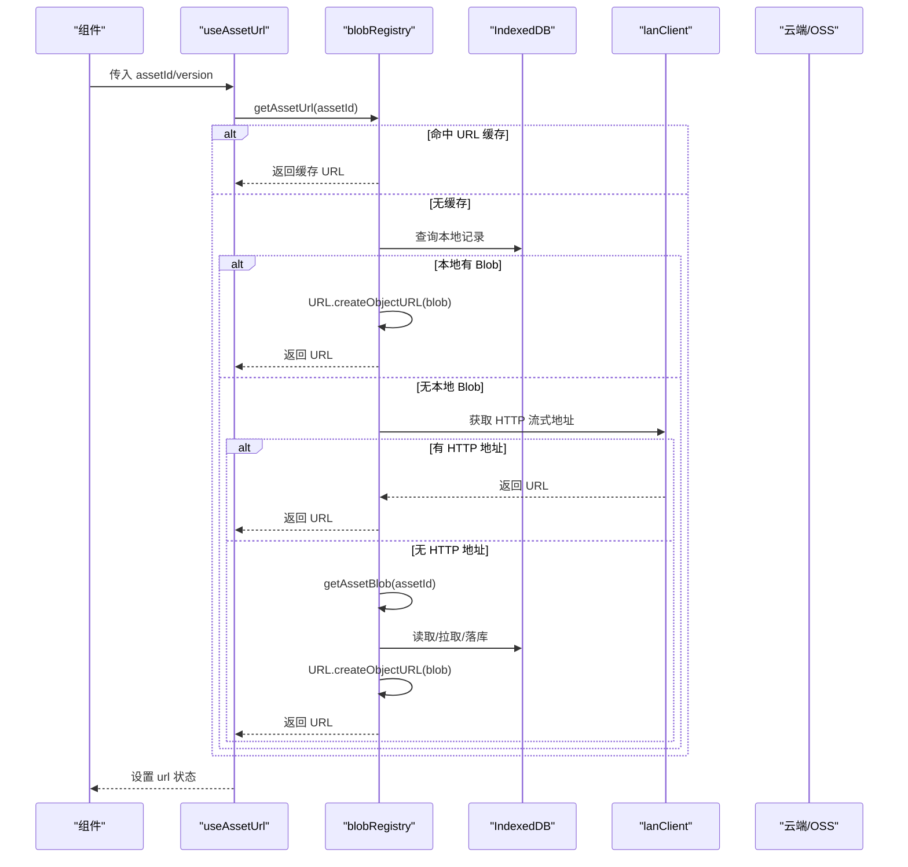
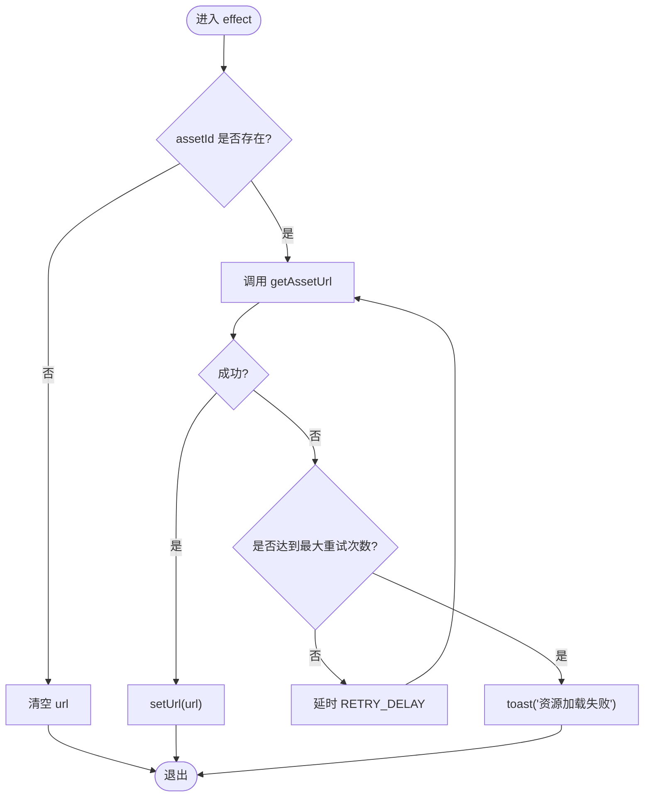
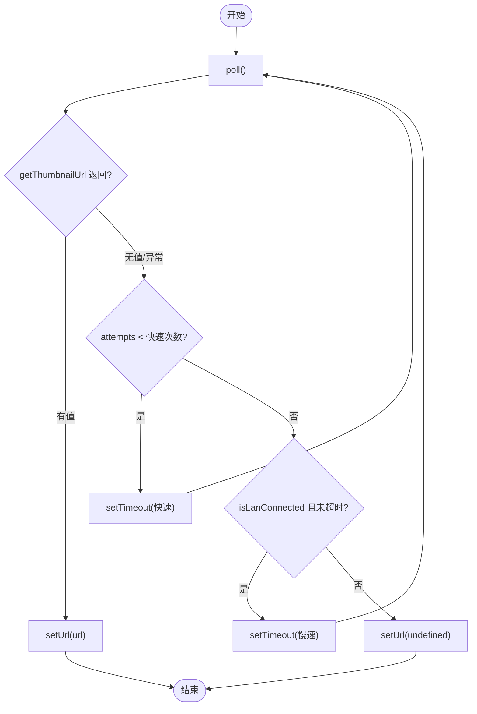
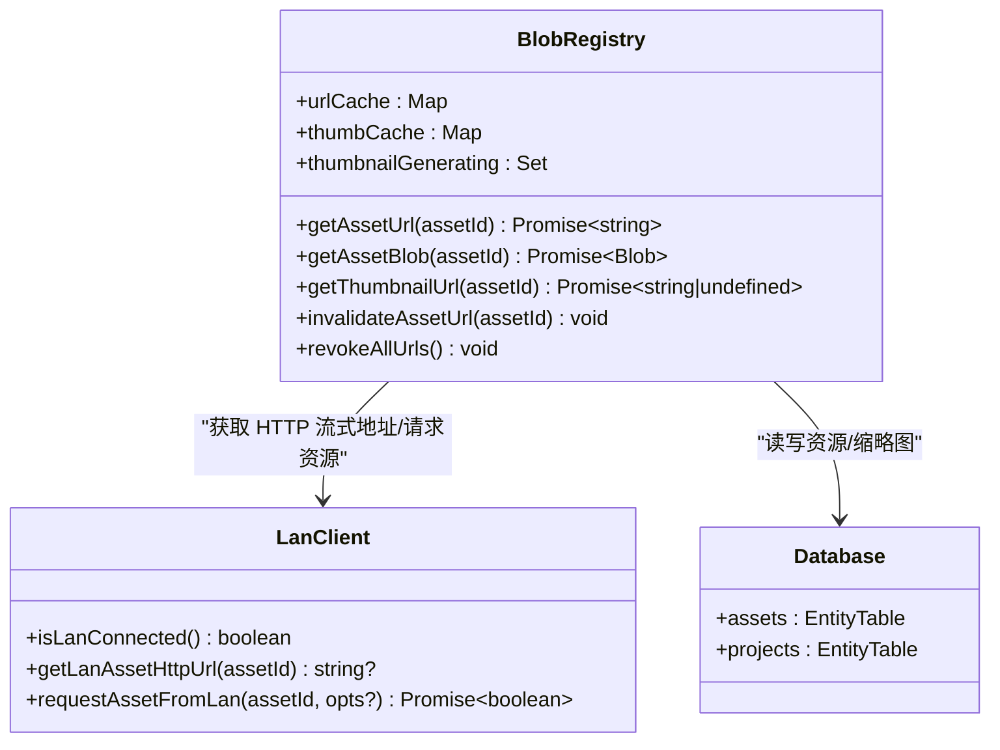
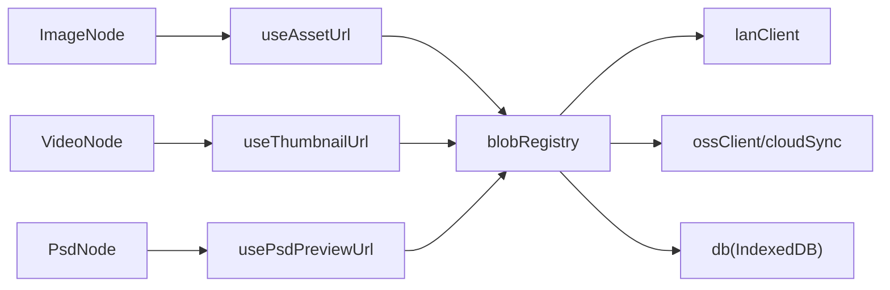

# 资源 URL 管理

<cite>
**本文引用的文件**
- [useAssetUrl.ts](file://src/media/useAssetUrl.ts)
- [blobRegistry.ts](file://src/media/blobRegistry.ts)
- [lanClient.ts](file://src/sync/lanClient.ts)
- [db.ts](file://src/db/db.ts)
- [fileLoader.ts](file://src/io/fileLoader.ts)
- [fileKind.ts](file://src/media/fileKind.ts)
- [ImageNode.tsx](file://src/canvas/nodes/ImageNode.tsx)
- [VideoNode.tsx](file://src/canvas/nodes/VideoNode.tsx)
- [PsdNode.tsx](file://src/canvas/nodes/PsdNode.tsx)
- [MarkdownNode.tsx](file://src/canvas/nodes/MarkdownNode.tsx)
- [ImageViewerModal.tsx](file://src/components/ImageViewerModal.tsx)
- [PdfViewerModal.tsx](file://src/components/PdfViewerModal.tsx)
- [MarkdownViewerModal.tsx](file://src/components/MarkdownViewerModal.tsx)
</cite>

## 目录
1. [简介](#简介)
2. [项目结构](#项目结构)
3. [核心组件](#核心组件)
4. [架构总览](#架构总览)
5. [详细组件分析](#详细组件分析)
6. [依赖关系分析](#依赖关系分析)
7. [性能考量](#性能考量)
8. [故障排查指南](#故障排查指南)
9. [结论](#结论)
10. [附录：API 参考与使用示例](#附录api-参考与使用示例)

## 简介
本技术文档围绕“资源 URL 管理”展开，重点解析 useAssetUrl 自定义 Hook 的设计模式、React 集成方式、依赖追踪、缓存策略与重新渲染优化；并深入说明资源定位与 URL 生成算法（本地资源、远程资源、动态资源），以及资源加载的状态管理与错误处理（进度、重试、降级）。最后提供性能优化建议、最佳实践与完整 API 参考和使用示例。

## 项目结构
资源 URL 管理由以下模块协作完成：
- React Hook 层：封装资源 URL 的获取、重试、轮询与状态管理
- 资源注册表：负责 URL 缓存、缩略图生成、并发控制、失效清理
- 局域网/云端同步：提供 HTTP 流式地址、分片传输、封面同步、OSS 拉取
- 持久化存储：IndexedDB 保存资源 Blob 与缩略图
- 节点与页面组件：消费 Hook 以渲染图片、视频、PSD、PDF、Markdown 等资源

图表来源
- [useAssetUrl.ts:10-156](file://src/media/useAssetUrl.ts#L10-L156)
- [blobRegistry.ts:12-56](file://src/media/blobRegistry.ts#L12-L56)
- [lanClient.ts:154-181](file://src/sync/lanClient.ts#L154-L181)
- [db.ts:25-33](file://src/db/db.ts#L25-L33)

章节来源
- [useAssetUrl.ts:10-156](file://src/media/useAssetUrl.ts#L10-L156)
- [blobRegistry.ts:12-56](file://src/media/blobRegistry.ts#L12-L56)
- [lanClient.ts:154-181](file://src/sync/lanClient.ts#L154-L181)
- [db.ts:25-33](file://src/db/db.ts#L25-L33)

## 核心组件
- useAssetUrl：为给定 assetId 返回可播放/可下载的 URL，支持失败重试与版本驱动刷新
- useThumbnailUrl：为视频等媒体生成或获取封面缩略图 URL，具备快速/慢速轮询与局域网等待策略
- useAssetSourceUrl：通用资源 URL 获取器，可按 source 选择源（asset/thumbnail）
- usePsdPreviewUrl：针对 PSD 资源的预览 URL，必要时触发在线预览生成
- blobRegistry：集中管理 URL 缓存、缩略图生成、并发限制、失效与回收
- lanClient：提供 HTTP 流式地址、分片传输、封面同步、连接状态判断
- db：IndexedDB 持久化资源与项目数据，支持垃圾回收

章节来源
- [useAssetUrl.ts:10-156](file://src/media/useAssetUrl.ts#L10-L156)
- [blobRegistry.ts:84-126](file://src/media/blobRegistry.ts#L84-L126)
- [lanClient.ts:200-202](file://src/sync/lanClient.ts#L200-L202)
- [db.ts:5-14](file://src/db/db.ts#L5-L14)

## 架构总览
资源 URL 的生成遵循“就近优先、按需拉取、缓存复用、容错降级”的原则：
- 优先使用本地 IndexedDB 中的 Blob 生成 object URL
- 若存在局域网 HTTP Range 流式地址，直接返回该地址用于边下边播
- 否则从云端/局域网拉取资源到本地后再生成 URL
- 缩略图优先使用已同步的封面，否则对视频抓帧生成并缓存
- 所有 URL 均进入内存 Map 缓存，避免重复创建与网络请求

图表来源
- [useAssetUrl.ts:14-43](file://src/media/useAssetUrl.ts#L14-L43)
- [blobRegistry.ts:84-105](file://src/media/blobRegistry.ts#L84-L105)
- [lanClient.ts:619-627](file://src/sync/lanClient.ts#L619-L627)
- [db.ts:25-33](file://src/db/db.ts#L25-L33)

## 详细组件分析

### useAssetUrl：资源 URL 获取与重试
- 设计要点
  - 依赖追踪：effect 依赖 assetId 与 version，任一变化即重新加载
  - 重试机制：最多尝试 N 次，间隔固定延迟，避免瞬时失败导致不可用
  - 生命周期安全：组件卸载时通过 alive 标志取消后续 setState
  - 错误反馈：失败时通过 toast 提示用户
- 适用场景
  - 图片、音频、PDF、文本、文件卡片等需要原始资源 URL 的场景

图表来源
- [useAssetUrl.ts:14-43](file://src/media/useAssetUrl.ts#L14-L43)

章节来源
- [useAssetUrl.ts:10-43](file://src/media/useAssetUrl.ts#L10-L43)

### useThumbnailUrl：视频封面轮询与局域网等待
- 设计要点
  - 快速轮询：前若干次短间隔轮询，尽快拿到封面
  - 局域网长等待：若处于局域网环境且未超时，切换为慢速轮询，最长等待一段时间
  - 失败回退：最终仍无法获取则返回 undefined，由上层展示占位
- 适用场景
  - 视频节点封面、播放器海报图

图表来源
- [useAssetUrl.ts:52-99](file://src/media/useAssetUrl.ts#L52-L99)
- [lanClient.ts:200-202](file://src/sync/lanClient.ts#L200-L202)

章节来源
- [useAssetUrl.ts:46-99](file://src/media/useAssetUrl.ts#L46-L99)

### usePsdPreviewUrl：PSD 预览生成与回退
- 设计要点
  - 先尝试获取已有封面，若无则触发在线预览生成
  - 捕获异常并给出友好提示
- 适用场景
  - PSD 节点预览、大图查看器中显示 PSD 预览

章节来源
- [useAssetUrl.ts:129-156](file://src/media/useAssetUrl.ts#L129-L156)

### blobRegistry：URL 缓存、缩略图生成与并发控制
- URL 缓存
  - 使用 Map 缓存 asset 与 thumbnail 的 URL，避免重复 createObjectURL
  - 提供失效接口，按 assetId 或全部清理，释放内存
- 缩略图生成
  - 视频封面抓取：通过 video + canvas 抓帧，黑帧检测与自动 seek 重试
  - 并发控制：限制同时抓帧数量，防止浏览器连接池被占满
  - 兜底策略：跨源/代理失败时一次性拉取全量素材再抓帧
- 资源获取
  - 优先本地 Blob，其次 HTTP 流式地址，最后拉取到本地
  - 局域网分片传输空闲超时与断点续传
- 云端同步
  - 从云端拉取资源与缩略图，写入 IndexedDB

图表来源
- [blobRegistry.ts:12-56](file://src/media/blobRegistry.ts#L12-L56)
- [blobRegistry.ts:84-126](file://src/media/blobRegistry.ts#L84-L126)
- [blobRegistry.ts:310-379](file://src/media/blobRegistry.ts#L310-L379)
- [lanClient.ts:154-181](file://src/sync/lanClient.ts#L154-L181)
- [db.ts:25-33](file://src/db/db.ts#L25-L33)

章节来源
- [blobRegistry.ts:12-56](file://src/media/blobRegistry.ts#L12-L56)
- [blobRegistry.ts:84-126](file://src/media/blobRegistry.ts#L84-L126)
- [blobRegistry.ts:128-268](file://src/media/blobRegistry.ts#L128-L268)
- [blobRegistry.ts:310-379](file://src/media/blobRegistry.ts#L310-L379)

### 资源定位与 URL 生成算法
- 本地资源
  - 从 IndexedDB 读取 Blob，createObjectURL 并缓存
- 远程资源（局域网/云端）
  - 局域网：优先使用 HTTP Range 流式地址（边下边播），否则走分片传输
  - 云端：配置了 OSS 时从云端下载并落库，再转为 URL
- 动态资源
  - 缩略图：根据资源类型与可用源决定是否需要抓帧生成
  - 版本驱动：useAssetUrl 支持 version 参数，变化时强制重新加载

章节来源
- [blobRegistry.ts:84-126](file://src/media/blobRegistry.ts#L84-L126)
- [blobRegistry.ts:310-379](file://src/media/blobRegistry.ts#L310-L379)
- [useAssetUrl.ts:14-43](file://src/media/useAssetUrl.ts#L14-L43)

### 资源加载状态管理与错误处理
- 加载状态
  - 通过 useState 管理 url，结合组件内占位与淡入动画提升体验
- 失败重试
  - useAssetUrl：固定次数与间隔重试
  - useThumbnailUrl：快速/慢速轮询，局域网环境下延长等待
- 降级策略
  - 缩略图抓帧失败时，尝试一次性拉取全量资源再抓帧
  - 文本/文件类资源失败时，toast 提示用户

章节来源
- [useAssetUrl.ts:14-43](file://src/media/useAssetUrl.ts#L14-L43)
- [useAssetUrl.ts:52-99](file://src/media/useAssetUrl.ts#L52-L99)
- [blobRegistry.ts:310-379](file://src/media/blobRegistry.ts#L310-L379)

## 依赖关系分析
- 组件依赖 Hook：ImageNode、VideoNode、PsdNode、MarkdownNode 等通过 useAssetUrl/useThumbnailUrl/usePsdPreviewUrl 获取 URL
- Hook 依赖 Registry：统一通过 blobRegistry 进行 URL 获取与缓存
- Registry 依赖 LAN/OSS/DB：根据可用性与优先级选择数据源
- 局域网状态影响行为：isLanConnected 决定是否延长等待与使用 HTTP 流式地址

图表来源
- [ImageNode.tsx:15-16](file://src/canvas/nodes/ImageNode.tsx#L15-L16)
- [VideoNode.tsx:18-19](file://src/canvas/nodes/VideoNode.tsx#L18-L19)
- [PsdNode.tsx:16-17](file://src/canvas/nodes/PsdNode.tsx#L16-L17)
- [useAssetUrl.ts:10-156](file://src/media/useAssetUrl.ts#L10-L156)
- [blobRegistry.ts:84-126](file://src/media/blobRegistry.ts#L84-L126)

章节来源
- [ImageNode.tsx:15-16](file://src/canvas/nodes/ImageNode.tsx#L15-L16)
- [VideoNode.tsx:18-19](file://src/canvas/nodes/VideoNode.tsx#L18-L19)
- [PsdNode.tsx:16-17](file://src/canvas/nodes/PsdNode.tsx#L16-L17)
- [useAssetUrl.ts:10-156](file://src/media/useAssetUrl.ts#L10-L156)
- [blobRegistry.ts:84-126](file://src/media/blobRegistry.ts#L84-L126)

## 性能考量
- 缓存策略
  - URL 级缓存：避免重复 createObjectURL 与网络请求
  - 缩略图缓存：减少重复抓帧与解码开销
  - 失效机制：在资源更新或会话结束时释放内存
- 并发控制
  - 缩略图抓帧并发上限，防止阻塞播放器与占用连接池
- 懒加载与按需拉取
  - 视频节点仅展示封面，完整资源在打开播放器时再拉取
  - 局域网 HTTP 流式地址用于边下边播，降低内存压力
- 重试与轮询优化
  - 快速失败与慢速等待结合，兼顾响应与可靠性
- 内存管理
  - 及时 revokeObjectURL，避免内存泄漏
  - 大文件优先流式而非整份下载

[本节为通用性能指导，不直接分析具体文件]

## 故障排查指南
- 常见问题
  - 资源加载失败：检查局域网连接状态、云端配置、IndexedDB 权限
  - 视频封面始终为空：确认抓帧逻辑是否被跨源限制拦截，检查服务器 CORS 配置
  - 大文件卡顿：优先使用 HTTP 流式地址，避免整份下载到本地
- 调试建议
  - 观察 isLanConnected 返回值与 httpAssetUrls 映射
  - 检查 URL 缓存是否命中，必要时调用失效接口
  - 关注 toast 提示与控制台警告信息

章节来源
- [lanClient.ts:200-202](file://src/sync/lanClient.ts#L200-L202)
- [blobRegistry.ts:310-379](file://src/media/blobRegistry.ts#L310-L379)
- [useAssetUrl.ts:14-43](file://src/media/useAssetUrl.ts#L14-L43)

## 结论
useAssetUrl 及其配套能力构成了一个健壮的资源 URL 管理系统：通过分层缓存、智能重试、并发控制与多源融合（本地/局域网/云端），在保证用户体验的同时最大化性能与稳定性。结合组件层的懒加载与占位策略，实现了在大文件与弱网环境下的良好表现。

[本节为总结性内容，不直接分析具体文件]

## 附录：API 参考与使用示例

### API 参考
- useAssetUrl(assetId?, version?)
  - 作用：获取资源 URL，支持版本驱动刷新与失败重试
  - 返回：string | undefined
  - 依赖：assetId、version
  - 错误处理：失败时 toast 提示
  - 参考路径
    - [useAssetUrl.ts:10-43](file://src/media/useAssetUrl.ts#L10-L43)

- useThumbnailUrl(assetId?)
  - 作用：获取视频封面缩略图 URL，具备快速/慢速轮询与局域网等待
  - 返回：string | undefined
  - 依赖：assetId
  - 错误处理：长时间无法获取则返回 undefined
  - 参考路径
    - [useAssetUrl.ts:52-99](file://src/media/useAssetUrl.ts#L52-L99)

- useAssetSourceUrl(assetId?, source='asset' | 'thumbnail')
  - 作用：通用资源 URL 获取器，可按 source 选择源
  - 返回：string | undefined
  - 依赖：assetId、source
  - 错误处理：失败时 toast 提示
  - 参考路径
    - [useAssetUrl.ts:101-127](file://src/media/useAssetUrl.ts#L101-L127)

- usePsdPreviewUrl(assetId?)
  - 作用：获取 PSD 预览 URL，必要时触发在线预览生成
  - 返回：string | undefined
  - 依赖：assetId
  - 错误处理：捕获异常并 toast 提示
  - 参考路径
    - [useAssetUrl.ts:129-156](file://src/media/useAssetUrl.ts#L129-L156)

- blobRegistry 导出函数
  - getAssetUrl(assetId): Promise<string>
  - getAssetBlob(assetId): Promise<Blob>
  - getThumbnailUrl(assetId): Promise<string | undefined>
  - invalidateAssetUrl(assetId): void
  - invalidateThumbnailUrl(assetId): void
  - invalidateAllAssetUrls(assetId): void
  - revokeAllUrls(): void
  - 参考路径
    - [blobRegistry.ts:41-56](file://src/media/blobRegistry.ts#L41-L56)
    - [blobRegistry.ts:84-126](file://src/media/blobRegistry.ts#L84-L126)
    - [blobRegistry.ts:310-379](file://src/media/blobRegistry.ts#L310-L379)
    - [blobRegistry.ts:381-389](file://src/media/blobRegistry.ts#L381-L389)

### 使用示例（组件侧）
- 图片节点
  - 使用 useAssetUrl 获取图片 URL，加载完成后自适应尺寸
  - 参考路径
    - [ImageNode.tsx:15-16](file://src/canvas/nodes/ImageNode.tsx#L15-L16)
    - [ImageNode.tsx:39-56](file://src/canvas/nodes/ImageNode.tsx#L39-L56)

- 视频节点
  - 使用 useThumbnailUrl 获取封面，点击打开播放器
  - 参考路径
    - [VideoNode.tsx:18-19](file://src/canvas/nodes/VideoNode.tsx#L18-L19)
    - [VideoNode.tsx:25-28](file://src/canvas/nodes/VideoNode.tsx#L25-L28)

- PSD 节点
  - 使用 usePsdPreviewUrl 获取预览，useAssetUrl 获取原文件
  - 参考路径
    - [PsdNode.tsx:16-17](file://src/canvas/nodes/PsdNode.tsx#L16-L17)

- Markdown 节点
  - 使用 useAssetUrl 获取文本内容 URL，支持版本刷新
  - 参考路径
    - [MarkdownNode.tsx:13](file://src/canvas/nodes/MarkdownNode.tsx#L13)

- 查看器组件
  - ImageViewer/PdfViewer/MarkdownViewer 使用对应 Hook 获取 URL
  - 参考路径
    - [ImageViewerModal.tsx:18-20](file://src/components/ImageViewerModal.tsx#L18-L20)
    - [PdfViewerModal.tsx:10](file://src/components/PdfViewerModal.tsx#L10)
    - [MarkdownViewerModal.tsx:16](file://src/components/MarkdownViewerModal.tsx#L16)

章节来源
- [useAssetUrl.ts:10-156](file://src/media/useAssetUrl.ts#L10-L156)
- [blobRegistry.ts:41-56](file://src/media/blobRegistry.ts#L41-L56)
- [blobRegistry.ts:84-126](file://src/media/blobRegistry.ts#L84-L126)
- [blobRegistry.ts:310-379](file://src/media/blobRegistry.ts#L310-L379)
- [blobRegistry.ts:381-389](file://src/media/blobRegistry.ts#L381-L389)
- [ImageNode.tsx:15-16](file://src/canvas/nodes/ImageNode.tsx#L15-L16)
- [VideoNode.tsx:18-19](file://src/canvas/nodes/VideoNode.tsx#L18-L19)
- [PsdNode.tsx:16-17](file://src/canvas/nodes/PsdNode.tsx#L16-L17)
- [MarkdownNode.tsx:13](file://src/canvas/nodes/MarkdownNode.tsx#L13)
- [ImageViewerModal.tsx:18-20](file://src/components/ImageViewerModal.tsx#L18-L20)
- [PdfViewerModal.tsx:10](file://src/components/PdfViewerModal.tsx#L10)
- [MarkdownViewerModal.tsx:16](file://src/components/MarkdownViewerModal.tsx#L16)