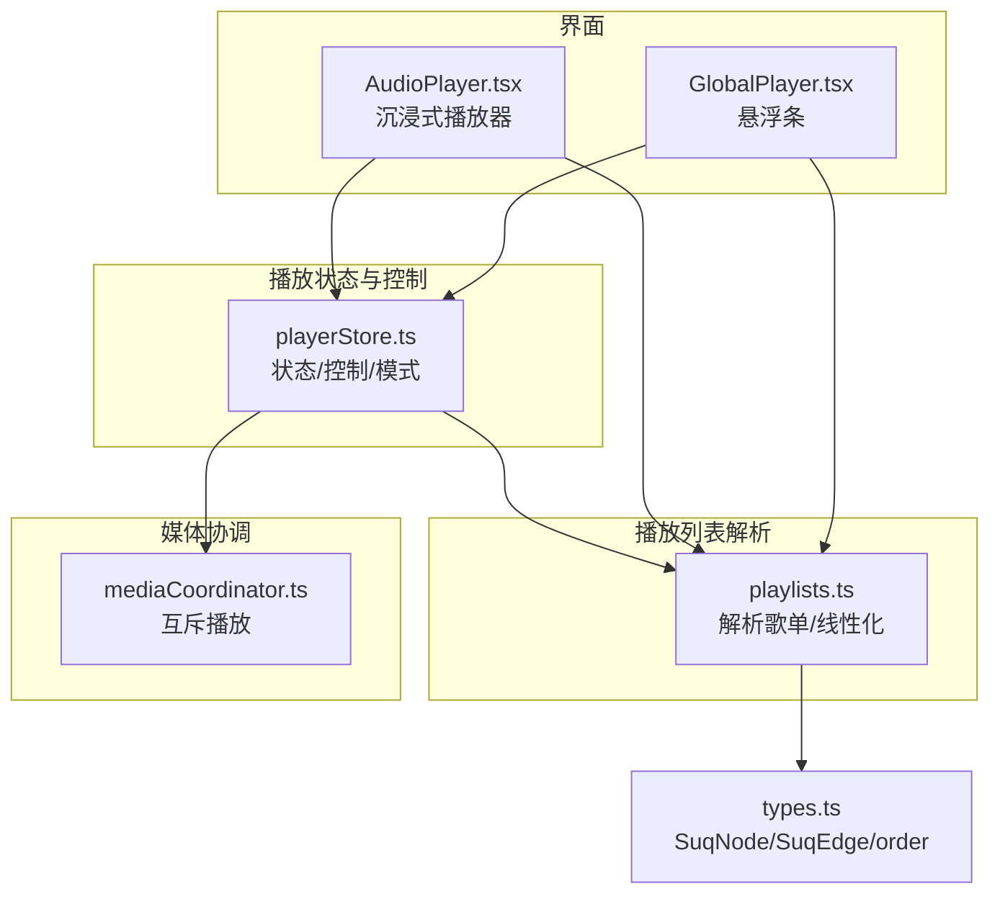
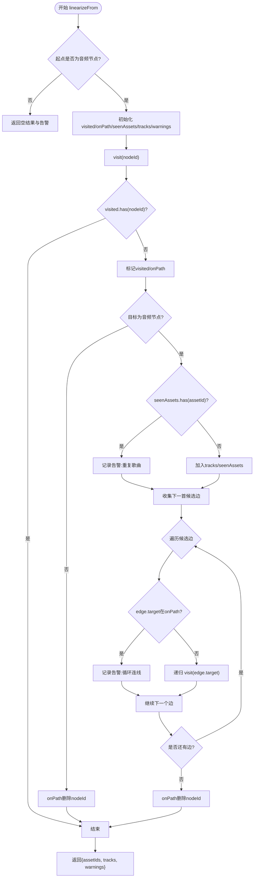
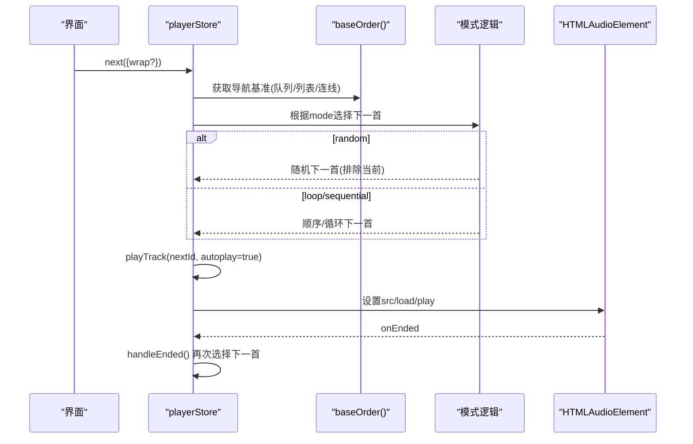
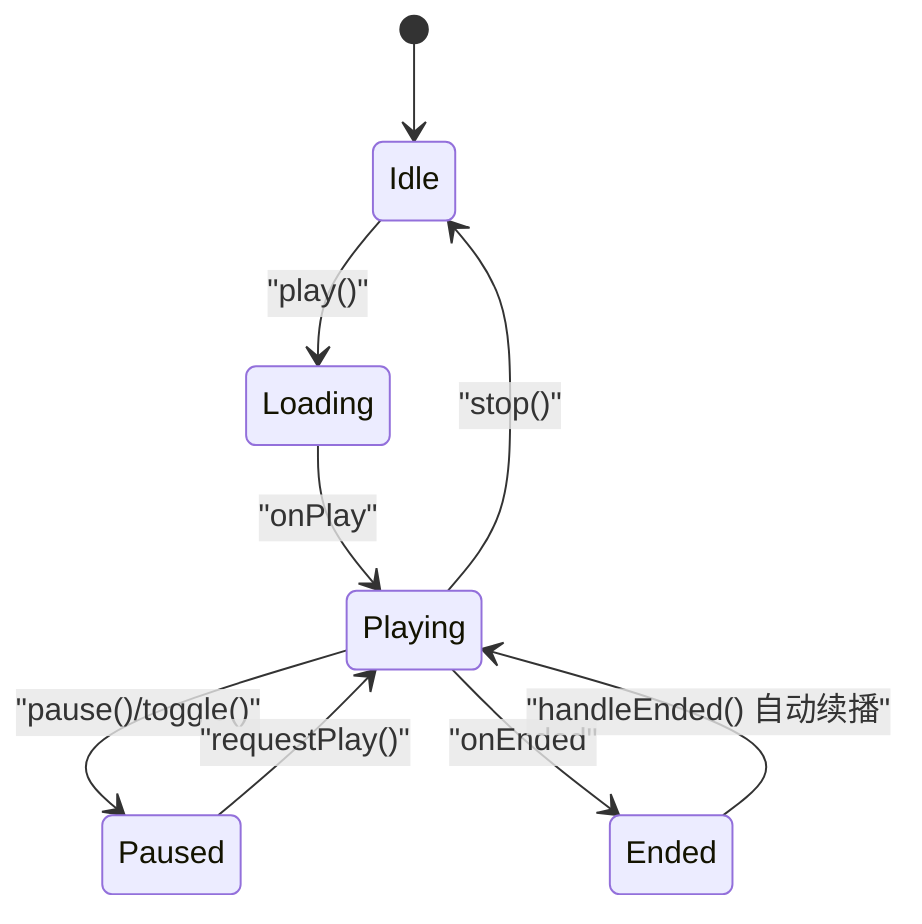
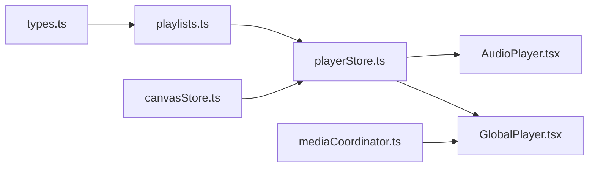

# 播放列表管理

<cite>
**本文引用的文件**
- [src/media/playlists.ts](file://src/media/playlists.ts)
- [src/store/playerStore.ts](file://src/store/playerStore.ts)
- [src/components/AudioPlayer.tsx](file://src/components/AudioPlayer.tsx)
- [src/components/GlobalPlayer.tsx](file://src/components/GlobalPlayer.tsx)
- [src/media/mediaCoordinator.ts](file://src/media/mediaCoordinator.ts)
- [src/types.ts](file://src/types.ts)
- [src/media/playlists.test.ts](file://src/media/playlists.test.ts)
</cite>

## 目录
1. [简介](#简介)
2. [项目结构](#项目结构)
3. [核心组件](#核心组件)
4. [架构总览](#架构总览)
5. [详细组件分析](#详细组件分析)
6. [依赖关系分析](#依赖关系分析)
7. [性能考虑](#性能考虑)
8. [故障排查指南](#故障排查指南)
9. [结论](#结论)
10. [附录：API 参考与使用示例](#附录api-参考与使用示例)

## 简介
本系统实现了一个基于画布连线的“播放列表管理系统”。其核心思想是：播放列表并非独立的数据模型，而是由画布中的节点与边派生而来。通过深度优先先序遍历音频节点之间的连线，得到稳定的播放顺序；同时提供播放控制（播放、暂停、下一首、上一首）、多种播放模式（顺序、随机、列表循环、单曲循环、流式），以及进度同步、事件通知、持久化恢复等能力。播放器以全局单一 HTMLAudioElement 为引擎，所有视图（画布节点、悬浮窗、沉浸式播放器）共享同一状态。

## 项目结构
- 播放列表解析与缓存：位于 media/playlists.ts，负责从画布图结构中解析命名歌单、线性化播放顺序、去重与环检测。
- 播放状态与控制：位于 store/playerStore.ts，维护当前曲目、播放模式、队列、时间、音量等，并实现 next/prev/seek/toggle 等逻辑。
- 播放界面与交互：位于 components/AudioPlayer.tsx 与 components/GlobalPlayer.tsx，分别提供沉浸式播放器与常驻悬浮条，统一调用 playerStore。
- 媒体互斥协调：位于 media/mediaCoordinator.ts，确保同一时刻仅一个音频或视频在播放。
- 类型定义：位于 types.ts，定义 SuqNode/SuqEdge 及边排序字段 order。



图表来源
- [src/media/playlists.ts:1-179](file://src/media/playlists.ts#L1-L179)
- [src/store/playerStore.ts:1-298](file://src/store/playerStore.ts#L1-L298)
- [src/components/AudioPlayer.tsx:1-800](file://src/components/AudioPlayer.tsx#L1-L800)
- [src/components/GlobalPlayer.tsx:1-234](file://src/components/GlobalPlayer.tsx#L1-L234)
- [src/media/mediaCoordinator.ts:1-25](file://src/media/mediaCoordinator.ts#L1-L25)
- [src/types.ts:1-112](file://src/types.ts#L1-L112)

章节来源
- [src/media/playlists.ts:1-179](file://src/media/playlists.ts#L1-L179)
- [src/store/playerStore.ts:1-298](file://src/store/playerStore.ts#L1-L298)
- [src/components/AudioPlayer.tsx:1-800](file://src/components/AudioPlayer.tsx#L1-L800)
- [src/components/GlobalPlayer.tsx:1-234](file://src/components/GlobalPlayer.tsx#L1-L234)
- [src/media/mediaCoordinator.ts:1-25](file://src/media/mediaCoordinator.ts#L1-L25)
- [src/types.ts:1-112](file://src/types.ts#L1-L112)

## 核心组件
- 播放列表解析器（playlists.ts）
  - 将画布的文本节点与音频节点及其边解析为“歌单”，并以 DFS 先序线性化为 tracks/assetIds。
  - 支持按边的 order 排序、去重、环检测与告警。
- 播放器状态机（playerStore.ts）
  - 维护 track、playing、time、duration、volume、muted、mode、queue 等状态。
  - 实现 play、toggle、next、prev、seekTo、seekBy、setMode、setQueue、stop 等方法。
  - 根据 mode 决定下一首选择策略（顺序/随机/循环/单曲/流式）。
- 界面组件（AudioPlayer.tsx、GlobalPlayer.tsx）
  - 沉浸式播放器：展示歌词、专辑图、搜索、排序、模式切换、队列面板等。
  - 悬浮条：最小化控制栏，显示当前曲目、进度、快进快退、打开播放器入口。
- 媒体协调器（mediaCoordinator.ts）
  - 注册/注销媒体元素，保证同类型媒体互斥播放。

章节来源
- [src/media/playlists.ts:1-179](file://src/media/playlists.ts#L1-L179)
- [src/store/playerStore.ts:1-298](file://src/store/playerStore.ts#L1-L298)
- [src/components/AudioPlayer.tsx:1-800](file://src/components/AudioPlayer.tsx#L1-L800)
- [src/components/GlobalPlayer.tsx:1-234](file://src/components/GlobalPlayer.tsx#L1-L234)
- [src/media/mediaCoordinator.ts:1-25](file://src/media/mediaCoordinator.ts#L1-L25)

## 架构总览
播放列表由画布图结构派生，播放器状态集中管理，界面组件作为控制器与视图。播放结束事件触发自动续播，模式与队列共同决定导航基准。

```mermaid
sequenceDiagram
participant UI as "界面组件"
participant Store as "播放器状态(playerStore)"
participant PL as "播放列表解析(playlists)"
participant Audio as "HTMLAudioElement"
participant Coord as "媒体协调器(mediaCoordinator)"
UI->>Store : play({assetId, nodeId}, {autoplay})
Store->>Store : 获取URL/设置track/time/duration
Store->>Audio : src=URL; load(); play()
Note over Store,Audio : 若资源未就绪则监听canplay/loadeddata重试
Audio-->>Store : onTimeUpdate/onLoadedMetadata/onEnded
Store->>Store : 更新time/duration/playing
Store->>PL : baseOrder() 计算导航基准(队列/列表/连线)
Store->>Store : 根据mode选择下一首(next/prev/random/single)
Store->>Audio : 切歌/重播/停止
Coord->>Coord : 同类型媒体互斥(其他暂停)
```

图表来源
- [src/store/playerStore.ts:72-161](file://src/store/playerStore.ts#L72-L161)
- [src/store/playerStore.ts:174-297](file://src/store/playerStore.ts#L174-L297)
- [src/media/playlists.ts:71-112](file://src/media/playlists.ts#L71-L112)
- [src/media/mediaCoordinator.ts:1-25](file://src/media/mediaCoordinator.ts#L1-L25)

## 详细组件分析

### 播放列表数据结构与算法
- 数据结构
  - PlaylistTrack：包含 nodeId、assetId、name。
  - Playlist：包含 id、name、named、titleNodeId、rootNodeId、tracks、warnings。
  - LinearizeResult：包含 assetIds、tracks、warnings。
- 线性化算法
  - 从起点音频节点出发，沿“音频→音频”的出边进行 DFS 先序遍历。
  - 分叉处按边的 order 升序排序，未设置 order 的排在后面，再按创建顺序稳定排序。
  - 环/重复节点只遍历一次，同一 assetId 在歌单中只保留第一次出现，其余跳过并告警。
  - 非音频节点路径不穿透。
- 歌单解析
  - 扫描整张画布，识别“命名文本节点”（无入边、恰好一条出边指向音频节点）作为歌单名，指向的首节点为根。
  - 多个命名文本指向同一首节点时，取第一个名字，其余忽略并告警。
- 缓存机制
  - 对 resolvePlaylists 的结果按 nodes/edges 引用进行缓存，避免重复解析。



图表来源
- [src/media/playlists.ts:71-112](file://src/media/playlists.ts#L71-L112)

章节来源
- [src/media/playlists.ts:19-44](file://src/media/playlists.ts#L19-L44)
- [src/media/playlists.ts:56-112](file://src/media/playlists.ts#L56-L112)
- [src/media/playlists.ts:114-179](file://src/media/playlists.ts#L114-L179)
- [src/media/playlists.test.ts:39-126](file://src/media/playlists.test.ts#L39-L126)
- [src/media/playlists.test.ts:141-219](file://src/media/playlists.test.ts#L141-L219)

### 播放控制逻辑与模式切换
- 播放模式
  - sequential：顺序播放，到末尾停止。
  - loop：列表循环，到末尾回到第一首。
  - single：单曲循环，结束后从头重播。
  - random：随机播放，排除当前曲。
  - flow：流式播放，依据画布连线顺序（或队列）导航。
- 导航基准
  - 优先级：队列（flow 模式下）→ 播放器列表（打开播放器时注册的有序列表）→ 画布连线顺序（从当前曲所在节点解析）。
- 下一首/上一首
  - next：根据 mode 选择下一首；random 时随机选取；loop 时末尾回绕；sequential 时末尾停止。
  - prev：返回列表中前一首，越界时回到最后一首。
- 自动续播
  - onEnded 触发 handleEnded：single 模式重播；否则按 baseOrder 与 mode 选择下一首并自动播放。
- 竞态处理
  - 快速连续 play() 时使用序列号令牌，确保只应用最后一次请求。



图表来源
- [src/store/playerStore.ts:97-161](file://src/store/playerStore.ts#L97-L161)
- [src/store/playerStore.ts:237-297](file://src/store/playerStore.ts#L237-L297)

章节来源
- [src/store/playerStore.ts:9-50](file://src/store/playerStore.ts#L9-L50)
- [src/store/playerStore.ts:97-161](file://src/store/playerStore.ts#L97-L161)
- [src/store/playerStore.ts:174-297](file://src/store/playerStore.ts#L174-L297)

### 播放状态同步机制
- 进度跟踪
  - GlobalPlayer 的 <audio> 元素触发 onTimeUpdate 时更新 time；onLoadedMetadata/onDurationChange 更新 duration。
  - seekTo/seekBy 直接操作 currentTime 并同步 store 的 time。
- 事件通知
  - onEnded 调用 notifyEngineEnded，进入自动续播流程。
  - onPlay/onPause 更新 playing 状态。
- 媒体互斥
  - 通过 mediaCoordinator 注册 audio 元素，任意媒体播放时暂停同类型其他元素。



图表来源
- [src/components/GlobalPlayer.tsx:160-179](file://src/components/GlobalPlayer.tsx#L160-L179)
- [src/store/playerStore.ts:72-161](file://src/store/playerStore.ts#L72-L161)
- [src/media/mediaCoordinator.ts:1-25](file://src/media/mediaCoordinator.ts#L1-L25)

章节来源
- [src/components/GlobalPlayer.tsx:160-179](file://src/components/GlobalPlayer.tsx#L160-L179)
- [src/store/playerStore.ts:72-161](file://src/store/playerStore.ts#L72-L161)
- [src/media/mediaCoordinator.ts:1-25](file://src/media/mediaCoordinator.ts#L1-L25)

### 播放列表的持久化存储与状态恢复
- 本地偏好
  - 歌词偏移、歌词文字模式、喜欢列表等通过 localStorage 持久化。
- 项目数据
  - 画布节点与边（含歌单的命名文本与连线）随项目保存，播放列表由此派生，天然具备项目级持久化。
- 状态恢复
  - 播放器打开时根据 initialFlow 设置初始模式；队列可从画布歌单入口设置；当前曲目可恢复。
- 注意
  - 播放器状态本身不跨会话持久化（如 time、playing），但可通过项目数据与界面行为恢复体验。

章节来源
- [src/components/AudioPlayer.tsx:38-98](file://src/components/AudioPlayer.tsx#L38-L98)
- [src/components/AudioPlayer.tsx:241-271](file://src/components/AudioPlayer.tsx#L241-L271)

### 与音频播放器的集成方式
- 全局唯一 <audio> 元素
  - GlobalPlayer 挂载并绑定到 playerStore，所有视图共用该元素。
- 资源加载
  - 通过 getAssetUrl 获取 URL，异步加载后设置 src/load/play。
- 可视化与频谱
  - 结合 AudioBackground 与 SpectrumBars 提供视觉反馈。
- 画中画与悬浮窗
  - 支持最小化悬浮窗与画中画，暴露窗口控制接口。

章节来源
- [src/components/GlobalPlayer.tsx:1-234](file://src/components/GlobalPlayer.tsx#L1-L234)
- [src/components/AudioPlayer.tsx:1-800](file://src/components/AudioPlayer.tsx#L1-L800)

## 依赖关系分析
- playlists.ts 依赖 types.ts 的 SuqNode/SuqEdge/order。
- playerStore.ts 依赖 playlists.ts 的 linearizeFrom 与 canvasStore 的 nodes/edges。
- AudioPlayer.tsx 依赖 playlists.ts 的 resolvePlaylistsCached/findPlaylistByAsset 与 playerStore.ts 的状态与方法。
- GlobalPlayer.tsx 依赖 playerStore.ts 的 bindPlayerAudio/notifyEngineEnded 与 playlists.ts 的解析能力。
- mediaCoordinator.ts 被 GlobalPlayer.tsx 用于注册音频元素以实现互斥。



图表来源
- [src/types.ts:100-107](file://src/types.ts#L100-L107)
- [src/media/playlists.ts:17-179](file://src/media/playlists.ts#L17-L179)
- [src/store/playerStore.ts:1-103](file://src/store/playerStore.ts#L1-L103)
- [src/components/AudioPlayer.tsx:28-35](file://src/components/AudioPlayer.tsx#L28-L35)
- [src/components/GlobalPlayer.tsx:1-8](file://src/components/GlobalPlayer.tsx#L1-L8)
- [src/media/mediaCoordinator.ts:1-25](file://src/media/mediaCoordinator.ts#L1-L25)

章节来源
- [src/types.ts:100-107](file://src/types.ts#L100-L107)
- [src/media/playlists.ts:17-179](file://src/media/playlists.ts#L17-L179)
- [src/store/playerStore.ts:1-103](file://src/store/playerStore.ts#L1-L103)
- [src/components/AudioPlayer.tsx:28-35](file://src/components/AudioPlayer.tsx#L28-L35)
- [src/components/GlobalPlayer.tsx:1-8](file://src/components/GlobalPlayer.tsx#L1-L8)
- [src/media/mediaCoordinator.ts:1-25](file://src/media/mediaCoordinator.ts#L1-L25)

## 性能考虑
- 播放列表解析缓存
  - resolvePlaylistsCached 基于 nodes/edges 引用命中缓存，避免重复解析。
- 线性化复杂度
  - DFS 遍历 O(V+E)，其中 V 为音频节点数，E 为有效边数；去重与环检测使用 Set，常数开销小。
- 排序开销
  - 分叉处按 order 排序，未设置 order 的边保持创建顺序，整体排序成本与分支度相关。
- 播放状态更新
  - onTimeUpdate 高频触发，仅更新 time 字段，避免多余渲染。
- 资源加载竞态
  - 使用 playSeq 令牌防止快速连续 play() 导致的状态错乱。

[本节为通用性能讨论，无需具体文件引用]

## 故障排查指南
- 播放列表为空
  - 检查是否存在“命名文本节点”且恰好一条出边指向音频节点；确认边目标为音频节点。
  - 参考测试用例验证线性化与解析规则。
- 循环连线导致无法继续
  - 线性化会检测环并给出告警；检查是否有自环或多跳环。
- 重复歌曲跳过
  - 同一 assetId 只保留第一次出现；如需重复播放请使用“单曲循环”或调整连线结构。
- 播放模式不符合预期
  - 确认当前 mode；flow 模式需设置队列或存在画布连线顺序；random 会排除当前曲。
- 进度不同步
  - 检查 GlobalPlayer 的 onTimeUpdate 是否触发；确认 seekTo/seekBy 边界处理。
- 多媒体冲突
  - 媒体协调器会在播放时暂停其他同类型媒体；检查是否被意外暂停。

章节来源
- [src/media/playlists.test.ts:39-126](file://src/media/playlists.test.ts#L39-L126)
- [src/media/playlists.test.ts:141-219](file://src/media/playlists.test.ts#L141-L219)
- [src/store/playerStore.ts:72-161](file://src/store/playerStore.ts#L72-L161)
- [src/components/GlobalPlayer.tsx:160-179](file://src/components/GlobalPlayer.tsx#L160-L179)
- [src/media/mediaCoordinator.ts:1-25](file://src/media/mediaCoordinator.ts#L1-L25)

## 结论
该系统以画布连线为核心，实现了灵活、可组合的播放列表管理。通过线性化算法与播放模式，既保证了顺序一致性，又提供了丰富的交互体验。全局播放器与状态管理确保了多视图一致性与高性能。配合本地偏好与项目数据，实现了良好的持久化与恢复能力。

[本节为总结性内容，无需具体文件引用]

## 附录：API 参考与使用示例

### 播放列表 API（playlists.ts）
- 函数
  - audioNextEdges(edges, sourceNodeId, nodes): 返回某音频节点的“下一首”候选边（仅音频目标，按 order 升序与创建顺序稳定排序）。
  - linearizeFrom(nodes, edges, startNodeId): 从起点音频节点线性化为播放顺序，返回 assetIds、tracks、warnings。
  - resolvePlaylists(nodes, edges): 扫描画布解析所有命名歌单。
  - resolvePlaylistsCached(nodes, edges): 带缓存的解析。
  - findPlaylistByAsset(playlists, assetId): 查找包含某首歌的歌单。
- 数据结构
  - PlaylistTrack、Playlist、LinearizeResult。

使用示例（概念）
- 构建一个命名文本节点指向音频链，调用 resolvePlaylistsCached 获取歌单列表。
- 使用 linearizeFrom 从某个音频节点开始，得到子歌单顺序。
- 使用 findPlaylistByAsset 在当前播放曲所属歌单间跳转。

章节来源
- [src/media/playlists.ts:56-112](file://src/media/playlists.ts#L56-L112)
- [src/media/playlists.ts:114-179](file://src/media/playlists.ts#L114-L179)
- [src/media/playlists.test.ts:39-126](file://src/media/playlists.test.ts#L39-L126)
- [src/media/playlists.test.ts:141-219](file://src/media/playlists.test.ts#L141-L219)

### 播放器状态 API（playerStore.ts）
- 状态字段
  - track、playing、time、duration、volume、muted、barVisible、mode、queue。
- 方法
  - play({assetId, name?, nodeId?}, {autoplay?}): 播放指定歌曲。
  - toggle(): 播放/暂停切换。
  - seekTo(time): 跳转到指定时间。
  - seekBy(delta): 相对快进/快退。
  - next({autoplay?, wrap?}): 下一首（可选循环回绕）。
  - prev(): 上一首。
  - setVolume(value): 设置音量。
  - setMuted(muted): 静音开关。
  - setMode(mode): 设置播放模式（离开 flow 时清空队列）。
  - setQueue(queue): 设置歌单队列（flow 模式）。
  - stop(): 停止播放并重置状态。
  - setBarVisible(visible): 控制悬浮条可见性。
- 辅助
  - bindPlayerAudio(el): 绑定全局音频元素。
  - getPlayerAudioElement(): 获取当前音频元素。
  - setOrderProvider(provider): 注册歌曲列表提供者（顺序/随机/循环模式的导航基准）。
  - notifyEngineEnded(): 通知引擎结束，触发自动续播。

使用示例（概念）
- 打开播放器时注册 orderedFiles 为 orderProvider，使顺序/随机/循环模式基于该列表导航。
- 从画布歌单入口设置 queue 并切换到 flow 模式，实现按连线顺序播放。
- 用户点击下一首时调用 next({wrap: true}) 实现列表循环。

章节来源
- [src/store/playerStore.ts:9-50](file://src/store/playerStore.ts#L9-L50)
- [src/store/playerStore.ts:58-116](file://src/store/playerStore.ts#L58-L116)
- [src/store/playerStore.ts:174-297](file://src/store/playerStore.ts#L174-L297)

### 界面集成要点（AudioPlayer.tsx、GlobalPlayer.tsx）
- 沉浸式播放器
  - 打开时根据 initialFlow 设置初始模式；从歌单入口设置队列并播放。
  - 提供搜索、排序、模式切换、队列面板、歌词与专辑图等功能。
- 悬浮条
  - 显示当前曲目、进度、快进快退；支持拖拽位置与最小化；打开播放器入口。
- 媒体互斥
  - 注册音频元素，确保与其他媒体互斥。

章节来源
- [src/components/AudioPlayer.tsx:142-352](file://src/components/AudioPlayer.tsx#L142-L352)
- [src/components/GlobalPlayer.tsx:17-119](file://src/components/GlobalPlayer.tsx#L17-L119)
- [src/components/GlobalPlayer.tsx:160-234](file://src/components/GlobalPlayer.tsx#L160-L234)

### 类型与配置（types.ts）
- SuqNodeData 与 SuqEdgeData
  - 边 data.order 用于控制分叉处的播放顺序。
- 媒体种类与样式
  - MediaKind、EdgeStyle 等用于描述节点与边的属性。

章节来源
- [src/types.ts:66-107](file://src/types.ts#L66-L107)