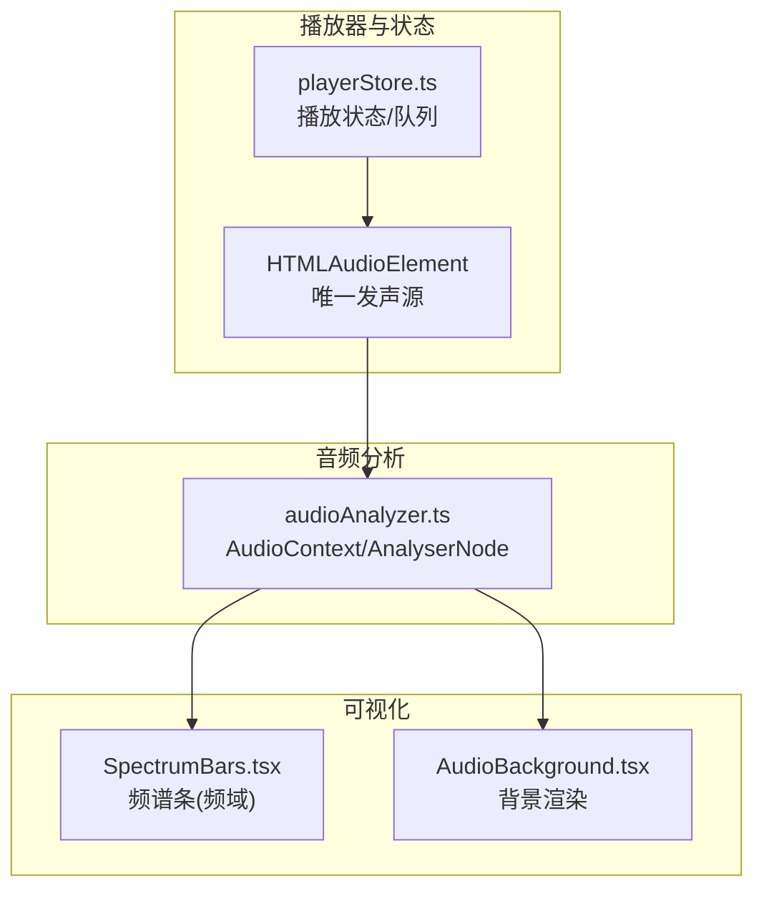
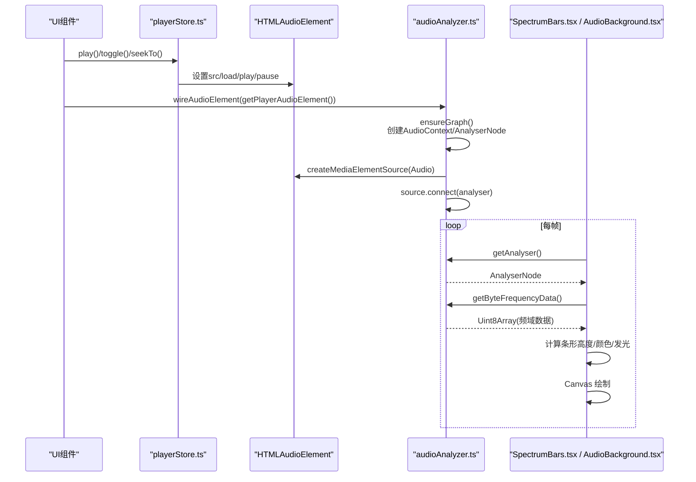
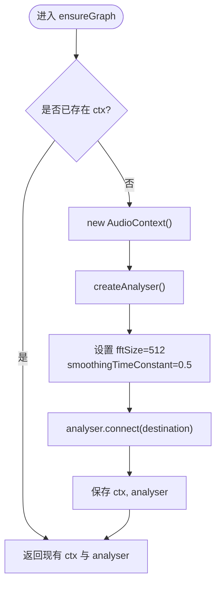
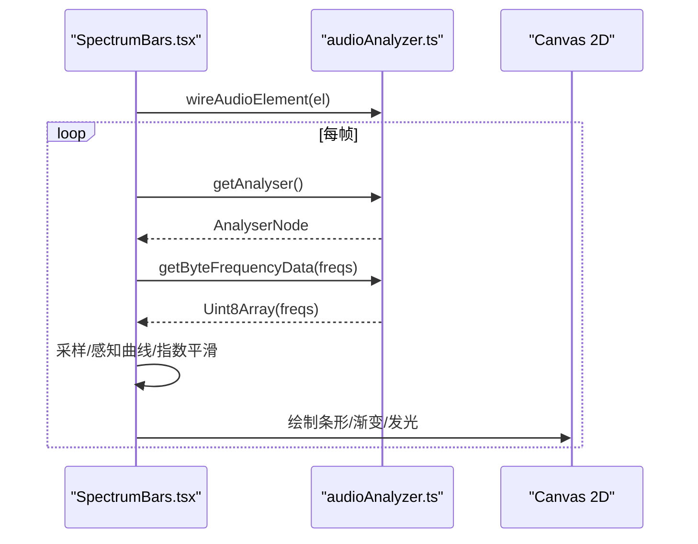
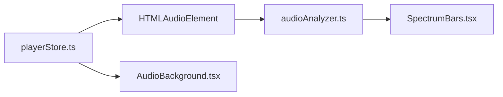
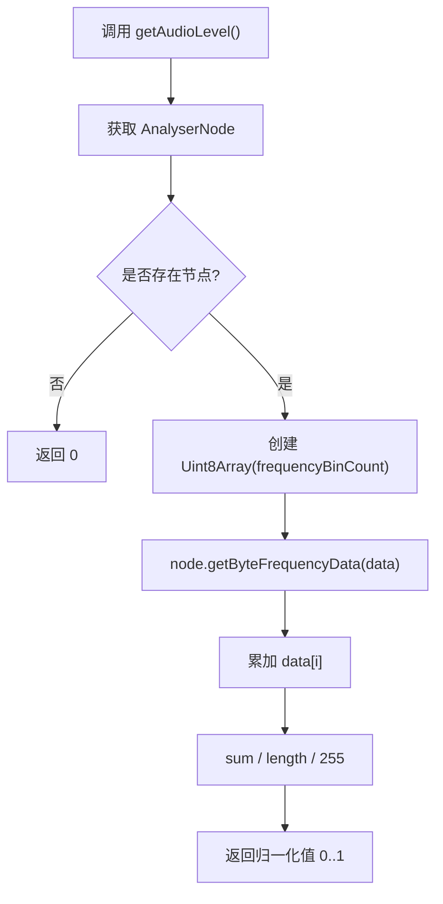

# 音频分析器

<cite>
**本文引用的文件**
- [audioAnalyzer.ts](file://src/media/audioAnalyzer.ts)
- [SpectrumBars.tsx](file://src/components/SpectrumBars.tsx)
- [AudioBackground.tsx](file://src/components/AudioBackground.tsx)
- [playerStore.ts](file://src/store/playerStore.ts)
</cite>

## 目录
1. [简介](#简介)
2. [项目结构](#项目结构)
3. [核心组件](#核心组件)
4. [架构总览](#架构总览)
5. [详细组件分析](#详细组件分析)
6. [依赖关系分析](#依赖关系分析)
7. [性能与精度调优](#性能与精度调优)
8. [故障排查指南](#故障排查指南)
9. [结论](#结论)
10. [附录：关键流程时序图](#附录关键流程时序图)

## 简介
本技术文档围绕前端音频分析器的实现，系统阐述 Web Audio API 的使用、FFT 变换与频谱计算、实时音频处理（缓冲区管理、采样率处理、延迟优化）、以及可视化效果实现。重点说明：
- AudioContext 的初始化与管理
- AnalyserNode 的关键参数配置（fftSize、smoothingTimeConstant）
- MediaElementAudioSourceNode 的连接机制
- getAudioLevel() 音量归一化算法
- 时域/频域特征提取思路与实现要点
- 实时处理的性能优化策略与常见问题解决方案

## 项目结构
本项目将音频分析与可视化拆分为独立模块：
- 音频分析核心：位于 src/media/audioAnalyzer.ts，负责创建并维护单例的 AudioContext 与 AnalyserNode，提供音频元素接入与数据读取接口。
- 可视化组件：
  - SpectrumBars.tsx：基于 Canvas 绘制紧凑频谱条，使用频率数据驱动动画。
  - AudioBackground.tsx：沉浸式背景渲染，支持封面切换淡入与底部压暗。
- 播放引擎与状态：playerStore.ts 统一管理全局 <audio> 元素与播放状态，为可视化提供当前播放源。

图表来源
- [audioAnalyzer.ts:8-19](file://src/media/audioAnalyzer.ts#L8-L19)
- [SpectrumBars.tsx:28-31](file://src/components/SpectrumBars.tsx#L28-L31)
- [playerStore.ts:52-65](file://src/store/playerStore.ts#L52-L65)

章节来源
- [audioAnalyzer.ts:1-59](file://src/media/audioAnalyzer.ts#L1-L59)
- [SpectrumBars.tsx:1-120](file://src/components/SpectrumBars.tsx#L1-L120)
- [AudioBackground.tsx:1-140](file://src/components/AudioBackground.tsx#L1-L140)
- [playerStore.ts:1-298](file://src/store/playerStore.ts#L1-L298)

## 核心组件
- 音频分析器（audioAnalyzer.ts）
  - 单例模式维护 AudioContext 与 AnalyserNode，避免重复创建带来的资源开销与权限问题。
  - 通过 MediaElementAudioSourceNode 将 HTMLAudioElement 接入分析链路，输出经 AnalyserNode 到 destination，保证音量/静音控制仍有效。
  - 暴露 wireAudioElement、getAnalyser、getAudioLevel 等接口供可视化组件调用。
- 频谱条（SpectrumBars.tsx）
  - 使用 requestAnimationFrame 循环读取 AnalyserNode 的频率数据，映射到固定数量的条形柱，采用感知曲线与缓动提升视觉律动感。
  - 颜色随封面主色相变化，保持整体 UI 风格一致。
- 背景（AudioBackground.tsx）
  - 使用 Canvas 绘制专辑封面 cover-fit 铺满全屏，多张封面切换时进行交叉淡入；底部渐变压暗以提升控件可读性。
- 播放状态（playerStore.ts）
  - 集中管理全局 <audio> 元素与播放状态，提供 getPlayerAudioElement 供可视化获取当前播放源。

章节来源
- [audioAnalyzer.ts:8-59](file://src/media/audioAnalyzer.ts#L8-L59)
- [SpectrumBars.tsx:28-112](file://src/components/SpectrumBars.tsx#L28-L112)
- [AudioBackground.tsx:46-139](file://src/components/AudioBackground.tsx#L46-L139)
- [playerStore.ts:52-65](file://src/store/playerStore.ts#L52-L65)

## 架构总览
下图展示了从播放到可视化的完整数据流与控制流：

图表来源
- [playerStore.ts:174-209](file://src/store/playerStore.ts#L174-L209)
- [audioAnalyzer.ts:8-39](file://src/media/audioAnalyzer.ts#L8-L39)
- [SpectrumBars.tsx:28-112](file://src/components/SpectrumBars.tsx#L28-L112)

## 详细组件分析

### 音频分析器（audioAnalyzer.ts）
- AudioContext 与 AnalyserNode 初始化
  - 首次访问时创建 AudioContext，并通过 createAnalyser 生成 AnalyserNode。
  - fftSize 设置为 512，平衡分辨率与性能；smoothingTimeConstant 设为 0.5，使频谱响应更灵敏，可视化律动更明显。
  - analyser 连接至 destination，确保声音正常输出且可被后续节点分析。
- 媒体源接入
  - 使用 createMediaElementSource 将 HTMLAudioElement 接入分析链路，并通过 WeakSet 防止重复接入同一元素。
  - 若 AudioContext 处于 suspended 状态，自动 resume，满足浏览器自动播放策略。
- 数据读取
  - getAnalyser 返回共享的 AnalyserNode，供可视化组件在每帧读取频率数据。
  - getAudioLevel 通过 getByteFrequencyData 获取频域数据，计算平均值并归一化到 0..1 区间，用于波纹幅度等视觉效果。

图表来源
- [audioAnalyzer.ts:8-19](file://src/media/audioAnalyzer.ts#L8-L19)

章节来源
- [audioAnalyzer.ts:8-59](file://src/media/audioAnalyzer.ts#L8-L59)

### 频谱条（SpectrumBars.tsx）
- 数据源接入
  - 组件挂载时调用 wireAudioElement(getPlayerAudioElement())，将全局播放元素接入分析器。
- 渲染循环
  - 使用 ResizeObserver 适配容器尺寸与 DPR，确保高清晰度绘制。
  - 每帧读取 AnalyserNode 的频域数据，按 BAR_COUNT 均匀采样，应用感知曲线（幂函数）增强中小频段可见度。
  - 采用指数平滑（上升快、回落慢）提升动态观感；静音/暂停时保留低矮基线，维持“呼吸”效果。
  - 根据封面主色相动态着色，并为明显跳动的条添加微光描边。

图表来源
- [SpectrumBars.tsx:28-112](file://src/components/SpectrumBars.tsx#L28-L112)
- [audioAnalyzer.ts:41-59](file://src/media/audioAnalyzer.ts#L41-L59)

章节来源
- [SpectrumBars.tsx:1-120](file://src/components/SpectrumBars.tsx#L1-L120)

### 背景（AudioBackground.tsx）
- 封面加载与切换
  - 监听 coverUrl 变化，创建 Image 对象加载封面；当封面切换时记录上一张封面与切换起始时间，实现 0.9s 交叉淡入。
- 绘制优化
  - 仅在封面变化、淡入中或尺寸变化时重绘，静态场景零开销。
  - 无封面时回退到基于 hue 的线性渐变背景；底部叠加渐变压暗层提升控件可读性。

章节来源
- [AudioBackground.tsx:46-139](file://src/components/AudioBackground.tsx#L46-L139)

### 播放状态（playerStore.ts）
- 全局音频元素绑定
  - bindPlayerAudio 注册唯一的 HTMLAudioElement；getPlayerAudioElement 供可视化组件获取当前播放源。
- 播放控制
  - play/toggle/seekTo/next/prev/setVolume 等方法统一封装播放逻辑，处理 canplay/loadeddata 事件以应对浏览器自动播放限制。
- 队列与顺序
  - 支持顺序、随机、列表循环、单曲循环、流式播放等多种模式；流式模式基于画布连线解析顺序。

章节来源
- [playerStore.ts:52-65](file://src/store/playerStore.ts#L52-L65)
- [playerStore.ts:174-209](file://src/store/playerStore.ts#L174-L209)
- [playerStore.ts:237-298](file://src/store/playerStore.ts#L237-L298)

## 依赖关系分析
- audioAnalyzer.ts 依赖 Web Audio API（AudioContext、AnalyserNode、MediaElementAudioSourceNode）。
- SpectrumBars.tsx 依赖 audioAnalyzer.ts 提供的接口与 playerStore.ts 提供的当前播放元素。
- AudioBackground.tsx 不直接依赖音频分析，但受播放状态影响（封面切换时机由上层状态驱动）。
- playerStore.ts 管理全局 <audio> 元素，是可视化数据源的提供者。

图表来源
- [playerStore.ts:52-65](file://src/store/playerStore.ts#L52-L65)
- [audioAnalyzer.ts:26-39](file://src/media/audioAnalyzer.ts#L26-L39)
- [SpectrumBars.tsx:28-31](file://src/components/SpectrumBars.tsx#L28-L31)

章节来源
- [playerStore.ts:1-298](file://src/store/playerStore.ts#L1-L298)
- [audioAnalyzer.ts:1-59](file://src/media/audioAnalyzer.ts#L1-L59)
- [SpectrumBars.tsx:1-120](file://src/components/SpectrumBars.tsx#L1-L120)
- [AudioBackground.tsx:1-140](file://src/components/AudioBackground.tsx#L1-L140)

## 性能与精度调优
- FFT 参数选择
  - fftSize=512 在分辨率与性能之间取得平衡；如需更高频率分辨率可适当增大，但会增加 CPU 占用与延迟。
  - smoothingTimeConstant=0.5 降低平滑程度，提高频谱响应灵敏度，适合可视化律动需求。
- 采样与显示
  - 频谱条仅取前 72% 频段（低频到中高频），符合人耳感知特性，减少无效高频噪声对视觉的影响。
  - 使用幂函数（如 0.72 次方）作为感知曲线，增强中小幅段的可见度。
- 动画与渲染
  - requestAnimationFrame 驱动渲染，结合指数平滑（上升快、回落慢）提升观感。
  - Canvas 绘制使用 DPR 自适应，限制最大 DPR 为 2，避免高分屏下的过度绘制。
  - 背景组件仅在必要时重绘，静态场景零开销。
- 延迟与缓冲
  - AnalyserNode 内部缓冲与 FFT 窗口大小直接影响延迟；fftSize 越大，时间分辨率越低但频率分辨率越高。
  - 合理设置 smoothingTimeConstant 可在平滑与响应速度间权衡。
- 精度调优建议
  - 若需更精确的瞬时峰值检测，可降低 smoothingTimeConstant 并适当增大 fftSize。
  - 对于节拍检测或强节奏可视化，可结合短时能量（时域 RMS）与过零点率辅助判断。
- 性能优化策略
  - 复用 Float32Array/Uint8Array 避免频繁分配内存。
  - 合并 DOM 操作与 Canvas 绘制，减少重排重绘。
  - 使用 ResizeObserver 替代 window.resize 事件，减少不必要的计算。

[本节为通用指导，不直接分析具体文件]

## 故障排查指南
- 无法获取 AnalyserNode
  - 检查是否正确调用 wireAudioElement(getPlayerAudioElement())，并确保当前有有效的 <audio> 元素。
  - 确认浏览器环境支持 Web Audio API；在不支持环境下代码会静默降级。
- 无声音或声音异常
  - 确认 AnalyserNode 已连接至 destination，否则声音可能无法输出。
  - 检查音量与静音状态；音量/静音控制仍作用于原始 <audio> 元素。
- 频谱条无变化
  - 确认正在播放音频；暂停/静音时频谱条会保持低矮基线。
  - 检查 getByteFrequencyData 是否成功返回数据；若 AnalyserNode 未正确连接，将返回全零数组。
- 自动播放策略限制
  - 首次交互（点击/触摸）后，AudioContext 可能需要 resume；代码已在接入时尝试恢复上下文状态。
- 性能卡顿
  - 降低 fftSize 或减小 BAR_COUNT。
  - 限制 DPR 上限，减少绘制像素量。
  - 避免在渲染循环中进行昂贵计算。

章节来源
- [audioAnalyzer.ts:26-47](file://src/media/audioAnalyzer.ts#L26-L47)
- [SpectrumBars.tsx:28-112](file://src/components/SpectrumBars.tsx#L28-L112)

## 结论
本项目通过单例化的 AudioContext 与 AnalyserNode 实现了稳定高效的音频分析管线，配合 Canvas 可视化组件提供了流畅的频谱条与沉浸式背景体验。通过对 FFT 参数、感知曲线、渲染 DPR 与动画平滑的综合调优，系统在精度与性能之间取得了良好平衡。未来可进一步引入时域分析（RMS、过零点率）与更复杂的节拍检测算法，以支撑更丰富的可视化与交互功能。

[本节为总结性内容，不直接分析具体文件]

## 附录：关键流程时序图

### 音量归一化算法（getAudioLevel）

图表来源
- [audioAnalyzer.ts:49-59](file://src/media/audioAnalyzer.ts#L49-L59)

章节来源
- [audioAnalyzer.ts:49-59](file://src/media/audioAnalyzer.ts#L49-L59)