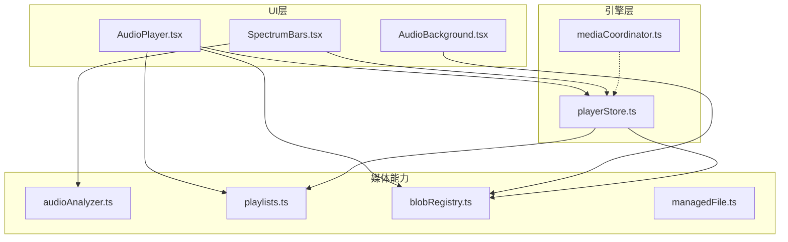
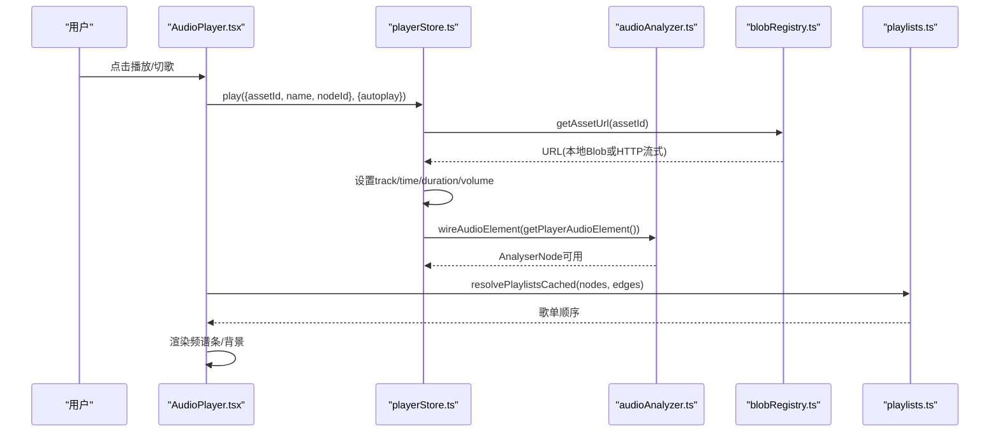
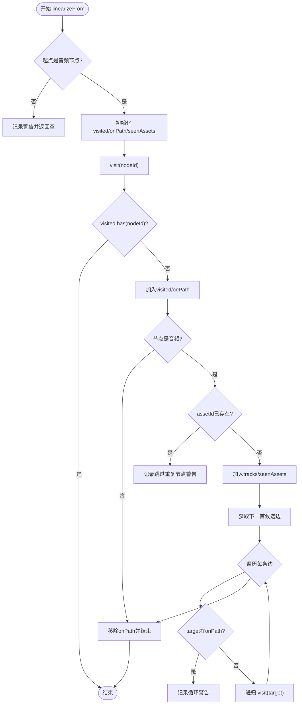
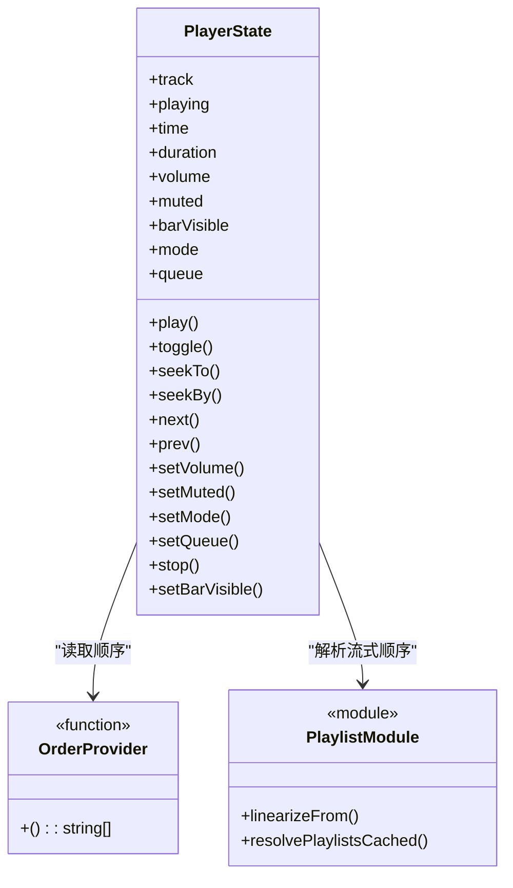
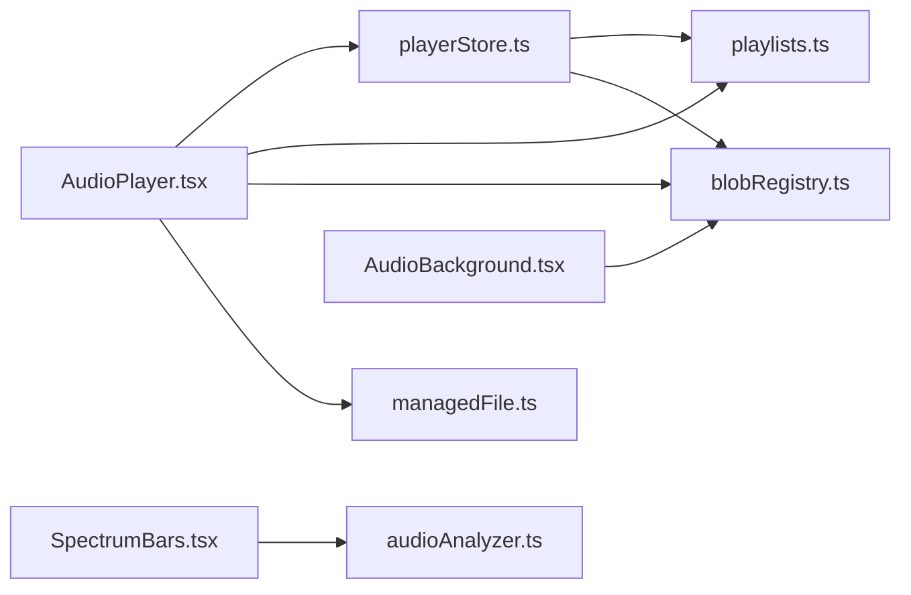

# 音频处理

<cite>
**本文引用的文件**
- [audioAnalyzer.ts](file://src/media/audioAnalyzer.ts)
- [playlists.ts](file://src/media/playlists.ts)
- [playerStore.ts](file://src/store/playerStore.ts)
- [AudioPlayer.tsx](file://src/components/AudioPlayer.tsx)
- [SpectrumBars.tsx](file://src/components/SpectrumBars.tsx)
- [AudioBackground.tsx](file://src/components/AudioBackground.tsx)
- [blobRegistry.ts](file://src/media/blobRegistry.ts)
- [managedFile.ts](file://src/media/managedFile.ts)
- [mediaCoordinator.ts](file://src/media/mediaCoordinator.ts)
- [playlists.test.ts](file://src/media/playlists.test.ts)
</cite>

## 目录
1. [简介](#简介)
2. [项目结构](#项目结构)
3. [核心组件](#核心组件)
4. [架构总览](#架构总览)
5. [详细组件分析](#详细组件分析)
6. [依赖关系分析](#依赖关系分析)
7. [性能考虑](#性能考虑)
8. [故障排查指南](#故障排查指南)
9. [结论](#结论)
10. [附录：使用示例与调试技巧](#附录使用示例与调试技巧)

## 简介
本模块提供完整的音频处理能力，包括：
- 实时音频分析：波形/频谱提取、音量检测、可视化驱动。
- 播放列表管理：基于画布连线解析歌单、队列管理、顺序/循环/随机/单曲/流式播放模式、进度同步。
- 资源加载优化：本地 IndexedDB 缓存、局域网 HTTP 流式拉取、封面缩略图抓取与并发控制、跨源兜底策略。
- 性能与兼容性：Web Audio API 降级、Canvas/DPR 适配、请求节流与内存释放。

## 项目结构
音频相关代码主要分布在以下位置：
- 媒体分析与可视化：src/media/audioAnalyzer.ts、src/components/SpectrumBars.tsx、src/components/AudioBackground.tsx
- 播放引擎与状态：src/store/playerStore.ts、src/media/mediaCoordinator.ts
- 播放列表与顺序：src/media/playlists.ts（含测试）
- 资源加载与缓存：src/media/blobRegistry.ts
- 播放器 UI：src/components/AudioPlayer.tsx
- 文件聚合与筛选：src/media/managedFile.ts

图表来源
- [AudioPlayer.tsx:123-169](file://src/components/AudioPlayer.tsx#L123-L169)
- [playerStore.ts:97-116](file://src/store/playerStore.ts#L97-L116)
- [audioAnalyzer.ts:8-39](file://src/media/audioAnalyzer.ts#L8-L39)
- [blobRegistry.ts:84-126](file://src/media/blobRegistry.ts#L84-L126)
- [playlists.ts:71-112](file://src/media/playlists.ts#L71-L112)

章节来源
- [AudioPlayer.tsx:123-169](file://src/components/AudioPlayer.tsx#L123-L169)
- [playerStore.ts:97-116](file://src/store/playerStore.ts#L97-L116)
- [audioAnalyzer.ts:8-39](file://src/media/audioAnalyzer.ts#L8-L39)
- [blobRegistry.ts:84-126](file://src/media/blobRegistry.ts#L84-L126)
- [playlists.ts:71-112](file://src/media/playlists.ts#L71-L112)

## 核心组件
- 音频分析器（audioAnalyzer.ts）：将当前播放的 <audio> 接入 AnalyserNode，暴露频率数据与归一化音量，供频谱条与背景动画使用。
- 播放列表系统（playlists.ts）：从画布节点与边解析命名歌单，按 DFS 先序线性化，支持环检测、重复资产去重、边排序。
- 播放引擎（playerStore.ts）：单一全局播放器，维护 track、mode、queue、time/duration/volume/muted，实现顺序/循环/随机/单曲/流式切换与自动续播。
- 资源加载（blobRegistry.ts）：统一获取资源 URL/Blob，优先本地 IndexedDB，其次局域网 HTTP 流式地址，视频封面抓帧并缓存；并发限制与跨源兜底。
- 播放器 UI（AudioPlayer.tsx）：集成歌词、专辑图、队列面板、搜索排序、键盘快捷键、模式切换等。
- 频谱条（SpectrumBars.tsx）：基于 AnalyserNode 的频率数据绘制圆头条形，颜色随封面主色变化，静音/暂停保留基线。
- 背景（AudioBackground.tsx）：封面 cover-fit 铺满全屏，多张封面交叉淡入，底部压暗提升可读性。
- 媒体互斥（mediaCoordinator.ts）：保证同一时刻最多一个音频和一个视频在播放。

章节来源
- [audioAnalyzer.ts:1-59](file://src/media/audioAnalyzer.ts#L1-L59)
- [playlists.ts:1-179](file://src/media/playlists.ts#L1-L179)
- [playerStore.ts:1-298](file://src/store/playerStore.ts#L1-L298)
- [blobRegistry.ts:1-389](file://src/media/blobRegistry.ts#L1-L389)
- [AudioPlayer.tsx:1-800](file://src/components/AudioPlayer.tsx#L1-L800)
- [SpectrumBars.tsx:1-120](file://src/components/SpectrumBars.tsx#L1-L120)
- [AudioBackground.tsx:1-140](file://src/components/AudioBackground.tsx#L1-L140)
- [mediaCoordinator.ts:1-25](file://src/media/mediaCoordinator.ts#L1-L25)

## 架构总览
整体流程：
- UI 触发播放/切歌 → playerStore 更新状态并设置 <audio> 源 → 通过 MediaElementSourceNode 接入 AnalyserNode → SpectrumBars/AudioBackground 读取频率数据渲染。
- 播放列表顺序由 playlists 模块根据画布连线解析，playerStore 依据 mode 决定 next/prev/random/loop/single/flow。
- 资源加载由 blobRegistry 统一管理，优先本地 Blob/HTTP Range 流式，必要时抓取视频封面并缓存。

图表来源
- [AudioPlayer.tsx:174-249](file://src/components/AudioPlayer.tsx#L174-L249)
- [playerStore.ts:174-209](file://src/store/playerStore.ts#L174-L209)
- [audioAnalyzer.ts:26-47](file://src/media/audioAnalyzer.ts#L26-L47)
- [blobRegistry.ts:84-105](file://src/media/blobRegistry.ts#L84-L105)
- [playlists.ts:115-179](file://src/media/playlists.ts#L115-L179)

## 详细组件分析

### 音频分析器（audioAnalyzer.ts）
- 设计要点：
  - 单例 AudioContext + AnalyserNode，FFT Size=512，平滑系数可调，连接 destination 以维持音量/静音生效。
  - 每个 HTMLAudioElement 仅接入一次（WeakSet），避免重复创建 source。
  - 提供 getAnalyser() 与 getAudioLevel()（归一化音量 0..1）。
- 复杂度：
  - 初始化 O(1)，getByteFrequencyData 每次调用 O(N)（N=frequencyBinCount）。
- 错误处理：
  - 捕获环境不支持时静默降级，不影响 UI。
- 优化建议：
  - 在高频刷新场景下复用 Uint8Array，减少分配。
  - 根据设备性能调整 smoothingTimeConstant 与 FFT Size。

章节来源
- [audioAnalyzer.ts:8-59](file://src/media/audioAnalyzer.ts#L8-L59)

### 播放列表管理系统（playlists.ts）
- 规则摘要：
  - 命名文本节点（无入边、非空文本、恰好一条出边指向音频）作为歌单名。
  - 从首节点沿“音频→音频”边做 DFS 先序遍历，分叉处按边 order 升序，未设置 order 的排在后面，再按创建顺序稳定排序。
  - 环/重复节点只遍历一次；同一 assetId 在歌单中只保留第一次出现并告警。
  - 经由非音频节点的路径不穿透。
- 关键函数：
  - audioNextEdges(edges, sourceNodeId, nodes)：过滤目标为音频并按 order 排序。
  - linearizeFrom(nodes, edges, startNodeId)：DFS 线性化，返回 assetIds/tracks/warnings。
  - resolvePlaylists(nodes, edges)：扫描整张图解析所有命名歌单。
  - findPlaylistByAsset(playlists, assetId)：查找包含某首歌的歌单。
  - resolvePlaylistsCached(nodes, edges)：引用不可变时的缓存命中。
- 复杂度：
  - 线性化 O(V+E)，其中 V 为音频节点数，E 为音频间边数。
  - 解析全部歌单 O(Nodes+Edges)。
- 错误处理：
  - 无效起点返回空结果与警告；检测到循环连线给出警告。
- 测试覆盖：
  - 单链、分叉、边序号、环、自环、重复资产、子歌单、注释文本、无效起点等场景均有断言。

图表来源
- [playlists.ts:71-112](file://src/media/playlists.ts#L71-L112)

章节来源
- [playlists.ts:1-179](file://src/media/playlists.ts#L1-L179)
- [playlists.test.ts:39-244](file://src/media/playlists.test.ts#L39-L244)

### 播放引擎（playerStore.ts）
- 状态与行为：
  - 维护 track、playing、time、duration、volume、muted、mode、queue。
  - play/toggle/seekTo/seekBy/next/prev/setVolume/setMuted/setMode/setQueue/stop。
  - baseOrder() 优先级：队列 > 打开时的顺序提供者 > 画布连线顺序。
  - handleEnded() 自动续播：single 重播；random 随机；其他顺序/循环。
- 与 playlists 集成：
  - graphOrderFor(assetId, nodeId) 通过 linearizeFrom 解析流式顺序。
  - setMode('flow') 保持队列；离开 flow 清空队列。
- 竞态与健壮性：
  - playSeq 令牌确保快速连续 play() 只应用最后一次。
  - requestPlay() 在 canplay/loadeddata 重试播放。

图表来源
- [playerStore.ts:25-50](file://src/store/playerStore.ts#L25-L50)
- [playerStore.ts:97-116](file://src/store/playerStore.ts#L97-L116)
- [playerStore.ts:132-157](file://src/store/playerStore.ts#L132-L157)

章节来源
- [playerStore.ts:1-298](file://src/store/playerStore.ts#L1-L298)

### 资源加载与缓存（blobRegistry.ts）
- 策略：
  - getAssetUrl：优先本地 IndexedDB Blob，其次局域网 HTTP 流式地址（Range 支持可拖动），否则生成 Blob URL。
  - getAssetBlob：本地缺失则尝试云端下载，再尝试局域网请求，失败抛错。
  - getThumbnailUrl：优先局域网同步封面；若无则抓取视频封面（并发上限 THUMB_MAX_CONCURRENT=2），黑帧检测与重试，跨源失败时一次性拉全量兜底。
  - 并发控制：acquireThumbSlot 排队机制，避免阻塞浏览器连接池。
  - 内存管理：URL.revokeObjectURL 及时释放；invalidate* 系列接口用于失效缓存。
- 兼容性与容错：
  - 跨域视频抓帧需 crossOrigin='anonymous'，失败回退到 blob 方式。
  - 对旧版本可能产生的黑封面进行自检替换。

章节来源
- [blobRegistry.ts:1-389](file://src/media/blobRegistry.ts#L1-L389)

### 频谱条（SpectrumBars.tsx）
- 实现要点：
  - 使用 Canvas 绘制 44 根圆头条，颜色基于封面主色 hue。
  - 每帧读取 AnalyserNode 频率数据，感知曲线映射，上升快回落慢的指数平滑。
  - 静音/暂停保留低矮基线，避免视觉消失。
  - ResizeObserver 自适应 DPR 与容器尺寸。
- 性能：
  - 仅在 playing 时启动动画循环；使用 Float32Array 缓冲值。

章节来源
- [SpectrumBars.tsx:1-120](file://src/components/SpectrumBars.tsx#L1-L120)
- [audioAnalyzer.ts:26-59](file://src/media/audioAnalyzer.ts#L26-L59)

### 背景（AudioBackground.tsx）
- 实现要点：
  - 封面 cover-fit 铺满全屏，多张封面 0.9s 交叉淡入。
  - 底部渐变压暗提升可读性，无封面时回退渐变色。
  - 仅在封面变化/淡入中/尺寸变化时重绘，静态零开销。

章节来源
- [AudioBackground.tsx:1-140](file://src/components/AudioBackground.tsx#L1-L140)

### 播放器 UI（AudioPlayer.tsx）
- 功能：
  - 队列面板、搜索/排序、模式切换（顺序/循环/随机/单曲/流式）、歌词显示与偏移、专辑图轮换、键盘快捷键。
  - 与 playlists 模块联动：从画布入口进入时设置队列并起播；手动点选退出队列。
  - 与 playerStore 联动：注册 orderProvider，监听模式变化重建流式顺序。
- 体验优化：
  - 歌词前景色按对比度自动选择，带描边/柔光兜底。
  - 封面主色驱动 UI 强调色。

章节来源
- [AudioPlayer.tsx:1-800](file://src/components/AudioPlayer.tsx#L1-L800)

### 媒体互斥（mediaCoordinator.ts）
- 作用：同一时刻最多一个音频和一个视频在播放，新播放自动暂停同类型其他元素。
- 适用场景：画中画、悬浮窗、多个节点同时触发播放。

章节来源
- [mediaCoordinator.ts:1-25](file://src/media/mediaCoordinator.ts#L1-L25)

## 依赖关系分析
- AudioPlayer 依赖：
  - playerStore（播放状态与控制）
  - playlists（歌单解析与查找）
  - blobRegistry（资源 URL/缩略图）
  - managedFile（MP3 筛选与文件聚合）
- playerStore 依赖：
  - playlists（流式顺序解析）
  - blobRegistry（资源 URL）
  - canvasStore（节点/边访问）
- 可视化依赖：
  - SpectrumBars → audioAnalyzer（频率数据）
  - AudioBackground → blobRegistry（封面 URL）

图表来源
- [AudioPlayer.tsx:25-35](file://src/components/AudioPlayer.tsx#L25-L35)
- [playerStore.ts:5-7](file://src/store/playerStore.ts#L5-L7)
- [SpectrumBars.tsx:1-4](file://src/components/SpectrumBars.tsx#L1-L4)
- [AudioBackground.tsx:30-40](file://src/components/AudioBackground.tsx#L30-L40)

章节来源
- [AudioPlayer.tsx:25-35](file://src/components/AudioPlayer.tsx#L25-L35)
- [playerStore.ts:5-7](file://src/store/playerStore.ts#L5-L7)
- [SpectrumBars.tsx:1-4](file://src/components/SpectrumBars.tsx#L1-L4)
- [AudioBackground.tsx:30-40](file://src/components/AudioBackground.tsx#L30-L40)

## 性能考虑
- 音频分析：
  - 合理设置 AnalyserNode 的 fftSize 与 smoothingTimeConstant，平衡灵敏度与性能。
  - 复用数组对象，减少 GC 压力。
- 播放列表解析：
  - 使用 resolvePlaylistsCached 避免重复解析；节点/边引用不可变时命中缓存。
  - 线性化算法 O(V+E)，适合中等规模画布。
- 资源加载：
  - 优先本地 IndexedDB 与 HTTP Range 流式，避免大文件完整下载。
  - 封面抓帧并发限制（THUMB_MAX_CONCURRENT=2），防止阻塞播放。
  - 及时 revoke ObjectURL，避免内存泄漏。
- UI 渲染：
  - Canvas 按需重绘，ResizeObserver 控制 DPR。
  - 频谱条指数平滑降低抖动，提升观感与性能。

[本节为通用指导，无需特定文件引用]

## 故障排查指南
- 无法获取频谱数据：
  - 检查是否已调用 wireAudioElement(getPlayerAudioElement())，且 AudioContext 状态为 running。
  - 确认浏览器支持 Web Audio API。
- 播放失败或无声：
  - 检查 getAssetUrl 是否返回有效 URL；确认 CORS 配置（跨域视频抓帧需 Access-Control-Allow-Origin）。
  - 检查 mediaCoordinator 是否暂停了其他媒体。
- 歌单顺序异常：
  - 检查边 order 设置与目标是否为音频节点；查看 warnings 中的循环/重复告警。
- 封面缺失或黑图：
  - 检查 isImageMostlyBlack 自检逻辑；必要时强制重新抓帧。
  - 跨源失败时走 blob 兜底路径。

章节来源
- [audioAnalyzer.ts:26-47](file://src/media/audioAnalyzer.ts#L26-L47)
- [blobRegistry.ts:128-239](file://src/media/blobRegistry.ts#L128-L239)
- [blobRegistry.ts:310-379](file://src/media/blobRegistry.ts#L310-L379)
- [playlists.ts:71-112](file://src/media/playlists.ts#L71-L112)

## 结论
该音频处理模块以“画布连线即歌单”的设计为核心，结合统一的播放引擎与资源加载策略，实现了高内聚、低耦合的音频能力。通过严格的顺序解析、健壮的加载与缓存机制、以及细致的可视化与用户体验优化，能够在复杂交互场景下保持稳定与高性能。

[本节为总结，无需特定文件引用]

## 附录：使用示例与调试技巧
- 基本用法
  - 在播放器中注册歌曲列表顺序：调用 setOrderProvider(() => orderedFiles.map(f => f.assetId))。
  - 播放指定歌曲：调用 play({ assetId, name, nodeId }, { autoplay })。
  - 切换模式：sequential/loop/single/random/flow。
  - 从画布歌单入口进入：设置 initialPlaylistId，组件会自动设置队列并起播。
- 调试技巧
  - 观察 playlists 解析结果与 warnings，定位循环/重复/无效起点问题。
  - 在控制台打印 baseOrder() 的结果，验证顺序是否符合预期。
  - 检查 blobRegistry 的 urlCache/thumbCache，必要时调用 invalidate* 清理。
  - 对于视频封面，关注跨域与黑帧重试逻辑，必要时强制重新抓帧。
- 性能调优
  - 在高刷设备上适当降低频谱条数量或 FFT Size。
  - 批量操作后合并状态更新，减少重渲染。
  - 合理使用缓存与懒加载，避免不必要的资源拉取。

章节来源
- [AudioPlayer.tsx:240-271](file://src/components/AudioPlayer.tsx#L240-L271)
- [playerStore.ts:67-70](file://src/store/playerStore.ts#L67-L70)
- [playerStore.ts:174-209](file://src/store/playerStore.ts#L174-L209)
- [blobRegistry.ts:41-56](file://src/media/blobRegistry.ts#L41-L56)
- [blobRegistry.ts:310-379](file://src/media/blobRegistry.ts#L310-L379)