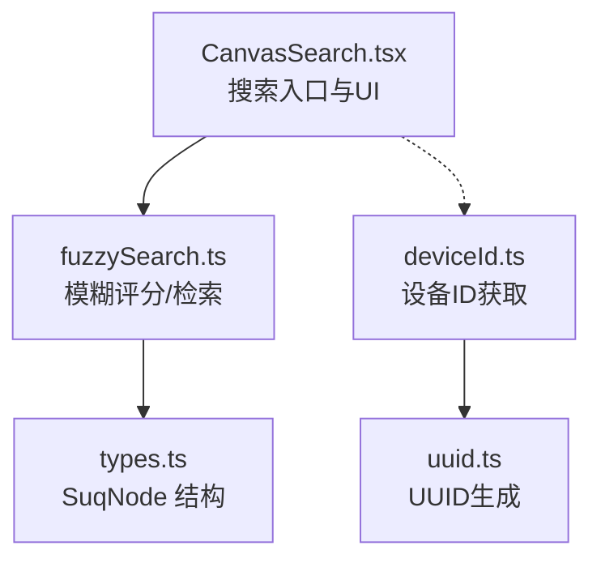
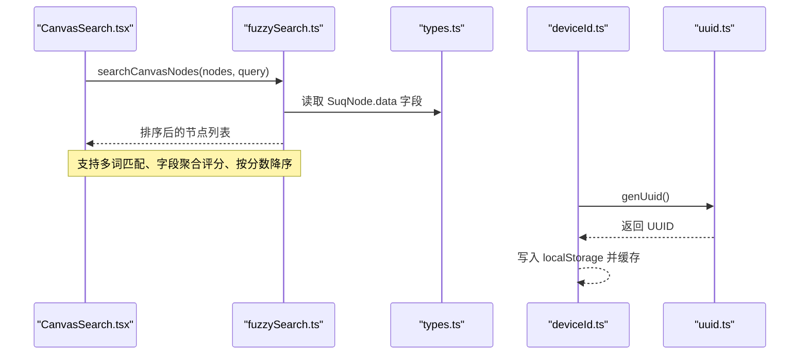
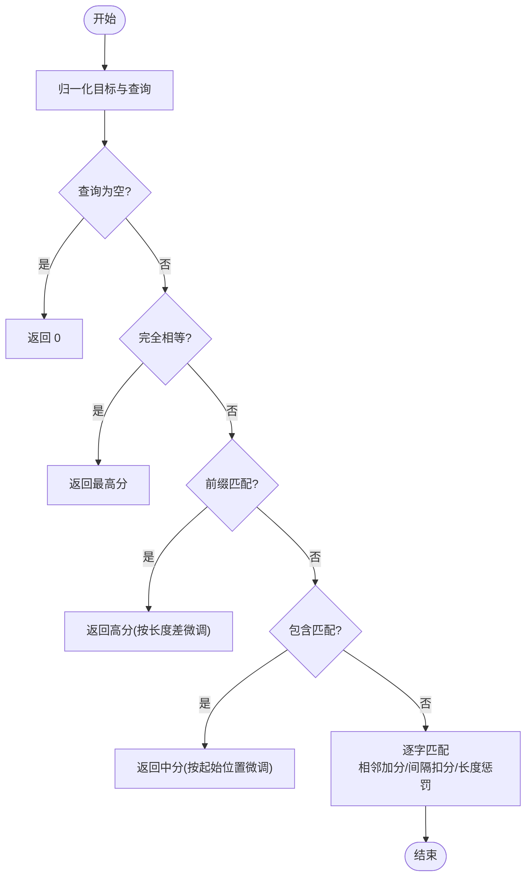
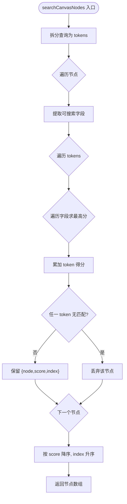
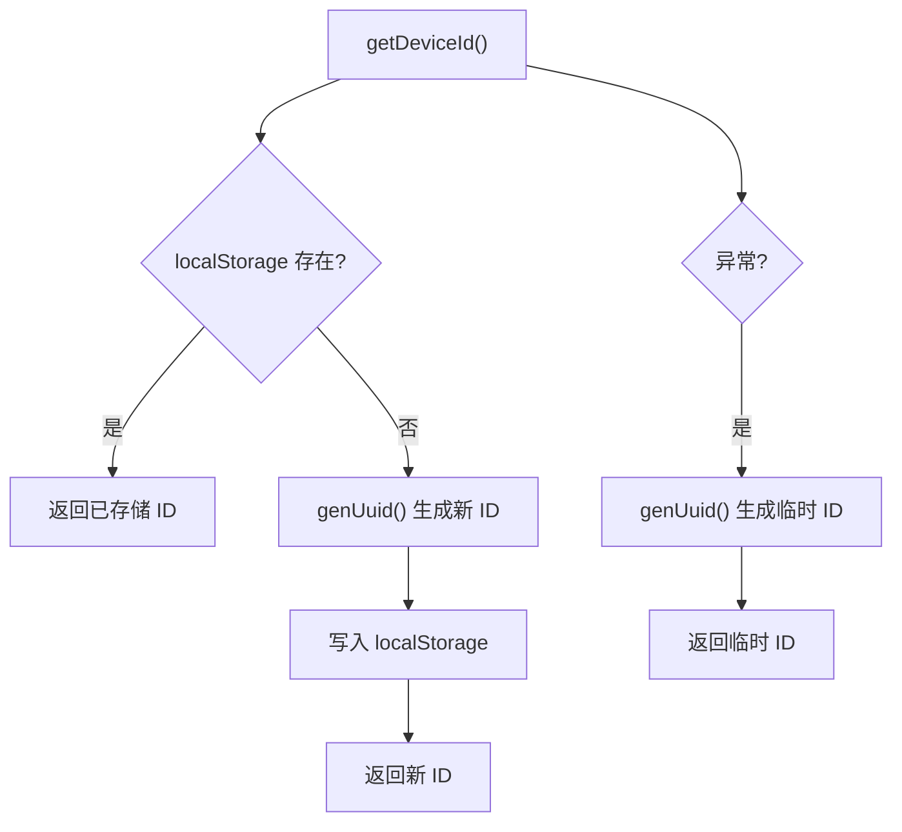
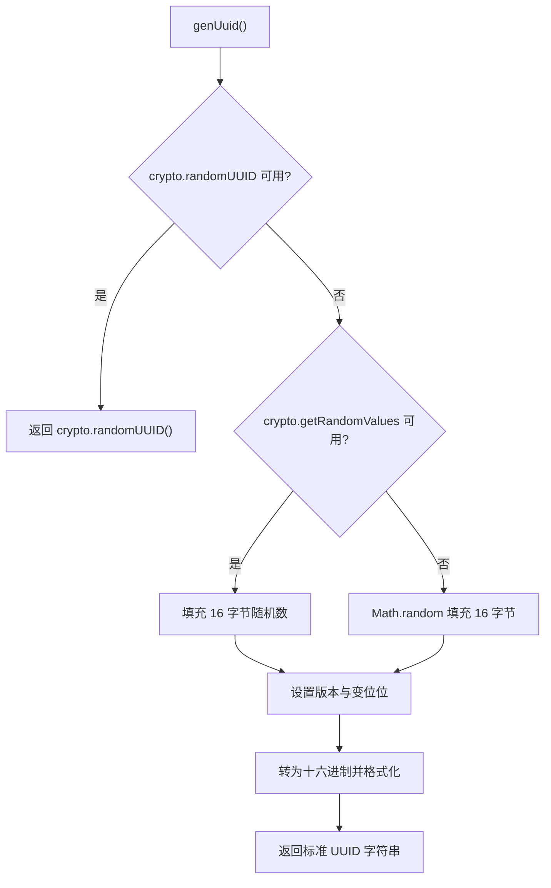
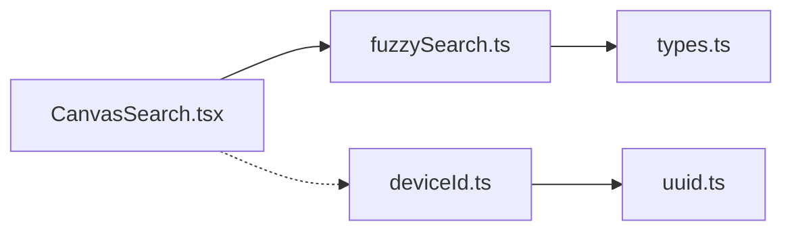

# 工具和实用程序

<cite>
**本文引用的文件**
- [fuzzySearch.ts](file://src/search/fuzzySearch.ts)
- [fuzzySearch.test.ts](file://src/search/fuzzySearch.test.ts)
- [CanvasSearch.tsx](file://src/components/CanvasSearch.tsx)
- [deviceId.ts](file://src/utils/deviceId.ts)
- [uuid.ts](file://src/utils/uuid.ts)
- [types.ts](file://src/types.ts)
- [README.md](file://README.md)
</cite>

## 目录
1. [简介](#简介)
2. [项目结构](#项目结构)
3. [核心组件](#核心组件)
4. [架构总览](#架构总览)
5. [详细组件分析](#详细组件分析)
6. [依赖关系分析](#依赖关系分析)
7. [性能考量](#性能考量)
8. [故障排查指南](#故障排查指南)
9. [结论](#结论)
10. [附录](#附录)

## 简介
本章节聚焦于本项目中的工具与实用程序，重点覆盖：
- 模糊搜索算法的实现原理、应用场景、结果排序策略与可扩展点（高亮显示扩展建议）
- 设备 ID 生成机制，包括唯一性保证、跨平台兼容性与隐私保护考虑
- UUID 工具函数的实现细节与使用场景
- 其他常用工具函数说明与扩展指南
- 性能测试数据与最佳实践建议

## 项目结构
与“工具与实用程序”直接相关的代码主要分布在以下位置：
- 搜索能力：src/search/fuzzySearch.ts（模糊评分与节点检索）、src/components/CanvasSearch.tsx（搜索 UI 与交互）
- 标识与 ID：src/utils/uuid.ts（UUID 生成）、src/utils/deviceId.ts（设备 ID 持久化）
- 类型定义：src/types.ts（节点数据结构，供搜索字段抽取使用）
- 项目背景与构建说明：README.md

图表来源
- [CanvasSearch.tsx:1-198](file://src/components/CanvasSearch.tsx#L1-L198)
- [fuzzySearch.ts:1-67](file://src/search/fuzzySearch.ts#L1-L67)
- [types.ts:66-107](file://src/types.ts#L66-L107)
- [deviceId.ts:1-16](file://src/utils/deviceId.ts#L1-L16)
- [uuid.ts:1-16](file://src/utils/uuid.ts#L1-L16)

章节来源
- [README.md:1-181](file://README.md#L1-L181)

## 核心组件
- 模糊搜索模块：提供字符串归一化、单词模糊评分、多词组合评分、按分数降序排序的画布节点检索能力。
- 设备 ID 模块：基于本地存储的设备唯一标识，具备降级与异常回退机制。
- UUID 工具：优先使用浏览器原生 API，回退到随机数构造符合规范的 UUID v4。

章节来源
- [fuzzySearch.ts:1-67](file://src/search/fuzzySearch.ts#L1-L67)
- [deviceId.ts:1-16](file://src/utils/deviceId.ts#L1-L16)
- [uuid.ts:1-16](file://src/utils/uuid.ts#L1-L16)

## 架构总览
搜索流程从 UI 层触发，调用模糊搜索核心逻辑，对节点的多字段进行归一化与评分，最终返回排序后的节点列表；设备 ID 在协作与权限控制中作为稳定标识，由 UUID 工具保障唯一性。

图表来源
- [CanvasSearch.tsx:42-45](file://src/components/CanvasSearch.tsx#L42-L45)
- [fuzzySearch.ts:41-65](file://src/search/fuzzySearch.ts#L41-L65)
- [deviceId.ts:5-15](file://src/utils/deviceId.ts#L5-L15)
- [uuid.ts:1-15](file://src/utils/uuid.ts#L1-L15)

## 详细组件分析

### 模糊搜索算法
- 字符串归一化：统一大小写、Unicode 规范化与去空白，提升跨语言与输入差异的匹配稳定性。
- 单词评分策略 fuzzyScore：
  - 完全相等：最高分
  - 前缀匹配：高分且随长度差递减
  - 包含匹配：中等分且随起始位置递减
  - 非连续字符匹配：基础分 + 相邻匹配加分 + 间隔惩罚 + 长度惩罚
- 多词组合：将查询拆分为多个 token，分别在各可搜索字段上取最高分，再累加得到节点总分。
- 排序规则：按总分降序，分数相同按原始索引升序，保证稳定排序。
- 可搜索字段：label、text、kind、mime、createdByName，过滤空值后参与评分。

图表来源
- [fuzzySearch.ts:3-29](file://src/search/fuzzySearch.ts#L3-L29)

图表来源
- [fuzzySearch.ts:41-65](file://src/search/fuzzySearch.ts#L41-L65)

应用与扩展
- 应用场景：画布内快速定位图片、视频、PDF、文本等元素；支持中英文混合与多词组合。
- 高亮显示扩展：可在 UI 层根据 fuzzyScore 或 token 匹配位置，对 label/text 片段进行高亮渲染（当前 UI 仅展示标签与元信息）。
- 性能优化：限制最大结果数（MAX_RESULTS），避免渲染压力；对长列表可考虑分页或虚拟滚动。

章节来源
- [fuzzySearch.ts:1-67](file://src/search/fuzzySearch.ts#L1-L67)
- [CanvasSearch.tsx:22-45](file://src/components/CanvasSearch.tsx#L22-L45)
- [fuzzySearch.test.ts:14-33](file://src/search/fuzzySearch.test.ts#L14-L33)

### 设备 ID 生成机制
- 唯一性保证：首次生成时调用 UUID 工具，后续从本地存储读取，确保同一设备稳定一致。
- 跨平台兼容：通过 try/catch 捕获存储异常，失败时回退为内存级 UUID，保证可用性。
- 隐私保护：ID 为随机 UUID，不携带个人信息；如需匿名化协作，可结合哈希或盐值进一步脱敏。
- 使用场景：局域网协作的项目所有权标记、审计日志、去重键等。

图表来源
- [deviceId.ts:5-15](file://src/utils/deviceId.ts#L5-L15)
- [uuid.ts:1-15](file://src/utils/uuid.ts#L1-L15)

章节来源
- [deviceId.ts:1-16](file://src/utils/deviceId.ts#L1-L16)
- [uuid.ts:1-16](file://src/utils/uuid.ts#L1-L16)

### UUID 工具函数
- 实现策略：优先使用 crypto.randomUUID；不可用时使用 crypto.getRandomValues 填充 16 字节，并按 UUID v4 规范设置版本与变位位；最后以十六进制拼接为标准格式。
- 兼容性：在缺少 Web Crypto API 的环境中回退到 Math.random，确保基本可用。
- 使用场景：节点 ID、资源 ID、会话 ID、分布式键等需要全局唯一标识的场景。

图表来源
- [uuid.ts:1-15](file://src/utils/uuid.ts#L1-L15)

章节来源
- [uuid.ts:1-16](file://src/utils/uuid.ts#L1-L16)

### 搜索 UI 与交互
- 快捷键：Ctrl/Cmd+F 打开搜索框并自动聚焦。
- 结果展示：最多展示固定数量的结果，避免 DOM 过多导致卡顿。
- 选择行为：点击结果后通过自定义事件聚焦对应节点，关闭搜索面板。
- 键盘导航：上下箭头移动高亮项，Enter 确认选择，Esc 关闭。

章节来源
- [CanvasSearch.tsx:32-198](file://src/components/CanvasSearch.tsx#L32-L198)

## 依赖关系分析
- CanvasSearch 依赖 fuzzySearch 提供的检索能力，并受 types 中 SuqNode 结构约束。
- deviceId 依赖 uuid 生成唯一标识，并在本地存储中持久化。
- README 描述了项目的整体能力与构建方式，有助于理解工具的使用上下文。

图表来源
- [CanvasSearch.tsx:4-6](file://src/components/CanvasSearch.tsx#L4-L6)
- [fuzzySearch.ts:1-2](file://src/search/fuzzySearch.ts#L1-L2)
- [deviceId.ts:1-2](file://src/utils/deviceId.ts#L1-L2)
- [types.ts:66-107](file://src/types.ts#L66-L107)

章节来源
- [README.md:124-150](file://README.md#L124-L150)

## 性能考量
- 时间复杂度
  - 单节点评分：O(Ln·F)，其中 Ln 为查询 token 数量，F 为可搜索字段数量；每个 token 在字段上进行近似匹配。
  - 全量扫描：O(N·Ln·F)，N 为节点总数。
- 空间复杂度：O(N) 用于中间结果集与排序。
- 优化建议
  - 限制结果数量：UI 层已限制 MAX_RESULTS，避免渲染开销。
  - 增量更新：当 nodes 变化时使用 memoization（如 useMemo）减少重复计算。
  - 预归一化：对频繁变化的字段可考虑缓存归一化结果。
  - 分片/分页：超大画布可按页加载或分片检索。
  - 并行化：在 Web Worker 中执行密集评分，避免阻塞主线程。
- 测试基准
  - 单元测试覆盖了非连续字符匹配、精确/前缀/宽松匹配排序、多词跨字段匹配等行为，可作为回归基线。

章节来源
- [fuzzySearch.ts:41-65](file://src/search/fuzzySearch.ts#L41-L65)
- [CanvasSearch.tsx:42-45](file://src/components/CanvasSearch.tsx#L42-L45)
- [fuzzySearch.test.ts:14-33](file://src/search/fuzzySearch.test.ts#L14-L33)

## 故障排查指南
- 搜索无结果
  - 检查查询是否包含有效 token；空查询会返回全部节点。
  - 确认节点的可搜索字段是否为空字符串或未定义。
- 结果排序不符合预期
  - 核对字段权重与评分规则；精确/前缀/包含/模糊匹配有明确优先级。
  - 多词匹配时，任一 token 未匹配会导致整节点被丢弃。
- 设备 ID 不稳定
  - 若 localStorage 不可用，将回退为内存级 UUID；检查浏览器隐私模式或存储限制。
- UUID 生成异常
  - 在无 Web Crypto 环境中会回退到 Math.random；确保环境至少支持基本随机数生成。

章节来源
- [fuzzySearch.ts:3-29](file://src/search/fuzzySearch.ts#L3-L29)
- [fuzzySearch.ts:41-65](file://src/search/fuzzySearch.ts#L41-L65)
- [deviceId.ts:5-15](file://src/utils/deviceId.ts#L5-L15)
- [uuid.ts:1-15](file://src/utils/uuid.ts#L1-L15)

## 结论
本项目提供了轻量而高效的模糊搜索工具链与稳定的设备标识方案。搜索算法在多字段、多词场景下具备良好的准确性与可扩展性；设备 ID 与 UUID 工具在保证唯一性与兼容性的同时兼顾了隐私与健壮性。建议在大规模画布场景中引入分页、Worker 与缓存策略，进一步提升响应速度与用户体验。

## 附录
- 高亮显示扩展建议
  - 在 UI 层根据 fuzzyScore 或 token 匹配位置，对 label/text 片段进行高亮渲染。
  - 可记录每个 token 的匹配区间，以便精准标注。
- 最佳实践
  - 保持查询简短明确，利用多词组合提高命中率。
  - 合理设计节点元数据（如 kind、mime、createdByName），增强可搜索性。
  - 对敏感数据避免放入可搜索字段，或进行脱敏处理。
  - 定期评估搜索性能，必要时引入索引或分片策略。