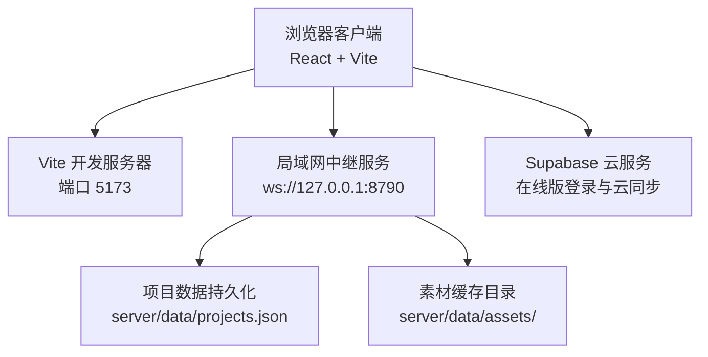
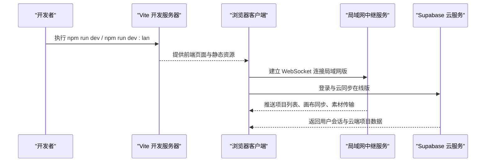
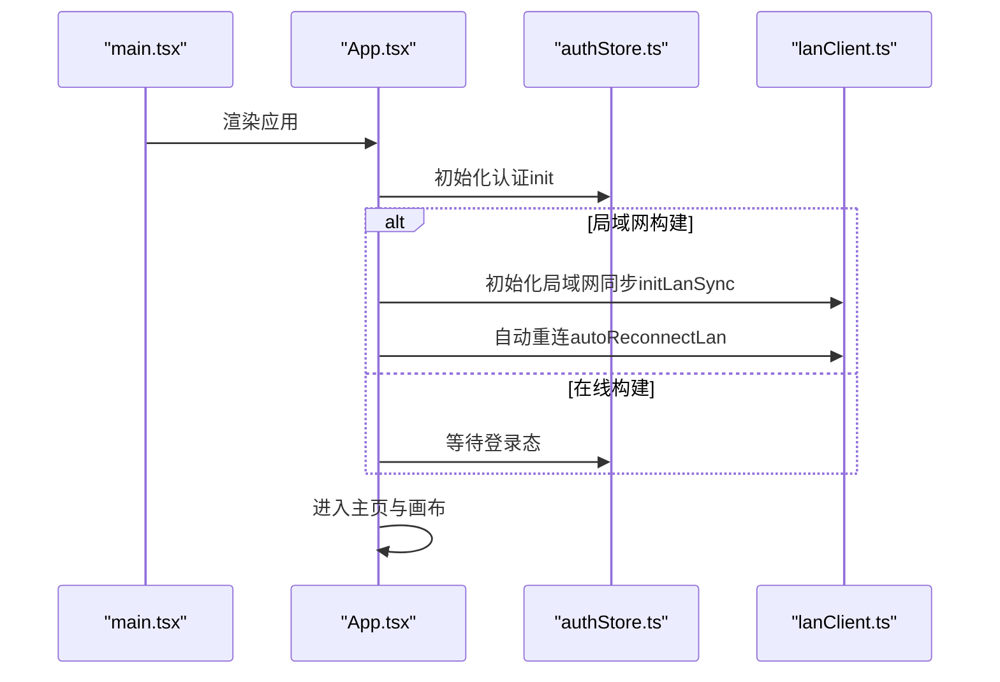
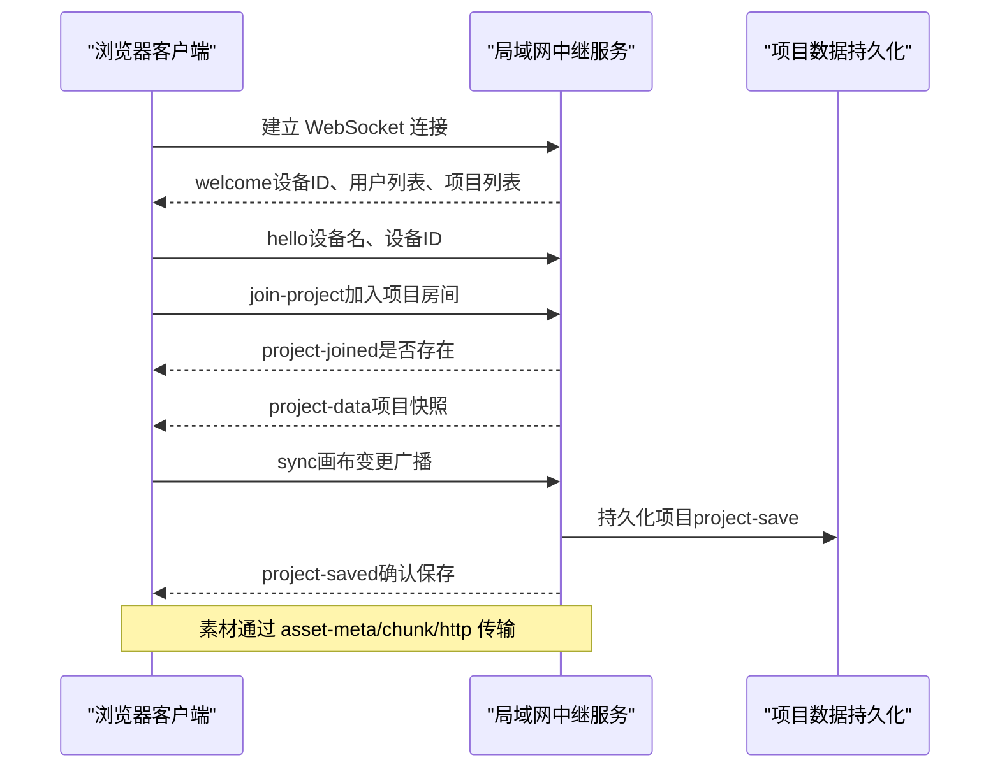
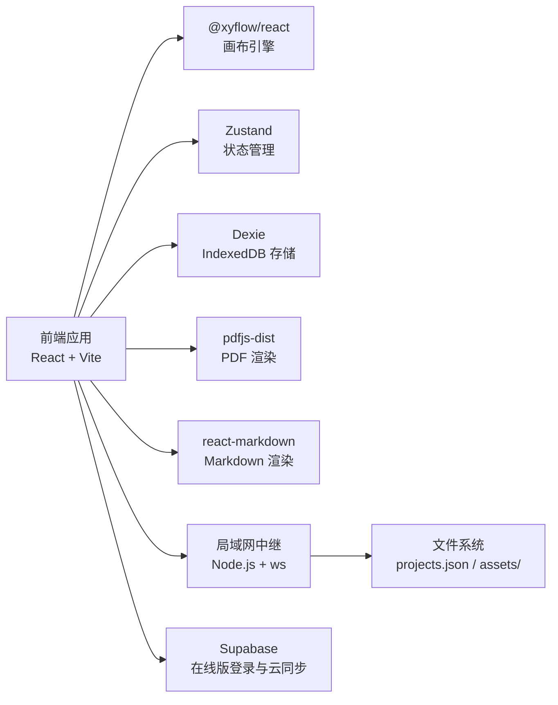

# 快速开始

<cite>
**本文引用的文件**
- [package.json](file://package.json)
- [README.md](file://README.md)
- [vite.config.ts](file://vite.config.ts)
- [src/buildMode.ts](file://src/buildMode.ts)
- [src/main.tsx](file://src/main.tsx)
- [src/App.tsx](file://src/App.tsx)
- [scripts/build.mjs](file://scripts/build.mjs)
- [server/lan-server.mjs](file://server/lan-server.mjs)
- [scripts/start-lan.ps1](file://scripts/start-lan.ps1)
- [start-lan.bat](file://start-lan.bat)
- [src/sync/lanClient.ts](file://src/sync/lanClient.ts)
- [src/store/authStore.ts](file://src/store/authStore.ts)
- [supabase/schema.sql](file://supabase/schema.sql)
</cite>

## 目录
1. [简介](#简介)
2. [项目结构](#项目结构)
3. [核心组件](#核心组件)
4. [架构总览](#架构总览)
5. [详细组件分析](#详细组件分析)
6. [依赖关系分析](#依赖关系分析)
7. [性能注意事项](#性能注意事项)
8. [故障排除指南](#故障排除指南)
9. [结论](#结论)
10. [附录](#附录)

## 简介
SuQCanvas 是一款基于浏览器的无限画布应用，支持将图片、视频、音频、PDF、Markdown、文本等媒体拖入同一张画布并用连线组织关系。应用提供两种运行模式：
- 在线版：通过 Supabase 登录与云同步，适合个人云端协作与跨设备访问。
- 局域网版：无需登录，首次填写中继地址和设备名称即可进入画布；项目按房间实时协作并持久化到运行中继服务的局域网主机。

本指南聚焦于“最短时间内成功运行并体验核心功能”，涵盖环境准备、安装步骤、开发服务器启动、构建模式差异、首次运行配置以及常见问题排查。

## 项目结构
仓库采用模块化组织，前端使用 React + TypeScript + Vite，状态管理使用 Zustand，本地存储使用 Dexie（IndexedDB），画布引擎使用 @xyflow/react。后端协作服务由 Node.js 提供的 WebSocket 中继实现，负责项目数据持久化、素材缓存与流式拉取。

图表来源
- [vite.config.ts:6-16](file://vite.config.ts#L6-L16)
- [server/lan-server.mjs:13-24](file://server/lan-server.mjs#L13-L24)
- [scripts/build.mjs:17-20](file://scripts/build.mjs#L17-L20)

章节来源
- [package.json:1-52](file://package.json#L1-L52)
- [README.md:28-60](file://README.md#L28-L60)
- [vite.config.ts:6-16](file://vite.config.ts#L6-L16)

## 核心组件
- 应用入口与初始化：main.tsx 渲染 App，App 根据构建目标决定是否初始化局域网同步与自动重连。
- 构建模式开关：buildMode.ts 暴露 IS_LAN_BUILD / IS_ONLINE_BUILD，用于在运行时裁剪功能分支。
- 认证与游客模式：authStore.ts 处理 Supabase 登录或游客模式，并在局域网构建时读取已保存的中继配置。
- 局域网客户端：lanClient.ts 负责连接中继、加入项目房间、同步画布与素材、断线重连与自动恢复。
- 局域网服务端：lan-server.mjs 提供 HTTP 静态资源与资产流式拉取，WebSocket 消息路由、项目持久化与清理维护。

章节来源
- [src/main.tsx:1-6](file://src/main.tsx#L1-L6)
- [src/App.tsx:19-30](file://src/App.tsx#L19-L30)
- [src/buildMode.ts:1-8](file://src/buildMode.ts#L1-L8)
- [src/store/authStore.ts:49-65](file://src/store/authStore.ts#L49-L65)
- [src/sync/lanClient.ts:19-57](file://src/sync/lanClient.ts#L19-L57)
- [server/lan-server.mjs:13-24](file://server/lan-server.mjs#L13-L24)

## 架构总览
下图展示了在线版与局域网版的整体交互流程，包括开发服务器、浏览器、中继服务与云服务之间的调用关系。

图表来源
- [package.json:6-20](file://package.json#L6-L20)
- [src/App.tsx:25-30](file://src/App.tsx#L25-L30)
- [src/sync/lanClient.ts:254-362](file://src/sync/lanClient.ts#L254-L362)
- [server/lan-server.mjs:449-451](file://server/lan-server.mjs#L449-L451)

## 详细组件分析

### 环境准备与安装
- Node.js 版本要求：Windows 一键包脚本提示需要 Node.js 20 或更高版本。若未检测到 Node，会提示安装后重试。
- 浏览器兼容性：HTTPS 页面只能使用 WSS 协议连接中继；HTTP 页面默认直连 ws://当前主机:8790。生产环境建议通过反向代理将 wss://域名/lan-ws 转发至中继。
- 安装依赖：在项目根目录执行 npm install。
- 开发服务器启动：
  - 在线版：npm run dev
  - 局域网版：npm run dev:lan（以 lan 模式启动并绑定 0.0.0.0，便于局域网访问）

章节来源
- [scripts/start-lan.ps1:11-14](file://scripts/start-lan.ps1#L11-L14)
- [src/sync/lanClient.ts:47-57](file://src/sync/lanClient.ts#L47-L57)
- [package.json:6-20](file://package.json#L6-L20)
- [README.md:28-39](file://README.md#L28-L39)

### 构建模式差异与使用场景
- 在线版（Supabase 云同步）：
  - 特点：支持账号登录、云端项目与素材元数据同步，不含局域网协作入口。
  - 构建命令：npm run build:online（输出 dist/）。
  - 环境变量：构建脚本会检查 VITE_SUPABASE_URL 与 VITE_SUPABASE_ANON_KEY，缺失时会给出警告。
- 局域网版（本地协作）：
  - 特点：无需登录，首次填写中继地址与设备名称进入画布；项目按房间实时协作并持久化到中继主机。
  - 构建命令：npm run build:lan（输出 dist-lan/）。
  - 环境变量：可通过 .env.lan 设置 VITE_BUILD_TARGET=lan；也可设置 VITE_LAN_WS_URL 覆盖默认中继地址。
- 全部构建：npm run build:all 或交互式选择。

章节来源
- [scripts/build.mjs:17-52](file://scripts/build.mjs#L17-L52)
- [src/buildMode.ts:1-8](file://src/buildMode.ts#L1-L8)
- [README.md:40-57](file://README.md#L40-L57)

### 首次运行配置说明
- 在线版首次运行：
  - 需在 .env.online.local 中配置 Supabase 的 URL 与匿名密钥（该文件已被 git 忽略，避免提交敏感信息）。
  - 若未配置，构建时会发出警告，在线登录与云同步不可用。
- 局域网版首次运行：
  - 打开应用后会提示填写中继地址与协作名称；默认会根据页面协议填充 ws:// 或 wss:// 地址。
  - 连接成功后会记住配置，之后自动重连；可通过工具栏右上角“局域网”面板断开/重连。
  - Windows 一键包首次启动会请求防火墙放行 TCP 8790 端口，以便局域网内其他设备访问。
- 反向代理配置（生产环境 HTTPS）：
  - 站点域名下反向代理 /lan-ws 到 127.0.0.1:8790，并启用 WebSocket 升级头。
  - 如需自定义构建时的默认中继地址，可在 .env.lan 中设置 VITE_LAN_WS_URL 后重新构建。

章节来源
- [scripts/build.mjs:31-52](file://scripts/build.mjs#L31-L52)
- [src/sync/lanClient.ts:19-57](file://src/sync/lanClient.ts#L19-L57)
- [scripts/start-lan.ps1:16-31](file://scripts/start-lan.ps1#L16-L31)
- [README.md:62-123](file://README.md#L62-L123)

### 开发服务器与预览
- 开发模式：
  - 在线版：npm run dev（默认模式）。
  - 局域网版：npm run dev:lan（lan 模式，host 0.0.0.0）。
- 生产预览：
  - 在线版：npm run preview（预览 dist/ 下的构建产物）。
- Vite 开发代理：
  - 开发服务器将 /lan-ws 代理到 ws://127.0.0.1:8790，便于本地调试局域网协作。

章节来源
- [package.json:6-20](file://package.json#L6-L20)
- [vite.config.ts:6-16](file://vite.config.ts#L6-L16)
- [README.md:28-54](file://README.md#L28-L54)

### 应用启动流程（代码级）

图表来源
- [src/main.tsx:1-6](file://src/main.tsx#L1-L6)
- [src/App.tsx:19-30](file://src/App.tsx#L19-L30)
- [src/store/authStore.ts:49-65](file://src/store/authStore.ts#L49-L65)
- [src/sync/lanClient.ts:398-407](file://src/sync/lanClient.ts#L398-L407)

### 局域网协作流程（代码级）

图表来源
- [src/sync/lanClient.ts:254-362](file://src/sync/lanClient.ts#L254-L362)
- [server/lan-server.mjs:661-728](file://server/lan-server.mjs#L661-L728)

### 在线版数据库初始化（Supabase）
- 在 Supabase 控制台 SQL Editor 中执行 schema.sql，创建 projects 与 assets 表，启用行级安全策略，确保每个用户仅能读写自己的数据。
- 媒体文件实际存储在阿里云 OSS，assets 表仅保存元数据（如 MIME、大小、OSS key 等）。

章节来源
- [supabase/schema.sql:1-90](file://supabase/schema.sql#L1-L90)

## 依赖关系分析
- 前端依赖：React、Zustand、@xyflow/react、pdfjs-dist、react-markdown、Tailwind CSS 等。
- 后端依赖：Node.js ws 库实现 WebSocket 通信，fs/promises 进行文件操作，crypto 生成哈希与 UUID。
- 构建与开发：Vite 作为开发与构建工具，TypeScript 编译，oxlint 代码检查，vitest 测试。

图表来源
- [package.json:22-49](file://package.json#L22-L49)
- [server/lan-server.mjs:4-24](file://server/lan-server.mjs#L4-L24)

章节来源
- [package.json:22-49](file://package.json#L22-L49)
- [server/lan-server.mjs:4-24](file://server/lan-server.mjs#L4-L24)

## 性能注意事项
- 大文件传输优化：
  - 局域网中继对视频类资产优先返回 HTTP Range 流式拉取地址，避免整份经 WebSocket 下发导致带宽占用过高。
  - 分片大小设置为 262143 字节（Base64 对齐边界），减少内存峰值与拼接开销。
- 内存与堆限制：
  - Windows 一键包脚本会设置 NODE_OPTIONS 的 --max-old-space-size=8192，提升 Node 堆上限以应对大资产或多客户端并发。
- 维护任务：
  - 定期清理超过 24 小时未被引用的素材与过期备份，防止磁盘膨胀。

章节来源
- [server/lan-server.mjs:107-205](file://server/lan-server.mjs#L107-L205)
- [server/lan-server.mjs:613-659](file://server/lan-server.mjs#L613-L659)
- [scripts/start-lan.ps1:38-43](file://scripts/start-lan.ps1#L38-L43)
- [src/sync/lanClient.ts:10-12](file://src/sync/lanClient.ts#L10-L12)

## 故障排除指南
- 无法连接局域网中继：
  - 检查页面协议与中继协议匹配：HTTPS 页面必须使用 wss://；HTTP 页面默认 ws://当前主机:8790。
  - 生产环境需配置反向代理将 /lan-ws 转发到 127.0.0.1:8790，并确保 WebSocket 升级头正确。
  - 若使用宝塔等面板部署，注意 Nginx 配置中的 proxy_http_version、Upgrade、Connection 等头部。
- 构建警告：
  - 在线版缺少 VITE_SUPABASE_URL / VITE_SUPABASE_ANON_KEY 会导致登录与云同步不可用，请在 .env.online.local 中补充。
- 防火墙与端口：
  - Windows 一键包首次启动会请求放行 TCP 8790 端口；若被拦截，局域网内其他设备无法访问。
  - 可使用 npm run lan:open 打开防火墙规则（Windows）。
- 素材加载失败：
  - 视频封面抓帧需要跨域读取，确保中继返回 CORS 头；Nginx 反代时需保留 Access-Control-Allow-Origin。
  - 若资产缺失，客户端会向中继请求缺失素材；中继会在项目保存后主动请求缺失资产。
- 项目删除权限：
  - 只有项目创建者（主机）可删除项目；非创建者尝试删除会收到拒绝提示。

章节来源
- [src/sync/lanClient.ts:19-57](file://src/sync/lanClient.ts#L19-L57)
- [scripts/build.mjs:43-52](file://scripts/build.mjs#L43-L52)
- [scripts/start-lan.ps1:16-31](file://scripts/start-lan.ps1#L16-L31)
- [README.md:62-123](file://README.md#L62-L123)
- [server/lan-server.mjs:731-757](file://server/lan-server.mjs#L731-L757)

## 结论
通过以上步骤，您可以在最短时间内完成 SuQCanvas 的环境准备、安装与启动，并根据需求选择在线版或局域网版进行体验与部署。在线版适合云端协作与跨设备访问，局域网版适合团队本地协作与私有化部署。遇到问题时，可参考故障排除指南逐步定位与解决。

## 附录
- 常用命令速查：
  - 安装依赖：npm install
  - 开发服务器（在线版）：npm run dev
  - 开发服务器（局域网版）：npm run dev:lan
  - 构建在线版：npm run build:online
  - 构建局域网版：npm run build:lan
  - 构建全部：npm run build:all
  - 预览生产构建：npm run preview
  - 启动局域网中继：npm run lan
  - 打开防火墙（Windows）：npm run lan:open
- 环境变量参考：
  - VITE_BUILD_TARGET：构建目标（lan 或 online）
  - VITE_SUPABASE_URL / VITE_SUPABASE_ANON_KEY：在线版 Supabase 配置
  - VITE_LAN_WS_URL：局域网版默认中继地址（可选）
  - PORT：中继服务端口（默认 8790）
  - LAN_DATA_DIR：局域网数据目录（默认 server/data）

章节来源
- [package.json:6-20](file://package.json#L6-L20)
- [scripts/build.mjs:31-52](file://scripts/build.mjs#L31-L52)
- [README.md:28-74](file://README.md#L28-L74)