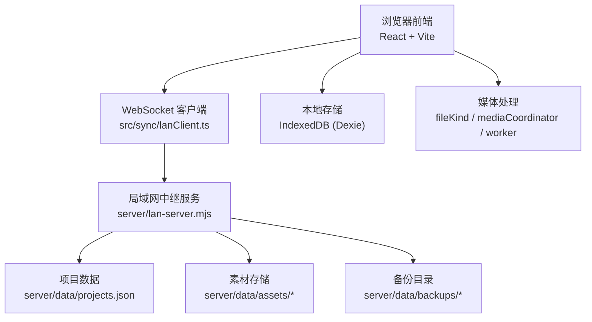
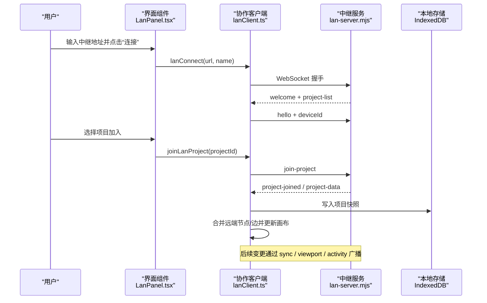
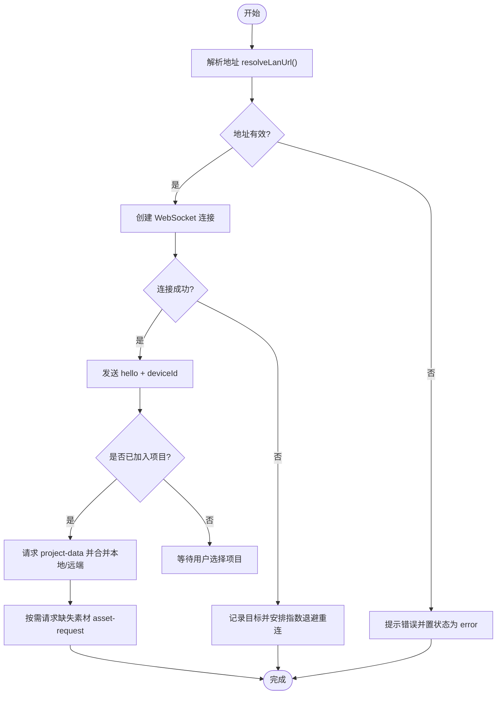
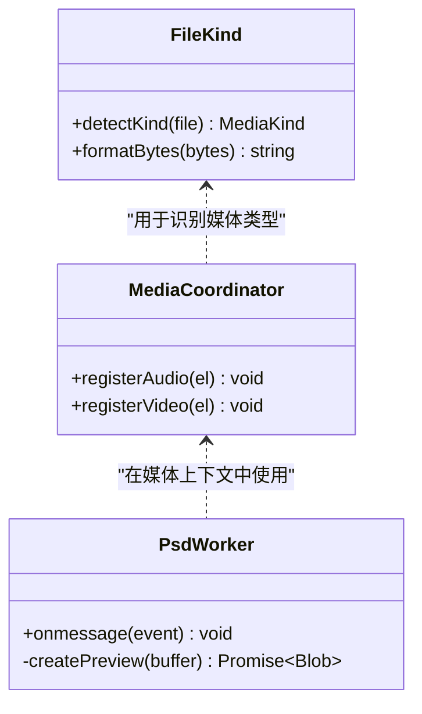
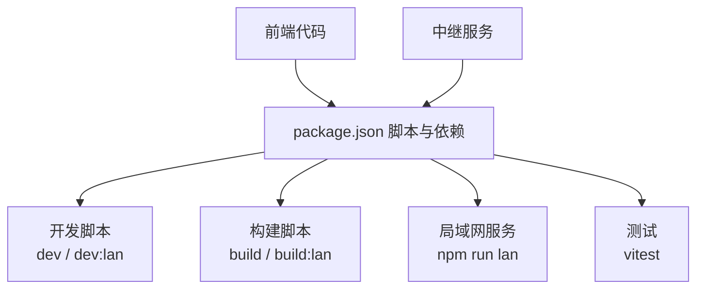

# 故障排除

<cite>
**本文引用的文件**
- [README.md](file://README.md)
- [package.json](file://package.json)
- [src/main.tsx](file://src/main.tsx)
- [src/App.tsx](file://src/App.tsx)
- [server/lan-server.mjs](file://server/lan-server.mjs)
- [src/sync/lanClient.ts](file://src/sync/lanClient.ts)
- [src/components/LanPanel.tsx](file://src/components/LanPanel.tsx)
- [src/components/Toasts.tsx](file://src/components/Toasts.tsx)
- [src/media/fileKind.ts](file://src/media/fileKind.ts)
- [src/media/mediaCoordinator.ts](file://src/media/mediaCoordinator.ts)
- [src/media/psdPreview.worker.ts](file://src/media/psdPreview.worker.ts)
- [src/store/lanStore.ts](file://src/store/lanStore.ts)
</cite>

## 目录
1. [简介](#简介)
2. [项目结构](#项目结构)
3. [核心组件](#核心组件)
4. [架构总览](#架构总览)
5. [详细组件分析](#详细组件分析)
6. [依赖关系分析](#依赖关系分析)
7. [性能注意事项](#性能注意事项)
8. [故障排除指南](#故障排除指南)
9. [结论](#结论)
10. [附录](#附录)

## 简介
本指南面向安装、构建、运行与协作过程中的常见问题，提供系统化的排查步骤与解决方案。重点覆盖：
- 安装与构建问题（依赖、脚本、环境变量）
- 运行时异常（页面加载失败、状态卡住）
- 局域网协作问题（连接失败、重连、权限、同步异常）
- 媒体文件处理（格式识别、解码失败、内存溢出）
- 性能问题（渲染卡顿、内存泄漏、网络延迟）
- 错误日志分析与调试技巧
- 社区支持与获取帮助渠道

## 项目结构
SuQCanvas 由前端 React 应用与可选的局域网中继服务组成。前端负责画布编辑、媒体播放、本地存储与协作客户端；中继服务负责 WebSocket 消息路由、项目持久化、素材分片传输与 HTTP 流式拉取。



图表来源
- [src/App.tsx:1-74](file://src/App.tsx#L1-L74)
- [src/sync/lanClient.ts:254-362](file://src/sync/lanClient.ts#L254-L362)
- [server/lan-server.mjs:1-120](file://server/lan-server.mjs#L1-L120)

章节来源
- [README.md:28-123](file://README.md#L28-L123)
- [package.json:6-20](file://package.json#L6-L20)

## 核心组件
- 应用入口与初始化：主入口挂载根节点，App 根据构建模式决定是否初始化局域网协作与自动重连。
- 局域网协作：客户端负责地址解析、连接、断线重连、房间加入、画布与视口同步、活动通知、素材请求与接收。
- 中继服务：提供 HTTP 静态资源与素材流式拉取、WebSocket 消息分发、项目持久化、资产垃圾回收与备份恢复。
- 媒体处理：文件类型识别、全局媒体互斥、PSD 预览 Worker 限制尺寸与内存。

章节来源
- [src/main.tsx:1-6](file://src/main.tsx#L1-L6)
- [src/App.tsx:19-38](file://src/App.tsx#L19-L38)
- [src/sync/lanClient.ts:19-57](file://src/sync/lanClient.ts#L19-L57)
- [server/lan-server.mjs:449-451](file://server/lan-server.mjs#L449-L451)
- [src/media/fileKind.ts:3-16](file://src/media/fileKind.ts#L3-L16)
- [src/media/mediaCoordinator.ts:1-25](file://src/media/mediaCoordinator.ts#L1-L25)
- [src/media/psdPreview.worker.ts:1-39](file://src/media/psdPreview.worker.ts#L1-L39)

## 架构总览
下图展示从用户操作到协作同步的关键流程，包括连接建立、项目加入、画布同步与素材传输。



图表来源
- [src/components/LanPanel.tsx:41-50](file://src/components/LanPanel.tsx#L41-L50)
- [src/sync/lanClient.ts:254-362](file://src/sync/lanClient.ts#L254-L362)
- [src/sync/lanClient.ts:410-642](file://src/sync/lanClient.ts#L410-L642)
- [server/lan-server.mjs:661-728](file://server/lan-server.mjs#L661-L728)

## 详细组件分析

### 局域网协作客户端（连接、重连、同步）
- 地址解析：支持相对路径与协议转换，HTTPS 页面强制使用 wss。
- 连接生命周期：onopen/onerror/onclose 统一设置状态、保存配置、触发重连。
- 房间与会话：join-project/leave-project 控制房间范围，仅同项目内广播。
- 画布同步：按 id 并集合并节点与边，显式删除通过 sync-del 传播，墓碑机制避免复活旧快照。
- 素材传输：asset-meta/chunk/http/thumb 组合策略，视频优先走 HTTP Range 流式拉取，减少带宽占用。



图表来源
- [src/sync/lanClient.ts:19-57](file://src/sync/lanClient.ts#L19-L57)
- [src/sync/lanClient.ts:254-362](file://src/sync/lanClient.ts#L254-L362)
- [src/sync/lanClient.ts:410-642](file://src/sync/lanClient.ts#L410-L642)

章节来源
- [src/sync/lanClient.ts:19-57](file://src/sync/lanClient.ts#L19-L57)
- [src/sync/lanClient.ts:254-362](file://src/sync/lanClient.ts#L254-L362)
- [src/sync/lanClient.ts:410-642](file://src/sync/lanClient.ts#L410-L642)
- [src/store/lanStore.ts:53-89](file://src/store/lanStore.ts#L53-L89)

### 局域网中继服务（HTTP 与 WebSocket）
- 启动与端口：默认监听 8790，读取环境变量 PORT 与 LAN_DATA_DIR。
- 静态资源与反代：/SuQCanvas/ 前缀路由，HTML 无缓存，其他静态资源带缓存。
- 素材流式拉取：支持 Range 头，返回 206 分段响应，附带 CORS 头以便跨域抓帧。
- 项目持久化：projects.json 聚合所有项目，删除时先备份再清理，维护任务定时清理过期备份与孤儿素材。
- 资产分片上传：按 index 乱序写入临时文件，完成后原子替换，避免并发写冲突。

```mermaid
graph LR
Client["浏览器"] --> |GET /SuQCanvas/assets/{id}| Srv["中继服务"]
Srv --> |206 Partial Content| Client
Client --> |WS 消息| Srv
Srv --> |project-list / users| Client
Srv --> |sync / viewport / activity| Client
Srv --> |asset-meta / chunk / http / thumb| Client
Srv --> |projects.json / assets/*| Disk["磁盘存储"]
```

图表来源
- [server/lan-server.mjs:291-372](file://server/lan-server.mjs#L291-L372)
- [server/lan-server.mjs:374-447](file://server/lan-server.mjs#L374-L447)
- [server/lan-server.mjs:503-553](file://server/lan-server.mjs#L503-L553)
- [server/lan-server.mjs:661-728](file://server/lan-server.mjs#L661-L728)

章节来源
- [server/lan-server.mjs:13-24](file://server/lan-server.mjs#L13-L24)
- [server/lan-server.mjs:291-372](file://server/lan-server.mjs#L291-L372)
- [server/lan-server.mjs:374-447](file://server/lan-server.mjs#L374-L447)
- [server/lan-server.mjs:503-553](file://server/lan-server.mjs#L503-L553)
- [server/lan-server.mjs:661-728](file://server/lan-server.mjs#L661-L728)

### 媒体处理与预览
- 文件类型识别：基于 MIME 与扩展名判断 image/video/audio/pdf/markdown/text/psd/file。
- 媒体互斥：同一时刻最多一个音频和一个视频同时播放，新播放自动暂停同类其他元素。
- PSD 预览限制：Worker 中限制文档最大边长、像素数与解码内存，防止大文件导致崩溃。



图表来源
- [src/media/fileKind.ts:3-16](file://src/media/fileKind.ts#L3-L16)
- [src/media/mediaCoordinator.ts:1-25](file://src/media/mediaCoordinator.ts#L1-L25)
- [src/media/psdPreview.worker.ts:1-39](file://src/media/psdPreview.worker.ts#L1-L39)

章节来源
- [src/media/fileKind.ts:3-16](file://src/media/fileKind.ts#L3-L16)
- [src/media/mediaCoordinator.ts:1-25](file://src/media/mediaCoordinator.ts#L1-L25)
- [src/media/psdPreview.worker.ts:1-39](file://src/media/psdPreview.worker.ts#L1-L39)

## 依赖关系分析
- 前端依赖：React、Zustand、@xyflow/react、Dexie、pdfjs-dist、react-markdown、ws（测试）、vitest（测试）。
- 服务端依赖：ws、ali-oss（云同步场景）、ag-psd（PSD 预览）、fflate（打包导出）。
- 构建脚本：Vite 开发/生产构建、TypeScript 编译、复制 pdfjs 资源、局域网包打包。



图表来源
- [package.json:6-20](file://package.json#L6-L20)
- [package.json:22-49](file://package.json#L22-L49)

章节来源
- [package.json:6-20](file://package.json#L6-L20)
- [package.json:22-49](file://package.json#L22-L49)

## 性能注意事项
- 媒体播放互斥：避免多音/多视频同时播放造成 CPU/GPU 压力。
- 大文件预览限制：PSD 预览有尺寸与内存上限，超大文件会降级或报错。
- 素材传输优化：视频优先走 HTTP Range 流式拉取，减少 WebSocket 全量传输与重复下载。
- 渲染节流：画布同步与视口广播采用防抖，降低频繁更新带来的抖动。
- 本地存储：IndexedDB 自动保存，注意大项目频繁保存可能带来 I/O 压力。

[本节为通用指导，不直接分析具体文件]

## 故障排除指南

### 一、安装与构建问题
- 现象
  - npm install 失败或版本不兼容
  - 构建时报错或产物缺失
  - 预览无法访问
- 排查步骤
  - 确认 Node 与 npm 版本满足要求（参考依赖与脚本）
  - 执行预构建脚本以复制 pdfjs 资源
  - 分别尝试在线版与局域网版构建
  - 检查 .env 配置与构建目标变量
- 常见原因与解决
  - 未执行 predev/predev:lan 导致 pdfjs 资源缺失
  - 构建目标与环境变量不匹配
  - 依赖缓存异常，可清理后重装
- 相关位置
  - 脚本定义与依赖：[package.json:6-20](file://package.json#L6-L20), [package.json:22-49](file://package.json#L22-L49)
  - 构建说明与产物路径：[README.md:40-56](file://README.md#L40-L56)

章节来源
- [package.json:6-20](file://package.json#L6-L20)
- [package.json:22-49](file://package.json#L22-L49)
- [README.md:40-56](file://README.md#L40-L56)

### 二、运行时异常
- 现象
  - 页面白屏或加载中卡住
  - 应用进入 AuthPage 无法进入画布
- 排查步骤
  - 检查主入口是否正确挂载根节点
  - 检查 App 初始化流程与构建模式标志
  - 查看控制台错误与 Toast 提示
- 常见原因与解决
  - 构建模式不正确导致功能分支未启用
  - 第三方库加载失败或 CSP 拦截
- 相关位置
  - 主入口挂载：[src/main.tsx:1-6](file://src/main.tsx#L1-L6)
  - 应用初始化与加载态：[src/App.tsx:19-47](file://src/App.tsx#L19-L47)

章节来源
- [src/main.tsx:1-6](file://src/main.tsx#L1-L6)
- [src/App.tsx:19-47](file://src/App.tsx#L19-L47)

### 三、局域网协作问题

#### 1. 连接失败
- 现象
  - 无法连接中继，状态停留在 error
  - HTTPS 页面无法连接 ws://
- 排查步骤
  - 校验地址格式与协议（wss/ws），相对路径需浏览器环境
  - 检查反向代理是否将 /lan-ws 正确转发至 8790
  - 确认防火墙放行端口或代理规则生效
- 常见原因与解决
  - 地址无效或协议不匹配（HTTPS 必须 wss）
  - 反向代理缺少 Upgrade/Connection 头或超时过短
  - 服务器未启动或未监听 0.0.0.0
- 相关位置
  - 地址解析与校验：[src/sync/lanClient.ts:19-57](file://src/sync/lanClient.ts#L19-L57)
  - 连接生命周期与错误提示：[src/sync/lanClient.ts:254-362](file://src/sync/lanClient.ts#L254-L362)
  - 中继监听与静态资源路由：[server/lan-server.mjs:449-451](file://server/lan-server.mjs#L449-L451), [server/lan-server.mjs:374-447](file://server/lan-server.mjs#L374-L447)
  - 部署与反代示例：[README.md:98-122](file://README.md#L98-L122)

章节来源
- [src/sync/lanClient.ts:19-57](file://src/sync/lanClient.ts#L19-L57)
- [src/sync/lanClient.ts:254-362](file://src/sync/lanClient.ts#L254-L362)
- [server/lan-server.mjs:449-451](file://server/lan-server.mjs#L449-L451)
- [server/lan-server.mjs:374-447](file://server/lan-server.mjs#L374-L447)
- [README.md:98-122](file://README.md#L98-L122)

#### 2. 自动重连与断线恢复
- 现象
  - 网络波动后自动重连
  - 重连后项目数据不一致
- 排查步骤
  - 观察状态变化与 Toast 提示
  - 检查重连目标与指数退避逻辑
  - 确认重连后是否拉取 project-data 并对账
- 相关位置
  - 重连调度与状态管理：[src/sync/lanClient.ts:119-152](file://src/sync/lanClient.ts#L119-L152)
  - onclose 中的重连触发与状态清理：[src/sync/lanClient.ts:321-343](file://src/sync/lanClient.ts#L321-L343)

章节来源
- [src/sync/lanClient.ts:119-152](file://src/sync/lanClient.ts#L119-L152)
- [src/sync/lanClient.ts:321-343](file://src/sync/lanClient.ts#L321-L343)

#### 3. 权限问题（删除项目）
- 现象
  - 非创建者删除项目被拒绝
- 排查步骤
  - 确认设备 ID 与 creatorId 是否一致
  - 查看服务端返回的拒绝消息
- 相关位置
  - 删除权限校验与提示：[server/lan-server.mjs:731-757](file://server/lan-server.mjs#L731-L757), [src/sync/lanClient.ts:505-508](file://src/sync/lanClient.ts#L505-L508)

章节来源
- [server/lan-server.mjs:731-757](file://server/lan-server.mjs#L731-L757)
- [src/sync/lanClient.ts:505-508](file://src/sync/lanClient.ts#L505-L508)

#### 4. 同步异常（节点/连线不一致）
- 现象
  - 多人编辑后出现重复节点或误删
  - 删除后仍显示旧节点
- 排查步骤
  - 检查 sync 合并逻辑与墓碑机制
  - 确认 sync-del 是否及时广播
  - 核对项目更新时间戳与本地快照
- 相关位置
  - 并集合并与墓碑：[src/sync/lanClient.ts:70-94](file://src/sync/lanClient.ts#L70-L94), [src/sync/lanClient.ts:527-598](file://src/sync/lanClient.ts#L527-L598)
  - 删除批量合并与广播：[src/sync/lanClient.ts:96-117](file://src/sync/lanClient.ts#L96-L117)

章节来源
- [src/sync/lanClient.ts:70-94](file://src/sync/lanClient.ts#L70-L94)
- [src/sync/lanClient.ts:96-117](file://src/sync/lanClient.ts#L96-L117)
- [src/sync/lanClient.ts:527-598](file://src/sync/lanClient.ts#L527-L598)

#### 5. 素材传输失败或卡顿
- 现象
  - 视频封面不显示或播放卡顿
  - 大文件传输中断
- 排查步骤
  - 确认服务器是否返回 asset-http 地址（视频优先 HTTP Range）
  - 检查 asset-meta/asset-chunk/asset-thumb 消息顺序与完整性
  - 查看空闲超时与重试逻辑
- 相关位置
  - 视频流式拉取与分片发送：[server/lan-server.mjs:613-659](file://server/lan-server.mjs#L613-L659)
  - 客户端素材接收与超时：[src/sync/lanClient.ts:154-181](file://src/sync/lanClient.ts#L154-L181), [src/sync/lanClient.ts:619-640](file://src/sync/lanClient.ts#L619-L640)

章节来源
- [server/lan-server.mjs:613-659](file://server/lan-server.mjs#L613-L659)
- [src/sync/lanClient.ts:154-181](file://src/sync/lanClient.ts#L154-L181)
- [src/sync/lanClient.ts:619-640](file://src/sync/lanClient.ts#L619-L640)

### 四、媒体文件处理问题

#### 1. 格式不支持
- 现象
  - 拖入文件显示为文件卡片而非对应节点
- 排查步骤
  - 检查 detectKind 对 MIME 与扩展名的识别
  - 确认浏览器支持的媒体类型
- 相关位置
  - 文件类型识别：[src/media/fileKind.ts:3-16](file://src/media/fileKind.ts#L3-L16)

章节来源
- [src/media/fileKind.ts:3-16](file://src/media/fileKind.ts#L3-L16)

#### 2. 解码失败
- 现象
  - PSD 预览失败或视频无法抓帧
- 排查步骤
  - 检查 PSD 尺寸与内存限制
  - 确认 CORS 头与跨域访问
  - 查看 Worker 错误消息
- 相关位置
  - PSD 预览限制与错误上报：[src/media/psdPreview.worker.ts:1-39](file://src/media/psdPreview.worker.ts#L1-L39)
  - 素材跨域与 Range 支持：[server/lan-server.mjs:326-372](file://server/lan-server.mjs#L326-L372)

章节来源
- [src/media/psdPreview.worker.ts:1-39](file://src/media/psdPreview.worker.ts#L1-L39)
- [server/lan-server.mjs:326-372](file://server/lan-server.mjs#L326-L372)

#### 3. 内存溢出
- 现象
  - 大文件预览导致页面崩溃或卡顿
- 排查步骤
  - 限制预览尺寸与内存
  - 避免整份大文件载入内存，改用流式或分片
  - 监控 Worker 与主线程内存
- 相关位置
  - PSD 预览内存与尺寸限制：[src/media/psdPreview.worker.ts:1-39](file://src/media/psdPreview.worker.ts#L1-L39)
  - 分片传输避免整块内存占用：[server/lan-server.mjs:503-553](file://server/lan-server.mjs#L503-L553)

章节来源
- [src/media/psdPreview.worker.ts:1-39](file://src/media/psdPreview.worker.ts#L1-L39)
- [server/lan-server.mjs:503-553](file://server/lan-server.mjs#L503-L553)

### 五、性能问题诊断与优化

#### 1. 渲染卡顿
- 现象
  - 拖动节点或缩放时掉帧
- 排查步骤
  - 减少不必要的重渲染（选中态剥离）
  - 合并高频同步（防抖）
  - 限制媒体数量与分辨率
- 相关位置
  - 同步防抖与视图广播：[src/sync/lanClient.ts:655-716](file://src/sync/lanClient.ts#L655-L716)
  - 媒体互斥避免多播：[src/media/mediaCoordinator.ts:1-25](file://src/media/mediaCoordinator.ts#L1-L25)

章节来源
- [src/sync/lanClient.ts:655-716](file://src/sync/lanClient.ts#L655-L716)
- [src/media/mediaCoordinator.ts:1-25](file://src/media/mediaCoordinator.ts#L1-L25)

#### 2. 内存泄漏
- 现象
  - 长时间使用内存持续增长
- 排查步骤
  - 检查事件监听器移除（媒体元素注册/注销）
  - 清理定时器与重连计时器
  - 避免保留大对象引用
- 相关位置
  - 媒体元素注册与移除：[src/media/mediaCoordinator.ts:7-21](file://src/media/mediaCoordinator.ts#L7-L21)
  - 重连计时器清理：[src/sync/lanClient.ts:128-136](file://src/sync/lanClient.ts#L128-L136)

章节来源
- [src/media/mediaCoordinator.ts:7-21](file://src/media/mediaCoordinator.ts#L7-L21)
- [src/sync/lanClient.ts:128-136](file://src/sync/lanClient.ts#L128-L136)

#### 3. 网络延迟
- 现象
  - 同步延迟高、素材加载慢
- 排查步骤
  - 检查反向代理超时与缓冲
  - 使用 HTTP Range 流式拉取大文件
  - 合并小消息，减少频繁往返
- 相关位置
  - 反代超时与升级头：[README.md:98-122](file://README.md#L98-L122)
  - 素材 Range 与流式响应：[server/lan-server.mjs:291-372](file://server/lan-server.mjs#L291-L372)

章节来源
- [README.md:98-122](file://README.md#L98-L122)
- [server/lan-server.mjs:291-372](file://server/lan-server.mjs#L291-L372)

### 六、错误日志分析与调试技巧
- 前端提示
  - 使用 Toast 查看错误信息（如地址无效、连接失败）
  - 打开浏览器控制台查看 WebSocket 与网络请求
- 服务端日志
  - 关注中继服务的 console.warn/error 输出
  - 检查项目与素材文件的读写权限与路径
- 调试建议
  - 使用局域网面板查看状态与活动记录
  - 逐步缩小问题范围（仅连接、仅同步、仅素材）
- 相关位置
  - Toast 组件与样式：[src/components/Toasts.tsx:1-24](file://src/components/Toasts.tsx#L1-L24), [src/index.css:318-338](file://src/index.css#L318-L338)
  - 中继服务日志输出：[server/lan-server.mjs:53-63](file://server/lan-server.mjs#L53-L63), [server/lan-server.mjs:121-126](file://server/lan-server.mjs#L121-L126)

章节来源
- [src/components/Toasts.tsx:1-24](file://src/components/Toasts.tsx#L1-L24)
- [src/index.css:318-338](file://src/index.css#L318-L338)
- [server/lan-server.mjs:53-63](file://server/lan-server.mjs#L53-L63)
- [server/lan-server.mjs:121-126](file://server/lan-server.mjs#L121-L126)

### 七、社区支持与获取帮助
- 项目说明与快速开始：阅读 README 中的快速开始、构建与部署说明
- 脚本与命令：通过 package.json 的 scripts 查看可用命令
- 常见问题定位：结合本指南的章节逐项排查
- 相关位置
  - 快速开始与构建：[README.md:28-56](file://README.md#L28-L56)
  - 脚本命令：[package.json:6-20](file://package.json#L6-L20)

章节来源
- [README.md:28-56](file://README.md#L28-L56)
- [package.json:6-20](file://package.json#L6-L20)

## 结论
通过理解前端与中继服务的职责边界、掌握连接与同步的生命周期、熟悉媒体处理的限制与优化策略，大多数安装、构建、运行与协作问题都能快速定位与解决。建议在日常使用中关注 Toast 提示与服务端日志，并结合本指南的分步排查方法，高效恢复服务与提升体验。

## 附录
- 常用命令
  - 开发：npm run dev / npm run dev:lan
  - 构建：npm run build / npm run build:lan
  - 局域网服务：npm run lan
  - 测试：npm test
- 关键路径
  - 项目数据：server/data/projects.json
  - 素材存储：server/data/assets/*
  - 备份目录：server/data/backups/*

[本节为补充信息，不直接分析具体文件]