# IndexedDB 存储

<cite>
**本文引用的文件**
- [src/db/db.ts](file://src/db/db.ts)
- [src/types.ts](file://src/types.ts)
- [src/store/projectStore.ts](file://src/store/projectStore.ts)
- [src/media/blobRegistry.ts](file://src/media/blobRegistry.ts)
- [src/io/fileLoader.ts](file://src/io/fileLoader.ts)
- [src/io/importExport.ts](file://src/io/importExport.ts)
- [src/sync/lanClient.ts](file://src/sync/lanClient.ts)
- [server/lan-server.mjs](file://server/lan-server.mjs)
- [docs/LEARNING.md](file://docs/LEARNING.md)
- [src/store/uploadStore.ts](file://src/store/uploadStore.ts)
- [src/components/FileManagerModal.tsx](file://src/components/FileManagerModal.tsx)
- [src/App.tsx](file://src/App.tsx)
- [src/sync/assetCloudUpload.ts](file://src/sync/assetCloudUpload.ts)
- [src/sync/ossClientImpl.ts](file://src/sync/ossClientImpl.ts)
</cite>

## 更新摘要
**变更内容**
- 新增 AssetRecord 接口的 cloudStatus 字段支持云端上传状态管理
- 实现上传状态持久化机制，支持中断恢复和页面刷新后状态显示
- 添加上传修复机制，处理异常中断的上传任务
- **新增** uploadCheckpoints 表用于存储 OSS 分片上传检查点，支持大文件断点续传
- 增强用户界面以显示云端上传状态和重试功能

## 目录
1. [简介](#简介)
2. [项目结构](#项目结构)
3. [核心组件](#核心组件)
4. [架构总览](#架构总览)
5. [详细组件分析](#详细组件分析)
6. [依赖关系分析](#依赖关系分析)
7. [性能考虑](#性能考虑)
8. [故障排查指南](#故障排查指南)
9. [结论](#结论)
10. [附录：增删改查示例路径](#附录增删改查示例路径)

## 简介
本文件系统性地说明基于 Dexie 的 IndexedDB 存储设计，涵盖数据库初始化、版本与表结构、数据模型（AssetRecord、ProjectRecord）、持久化请求机制（含浏览器存储权限申请与降级策略）、垃圾回收机制（孤立资源检测、保留策略、自动清理），以及新增的云端上传状态管理和 OSS 分片上传断点续传功能。同时提供可落地的增删改查操作参考路径。同时给出性能优化建议与最佳实践，帮助在大型媒体场景下稳定高效地管理本地缓存与离线能力。

## 项目结构
IndexedDB 相关代码主要分布在以下模块：
- 数据库定义与基础能力：src/db/db.ts
- 类型与数据模型：src/types.ts
- 项目管理与自动保存：src/store/projectStore.ts
- 资产 Blob 注册与 URL 管理：src/media/blobRegistry.ts
- 文件加载与文本素材写入：src/io/fileLoader.ts
- 导入导出（打包 assets）：src/io/importExport.ts
- 局域网同步与分片传输落库：src/sync/lanClient.ts
- 云端上传状态管理：src/store/uploadStore.ts
- 云端上传逻辑：src/sync/assetCloudUpload.ts
- OSS 客户端实现（含断点续传）：src/sync/ossClientImpl.ts
- 文件管理器界面：src/components/FileManagerModal.tsx
- 应用启动与状态修复：src/App.tsx
- 局域网服务端维护与持久化：server/lan-server.mjs
- 整体架构说明：docs/LEARNING.md

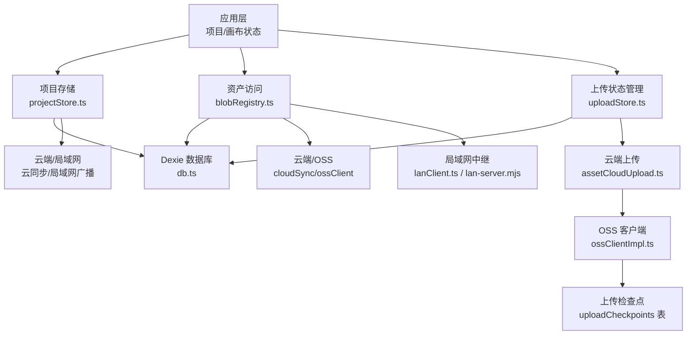

**图表来源**
- [src/store/projectStore.ts:196-228](file://src/store/projectStore.ts#L196-L228)
- [src/media/blobRegistry.ts:84-126](file://src/media/blobRegistry.ts#L84-L126)
- [src/db/db.ts:25-33](file://src/db/db.ts#L25-L33)
- [src/store/uploadStore.ts:25-75](file://src/store/uploadStore.ts#L25-L75)
- [src/sync/assetCloudUpload.ts:15-44](file://src/sync/assetCloudUpload.ts#L15-L44)
- [src/sync/ossClientImpl.ts:145-196](file://src/sync/ossClientImpl.ts#L145-L196)

**章节来源**
- [src/db/db.ts:25-33](file://src/db/db.ts#L25-L33)
- [src/store/projectStore.ts:196-228](file://src/store/projectStore.ts#L196-L228)
- [src/media/blobRegistry.ts:84-126](file://src/media/blobRegistry.ts#L84-L126)

## 核心组件
- 数据库实例与表结构：通过 Dexie 创建名为 suqcanvas 的数据库，定义 assets、projects 和 uploadCheckpoints 三张表，并声明索引字段。
- 数据模型：
  - AssetRecord：记录媒体资源的元数据与二进制内容（Blob），包含可选缩略图、孤立标记时间戳以及云端上传状态。
  - ProjectRecord：记录项目名称、时间戳、画布图（节点与边）以及视口信息。
  - UploadCheckpointRecord：记录 OSS 分片上传的检查点信息，支持断点续传。
- 持久化请求：提供浏览器持久化存储权限申请接口，失败时静默降级。
- 垃圾回收：扫描项目引用，标记或清理孤立资源，支持保留期策略。
- **新增** 云端上传状态管理：跟踪资产的云端上传状态（uploading、failed、done），支持中断恢复和重试机制。
- **新增** OSS 分片上传断点续传：通过 uploadCheckpoints 表持久化上传进度，支持网络中断后的自动恢复。

**章节来源**
- [src/db/db.ts:5-33](file://src/db/db.ts#L5-L33)
- [src/db/db.ts:35-68](file://src/db/db.ts#L35-68)
- [src/types.ts:3-14](file://src/types.ts#L3-L14)
- [src/types.ts:37-44](file://src/types.ts#L37-L44)
- [src/types.ts:66-107](file://src/types.ts#L66-L107)

## 架构总览
前端以 IndexedDB 为本地缓存中心，结合云端（Supabase + OSS）与局域网中继实现多端协同与离线可用。项目数据（画布 JSON）走云端，媒体大文件优先走局域网 HTTP Range 流式播放，必要时回退到本地 Blob 或云端下载。**新增的云端上传状态管理和 OSS 分片上传断点续传功能确保上传过程的可恢复性和用户体验的一致性。**

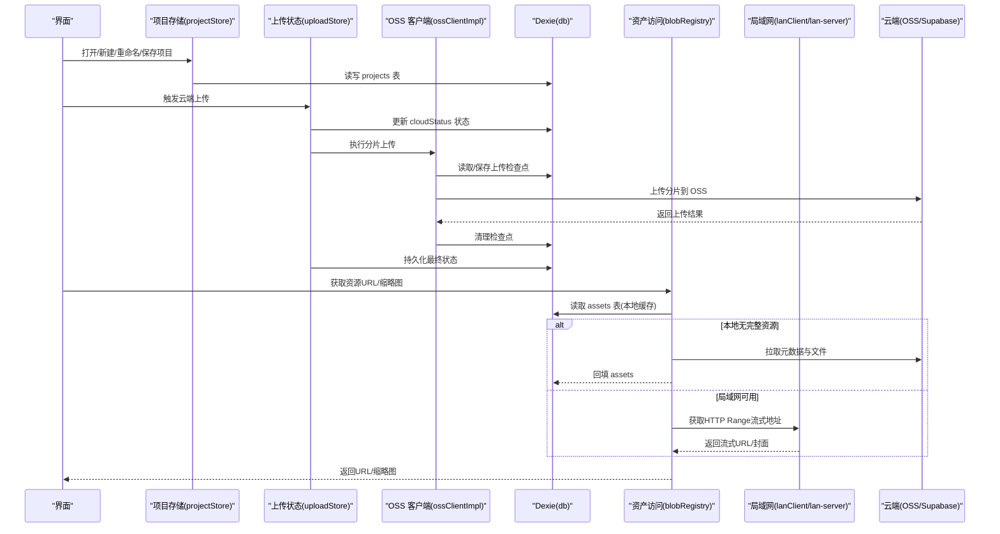

**图表来源**
- [src/store/projectStore.ts:196-228](file://src/store/projectStore.ts#L196-L228)
- [src/store/uploadStore.ts:25-75](file://src/store/uploadStore.ts#L25-L75)
- [src/sync/ossClientImpl.ts:145-196](file://src/sync/ossClientImpl.ts#L145-L196)
- [src/media/blobRegistry.ts:84-126](file://src/media/blobRegistry.ts#L84-L126)
- [src/sync/assetCloudUpload.ts:15-44](file://src/sync/assetCloudUpload.ts#L15-L44)

**章节来源**
- [docs/LEARNING.md:1-25](file://docs/LEARNING.md#L1-L25)

## 详细组件分析

### 数据库初始化与版本管理
- 使用 Dexie 创建数据库 suqcanvas，定义 assets、projects 和 uploadCheckpoints 三张实体表，并为常用查询字段建立索引。
- 通过 version().stores() 声明表结构与索引，便于后续扩展与迁移。
- **新增** uploadCheckpoints 表在第 2 版中添加，用于存储 OSS 分片上传检查点。

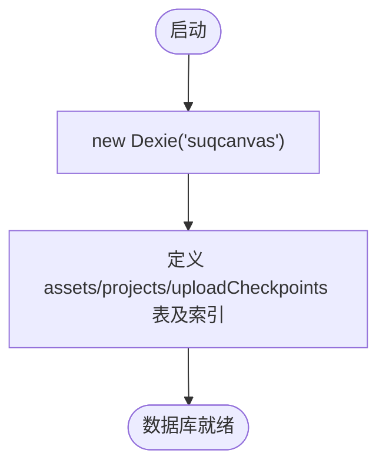

**图表来源**
- [src/db/db.ts:25-33](file://src/db/db.ts#L25-33)
- [src/db/db.ts:57-65](file://src/db/db.ts#L57-L65)

**章节来源**
- [src/db/db.ts:25-33](file://src/db/db.ts#L25-33)
- [src/db/db.ts:57-65](file://src/db/db.ts#L57-L65)

### 数据模型设计与字段含义
- AssetRecord
  - id/name/mime/size/kind：资源标识、名称、MIME、大小、媒体类型（图片/视频/音频/PDF/PSD/Markdown/文本/文件/标题/便签/图形）。
  - blob：原始二进制内容，用于本地缓存与离线播放。
  - thumbnail：可选缩略图，提升列表渲染性能。
  - orphanedAt：孤立标记时间戳，配合垃圾回收策略进行清理。
  - **新增** cloudStatus：云端上传状态，支持 'uploading'（上传中）、'failed'（失败可重试）、'done'（已成功）三种状态。
- ProjectRecord
  - id/name/createdAt/updatedAt：项目标识、名称、创建与更新时间。
  - graph：画布图，包含 nodes 与 edges，对应可视化编辑器中的节点与连线。
  - viewport：视口位置与缩放，保证恢复编辑体验一致。
- **新增** UploadCheckpointRecord
  - assetId：对应 AssetRecord.id，一个素材仅保留一条断点。
  - key：保存时的 OSS object key，与当前不一致则断点作废。
  - fileSize：保存时的文件大小，与当前不一致则断点作废。
  - updatedAt：检查点更新时间戳。
  - checkpoint：ali-oss 分片上传断点数据，包含 name、fileSize、partSize、uploadId 和 doneParts。

**章节来源**
- [src/db/db.ts:5-23](file://src/db/db.ts#L5-L23)
- [src/db/db.ts:30-49](file://src/db/db.ts#L30-L49)
- [src/db/db.ts:17-18](file://src/db/db.ts#L17-L18)
- [src/types.ts:3-14](file://src/types.ts#L3-L14)
- [src/types.ts:37-44](file://src/types.ts#L37-L44)
- [src/types.ts:66-107](file://src/types.ts#L66-L107)

### 持久化存储请求机制与降级处理
- 浏览器持久化存储权限申请：调用 navigator.storage.persist() 尝试申请持久化存储；若不可用或拒绝，则忽略异常并返回 false，不影响后续功能。
- 降级策略：当无法获得持久化权限时，仍可使用 IndexedDB 正常读写，但可能受浏览器配额策略影响；应用层不做强依赖，确保可用性。

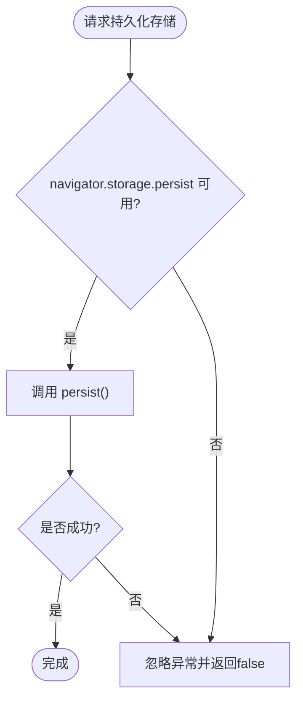

**图表来源**
- [src/db/db.ts:67-76](file://src/db/db.ts#L67-L76)

**章节来源**
- [src/db/db.ts:67-76](file://src/db/db.ts#L67-L76)

### 垃圾回收机制：孤立资源检测、保留策略、自动清理
- 孤立资源检测：遍历所有项目，收集被节点引用的 assetId（包括主资源与封面资源 coverAssetId）。
- 保留策略：对未被任何项目引用的资源，首次发现时设置 orphanedAt 为当前时间；超过保留时长（默认 24 小时）后删除该资源。
- 自动清理：gcAssets 定期执行，既清理过期孤立资源，也清除已重新被引用的资源的孤立标记。
- **新增** 关联清理：删除孤立资源时同时清理对应的上传检查点，避免残留数据占用空间。

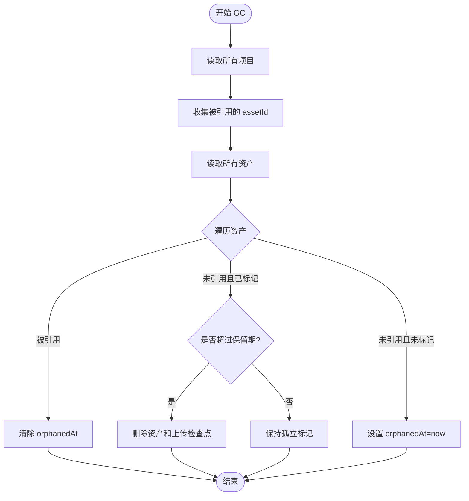

**图表来源**
- [src/db/db.ts:80-101](file://src/db/db.ts#L80-L101)

**章节来源**
- [src/db/db.ts:80-101](file://src/db/db.ts#L80-L101)

### 云端上传状态管理机制
**新增功能** 云端上传状态管理确保上传过程的可靠性和用户体验：

- **状态定义**：CloudUploadState 枚举包含 'uploading'（上传中）、'failed'（失败可重试）、'done'（已成功）三种状态。
- **状态持久化**：上传过程中实时更新 cloudStatus 字段到 IndexedDB，确保页面刷新后状态可恢复。
- **中断恢复**：应用启动时检查残留的 uploading 状态，将其修复为 failed 状态以便用户重试。
- **进度追踪**：实时显示上传进度，支持节流避免频繁重渲染。
- **用户界面**：文件管理器中显示上传状态，支持失败重试和成功提示。

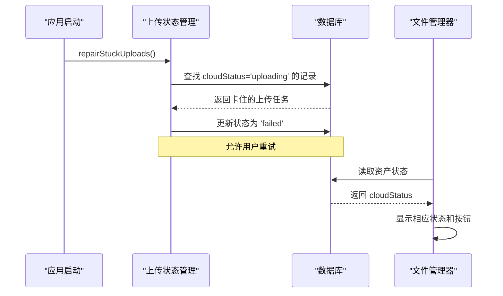

**图表来源**
- [src/App.tsx:26-32](file://src/App.tsx#L26-L32)
- [src/store/uploadStore.ts:77-84](file://src/store/uploadStore.ts#L77-L84)
- [src/components/FileManagerModal.tsx:392-395](file://src/components/FileManagerModal.tsx#L392-L395)

**章节来源**
- [src/db/db.ts:5-18](file://src/db/db.ts#L5-L18)
- [src/store/uploadStore.ts:25-84](file://src/store/uploadStore.ts#L25-L84)
- [src/components/FileManagerModal.tsx:392-455](file://src/components/FileManagerModal.tsx#L392-L455)
- [src/App.tsx:26-32](file://src/App.tsx#L26-L32)

### OSS 分片上传断点续传机制
**新增功能** OSS 分片上传断点续传支持大文件的可靠上传：

- **检查点存储**：uploadCheckpoints 表存储分片上传的中间状态，包括 uploadId、已完成分片列表等关键信息。
- **智能恢复**：上传开始时自动加载之前的检查点，如果文件匹配则从上次中断处继续上传。
- **节流持久化**：每 1000ms 持久化一次检查点，避免频繁写 IndexedDB 影响性能。
- **失效检测**：验证检查点的 key、文件大小、分片大小等参数，确保数据一致性。
- **自动清理**：上传完成后或删除资源时自动清理检查点，避免数据残留。

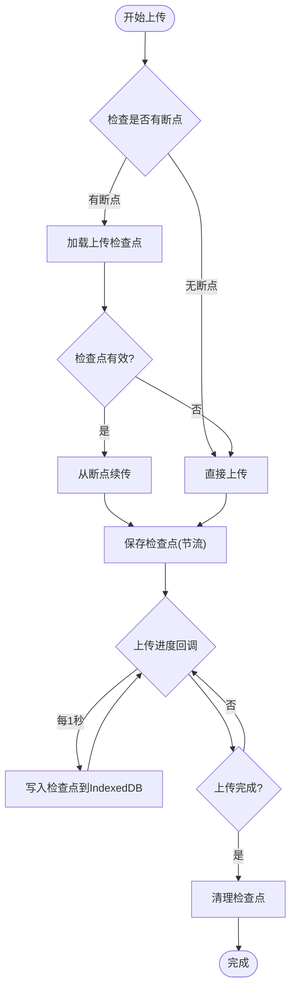

**图表来源**
- [src/sync/ossClientImpl.ts:82-143](file://src/sync/ossClientImpl.ts#L82-L143)
- [src/sync/ossClientImpl.ts:145-196](file://src/sync/ossClientImpl.ts#L145-L196)

**章节来源**
- [src/sync/ossClientImpl.ts:82-143](file://src/sync/ossClientImpl.ts#L82-L143)
- [src/sync/ossClientImpl.ts:145-196](file://src/sync/ossClientImpl.ts#L145-L196)

### 项目存储与自动保存
- 新建/重命名/保存项目：根据是否登录云端账号决定写入云端或本地 IndexedDB；未登录用户仅本地持久化。
- 自动保存：监听画布状态变化，防抖延迟 500ms 触发保存，减少频繁写盘。
- 局域网同步：保存成功后向局域网广播项目变更，保持多端一致性。

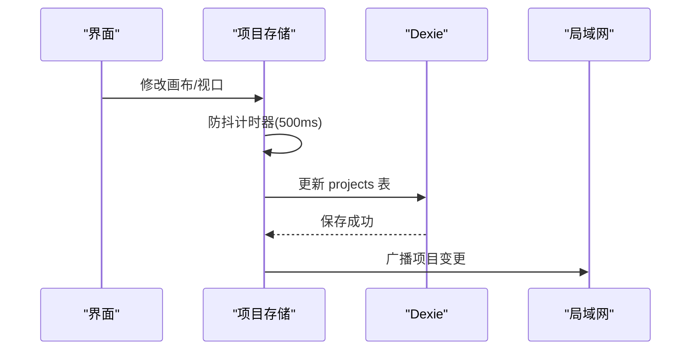

**图表来源**
- [src/store/projectStore.ts:46-67](file://src/store/projectStore.ts#L46-L67)
- [src/store/projectStore.ts:196-228](file://src/store/projectStore.ts#L196-L228)

**章节来源**
- [src/store/projectStore.ts:46-67](file://src/store/projectStore.ts#L46-L67)
- [src/store/projectStore.ts:196-228](file://src/store/projectStore.ts#L196-L228)

### 资产访问与 Blob 注册
- 获取资源 URL：优先本地 Blob URL，其次局域网 HTTP Range 流式地址，最后回退到本地 Blob 或云端下载。
- 获取缩略图：优先局域网同步的封面；若无，则从本地 Blob 或流式地址抓帧生成，并缓存 URL。
- 并发控制：视频封面抓帧限制并发数，避免阻塞浏览器连接池。
- 内存管理：及时撤销不再使用的 blob URL，防止内存泄漏。

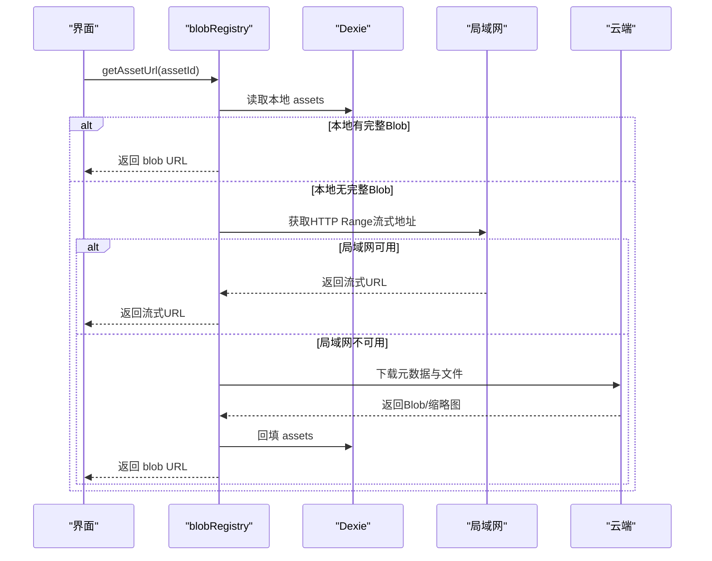

**图表来源**
- [src/media/blobRegistry.ts:84-126](file://src/media/blobRegistry.ts#L84-L126)
- [src/media/blobRegistry.ts:310-379](file://src/media/blobRegistry.ts#L310-L379)
- [src/sync/lanClient.ts:1156-1169](file://src/sync/lanClient.ts#L1156-L1169)

**章节来源**
- [src/media/blobRegistry.ts:84-126](file://src/media/blobRegistry.ts#L84-L126)
- [src/media/blobRegistry.ts:310-379](file://src/media/blobRegistry.ts#L310-L379)

### 文本素材写入与同步
- 将文本内容转换为 Blob 并写入 assets 表，随后推送到局域网与云端进行同步。
- 根据媒体类型映射合适的 MIME 类型，确保正确解析与预览。

**章节来源**
- [src/io/fileLoader.ts:121-135](file://src/io/fileLoader.ts#L121-L135)
- [src/io/fileLoader.ts:137-163](file://src/io/fileLoader.ts#L137-L163)

### 导入导出与资产打包
- 导出项目时，收集项目中引用的资产，将其二进制与缩略图一并打包为 ZIP，便于迁移与备份。
- 导入时按资产 ID 匹配并还原资源。

**章节来源**
- [src/io/importExport.ts:44-78](file://src/io/importExport.ts#L44-L78)

### 局域网分片传输与落库
- 分片接收：将 base64 分片解码为 Uint8Array，去重后拼接成 Blob。
- 落库：将资源与缩略图写入 assets 表，并通知等待者。
- 服务器侧：提供 HTTP Range 流式服务，支持跨源 CORS 头，便于网页直接流式播放。

**章节来源**
- [src/sync/lanClient.ts:1138-1173](file://src/sync/lanClient.ts#L1138-L1173)
- [server/lan-server.mjs:351-372](file://server/lan-server.mjs#L351-L372)

### 云端上传流程实现
**新增功能** 完整的云端上传流程，包含状态管理和错误处理：

- **环境检查**：验证 OSS 配置和登录状态，确定是否执行云端上传。
- **分片上传**：支持大文件分片上传，带进度回调和错误重试。
- **元数据同步**：上传完成后同步资产元数据到 Supabase。
- **状态管理**：实时更新 cloudStatus 字段，支持中断恢复。
- **用户体验**：提供进度显示、失败重试和成功反馈。

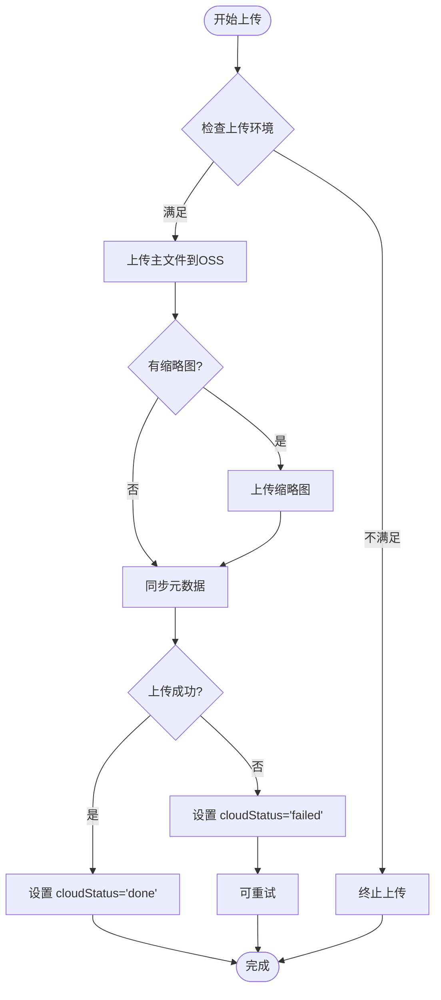

**图表来源**
- [src/sync/assetCloudUpload.ts:15-44](file://src/sync/assetCloudUpload.ts#L15-44)
- [src/store/uploadStore.ts:27-74](file://src/store/uploadStore.ts#L27-L74)

**章节来源**
- [src/sync/assetCloudUpload.ts:1-45](file://src/sync/assetCloudUpload.ts#L1-L45)
- [src/store/uploadStore.ts:25-84](file://src/store/uploadStore.ts#L25-L84)

## 依赖关系分析
- projectStore 依赖 db 进行项目读写，并通过 cloudSync/lanClient 与云端/局域网交互。
- blobRegistry 依赖 db 进行资产读写，并通过 lanClient/ossClient/cloudSync 获取远程资源。
- fileLoader/importExport 依赖 db 进行资产存取与打包。
- **新增** uploadStore 依赖 db 进行上传状态管理，并通过 assetCloudUpload 执行云端上传。
- **新增** ossClientImpl 依赖 db 进行上传检查点管理，支持断点续传。
- lan-client/server 共同协作，实现局域网内资源分发与流式播放。

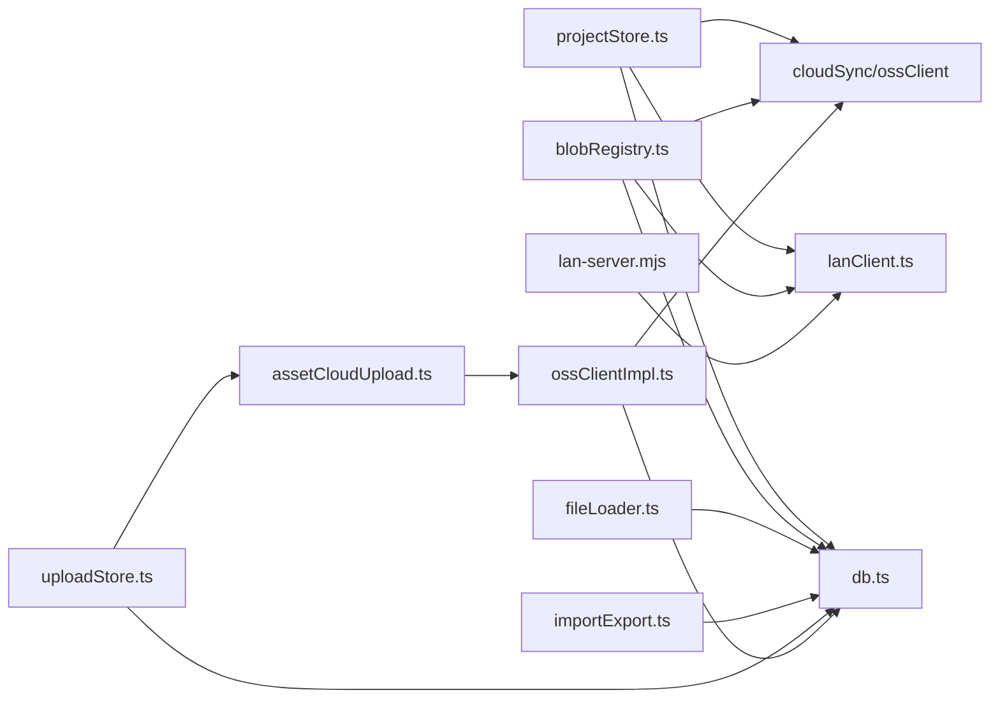

**图表来源**
- [src/store/projectStore.ts:196-228](file://src/store/projectStore.ts#L196-L228)
- [src/media/blobRegistry.ts:84-126](file://src/media/blobRegistry.ts#L84-L126)
- [src/io/fileLoader.ts:121-135](file://src/io/fileLoader.ts#L121-L135)
- [src/io/importExport.ts:44-78](file://src/io/importExport.ts#L44-L78)
- [src/store/uploadStore.ts:25-84](file://src/store/uploadStore.ts#L25-L84)
- [src/sync/assetCloudUpload.ts:15-44](file://src/sync/assetCloudUpload.ts#L15-L44)
- [src/sync/ossClientImpl.ts:145-196](file://src/sync/ossClientImpl.ts#L145-L196)
- [src/sync/lanClient.ts:1156-1169](file://src/sync/lanClient.ts#L1156-L1169)
- [server/lan-server.mjs:351-372](file://server/lan-server.mjs#L351-L372)

**章节来源**
- [src/store/projectStore.ts:196-228](file://src/store/projectStore.ts#L196-L228)
- [src/media/blobRegistry.ts:84-126](file://src/media/blobRegistry.ts#L84-L126)
- [src/io/fileLoader.ts:121-135](file://src/io/fileLoader.ts#L121-L135)
- [src/io/importExport.ts:44-78](file://src/io/importExport.ts#L44-L78)
- [src/store/uploadStore.ts:25-84](file://src/store/uploadStore.ts#L25-L84)
- [src/sync/assetCloudUpload.ts:15-44](file://src/sync/assetCloudUpload.ts#L15-L44)
- [src/sync/ossClientImpl.ts:145-196](file://src/sync/ossClientImpl.ts#L145-L196)
- [src/sync/lanClient.ts:1156-1169](file://src/sync/lanClient.ts#L1156-L1169)
- [server/lan-server.mjs:351-372](file://server/lan-server.mjs#L351-L372)

## 性能考虑
- 本地优先与流式播放：优先使用本地 Blob URL 或局域网 HTTP Range 流式地址，避免整文件下载到 IndexedDB，降低内存与磁盘压力。
- 缩略图缓存与并发控制：对视频封面抓帧限制并发，减少浏览器连接竞争；缓存 URL 并适时撤销，避免内存泄漏。
- 自动保存防抖：500ms 防抖减少频繁写盘，提高响应性。
- 索引优化：为 assets.kind、projects.updatedAt 等高频查询字段建立索引，提升检索性能。
- 垃圾回收周期：合理设置保留期（默认 24 小时），平衡空间占用与误删风险。
- **新增** 上传进度节流：120ms 节流间隔避免频繁重渲染，提升界面响应性。
- **新增** 状态修复机制：应用启动时快速修复卡住的上传状态，避免用户困惑。
- **新增** 检查点节流：1000ms 节流间隔避免每个分片回调都写 IndexedDB，提升上传性能。
- **新增** 分片上传优化：大文件（>10MB）使用分片上传，小文件直接上传，平衡性能与复杂度。

## 故障排查指南
- 资源不存在错误：当本地无资源且云端/局域网均不可用时，会抛出"资源不存在"错误。检查网络、局域网在线状态与云端配置。
- 封面抓取失败：跨域或代理可能导致视频画面无法读取，需确保服务器返回正确的 CORS 头；必要时回退到全量下载再抓帧。
- 保存失败：自动保存失败时会提示错误，检查 IndexedDB 配额与浏览器策略；确认局域网/云端同步是否正常。
- 孤立资源未清理：确认 gcAssets 是否被调度执行；检查项目引用是否正确（assetId/coverAssetId）。
- **新增** 上传失败问题：检查 cloudStatus 字段状态，确认 OSS 配置和登录状态；查看控制台日志了解具体错误原因。
- **新增** 上传中断恢复：应用启动时会自动修复卡住的 uploading 状态为 failed，用户可点击重试。
- **新增** 断点续传问题：检查 uploadCheckpoints 表中的数据完整性，确认检查点是否有效；验证文件 size、key 和分片大小是否匹配。
- **新增** 检查点清理问题：上传完成后检查点应自动清理，如未清理可能是上传异常导致；可通过垃圾回收机制清理无效检查点。

**章节来源**
- [src/media/blobRegistry.ts:108-126](file://src/media/blobRegistry.ts#L108-L126)
- [src/media/blobRegistry.ts:310-379](file://src/media/blobRegistry.ts#L310-L379)
- [src/store/projectStore.ts:196-228](file://src/store/projectStore.ts#L196-L228)
- [src/db/db.ts:80-101](file://src/db/db.ts#L80-L101)
- [src/store/uploadStore.ts:77-84](file://src/store/uploadStore.ts#L77-L84)
- [src/sync/ossClientImpl.ts:82-143](file://src/sync/ossClientImpl.ts#L82-L143)

## 结论
本项目以 Dexie 为核心构建 IndexedDB 存储层，结合云端与局域网实现高性能、低延迟的媒体管理与离线可用。通过清晰的表结构、完善的垃圾回收机制、稳健的降级策略以及**新增的云端上传状态管理和 OSS 分片上传断点续传功能**，保障了在大文件与多端协同场景下的稳定性与用户体验。云端上传状态管理确保了上传过程的可恢复性和用户界面的直观性，而 OSS 分片上传断点续传功能则为大文件上传提供了可靠的网络中断恢复能力。建议在后续迭代中继续优化索引、缓存策略与 GC 周期，进一步提升性能与可靠性。

## 附录：增删改查示例路径
以下为常见操作的代码片段路径，便于快速定位实现细节：
- 新增项目（本地）：[src/store/projectStore.ts:149-182](file://src/store/projectStore.ts#L149-L182)
- 更新项目（本地）：[src/store/projectStore.ts:196-228](file://src/store/projectStore.ts#L196-L228)
- 读取项目（本地）：[src/store/projectStore.ts:119-147](file://src/store/projectStore.ts#L119-L147)
- 删除项目（局域网触发）：[src/sync/lanClient.ts:494-500](file://src/sync/lanClient.ts#L494-L500)
- 新增资产（局域网分片落库）：[src/sync/lanClient.ts:1156-1169](file://src/sync/lanClient.ts#L1156-L1169)
- 读取资产（本地/云端/局域网）：[src/media/blobRegistry.ts:84-126](file://src/media/blobRegistry.ts#L84-L126)
- 更新资产（文本素材写入）：[src/io/fileLoader.ts:121-135](file://src/io/fileLoader.ts#L121-L135)
- 删除资产（垃圾回收）：[src/db/db.ts:80-101](file://src/db/db.ts#L80-L101)
- 导出资产（打包 ZIP）：[src/io/importExport.ts:44-78](file://src/io/importExport.ts#L44-L78)
- **新增** 云端上传（带状态管理）：[src/store/uploadStore.ts:27-74](file://src/store/uploadStore.ts#L27-L74)
- **新增** 上传状态修复：[src/store/uploadStore.ts:77-84](file://src/store/uploadStore.ts#L77-L84)
- **新增** 上传环境检查：[src/sync/assetCloudUpload.ts:6-8](file://src/sync/assetCloudUpload.ts#L6-L8)
- **新增** OSS 分片上传（带断点续传）：[src/sync/ossClientImpl.ts:145-196](file://src/sync/ossClientImpl.ts#L145-L196)
- **新增** 上传检查点管理：[src/sync/ossClientImpl.ts:82-143](file://src/sync/ossClientImpl.ts#L82-L143)

**章节来源**
- [src/store/projectStore.ts:119-228](file://src/store/projectStore.ts#L119-L228)
- [src/sync/lanClient.ts:494-500](file://src/sync/lanClient.ts#L494-L500)
- [src/sync/lanClient.ts:1156-1169](file://src/sync/lanClient.ts#L1156-L1169)
- [src/media/blobRegistry.ts:84-126](file://src/media/blobRegistry.ts#L84-L126)
- [src/io/fileLoader.ts:121-135](file://src/io/fileLoader.ts#L121-L135)
- [src/db/db.ts:80-101](file://src/db/db.ts#L80-L101)
- [src/io/importExport.ts:44-78](file://src/io/importExport.ts#L44-L78)
- [src/store/uploadStore.ts:27-84](file://src/store/uploadStore.ts#L27-L84)
- [src/sync/assetCloudUpload.ts:6-8](file://src/sync/assetCloudUpload.ts#L6-L8)
- [src/sync/ossClientImpl.ts:82-196](file://src/sync/ossClientImpl.ts#L82-L196)