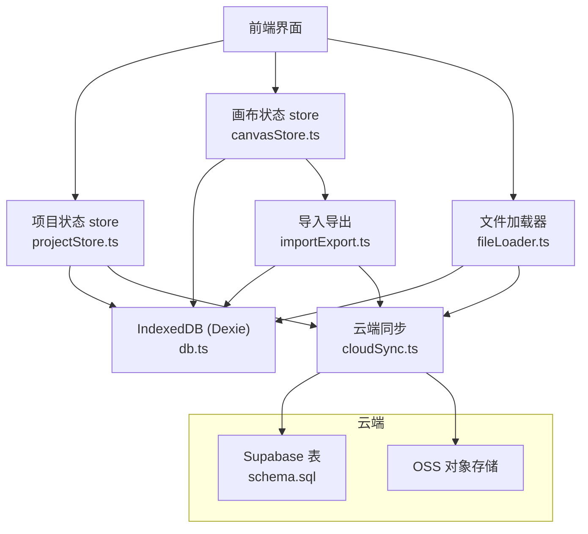
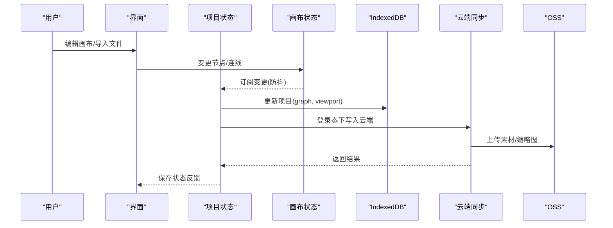
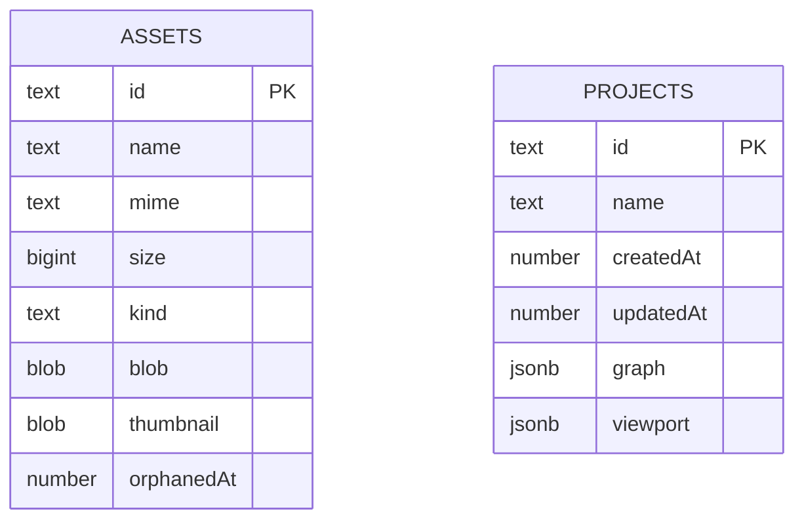
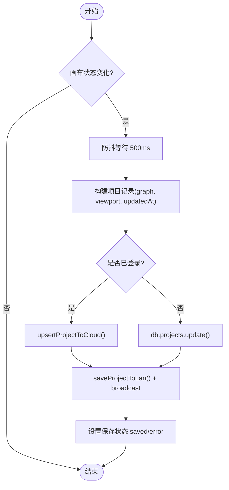
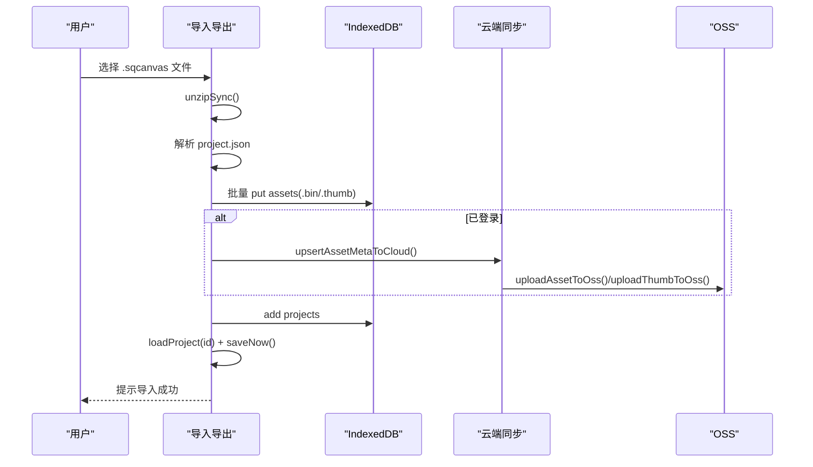
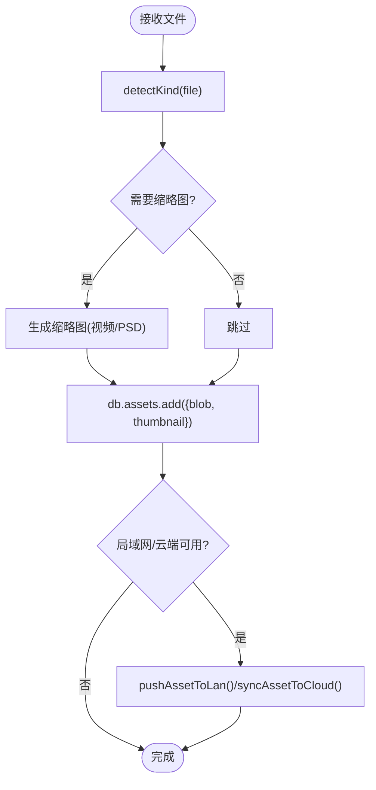
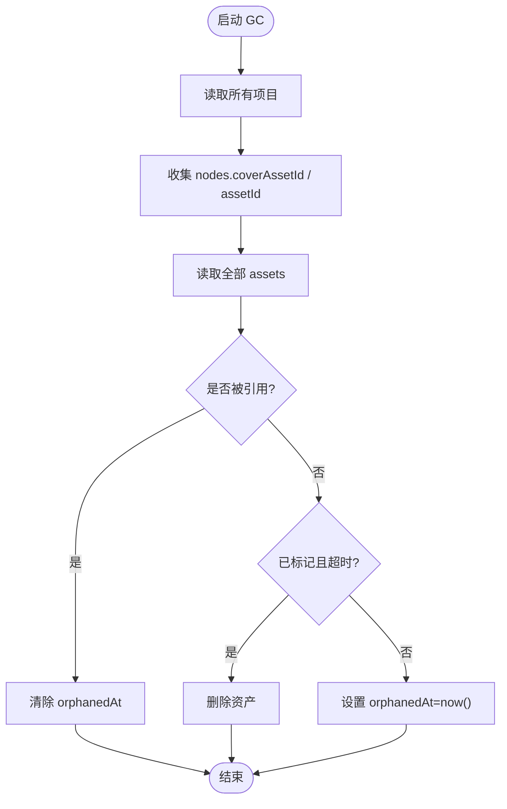
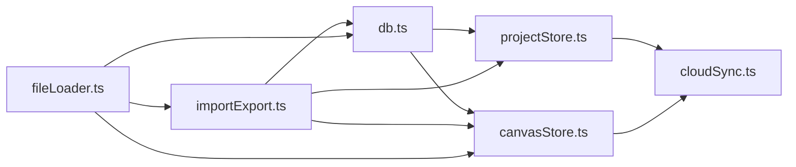

# 数据持久化

<cite>
**本文引用的文件**
- [src/db/db.ts](file://src/db/db.ts)
- [src/io/importExport.ts](file://src/io/importExport.ts)
- [src/io/fileLoader.ts](file://src/io/fileLoader.ts)
- [src/store/projectStore.ts](file://src/store/projectStore.ts)
- [src/store/canvasStore.ts](file://src/store/canvasStore.ts)
- [src/media/fileKind.ts](file://src/media/fileKind.ts)
- [src/sync/cloudSync.ts](file://src/sync/cloudSync.ts)
- [supabase/schema.sql](file://supabase/schema.sql)
- [src/types.ts](file://src/types.ts)
- [src/media/managedFile.ts](file://src/media/managedFile.ts)
- [src/canvas/clipboard.ts](file://src/canvas/clipboard.ts)
- [server/lan-server.mjs](file://server/lan-server.mjs)
</cite>

## 目录
1. [简介](#简介)
2. [项目结构](#项目结构)
3. [核心组件](#核心组件)
4. [架构总览](#架构总览)
5. [详细组件分析](#详细组件分析)
6. [依赖关系分析](#依赖关系分析)
7. [性能与优化](#性能与优化)
8. [故障排查指南](#故障排查指南)
9. [结论](#结论)
10. [附录：数据操作示例路径](#附录：数据操作示例路径)

## 简介
本文件面向“数据持久化系统”的完整说明，覆盖基于 Dexie 的 IndexedDB 存储设计、项目数据自动保存与版本管理、.sqcanvas 导入导出规范（ZIP 打包/解压、媒体处理）、文件加载器（拖拽上传、剪贴板粘贴、类型识别）、以及备份恢复、清理与垃圾回收等维护能力。文档同时提供关键流程的时序图与流程图，帮助读者快速理解并正确使用该系统。

## 项目结构
围绕数据持久化的关键模块分布如下：
- 数据库层：Dexie 初始化、表结构与索引、垃圾回收
- 项目与画布状态：Zustand 状态管理、自动保存策略、历史撤销/重做
- 导入导出：.sqcanvas 格式定义、ZIP 压缩/解压、元数据与资产同步
- 文件加载：拖拽/粘贴/类型识别、缩略图生成、云端/局域网同步
- 云端与本地协同：登录态决定读写来源（云端或本地），统一抽象接口
- 服务端维护：局域网服务器端的素材孤儿标记与清理

图表来源
- [src/db/db.ts:25-33](file://src/db/db.ts#L25-L33)
- [src/store/projectStore.ts:196-228](file://src/store/projectStore.ts#L196-L228)
- [src/store/canvasStore.ts:118-175](file://src/store/canvasStore.ts#L118-L175)
- [src/io/importExport.ts:35-78](file://src/io/importExport.ts#L35-L78)
- [src/io/fileLoader.ts:77-117](file://src/io/fileLoader.ts#L77-L117)
- [src/sync/cloudSync.ts:121-131](file://src/sync/cloudSync.ts#L121-L131)
- [supabase/schema.sql:12-35](file://supabase/schema.sql#L12-L35)

章节来源
- [src/db/db.ts:25-33](file://src/db/db.ts#L25-L33)
- [src/store/projectStore.ts:196-228](file://src/store/projectStore.ts#L196-L228)
- [src/io/importExport.ts:35-78](file://src/io/importExport.ts#L35-L78)
- [src/io/fileLoader.ts:77-117](file://src/io/fileLoader.ts#L77-L117)
- [src/sync/cloudSync.ts:121-131](file://src/sync/cloudSync.ts#L121-L131)
- [supabase/schema.sql:12-35](file://supabase/schema.sql#L12-L35)

## 核心组件
- 数据库与索引
  - Dexie 实例定义两个实体表：assets（素材）与 projects（项目）。
  - assets 表索引：id, kind, name；projects 表索引：id, updatedAt。
  - 提供请求浏览器持久化存储的能力。
  - 实现素材垃圾回收：根据项目引用情况标记/删除孤立素材。
- 项目状态与自动保存
  - 监听画布变化，防抖触发保存。
  - 登录用户仅写云端，未登录仅写本地；保存时同时广播到局域网。
- 导入导出
  - .sqcanvas 为 ZIP 包，包含 project.json 与 assets 目录（二进制与可选缩略图）。
  - 导出时收集节点引用的资产，写入 ZIP；导入时解析 JSON 并回填 IndexedDB，已登录则同步到云端与 OSS。
- 文件加载器
  - 支持拖拽/粘贴/选择文件，识别媒体类型，生成视频/PSD 缩略图。
  - 将素材写入 IndexedDB，并异步同步到云端/OSS 与局域网。
- 云端与本地协同
  - 通过 isCloudAuthed 判断是否登录，决定读取/写入来源。
  - 云端表结构由 schema.sql 定义，含行级安全策略与更新时间触发器。

章节来源
- [src/db/db.ts:25-68](file://src/db/db.ts#L25-L68)
- [src/store/projectStore.ts:46-67](file://src/store/projectStore.ts#L46-L67)
- [src/io/importExport.ts:13-78](file://src/io/importExport.ts#L13-L78)
- [src/io/fileLoader.ts:77-117](file://src/io/fileLoader.ts#L77-L117)
- [src/sync/cloudSync.ts:24-27](file://src/sync/cloudSync.ts#L24-L27)
- [supabase/schema.sql:12-35](file://supabase/schema.sql#L12-L35)

## 架构总览
下图展示从用户操作到数据落盘的完整链路，包括本地 IndexedDB、云端 Supabase 与 OSS、以及局域网同步。

图表来源
- [src/store/projectStore.ts:46-67](file://src/store/projectStore.ts#L46-L67)
- [src/store/projectStore.ts:196-228](file://src/store/projectStore.ts#L196-L228)
- [src/sync/cloudSync.ts:121-131](file://src/sync/cloudSync.ts#L121-L131)
- [src/io/fileLoader.ts:77-117](file://src/io/fileLoader.ts#L77-L117)

## 详细组件分析

### 数据库 Schema 与索引优化
- 表结构
  - assets：id（主键）、name、mime、size、kind、blob、thumbnail、orphanedAt。
  - projects：id（主键）、name、createdAt、updatedAt、graph（nodes/edges）、viewport。
- 索引
  - assets：id, kind, name，便于按类型检索与名称查询。
  - projects：id, updatedAt，用于排序与快速定位最新项目。
- 版本迁移
  - Dexie 使用 version(1).stores(...) 声明当前版本与表结构。
  - 云端表由 schema.sql 定义，包含 user_id 列与索引、更新时间触发器、行级安全策略，具备幂等升级能力。

图表来源
- [src/db/db.ts:5-23](file://src/db/db.ts#L5-L23)
- [supabase/schema.sql:12-35](file://supabase/schema.sql#L12-L35)

章节来源
- [src/db/db.ts:25-33](file://src/db/db.ts#L25-L33)
- [supabase/schema.sql:12-35](file://supabase/schema.sql#L12-L35)

### 项目数据的持久化策略
- 自动保存机制
  - 监听画布状态变化，防抖 500ms 后触发保存。
  - 保存内容：项目名称、graph（nodes/edges）、viewport、更新时间。
  - 登录用户写入云端，未登录写入本地；保存成功后广播到局域网。
- 版本管理
  - 云端 projects 表包含 created_at/updated_at，配合更新时间触发器保证一致性。
  - 应用侧通过 syncProjectList/loadProjectBest 在登录态优先读云端，否则读本地。
- 数据迁移
  - Dexie 通过 version(1) 声明当前 schema；如需扩展，可递增版本号并在迁移逻辑中补齐字段。
  - 云端 schema.sql 提供幂等升级脚本，新增列与索引不影响旧库。

图表来源
- [src/store/projectStore.ts:46-67](file://src/store/projectStore.ts#L46-L67)
- [src/store/projectStore.ts:196-228](file://src/store/projectStore.ts#L196-L228)
- [src/sync/cloudSync.ts:148-164](file://src/sync/cloudSync.ts#L148-L164)

章节来源
- [src/store/projectStore.ts:46-67](file://src/store/projectStore.ts#L46-L67)
- [src/store/projectStore.ts:196-228](file://src/store/projectStore.ts#L196-L228)
- [src/sync/cloudSync.ts:148-164](file://src/sync/cloudSync.ts#L148-L164)

### 文件导入导出（.sqcanvas）
- 文件格式规范
  - 根目录：project.json，包含 format、version、project.name、viewport、nodes、edges、assets 元信息数组。
  - assets 目录：每个被引用资产对应 assets/<id>.bin，可选 assets/<id>.thumb（JPEG 缩略图）。
  - 整体以 ZIP 压缩，MIME 类型为 application/zip。
- 导出流程
  - 收集节点引用的 assetId，读取 IndexedDB 中的 blob 与 thumbnail，写入 ZIP。
  - 生成 project.json，压缩为 Blob 并触发下载。
- 导入流程
  - 解压 ZIP，校验 project.json 的 format/version。
  - 将 assets 写入 IndexedDB（不存在则新增），已登录则上传至 OSS 并同步元数据到云端。
  - 创建新项目记录并加载到画布。

图表来源
- [src/io/importExport.ts:111-203](file://src/io/importExport.ts#L111-L203)
- [src/sync/cloudSync.ts:30-50](file://src/sync/cloudSync.ts#L30-L50)

章节来源
- [src/io/importExport.ts:35-78](file://src/io/importExport.ts#L35-L78)
- [src/io/importExport.ts:111-203](file://src/io/importExport.ts#L111-L203)

### 文件加载器实现
- 拖拽上传与剪贴板粘贴
  - 支持拖拽文件到画布区域，调用 importFiles 批量导入。
  - 支持 Ctrl/Cmd+V 粘贴系统剪贴板内容（图片/文本），结合 canvasStore 的 pasteClipboard 进行还原。
- 文件类型识别
  - 基于 file.type 与扩展名推断 MediaKind（image/video/audio/pdf/markdown/text/file/psd）。
- 缩略图生成
  - 视频：截取中间帧生成 JPEG 缩略图。
  - PSD：通过 worker 生成预览图，失败不影响主流程。
- 云端/局域网同步
  - 素材入库后，若局域网连接则推送；若已登录且配置了 OSS，则异步上传并同步元数据。

图表来源
- [src/io/fileLoader.ts:20-59](file://src/io/fileLoader.ts#L20-L59)
- [src/io/fileLoader.ts:77-117](file://src/io/fileLoader.ts#L77-L117)
- [src/media/fileKind.ts:3-16](file://src/media/fileKind.ts#L3-L16)
- [src/canvas/clipboard.ts:114-131](file://src/canvas/clipboard.ts#L114-L131)

章节来源
- [src/io/fileLoader.ts:77-117](file://src/io/fileLoader.ts#L77-L117)
- [src/media/fileKind.ts:3-16](file://src/media/fileKind.ts#L3-L16)
- [src/canvas/clipboard.ts:114-131](file://src/canvas/clipboard.ts#L114-L131)

### 数据备份恢复与维护
- 备份
  - 通过 exportCurrentProject/exportProjectToBlob 导出 .sqcanvas 文件，包含项目与所有引用资产。
- 恢复
  - 通过 importProjectFile 导入 .sqcanvas，重建 IndexedDB 数据并加载到画布。
- 垃圾回收
  - gcAssets：遍历所有项目，收集被引用的 assetId；对未被引用的素材标记 orphandedAt，超过保留时间（24小时）后删除。
- 局域网维护
  - 服务端周期性扫描资产引用，标记孤儿并清理过期文件。

图表来源
- [src/db/db.ts:46-68](file://src/db/db.ts#L46-L68)
- [server/lan-server.mjs:142-205](file://server/lan-server.mjs#L142-L205)

章节来源
- [src/db/db.ts:46-68](file://src/db/db.ts#L46-L68)
- [server/lan-server.mjs:142-205](file://server/lan-server.mjs#L142-L205)

## 依赖关系分析
- 低耦合高内聚
  - db.ts 仅负责 IndexedDB 访问与基础维护，不感知业务状态。
  - projectStore.ts 聚合画布状态与持久化策略，屏蔽云端/本地差异。
  - importExport.ts 专注序列化/反序列化与 ZIP 处理，依赖 db 与 cloudSync。
  - fileLoader.ts 封装文件输入与缩略图生成，依赖 fileKind 与云/局域网同步。
- 外部依赖
  - Dexie：IndexedDB 封装。
  - fflate：ZIP 压缩/解压。
  - Supabase：云端项目与素材元数据。
  - OSS：媒体文件实际存储。

图表来源
- [src/db/db.ts:25-33](file://src/db/db.ts#L25-L33)
- [src/store/projectStore.ts:196-228](file://src/store/projectStore.ts#L196-L228)
- [src/io/importExport.ts:35-78](file://src/io/importExport.ts#L35-L78)
- [src/io/fileLoader.ts:77-117](file://src/io/fileLoader.ts#L77-L117)
- [src/sync/cloudSync.ts:121-131](file://src/sync/cloudSync.ts#L121-L131)

章节来源
- [src/db/db.ts:25-33](file://src/db/db.ts#L25-L33)
- [src/store/projectStore.ts:196-228](file://src/store/projectStore.ts#L196-L228)
- [src/io/importExport.ts:35-78](file://src/io/importExport.ts#L35-L78)
- [src/io/fileLoader.ts:77-117](file://src/io/fileLoader.ts#L77-L117)
- [src/sync/cloudSync.ts:121-131](file://src/sync/cloudSync.ts#L121-L131)

## 性能与优化
- 自动保存防抖
  - 500ms 防抖避免频繁写入，降低 IndexedDB 与网络压力。
- 增量快照与历史限制
  - 画布历史最多保留 50 条，减少内存占用。
- 索引优化
  - assets.kind/name、projects.updatedAt 提升列表与排序性能。
- 大文件处理
  - 单文件最大限制 1.5GB，防止内存溢出。
- 缩略图异步
  - 视频/PSD 缩略图生成失败不影响主流程，保障用户体验。
- 云端与本地分离
  - 登录态优先云端，未登录仅本地，避免不必要的网络开销。

[本节为通用性能建议，不直接分析具体文件]

## 故障排查指南
- 导入失败
  - 检查 .sqcanvas 是否为有效 ZIP 且包含 project.json。
  - 确认 format/version 兼容当前客户端。
- 导出为空或缺失资产
  - 确认节点 data.assetId 正确指向 assets 表。
  - 检查 assets 目录是否存在对应 .bin/.thumb。
- 自动保存失败
  - 检查网络与云端权限；查看保存状态为 error 时的错误日志。
- 垃圾回收误删
  - 确认项目 graph.nodes 中 coverAssetId/assetId 引用是否正确。
  - 检查 orphandedAt 时间与保留阈值。
- 局域网同步异常
  - 检查局域网连接状态与推送接口；关注服务端维护任务是否运行。

章节来源
- [src/io/importExport.ts:111-131](file://src/io/importExport.ts#L111-L131)
- [src/store/projectStore.ts:196-228](file://src/store/projectStore.ts#L196-L228)
- [src/db/db.ts:46-68](file://src/db/db.ts#L46-L68)
- [server/lan-server.mjs:142-205](file://server/lan-server.mjs#L142-L205)

## 结论
该数据持久化系统以 Dexie 为核心，结合 Zustand 状态管理与云端/局域网同步，实现了稳健的本地与云端双写策略。.sqcanvas 格式提供了完整的离线备份与迁移能力；自动保存、历史回滚与垃圾回收保障了数据安全与空间效率。通过清晰的模块划分与索引优化，系统在易用性、可靠性与性能之间取得了良好平衡。

[本节为总结性内容，不直接分析具体文件]

## 附录：数据操作示例路径
以下列出常用数据操作的代码片段所在路径，便于快速定位与参考：
- 初始化数据库与表结构
  - [src/db/db.ts:25-33](file://src/db/db.ts#L25-L33)
- 请求持久化存储
  - [src/db/db.ts:35-44](file://src/db/db.ts#L35-L44)
- 素材垃圾回收
  - [src/db/db.ts:46-68](file://src/db/db.ts#L46-L68)
- 自动保存策略
  - [src/store/projectStore.ts:46-67](file://src/store/projectStore.ts#L46-L67)
- 保存项目到本地/云端
  - [src/store/projectStore.ts:196-228](file://src/store/projectStore.ts#L196-L228)
- 导出项目为 .sqcanvas
  - [src/io/importExport.ts:35-78](file://src/io/importExport.ts#L35-L78)
- 导入 .sqcanvas 并回填数据
  - [src/io/importExport.ts:111-203](file://src/io/importExport.ts#L111-L203)
- 文件类型识别
  - [src/media/fileKind.ts:3-16](file://src/media/fileKind.ts#L3-L16)
- 文件加载与缩略图生成
  - [src/io/fileLoader.ts:20-59](file://src/io/fileLoader.ts#L20-L59)
  - [src/io/fileLoader.ts:77-117](file://src/io/fileLoader.ts#L77-L117)
- 剪贴板复制/粘贴
  - [src/canvas/clipboard.ts:114-131](file://src/canvas/clipboard.ts#L114-L131)
  - [src/store/canvasStore.ts:205-246](file://src/store/canvasStore.ts#L205-L246)
- 云端项目与素材元数据
  - [src/sync/cloudSync.ts:30-50](file://src/sync/cloudSync.ts#L30-L50)
  - [src/sync/cloudSync.ts:121-131](file://src/sync/cloudSync.ts#L121-L131)
  - [supabase/schema.sql:12-35](file://supabase/schema.sql#L12-L35)