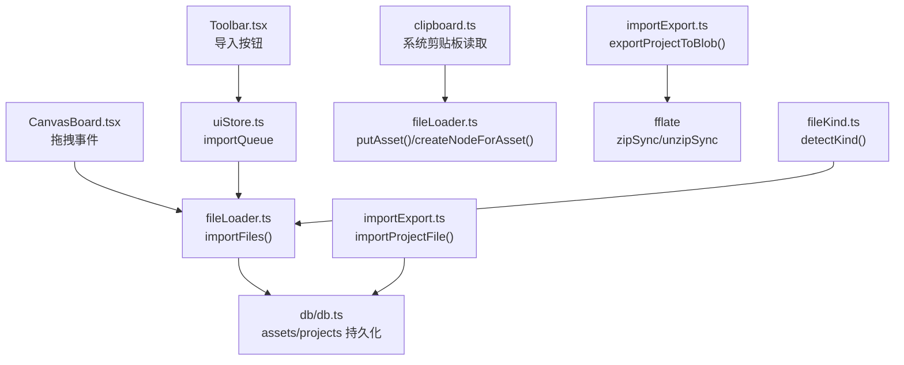
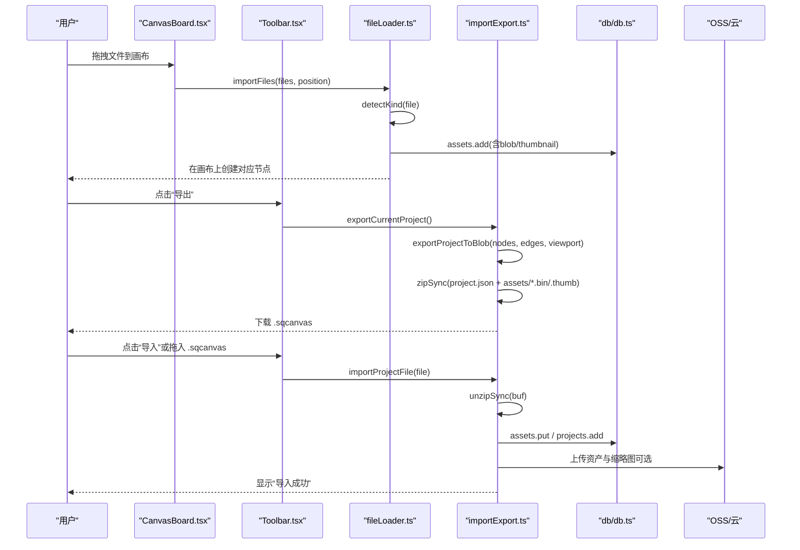
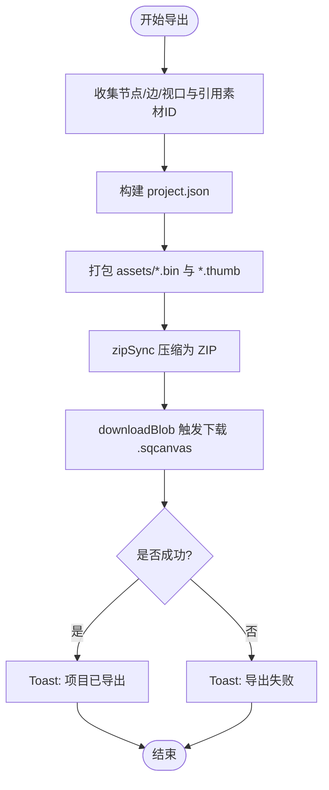
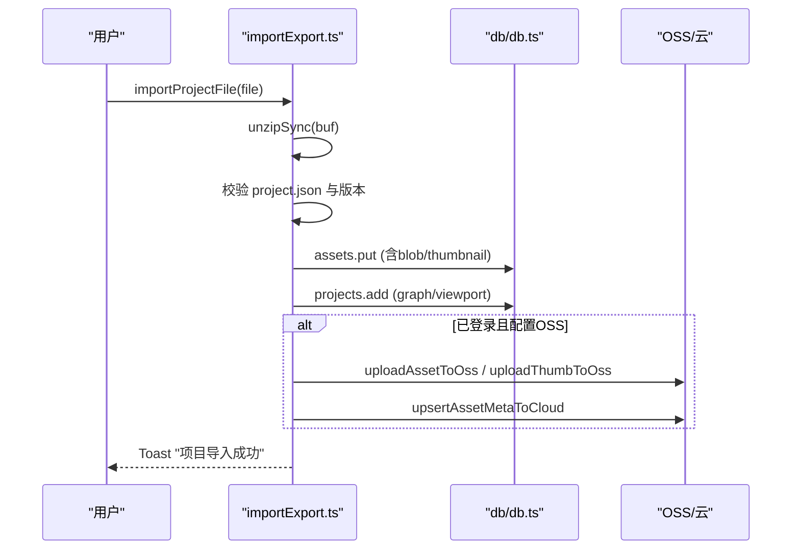
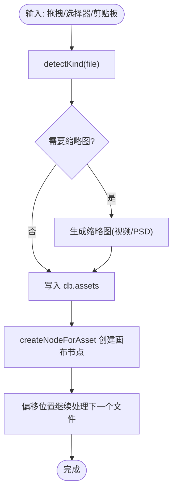
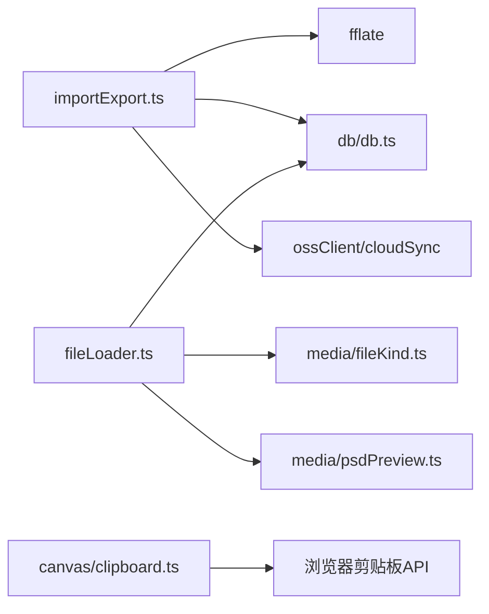

# 文件导入导出

<cite>
**本文引用的文件**
- [src/io/importExport.ts](file://src/io/importExport.ts)
- [src/io/fileLoader.ts](file://src/io/fileLoader.ts)
- [src/media/fileKind.ts](file://src/media/fileKind.ts)
- [src/types.ts](file://src/types.ts)
- [src/db/db.ts](file://src/db/db.ts)
- [src/canvas/clipboard.ts](file://src/canvas/clipboard.ts)
- [src/canvas/CanvasBoard.tsx](file://src/canvas/CanvasBoard.tsx)
- [src/components/Toolbar.tsx](file://src/components/Toolbar.tsx)
- [src/store/uiStore.ts](file://src/store/uiStore.ts)
- [src/io/importExport.test.ts](file://src/io/importExport.test.ts)
</cite>

## 目录
1. [简介](#简介)
2. [项目结构](#项目结构)
3. [核心组件](#核心组件)
4. [架构总览](#架构总览)
5. [详细组件分析](#详细组件分析)
6. [依赖关系分析](#依赖关系分析)
7. [性能考虑](#性能考虑)
8. [故障排查指南](#故障排查指南)
9. [结论](#结论)
10. [附录：文件格式规范与迁移](#附录文件格式规范与迁移)

## 简介
本文件围绕 SuQCanvas 的“文件导入导出”能力，系统性说明 .sqcanvas 文件格式、ZIP 打包与解压实现、多种输入方式（拖拽、剪贴板、文件选择器）、文件类型识别机制、完整的导入导出流程（含错误处理、进度反馈、用户提示），以及格式迁移与数据验证的实现细节。目标是帮助开发者快速理解并扩展该模块，同时为使用者提供清晰的交互预期与排错指引。

## 项目结构
与导入导出相关的代码主要分布在以下位置：
- 导入导出核心逻辑：src/io/importExport.ts
- 文件加载与节点创建：src/io/fileLoader.ts
- 媒体类型识别：src/media/fileKind.ts
- 数据类型定义：src/types.ts
- 本地存储与清理：src/db/db.ts
- 剪贴板读写：src/canvas/clipboard.ts
- 画布拖放事件：src/canvas/CanvasBoard.tsx
- 工具栏入口：src/components/Toolbar.tsx
- UI 状态与导入队列：src/store/uiStore.ts
- 单元测试用例：src/io/importExport.test.ts

图表来源
- [src/canvas/CanvasBoard.tsx:210-232](file://src/canvas/CanvasBoard.tsx#L210-L232)
- [src/components/Toolbar.tsx:199-214](file://src/components/Toolbar.tsx#L199-L214)
- [src/io/fileLoader.ts:77-205](file://src/io/fileLoader.ts#L77-L205)
- [src/io/importExport.ts:35-203](file://src/io/importExport.ts#L35-L203)
- [src/media/fileKind.ts:3-16](file://src/media/fileKind.ts#L3-L16)
- [src/db/db.ts:25-33](file://src/db/db.ts#L25-L33)

章节来源
- [src/canvas/CanvasBoard.tsx:210-232](file://src/canvas/CanvasBoard.tsx#L210-L232)
- [src/components/Toolbar.tsx:199-214](file://src/components/Toolbar.tsx#L199-L214)
- [src/io/fileLoader.ts:77-205](file://src/io/fileLoader.ts#L77-L205)
- [src/io/importExport.ts:35-203](file://src/io/importExport.ts#L35-L203)
- [src/media/fileKind.ts:3-16](file://src/media/fileKind.ts#L3-L16)
- [src/db/db.ts:25-33](file://src/db/db.ts#L25-L33)

## 核心组件
- 导出器：将当前项目的节点、边、视口与关联素材打包为 ZIP 二进制 Blob，并下载为 .sqcanvas 文件。
- 导入器：解析 .sqcanvas ZIP，校验 JSON 结构与版本，恢复素材到本地数据库，重建项目与画布状态，并在已登录时同步到云端。
- 文件加载器：统一处理多源输入（拖拽、剪贴板、文件选择器），识别媒体类型，生成缩略图（视频/PSD），写入本地数据库并创建画布节点。
- 类型识别：基于 MIME 类型与扩展名推断媒体种类，支持图片、视频、音频、PDF、PSD、Markdown、文本及通用文件。
- 剪贴板：支持复制选中元素为图片或文本；支持从系统剪贴板粘贴图片/文本内容到画布。
- 存储与清理：使用 IndexedDB 持久化素材与项目，并提供孤儿素材回收策略。

章节来源
- [src/io/importExport.ts:35-203](file://src/io/importExport.ts#L35-L203)
- [src/io/fileLoader.ts:77-205](file://src/io/fileLoader.ts#L77-L205)
- [src/media/fileKind.ts:3-16](file://src/media/fileKind.ts#L3-L16)
- [src/canvas/clipboard.ts:1-132](file://src/canvas/clipboard.ts#L1-L132)
- [src/db/db.ts:25-69](file://src/db/db.ts#L25-L69)

## 架构总览
下图展示了从用户操作到数据落库与云端同步的整体流程，涵盖导出与导入两条主线。

图表来源
- [src/canvas/CanvasBoard.tsx:210-232](file://src/canvas/CanvasBoard.tsx#L210-L232)
- [src/components/Toolbar.tsx:199-214](file://src/components/Toolbar.tsx#L199-L214)
- [src/io/fileLoader.ts:77-205](file://src/io/fileLoader.ts#L77-L205)
- [src/io/importExport.ts:35-203](file://src/io/importExport.ts#L35-L203)
- [src/db/db.ts:25-33](file://src/db/db.ts#L25-L33)

## 详细组件分析

### 导出流程与 .sqcanvas 文件格式
- 导出入口：导出当前项目，收集节点、边、视口信息，提取被引用的素材 ID，读取本地素材与缩略图，构建 ZIP 并下载。
- 文件组织：
  - project.json：包含 format、version、project.name、viewport、nodes、edges、assets 元数据列表。
  - assets/<id>.bin：每个引用素材的二进制数据。
  - assets/<id>.thumb：可选缩略图（JPEG）。
- 版本兼容：
  - 导出固定 format=sqcanvas，version=1。
  - 导入时校验 format 与 version，仅允许小于等于当前版本的文件导入。
- 错误处理：
  - 非 ZIP 或损坏：抛出“文件损坏或不是有效的 SuQCanvas 项目”。
  - 缺少 project.json：抛出“缺少 project.json，文件无效”。
  - JSON 解析失败：抛出“project.json 解析失败”。
  - 版本过高：抛出“项目版本高于当前支持的版本”。
- 用户体验：
  - 导出成功：Toast “项目已导出”。
  - 导出失败：Toast “导出失败”，并记录错误日志。

图表来源
- [src/io/importExport.ts:35-109](file://src/io/importExport.ts#L35-L109)

章节来源
- [src/io/importExport.ts:35-109](file://src/io/importExport.ts#L35-L109)

### 导入流程与 ZIP 解压
- 入口：接收 File 对象，读取 ArrayBuffer，调用解压。
- 校验顺序：
  - 解压成功性检查。
  - 存在 project.json。
  - JSON 可解析且 format/version 合法。
- 资源恢复：
  - 遍历 assets 元数据，若本地不存在则写入 db.assets，包含 blob 与可选 thumbnail。
  - 重建项目记录（名称、时间戳、图数据、视口）。
- 云端同步：
  - 已登录且配置了 OSS：上传主文件与缩略图，并更新云端资产元数据。
  - 未登录：仅写入本地数据库。
- 结果：
  - 加载项目并保存，Toast “项目导入成功”。

图表来源
- [src/io/importExport.ts:111-203](file://src/io/importExport.ts#L111-L203)
- [src/db/db.ts:25-33](file://src/db/db.ts#L25-L33)

章节来源
- [src/io/importExport.ts:111-203](file://src/io/importExport.ts#L111-L203)

### 文件加载器与多输入方式
- 拖拽上传：
  - 画布 onDragOver/onDrop 拦截 Files，计算放置位置，调用 importFiles。
- 文件选择器：
  - 通过工具栏“导入”按钮触发，进入 uiStore.importQueue，再由消费端调用 importFiles。
- 剪贴板粘贴：
  - 支持从系统剪贴板读取图片/文本，转换为素材并插入画布节点。
- 媒体类型识别：
  - 基于 file.type 与扩展名推断 MediaKind，支持 image/video/audio/pdf/psd/markdown/text/file。
- 缩略图生成：
  - 视频：取中间帧绘制到 canvas 并转 JPEG。
  - PSD：异步生成预览，失败不影响主流程但给出提示。
- 大小限制：
  - 单文件超过 1.5GB 跳过并提示。
- 错误处理：
  - 单个文件导入失败不影响其他文件，Toast 提示具体失败项。

图表来源
- [src/canvas/CanvasBoard.tsx:210-232](file://src/canvas/CanvasBoard.tsx#L210-L232)
- [src/io/fileLoader.ts:77-205](file://src/io/fileLoader.ts#L77-L205)
- [src/media/fileKind.ts:3-16](file://src/media/fileKind.ts#L3-L16)

章节来源
- [src/canvas/CanvasBoard.tsx:210-232](file://src/canvas/CanvasBoard.tsx#L210-L232)
- [src/io/fileLoader.ts:77-205](file://src/io/fileLoader.ts#L77-L205)
- [src/media/fileKind.ts:3-16](file://src/media/fileKind.ts#L3-L16)

### 剪贴板与跨应用粘贴
- 复制：
  - 单个图片/PSD 节点：尝试复制 PNG 到系统剪贴板，失败回退为文本。
  - 其他节点：复制文本行。
- 粘贴：
  - 读取系统剪贴板中的图片/文本，转为素材并插入画布。
- 兼容性：
  - 优先使用现代 Clipboard API，失败时回退到 execCommand 等旧方案。

章节来源
- [src/canvas/clipboard.ts:1-132](file://src/canvas/clipboard.ts#L1-L132)

### 数据模型与类型定义
- 媒体种类 MediaKind：image、video、audio、pdf、psd、markdown、text、file、heading、sticky、shape。
- 节点与边：SuqNode/SuqEdge 携带 data 字段描述渲染与业务属性。
- 素材元数据 AssetMeta：id、name、mime、size、kind、hasThumbnail。
- 项目记录 ProjectRecord：包含 graph（nodes/edges）与 viewport。

章节来源
- [src/types.ts:3-112](file://src/types.ts#L3-L112)
- [src/db/db.ts:5-23](file://src/db/db.ts#L5-L23)

## 依赖关系分析
- 导入导出对 fflate 的依赖：用于 ZIP 压缩与解压。
- 导入导出对 Dexie 的依赖：本地素材与项目持久化。
- 导入导出对云端的依赖：已登录且配置 OSS 时，上传资产与缩略图并更新元数据。
- 文件加载器对媒体处理的依赖：视频缩略图、PSD 预览。
- 剪贴板对浏览器 API 的依赖：ClipboardItem、execCommand 回退。

图表来源
- [src/io/importExport.ts:1-11](file://src/io/importExport.ts#L1-L11)
- [src/io/fileLoader.ts:1-19](file://src/io/fileLoader.ts#L1-L19)
- [src/canvas/clipboard.ts:1-5](file://src/canvas/clipboard.ts#L1-L5)

章节来源
- [src/io/importExport.ts:1-11](file://src/io/importExport.ts#L1-L11)
- [src/io/fileLoader.ts:1-19](file://src/io/fileLoader.ts#L1-L19)
- [src/canvas/clipboard.ts:1-5](file://src/canvas/clipboard.ts#L1-L5)

## 性能考虑
- ZIP 压缩级别：导出时使用中等压缩级别以平衡体积与速度。
- 大文件处理：超过 1.5GB 的文件直接跳过，避免内存与 IO 压力。
- 缩略图生成：视频与 PSD 缩略图生成可能耗时，采用异步与错误捕获，不阻塞主流程。
- 云端上传：仅在已登录且配置 OSS 时执行，失败不影响本地导入/导出。
- 本地存储：IndexedDB 批量写入，减少频繁 IO。

[本节为通用指导，不直接分析具体文件]

## 故障排查指南
- 导入失败常见原因：
  - 文件不是 ZIP 或已损坏：检查文件来源与完整性。
  - 缺少 project.json：确认导出过程完整。
  - JSON 解析失败：检查 project.json 是否被篡改。
  - 版本过高：升级客户端或使用兼容版本导出的文件。
- 导出失败：
  - 检查是否有权限访问素材与 IndexedDB。
  - 查看控制台错误日志与 Toast 提示。
- 缩略图生成失败：
  - 视频：确保浏览器支持视频解码与 Canvas。
  - PSD：预览生成失败不影响主文件，仍可下载原文件。
- 剪贴板粘贴失败：
  - 浏览器不支持 ClipboardItem：自动回退到文本复制/粘贴。
  - 安全上下文限制：确保在 HTTPS 或 localhost 环境。

章节来源
- [src/io/importExport.ts:111-203](file://src/io/importExport.ts#L111-L203)
- [src/io/fileLoader.ts:20-89](file://src/io/fileLoader.ts#L20-L89)
- [src/canvas/clipboard.ts:72-132](file://src/canvas/clipboard.ts#L72-L132)

## 结论
本模块提供了完整的 .sqcanvas 导入导出能力，涵盖 ZIP 打包/解压、素材管理、多输入方式、类型识别、错误处理与用户提示。通过严格的版本校验与云端同步机制，保证了跨设备与跨会话的项目一致性。建议在使用中关注文件大小限制与浏览器能力差异，以获得最佳体验。

[本节为总结，不直接分析具体文件]

## 附录：文件格式规范与迁移

### .sqcanvas 文件规范
- 容器：ZIP 压缩包。
- 根目录文件：
  - project.json：
    - format: 字符串，固定为 sqcanvas。
    - version: 数字，当前为 1。
    - project: 对象，包含 name。
    - viewport: 视图参数（x, y, zoom）。
    - nodes: 节点数组。
    - edges: 边数组。
    - assets: 素材元数据数组，每项包含 id、name、mime、size、kind、hasThumbnail。
- assets 目录：
  - <id>.bin：素材二进制数据。
  - <id>.thumb：可选缩略图（JPEG）。

章节来源
- [src/io/importExport.ts:25-77](file://src/io/importExport.ts#L25-L77)

### 版本兼容性
- 导出固定 version=1。
- 导入时仅允许 json.version <= VERSION，否则拒绝导入并提示版本过高。
- 未来升级时需保持向后兼容，或在导入阶段进行数据迁移。

章节来源
- [src/io/importExport.ts:13-14](file://src/io/importExport.ts#L13-L14)
- [src/io/importExport.ts:129-130](file://src/io/importExport.ts#L129-L130)

### 数据验证
- 必填字段校验：format、version、project.json 存在性。
- 类型校验：nodes/edges 为数组，assets 为元数据数组。
- 资源完整性：assets 列表中每个 id 对应一个 .bin 文件，可选 .thumb。

章节来源
- [src/io/importExport.ts:111-130](file://src/io/importExport.ts#L111-L130)

### 格式迁移策略
- 当新版本引入新字段时：
  - 导出侧保留旧字段以保证可读性。
  - 导入侧对新字段设置默认值，对缺失字段做兼容处理。
  - 在后续版本中逐步弃用旧字段。
- 建议在导入阶段增加迁移函数，按版本差异转换数据结构。

[本节为概念性说明，不直接分析具体文件]

### 测试与回归
- 往返测试：导出后再导入，验证节点、边、视口与素材完整还原。
- 异常路径：导入非项目文件应抛出错误。
- 空项目：无资产引用时导出不包含 assets 目录。

章节来源
- [src/io/importExport.test.ts:69-128](file://src/io/importExport.test.ts#L69-L128)