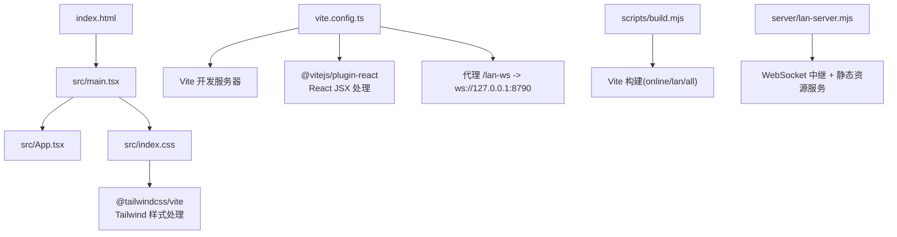
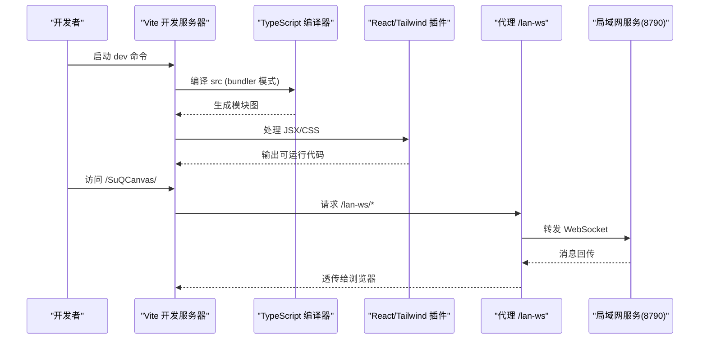
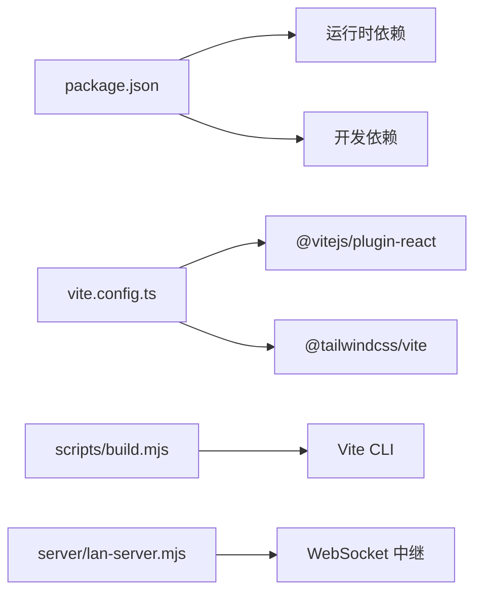

# 开发构建配置

<cite>
**本文引用的文件**
- [vite.config.ts](file://vite.config.ts)
- [tsconfig.json](file://tsconfig.json)
- [tsconfig.app.json](file://tsconfig.app.json)
- [tsconfig.node.json](file://tsconfig.node.json)
- [package.json](file://package.json)
- [index.html](file://index.html)
- [src/main.tsx](file://src/main.tsx)
- [src/index.css](file://src/index.css)
- [scripts/build.mjs](file://scripts/build.mjs)
- [scripts/copy-pdfjs-assets.mjs](file://scripts/copy-pdfjs-assets.mjs)
- [server/lan-server.mjs](file://server/lan-server.mjs)
</cite>

## 目录
1. [简介](#简介)
2. [项目结构](#项目结构)
3. [核心组件](#核心组件)
4. [架构总览](#架构总览)
5. [详细组件分析](#详细组件分析)
6. [依赖关系分析](#依赖关系分析)
7. [性能考虑](#性能考虑)
8. [故障排除指南](#故障排除指南)
9. [结论](#结论)
10. [附录](#附录)

## 简介
本文件面向开发者，系统化说明 SuQCanvas 项目的开发构建配置与工作流程。内容覆盖：
- Vite 开发服务器配置（代理、热重载、端口、基础路径等）
- TypeScript 编译配置（模块解析、类型检查、JSX、增量构建等）
- 开发环境依赖与插件（React、Tailwind CSS、测试运行器）
- 构建脚本与多模式打包（在线版/局域网版）
- 调试技巧、性能分析与最佳实践
- 常见问题定位与解决方案

## 项目结构
本项目采用现代前端工程化结构：
- 入口 HTML 位于根目录，挂载 React 应用
- 源码位于 src，按功能域组织（canvas、components、store、sync、media 等）
- 构建与开发配置集中在 vite.config.ts 与 tsconfig.*
- 构建脚本位于 scripts，支持多目标构建与资源预处理
- 局域网协作服务位于 server，提供 WebSocket 中继与静态资源托管

图表来源
- [vite.config.ts:1-21](file://vite.config.ts#L1-L21)
- [index.html:1-21](file://index.html#L1-L21)
- [src/main.tsx:1-6](file://src/main.tsx#L1-L6)
- [src/index.css:1-15](file://src/index.css#L1-L15)
- [scripts/build.mjs:1-94](file://scripts/build.mjs#L1-L94)
- [server/lan-server.mjs:1-50](file://server/lan-server.mjs#L1-L50)

章节来源
- [vite.config.ts:1-21](file://vite.config.ts#L1-L21)
- [package.json:1-52](file://package.json#L1-L52)
- [index.html:1-21](file://index.html#L1-L21)
- [src/main.tsx:1-6](file://src/main.tsx#L1-L6)
- [src/index.css:1-15](file://src/index.css#L1-L15)

## 核心组件
- Vite 开发服务器与插件：启用 React JSX 转换与 Tailwind CSS 处理；配置基础路径与代理；测试环境为 Node。
- TypeScript 编译：应用端与 Node 端分别配置，启用 bundler 模式、ESNext 目标、严格 lint 规则、跳过库检查以提升速度。
- 构建脚本：统一入口，支持交互或命令行选择构建目标（在线版/局域网版/全部），并执行 PDF.js 资源复制与环境变量校验。
- 局域网协作服务：独立 Node 服务，提供 WebSocket 中继、项目持久化、资产存储与 HTTP Range 流式拉取，配合 Vite 构建产物部署。

章节来源
- [vite.config.ts:1-21](file://vite.config.ts#L1-L21)
- [tsconfig.app.json:1-27](file://tsconfig.app.json#L1-L27)
- [tsconfig.node.json:1-24](file://tsconfig.node.json#L1-L24)
- [scripts/build.mjs:1-94](file://scripts/build.mjs#L1-L94)
- [server/lan-server.mjs:1-50](file://server/lan-server.mjs#L1-L50)

## 架构总览
下图展示开发到构建再到局域网服务的整体流程，包括 Vite 开发服务器、代理转发、TypeScript 编译、Tailwind 样式注入以及局域网协作服务。

图表来源
- [vite.config.ts:1-21](file://vite.config.ts#L1-L21)
- [tsconfig.app.json:1-27](file://tsconfig.app.json#L1-L27)
- [server/lan-server.mjs:1-50](file://server/lan-server.mjs#L1-L50)

## 详细组件分析

### Vite 开发服务器配置
- 基础路径：设置为子路径部署友好，便于在反向代理或 CDN 下正确加载静态资源。
- 插件：
  - React：启用 JSX 转换与快速刷新。
  - Tailwind CSS：通过 Vite 插件进行样式处理与主题内联。
- 代理：将 /lan-ws 前缀的 WebSocket 请求转发至本地局域网中继服务（ws://127.0.0.1:8790），实现开发期跨源通信。
- 测试：使用 Vitest，运行环境为 Node。

建议与注意事项
- 若需自定义端口或主机，可通过命令行参数扩展（例如 --host 0.0.0.0 用于局域网访问）。
- 如需更多代理规则，可在 server.proxy 中追加对象条目。

章节来源
- [vite.config.ts:1-21](file://vite.config.ts#L1-L21)
- [package.json:6-21](file://package.json#L6-L21)

### TypeScript 编译配置
- 应用端（tsconfig.app.json）
  - 目标与库：es2023 + DOM，适配现代浏览器能力。
  - 模块系统：esnext，bundler 解析模式，启用 verbatimModuleSyntax、moduleDetection force，确保严格的模块语法。
  - JSX：react-jsx，配合 Vite React 插件。
  - 类型与检查：包含 vite/client 类型；开启 noUnusedLocals、noUnusedParameters、erasableSyntaxOnly、noFallthroughCasesInSwitch 提升代码质量。
  - 增量构建：tsBuildInfoFile 指定缓存位置，skipLibCheck 加速构建。
- Node 端（tsconfig.node.json）
  - 目标：es2023，仅 ES 库。
  - 模块：nodenext，适用于 Node ESM。
  - 类型：@types/node。
  - 同样启用严格 lint 规则与 skipLibCheck。
- 引用聚合（tsconfig.json）
  - 通过 references 聚合 app 与 node 两个子配置，便于 tsc -b 联合构建。

路径映射与模块解析
- 当前未显式配置 paths 别名，但 moduleResolution bundler 已能良好解析相对与包导入。
- 如需引入路径别名，可在 tsconfig.app.json 的 compilerOptions 中添加 paths 并在 Vite 中同步配置 resolve.alias。

章节来源
- [tsconfig.json:1-8](file://tsconfig.json#L1-L8)
- [tsconfig.app.json:1-27](file://tsconfig.app.json#L1-L27)
- [tsconfig.node.json:1-24](file://tsconfig.node.json#L1-L24)

### 构建脚本与多模式打包
- 统一构建脚本（scripts/build.mjs）
  - 支持三种模式：online（在线版）、lan（局域网版）、all（两者都构建）。
  - 自动调用 Vite 构建，指定 --mode 与 --outDir，清空输出目录。
  - 构建前复制 PDF.js 资源（cmaps、standard_fonts、wasm）到 public/pdfjs，避免运行时缺失。
  - 在线版构建时检测环境变量（如 Supabase URL/Key），缺失则给出警告。
- 预构建任务
  - package.json 的 predev/predev:lan 钩子会先执行 PDF.js 资源复制，保证开发体验一致。
- 产物输出
  - online -> dist
  - lan -> dist-lan

章节来源
- [scripts/build.mjs:1-94](file://scripts/build.mjs#L1-L94)
- [scripts/copy-pdfjs-assets.mjs:1-20](file://scripts/copy-pdfjs-assets.mjs#L1-L20)
- [package.json:6-21](file://package.json#L6-L21)

### 局域网协作服务（开发期代理目标）
- 角色：作为 Vite 开发服务器的代理目标，提供 WebSocket 中继与静态资源服务。
- 关键能力
  - WebSocket：连接后广播用户列表、项目列表，支持加入/离开房间、项目保存/删除、备份恢复。
  - 资产存储：以安全 ID 命名，分片写入临时文件后原子重命名，避免并发写入损坏。
  - HTTP Range 流式拉取：对视频等大文件支持 Range 请求，边下边播，减少内存占用。
  - 维护任务：定期清理过期备份与孤儿资产，释放磁盘空间。
- 与 Vite 的关系
  - 开发期通过 /lan-ws 代理转发 WebSocket 到 8790 端口，无需修改前端代码即可联调。

章节来源
- [server/lan-server.mjs:1-50](file://server/lan-server.mjs#L1-L50)
- [server/lan-server.mjs:291-447](file://server/lan-server.mjs#L291-L447)
- [server/lan-server.mjs:661-756](file://server/lan-server.mjs#L661-L756)

### 样式与主题集成（Tailwind CSS）
- 通过 @tailwindcss/vite 插件在 Vite 管线中处理样式。
- 在 src/index.css 中使用 @import 'tailwindcss' 并定义主题变量，支持明暗主题切换。
- 与 React 组件结合，利用 Tailwind 类名快速构建界面。

章节来源
- [src/index.css:1-15](file://src/index.css#L1-L15)
- [vite.config.ts:1-21](file://vite.config.ts#L1-L21)

## 依赖关系分析
- 运行时依赖
  - React、React-DOM：UI 框架。
  - @xyflow/react：画布节点编辑。
  - pdfjs-dist：PDF 渲染（构建前复制资源）。
  - supabase、ali-oss、dexie、zustand：云同步、对象存储、IndexedDB、状态管理。
- 开发依赖
  - vite、@vitejs/plugin-react、@tailwindcss/vite：开发与样式处理。
  - typescript、vitest、oxlint：类型检查、测试、代码质量。
  - fake-indexeddb：测试环境模拟 IndexedDB。

图表来源
- [package.json:22-50](file://package.json#L22-L50)
- [vite.config.ts:1-21](file://vite.config.ts#L1-L21)
- [scripts/build.mjs:54-64](file://scripts/build.mjs#L54-L64)
- [server/lan-server.mjs:449-451](file://server/lan-server.mjs#L449-L451)

章节来源
- [package.json:22-50](file://package.json#L22-L50)
- [vite.config.ts:1-21](file://vite.config.ts#L1-L21)
- [scripts/build.mjs:54-64](file://scripts/build.mjs#L54-L64)

## 性能考虑
- 构建与类型检查
  - 使用 skipLibCheck 与 tsBuildInfoFile 加速增量构建。
  - 启用 bundler 模式与 verbatimModuleSyntax，减少不必要的转译开销。
- 开发体验
  - 使用 Vite 原生热重载与 React 插件的快速刷新，提高迭代效率。
  - 通过代理集中转发 WebSocket，避免跨源问题导致的额外开销。
- 大文件与媒体
  - 局域网服务对视频等资源采用 HTTP Range 流式传输，降低内存峰值。
  - 构建前复制 PDF.js 资源，避免运行时网络请求失败影响首屏。

[本节为通用指导，不直接分析具体文件]

## 故障排除指南
- 开发服务器无法访问局域网服务
  - 确认 Vite 代理 /lan-ws 是否指向正确的 ws://127.0.0.1:8790。
  - 检查防火墙是否放行 8790 与 5174 端口（Windows 可使用提供的脚本）。
  - 若使用反向代理，确保 WebSocket Upgrade 头被正确透传。
- 构建时报错缺少 PDF.js 资源
  - 确保执行了 predev 或构建脚本中的资源复制步骤。
  - 检查 public/pdfjs 目录下是否存在 cmaps、standard_fonts、wasm。
- 在线版构建提示环境变量缺失
  - 在 .env.online.local 中配置 VITE_SUPABASE_URL 与 VITE_SUPABASE_ANON_KEY。
  - 构建脚本会在非 TTY 环境下默认构建全部，注意按需选择。
- 局域网协作异常
  - 查看 server/lan-server.mjs 日志，确认项目持久化与资产落盘成功。
  - 对于大视频，优先使用 HTTP Range 拉取而非整份 WebSocket 下发，避免打满带宽。
- 样式未生效
  - 确认 src/index.css 引入了 tailwindcss，且 Vite 插件已启用。
  - 检查浏览器控制台是否有 CSS 加载错误。

章节来源
- [vite.config.ts:9-16](file://vite.config.ts#L9-L16)
- [scripts/copy-pdfjs-assets.mjs:1-20](file://scripts/copy-pdfjs-assets.mjs#L1-L20)
- [scripts/build.mjs:31-52](file://scripts/build.mjs#L31-L52)
- [server/lan-server.mjs:291-447](file://server/lan-server.mjs#L291-L447)

## 结论
本项目基于 Vite + TypeScript + React + Tailwind CSS 的现代前端栈，配合统一的构建脚本与独立的局域网协作服务，实现了高效的开发与稳定的协作体验。通过合理的代理、类型配置与构建优化，能够在保持开发速度的同时保障生产质量。建议在团队内遵循本文的最佳实践，持续完善环境与脚本，以获得更流畅的开发与交付流程。

[本节为总结性内容，不直接分析具体文件]

## 附录
- 常用命令
  - 开发：npm run dev
  - 局域网开发：npm run dev:lan
  - 构建：npm run build（可选择 online/lan/all）
  - 预览：npm run preview
  - 测试：npm run test
  - 代码检查：npm run lint
- 环境变量
  - 在线版：VITE_SUPABASE_URL、VITE_SUPABASE_ANON_KEY（可选，缺失会警告）
  - 局域网服务：PORT、LAN_DATA_DIR、LAN_WEB_ROOT（默认值见服务脚本）

章节来源
- [package.json:6-21](file://package.json#L6-L21)
- [scripts/build.mjs:31-52](file://scripts/build.mjs#L31-L52)
- [server/lan-server.mjs:13-23](file://server/lan-server.mjs#L13-L23)