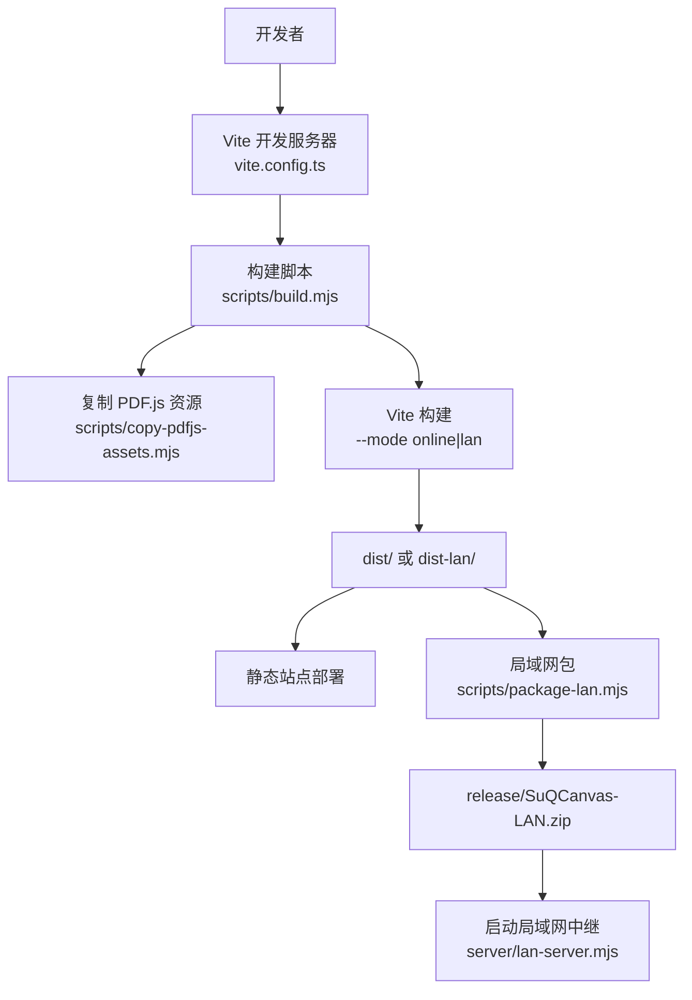
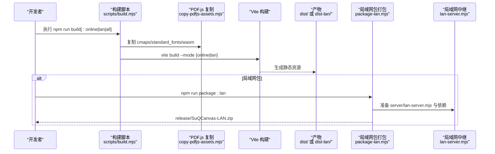
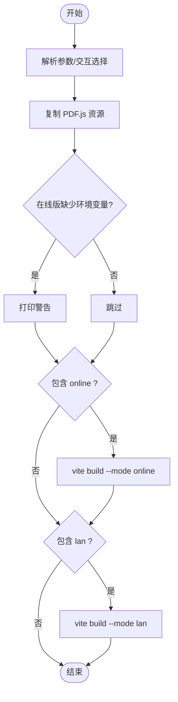
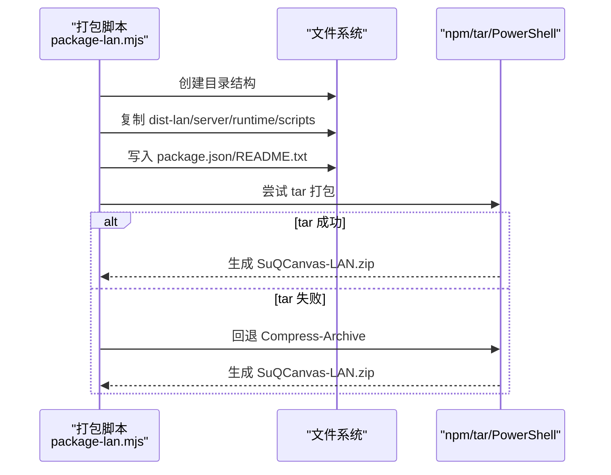
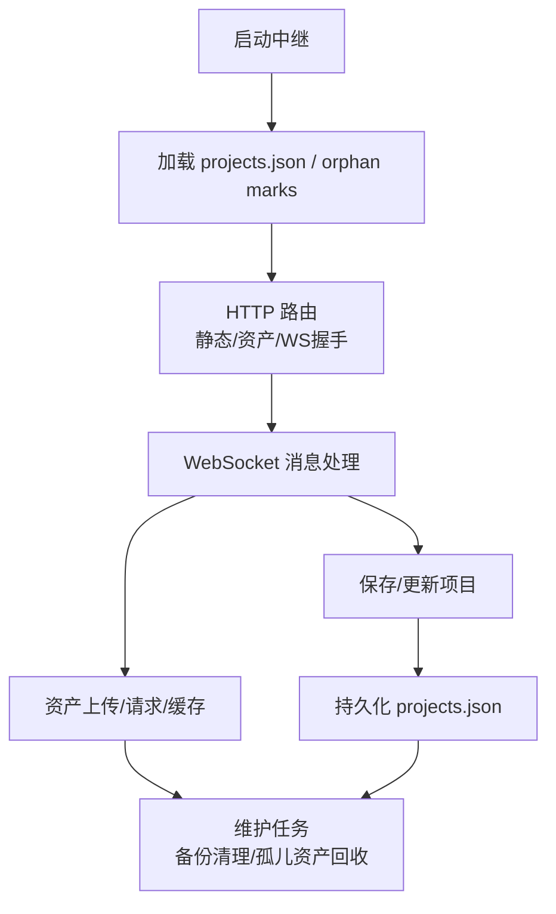
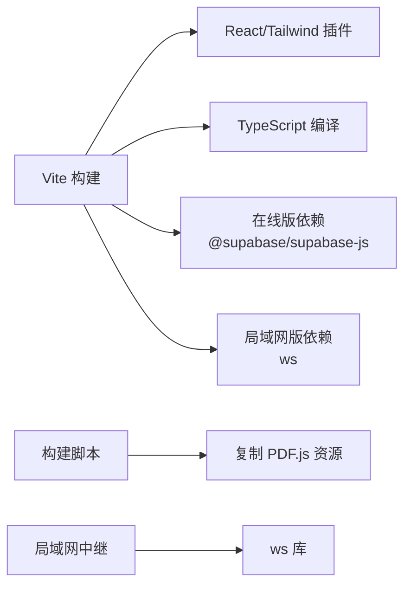

# 构建与部署

<cite>
**本文引用的文件**
- [vite.config.ts](file://vite.config.ts)
- [package.json](file://package.json)
- [scripts/build.mjs](file://scripts/build.mjs)
- [scripts/copy-pdfjs-assets.mjs](file://scripts/copy-pdfjs-assets.mjs)
- [scripts/package-lan.mjs](file://scripts/package-lan.mjs)
- [scripts/start-lan.ps1](file://scripts/start-lan.ps1)
- [start-lan.bat](file://start-lan.bat)
- [server/lan-server.mjs](file://server/lan-server.mjs)
- [src/buildMode.ts](file://src/buildMode.ts)
- [src/sync/supabaseClient.ts](file://src/sync/supabaseClient.ts)
- [README.md](file://README.md)
</cite>

## 目录
1. [简介](#简介)
2. [项目结构](#项目结构)
3. [核心组件](#核心组件)
4. [架构总览](#架构总览)
5. [详细组件分析](#详细组件分析)
6. [依赖关系分析](#依赖关系分析)
7. [性能考量](#性能考量)
8. [故障排查指南](#故障排查指南)
9. [结论](#结论)
10. [附录](#附录)

## 简介
本指南面向生产环境，覆盖 Vite 构建配置、开发服务器、在线版与局域网版的差异化构建、PDF.js 资源复制、包打包自动化流程，以及静态站点部署、Node.js 服务器部署、Docker 容器化方案。同时给出环境变量配置、域名绑定、SSL 证书配置建议，并补充性能监控、错误追踪、日志收集等运维实践。

## 项目结构
- 前端工程基于 Vite + React + Tailwind CSS，通过多模式构建输出不同产物：
  - 在线版：用于云端同步（Supabase），默认 base 路径为 /SuQCanvas/。
  - 局域网版：内置协作中继服务，提供 WebSocket 实时协作与素材流式传输。
- 构建脚本位于 scripts 目录，负责 PDF.js 资源复制、多目标构建、局域网包打包。
- 局域网中继服务位于 server/lan-server.mjs，提供 HTTP 静态资源与 WebSocket 协作能力。

图表来源
- [vite.config.ts:6-16](file://vite.config.ts#L6-L16)
- [scripts/build.mjs:17-64](file://scripts/build.mjs#L17-L64)
- [scripts/copy-pdfjs-assets.mjs:5-18](file://scripts/copy-pdfjs-assets.mjs#L5-L18)
- [scripts/package-lan.mjs:6-26](file://scripts/package-lan.mjs#L6-L26)
- [server/lan-server.mjs:13-23](file://server/lan-server.mjs#L13-L23)

章节来源
- [vite.config.ts:6-16](file://vite.config.ts#L6-L16)
- [package.json:6-20](file://package.json#L6-L20)

## 核心组件
- Vite 配置：定义 base 路径、插件、开发代理、测试环境。
- 构建脚本：支持交互或命令行选择构建目标（online/lan/all），自动复制 PDF.js 资源，按模式调用 Vite 构建。
- 局域网包打包：将 dist-lan、中继服务、必要运行时与脚本打包成可分发 ZIP。
- 局域网中继：HTTP 静态服务 + WebSocket 协作 + 资产流式拉取 + 维护任务（备份清理、孤儿资产回收）。
- 构建模式开关：通过 VITE_BUILD_TARGET 控制在线/局域网分支，实现摇树裁剪。

章节来源
- [vite.config.ts:6-16](file://vite.config.ts#L6-L16)
- [scripts/build.mjs:17-94](file://scripts/build.mjs#L17-L94)
- [scripts/package-lan.mjs:6-65](file://scripts/package-lan.mjs#L6-L65)
- [server/lan-server.mjs:13-23](file://server/lan-server.mjs#L13-L23)
- [src/buildMode.ts:1-8](file://src/buildMode.ts#L1-L8)

## 架构总览
下图展示从构建到部署的端到端流程，包括在线版与局域网版的差异点。

图表来源
- [scripts/build.mjs:22-64](file://scripts/build.mjs#L22-L64)
- [scripts/copy-pdfjs-assets.mjs:5-18](file://scripts/copy-pdfjs-assets.mjs#L5-L18)
- [scripts/package-lan.mjs:18-26](file://scripts/package-lan.mjs#L18-L26)
- [server/lan-server.mjs:13-23](file://server/lan-server.mjs#L13-L23)

## 详细组件分析

### Vite 构建配置
- base 路径设置为 /SuQCanvas/，便于在子路径下部署。
- 启用 React 与 Tailwind CSS 插件。
- 开发服务器配置了 /lan-ws 的 WebSocket 代理，指向本地 8790 端口，便于开发时联调局域网中继。
- 测试环境使用 node。

优化建议
- 生产构建可通过 Vite 默认优化（代码分割、Tree-shaking）获得良好体积；如需进一步定制，可在 plugins 中按需添加压缩、分包策略。
- 若部署到非根路径，确保 base 与实际部署路径一致。

章节来源
- [vite.config.ts:6-16](file://vite.config.ts#L6-L16)

### 构建脚本工作原理
- 支持三种模式：
  - online：构建在线版，输出至 dist/。
  - lan：构建局域网版，输出至 dist-lan/。
  - all：两者都构建。
- 自动复制 PDF.js 资源到 public/pdfjs，供浏览器端加载。
- 在线版构建前检查 Supabase 环境变量是否缺失并给出警告。
- 通过 spawnSync 调用 Vite 构建，传入 --mode 与 --outDir。

图表来源
- [scripts/build.mjs:17-94](file://scripts/build.mjs#L17-L94)

章节来源
- [scripts/build.mjs:17-94](file://scripts/build.mjs#L17-L94)
- [scripts/copy-pdfjs-assets.mjs:5-18](file://scripts/copy-pdfjs-assets.mjs#L5-L18)

### 局域网包打包流程
- 清理并创建 release/SuQCanvas-LAN 目录结构。
- 复制 dist-lan、中继服务、ws 依赖、runtime/node.exe、启动脚本与防火墙脚本。
- 生成最小 package.json 与 README.txt。
- 优先使用 tar 打包，失败则回退到 PowerShell Compress-Archive。

图表来源
- [scripts/package-lan.mjs:6-65](file://scripts/package-lan.mjs#L6-L65)

章节来源
- [scripts/package-lan.mjs:6-65](file://scripts/package-lan.mjs#L6-L65)

### 局域网中继服务
- 监听端口与环境变量：
  - PORT：默认 8790。
  - LAN_DATA_DIR：数据目录，默认 server/data。
  - LAN_WEB_ROOT：Web 根目录，默认 dist-lan。
- 提供：
  - 静态资源服务（/SuQCanvas/ 前缀）。
  - 资产流式拉取（支持 Range，视频边下边播）。
  - WebSocket 协作（加入/离开房间、项目保存、删除、备份恢复、用户列表广播等）。
- 维护任务：
  - 定期清理过期备份（默认 24 小时）。
  - 标记并清理未被任何项目引用的孤儿资产（同样保留 24 小时）。

图表来源
- [server/lan-server.mjs:13-23](file://server/lan-server.mjs#L13-L23)
- [server/lan-server.mjs:43-83](file://server/lan-server.mjs#L43-L83)
- [server/lan-server.mjs:107-205](file://server/lan-server.mjs#L107-L205)
- [server/lan-server.mjs:326-447](file://server/lan-server.mjs#L326-L447)
- [server/lan-server.mjs:661-800](file://server/lan-server.mjs#L661-L800)

章节来源
- [server/lan-server.mjs:13-23](file://server/lan-server.mjs#L13-L23)
- [server/lan-server.mjs:107-205](file://server/lan-server.mjs#L107-L205)
- [server/lan-server.mjs:326-447](file://server/lan-server.mjs#L326-L447)
- [server/lan-server.mjs:661-800](file://server/lan-server.mjs#L661-L800)

### 构建模式与条件编译
- 通过 VITE_BUILD_TARGET 区分在线版与局域网版：
  - IS_LAN_BUILD：是否为局域网构建。
  - IS_ONLINE_BUILD：是否为在线构建。
- 在线版客户端根据环境变量初始化 Supabase 客户端；局域网版构建会移除相关依赖以减小体积。

章节来源
- [src/buildMode.ts:1-8](file://src/buildMode.ts#L1-L8)
- [src/sync/supabaseClient.ts:1-17](file://src/sync/supabaseClient.ts#L1-L17)

## 依赖关系分析
- 构建期依赖：
  - Vite、React 插件、Tailwind 插件。
  - TypeScript 编译（tsc -b）。
- 运行期依赖：
  - 在线版：Supabase 客户端（仅在线构建引入）。
  - 局域网版：ws 库用于 WebSocket 通信。
- 外部资源：
  - PDF.js 的 cmaps、standard_fonts、wasm 需复制到 public/pdfjs。

图表来源
- [package.json:22-49](file://package.json#L22-L49)
- [scripts/copy-pdfjs-assets.mjs:5-18](file://scripts/copy-pdfjs-assets.mjs#L5-L18)
- [server/lan-server.mjs:11](file://server/lan-server.mjs#L11)

章节来源
- [package.json:22-49](file://package.json#L22-L49)

## 性能考量
- 构建优化
  - 使用 Vite 默认优化（代码分割、Tree-shaking）。
  - 通过构建模式裁剪不必要的依赖（如在线版才引入 Supabase）。
- 资源优化
  - PDF.js 资源预复制到 public/pdfjs，避免运行时下载开销。
  - 局域网中继对大视频采用 HTTP Range 流式拉取，减少内存占用与带宽压力。
- 运行时优化
  - 局域网启动脚本提升 Node.js 堆大小限制，以应对大文件或高并发场景。
  - 资产与项目持久化采用异步队列与合并写，降低磁盘抖动。

[本节为通用性能建议，不直接分析具体文件]

## 故障排查指南
- 构建阶段
  - 未检测到在线版环境变量：构建脚本会提示缺少 VITE_SUPABASE_URL/VITE_SUPABASE_ANON_KEY，需在 .env.online.local 中配置后重新构建。
  - PDF.js 资源缺失：确保执行 predev 或构建前复制脚本，否则浏览器端无法渲染 PDF。
- 开发阶段
  - WebSocket 连接失败：确认开发代理 /lan-ws 已正确转发到 ws://127.0.0.1:8790。
- 局域网部署
  - 防火墙拦截：首次启动可能弹出 Windows 防火墙提示，允许 TCP 8790 入站规则。
  - 数据目录不可写：检查 LAN_DATA_DIR 权限，确保可读写。
  - 静态资源缺失：确保先执行构建生成 dist-lan，再启动中继。
- 生产环境
  - HTTPS 页面无法连接 ws://：需通过反向代理将 wss://域名/lan-ws 转发到内网 8790。
  - 跨域问题：确保资产访问返回 CORS 头，或在反向代理层设置。

章节来源
- [scripts/build.mjs:43-52](file://scripts/build.mjs#L43-L52)
- [scripts/copy-pdfjs-assets.mjs:5-18](file://scripts/copy-pdfjs-assets.mjs#L5-L18)
- [vite.config.ts:9-16](file://vite.config.ts#L9-L16)
- [scripts/start-lan.ps1:16-20](file://scripts/start-lan.ps1#L16-L20)
- [server/lan-server.mjs:326-447](file://server/lan-server.mjs#L326-L447)
- [README.md:98-120](file://README.md#L98-L120)

## 结论
本项目提供了完善的构建与部署体系：通过 Vite 多模式构建区分在线版与局域网版，配合自动化脚本完成资源复制与包打包；局域网中继具备完整的协作能力与资源管理能力。生产环境可按需选择静态站点或 Node.js 服务器部署，并结合反向代理与 SSL 实现安全访问。建议在 CI/CD 中固化构建流程，结合监控与日志完善运维闭环。

[本节为总结性内容，不直接分析具体文件]

## 附录

### 环境变量清单
- 构建期
  - VITE_BUILD_TARGET：构建目标（lan 或 online），由构建脚本注入。
  - VITE_SUPABASE_URL / VITE_SUPABASE_ANON_KEY：在线版登录与云同步所需。
- 运行期（局域网中继）
  - PORT：默认 8790。
  - LAN_DATA_DIR：默认 server/data。
  - LAN_WEB_ROOT：默认 dist-lan。
  - NODE_OPTIONS：建议设置 --max-old-space-size=8192 以提升内存上限。

章节来源
- [src/buildMode.ts:1-8](file://src/buildMode.ts#L1-L8)
- [scripts/build.mjs:31-52](file://scripts/build.mjs#L31-L52)
- [server/lan-server.mjs:13-23](file://server/lan-server.mjs#L13-L23)
- [scripts/start-lan.ps1:38-43](file://scripts/start-lan.ps1#L38-L43)

### 构建与发布命令
- 开发
  - npm run dev：开发服务器（在线版）。
  - npm run dev:lan：局域网开发（host 0.0.0.0，端口 5173，代理 /lan-ws 到 8790）。
- 构建
  - npm run build：TypeScript 编译 + 构建全部（online/lan）。
  - npm run build:online：仅在线版 -> dist/。
  - npm run build:lan：仅局域网版 -> dist-lan/。
  - npm run package:lan：构建局域网版并打包 release/SuQCanvas-LAN.zip。
- 运行
  - npm run lan：启动局域网中继。
  - npm run lan:open：打开 Windows 防火墙规则（8790）。

章节来源
- [package.json:6-20](file://package.json#L6-L20)
- [scripts/build.mjs:17-94](file://scripts/build.mjs#L17-L94)
- [scripts/package-lan.mjs:6-65](file://scripts/package-lan.mjs#L6-L65)

### 部署方案

#### 静态站点部署（在线版）
- 将 dist/ 部署到任意静态托管（例如 CDN、对象存储、Nginx 子路径）。
- 确保 base 路径与部署路径一致（/SuQCanvas/）。
- 配置域名与 HTTPS，并在后端或网关层代理 Supabase 接口（如有需要）。

章节来源
- [vite.config.ts:6-8](file://vite.config.ts#L6-L8)

#### Node.js 服务器部署（局域网版）
- 安装依赖：npm ci --omit=dev。
- 启动中继：npm run lan 或通过 PM2 守护进程。
- 数据目录：默认 server/data，可通过 LAN_DATA_DIR 指定到其他盘符或网络路径。
- 防火墙：Windows 首次运行放行 8790 端口。

章节来源
- [README.md:62-94](file://README.md#L62-L94)
- [scripts/start-lan.ps1:16-20](file://scripts/start-lan.ps1#L16-L20)
- [server/lan-server.mjs:13-23](file://server/lan-server.mjs#L13-L23)

#### Docker 容器化建议
- 镜像选择
  - 在线版：仅静态资源，可使用 Nginx 镜像。
  - 局域网版：Node.js 镜像，暴露 8790 端口，挂载数据卷到 server/data。
- 环境变量
  - PORT、LAN_DATA_DIR、NODE_OPTIONS。
- 反向代理
  - 在容器外使用 Nginx/Caddy 将 wss://域名/lan-ws 转发到容器内 8790。
- 健康检查与日志
  - 健康检查：curl http://localhost:8790/SuQCanvas/。
  - 日志：stdout/stderr 输出，可由容器编排系统收集。

[本节为通用部署建议，不直接分析具体文件]

### 域名绑定与 SSL 配置
- 推荐通过反向代理（Nginx/Caddy）统一入口：
  - 静态站点：/SuQCanvas/ 映射到 dist/。
  - WebSocket：/lan-ws 转发到 ws://127.0.0.1:8790。
  - 资产访问：/SuQCanvas/assets/ 转发到 8790（保证 CORS 头）。
- SSL 证书
  - 使用 Let's Encrypt 或商业证书，配置 HTTPS。
  - 确保浏览器侧通过 wss:// 连接，避免混合内容问题。

章节来源
- [README.md:98-120](file://README.md#L98-L120)

### 运维建议
- 性能监控
  - 前端：接入性能埋点（首屏时间、资源加载耗时、错误率）。
  - 服务端：监控 CPU/内存/磁盘 IO，关注大文件传输时的内存峰值。
- 错误追踪
  - 前端：接入错误上报（如 Sentry），捕获 JS 异常与资源加载失败。
  - 服务端：集中日志（JSON 格式），按模块与级别分类。
- 日志收集
  - 使用容器编排系统（Kubernetes/Docker Compose）收集 stdout/stderr。
  - 定期归档与轮转，避免磁盘占满。
- 备份与恢复
  - 定期备份 server/data/projects.json 与 assets/。
  - 利用中继内置的 24 小时备份机制进行快速恢复。

[本节为通用运维建议，不直接分析具体文件]