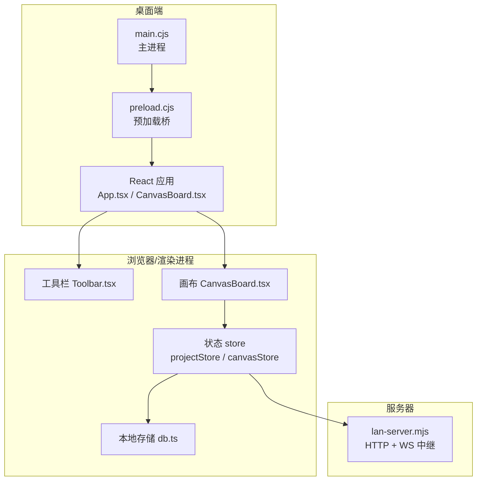
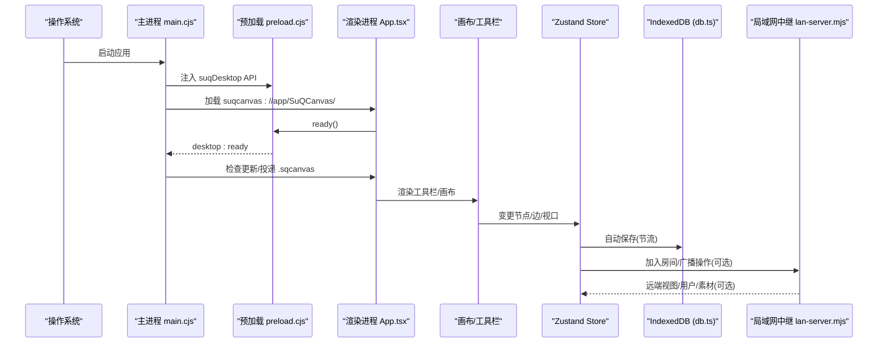
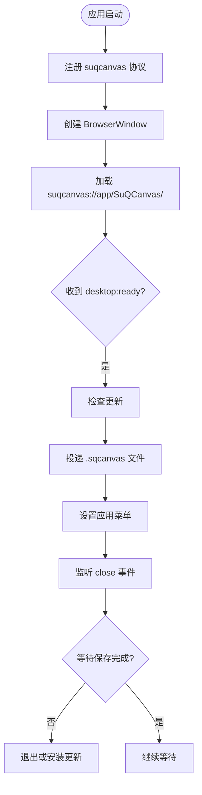
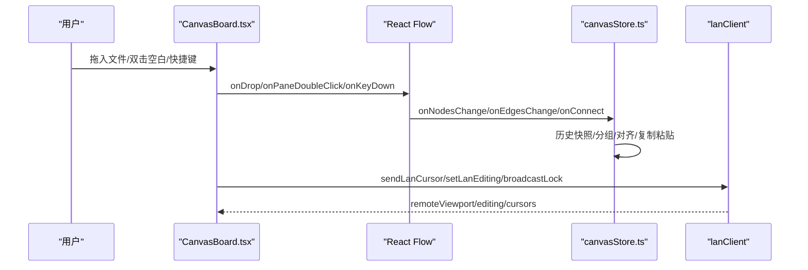
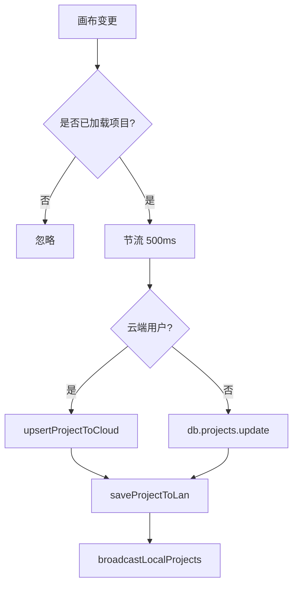
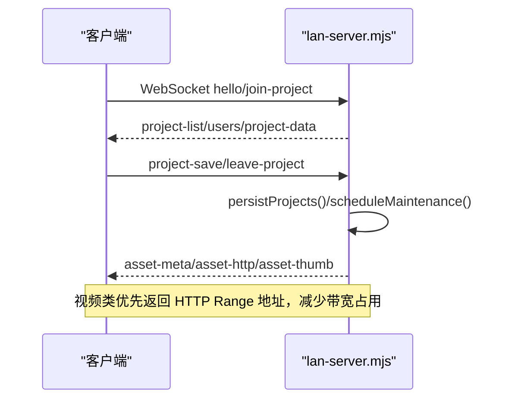
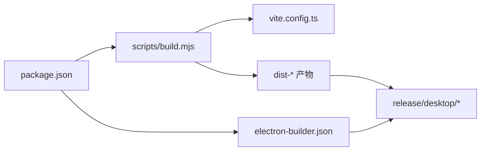

# 桌面应用程序

<cite>
**本文引用的文件**
- [README.md](file://README.md)
- [package.json](file://package.json)
- [vite.config.ts](file://vite.config.ts)
- [scripts/build.mjs](file://scripts/build.mjs)
- [src/main.tsx](file://src/main.tsx)
- [src/App.tsx](file://src/App.tsx)
- [src/types.ts](file://src/types.ts)
- [src/canvas/CanvasBoard.tsx](file://src/canvas/CanvasBoard.tsx)
- [src/components/Toolbar.tsx](file://src/components/Toolbar.tsx)
- [src/store/projectStore.ts](file://src/store/projectStore.ts)
- [src/store/canvasStore.ts](file://src/store/canvasStore.ts)
- [src/db/db.ts](file://src/db/db.ts)
- [desktop/main.cjs](file://desktop/main.cjs)
- [desktop/preload.cjs](file://desktop/preload.cjs)
- [electron-builder.json](file://electron-builder.json)
- [server/lan-server.mjs](file://server/lan-server.mjs)
</cite>

## 目录
1. [简介](#简介)
2. [项目结构](#项目结构)
3. [核心组件](#核心组件)
4. [架构总览](#架构总览)
5. [详细组件分析](#详细组件分析)
6. [依赖关系分析](#依赖关系分析)
7. [性能考量](#性能考量)
8. [故障排查指南](#故障排查指南)
9. [结论](#结论)
10. [附录](#附录)

## 简介
SuQCanvas 是一款基于浏览器的无限画布应用，支持图片、视频、音频、PDF、Markdown、文本等多媒体元素在同一张画布上组织与连线，并提供本地自动保存、项目管理、导出导入、主题切换等能力。桌面版基于 Electron 构建，提供离线项目、云端同步（可选）、局域网协作（可选）以及自动更新等功能。

## 项目结构
- 前端 React + TypeScript + Vite：负责画布渲染、交互、状态管理、媒体处理、导入导出、AI 生图等。
- 桌面端 Electron：主进程负责窗口、协议、菜单、IPC、自动更新；预加载脚本暴露安全桥接 API 给渲染进程。
- 服务端 Node.js：局域网协作中继服务，提供 WebSocket 实时通信、HTTP 静态资源与素材流式拉取、项目持久化与清理维护。
- 构建与打包：Vite 多目标构建（在线版/局域网版/桌面版），Electron Builder 生成 Windows 安装包并关联 .sqcanvas 文件。

**图表来源**
- [desktop/main.cjs:1-156](file://desktop/main.cjs#L1-L156)
- [desktop/preload.cjs:1-17](file://desktop/preload.cjs#L1-L17)
- [src/App.tsx:1-81](file://src/App.tsx#L1-L81)
- [src/canvas/CanvasBoard.tsx:1-527](file://src/canvas/CanvasBoard.tsx#L1-L527)
- [src/components/Toolbar.tsx:1-426](file://src/components/Toolbar.tsx#L1-L426)
- [src/store/projectStore.ts:1-230](file://src/store/projectStore.ts#L1-L230)
- [src/store/canvasStore.ts:1-547](file://src/store/canvasStore.ts#L1-L547)
- [src/db/db.ts:1-114](file://src/db/db.ts#L1-L114)
- [server/lan-server.mjs:1-800](file://server/lan-server.mjs#L1-L800)

**章节来源**
- [README.md:1-228](file://README.md#L1-L228)
- [package.json:1-61](file://package.json#L1-L61)
- [vite.config.ts:1-28](file://vite.config.ts#L1-L28)
- [scripts/build.mjs:1-106](file://scripts/build.mjs#L1-L106)

## 核心组件
- 桌面主进程：注册自定义协议 suqcanvas://，加载 dist-desktop 资源，设置 CSP，创建 BrowserWindow，处理菜单、打开 .sqcanvas 文件、自动更新、关闭保护、数据目录打开等。
- 预加载桥：向渲染进程暴露 suqDesktop API（ready、aiRequest、onOpenProject、onBeforeClose、closeReady、saveFile、showDataDirectory）。
- 应用入口：根据构建模式设置标题，初始化认证与项目，LAN 模式下自动重连与初始化同步。
- 画布与工具栏：基于 @xyflow/react 的无限画布，支持拖拽导入、双击新建文本、快捷键、对齐参考线、视图控制、AI 占位插入、局域网光标与编辑锁定。
- 状态与存储：Zustand 管理画布与项目状态；Dexie 持久化资产与项目；自动保存节流；云端/局域网/本地多路落盘。
- 局域网中继：WebSocket 房间级协作，HTTP 静态资源与素材 Range 流式拉取，项目持久化，备份与孤儿素材回收。

**章节来源**
- [desktop/main.cjs:1-156](file://desktop/main.cjs#L1-L156)
- [desktop/preload.cjs:1-17](file://desktop/preload.cjs#L1-L17)
- [src/main.tsx:1-9](file://src/main.tsx#L1-L9)
- [src/App.tsx:1-81](file://src/App.tsx#L1-L81)
- [src/canvas/CanvasBoard.tsx:1-527](file://src/canvas/CanvasBoard.tsx#L1-L527)
- [src/components/Toolbar.tsx:1-426](file://src/components/Toolbar.tsx#L1-L426)
- [src/store/projectStore.ts:1-230](file://src/store/projectStore.ts#L1-L230)
- [src/store/canvasStore.ts:1-547](file://src/store/canvasStore.ts#L1-L547)
- [src/db/db.ts:1-114](file://src/db/db.ts#L1-L114)
- [server/lan-server.mjs:1-800](file://server/lan-server.mjs#L1-L800)

## 架构总览
桌面应用采用“主进程 + 渲染进程”的双进程模型，渲染进程通过预加载桥调用主进程能力；画布层基于 React Flow，状态由 Zustand 管理，数据落盘使用 Dexie IndexedDB；可选接入局域网中继进行协作与持久化；构建阶段按目标输出不同产物。

**图表来源**
- [desktop/main.cjs:50-153](file://desktop/main.cjs#L50-L153)
- [desktop/preload.cjs:1-17](file://desktop/preload.cjs#L1-L17)
- [src/App.tsx:21-44](file://src/App.tsx#L21-L44)
- [src/canvas/CanvasBoard.tsx:391-489](file://src/canvas/CanvasBoard.tsx#L391-L489)
- [src/store/projectStore.ts:46-67](file://src/store/projectStore.ts#L46-L67)
- [src/db/db.ts:61-77](file://src/db/db.ts#L61-L77)
- [server/lan-server.mjs:668-800](file://server/lan-server.mjs#L668-L800)

## 详细组件分析

### 桌面主进程与预加载桥
- 自定义协议 suqcanvas:// 安全加载 dist-desktop 资源，限制导航与外链打开。
- 单实例锁，二次启动时聚焦窗口并投递 .sqcanvas 文件。
- 菜单集成导入项目、打开数据目录、帮助中的检查更新与关于。
- 关闭流程：先通知渲染进程等待保存完成，再决定是否安装更新或退出。
- 预加载桥暴露 AI 请求、项目打开、保存文件、数据目录等能力。

**图表来源**
- [desktop/main.cjs:10-153](file://desktop/main.cjs#L10-L153)
- [desktop/preload.cjs:8-16](file://desktop/preload.cjs#L8-L16)

**章节来源**
- [desktop/main.cjs:1-156](file://desktop/main.cjs#L1-L156)
- [desktop/preload.cjs:1-17](file://desktop/preload.cjs#L1-L17)

### 应用入口与页面路由
- 根据构建模式设置窗口标题。
- 初始化认证与项目列表，LAN 模式自动重连与初始化同步。
- 登录后进入画布界面，挂载工具栏、画布、各类查看器与全局播放器。
- 桌面模式挂载生命周期组件以处理关闭与更新。

**章节来源**
- [src/main.tsx:1-9](file://src/main.tsx#L1-L9)
- [src/App.tsx:1-81](file://src/App.tsx#L1-L81)

### 画布与交互
- 基于 React Flow 实现无限画布，支持缩放、平移、框选、连线、对齐参考线、右键菜单插入 AI 占位等。
- 键盘快捷键：撤销/重做、全选、复制、粘贴、适应视图、工具切换（选择/连线/拖动）、空格临时平移。
- 拖拽导入文件到画布，双击空白新增文本节点。
- 局域网协作：光标位置广播、编辑锁定、跟随远端视口。

**图表来源**
- [src/canvas/CanvasBoard.tsx:76-150](file://src/canvas/CanvasBoard.tsx#L76-L150)
- [src/canvas/CanvasBoard.tsx:152-241](file://src/canvas/CanvasBoard.tsx#L152-L241)
- [src/canvas/CanvasBoard.tsx:258-390](file://src/canvas/CanvasBoard.tsx#L258-L390)
- [src/store/canvasStore.ts:152-241](file://src/store/canvasStore.ts#L152-L241)

**章节来源**
- [src/canvas/CanvasBoard.tsx:1-527](file://src/canvas/CanvasBoard.tsx#L1-L527)
- [src/store/canvasStore.ts:1-547](file://src/store/canvasStore.ts#L1-L547)

### 工具栏与插入面板
- 提供项目名显示、导出、导入、文件管理、搜索、AI 图像面板、插入元素（文本/标题/便签/形状）、工具模式切换、撤销/重做、对齐分布、缩放与适应视图、对齐参考线开关、主题切换等。
- 桌面版额外显示云保存按钮。

**章节来源**
- [src/components/Toolbar.tsx:1-426](file://src/components/Toolbar.tsx#L1-L426)

### 项目与自动保存
- 项目初始化：加载最近项目或重置空画布，安装自动保存监听。
- 自动保存：对 nodes/edges/viewport 变化节流 500ms 后保存，支持云端/本地/局域网多路落盘。
- 新建/重命名/保存：区分登录态写入云端或本地，并广播本地项目列表。

**图表来源**
- [src/store/projectStore.ts:46-67](file://src/store/projectStore.ts#L46-L67)
- [src/store/projectStore.ts:196-228](file://src/store/projectStore.ts#L196-L228)

**章节来源**
- [src/store/projectStore.ts:1-230](file://src/store/projectStore.ts#L1-L230)

### 本地存储与清理
- Dexie 定义 assets、projects、uploadCheckpoints、desktopCloudLinks 表结构及版本迁移。
- 垃圾回收：扫描未被项目引用的素材，标记 orphanedAt，超过 24 小时删除并清理断点记录。

**章节来源**
- [src/db/db.ts:1-114](file://src/db/db.ts#L1-L114)

### 局域网协作与服务端
- 客户端加入房间、接收项目数据、广播操作、同步视口与光标。
- 服务端提供 HTTP 静态资源与素材 Range 流式拉取，避免大文件占用内存；项目持久化到 projects.json；删除项目保留 24 小时备份；定时维护清理孤儿素材。

**图表来源**
- [server/lan-server.mjs:452-454](file://server/lan-server.mjs#L452-L454)
- [server/lan-server.mjs:668-800](file://server/lan-server.mjs#L668-L800)
- [server/lan-server.mjs:329-375](file://server/lan-server.mjs#L329-L375)

**章节来源**
- [server/lan-server.mjs:1-800](file://server/lan-server.mjs#L1-L800)

### 类型与数据结构
- 统一节点与边的类型定义，包含媒体种类、样式、对齐方式、颜色、分组字段等。
- 默认边样式与常用枚举集中管理，便于扩展与一致性。

**章节来源**
- [src/types.ts:1-135](file://src/types.ts#L1-L135)

## 依赖关系分析
- 构建与运行：
  - Vite 配置 base 路径为 /SuQCanvas/，开发代理转发 AI 与局域网 WS。
  - 构建脚本支持 online/lan/desktop/all 多目标输出，桌面版仅注入公开连接配置。
  - Electron Builder 配置产物目录、发布目标、NSIS 安装选项与文件关联。
- 运行时依赖：
  - React Flow 提供画布能力；Zustand 管理状态；Dexie 持久化；ws/ws 用于局域网中继；pdfjs-dist、react-markdown 等用于媒体渲染。

**图表来源**
- [scripts/build.mjs:1-106](file://scripts/build.mjs#L1-L106)
- [vite.config.ts:1-28](file://vite.config.ts#L1-L28)
- [electron-builder.json:1-21](file://electron-builder.json#L1-L21)
- [package.json:1-61](file://package.json#L1-L61)

**章节来源**
- [scripts/build.mjs:1-106](file://scripts/build.mjs#L1-L106)
- [vite.config.ts:1-28](file://vite.config.ts#L1-L28)
- [electron-builder.json:1-21](file://electron-builder.json#L1-L21)
- [package.json:1-61](file://package.json#L1-L61)

## 性能考量
- 自动保存节流：500ms 合并多次变更，降低频繁 I/O。
- 历史快照防抖：400ms 合并快照，减少 past/future 膨胀。
- 局域网素材传输：视频类优先返回 HTTP Range 地址，避免整份数据经 WebSocket 传输造成带宽与内存压力。
- 垃圾回收：24 小时宽限期清理孤儿素材，释放磁盘空间。
- 构建优化：按需引入 PDFJS 资源，分包懒加载。

[本节为通用指导，不直接分析具体文件]

## 故障排查指南
- 无法打开 .sqcanvas 文件：确认主进程已注册 suqcanvas 协议且文件路径合法；检查二次启动时的 second-instance 处理。
- 关闭时卡住：确认渲染进程发送 desktop:before-close 与 close-ready；若未保存成功，会提示错误并阻止退出。
- 自动更新失败：检查 GitHub Releases 草稿与 latest.yml；确保网络可达且签名配置正确（当前未配置签名）。
- 局域网协作异常：检查 ws:// 或 wss:// 反代配置；确认端口 8790 开放或反向代理至 /lan-ws；验证 CORS 与跨域读取封面。
- 素材缺失或封面无法生成：确认 /SuQCanvas/assets/ 被反代到中继；检查资产元数据与二进制文件是否存在。

**章节来源**
- [desktop/main.cjs:86-122](file://desktop/main.cjs#L86-L122)
- [desktop/main.cjs:135-151](file://desktop/main.cjs#L135-L151)
- [server/lan-server.mjs:329-375](file://server/lan-server.mjs#L329-L375)
- [server/lan-server.mjs:600-666](file://server/lan-server.mjs#L600-L666)

## 结论
该桌面应用将 React Flow 的强大画布能力与 Electron 的原生能力结合，提供了离线优先、可拓展的云与局域网协作方案。通过清晰的模块划分与稳健的持久化策略，既能满足个人高效创作，也能支撑团队协作与数据治理。建议在生产环境完善代码签名、强化错误上报与监控，并持续优化大媒体传输与内存占用。

[本节为总结性内容，不直接分析具体文件]

## 附录
- 快速开始与命令：参见 README 中的开发与构建说明。
- 环境变量：在线版需配置 Supabase 公开密钥；桌面版仅注入公开连接配置，避免泄露永久凭证。
- 部署建议：局域网中继建议使用 Nginx 反向代理 wss，并开启必要的 CORS 头以支持封面抓帧。

[本节为补充信息，不直接分析具体文件]